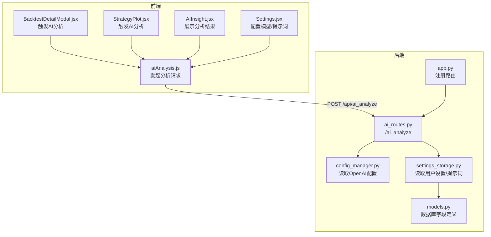
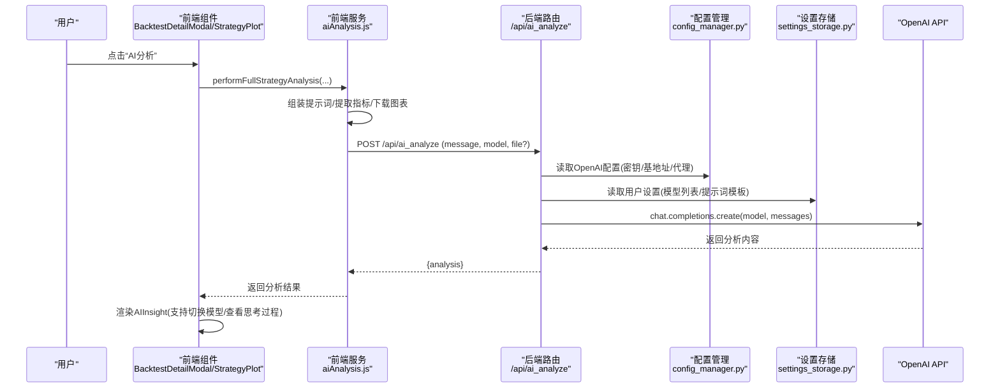
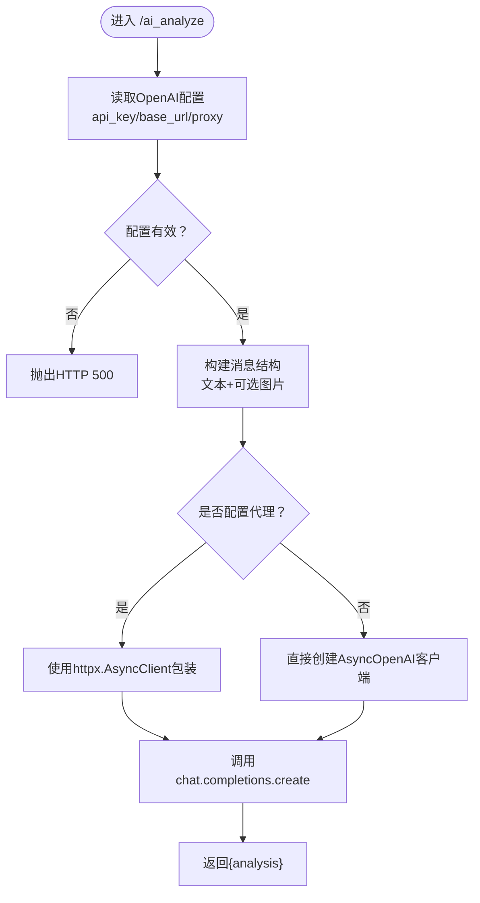
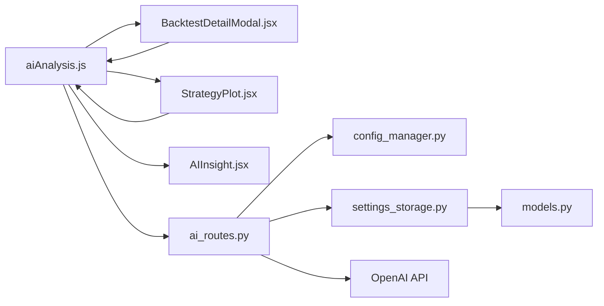

# AI分析数据流

<cite>
**本文引用的文件**
- [ai_routes.py](file://backend/src/routes/ai_routes.py)
- [config_manager.py](file://backend/src/config/config_manager.py)
- [settings_storage.py](file://backend/src/db/settings_storage.py)
- [models.py](file://backend/src/db/models.py)
- [app.py](file://backend/src/service/app.py)
- [aiAnalysis.js](file://frontend/src/services/aiAnalysis.js)
- [AIInsight.jsx](file://frontend/src/components/RunStrategy/AIInsight.jsx)
- [BacktestDetailModal.jsx](file://frontend/src/components/BacktestHistory/BacktestDetailModal.jsx)
- [StrategyPlot.jsx](file://frontend/src/components/RunStrategy/StrategyPlot.jsx)
- [Settings.jsx](file://frontend/src/pages/Settings.jsx)
- [credential_validator.py](file://backend/src/utils/credential_validator.py)
</cite>

## 目录
1. [简介](#简介)
2. [项目结构](#项目结构)
3. [核心组件](#核心组件)
4. [架构总览](#架构总览)
5. [详细组件分析](#详细组件分析)
6. [依赖关系分析](#依赖关系分析)
7. [性能考量](#性能考量)
8. [故障排查指南](#故障排查指南)
9. [结论](#结论)

## 简介
本文件面向“AI分析数据流”的系统化说明，聚焦于后端如何通过FastAPI路由接收前端请求，整合OpenAI API完成回测结果的智能分析，并将分析结果返回给前端；同时阐述前端AIInsight组件如何展示多模型分析结果、支持切换不同AI模型，并可展开查看AI的思考过程。文档还结合BacktestDetailModal说明用户如何触发AI分析，解释提示词工程的设计思路与AI分析结果对用户决策的支持作用。

## 项目结构
围绕AI分析的关键文件分布如下：
- 后端
  - 路由层：/backend/src/routes/ai_routes.py
  - 配置管理：/backend/src/config/config_manager.py
  - 数据持久化：/backend/src/db/settings_storage.py、/backend/src/db/models.py
  - 应用入口：/backend/src/service/app.py
- 前端
  - 服务层：/frontend/src/services/aiAnalysis.js
  - 展示组件：/frontend/src/components/RunStrategy/AIInsight.jsx
  - 触发入口（历史回测）：/frontend/src/components/BacktestHistory/BacktestDetailModal.jsx
  - 触发入口（策略图表）：/frontend/src/components/RunStrategy/StrategyPlot.jsx
  - 设置页面（模型与提示词）：/frontend/src/pages/Settings.jsx

图表来源
- [app.py](file://backend/src/service/app.py#L1-L45)
- [ai_routes.py](file://backend/src/routes/ai_routes.py#L1-L92)
- [config_manager.py](file://backend/src/config/config_manager.py#L110-L131)
- [settings_storage.py](file://backend/src/db/settings_storage.py#L23-L48)
- [models.py](file://backend/src/db/models.py#L629-L637)
- [aiAnalysis.js](file://frontend/src/services/aiAnalysis.js#L1-L195)
- [AIInsight.jsx](file://frontend/src/components/RunStrategy/AIInsight.jsx#L1-L99)
- [BacktestDetailModal.jsx](file://frontend/src/components/BacktestHistory/BacktestDetailModal.jsx#L1-L262)
- [StrategyPlot.jsx](file://frontend/src/components/RunStrategy/StrategyPlot.jsx#L1-L99)
- [Settings.jsx](file://frontend/src/pages/Settings.jsx#L380-L433)

章节来源
- [app.py](file://backend/src/service/app.py#L1-L45)
- [ai_routes.py](file://backend/src/routes/ai_routes.py#L1-L92)
- [aiAnalysis.js](file://frontend/src/services/aiAnalysis.js#L1-L195)

## 核心组件
- 后端路由：/api/ai_analyze 接收文本消息与可选图片，构造OpenAI消息结构，调用AsyncOpenAI完成推理，返回分析结果。
- 配置管理：从数据库/环境变量读取OpenAI API Key与Base URL，支持代理配置。
- 前端服务：封装分析请求，拼装提示词模板，下载图表图像作为分析上下文，支持多模型切换。
- 前端展示：AIInsight组件解析AI输出中的思考过程标记，支持折叠/展开查看。
- 用户交互：BacktestDetailModal与StrategyPlot提供触发按钮，支持在历史回测详情中直接生成AI洞察。

章节来源
- [ai_routes.py](file://backend/src/routes/ai_routes.py#L17-L91)
- [config_manager.py](file://backend/src/config/config_manager.py#L110-L131)
- [aiAnalysis.js](file://frontend/src/services/aiAnalysis.js#L36-L194)
- [AIInsight.jsx](file://frontend/src/components/RunStrategy/AIInsight.jsx#L1-L99)
- [BacktestDetailModal.jsx](file://frontend/src/components/BacktestHistory/BacktestDetailModal.jsx#L1-L262)
- [StrategyPlot.jsx](file://frontend/src/components/RunStrategy/StrategyPlot.jsx#L1-L99)

## 架构总览
下图展示了从前端到后端再到OpenAI的完整数据流，包括错误与限流处理的建议路径。

图表来源
- [aiAnalysis.js](file://frontend/src/services/aiAnalysis.js#L59-L169)
- [ai_routes.py](file://backend/src/routes/ai_routes.py#L17-L91)
- [config_manager.py](file://backend/src/config/config_manager.py#L110-L131)
- [settings_storage.py](file://backend/src/db/settings_storage.py#L23-L48)

## 详细组件分析

### 后端路由：/api/ai_analyze
- 请求参数
  - message: 文本提示
  - model: 模型名称，默认值在后端路由中设定
  - file: 可选图片文件（回测图表）
- 处理流程
  - 读取用户配置（OpenAI Key/Base URL/代理）
  - 构造OpenAI消息结构（文本+可选图片）
  - 使用AsyncOpenAI调用chat.completions.create
  - 返回analysis字段
- 错误处理
  - 当缺少API Key或Base URL时，抛出HTTP 500
  - 其他异常统一包装为HTTP 500

图表来源
- [ai_routes.py](file://backend/src/routes/ai_routes.py#L17-L91)

章节来源
- [ai_routes.py](file://backend/src/routes/ai_routes.py#L17-L91)

### 配置管理：OpenAI配置与代理
- 优先级
  - 数据库用户设置（加密存储）
  - 环境变量（.env）
  - 默认值
- 关键字段
  - OPENAI_API_KEY
  - OPENAI_BASE_URL
  - HTTP_PROXY / HTTPS_PROXY
- 代理支持
  - 若配置代理，使用httpx.AsyncClient包裹AsyncOpenAI客户端，超时时间可调

章节来源
- [config_manager.py](file://backend/src/config/config_manager.py#L110-L131)
- [config_manager.py](file://backend/src/config/config_manager.py#L168-L179)

### 前端服务：aiAnalysis.js
- 功能
  - 获取用户AI设置（selectedModels、提示词模板）
  - 从回测结果下载图表图像，拼接上下文（策略、指标、交易日志）
  - 调用后端/ai_analyze接口，返回分析结果
  - 支持代码分析与重写（基于模板）
- 提示词工程
  - fullStrategyAnalysisPrompt：包含上下文、指标、日志三部分，要求中文输出并给出综合性评估
  - codeAnalysisPrompt：针对策略代码的逻辑、风险与改进建议
  - codeRewritePrompt：仅返回优化后的Python代码
- 模型选择
  - 优先使用用户设置中的selectedModels，若为空则回退到默认模型

章节来源
- [aiAnalysis.js](file://frontend/src/services/aiAnalysis.js#L1-L194)
- [models.py](file://backend/src/db/models.py#L629-L637)
- [settings_storage.py](file://backend/src/db/settings_storage.py#L23-L48)

### 前端展示：AIInsight.jsx
- 功能
  - 展示多模型分析结果（标签页切换）
  - 解析AI输出中的思考过程标记，支持折叠/展开
  - Markdown渲染主内容
- 交互
  - onTabChange回调用于切换当前模型
  - activeTab控制当前显示的分析内容

章节来源
- [AIInsight.jsx](file://frontend/src/components/RunStrategy/AIInsight.jsx#L1-L99)

### 用户触发：BacktestDetailModal.jsx 与 StrategyPlot.jsx
- BacktestDetailModal
  - 在“AI Insight”标签页提供模型选择与“AI Analysis”按钮
  - 调用performFullStrategyAnalysis，保存分析结果到历史记录
- StrategyPlot
  - 在策略图表下方提供模型选择与“AI Analysis”按钮
  - 直接调用performFullStrategyAnalysis，展示AIInsight

章节来源
- [BacktestDetailModal.jsx](file://frontend/src/components/BacktestHistory/BacktestDetailModal.jsx#L160-L209)
- [StrategyPlot.jsx](file://frontend/src/components/RunStrategy/StrategyPlot.jsx#L1-L99)

### 设置页面：Settings.jsx
- 用户可在设置中配置
  - 选择可用模型（selectedModels）
  - 编辑提示词模板（codeAnalysisPrompt、codeRewritePrompt、fullStrategyAnalysisPrompt）
- 保存后，前端服务读取最新设置，影响后续分析

章节来源
- [Settings.jsx](file://frontend/src/pages/Settings.jsx#L380-L433)

## 依赖关系分析

图表来源
- [aiAnalysis.js](file://frontend/src/services/aiAnalysis.js#L1-L194)
- [BacktestDetailModal.jsx](file://frontend/src/components/BacktestHistory/BacktestDetailModal.jsx#L1-L262)
- [StrategyPlot.jsx](file://frontend/src/components/RunStrategy/StrategyPlot.jsx#L1-L99)
- [AIInsight.jsx](file://frontend/src/components/RunStrategy/AIInsight.jsx#L1-L99)
- [ai_routes.py](file://backend/src/routes/ai_routes.py#L17-L91)
- [config_manager.py](file://backend/src/config/config_manager.py#L110-L131)
- [settings_storage.py](file://backend/src/db/settings_storage.py#L23-L48)
- [models.py](file://backend/src/db/models.py#L629-L637)

章节来源
- [app.py](file://backend/src/service/app.py#L1-L45)
- [ai_routes.py](file://backend/src/routes/ai_routes.py#L17-L91)
- [aiAnalysis.js](file://frontend/src/services/aiAnalysis.js#L1-L194)

## 性能考量
- 图像上传与下载
  - 前端从回测结果URL下载图表图像，再以FormData上传至后端；注意网络带宽与延迟对整体耗时的影响。
- OpenAI调用
  - 异步客户端调用，超时时间可配置；代理场景下需考虑网络稳定性。
- 前端渲染
  - Markdown渲染与大段文本处理可能带来UI卡顿，建议分块渲染或虚拟化长列表。
- 模型选择
  - 不同模型的响应时间与成本差异较大，建议在设置中限制可用模型集合，避免高成本模型滥用。

[本节为通用指导，不直接分析具体文件]

## 故障排查指南
- 后端错误
  - 缺少OpenAI配置：后端会返回HTTP 500，提示未配置API Key或Base URL。检查设置页面或环境变量。
  - 代理配置：若配置了HTTP/HTTPS代理，确保代理可达且超时合理。
- 前端错误
  - 分析失败：前端会捕获异常并提示，检查网络连接与后端日志。
  - 提示词模板：若模板格式不正确，可能导致AI输出不符合预期；可在设置页面调整。
- 验证工具
  - 后端提供OpenAI密钥验证工具，可用于快速判断密钥有效性与可用模型数量。

章节来源
- [ai_routes.py](file://backend/src/routes/ai_routes.py#L36-L41)
- [credential_validator.py](file://backend/src/utils/credential_validator.py#L44-L66)
- [BacktestDetailModal.jsx](file://frontend/src/components/BacktestHistory/BacktestDetailModal.jsx#L76-L82)
- [AIInsight.jsx](file://frontend/src/components/RunStrategy/AIInsight.jsx#L1-L99)

## 结论
该AI分析数据流通过前后端协作，将回测结果（性能指标、交易详情、图表）作为上下文输入OpenAI，生成面向用户的策略洞察。后端路由负责安全地加载用户配置并调用OpenAI，前端服务负责提示词工程与上下文拼装，前端展示组件支持多模型切换与思考过程可视化。建议在生产环境中：
- 对模型选择进行白名单与配额控制
- 完善错误与限流处理（如速率限制、重试策略）
- 优化图像传输与渲染性能
- 提供更丰富的提示词模板与可定制能力