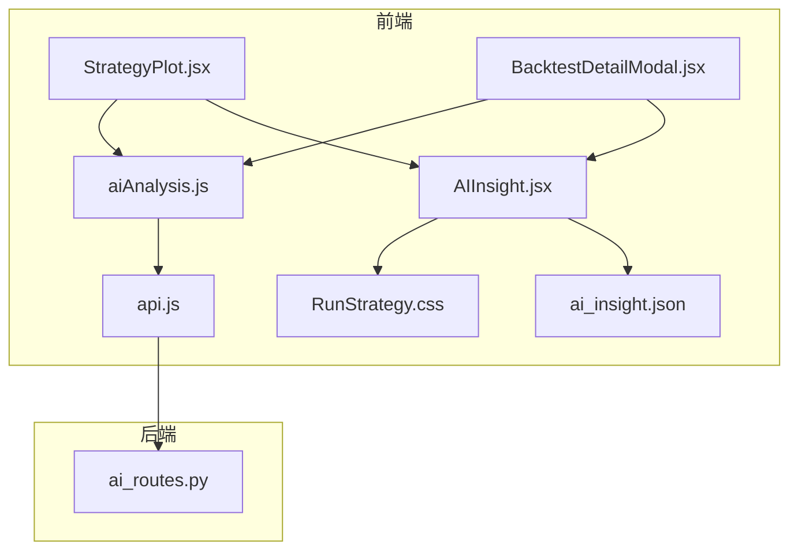
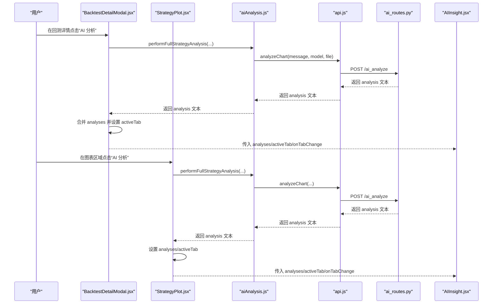
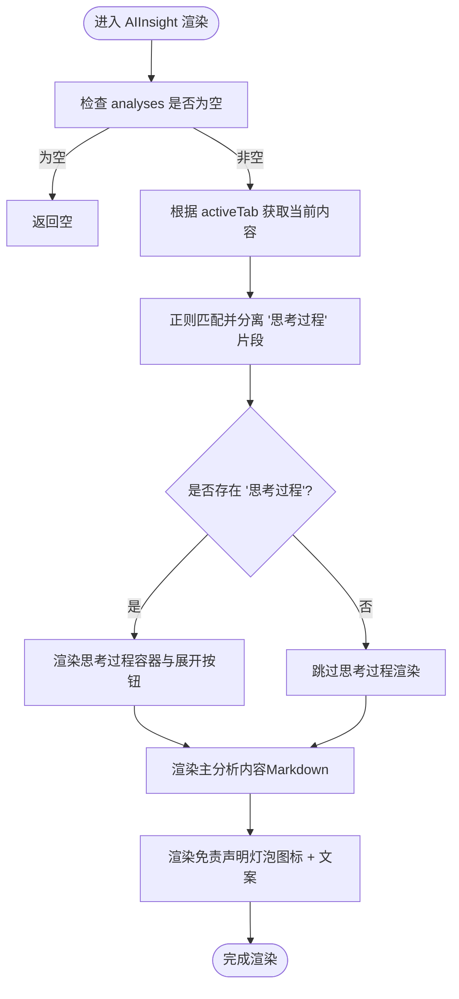
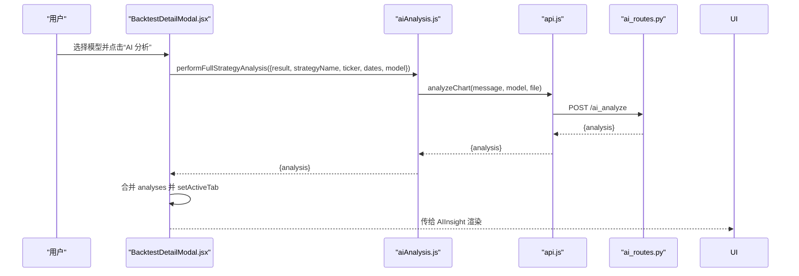
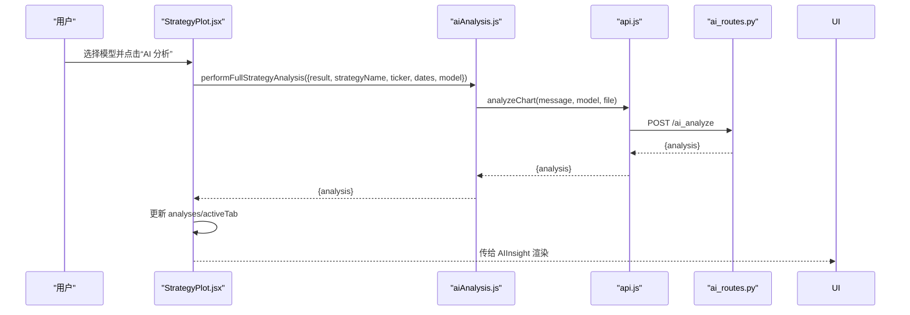
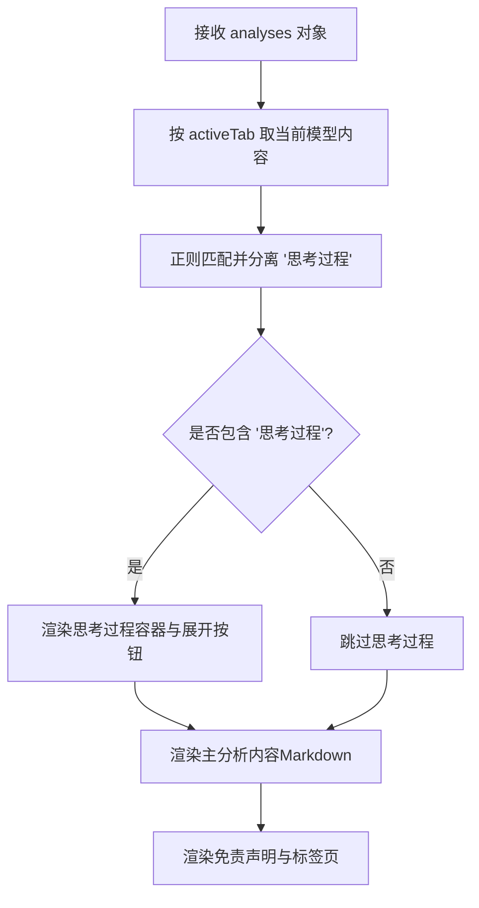
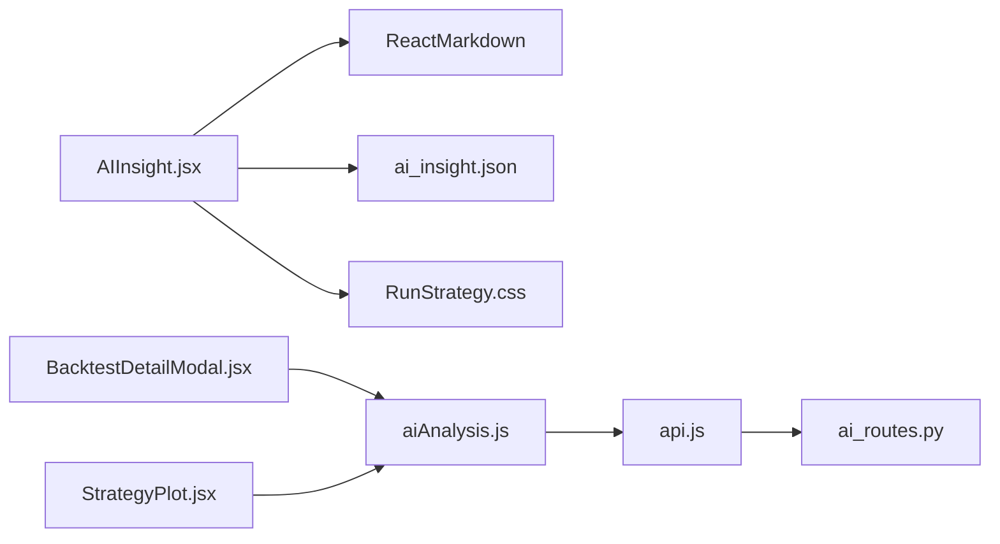

# AI分析结果展示

<cite>
**本文引用的文件**
- [AIInsight.jsx](file://frontend/src/components/RunStrategy/AIInsight.jsx)
- [RunStrategy.css](file://frontend/src/components/RunStrategy/RunStrategy.css)
- [ai_insight.json（英文）](file://frontend/src/locales/en/ai_insight.json)
- [ai_insight.json（中文）](file://frontend/src/locales/zh/ai_insight.json)
- [BacktestDetailModal.jsx](file://frontend/src/components/BacktestHistory/BacktestDetailModal.jsx)
- [StrategyPlot.jsx](file://frontend/src/components/RunStrategy/StrategyPlot.jsx)
- [aiAnalysis.js](file://frontend/src/services/aiAnalysis.js)
- [api.js](file://frontend/src/services/api.js)
- [ai_routes.py](file://backend/src/routes/ai_routes.py)
</cite>

## 目录
1. [简介](#简介)
2. [项目结构](#项目结构)
3. [核心组件](#核心组件)
4. [架构总览](#架构总览)
5. [详细组件分析](#详细组件分析)
6. [依赖关系分析](#依赖关系分析)
7. [性能考量](#性能考量)
8. [故障排查指南](#故障排查指南)
9. [结论](#结论)

## 简介
本文件围绕前端“AI分析结果展示”能力，系统化解析 AIInsight 组件如何在前端呈现多模型 AI 分析结果。重点说明：
- 组件如何接收包含不同 AI 模型（如 gpt-4o、gpt-5.1）分析文本的 analyses 对象；
- 如何通过 activeTab 和 onTabChange 实现模型间的切换；
- 如何解析包含特定标签的 AI 响应，分离“思考过程”，并提供可展开/收起的交互式查看；
- ReactMarkdown 如何渲染 Markdown 格式的分析报告；
- CSS 类 animate-fade-in 与 custom-scrollbar 提供的视觉增强；
- 结合 BacktestDetailModal 说明 AI 分析功能的触发上下文（用户在查看回测详情时可请求 AI 洞察）；
- UI 设计原则：使用 RobotOutlined 图标与“灯泡”免责声明建立对 AI 功能的合理预期。

## 项目结构
AI 分析结果展示涉及以下关键文件与模块：
- 前端组件：AIInsight.jsx（展示分析结果）、StrategyPlot.jsx（运行回测后的图表区域，内嵌 AIInsight）
- 前端服务：aiAnalysis.js（封装 AI 分析调用与提示词配置）、api.js（封装后端 API 调用）
- 国际化：ai_insight.json（英文/中文翻译键）
- 样式：RunStrategy.css（卡片、标签页、滚动条、动画等样式）
- 触发上下文：BacktestDetailModal.jsx（回测详情弹窗，提供选择模型与触发 AI 分析）

**图示来源**
- [StrategyPlot.jsx](file://frontend/src/components/RunStrategy/StrategyPlot.jsx#L1-L180)
- [BacktestDetailModal.jsx](file://frontend/src/components/BacktestHistory/BacktestDetailModal.jsx#L1-L262)
- [AIInsight.jsx](file://frontend/src/components/RunStrategy/AIInsight.jsx#L1-L99)
- [aiAnalysis.js](file://frontend/src/services/aiAnalysis.js#L1-L195)
- [api.js](file://frontend/src/services/api.js#L1-L405)
- [RunStrategy.css](file://frontend/src/components/RunStrategy/RunStrategy.css#L236-L495)
- [ai_insight.json（英文）](file://frontend/src/locales/en/ai_insight.json#L1-L3)
- [ai_insight.json（中文）](file://frontend/src/locales/zh/ai_insight.json#L1-L3)
- [ai_routes.py](file://backend/src/routes/ai_routes.py#L1-L92)

**章节来源**
- [AIInsight.jsx](file://frontend/src/components/RunStrategy/AIInsight.jsx#L1-L99)
- [RunStrategy.css](file://frontend/src/components/RunStrategy/RunStrategy.css#L236-L495)
- [aiAnalysis.js](file://frontend/src/services/aiAnalysis.js#L1-L195)
- [api.js](file://frontend/src/services/api.js#L1-L405)
- [BacktestDetailModal.jsx](file://frontend/src/components/BacktestHistory/BacktestDetailModal.jsx#L1-L262)
- [StrategyPlot.jsx](file://frontend/src/components/RunStrategy/StrategyPlot.jsx#L1-L180)
- [ai_insight.json（英文）](file://frontend/src/locales/en/ai_insight.json#L1-L3)
- [ai_insight.json（中文）](file://frontend/src/locales/zh/ai_insight.json#L1-L3)
- [ai_routes.py](file://backend/src/routes/ai_routes.py#L1-L92)

## 核心组件
- AIInsight.jsx：负责渲染 AI 分析结果卡片，支持多模型标签切换、思考过程折叠/展开、Markdown 渲染与免责声明展示。
- aiAnalysis.js：封装 AI 分析调用，包括全量策略分析、代码分析与重写、可用模型获取与默认提示词配置。
- api.js：封装后端 API，包括更新回测 AI 分析记录等。
- BacktestDetailModal.jsx：在回测详情弹窗中触发 AI 分析，合并历史保存的分析与当前分析，驱动 AIInsight 展示。
- StrategyPlot.jsx：在运行回测后的图表区域提供 AI 分析按钮与模型选择，直接驱动 AIInsight 展示。

**章节来源**
- [AIInsight.jsx](file://frontend/src/components/RunStrategy/AIInsight.jsx#L1-L99)
- [aiAnalysis.js](file://frontend/src/services/aiAnalysis.js#L1-L195)
- [api.js](file://frontend/src/services/api.js#L180-L200)
- [BacktestDetailModal.jsx](file://frontend/src/components/BacktestHistory/BacktestDetailModal.jsx#L1-L262)
- [StrategyPlot.jsx](file://frontend/src/components/RunStrategy/StrategyPlot.jsx#L1-L180)

## 架构总览
AI 分析从“触发”到“展示”的端到端流程如下：

**图示来源**
- [BacktestDetailModal.jsx](file://frontend/src/components/BacktestHistory/BacktestDetailModal.jsx#L31-L82)
- [StrategyPlot.jsx](file://frontend/src/components/RunStrategy/StrategyPlot.jsx#L26-L65)
- [aiAnalysis.js](file://frontend/src/services/aiAnalysis.js#L59-L169)
- [api.js](file://frontend/src/services/api.js#L180-L200)
- [ai_routes.py](file://backend/src/routes/ai_routes.py#L17-L92)
- [AIInsight.jsx](file://frontend/src/components/RunStrategy/AIInsight.jsx#L8-L99)

## 详细组件分析

### AIInsight 组件分析
- 接收参数
  - analyses：对象，键为模型名（如 gpt-4o、gpt-5.1），值为对应模型返回的分析文本。
  - activeTab：当前激活的模型键。
  - onTabChange：切换模型的回调。
- 内容解析与渲染
  - 使用正则匹配并分离“思考过程”片段，保留主分析内容；若存在“思考过程”，提供可展开/收起的交互按钮。
  - 主分析内容与“思考过程”均通过 ReactMarkdown 渲染，确保标题、列表、代码块、引用等 Markdown 元素正确显示。
- 视觉与交互
  - 头部包含机器人图标与标题，底部包含“灯泡”免责声明，建立对 AI 结果的合理预期。
  - 使用 animate-fade-in 实现卡片内容淡入动画；使用 custom-scrollbar 为“思考过程”面板提供自定义滚动条。
  - 模型标签页通过 active 类高亮当前模型，点击切换 activeTab。
- 国际化
  - “思考过程”文案来自 i18n 键，支持中英文切换。

**图示来源**
- [AIInsight.jsx](file://frontend/src/components/RunStrategy/AIInsight.jsx#L8-L99)
- [RunStrategy.css](file://frontend/src/components/RunStrategy/RunStrategy.css#L236-L495)
- [ai_insight.json（英文）](file://frontend/src/locales/en/ai_insight.json#L1-L3)
- [ai_insight.json（中文）](file://frontend/src/locales/zh/ai_insight.json#L1-L3)

**章节来源**
- [AIInsight.jsx](file://frontend/src/components/RunStrategy/AIInsight.jsx#L8-L99)
- [RunStrategy.css](file://frontend/src/components/RunStrategy/RunStrategy.css#L236-L495)
- [ai_insight.json（英文）](file://frontend/src/locales/en/ai_insight.json#L1-L3)
- [ai_insight.json（中文）](file://frontend/src/locales/zh/ai_insight.json#L1-L3)

### BacktestDetailModal 触发上下文
- 用户在回测详情弹窗中选择模型后，点击“AI 分析”按钮，调用 performFullStrategyAnalysis，将回测指标、图表、策略代码与时间范围等信息打包为提示词，请求后端 AI 接口。
- 将返回的 analysis 存入 analyses 对象，设置 activeTab 为当前模型，并尝试保存到后端历史记录。
- 若已有历史分析，会与本次分析合并，保证多模型对比展示。

**图示来源**
- [BacktestDetailModal.jsx](file://frontend/src/components/BacktestHistory/BacktestDetailModal.jsx#L31-L82)
- [aiAnalysis.js](file://frontend/src/services/aiAnalysis.js#L59-L169)
- [api.js](file://frontend/src/services/api.js#L180-L200)
- [ai_routes.py](file://backend/src/routes/ai_routes.py#L17-L92)

**章节来源**
- [BacktestDetailModal.jsx](file://frontend/src/components/BacktestHistory/BacktestDetailModal.jsx#L1-L262)
- [aiAnalysis.js](file://frontend/src/services/aiAnalysis.js#L1-L195)
- [api.js](file://frontend/src/services/api.js#L180-L200)
- [ai_routes.py](file://backend/src/routes/ai_routes.py#L1-L92)

### StrategyPlot 中的 AI 分析集成
- 在图表区域提供模型选择与“AI 分析”按钮，调用 performFullStrategyAnalysis，将当前回测结果与图表作为输入，请求后端 AI 接口。
- 成功后将 analysis 写入 analyses 并设置 activeTab，随后由 AIInsight 渲染。
- 若存在回测 ID，还会尝试将分析结果保存至后端历史记录。

**图示来源**
- [StrategyPlot.jsx](file://frontend/src/components/RunStrategy/StrategyPlot.jsx#L26-L65)
- [aiAnalysis.js](file://frontend/src/services/aiAnalysis.js#L59-L169)
- [api.js](file://frontend/src/services/api.js#L180-L200)
- [ai_routes.py](file://backend/src/routes/ai_routes.py#L17-L92)

**章节来源**
- [StrategyPlot.jsx](file://frontend/src/components/RunStrategy/StrategyPlot.jsx#L1-L180)
- [aiAnalysis.js](file://frontend/src/services/aiAnalysis.js#L1-L195)
- [api.js](file://frontend/src/services/api.js#L180-L200)
- [ai_routes.py](file://backend/src/routes/ai_routes.py#L1-L92)

### 数据流与处理逻辑
- 输入数据：analyses 对象（键为模型名，值为分析文本）。
- 解析逻辑：使用正则匹配“思考过程”标签，提取并移除该片段，保留主分析内容。
- 渲染逻辑：ReactMarkdown 渲染主内容与“思考过程”；标签页切换通过 onTabChange 更新 activeTab。
- 视觉增强：卡片淡入动画、自定义滚动条、模型标签页高亮。

**图示来源**
- [AIInsight.jsx](file://frontend/src/components/RunStrategy/AIInsight.jsx#L16-L56)
- [RunStrategy.css](file://frontend/src/components/RunStrategy/RunStrategy.css#L296-L495)

**章节来源**
- [AIInsight.jsx](file://frontend/src/components/RunStrategy/AIInsight.jsx#L16-L56)
- [RunStrategy.css](file://frontend/src/components/RunStrategy/RunStrategy.css#L296-L495)

## 依赖关系分析
- 组件耦合
  - AIInsight 仅依赖传入的 analyses、activeTab、onTabChange 三个 props，低耦合、高内聚。
  - BacktestDetailModal 与 StrategyPlot 通过 aiAnalysis.js 与 api.js 间接耦合到后端。
- 外部依赖
  - ReactMarkdown：用于渲染 Markdown。
  - Ant Design Icons：RobotOutlined、BulbOutlined、CaretRightOutlined、CaretDownOutlined。
  - i18n：ai_insight.json 提供“思考过程”文案。
- 样式依赖
  - RunStrategy.css 提供卡片、标签页、动画与滚动条样式。

**图示来源**
- [AIInsight.jsx](file://frontend/src/components/RunStrategy/AIInsight.jsx#L1-L99)
- [RunStrategy.css](file://frontend/src/components/RunStrategy/RunStrategy.css#L236-L495)
- [ai_insight.json（英文）](file://frontend/src/locales/en/ai_insight.json#L1-L3)
- [ai_insight.json（中文）](file://frontend/src/locales/zh/ai_insight.json#L1-L3)
- [BacktestDetailModal.jsx](file://frontend/src/components/BacktestHistory/BacktestDetailModal.jsx#L1-L262)
- [StrategyPlot.jsx](file://frontend/src/components/RunStrategy/StrategyPlot.jsx#L1-L180)
- [aiAnalysis.js](file://frontend/src/services/aiAnalysis.js#L1-L195)
- [api.js](file://frontend/src/services/api.js#L1-L405)
- [ai_routes.py](file://backend/src/routes/ai_routes.py#L1-L92)

**章节来源**
- [AIInsight.jsx](file://frontend/src/components/RunStrategy/AIInsight.jsx#L1-L99)
- [RunStrategy.css](file://frontend/src/components/RunStrategy/RunStrategy.css#L236-L495)
- [ai_insight.json（英文）](file://frontend/src/locales/en/ai_insight.json#L1-L3)
- [ai_insight.json（中文）](file://frontend/src/locales/zh/ai_insight.json#L1-L3)
- [BacktestDetailModal.jsx](file://frontend/src/components/BacktestHistory/BacktestDetailModal.jsx#L1-L262)
- [StrategyPlot.jsx](file://frontend/src/components/RunStrategy/StrategyPlot.jsx#L1-L180)
- [aiAnalysis.js](file://frontend/src/services/aiAnalysis.js#L1-L195)
- [api.js](file://frontend/src/services/api.js#L1-L405)
- [ai_routes.py](file://backend/src/routes/ai_routes.py#L1-L92)

## 性能考量
- 渲染性能
  - ReactMarkdown 渲染大量 Markdown 时可能带来开销，建议对长文本分段或懒加载。
  - “思考过程”面板默认折叠，避免一次性渲染过多内容。
- 网络与并发
  - 多模型并行请求时，建议限制并发数或采用队列策略，避免 UI 卡顿。
  - 后端代理超时较长（900 秒），前端需做好加载状态与错误处理。
- 样式与动画
  - animate-fade-in 与 custom-scrollbar 为轻量级动画与滚动条，对性能影响较小。

[本节为通用指导，不直接分析具体文件]

## 故障排查指南
- 无法获取 AI 分析
  - 检查后端 OpenAI 配置是否正确（API Key 与 Base URL），否则会返回 500。
  - 前端网络错误：确认 VITE_API_BASE_URL 正确，且已注入访问令牌。
- 分析结果未显示
  - 确认 analyses 非空且 activeTab 对应的模型键存在。
  - 若“思考过程”为空，检查后端返回文本是否包含对应标签。
- 回测详情弹窗未保存分析
  - 后端更新接口失败不会阻断展示，但会打印错误日志；可在前端捕获并提示用户。

**章节来源**
- [ai_routes.py](file://backend/src/routes/ai_routes.py#L33-L41)
- [api.js](file://frontend/src/services/api.js#L180-L200)
- [BacktestDetailModal.jsx](file://frontend/src/components/BacktestHistory/BacktestDetailModal.jsx#L58-L82)
- [StrategyPlot.jsx](file://frontend/src/components/RunStrategy/StrategyPlot.jsx#L49-L65)

## 结论
AIInsight 组件通过简洁的 props 接口与清晰的数据解析流程，实现了多模型 AI 分析结果的高效展示。其与 BacktestDetailModal、StrategyPlot 的集成，使用户在回测详情与图表区域均可便捷触发 AI 分析，并以“思考过程”与 Markdown 报告提升结果的可解释性。配合动画与自定义滚动条，整体用户体验在可读性与交互性上达到平衡。建议后续在长文本渲染与并发控制方面进一步优化，以提升大规模分析场景下的性能与稳定性。