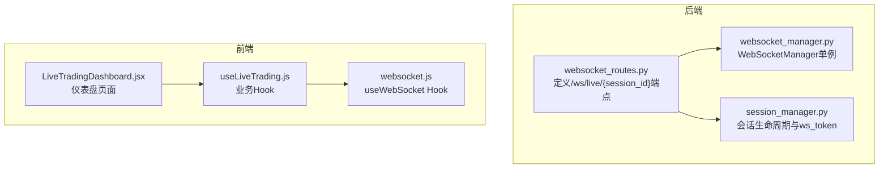
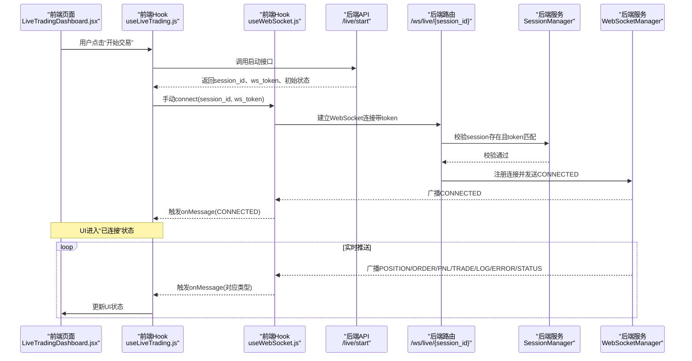
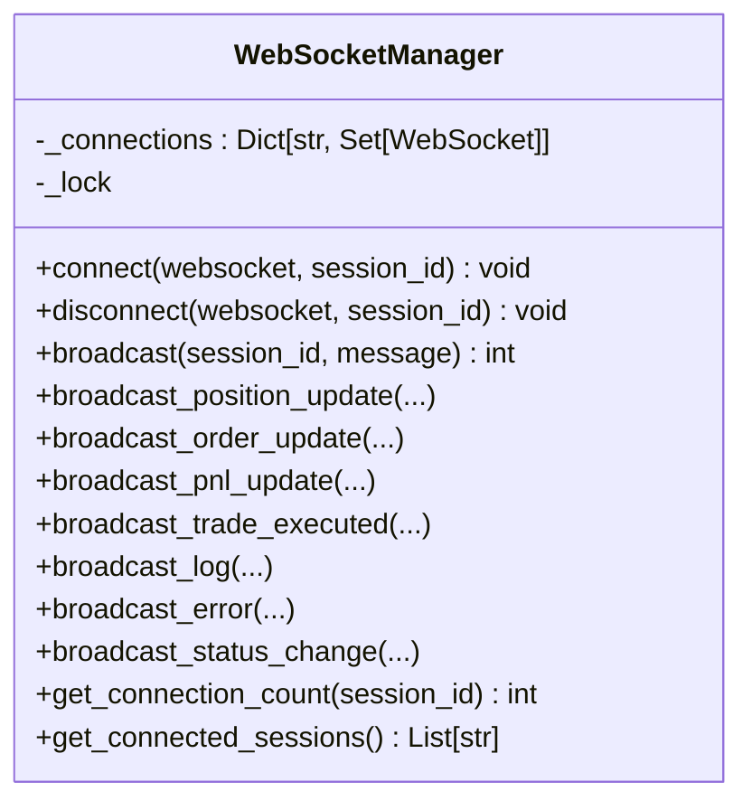
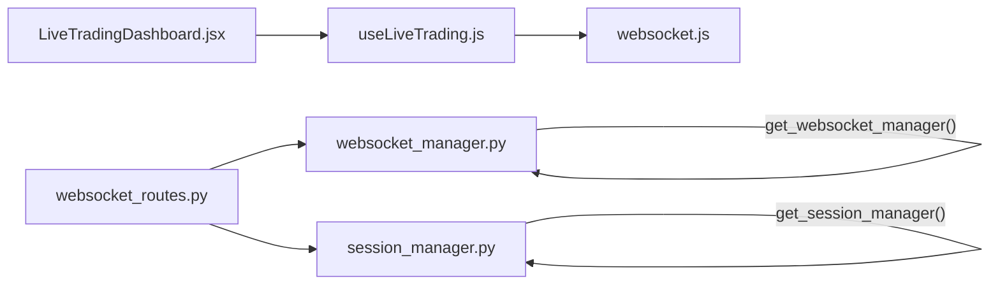

# WebSocket实时通信

<cite>
**本文引用的文件**
- [websocket_routes.py](file://backend/src/routes/websocket_routes.py)
- [websocket_manager.py](file://backend/src/service/websocket_manager.py)
- [session_manager.py](file://backend/src/service/session_manager.py)
- [websocket.js](file://frontend/src/services/websocket.js)
- [useLiveTrading.js](file://frontend/src/hooks/useLiveTrading.js)
- [LiveTradingDashboard.jsx](file://frontend/src/pages/LiveTradingDashboard.jsx)
- [test_websocket_manager.py](file://backend/tests/service/test_websocket_manager.py)
</cite>

## 目录
1. [简介](#简介)
2. [项目结构](#项目结构)
3. [核心组件](#核心组件)
4. [架构总览](#架构总览)
5. [详细组件分析](#详细组件分析)
6. [依赖关系分析](#依赖关系分析)
7. [性能考量](#性能考量)
8. [故障排查指南](#故障排查指南)
9. [结论](#结论)

## 简介
本文件系统性阐述后端FastAPI与前端React之间的WebSocket实时通信机制，重点覆盖：
- 后端如何通过路由定义/ws/live/{session_id}端点并进行会话鉴权
- WebSocketManager如何作为单例集中管理连接池、广播消息并清理失效连接
- 前端useWebSocket自定义Hook如何建立连接、处理消息、发送心跳保活
- WebSocket消息协议（CONNECTED、POSITION、ORDER、PNL、TRADE、LOG、ERROR、STATUS）的格式与用途
- 结合useLiveTrading.js说明前端如何订阅与处理实时消息以更新UI状态
- 对系统性能与用户体验的影响评估

## 项目结构
WebSocket实时通信涉及后端路由、服务层管理器与前端Hook/页面三部分协作：
- 后端
  - 路由：定义WebSocket端点与消息协议说明
  - 服务：WebSocketManager集中管理连接与广播；SessionManager提供会话生命周期与ws_token
- 前端
  - Hook：useWebSocket封装连接、心跳、重连、消息分发
  - 页面：LiveTradingDashboard展示实时数据
  - 业务：useLiveTrading整合Hook与API，驱动UI状态更新

图表来源
- [websocket_routes.py](file://backend/src/routes/websocket_routes.py#L21-L242)
- [websocket_manager.py](file://backend/src/service/websocket_manager.py#L1-L401)
- [session_manager.py](file://backend/src/service/session_manager.py#L1-L419)
- [websocket.js](file://frontend/src/services/websocket.js#L1-L287)
- [useLiveTrading.js](file://frontend/src/hooks/useLiveTrading.js#L1-L277)
- [LiveTradingDashboard.jsx](file://frontend/src/pages/LiveTradingDashboard.jsx#L1-L173)

章节来源
- [websocket_routes.py](file://backend/src/routes/websocket_routes.py#L21-L242)
- [websocket_manager.py](file://backend/src/service/websocket_manager.py#L1-L401)
- [session_manager.py](file://backend/src/service/session_manager.py#L1-L419)
- [websocket.js](file://frontend/src/services/websocket.js#L1-L287)
- [useLiveTrading.js](file://frontend/src/hooks/useLiveTrading.js#L1-L277)
- [LiveTradingDashboard.jsx](file://frontend/src/pages/LiveTradingDashboard.jsx#L1-L173)

## 核心组件
- 后端WebSocket端点
  - 定义在路由模块中，路径为/ws/live/{session_id}，支持查询参数token用于鉴权
  - 连接成功后向客户端发送CONNECTED欢迎消息
  - 支持ping/pong心跳保活，未来可扩展subscribe/unsubscribe
- WebSocketManager（单例）
  - 维护每个session_id对应的连接集合，线程安全
  - 提供broadcast方法向同一会话的所有客户端广播消息
  - 自动清理发送失败的死连接，避免内存泄漏
  - 提供位置、订单、PnL、交易、日志、错误、状态变更等专用广播方法
- SessionManager（单例）
  - 管理TradingSession生命周期，生成ws_token用于WebSocket鉴权
  - 提供get_session等接口供路由层校验会话有效性
- 前端useWebSocket Hook
  - 构建WebSocket URL，携带token查询参数
  - 发送心跳（ping），接收pong确认
  - 可配置自动重连策略与心跳间隔
  - 暴露connect/disconnect/sendMessage等方法
- 前端useLiveTrading Hook
  - 在会话启动后手动建立WebSocket连接，避免自动重连导致的循环
  - 解析服务器消息类型，更新UI状态（持仓、订单、PnL、统计）
  - 处理错误与通知，保持UI不被频繁错误消息刷屏

章节来源
- [websocket_routes.py](file://backend/src/routes/websocket_routes.py#L21-L242)
- [websocket_manager.py](file://backend/src/service/websocket_manager.py#L1-L401)
- [session_manager.py](file://backend/src/service/session_manager.py#L1-L419)
- [websocket.js](file://frontend/src/services/websocket.js#L1-L287)
- [useLiveTrading.js](file://frontend/src/hooks/useLiveTrading.js#L1-L277)

## 架构总览
后端路由负责接入与鉴权，WebSocketManager负责连接与广播，SessionManager负责会话与令牌，前端Hook负责连接、心跳与消息分发。

图表来源
- [websocket_routes.py](file://backend/src/routes/websocket_routes.py#L21-L242)
- [websocket_manager.py](file://backend/src/service/websocket_manager.py#L1-L401)
- [session_manager.py](file://backend/src/service/session_manager.py#L1-L419)
- [websocket.js](file://frontend/src/services/websocket.js#L1-L287)
- [useLiveTrading.js](file://frontend/src/hooks/useLiveTrading.js#L1-L277)
- [LiveTradingDashboard.jsx](file://frontend/src/pages/LiveTradingDashboard.jsx#L1-L173)

## 详细组件分析

### 后端路由：WebSocket端点与鉴权
- 端点定义
  - 路径：/ws/live/{session_id}
  - 查询参数：token（来自启动会话返回的ws_token）
- 鉴权流程
  - 校验session是否存在
  - 校验token是否匹配session.ws_token
  - 鉴权失败则关闭连接（1008）
- 连接建立
  - 接受连接后注册到WebSocketManager
  - 立即发送CONNECTED消息
- 心跳保活
  - 支持字符串或JSON格式的ping
  - 服务器统一回复pong
- 消息协议说明
  - 文档内明确列出CONNECTED、POSITION、ORDER、PNL、TRADE、LOG、ERROR、STATUS等消息类型及字段
  - 客户端消息：ping（心跳）

章节来源
- [websocket_routes.py](file://backend/src/routes/websocket_routes.py#L21-L242)

### WebSocketManager：单例连接管理与广播
- 连接管理
  - 使用字典按session_id维护连接集合，加锁保证并发安全
  - 连接成功后发送CONNECTED欢迎消息
  - 断开连接时从集合移除，若会话无连接则删除该会话键
- 广播机制
  - broadcast方法遍历会话连接集合，逐个发送消息
  - 捕获发送异常，收集死连接并在finally阶段清理
  - 记录发送数量与调试日志
- 专用广播方法
  - broadcast_position_update、broadcast_order_update、broadcast_pnl_update、broadcast_trade_executed、broadcast_log、broadcast_error、broadcast_status_change
- 辅助方法
  - get_connection_count、get_connected_sessions

图表来源
- [websocket_manager.py](file://backend/src/service/websocket_manager.py#L1-L401)

章节来源
- [websocket_manager.py](file://backend/src/service/websocket_manager.py#L1-L401)
- [test_websocket_manager.py](file://backend/tests/service/test_websocket_manager.py#L1-L69)

### SessionManager：会话生命周期与ws_token
- 会话模型
  - TradingSession包含会话标识、策略、交易对、初始资金、佣金、状态、运行时对象、追踪指标等
  - 自动生成ws_token用于WebSocket鉴权
- 生命周期
  - 创建、注册、启动、停止、查询、统计等
  - 提供get_session、update_session、stop_session等方法
- 单例模式
  - 通过全局实例与线程锁确保唯一性与线程安全

章节来源
- [session_manager.py](file://backend/src/service/session_manager.py#L1-L419)

### 前端Hook：useWebSocket
- 连接构建
  - 根据当前协议（http/https）与开发环境决定ws/wss与主机地址
  - 将ws_token作为查询参数拼接到URL
- 心跳保活
  - 定时发送ping，收到pong确认心跳有效
  - 心跳间隔可配置
- 重连策略
  - 可配置最大重连次数与重连间隔
  - 关闭时停止心跳与定时器
- 消息处理
  - onmessage解析JSON，触发onMessage回调
  - 提供sendMessage方法发送消息（如ping）

章节来源
- [websocket.js](file://frontend/src/services/websocket.js#L1-L287)

### 前端Hook：useLiveTrading
- 连接时机
  - 仅在会话启动成功后再手动connect，避免自动重连导致的循环
  - 传入ws_token进行鉴权
- 消息处理
  - 解析CONNECTED静默处理
  - POSITION：按symbol合并或新增
  - ORDER：按order_id合并或新增
  - PNL：更新当前PnL、组合价值、现金与历史曲线
  - TRADE：弹出成功通知并更新统计
  - LOG：控制台输出
  - ERROR：弹出错误通知
  - STATUS：更新会话状态
- UI联动
  - LiveTradingDashboard根据状态渲染控制区、统计卡片与图表
  - 通过wsConnected显示连接状态

章节来源
- [useLiveTrading.js](file://frontend/src/hooks/useLiveTrading.js#L1-L277)
- [LiveTradingDashboard.jsx](file://frontend/src/pages/LiveTradingDashboard.jsx#L1-L173)

### WebSocket消息协议
- CONNECTED
  - 用途：连接建立后的欢迎消息
  - 字段：type、session_id、message
- POSITION
  - 用途：推送持仓更新
  - 字段：symbol、size、avg_price、current_price、pnl、pnl_percent
- ORDER
  - 用途：推送订单执行状态
  - 字段：order_id、symbol、side、size、price、status、filled_size、filled_price
- PNL
  - 用途：推送账户PnL与资产情况
  - 字段：current_pnl、total_pnl_percent、cash、portfolio_value
- TRADE
  - 用途：推送成交记录
  - 字段：symbol、side、size、price、commission、pnl
- LOG
  - 用途：策略日志
  - 字段：level、message、timestamp
- ERROR
  - 用途：错误通知
  - 字段：message、code
- STATUS
  - 用途：会话状态变更
  - 字段：old_status、new_status
- 心跳
  - 客户端发送：{"type":"ping"}
  - 服务端响应：{"type":"pong"}

章节来源
- [websocket_routes.py](file://backend/src/routes/websocket_routes.py#L35-L151)
- [websocket_manager.py](file://backend/src/service/websocket_manager.py#L150-L349)
- [websocket.js](file://frontend/src/services/websocket.js#L271-L287)

## 依赖关系分析
- 后端
  - websocket_routes.py依赖get_websocket_manager与get_session_manager
  - websocket_manager.py提供全局单例get_websocket_manager
  - session_manager.py提供全局单例get_session_manager
- 前端
  - useLiveTrading.js依赖useWebSocket与WS_MESSAGE_TYPES
  - LiveTradingDashboard.jsx依赖useLiveTrading

图表来源
- [websocket_routes.py](file://backend/src/routes/websocket_routes.py#L1-L242)
- [websocket_manager.py](file://backend/src/service/websocket_manager.py#L1-L401)
- [session_manager.py](file://backend/src/service/session_manager.py#L1-L419)
- [websocket.js](file://frontend/src/services/websocket.js#L1-L287)
- [useLiveTrading.js](file://frontend/src/hooks/useLiveTrading.js#L1-L277)
- [LiveTradingDashboard.jsx](file://frontend/src/pages/LiveTradingDashboard.jsx#L1-L173)

章节来源
- [websocket_routes.py](file://backend/src/routes/websocket_routes.py#L1-L242)
- [websocket_manager.py](file://backend/src/service/websocket_manager.py#L1-L401)
- [session_manager.py](file://backend/src/service/session_manager.py#L1-L419)
- [websocket.js](file://frontend/src/services/websocket.js#L1-L287)
- [useLiveTrading.js](file://frontend/src/hooks/useLiveTrading.js#L1-L277)
- [LiveTradingDashboard.jsx](file://frontend/src/pages/LiveTradingDashboard.jsx#L1-L173)

## 性能考量
- 广播效率
  - broadcast复制连接集合，避免迭代期间修改集合
  - 发送异常时收集死连接并在锁内批量清理，降低后续广播成本
- 心跳保活
  - 前端默认心跳间隔可配置，建议根据网络状况调整，避免过于频繁造成CPU占用
- 连接数管理
  - WebSocketManager按会话聚合连接，断开时及时清理，防止连接泄漏
- 前端UI更新
  - useLiveTrading对同symbol/order_id进行合并更新，减少不必要的重渲染
- 错误抑制
  - 前端对WebSocket错误进行静默处理，避免频繁弹窗影响体验

[本节为通用性能指导，无需特定文件来源]

## 故障排查指南
- 连接失败
  - 检查会话是否存在与token是否匹配
  - 确认前端URL协议（ws/wss）与主机地址正确
- 心跳超时
  - 检查前端心跳间隔设置与网络延迟
  - 确认服务端能正确响应pong
- 广播异常
  - 查看WebSocketManager日志，确认死连接清理是否生效
  - 检查消息格式是否符合协议
- UI未更新
  - 确认useLiveTrading的消息分发逻辑与WS_MESSAGE_TYPES一致
  - 检查useWebSocket的onMessage回调是否被正确传入

章节来源
- [websocket_routes.py](file://backend/src/routes/websocket_routes.py#L152-L218)
- [websocket_manager.py](file://backend/src/service/websocket_manager.py#L91-L149)
- [websocket.js](file://frontend/src/services/websocket.js#L100-L207)
- [useLiveTrading.js](file://frontend/src/hooks/useLiveTrading.js#L32-L125)

## 结论
该WebSocket实时通信方案通过后端路由鉴权、WebSocketManager集中管理与广播、SessionManager会话与令牌管理，以及前端Hook的心跳保活与消息分发，实现了低延迟、高可靠、易扩展的实时交易监控能力。协议清晰、组件职责明确，既保障了用户体验，也为后续扩展（如订阅/退订）预留了空间。