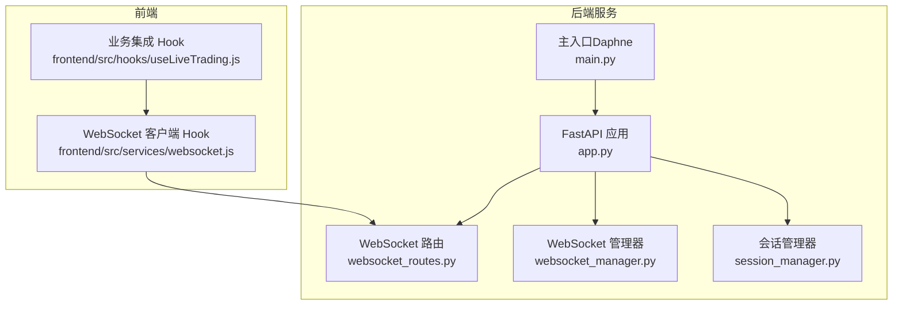
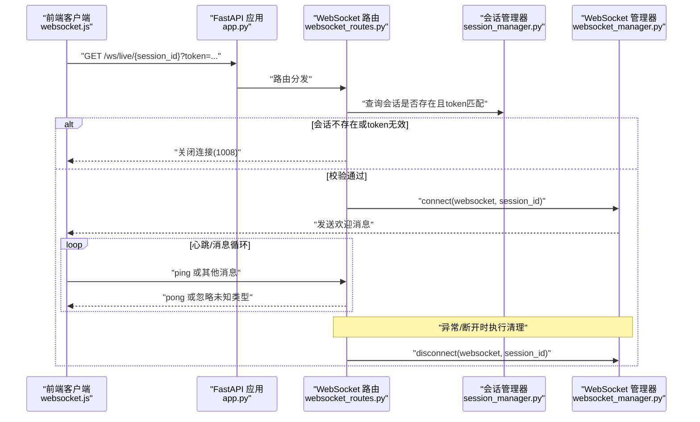
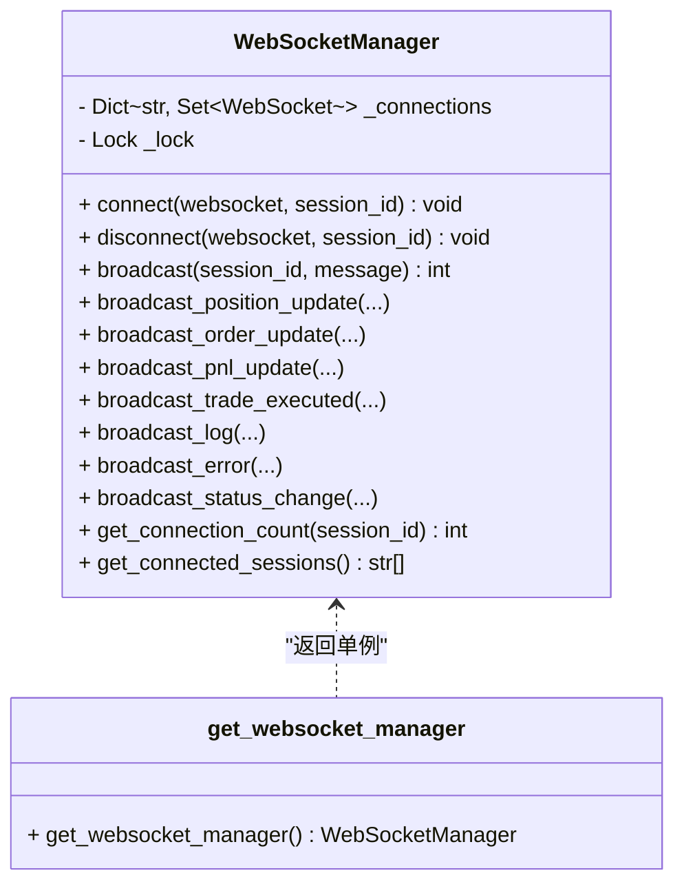
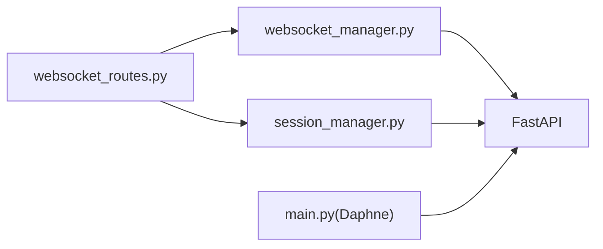

# WebSocket连接管理

<cite>
**本文引用的文件列表**
- [websocket_routes.py](file://backend/src/routes/websocket_routes.py)
- [websocket_manager.py](file://backend/src/service/websocket_manager.py)
- [session_manager.py](file://backend/src/service/session_manager.py)
- [app.py](file://backend/src/service/app.py)
- [main.py](file://backend/main.py)
- [live_routes.py](file://backend/src/routes/live_routes.py)
- [test_websocket_manager.py](file://backend/tests/service/test_websocket_manager.py)
- [websocket.js](file://frontend/src/services/websocket.js)
- [useLiveTrading.js](file://frontend/src/hooks/useLiveTrading.js)
</cite>

## 目录
1. [简介](#简介)
2. [项目结构](#项目结构)
3. [核心组件](#核心组件)
4. [架构总览](#架构总览)
5. [详细组件分析](#详细组件分析)
6. [依赖关系分析](#依赖关系分析)
7. [性能与稳定性考量](#性能与稳定性考量)
8. [故障排查指南](#故障排查指南)
9. [结论](#结论)
10. [附录](#附录)

## 简介
本文件系统性阐述后端如何通过FastAPI的WebSocket支持实现持久化连接，围绕以下目标展开：
- 解释/ws/live/{session_id}路由的定义方式，包括路径参数session_id的作用与安全校验
- 深入分析WebSocketManager类的设计，说明其作为全局单例如何维护会话级连接池，并实现add_connection、remove_connection与broadcast
- 阐述连接生命周期管理：连接建立时的身份验证、异常断开处理、资源清理逻辑
- 结合广播消息的性能优化策略，给出在高并发场景下保持连接稳定与防止内存泄漏的实践建议

## 项目结构
后端采用FastAPI应用，WebSocket路由由独立模块提供；WebSocket连接池与会话状态分别由WebSocketManager与SessionManager负责；Daphne作为ASGI服务器承载WebSocket连接。

图表来源
- [app.py](file://backend/src/service/app.py#L1-L46)
- [websocket_routes.py](file://backend/src/routes/websocket_routes.py#L1-L243)
- [websocket_manager.py](file://backend/src/service/websocket_manager.py#L1-L401)
- [session_manager.py](file://backend/src/service/session_manager.py#L1-L419)
- [main.py](file://backend/main.py#L1-L32)
- [websocket.js](file://frontend/src/services/websocket.js#L1-L128)
- [useLiveTrading.js](file://frontend/src/hooks/useLiveTrading.js#L1-L200)

章节来源
- [app.py](file://backend/src/service/app.py#L1-L46)
- [main.py](file://backend/main.py#L1-L32)

## 核心组件
- WebSocket路由层：提供/ws/live/{session_id}端点，负责连接接入、鉴权、心跳保活与消息分发
- WebSocket管理器：维护按会话聚合的连接集合，提供连接注册、断开清理与广播能力
- 会话管理器：维护交易会话生命周期与状态，生成每个会话的ws_token用于WebSocket鉴权
- ASGI服务器：Daphne承载FastAPI应用，支持WebSocket协议

章节来源
- [websocket_routes.py](file://backend/src/routes/websocket_routes.py#L1-L243)
- [websocket_manager.py](file://backend/src/service/websocket_manager.py#L1-L401)
- [session_manager.py](file://backend/src/service/session_manager.py#L1-L419)

## 架构总览
WebSocket从“会话”维度进行连接池管理，每个session_id对应一组WebSocket连接。客户端通过/ws/live/{session_id}?token=...接入，服务端在接入前校验会话存在性与ws_token一致性，随后将连接加入对应会话池并发送欢迎消息。运行期通过广播接口向该会话内所有连接推送实时数据。

图表来源
- [websocket_routes.py](file://backend/src/routes/websocket_routes.py#L152-L218)
- [websocket_manager.py](file://backend/src/service/websocket_manager.py#L45-L90)
- [session_manager.py](file://backend/src/service/session_manager.py#L214-L226)

## 详细组件分析

### 路由：/ws/live/{session_id}
- 路径参数session_id用于标识交易会话，是连接池的键
- 查询参数token为ws_token，用于鉴权
- 连接建立流程：
  - 校验会话存在性
  - 校验ws_token与会话中的token一致
  - 接受连接并注册到WebSocketManager
  - 发送欢迎消息
  - 心跳保活：收到ping/pong请求时返回pong
  - 异常断开时清理连接
- 广播信息类型：connected、position、order、pnl、trade、log、error、status
- 客户端可发送：ping（未来扩展支持subscribe/unsubscribe）

章节来源
- [websocket_routes.py](file://backend/src/routes/websocket_routes.py#L21-L218)

### WebSocketManager：全局单例连接池
- 数据结构：以session_id为键，值为WebSocket集合，保证同一会话多连接并存
- 关键方法：
  - connect：接受连接、登记到会话池、发送欢迎消息
  - disconnect：从会话池移除连接，若会话无连接则删除该会话键
  - broadcast：遍历会话连接集合，逐个发送消息；捕获发送异常并清理死连接；返回成功送达数量
  - 多种专用广播：位置更新、订单更新、P&L更新、成交执行、日志、错误、状态变更
  - 辅助：统计连接数、列出有连接的会话
- 锁保护：使用异步锁避免并发修改连接集合导致的数据竞争
- 单例：全局唯一实例，通过工厂函数get_websocket_manager提供

图表来源
- [websocket_manager.py](file://backend/src/service/websocket_manager.py#L18-L401)

章节来源
- [websocket_manager.py](file://backend/src/service/websocket_manager.py#L18-L401)

### 会话管理器：会话生命周期与ws_token
- 会话模型包含：会话ID、策略名、交易对、交易所、模式、时间框架、初始资金、手续费、状态、用户ID、ws_token等
- 提供创建、注册、查询、更新、停止、统计、移除等操作
- ws_token用于WebSocket鉴权，确保只有持有有效token的客户端能接入对应会话
- 单例：全局唯一实例，通过工厂函数get_session_manager提供

章节来源
- [session_manager.py](file://backend/src/service/session_manager.py#L29-L101)
- [session_manager.py](file://backend/src/service/session_manager.py#L102-L419)

### 连接生命周期管理
- 建立阶段：路由层校验会话与token，通过后交由WebSocketManager完成accept与登记
- 运行阶段：心跳保活（ping/pong），处理客户端消息（预留订阅/退订）
- 断开阶段：捕获断开异常，finally中调用WebSocketManager清理连接
- 清理策略：移除失效连接，若会话无连接则删除该会话键，避免内存泄漏

章节来源
- [websocket_routes.py](file://backend/src/routes/websocket_routes.py#L152-L218)
- [websocket_manager.py](file://backend/src/service/websocket_manager.py#L73-L90)
- [websocket_manager.py](file://backend/src/service/websocket_manager.py#L91-L149)

### 广播性能优化策略
- 连接快照：广播前复制当前会话连接集合，避免迭代期间集合被修改
- 死连接清理：捕获发送异常，收集死连接并在锁内批量清理，减少后续无效发送
- 统计返回：返回实际送达数量，便于上层监控与限流
- 专用广播：针对高频消息提供专用方法，减少消息构造成本

章节来源
- [websocket_manager.py](file://backend/src/service/websocket_manager.py#L91-L149)

### 安全性考虑（基于代码实现）
- 会话存在性校验：若会话不存在直接拒绝连接
- ws_token校验：缺失或不匹配均拒绝连接
- 会话状态与权限：会话对象包含用户ID字段，可在路由层结合认证中间件进一步限制访问范围（当前路由未显式检查用户ID，但会话对象具备该字段）

章节来源
- [websocket_routes.py](file://backend/src/routes/websocket_routes.py#L155-L169)
- [session_manager.py](file://backend/src/service/session_manager.py#L49-L64)

### 高并发与稳定性实践
- 使用异步锁保护连接集合，避免竞态条件
- 广播时复制连接集合，避免迭代期间集合变化
- 发送失败即清理，防止僵尸连接占用资源
- 提供连接统计接口，便于运维监控

章节来源
- [websocket_manager.py](file://backend/src/service/websocket_manager.py#L45-L90)
- [websocket_manager.py](file://backend/src/service/websocket_manager.py#L91-L149)

## 依赖关系分析
- WebSocket路由依赖WebSocket管理器与会话管理器
- WebSocket管理器不依赖路由层，仅依赖FastAPI的WebSocket类型
- 会话管理器不依赖路由层，提供会话状态与ws_token
- 应用入口通过Daphne承载FastAPI，WebSocket由ASGI服务器处理

图表来源
- [websocket_routes.py](file://backend/src/routes/websocket_routes.py#L1-L243)
- [websocket_manager.py](file://backend/src/service/websocket_manager.py#L1-L401)
- [session_manager.py](file://backend/src/service/session_manager.py#L1-L419)
- [main.py](file://backend/main.py#L1-L32)

章节来源
- [websocket_routes.py](file://backend/src/routes/websocket_routes.py#L1-L243)
- [websocket_manager.py](file://backend/src/service/websocket_manager.py#L1-L401)
- [session_manager.py](file://backend/src/service/session_manager.py#L1-L419)
- [main.py](file://backend/main.py#L1-L32)

## 性能与稳定性考量
- 广播复杂度：O(N)遍历当前会话连接集合，N为该会话连接数
- 发送失败清理：捕获异常并批量清理，降低后续无效发送
- 连接池规模控制：断开清理与空会话删除，避免长期累积
- 心跳保活：ping/pong维持长连接活跃，减少被动断连
- 监控与可观测性：提供/ws/info接口返回连接数、会话列表与消息类型

章节来源
- [websocket_manager.py](file://backend/src/service/websocket_manager.py#L91-L149)
- [websocket_routes.py](file://backend/src/routes/websocket_routes.py#L220-L243)

## 故障排查指南
- 连接被拒绝（1008）：检查会话ID是否正确、ws_token是否匹配
- 心跳异常：确认客户端定时发送ping，服务端返回pong
- 广播无响应：检查会话是否有连接、是否存在死连接未清理
- 连接数异常增长：排查客户端未正确断开或服务端异常未触发清理
- 单元测试参考：包含连接欢迎消息、断开清理、广播清理死连接、无会话广播返回0等场景

章节来源
- [websocket_routes.py](file://backend/src/routes/websocket_routes.py#L155-L169)
- [websocket_manager.py](file://backend/src/service/websocket_manager.py#L91-L149)
- [test_websocket_manager.py](file://backend/tests/service/test_websocket_manager.py#L1-L69)

## 结论
本实现通过FastAPI与Daphne构建了稳定的WebSocket基础设施，以会话为粒度管理连接池，配合严格的鉴权与健壮的清理机制，在高并发场景下保障连接稳定性与资源可控。广播接口提供多种消息类型，满足实时监控需求；同时通过单元测试覆盖关键行为，便于持续演进与维护。

## 附录
- 前端WebSocket客户端Hook：提供自动重连、心跳、消息处理等能力，与后端消息类型保持一致
- 业务集成Hook：在会话启动后手动发起WebSocket连接，传入ws_token完成鉴权

章节来源
- [websocket.js](file://frontend/src/services/websocket.js#L1-L128)
- [useLiveTrading.js](file://frontend/src/hooks/useLiveTrading.js#L1-L200)