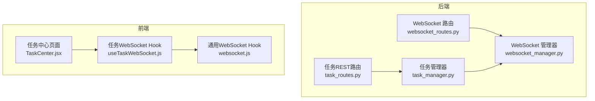
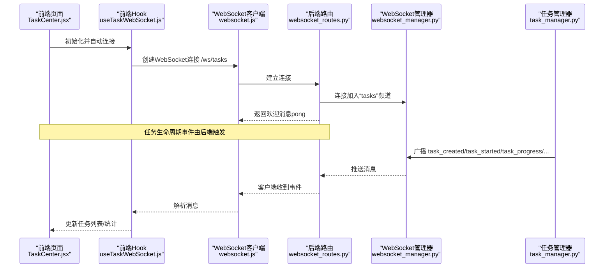
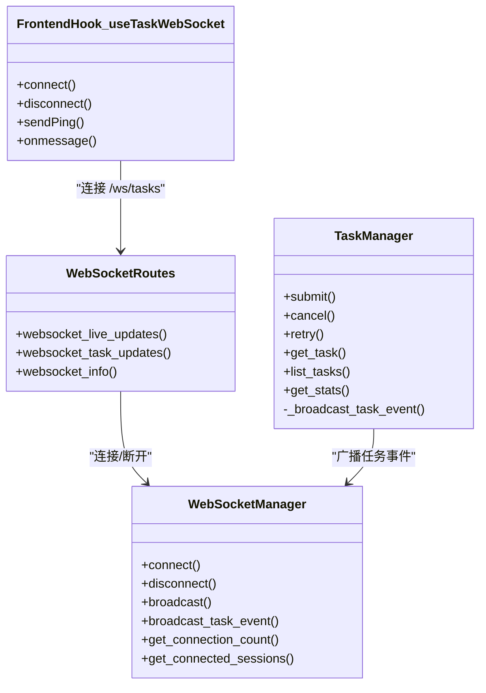

# 任务WebSocket

<cite>
**本文引用的文件**
- [websocket_routes.py](file://backend/src/routes/websocket_routes.py)
- [websocket_manager.py](file://backend/src/service/websocket_manager.py)
- [task_manager.py](file://backend/src/service/task_manager.py)
- [task_routes.py](file://backend/src/routes/task_routes.py)
- [websocket.js](file://frontend/src/services/websocket.js)
- [useTaskWebSocket.js](file://frontend/src/hooks/useTaskWebSocket.js)
- [TaskCenter.jsx](file://frontend/src/pages/TaskCenter.jsx)
- [test_websocket_manager.py](file://backend/tests/service/test_websocket_manager.py)
</cite>

## 目录
1. [简介](#简介)
2. [项目结构](#项目结构)
3. [核心组件](#核心组件)
4. [架构总览](#架构总览)
5. [详细组件分析](#详细组件分析)
6. [依赖关系分析](#依赖关系分析)
7. [性能考量](#性能考量)
8. [故障排查指南](#故障排查指南)
9. [结论](#结论)

## 简介
本文件系统性梳理后端与前端在“任务WebSocket”上的协作机制，覆盖：
- 后端WebSocket路由与管理器
- 任务生命周期事件的广播与订阅
- 前端Hook与页面如何实时接收任务状态变更
- 错误处理、心跳保活与重连策略
- 性能与可扩展性建议

## 项目结构
任务WebSocket涉及后端路由、服务层管理器、任务执行器以及前端Hook/页面四部分协同工作。

图表来源
- [websocket_routes.py](file://backend/src/routes/websocket_routes.py#L220-L332)
- [websocket_manager.py](file://backend/src/service/websocket_manager.py#L1-L150)
- [task_manager.py](file://backend/src/service/task_manager.py#L1-L120)
- [task_routes.py](file://backend/src/routes/task_routes.py#L1-L120)
- [websocket.js](file://frontend/src/services/websocket.js#L1-L120)
- [useTaskWebSocket.js](file://frontend/src/hooks/useTaskWebSocket.js#L1-L120)
- [TaskCenter.jsx](file://frontend/src/pages/TaskCenter.jsx#L1-L120)

章节来源
- [websocket_routes.py](file://backend/src/routes/websocket_routes.py#L220-L332)
- [websocket_manager.py](file://backend/src/service/websocket_manager.py#L1-L150)
- [task_manager.py](file://backend/src/service/task_manager.py#L1-L120)
- [task_routes.py](file://backend/src/routes/task_routes.py#L1-L120)
- [websocket.js](file://frontend/src/services/websocket.js#L1-L120)
- [useTaskWebSocket.js](file://frontend/src/hooks/useTaskWebSocket.js#L1-L120)
- [TaskCenter.jsx](file://frontend/src/pages/TaskCenter.jsx#L1-L120)

## 核心组件
- 后端WebSocket路由
  - 提供两个端点：/ws/live/{session_id}（实盘会话）与/ws/tasks（任务通道）
  - 对连接进行鉴权（会话令牌校验）、保持心跳（ping/pong）、断开清理
- WebSocket管理器
  - 维护每个会话的连接集合，支持广播消息、清理死连接、统计连接数
  - 提供任务事件广播方法，统一向“tasks”频道推送
- 任务管理器
  - 执行任务时通过WebSocket管理器广播任务生命周期事件（created/started/progress/completed/failed/cancelled）
  - 通过存储层更新任务状态与日志
- 前端Hook与页面
  - useTaskWebSocket负责连接/ws/tasks，发送心跳，解析任务事件并驱动UI更新
  - TaskCenter页面订阅事件，实时刷新任务列表与统计信息

章节来源
- [websocket_routes.py](file://backend/src/routes/websocket_routes.py#L220-L332)
- [websocket_manager.py](file://backend/src/service/websocket_manager.py#L1-L200)
- [task_manager.py](file://backend/src/service/task_manager.py#L100-L220)
- [useTaskWebSocket.js](file://frontend/src/hooks/useTaskWebSocket.js#L1-L120)
- [TaskCenter.jsx](file://frontend/src/pages/TaskCenter.jsx#L1-L120)

## 架构总览
任务WebSocket的端到端流程如下：

图表来源
- [TaskCenter.jsx](file://frontend/src/pages/TaskCenter.jsx#L1-L120)
- [useTaskWebSocket.js](file://frontend/src/hooks/useTaskWebSocket.js#L1-L120)
- [websocket.js](file://frontend/src/services/websocket.js#L1-L120)
- [websocket_routes.py](file://backend/src/routes/websocket_routes.py#L220-L332)
- [websocket_manager.py](file://backend/src/service/websocket_manager.py#L1-L200)
- [task_manager.py](file://backend/src/service/task_manager.py#L100-L220)

## 详细组件分析

### 后端WebSocket路由与鉴权
- /ws/tasks
  - 连接后加入“tasks”频道，支持ping/pong保活
  - 支持未来扩展订阅/退订（subscribe/unsubscribe）
- /ws/live/{session_id}
  - 需要查询参数token（会话ws_token），校验失败直接关闭连接
  - 连接成功后向客户端发送connected消息，并维持心跳

章节来源
- [websocket_routes.py](file://backend/src/routes/websocket_routes.py#L220-L332)

### WebSocket管理器
- 连接管理
  - accept连接、登记会话、发送欢迎消息
  - 断开时移除连接，若会话无连接则删除该会话
- 广播机制
  - 复制当前连接集合，逐个发送；异常连接被收集并清理
  - 返回实际送达数量，便于监控
- 任务事件广播
  - 将任务生命周期事件统一广播至“tasks”频道
  - 消息类型为task_created/task_started/task_progress/task_completed/task_failed/task_cancelled

章节来源
- [websocket_manager.py](file://backend/src/service/websocket_manager.py#L1-L200)
- [websocket_manager.py](file://backend/src/service/websocket_manager.py#L351-L402)

### 任务管理器与事件广播
- 任务提交/执行
  - 提交任务后立即广播“created”
  - 执行中通过回调更新进度并广播“progress”
  - 成功/失败/取消分别广播对应事件
- 取消/重试
  - 取消运行中的任务会广播“cancelled”
  - 重试时创建新任务并广播“created”

章节来源
- [task_manager.py](file://backend/src/service/task_manager.py#L66-L120)
- [task_manager.py](file://backend/src/service/task_manager.py#L120-L220)
- [task_manager.py](file://backend/src/service/task_manager.py#L225-L251)
- [task_manager.py](file://backend/src/service/task_manager.py#L252-L294)
- [task_manager.py](file://backend/src/service/task_manager.py#L345-L366)

### 前端Hook与页面
- useTaskWebSocket
  - 自动连接/ws/tasks，协议根据当前页面协议选择ws/wss
  - 发送心跳（ping）并处理pong
  - 解析消息类型以识别task_*事件，调用回调更新UI
  - 支持重连与最大重连次数控制
- TaskCenter页面
  - 订阅onTaskUpdate回调，按事件类型更新任务列表或新增任务
  - 实时显示任务统计（运行中/失败/总数/并发上限），并展示连接状态

章节来源
- [useTaskWebSocket.js](file://frontend/src/hooks/useTaskWebSocket.js#L1-L120)
- [useTaskWebSocket.js](file://frontend/src/hooks/useTaskWebSocket.js#L120-L200)
- [TaskCenter.jsx](file://frontend/src/pages/TaskCenter.jsx#L1-L120)
- [TaskCenter.jsx](file://frontend/src/pages/TaskCenter.jsx#L120-L200)

### 数据模型与消息格式
- 任务事件类型
  - task_created: 新建任务
  - task_started: 开始执行
  - task_progress: 进度更新
  - task_completed: 执行完成
  - task_failed: 执行失败
  - task_cancelled: 已取消
- 通用消息字段
  - type: 事件类型
  - task_id: 任务标识
  - data: 事件数据（包含状态、进度、结果ID等）

章节来源
- [websocket_routes.py](file://backend/src/routes/websocket_routes.py#L220-L332)
- [task_manager.py](file://backend/src/service/task_manager.py#L345-L366)

## 依赖关系分析

图表来源
- [websocket_routes.py](file://backend/src/routes/websocket_routes.py#L220-L332)
- [websocket_manager.py](file://backend/src/service/websocket_manager.py#L1-L200)
- [task_manager.py](file://backend/src/service/task_manager.py#L1-L120)
- [useTaskWebSocket.js](file://frontend/src/hooks/useTaskWebSocket.js#L1-L120)

章节来源
- [websocket_routes.py](file://backend/src/routes/websocket_routes.py#L220-L332)
- [websocket_manager.py](file://backend/src/service/websocket_manager.py#L1-L200)
- [task_manager.py](file://backend/src/service/task_manager.py#L1-L120)
- [useTaskWebSocket.js](file://frontend/src/hooks/useTaskWebSocket.js#L1-L120)

## 性能考量
- 广播与锁
  - 使用异步锁保护连接集合的读写，避免并发修改
  - 广播前复制连接集合，减少迭代期间的锁持有时间
- 死连接清理
  - 广播过程中捕获发送异常，批量清理无效连接，降低后续广播成本
- 心跳保活
  - 前端定时发送ping，后端返回pong，避免中间代理断开连接
- 并发限制
  - 任务执行采用信号量限制最大并发，避免资源争用
- 连接池规模
  - WebSocket管理器按会话维护连接集合，任务通道统一广播至“tasks”，避免多频道分散

章节来源
- [websocket_manager.py](file://backend/src/service/websocket_manager.py#L90-L150)
- [websocket_manager.py](file://backend/src/service/websocket_manager.py#L150-L220)
- [task_manager.py](file://backend/src/service/task_manager.py#L1-L60)

## 故障排查指南
- 常见问题
  - 连接被拒绝（1008）
    - 检查是否提供正确的ws_token（/ws/live/{session_id}?token=...）
    - 确认会话是否存在且有效
  - 无法收到任务事件
    - 确认前端已连接/ws/tasks且保持心跳
    - 检查后端任务管理器是否成功广播
- 日志定位
  - 后端路由记录未知消息类型、非JSON消息、断开原因
  - WebSocket管理器记录广播送达数量、清理死连接数量
  - 任务管理器记录任务状态变更与异常
- 单元测试参考
  - 测试覆盖连接欢迎消息、断开清理、广播清理死连接、空会话广播返回0

章节来源
- [websocket_routes.py](file://backend/src/routes/websocket_routes.py#L150-L218)
- [websocket_manager.py](file://backend/src/service/websocket_manager.py#L90-L150)
- [task_manager.py](file://backend/src/service/task_manager.py#L120-L220)
- [test_websocket_manager.py](file://backend/tests/service/test_websocket_manager.py#L1-L69)

## 结论
任务WebSocket通过后端统一的WebSocket管理器与任务管理器，实现了任务生命周期事件的可靠广播；前端Hook与页面以心跳保活与事件解析为基础，提供了实时的任务中心体验。整体设计具备良好的可扩展性与健壮性，适合在高并发场景下稳定运行。