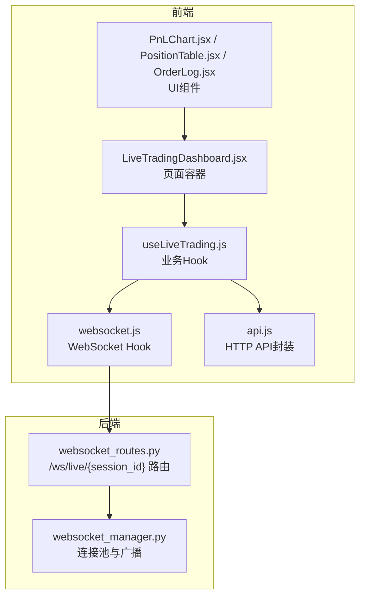
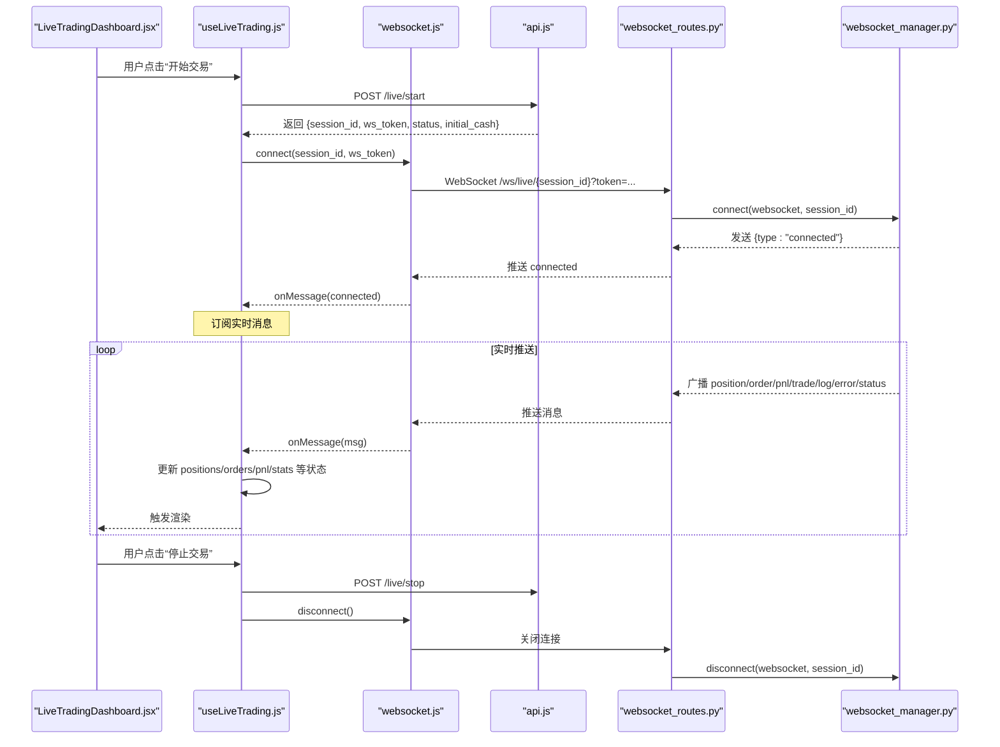
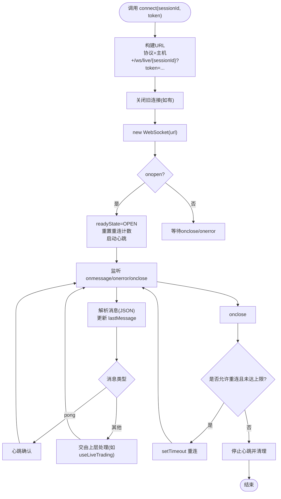
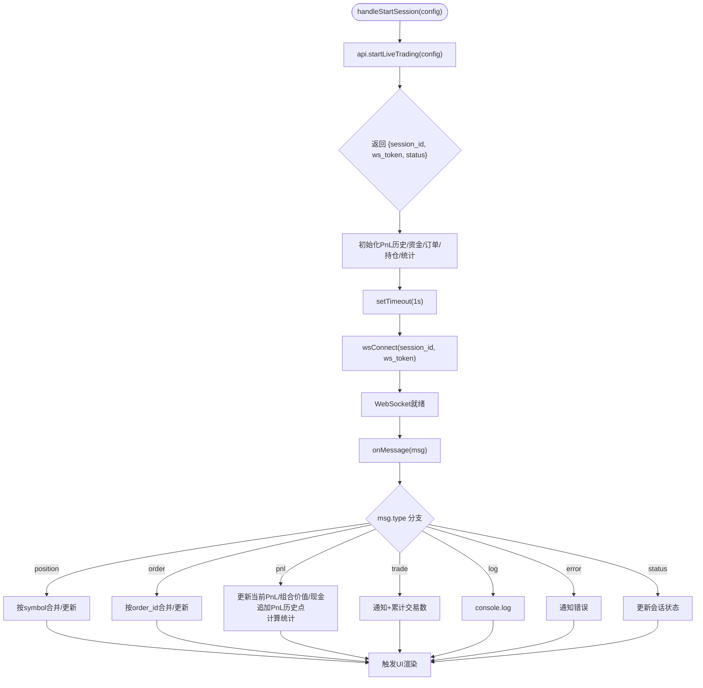
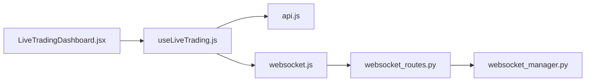

# 前端通信实现

<cite>
**本文引用的文件**
- [websocket.js](file://frontend/src/services/websocket.js)
- [useLiveTrading.js](file://frontend/src/hooks/useLiveTrading.js)
- [PnLChart.jsx](file://frontend/src/components/LiveTrading/PnLChart.jsx)
- [PositionTable.jsx](file://frontend/src/components/LiveTrading/PositionTable.jsx)
- [OrderLog.jsx](file://frontend/src/components/LiveTrading/OrderLog.jsx)
- [LiveTradingDashboard.jsx](file://frontend/src/pages/LiveTradingDashboard.jsx)
- [api.js](file://frontend/src/services/api.js)
- [websocket_routes.py](file://backend/src/routes/websocket_routes.py)
- [websocket_manager.py](file://backend/src/service/websocket_manager.py)
</cite>

## 目录
1. [引言](#引言)
2. [项目结构](#项目结构)
3. [核心组件](#核心组件)
4. [架构总览](#架构总览)
5. [详细组件分析](#详细组件分析)
6. [依赖关系分析](#依赖关系分析)
7. [性能考虑](#性能考虑)
8. [故障排查指南](#故障排查指南)
9. [结论](#结论)

## 引言
本文件聚焦于前端通信实现，系统性阐述React应用如何通过WebSocket与后端进行实时交互。重点包括：
- websocket.js服务模块如何封装WebSocket连接建立、自动重连、心跳保活（ping/pong）与错误处理。
- useLiveTrading自定义Hook如何基于React Hooks订阅特定交易会话的实时数据流，管理本地状态更新，并提供简洁API供UI组件使用。
- 在组件中消费实时数据（如PnLChart、PositionTable）的方式，以及状态同步、性能优化（防抖/节流）与用户体验（加载/错误状态）的最佳实践。

## 项目结构
前端与后端围绕“实时交易会话”形成闭环：前端通过HTTP API启动/停止会话并获取认证令牌，随后通过WebSocket订阅该会话的实时事件；后端在WebSocket路由中校验会话与令牌，向客户端广播各类消息类型（位置、订单、收益、日志、错误、状态等）。

图表来源
- [LiveTradingDashboard.jsx](file://frontend/src/pages/LiveTradingDashboard.jsx#L1-L173)
- [useLiveTrading.js](file://frontend/src/hooks/useLiveTrading.js#L1-L276)
- [websocket.js](file://frontend/src/services/websocket.js#L1-L287)
- [PnLChart.jsx](file://frontend/src/components/LiveTrading/PnLChart.jsx#L1-L113)
- [PositionTable.jsx](file://frontend/src/components/LiveTrading/PositionTable.jsx#L1-L99)
- [OrderLog.jsx](file://frontend/src/components/LiveTrading/OrderLog.jsx#L1-L139)
- [api.js](file://frontend/src/services/api.js#L1-L405)
- [websocket_routes.py](file://backend/src/routes/websocket_routes.py#L1-L243)
- [websocket_manager.py](file://backend/src/service/websocket_manager.py#L1-L349)

章节来源
- [websocket.js](file://frontend/src/services/websocket.js#L1-L287)
- [useLiveTrading.js](file://frontend/src/hooks/useLiveTrading.js#L1-L276)
- [LiveTradingDashboard.jsx](file://frontend/src/pages/LiveTradingDashboard.jsx#L1-L173)
- [api.js](file://frontend/src/services/api.js#L1-L405)
- [websocket_routes.py](file://backend/src/routes/websocket_routes.py#L1-L243)
- [websocket_manager.py](file://backend/src/service/websocket_manager.py#L1-L349)

## 核心组件
- WebSocket Hook（websocket.js）
  - 提供连接、断开、发送消息、心跳保活、自动重连与错误处理的统一抽象。
  - 支持按会话ID动态构建URL，支持开发环境与生产环境协议切换，支持ws_token作为查询参数进行鉴权。
- 实时交易Hook（useLiveTrading.js）
  - 将HTTP API与WebSocket结合，负责启动/停止会话、拉取会话状态与订单、在连接成功后手动建立WebSocket订阅。
  - 维护位置、订单、PnL历史、当前PnL、组合价值、现金、统计指标等状态，并对不同消息类型进行分发处理。
- UI组件
  - PnLChart：折线图展示收益曲线与零线，随PnL历史与当前PnL变化更新颜色。
  - PositionTable：表格展示持仓符号、方向、数量、均价、现价、未实现盈亏及百分比。
  - OrderLog：表格展示订单生命周期与填充进度、状态标签与手续费。
- 页面容器（LiveTradingDashboard.jsx）
  - 汇总展示统计卡片、控制面板、图表与表格，根据会话状态决定显示配置表单或实时面板。

章节来源
- [websocket.js](file://frontend/src/services/websocket.js#L1-L287)
- [useLiveTrading.js](file://frontend/src/hooks/useLiveTrading.js#L1-L276)
- [PnLChart.jsx](file://frontend/src/components/LiveTrading/PnLChart.jsx#L1-L113)
- [PositionTable.jsx](file://frontend/src/components/LiveTrading/PositionTable.jsx#L1-L99)
- [OrderLog.jsx](file://frontend/src/components/LiveTrading/OrderLog.jsx#L1-L139)
- [LiveTradingDashboard.jsx](file://frontend/src/pages/LiveTradingDashboard.jsx#L1-L173)

## 架构总览
下图展示了从前端到后端的实时通信路径与消息流转。

图表来源
- [useLiveTrading.js](file://frontend/src/hooks/useLiveTrading.js#L1-L276)
- [websocket.js](file://frontend/src/services/websocket.js#L1-L287)
- [api.js](file://frontend/src/services/api.js#L1-L405)
- [websocket_routes.py](file://backend/src/routes/websocket_routes.py#L1-L243)
- [websocket_manager.py](file://backend/src/service/websocket_manager.py#L1-L349)

## 详细组件分析

### WebSocket服务模块（websocket.js）
- 连接建立
  - 动态生成WebSocket URL，区分开发（localhost:8000）与生产（当前主机），自动选择ws/wss协议。
  - 使用ws_token作为查询参数进行鉴权，避免在握手头中携带敏感信息。
- 自动重连
  - 通过shouldReconnectRef与reconnectAttempts限制最大重连次数，使用setTimeout实现指数退避策略（可扩展）。
- 心跳保活（ping/pong）
  - 定时发送ping消息，收到后端pong响应即视为连接健康；若超时或异常则触发onerror/onclose。
- 错误处理
  - onerror/onclose分别设置readyState为ERROR/CLOSED，清理心跳与定时器，必要时触发重连。
- 生命周期
  - useEffect在autoConnect启用且存在sessionId时自动连接；组件卸载时主动断开并清理资源。
- 导出能力
  - 提供lastMessage、readyState、isOpen/isConnecting/isClosed、reconnectAttempts、sendMessage、connect、disconnect等。

图表来源
- [websocket.js](file://frontend/src/services/websocket.js#L1-L287)

章节来源
- [websocket.js](file://frontend/src/services/websocket.js#L1-L287)

### 实时交易Hook（useLiveTrading.js）
- 会话生命周期
  - 启动会话：调用HTTP API创建会话，返回session_id与ws_token；初始化PnL历史、初始资金与空列表；延时后手动连接WebSocket。
  - 停止会话：调用HTTP API停止会话，断开WebSocket，延时清空会话状态。
  - 刷新状态：拉取会话状态与订单列表，保持UI与后端一致。
- 消息分发
  - CONNECTED：静默连接成功，不刷屏。
  - POSITION：按symbol合并/更新持仓，保留最新字段。
  - ORDER：按order_id合并/更新订单，新订单插入头部。
  - PNL：更新当前PnL、组合价值、现金；追加时间序列点；计算交易总数、胜率。
  - TRADE：弹出成功通知与系统通知，累计交易数。
  - LOG/ERROR：记录日志与错误通知，避免UI刷屏。
  - STATUS：更新会话状态字段。
- 连接策略
  - 禁止自动连接（autoConnect=false），避免在无会话时反复重连；在会话创建成功后再手动连接并传入ws_token。
  - 设置较小的最大重连次数，降低UI干扰。

图表来源
- [useLiveTrading.js](file://frontend/src/hooks/useLiveTrading.js#L1-L276)

章节来源
- [useLiveTrading.js](file://frontend/src/hooks/useLiveTrading.js#L1-L276)
- [api.js](file://frontend/src/services/api.js#L1-L405)

### UI组件与数据消费
- PnLChart
  - 初始化轻量级图表，添加零线；根据pnlHistory排序绘制折线；根据currentPnl动态切换线条颜色。
  - 监听窗口resize以适配宽度；组件卸载时移除图表实例。
- PositionTable
  - 展示symbol、side、size、avg_price、current_price、unrealized_pnl、pnl_percent等列；当pnl_percent缺失时按公式反推。
- OrderLog
  - 展示订单生命周期与填充进度，按状态映射颜色与图标；支持分页与横向滚动。

章节来源
- [PnLChart.jsx](file://frontend/src/components/LiveTrading/PnLChart.jsx#L1-L113)
- [PositionTable.jsx](file://frontend/src/components/LiveTrading/PositionTable.jsx#L1-L99)
- [OrderLog.jsx](file://frontend/src/components/LiveTrading/OrderLog.jsx#L1-L139)

### 页面容器（LiveTradingDashboard.jsx）
- 当无活动会话时展示配置表单；有活动会话时展示控制面板、统计卡片、图表与表格。
- 通过wsConnected状态直观提示连接状态；提供刷新按钮同步后端状态。

章节来源
- [LiveTradingDashboard.jsx](file://frontend/src/pages/LiveTradingDashboard.jsx#L1-L173)

## 依赖关系分析
- 前端依赖链
  - LiveTradingDashboard.jsx 依赖 useLiveTrading.js 提供的状态与方法。
  - useLiveTrading.js 依赖 api.js 进行HTTP请求，依赖 websocket.js 建立WebSocket连接。
  - UI组件（PnLChart、PositionTable、OrderLog）直接消费useLiveTrading.js提供的状态。
- 后端依赖链
  - websocket_routes.py 负责WebSocket接入与鉴权，委托 websocket_manager.py 管理连接池与广播。
  - websocket_manager.py 定义多种广播方法（位置、订单、PnL、交易、日志、错误、状态），统一消息格式。

图表来源
- [LiveTradingDashboard.jsx](file://frontend/src/pages/LiveTradingDashboard.jsx#L1-L173)
- [useLiveTrading.js](file://frontend/src/hooks/useLiveTrading.js#L1-L276)
- [websocket.js](file://frontend/src/services/websocket.js#L1-L287)
- [api.js](file://frontend/src/services/api.js#L1-L405)
- [websocket_routes.py](file://backend/src/routes/websocket_routes.py#L1-L243)
- [websocket_manager.py](file://backend/src/service/websocket_manager.py#L1-L349)

章节来源
- [websocket_routes.py](file://backend/src/routes/websocket_routes.py#L1-L243)
- [websocket_manager.py](file://backend/src/service/websocket_manager.py#L1-L349)

## 性能考虑
- 防抖/节流
  - 对高频消息（如PnL更新）建议在useLiveTrading.js中采用节流策略，避免每条消息都触发大量渲染。
  - 对UI组件内部的resize事件监听，建议在组件卸载时清理，避免重复绑定导致内存泄漏。
- 渲染优化
  - 使用React.memo或useMemo/useCallback减少不必要的重渲染（例如PositionTable/OrderLog的列配置）。
  - 对PnL历史数据先排序再setData，避免图表内部重复排序。
- 连接与心跳
  - 合理设置heartbeatInterval，避免过于频繁的心跳造成网络压力。
  - 在页面不可见或后台运行时，可暂停心跳或降频，恢复前台后再恢复。
- 错误与重试
  - 限制最大重连次数与间隔，避免在弱网环境下无限重试。
  - 对onError进行去抖，避免UI频繁弹窗。

## 故障排查指南
- 连接失败
  - 检查会话是否存在与ws_token是否匹配；后端会在会话不存在或token无效时主动关闭连接。
  - 确认URL协议（ws/wss）与主机地址正确，开发环境指向localhost:8000。
- 心跳中断
  - 若长时间无消息，检查前端心跳是否仍在运行；后端收到ping会回pong，若未收到需检查网络或防火墙。
- 消息未到达
  - 确认useLiveTrading.js已注册onMessage回调；检查消息类型是否受支持（position/order/pnl/trade/log/error/status）。
- UI不更新
  - 检查useLiveTrading.js中的状态更新逻辑（按symbol/order_id合并策略）；确认组件props是否传递正确。
- 停止会话后仍连接
  - 确认handleStopSession中调用了wsDisconnect；检查后端是否正确断开连接。

章节来源
- [websocket_routes.py](file://backend/src/routes/websocket_routes.py#L150-L218)
- [websocket.js](file://frontend/src/services/websocket.js#L1-L287)
- [useLiveTrading.js](file://frontend/src/hooks/useLiveTrading.js#L1-L276)

## 结论
本实现通过统一的WebSocket Hook与业务Hook，将HTTP API与实时消息解耦，既保证了会话生命周期的可控性，又实现了对多类实时事件的高效消费。前端组件专注于UI呈现，后端通过连接池与广播机制确保消息可靠送达。建议在实际部署中进一步引入节流、去抖与连接降级策略，以提升复杂场景下的稳定性与用户体验。