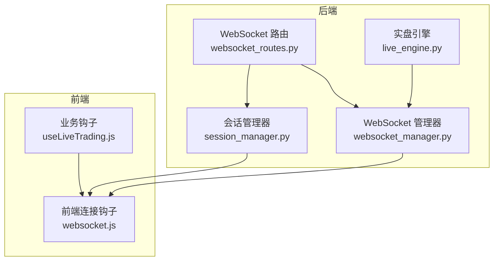
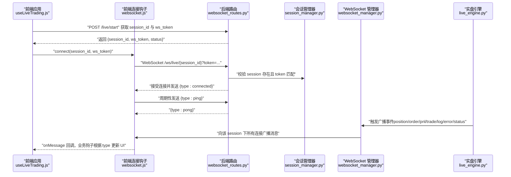
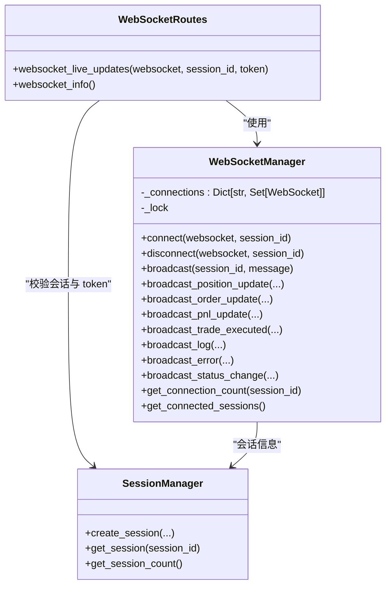
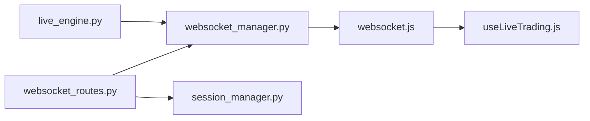

# 实时消息协议

<cite>
**本文引用的文件**
- [websocket_manager.py](file://backend/src/service/websocket_manager.py)
- [websocket_routes.py](file://backend/src/routes/websocket_routes.py)
- [websocket.js](file://frontend/src/services/websocket.js)
- [useLiveTrading.js](file://frontend/src/hooks/useLiveTrading.js)
- [session_manager.py](file://backend/src/service/session_manager.py)
- [live_engine.py](file://backend/src/service/live_engine.py)
- [test_websocket_manager.py](file://backend/tests/service/test_websocket_manager.py)
</cite>

## 目录
1. [简介](#简介)
2. [项目结构](#项目结构)
3. [核心组件](#核心组件)
4. [架构总览](#架构总览)
5. [详细组件分析](#详细组件分析)
6. [依赖关系分析](#依赖关系分析)
7. [性能与可靠性考量](#性能与可靠性考量)
8. [故障排查指南](#故障排查指南)
9. [结论](#结论)
10. [附录：消息示例与字段说明](#附录消息示例与字段说明)

## 简介
本文件系统性地梳理并文档化本项目的实时消息协议，覆盖后端 WebSocketManager 的消息构造与广播机制、前端 websocket.js 的连接与心跳处理、以及前端 useLiveTrading.js 对各类消息的解析与路由。协议采用 JSON 文本帧进行传输，统一以 type 字段标识消息类型，支持会话级多客户端广播与心跳保活。本文还给出各消息类型的字段定义、触发条件、典型场景与协议设计对前后端解耦、扩展性与调试便利性的价值。

## 项目结构
实时消息协议涉及后端 WebSocket 路由、消息管理器与前端连接钩子三部分：
- 后端
  - WebSocket 路由：负责鉴权、连接生命周期与客户端消息处理
  - WebSocket 管理器：维护会话连接池、广播消息、清理死连接
  - 会话管理器：提供会话状态与 ws_token，用于前端鉴权
- 前端
  - 连接钩子：封装 WebSocket 连接、自动重连、心跳、消息解析
  - 业务钩子：按消息类型更新 UI 状态

图表来源
- [websocket_routes.py](file://backend/src/routes/websocket_routes.py#L21-L218)
- [websocket_manager.py](file://backend/src/service/websocket_manager.py#L18-L399)
- [session_manager.py](file://backend/src/service/session_manager.py#L1-L120)
- [live_engine.py](file://backend/src/service/live_engine.py#L261-L337)
- [websocket.js](file://frontend/src/services/websocket.js#L1-L286)
- [useLiveTrading.js](file://frontend/src/hooks/useLiveTrading.js#L1-L121)

章节来源
- [websocket_routes.py](file://backend/src/routes/websocket_routes.py#L21-L218)
- [websocket_manager.py](file://backend/src/service/websocket_manager.py#L18-L399)
- [session_manager.py](file://backend/src/service/session_manager.py#L1-L120)
- [live_engine.py](file://backend/src/service/live_engine.py#L261-L337)
- [websocket.js](file://frontend/src/services/websocket.js#L1-L286)
- [useLiveTrading.js](file://frontend/src/hooks/useLiveTrading.js#L1-L121)

## 核心组件
- WebSocket 路由
  - 提供 /ws/live/{session_id} 端点，基于 ws_token 鉴权
  - 接收客户端 ping 消息并返回 pong；保留 subscribe/unsubscribe 扩展点
- WebSocket 管理器
  - 维护 session_id -> 多个 WebSocket 连接集合
  - 提供 broadcast_* 方法构造并广播 position/order/pnl/trade/log/error/status 消息
  - 自动清理断开或发送失败的连接
- 前端连接钩子
  - 构造 ws/wss URL，携带 token 查询参数
  - 心跳：周期性发送 ping，接收 pong
  - 自动重连：指数退避策略
  - 解析 JSON 并透传给上层业务钩子
- 业务钩子
  - 根据消息类型更新 UI 状态（持仓、订单、PnL、交易日志、错误提示、状态）

章节来源
- [websocket_routes.py](file://backend/src/routes/websocket_routes.py#L21-L218)
- [websocket_manager.py](file://backend/src/service/websocket_manager.py#L18-L399)
- [websocket.js](file://frontend/src/services/websocket.js#L1-L286)
- [useLiveTrading.js](file://frontend/src/hooks/useLiveTrading.js#L1-L121)

## 架构总览
下图展示从会话启动到实时消息推送的端到端流程，包括鉴权、连接建立、心跳保活与消息广播。

图表来源
- [websocket_routes.py](file://backend/src/routes/websocket_routes.py#L21-L218)
- [session_manager.py](file://backend/src/service/session_manager.py#L1-L120)
- [websocket_manager.py](file://backend/src/service/websocket_manager.py#L18-L399)
- [websocket.js](file://frontend/src/services/websocket.js#L1-L286)
- [useLiveTrading.js](file://frontend/src/hooks/useLiveTrading.js#L1-L121)
- [live_engine.py](file://backend/src/service/live_engine.py#L261-L337)

## 详细组件分析

### 后端 WebSocket 路由与鉴权
- 端点：/ws/live/{session_id}
- 鉴权：查询参数 token 必须与会话对象中的 ws_token 一致
- 生命周期：
  - 连接成功后立即发送欢迎消息 connected
  - 循环读取客户端消息，识别 ping/pong；其他 JSON 消息暂不处理但不中断连接
  - 断开时清理连接
- 客户端可发送的消息：
  - ping（字符串或 JSON 对象）
  - subscribe/unsubscribe（预留扩展）

章节来源
- [websocket_routes.py](file://backend/src/routes/websocket_routes.py#L21-L218)
- [session_manager.py](file://backend/src/service/session_manager.py#L1-L120)

### 后端 WebSocket 管理器
- 连接池：按 session_id 分组维护连接集合
- 广播：遍历连接集合发送消息，捕获异常并清理死连接
- 消息构造：
  - position：包含 symbol、size、avg_price、current_price、pnl、pnl_percent
  - order：包含 order_id、symbol、side、size、price、status、filled_size、filled_price
  - pnl：包含 current_pnl、total_pnl_percent、cash、portfolio_value
  - trade：包含 symbol、side、size、price、commission、pnl
  - log：包含 level、message、timestamp
  - error：包含 message、code
  - status：包含 old_status、new_status
- 公共字段：type、data（各类型字段见附录）

章节来源
- [websocket_manager.py](file://backend/src/service/websocket_manager.py#L18-L399)

### 前端连接钩子（websocket.js）
- URL 构造：根据协议与环境选择 ws/wss，附加 token 查询参数
- 心跳：定时发送 ping，接收 pong
- 自动重连：指数退避，最多尝试 maxReconnectAttempts 次
- 消息解析：JSON 解析失败时记录错误但不中断连接
- 导出常量 WS_MESSAGE_TYPES，便于前端统一引用

章节来源
- [websocket.js](file://frontend/src/services/websocket.js#L1-L286)

### 前端业务钩子（useLiveTrading.js）
- 按消息类型更新状态：
  - position：按 symbol 合并或新增
  - order：按 order_id 合并或新增
  - pnl：更新当前 PnL、资产与历史曲线
  - trade：弹出通知并统计交易次数
  - log：控制台输出
  - error：全局错误提示
  - status：更新会话状态
- 连接时机：在会话启动成功后手动连接，避免自动重连导致的循环

章节来源
- [useLiveTrading.js](file://frontend/src/hooks/useLiveTrading.js#L1-L121)

### 类关系与数据流（代码级）

图表来源
- [websocket_routes.py](file://backend/src/routes/websocket_routes.py#L21-L218)
- [websocket_manager.py](file://backend/src/service/websocket_manager.py#L18-L399)
- [session_manager.py](file://backend/src/service/session_manager.py#L1-L120)

## 依赖关系分析
- 后端
  - websocket_routes.py 依赖 websocket_manager.py 与 session_manager.py
  - websocket_manager.py 通过 FastAPI WebSocket API 发送 JSON
  - live_engine.py 在运行时触发广播事件，间接驱动前端消息流
- 前端
  - useLiveTrading.js 依赖 websocket.js 的连接与消息回调
  - 业务逻辑围绕 WS_MESSAGE_TYPES 常量进行分支处理

图表来源
- [websocket_routes.py](file://backend/src/routes/websocket_routes.py#L21-L218)
- [websocket_manager.py](file://backend/src/service/websocket_manager.py#L18-L399)
- [session_manager.py](file://backend/src/service/session_manager.py#L1-L120)
- [websocket.js](file://frontend/src/services/websocket.js#L1-L286)
- [useLiveTrading.js](file://frontend/src/hooks/useLiveTrading.js#L1-L121)
- [live_engine.py](file://backend/src/service/live_engine.py#L261-L337)

## 性能与可靠性考量
- 广播性能
  - 广播前复制连接集合，避免迭代期间修改
  - 异步锁保护连接池，减少竞态
- 死连接清理
  - 发送异常时收集并移除，降低后续广播成本
- 心跳与保活
  - 前端周期性 ping，服务端直接回 pong，轻量高效
- 可靠性
  - 自动重连与最大尝试次数限制，避免无限重试
  - 非 JSON 文本被忽略但不中断连接，增强鲁棒性

章节来源
- [websocket_manager.py](file://backend/src/service/websocket_manager.py#L91-L148)
- [websocket_routes.py](file://backend/src/routes/websocket_routes.py#L171-L218)
- [websocket.js](file://frontend/src/services/websocket.js#L1-L286)

## 故障排查指南
- 连接失败
  - 检查 /ws/live/{session_id} 是否携带正确的 token
  - 确认会话存在且状态为 running
- 心跳异常
  - 前端未收到 pong：检查网络与代理配置
  - 服务端未响应：查看路由日志与异常
- 消息未到达
  - 确认 session_id 正确且有活跃连接
  - 检查广播方法是否被调用
- 单元测试参考
  - 测试连接发送欢迎消息、断开清理、广播清理死连接、无会话广播返回 0

章节来源
- [websocket_routes.py](file://backend/src/routes/websocket_routes.py#L152-L218)
- [test_websocket_manager.py](file://backend/tests/service/test_websocket_manager.py#L1-L69)

## 结论
本协议以 JSON 文本帧为基础，通过统一的 type 字段实现消息类型化，结合会话级广播与心跳保活，实现了低耦合、高扩展的实时消息通道。后端以 WebSocketManager 为中心，集中管理连接与广播；前端以 useWebSocket 与 useLiveTrading 为边界，清晰分离连接与业务逻辑。协议设计兼顾调试便利性（日志与错误码）、扩展性（预留订阅/取消订阅）与可靠性（自动重连与死连接清理）。

## 附录：消息示例与字段说明

### 通用字段
- type：消息类型（如 connected、position、order、pnl、trade、log、error、status）
- data：具体消息体（见下文各类型）
- timestamp：仅 log 类型包含（服务端自动生成）

章节来源
- [websocket_routes.py](file://backend/src/routes/websocket_routes.py#L35-L151)
- [websocket_manager.py](file://backend/src/service/websocket_manager.py#L284-L305)

### 消息类型与字段

- connected
  - 触发条件：新连接建立后立即发送
  - 字段：type、session_id、message
  - 前端行为：静默连接，不刷 UI

- position
  - 触发条件：持仓更新
  - 字段：symbol、size、avg_price、current_price、pnl、pnl_percent
  - 前端行为：按 symbol 合并或新增

- order
  - 触发条件：订单状态变化
  - 字段：order_id、symbol、side、size、price、status、filled_size、filled_price
  - 前端行为：按 order_id 合并或新增

- pnl
  - 触发条件：PnL 更新
  - 字段：current_pnl、total_pnl_percent、cash、portfolio_value
  - 前端行为：更新当前 PnL、资产与历史曲线

- trade
  - 触发条件：成交执行
  - 字段：symbol、side、size、price、commission、pnl
  - 前端行为：弹出通知并统计交易次数

- log
  - 触发条件：策略日志
  - 字段：level、message、timestamp
  - 前端行为：控制台输出

- error
  - 触发条件：错误通知
  - 字段：message、code
  - 前端行为：全局错误提示

- status
  - 触发条件：会话状态变更
  - 字段：old_status、new_status
  - 前端行为：更新会话状态

章节来源
- [websocket_routes.py](file://backend/src/routes/websocket_routes.py#L35-L151)
- [websocket_manager.py](file://backend/src/service/websocket_manager.py#L150-L349)
- [useLiveTrading.js](file://frontend/src/hooks/useLiveTrading.js#L1-L121)

### 传输约定与时间戳、会话ID、消息ID
- 编码格式：JSON 文本帧
- 会话ID：URL 路径参数 {session_id}
- 认证：查询参数 token（ws_token），来自 /live/start 返回
- 心跳：客户端周期性发送 ping，服务端返回 pong
- 时间戳：仅 log 类型包含（服务端生成）
- 消息ID：协议未定义消息 ID 字段；如需去重可在前端基于 type+data 哈希或时间戳实现

章节来源
- [websocket_routes.py](file://backend/src/routes/websocket_routes.py#L21-L151)
- [websocket_manager.py](file://backend/src/service/websocket_manager.py#L284-L305)
- [websocket.js](file://frontend/src/services/websocket.js#L1-L286)

### 前后端解耦、扩展性与调试便利性
- 解耦
  - 后端只关心消息构造与广播，不感知前端 UI
  - 前端只关心消息类型与数据结构，不感知后端实现细节
- 扩展性
  - 新增消息类型只需在后端添加广播方法并在前端注册处理分支
  - 预留 subscribe/unsubscribe 扩展点
- 调试便利性
  - 统一的日志输出与错误码
  - 明确的心跳保活机制
  - 单元测试覆盖关键路径（连接、断开、广播、清理）

章节来源
- [websocket_manager.py](file://backend/src/service/websocket_manager.py#L91-L148)
- [websocket_routes.py](file://backend/src/routes/websocket_routes.py#L171-L218)
- [test_websocket_manager.py](file://backend/tests/service/test_websocket_manager.py#L1-L69)