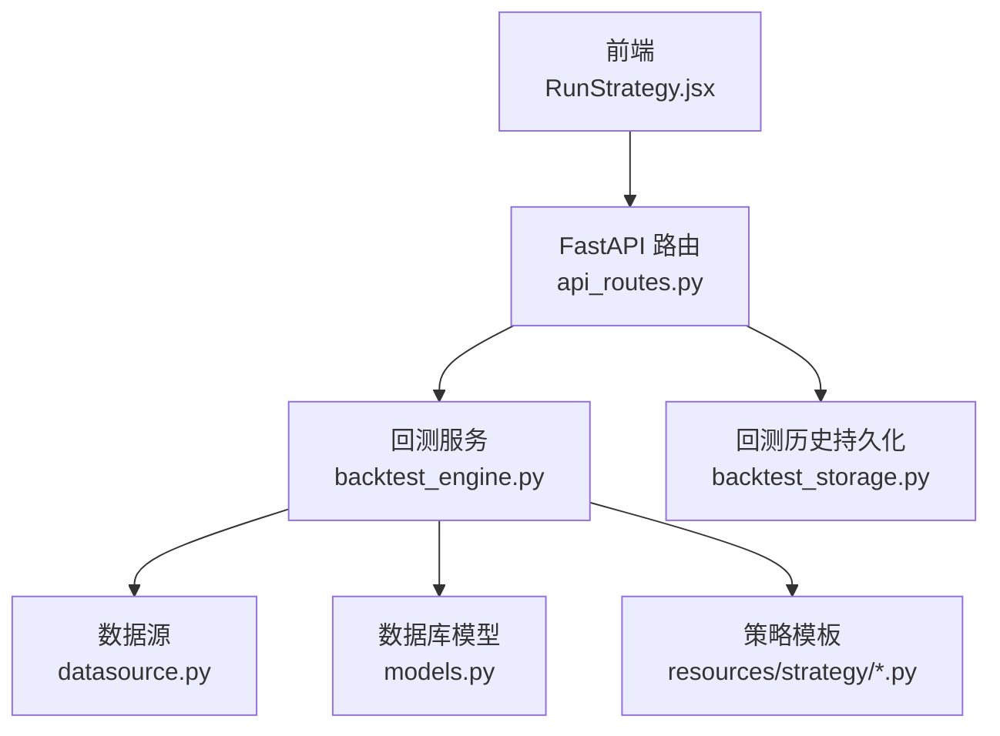
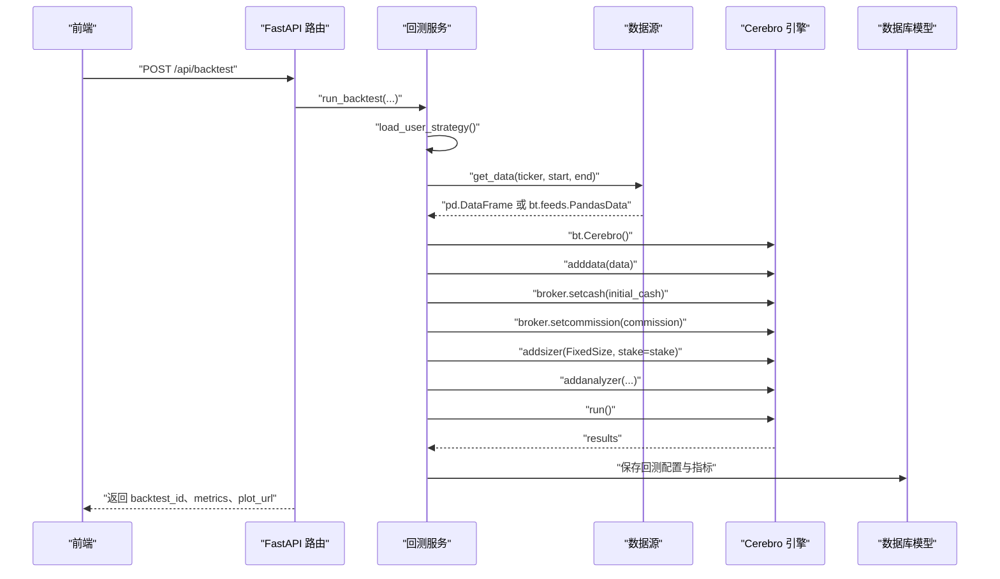
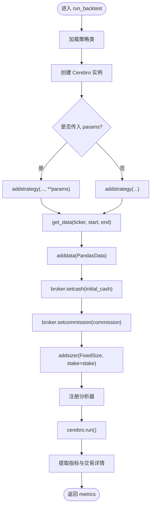
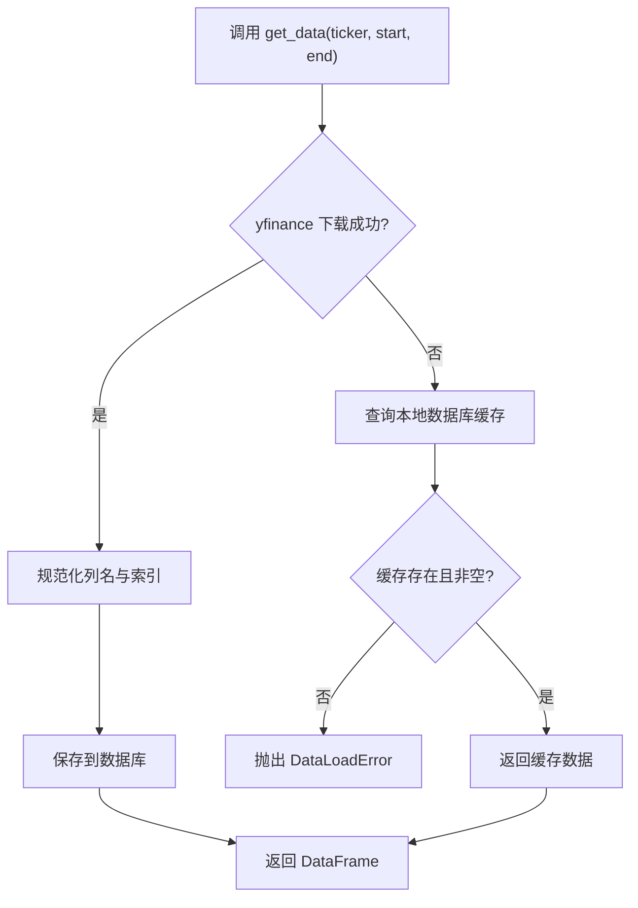
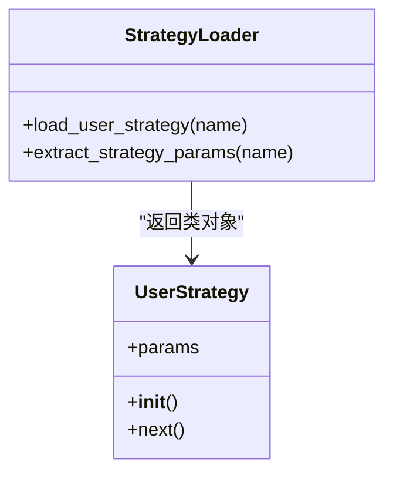
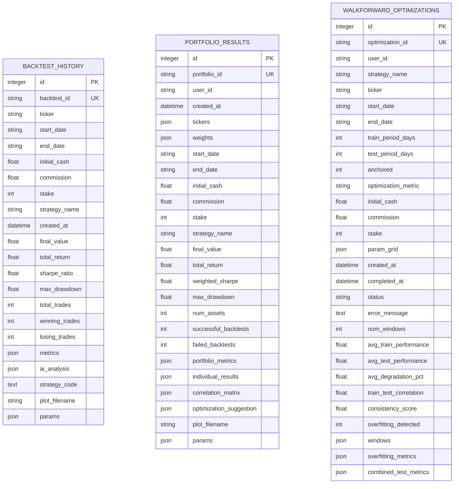
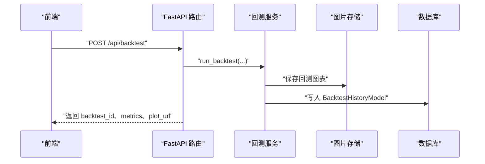
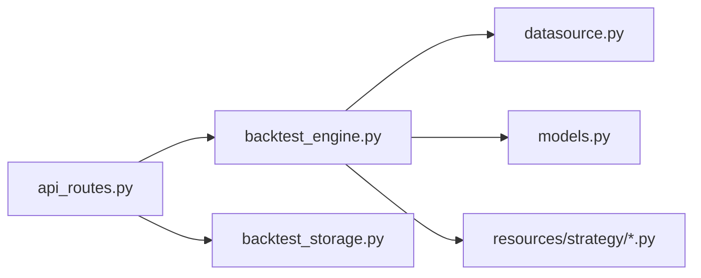

# Cerebro引擎配置

<cite>
**本文引用的文件**
- [backend/src/service/backtest_engine.py](file://backend/src/service/backtest_engine.py)
- [backend/src/db/datasource.py](file://backend/src/db/datasource.py)
- [backend/src/db/models.py](file://backend/src/db/models.py)
- [backend/src/routes/api_routes.py](file://backend/src/routes/api_routes.py)
- [backend/src/service/live_engine.py](file://backend/src/service/live_engine.py)
- [backend/resources/strategy/sma_cross.py](file://backend/resources/strategy/sma_cross.py)
- [backend/resources/strategy/buy_and_hold.py](file://backend/resources/strategy/buy_and_hold.py)
</cite>

## 目录
1. [简介](#简介)
2. [项目结构](#项目结构)
3. [核心组件](#核心组件)
4. [架构总览](#架构总览)
5. [详细组件分析](#详细组件分析)
6. [依赖关系分析](#依赖关系分析)
7. [性能考量](#性能考量)
8. [故障排查指南](#故障排查指南)
9. [结论](#结论)

## 简介
本文围绕回测引擎中的Cerebro实例初始化流程展开，系统性说明如何通过bt.Cerebro()创建回测引擎、如何配置初始资金、交易佣金与固定交易量，如何加载数据源与策略，并梳理从API请求到回测完成的完整时序与依赖关系。同时，结合数据库模型中存储的回测配置字段（initial_cash、commission、stake），帮助读者理解前后端与后端服务之间的数据映射与持久化路径。

## 项目结构
后端采用分层设计：FastAPI路由负责接收前端请求并校验参数；服务层封装回测引擎逻辑；数据层提供数据源与持久化能力。Cerebro引擎初始化位于服务层，数据源来自数据库或第三方接口，最终将回测结果写入数据库模型。

图示来源
- [backend/src/routes/api_routes.py](file://backend/src/routes/api_routes.py#L215-L286)
- [backend/src/service/backtest_engine.py](file://backend/src/service/backtest_engine.py#L302-L384)
- [backend/src/db/datasource.py](file://backend/src/db/datasource.py#L202-L231)
- [backend/src/db/models.py](file://backend/src/db/models.py#L282-L345)
- [backend/resources/strategy/sma_cross.py](file://backend/resources/strategy/sma_cross.py#L1-L18)

章节来源
- [backend/src/routes/api_routes.py](file://backend/src/routes/api_routes.py#L215-L286)
- [backend/src/service/backtest_engine.py](file://backend/src/service/backtest_engine.py#L302-L384)
- [backend/src/db/datasource.py](file://backend/src/db/datasource.py#L202-L231)
- [backend/src/db/models.py](file://backend/src/db/models.py#L282-L345)

## 核心组件
- Cerebro实例初始化与配置
  - 使用bt.Cerebro()创建引擎实例
  - 通过broker.setcash设置初始资金
  - 通过broker.setcommission设置交易佣金
  - 通过addsizer添加固定交易量（FixedSize）
- 数据源集成
  - 通过get_data获取数据，再包装为Backtrader数据源并adddata加载
- 策略加载与参数化
  - 通过load_user_strategy加载策略类
  - addstrategy支持传入参数字典（**params），否则使用策略默认参数
- 分析器与自定义分析器
  - 内置分析器：SharpeRatio、DrawDown、Returns、AnnualReturn、SQN、TradeAnalyzer、TimeDrawDown
  - 自定义分析器：TradeRecorder用于记录每笔交易的详细信息

章节来源
- [backend/src/service/backtest_engine.py](file://backend/src/service/backtest_engine.py#L302-L384)

## 架构总览
下图展示从API请求到回测完成的关键步骤与组件交互。

图示来源
- [backend/src/routes/api_routes.py](file://backend/src/routes/api_routes.py#L215-L286)
- [backend/src/service/backtest_engine.py](file://backend/src/service/backtest_engine.py#L302-L384)
- [backend/src/db/datasource.py](file://backend/src/db/datasource.py#L202-L231)
- [backend/src/db/models.py](file://backend/src/db/models.py#L282-L345)

## 详细组件分析

### run_backtest函数：Cerebro实例初始化与配置
- 初始化Cerebro实例
  - 通过bt.Cerebro()创建引擎对象
- 策略加载与参数化
  - 若传入params，则以关键字参数方式传递给addstrategy
  - 若未传入params，则直接addstrategy(strategy_cls)
- 数据源加载
  - 通过get_data(ticker, start_date, end_date)获取数据
  - 将数据以PandasData形式adddata加载到引擎
- 引擎参数配置
  - broker.setcash(initial_cash)设置初始资金
  - broker.setcommission(commission)设置交易佣金
  - addsizer(bt.sizers.FixedSize, stake=stake)设置固定交易量
- 分析器注册
  - 注册多个内置分析器与自定义TradeRecorder
- 执行与结果提取
  - cerebro.run()执行回测
  - 从分析器中提取指标并返回

图示来源
- [backend/src/service/backtest_engine.py](file://backend/src/service/backtest_engine.py#L302-L384)

章节来源
- [backend/src/service/backtest_engine.py](file://backend/src/service/backtest_engine.py#L302-L384)

### 数据源集成：get_data与adddata
- get_data流程
  - 优先从yfinance下载数据
  - 若为空则尝试从本地数据库读取缓存
  - 成功后将数据保存至数据库以便复用
- get_bt_feed
  - 将DataFrame包装为Backtrader的PandasData供adddata使用
- adddata
  - 将数据源加载到Cerebro实例中，作为回测的输入

图示来源
- [backend/src/db/datasource.py](file://backend/src/db/datasource.py#L202-L231)

章节来源
- [backend/src/db/datasource.py](file://backend/src/db/datasource.py#L202-L231)

### 策略加载与参数化
- 策略文件位置与命名规范
  - 策略文件位于resources/strategy目录，名称仅允许字母、数字、连字符与下划线
- 策略类加载
  - 通过load_user_strategy(name)读取文件并安全执行，返回UserStrategy类
  - 支持软沙箱与隔离沙箱两种模式，确保安全性
- 参数化策略
  - extract_strategy_params从策略类的params元类中提取参数列表
  - run_backtest在addstrategy时支持传入params字典覆盖默认参数

图示来源
- [backend/src/service/backtest_engine.py](file://backend/src/service/backtest_engine.py#L81-L165)
- [backend/src/service/backtest_engine.py](file://backend/src/service/backtest_engine.py#L167-L219)
- [backend/resources/strategy/sma_cross.py](file://backend/resources/strategy/sma_cross.py#L1-L18)
- [backend/resources/strategy/buy_and_hold.py](file://backend/resources/strategy/buy_and_hold.py#L1-L10)

章节来源
- [backend/src/service/backtest_engine.py](file://backend/src/service/backtest_engine.py#L81-L165)
- [backend/src/service/backtest_engine.py](file://backend/src/service/backtest_engine.py#L167-L219)
- [backend/resources/strategy/sma_cross.py](file://backend/resources/strategy/sma_cross.py#L1-L18)
- [backend/resources/strategy/buy_and_hold.py](file://backend/resources/strategy/buy_and_hold.py#L1-L10)

### 回测配置字段与数据库模型映射
- 回测配置字段
  - initial_cash：初始资金
  - commission：交易佣金
  - stake：固定交易量（FixedSize）
- 数据库模型
  - BacktestHistoryModel：存储回测历史，包含上述字段
  - PortfolioResultModel：多资产组合回测同样包含initial_cash、commission、stake
  - WalkForwardOptimizationModel：参数优化场景也包含initial_cash、commission、stake
- 字段映射
  - 前端请求体中的initial_cash、commission、stake分别对应数据库模型的同名字段
  - run_backtest函数将这些参数传入Cerebro配置，最终写入数据库

图示来源
- [backend/src/db/models.py](file://backend/src/db/models.py#L282-L345)
- [backend/src/db/models.py](file://backend/src/db/models.py#L347-L409)
- [backend/src/db/models.py](file://backend/src/db/models.py#L410-L482)

章节来源
- [backend/src/db/models.py](file://backend/src/db/models.py#L282-L345)
- [backend/src/db/models.py](file://backend/src/db/models.py#L347-L409)
- [backend/src/db/models.py](file://backend/src/db/models.py#L410-L482)

### API请求到回测执行的时序
- 前端发送POST /api/backtest，携带ticker、start_date、end_date、initial_cash、commission、stake、strategy_name、params
- 路由层校验参数并调用run_backtest
- run_backtest内部完成策略加载、数据加载、Cerebro配置、分析器注册与执行
- 路由层将metrics与图片URL返回给前端，并异步持久化到数据库

图示来源
- [backend/src/routes/api_routes.py](file://backend/src/routes/api_routes.py#L215-L286)
- [backend/src/service/backtest_engine.py](file://backend/src/service/backtest_engine.py#L302-L384)
- [backend/src/db/models.py](file://backend/src/db/models.py#L282-L345)

章节来源
- [backend/src/routes/api_routes.py](file://backend/src/routes/api_routes.py#L215-L286)
- [backend/src/service/backtest_engine.py](file://backend/src/service/backtest_engine.py#L302-L384)

## 依赖关系分析
- 组件耦合
  - 路由层依赖回测服务层，回测服务层依赖数据源与数据库模型
  - 策略加载依赖沙箱执行环境，保证安全
- 外部依赖
  - backtrader：回测引擎与分析器
  - yfinance：数据下载
  - SQLAlchemy：数据库访问与模型定义
- 可能的循环依赖
  - 当前模块间为单向依赖，无明显循环

图示来源
- [backend/src/routes/api_routes.py](file://backend/src/routes/api_routes.py#L215-L286)
- [backend/src/service/backtest_engine.py](file://backend/src/service/backtest_engine.py#L302-L384)
- [backend/src/db/datasource.py](file://backend/src/db/datasource.py#L202-L231)
- [backend/src/db/models.py](file://backend/src/db/models.py#L282-L345)

章节来源
- [backend/src/routes/api_routes.py](file://backend/src/routes/api_routes.py#L215-L286)
- [backend/src/service/backtest_engine.py](file://backend/src/service/backtest_engine.py#L302-L384)
- [backend/src/db/datasource.py](file://backend/src/db/datasource.py#L202-L231)
- [backend/src/db/models.py](file://backend/src/db/models.py#L282-L345)

## 性能考量
- 数据缓存
  - get_data在下载失败时会回退到数据库缓存，减少外部API调用
  - save_to_db将新数据写入数据库，提高后续回测效率
- 图表渲染
  - 回测完成后生成图表并保存为PNG，避免重复计算
- 分析器数量
  - 注册多个分析器会增加计算开销，可根据需求裁剪
- 策略执行安全
  - 沙箱模式在加载策略时进行隔离，避免恶意代码影响主进程

[本节为通用建议，不直接分析具体文件]

## 故障排查指南
- 策略加载失败
  - 现象：StrategyLoadError
  - 排查：确认策略文件存在、继承bt.Strategy、参数合法
- 数据加载失败
  - 现象：DataLoadError
  - 排查：检查ticker有效性、网络可用性、数据库缓存是否可用
- 回测执行异常
  - 现象：回测过程中抛出异常
  - 排查：查看日志、确认策略逻辑、参数范围合理
- 图表保存失败
  - 现象：保存图片失败
  - 排查：检查IMAGES_DIR权限、磁盘空间、matplotlib后端配置

章节来源
- [backend/src/service/backtest_engine.py](file://backend/src/service/backtest_engine.py#L302-L384)
- [backend/src/db/datasource.py](file://backend/src/db/datasource.py#L202-L231)

## 结论
本文系统梳理了Cerebro引擎在回测中的初始化与配置流程，明确了从API请求到策略加载、数据源集成、引擎参数设置、分析器注册与执行的完整链路，并将前端传参与数据库模型字段进行映射。通过该文档，读者可以准确理解如何在实际项目中配置初始资金、交易佣金与固定交易量，如何加载参数化策略，以及如何将回测结果持久化到数据库模型中，从而构建稳定可靠的回测体系。