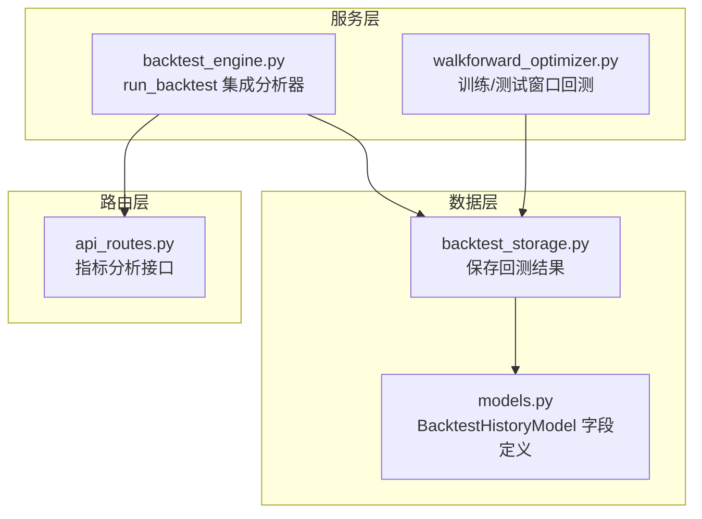
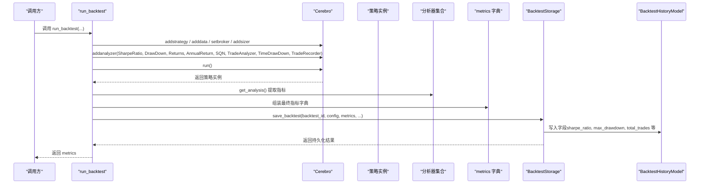
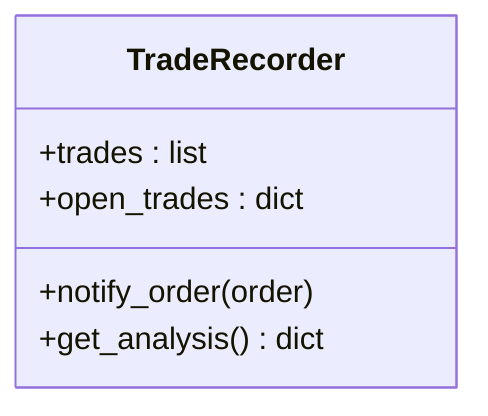
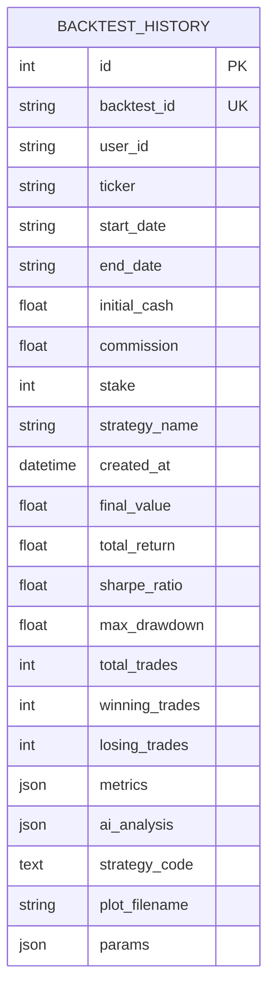
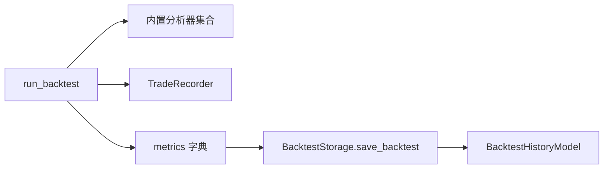

# 分析器集成与指标收集

<cite>
**本文引用的文件**
- [backtest_engine.py](file://backend/src/service/backtest_engine.py)
- [walkforward_optimizer.py](file://backend/src/service/walkforward_optimizer.py)
- [backtest_storage.py](file://backend/src/db/backtest_storage.py)
- [models.py](file://backend/src/db/models.py)
- [api_routes.py](file://backend/src/routes/api_routes.py)
</cite>

## 目录
1. [简介](#简介)
2. [项目结构](#项目结构)
3. [核心组件](#核心组件)
4. [架构总览](#架构总览)
5. [详细组件分析](#详细组件分析)
6. [依赖关系分析](#依赖关系分析)
7. [性能考量](#性能考量)
8. [故障排查指南](#故障排查指南)
9. [结论](#结论)

## 简介
本文件聚焦于Backtrader分析器在回测中的集成与指标收集流程，重点解析 run_backtest 函数中 addanalyzer 的使用方式，系统性梳理以下内置分析器与自定义分析器：
- 内置分析器：SharpeRatio（夏普比率）、DrawDown（最大回撤）、Returns（收益率）、AnnualReturn（年化收益）、SQN（系统质量数）、TradeAnalyzer（交易分析）、TimeDrawDown（时间回撤）
- 自定义分析器：TradeRecorder（交易记录），包含订单事件监听、开平仓信息记录、盈亏与手续费计算、持仓时长统计等

同时说明 run() 执行后如何从各分析器的 get_analysis() 提取指标数据，并构建最终的 metrics 字典；最后结合数据库模型，解释这些指标如何被持久化与索引（如 sharpe_ratio、max_drawdown 等字段）。

## 项目结构
围绕“分析器集成与指标收集”的关键文件分布如下：
- 后端服务层：run_backtest 集成分析器与指标提取
- 优化器：walkforward_optimizer 在训练/测试窗口中复用相同的分析器配置
- 数据持久化：backtest_storage 将指标写入数据库模型
- 数据库模型：BacktestHistoryModel 定义指标字段与索引

图表来源
- [backtest_engine.py](file://backend/src/service/backtest_engine.py#L302-L383)
- [walkforward_optimizer.py](file://backend/src/service/walkforward_optimizer.py#L181-L273)
- [backtest_storage.py](file://backend/src/db/backtest_storage.py#L41-L121)
- [models.py](file://backend/src/db/models.py#L282-L345)
- [api_routes.py](file://backend/src/routes/api_routes.py#L337-L369)

章节来源
- [backtest_engine.py](file://backend/src/service/backtest_engine.py#L302-L383)
- [walkforward_optimizer.py](file://backend/src/service/walkforward_optimizer.py#L181-L273)
- [backtest_storage.py](file://backend/src/db/backtest_storage.py#L41-L121)
- [models.py](file://backend/src/db/models.py#L282-L345)
- [api_routes.py](file://backend/src/routes/api_routes.py#L337-L369)

## 核心组件
- run_backtest：统一配置策略、数据源、佣金与资金、分析器，并在 cerebro.run() 后提取指标构建 metrics
- TradeRecorder：自定义分析器，基于 notify_order 记录每笔交易的开平仓细节、盈亏、手续费与持仓时长
- BacktestStorage：将 metrics 写入数据库，映射到 BacktestHistoryModel 的字段
- BacktestHistoryModel：定义指标字段（如 sharpe_ratio、max_drawdown、total_trades 等）并建立索引以支持查询排序

章节来源
- [backtest_engine.py](file://backend/src/service/backtest_engine.py#L302-L383)
- [backtest_storage.py](file://backend/src/db/backtest_storage.py#L41-L121)
- [models.py](file://backend/src/db/models.py#L282-L345)

## 架构总览
下图展示从 run_backtest 到指标入库的关键调用链路与数据流。

图表来源
- [backtest_engine.py](file://backend/src/service/backtest_engine.py#L302-L383)
- [backtest_storage.py](file://backend/src/db/backtest_storage.py#L41-L121)
- [models.py](file://backend/src/db/models.py#L282-L345)

## 详细组件分析

### run_backtest 中的分析器集成与指标提取
- 集成的内置分析器
  - SharpeRatio：用于计算风险调整后的收益
  - DrawDown：用于获取最大回撤
  - Returns：用于获取归一化收益率等
  - AnnualReturn：用于年度化收益
  - SQN：用于系统质量数评估
  - TradeAnalyzer：用于交易统计（胜/负、总交易数、盈亏等）
  - TimeDrawDown：用于时间回撤相关指标
- 自定义分析器 TradeRecorder：记录每笔交易的开仓/平仓日期、价格、数量、手续费、净利润、净收益率、持仓时长等，并提供汇总统计（总交易数、胜/负交易数、总/平均净利润）

运行流程要点
- 在 cerebro 上注册上述分析器
- 运行 cerebro.run() 后，从策略实例的分析器集合中调用 get_analysis() 获取指标
- 将指标组装为 metrics 字典并返回

章节来源
- [backtest_engine.py](file://backend/src/service/backtest_engine.py#L335-L364)

### TradeRecorder 实现原理
- 订单事件监听：通过重写 notify_order，在订单状态为 Completed 时记录交易信息
- 开平仓配对：以 ref 作为键跟踪未平仓订单，平仓时弹出对应开仓订单并计算盈亏
- 盈亏与手续费：根据成交价格、数量与手续费累加计算毛利润、总手续费与净利润
- 持仓时长：以日期差计算（天数），支持字符串或 datetime 对象
- 汇总输出：get_analysis 返回完整交易列表及统计指标（总/胜/负交易数、总/平均净利润）

图表来源
- [backtest_engine.py](file://backend/src/service/backtest_engine.py#L221-L299)

章节来源
- [backtest_engine.py](file://backend/src/service/backtest_engine.py#L221-L299)

### 指标提取与 metrics 构建
- 从各分析器 get_analysis() 中读取指标值，例如：
  - sharpe_ratio：SharpeRatio 的 sharperatio
  - max_drawdown：DrawDown 的 max.drawdown
  - total_return：Returns 的 rnorm100
  - annual_returns：AnnualReturn 的分析结果
  - sqn：SQN 的 sqn
  - trades：TradeAnalyzer 的分析结果
  - time_drawdown：TimeDrawDown 的分析结果
  - trade_details：TradeRecorder 的分析结果（含每笔交易明细与汇总统计）
- 最终 metrics 字典用于后续绘图、持久化与前端展示

章节来源
- [backtest_engine.py](file://backend/src/service/backtest_engine.py#L354-L364)

### 数据库模型与指标存储
- BacktestHistoryModel 字段
  - 关键指标字段：final_value、total_return、sharpe_ratio、max_drawdown、total_trades、winning_trades、losing_trades
  - 全量指标：metrics（完整指标字典）
  - 其他：ai_analysis、strategy_code、plot_filename、params 等
- 存储逻辑
  - BacktestStorage.save_backtest 将 metrics 中的关键指标映射到模型字段，并持久化
  - 支持自动清理旧记录与 JSON 异常清理

图表来源
- [models.py](file://backend/src/db/models.py#L282-L345)
- [backtest_storage.py](file://backend/src/db/backtest_storage.py#L41-L121)

章节来源
- [models.py](file://backend/src/db/models.py#L282-L345)
- [backtest_storage.py](file://backend/src/db/backtest_storage.py#L41-L121)

### 与 Walk-Forward 优化器的对比
- walkforward_optimizer 在每个训练/测试窗口同样注册相同分析器集合，并在单次回测完成后提取指标
- 区别在于：walkforward_optimizer 会额外计算训练/测试窗口的 overfitting 指标（如相关性、退化程度、一致性评分等），并将多窗口结果聚合

章节来源
- [walkforward_optimizer.py](file://backend/src/service/walkforward_optimizer.py#L181-L273)

### 前端与 API 层的指标使用
- 前端本地化文案中包含指标名称（如夏普比率、最大回撤、SQN、时间回撤等），用于界面展示
- API 路由层可基于 metrics 进行二次分析（如根据指标生成文本分析）

章节来源
- [api_routes.py](file://backend/src/routes/api_routes.py#L337-L369)

## 依赖关系分析
- run_backtest 依赖 Backtrader 分析器模块（SharpeRatio、DrawDown、Returns、AnnualReturn、SQN、TradeAnalyzer、TimeDrawDown）与自定义 TradeRecorder
- BacktestStorage 依赖 SQLAlchemy 模型 BacktestHistoryModel
- 数据流向：策略执行 → 分析器计算 → 指标提取 → 持久化 → 查询/展示

图表来源
- [backtest_engine.py](file://backend/src/service/backtest_engine.py#L302-L383)
- [backtest_storage.py](file://backend/src/db/backtest_storage.py#L41-L121)
- [models.py](file://backend/src/db/models.py#L282-L345)

章节来源
- [backtest_engine.py](file://backend/src/service/backtest_engine.py#L302-L383)
- [backtest_storage.py](file://backend/src/db/backtest_storage.py#L41-L121)
- [models.py](file://backend/src/db/models.py#L282-L345)

## 性能考量
- 分析器数量与计算复杂度：内置分析器通常在回测结束后一次性计算，TradeRecorder 会在每次订单完成时更新内存结构，建议在高频交易场景关注内存占用与序列化成本
- 指标提取路径：get_analysis() 仅在 run() 结束后可用，避免在回测过程中频繁访问导致重复计算
- 持久化写入：批量写入与索引字段（如 total_return、sharpe_ratio、max_drawdown、created_at）有助于后续查询与排序

## 故障排查指南
- 分析器返回空值或 None：部分指标（如 SharpeRatio）可能在无数据时返回 None，需在提取时做默认值处理
- JSON 序列化异常：BacktestHistoryModel 使用 SafeJSON 与 JSON 字段，若出现异常可触发清理逻辑
- 订单事件未触发：确认策略是否正确提交订单且订单状态进入 Completed；TradeRecorder 仅在 Completed 时记录

章节来源
- [backtest_engine.py](file://backend/src/service/backtest_engine.py#L354-L364)
- [backtest_storage.py](file://backend/src/db/backtest_storage.py#L188-L272)

## 结论
本项目通过在 run_backtest 中统一集成 Backtrader 内置分析器与自定义 TradeRecorder，实现了从订单事件到指标提取再到数据库持久化的完整闭环。关键指标（如夏普比率、最大回撤、收益率、SQN、时间回撤与交易明细）均被标准化提取并落库，便于后续查询、排序与可视化展示。Walk-Forward 优化器沿用了相同的分析器配置，进一步验证了指标体系的一致性与可扩展性。