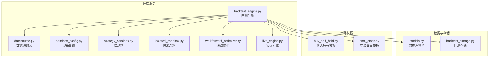
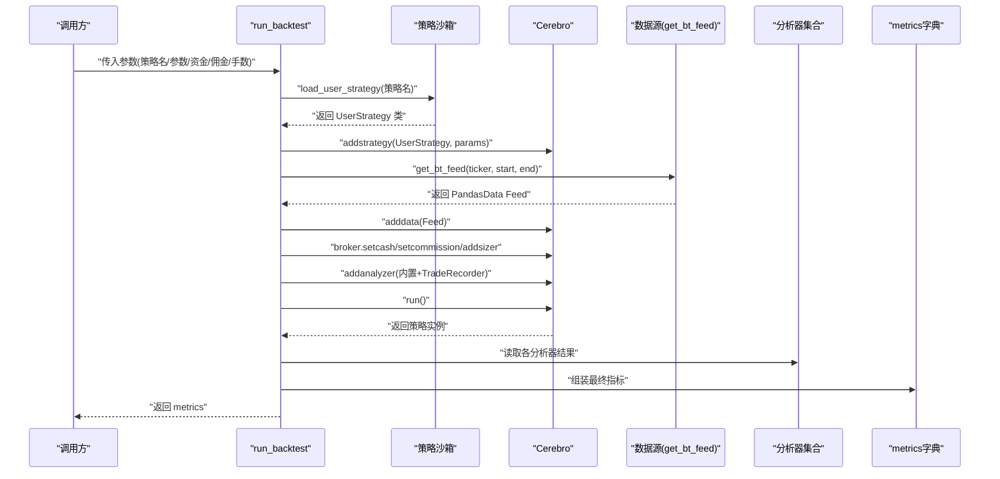
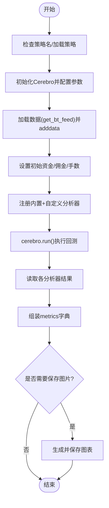
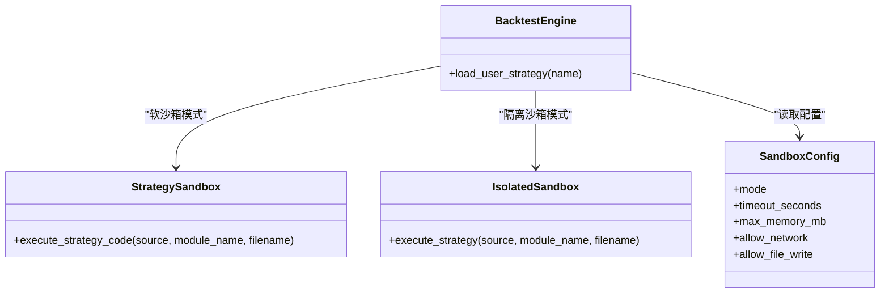
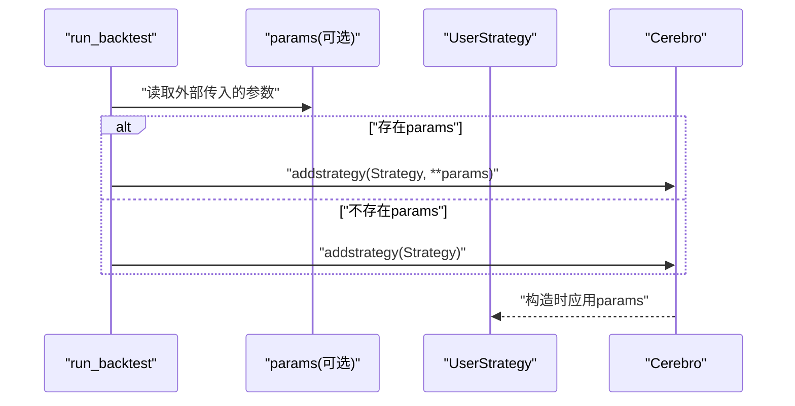
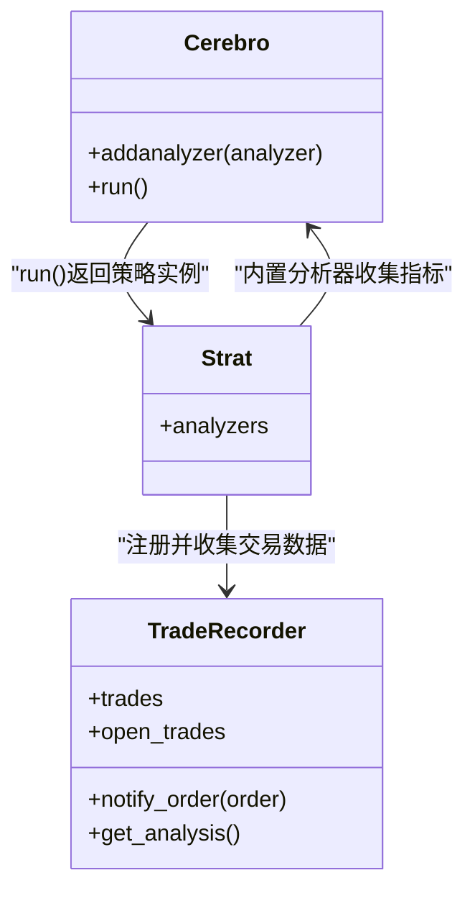
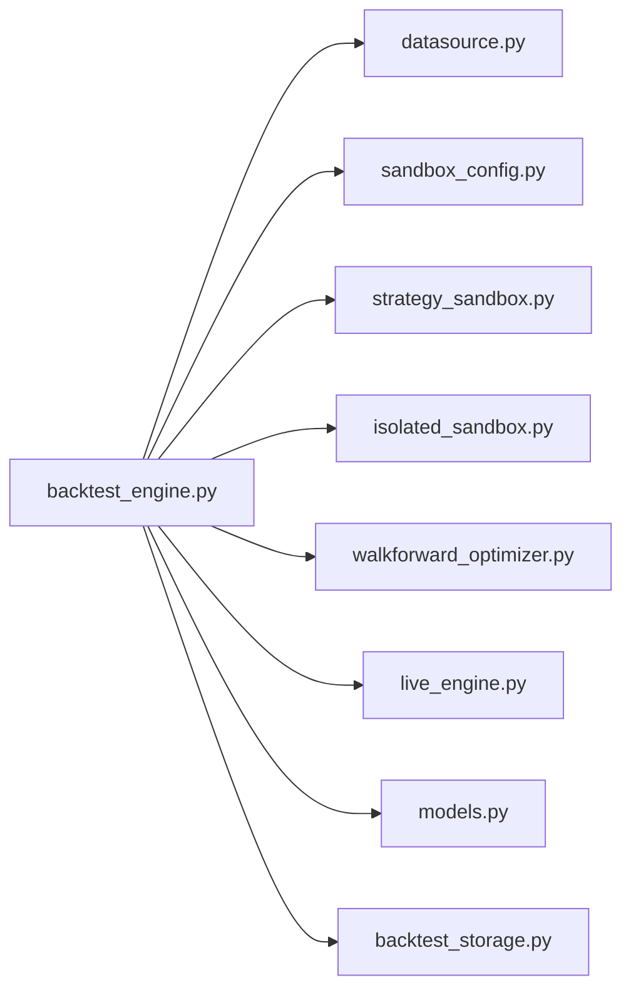

# 回测引擎执行

<cite>
**本文引用的文件**
- [backtest_engine.py](file://backend/src/service/backtest_engine.py)
- [datasource.py](file://backend/src/db/datasource.py)
- [sandbox_config.py](file://backend/src/config/sandbox_config.py)
- [strategy_sandbox.py](file://backend/src/service/strategy_sandbox.py)
- [isolated_sandbox.py](file://backend/src/service/isolated_sandbox.py)
- [test_backtest_engine.py](file://backend/tests/service/test_backtest_engine.py)
- [models.py](file://backend/src/db/models.py)
- [backtest_storage.py](file://backend/src/db/backtest_storage.py)
- [walkforward_optimizer.py](file://backend/src/service/walkforward_optimizer.py)
- [live_engine.py](file://backend/src/service/live_engine.py)
- [buy_and_hold.py](file://backend/resources/strategy/buy_and_hold.py)
- [sma_cross.py](file://backend/resources/strategy/sma_cross.py)
</cite>

## 目录
1. [引言](#引言)
2. [项目结构](#项目结构)
3. [核心组件](#核心组件)
4. [架构总览](#架构总览)
5. [详细组件分析](#详细组件分析)
6. [依赖关系分析](#依赖关系分析)
7. [性能考量](#性能考量)
8. [故障排查指南](#故障排查指南)
9. [结论](#结论)
10. [附录](#附录)

## 引言
本文件围绕后端服务中的回测引擎执行流程展开，重点解析 run_backtest 函数的完整生命周期：从策略沙箱加载 UserStrategy 类，到初始化 Backtrader 的 Cerebro 引擎、配置数据源与交易参数、注册内置与自定义分析器，再到运行回测并生成 metrics 字典。同时，我们将说明参数化回测（params）的注入机制、异常处理路径，以及最终绘图保存与指标导出的细节。

## 项目结构
回测引擎位于后端服务层，主要涉及以下模块：
- 后端服务：回测引擎、策略沙箱、配置与存储
- 数据层：数据源封装与数据库模型
- 前端：历史回测展示与交互

图表来源
- [backtest_engine.py](file://backend/src/service/backtest_engine.py#L302-L384)
- [datasource.py](file://backend/src/db/datasource.py#L219-L256)
- [sandbox_config.py](file://backend/src/config/sandbox_config.py#L53-L87)
- [strategy_sandbox.py](file://backend/src/service/strategy_sandbox.py#L179-L210)
- [isolated_sandbox.py](file://backend/src/service/isolated_sandbox.py#L181-L198)
- [walkforward_optimizer.py](file://backend/src/service/walkforward_optimizer.py#L219-L246)
- [live_engine.py](file://backend/src/service/live_engine.py#L190-L201)
- [models.py](file://backend/src/db/models.py#L311-L342)
- [backtest_storage.py](file://backend/src/db/backtest_storage.py#L42-L108)
- [buy_and_hold.py](file://backend/resources/strategy/buy_and_hold.py#L1-L11)
- [sma_cross.py](file://backend/resources/strategy/sma_cross.py#L1-L19)

章节来源
- [backtest_engine.py](file://backend/src/service/backtest_engine.py#L302-L384)
- [datasource.py](file://backend/src/db/datasource.py#L219-L256)
- [sandbox_config.py](file://backend/src/config/sandbox_config.py#L53-L87)

## 核心组件
- 回测引擎 run_backtest：负责策略加载、Cerebro 初始化、数据与参数配置、分析器注册、运行与指标提取。
- 策略沙箱：安全加载用户策略类，支持软沙箱与隔离沙箱两种模式。
- 数据源封装：提供 get_bt_feed 将 pandas DataFrame 包装为 Backtrader Feed。
- 分析器集合：内置分析器（夏普比率、最大回撤、收益、年化回报、SQN、交易分析、时间回撤）与自定义 TradeRecorder。
- 存储与模型：将 metrics 与回测结果持久化至数据库。

章节来源
- [backtest_engine.py](file://backend/src/service/backtest_engine.py#L302-L384)
- [strategy_sandbox.py](file://backend/src/service/strategy_sandbox.py#L179-L210)
- [datasource.py](file://backend/src/db/datasource.py#L219-L256)
- [models.py](file://backend/src/db/models.py#L311-L342)
- [backtest_storage.py](file://backend/src/db/backtest_storage.py#L42-L108)

## 架构总览
下图展示了 run_backtest 的关键调用链与组件交互。

图表来源
- [backtest_engine.py](file://backend/src/service/backtest_engine.py#L302-L384)
- [datasource.py](file://backend/src/db/datasource.py#L219-L256)
- [strategy_sandbox.py](file://backend/src/service/strategy_sandbox.py#L179-L210)

## 详细组件分析

### run_backtest 函数执行流程
- 策略选择与加载
  - 若未指定策略名，则列出可用策略并默认使用第一个；若无策略则抛出错误。
  - 通过 load_user_strategy 加载策略类，支持软沙箱与隔离沙箱两种模式，并校验是否继承自 bt.Strategy。
- 初始化 Cerebro
  - 创建 cerebro 实例，按 params 注入策略参数或使用策略默认参数。
  - 使用 get_bt_feed 获取数据并添加到 cerebro。
  - 设置初始资金、佣金率与固定手数。
- 注册分析器
  - 内置分析器：夏普比率、最大回撤、收益、年化回报、SQN、交易分析、时间回撤。
  - 自定义分析器：TradeRecorder，用于记录每笔交易的开平仓时间、价格、手续费、盈亏、净盈亏、收益率等，并统计胜率、总盈亏等汇总指标。
- 运行回测
  - 调用 cerebro.run() 执行回测；异常被捕获并记录日志后重新抛出。
  - 从返回的策略实例中读取各分析器结果，组装 metrics 字典。
- 可选绘图与保存
  - 若提供保存路径，关闭交互式绘图，生成蜡烛图并保存为图片。

图表来源
- [backtest_engine.py](file://backend/src/service/backtest_engine.py#L302-L384)

章节来源
- [backtest_engine.py](file://backend/src/service/backtest_engine.py#L302-L384)

### 策略沙箱加载机制
- 软沙箱（不推荐用于不受信任代码）
  - 限制导入模块与内置函数，仅允许有限的白名单；通过自定义 __builtins__ 与 __import__ 实现约束。
  - 适合可信策略或本地开发调试。
- 隔离沙箱（推荐）
  - 在独立子进程中执行策略代码，避免恶意代码对主进程造成影响。
  - 先在子进程中验证策略合法性，再在主进程中以软沙箱方式重新执行以获得实际类对象。
- 配置项
  - 通过环境变量控制沙箱模式、超时、内存上限、网络与文件写权限等。

图表来源
- [sandbox_config.py](file://backend/src/config/sandbox_config.py#L53-L87)
- [strategy_sandbox.py](file://backend/src/service/strategy_sandbox.py#L179-L210)
- [isolated_sandbox.py](file://backend/src/service/isolated_sandbox.py#L181-L198)
- [backtest_engine.py](file://backend/src/service/backtest_engine.py#L81-L165)

章节来源
- [strategy_sandbox.py](file://backend/src/service/strategy_sandbox.py#L179-L210)
- [sandbox_config.py](file://backend/src/config/sandbox_config.py#L53-L87)
- [backtest_engine.py](file://backend/src/service/backtest_engine.py#L81-L165)

### 数据源与参数化回测
- 数据源
  - get_bt_feed 将 pandas DataFrame 包装为 Backtrader Feed，供 cerebro.adddata 使用。
- 参数化回测
  - run_backtest 支持传入 params 字典，直接作为 addstrategy 的关键字参数注入策略的 params。
  - 提供 extract_strategy_params 接口可从策略类中提取参数元信息（名称、类型、默认值）。

图表来源
- [backtest_engine.py](file://backend/src/service/backtest_engine.py#L302-L333)
- [backtest_engine.py](file://backend/src/service/backtest_engine.py#L167-L218)

章节来源
- [backtest_engine.py](file://backend/src/service/backtest_engine.py#L167-L218)
- [backtest_engine.py](file://backend/src/service/backtest_engine.py#L302-L333)

### 分析器注册与数据收集
- 内置分析器
  - 夏普比率、最大回撤、收益、年化回报、SQN、交易分析、时间回撤。
- 自定义分析器 TradeRecorder
  - 记录每笔交易的开仓/平仓时间、价格、手续费、盈亏、净盈亏、收益率、持仓时长等。
  - 统计总交易数、胜/负交易数、总盈亏、平均盈亏等汇总指标。
- 数据收集时机
  - 在 cerebro.run() 执行期间，分析器通过回调或内部机制收集数据。
  - run_backtest 在结束后统一读取各分析器的 get_analysis 结果并组装到 metrics。

图表来源
- [backtest_engine.py](file://backend/src/service/backtest_engine.py#L221-L300)
- [backtest_engine.py](file://backend/src/service/backtest_engine.py#L335-L364)

章节来源
- [backtest_engine.py](file://backend/src/service/backtest_engine.py#L221-L300)
- [backtest_engine.py](file://backend/src/service/backtest_engine.py#L335-L364)

### 异常处理与日志
- 策略加载阶段
  - 策略文件缺失、类名不符、继承类型错误、沙箱超时/执行失败等均会抛出 StrategyLoadError。
- 运行阶段
  - cerebro.run() 抛出的异常会被捕获并记录日志，随后重新抛出，便于上层处理。
- 图表渲染
  - 绘图保存失败会记录异常并抛出 RuntimeError，确保调用方感知问题。

章节来源
- [backtest_engine.py](file://backend/src/service/backtest_engine.py#L81-L165)
- [backtest_engine.py](file://backend/src/service/backtest_engine.py#L344-L383)

### 最终 metrics 字典生成
- 指标来源
  - final_value：账户净值
  - sharpe：夏普比率
  - drawdown：最大回撤
  - returns：收益（归一化）
  - annual_returns：年化回报
  - sqn：系统质量指数
  - trades：交易分析汇总
  - time_drawdown：时间回撤
  - trade_details：TradeRecorder 的交易明细与汇总
- 生成位置
  - run_backtest 在 cerebro.run() 返回后，统一从各分析器读取结果并组装 metrics。

章节来源
- [backtest_engine.py](file://backend/src/service/backtest_engine.py#L354-L364)

### 与其他模块的协同
- 滚动优化
  - walkforward_optimizer 中同样调用 cerebro.run() 并读取相同指标，体现 run_backtest 的通用性。
- 实盘引擎
  - live_engine 也使用 TradeRecorder 与内置分析器，保持指标一致性。
- 数据库存储
  - backtest_storage 将 metrics 完整保存到数据库模型，字段覆盖关键指标与完整 metrics JSON。

章节来源
- [walkforward_optimizer.py](file://backend/src/service/walkforward_optimizer.py#L219-L246)
- [live_engine.py](file://backend/src/service/live_engine.py#L190-L201)
- [backtest_storage.py](file://backend/src/db/backtest_storage.py#L42-L108)
- [models.py](file://backend/src/db/models.py#L311-L342)

## 依赖关系分析
- 模块耦合
  - run_backtest 依赖策略沙箱、数据源封装、Backtrader 分析器体系。
  - TradeRecorder 依赖策略的 params 与订单通知回调。
- 外部依赖
  - backtrader、matplotlib、pandas。
- 循环依赖
  - 未发现循环依赖迹象；各模块职责清晰。

图表来源
- [backtest_engine.py](file://backend/src/service/backtest_engine.py#L302-L384)
- [datasource.py](file://backend/src/db/datasource.py#L219-L256)
- [sandbox_config.py](file://backend/src/config/sandbox_config.py#L53-L87)
- [strategy_sandbox.py](file://backend/src/service/strategy_sandbox.py#L179-L210)
- [isolated_sandbox.py](file://backend/src/service/isolated_sandbox.py#L181-L198)
- [walkforward_optimizer.py](file://backend/src/service/walkforward_optimizer.py#L219-L246)
- [live_engine.py](file://backend/src/service/live_engine.py#L190-L201)
- [models.py](file://backend/src/db/models.py#L311-L342)
- [backtest_storage.py](file://backend/src/db/backtest_storage.py#L42-L108)

## 性能考量
- 沙箱模式选择
  - 隔离沙箱更安全但有进程通信开销；软沙箱更快但安全性较低。根据部署场景权衡。
- 数据规模
  - get_bt_feed 直接包装 pandas DataFrame，建议在上游进行数据裁剪与清洗，减少不必要的列与观测点。
- 分析器数量
  - 内置分析器越多，计算开销越大；可根据需求裁剪分析器集合。
- 图表输出
  - 绘图保存会占用 IO 与内存，建议在批量任务中谨慎开启。

## 故障排查指南
- 策略加载失败
  - 确认策略文件存在且包含名为 UserStrategy 的类，且继承自 bt.Strategy。
  - 检查沙箱模式配置，必要时切换为 subprocess 模式。
- 运行异常
  - 查看日志中“Backtest run failed”条目，定位具体异常原因。
- 图表保存失败
  - 检查 matplotlib 后端与磁盘权限；确认保存路径存在且可写。
- 指标为空
  - 确认 cerebro.run() 成功执行且分析器已正确注册；检查 TradeRecorder 是否被调用（策略是否产生订单）。

章节来源
- [backtest_engine.py](file://backend/src/service/backtest_engine.py#L344-L383)
- [test_backtest_engine.py](file://backend/tests/service/test_backtest_engine.py#L1-L35)

## 结论
run_backtest 将策略沙箱、数据源、Cerebro 引擎与分析器体系有机整合，形成一套可扩展、可观测、可持久化的回测执行框架。通过参数化注入、自定义 TradeRecorder 与丰富的内置分析器，能够全面评估策略表现，并将结果稳定地导出到数据库与前端展示。建议在生产环境中优先采用隔离沙箱模式，并根据数据规模与分析需求合理配置分析器集合。

## 附录
- 策略模板参考
  - 买入持有模板：[buy_and_hold.py](file://backend/resources/strategy/buy_and_hold.py#L1-L11)
  - 均线交叉模板：[sma_cross.py](file://backend/resources/strategy/sma_cross.py#L1-L19)