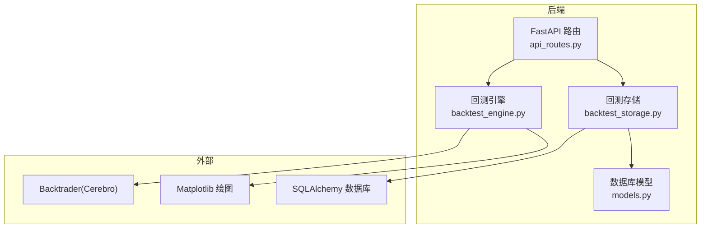
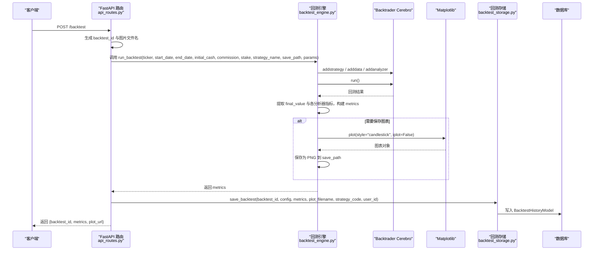
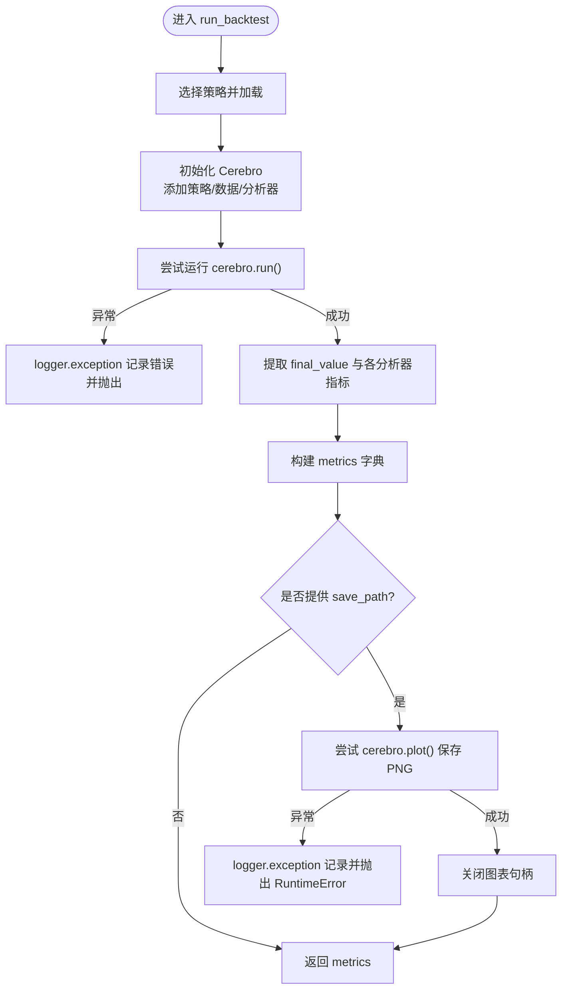
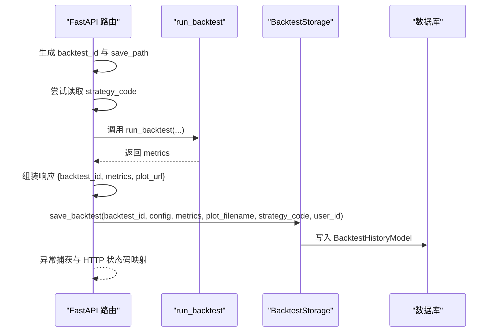
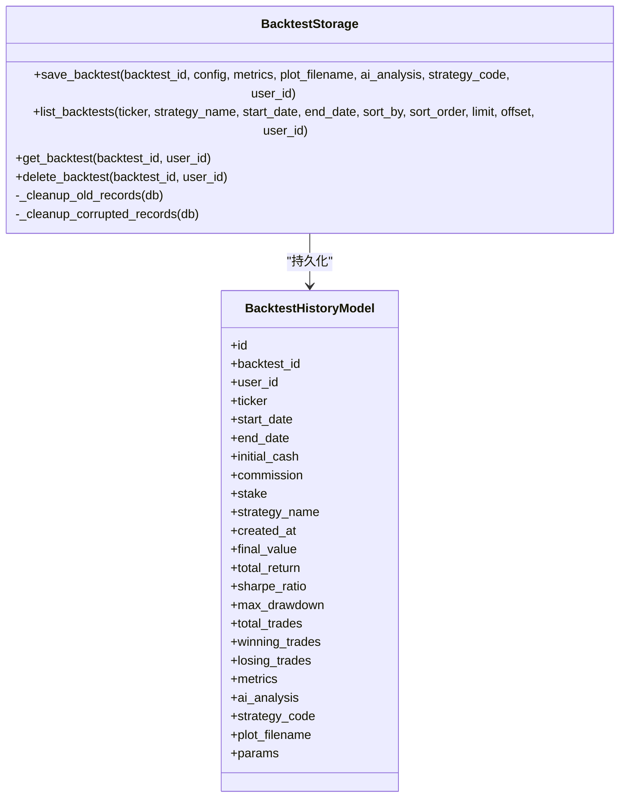
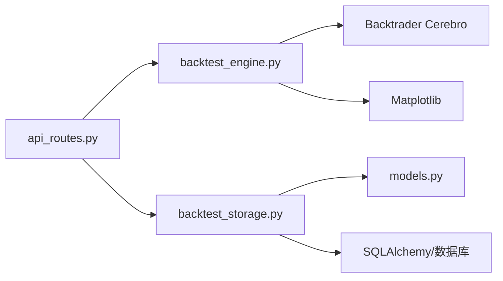

# 执行流程与异常处理

<cite>
**本文引用的文件**
- [backend/src/service/backtest_engine.py](file://backend/src/service/backtest_engine.py)
- [backend/src/routes/api_routes.py](file://backend/src/routes/api_routes.py)
- [backend/src/db/backtest_storage.py](file://backend/src/db/backtest_storage.py)
- [backend/src/db/models.py](file://backend/src/db/models.py)
</cite>

## 目录
1. [简介](#简介)
2. [项目结构](#项目结构)
3. [核心组件](#核心组件)
4. [架构总览](#架构总览)
5. [详细组件分析](#详细组件分析)
6. [依赖关系分析](#依赖关系分析)
7. [性能考量](#性能考量)
8. [故障排查指南](#故障排查指南)
9. [结论](#结论)

## 简介
本文件围绕“回测执行流程与异常处理”展开，系统梳理从 API 调用到结果持久化的端到端流程，重点说明：
- run_backtest 函数如何组织 Cerebro 回测、收集指标并返回；
- try-except 如何捕获回测执行异常并通过 logger.exception 记录；
- 成功执行后如何从 Cerebro 结果中提取 final_value 与各分析器数据，构建 metrics 字典；
- 当 save_path 存在时，如何调用 cerebro.plot() 生成回测图表并保存，以及绘图失败的异常处理；
- 结合 api_routes.py 与 backtest_storage.py，说明 metrics 与配置如何被封装并持久化到数据库 BacktestHistoryModel 中，确保流程健壮与可追溯。

## 项目结构
本项目采用前后端分离架构，后端以 FastAPI 提供接口，服务层负责回测引擎与策略沙箱，数据库层提供历史回测的持久化能力。与本主题直接相关的模块包括：
- 后端路由：接收请求、组装参数、调用回测引擎、落库与响应
- 回测引擎：构建 Cerebro、添加策略与数据、运行回测、提取指标、可选绘图
- 数据库存储：将回测配置与指标写入 BacktestHistoryModel，并提供查询、删除、清理等操作

**图表来源**
- [backend/src/routes/api_routes.py](file://backend/src/routes/api_routes.py#L215-L296)
- [backend/src/service/backtest_engine.py](file://backend/src/service/backtest_engine.py#L302-L384)
- [backend/src/db/backtest_storage.py](file://backend/src/db/backtest_storage.py#L41-L118)
- [backend/src/db/models.py](file://backend/src/db/models.py#L282-L345)

**章节来源**
- [backend/src/routes/api_routes.py](file://backend/src/routes/api_routes.py#L215-L296)
- [backend/src/service/backtest_engine.py](file://backend/src/service/backtest_engine.py#L302-L384)
- [backend/src/db/backtest_storage.py](file://backend/src/db/backtest_storage.py#L41-L118)
- [backend/src/db/models.py](file://backend/src/db/models.py#L282-L345)

## 核心组件
- run_backtest：核心执行函数，负责策略加载、数据注入、Cerebro 初始化、运行、指标提取、可选绘图与返回。
- API 路由 backtest：接收前端请求，生成 backtest_id，调用 run_backtest，构造响应并异步落库。
- BacktestStorage：数据库访问层，将 config 与 metrics 写入 BacktestHistoryModel，并提供列表、查询、删除、清理等能力。
- BacktestHistoryModel：数据库表映射，包含回测配置、关键指标、完整 metrics JSON、AI 分析、策略代码快照、图表文件名与参数等字段。

**章节来源**
- [backend/src/service/backtest_engine.py](file://backend/src/service/backtest_engine.py#L302-L384)
- [backend/src/routes/api_routes.py](file://backend/src/routes/api_routes.py#L215-L296)
- [backend/src/db/backtest_storage.py](file://backend/src/db/backtest_storage.py#L41-L118)
- [backend/src/db/models.py](file://backend/src/db/models.py#L282-L345)

## 架构总览
下图展示从 API 请求到回测执行、指标提取、绘图与持久化的完整链路。

**图表来源**
- [backend/src/routes/api_routes.py](file://backend/src/routes/api_routes.py#L215-L296)
- [backend/src/service/backtest_engine.py](file://backend/src/service/backtest_engine.py#L302-L384)
- [backend/src/db/backtest_storage.py](file://backend/src/db/backtest_storage.py#L41-L118)

## 详细组件分析

### run_backtest 执行与异常处理
- 策略选择与加载：若未指定策略名，则自动选择可用策略；随后加载用户策略类，支持软/硬沙箱模式。
- Cerebro 初始化：添加策略、数据源、资金、手续费、固定仓位、多个分析器（夏普比率、最大回撤、收益、年化收益、SQN、交易分析、时间回撤）及自定义 TradeRecorder。
- 运行回测：使用 try-except 捕获 cerebro.run() 异常，记录详细日志并向上抛出，保证异常可追踪。
- 指标提取：从 cerebro.broker 与各分析器中提取最终净值、夏普比率、最大回撤、累计收益、年化收益、SQN、交易统计与 TradeRecorder 的交易明细，形成 metrics 字典。
- 可选绘图：当 save_path 存在时，关闭交互式绘图，调用 cerebro.plot() 生成图表并保存为 PNG；绘图失败时记录异常并抛出 RuntimeError，确保上层感知。

**图表来源**
- [backend/src/service/backtest_engine.py](file://backend/src/service/backtest_engine.py#L302-L384)

**章节来源**
- [backend/src/service/backtest_engine.py](file://backend/src/service/backtest_engine.py#L302-L384)

### API 路由 backtest：请求处理与落库
- 生成 backtest_id 与图片文件名，拼接 IMAGES_DIR 路径作为 save_path。
- 在调用 run_backtest 前尝试读取策略代码（用于落库时保留快照），失败则记录告警但不影响回测。
- 接收 metrics 后构造响应，包含 backtest_id、metrics 与 plot_url。
- 异步非阻塞地调用 BacktestStorage.save_backtest，传入 config（含策略名、参数、初始资金、手续费、手数等）、metrics、plot_filename、strategy_code 与 user_id；落库异常仅记录日志，不中断响应。
- 对 StrategyLoadError、DataLoadError 与通用异常进行分类处理，返回合适的 HTTP 状态码与错误信息。

**图表来源**
- [backend/src/routes/api_routes.py](file://backend/src/routes/api_routes.py#L215-L296)
- [backend/src/db/backtest_storage.py](file://backend/src/db/backtest_storage.py#L41-L118)

**章节来源**
- [backend/src/routes/api_routes.py](file://backend/src/routes/api_routes.py#L215-L296)

### 数据库存储：BacktestStorage 与 BacktestHistoryModel
- BacktestStorage.save_backtest：将 config 与 metrics 转换为 BacktestHistoryModel 记录，写入数据库；同时维护索引字段（如 final_value、total_return、sharpe_ratio、max_drawdown、total_trades、winning_trades、losing_trades）便于快速排序与筛选。
- BacktestStorage.list_backtests/get_backtest/delete_backtest：提供历史查询、详情获取与删除功能；删除时同步删除对应图片文件。
- BacktestStorage._cleanup_old_records：超过上限（MAX_RECORDS=100）时自动清理最旧记录，并删除其关联的图片文件。
- BacktestStorage._cleanup_corrupted_records：检测并清理 metrics 或 ai_analysis 为空或无效的记录，保障查询稳定性。
- BacktestHistoryModel：定义了回测历史表结构，包含回测标识、用户标识、配置参数、关键指标、完整 metrics JSON、AI 分析、策略代码快照、图表文件名与参数等字段。

**图表来源**
- [backend/src/db/backtest_storage.py](file://backend/src/db/backtest_storage.py#L41-L118)
- [backend/src/db/models.py](file://backend/src/db/models.py#L282-L345)

**章节来源**
- [backend/src/db/backtest_storage.py](file://backend/src/db/backtest_storage.py#L41-L118)
- [backend/src/db/models.py](file://backend/src/db/models.py#L282-L345)

## 依赖关系分析
- API 层依赖回测引擎与存储层；回测引擎依赖 Backtrader、Matplotlib 与数据源；存储层依赖 SQLAlchemy 与数据库。
- 关键耦合点：
  - run_backtest 与 cerebro.run() 的异常传播链路；
  - API 层对 StrategyLoadError/DataLoadError 的显式处理；
  - BacktestStorage 对数据库连接、事务与清理逻辑的封装。

**图表来源**
- [backend/src/routes/api_routes.py](file://backend/src/routes/api_routes.py#L215-L296)
- [backend/src/service/backtest_engine.py](file://backend/src/service/backtest_engine.py#L302-L384)
- [backend/src/db/backtest_storage.py](file://backend/src/db/backtest_storage.py#L41-L118)
- [backend/src/db/models.py](file://backend/src/db/models.py#L282-L345)

**章节来源**
- [backend/src/routes/api_routes.py](file://backend/src/routes/api_routes.py#L215-L296)
- [backend/src/service/backtest_engine.py](file://backend/src/service/backtest_engine.py#L302-L384)
- [backend/src/db/backtest_storage.py](file://backend/src/db/backtest_storage.py#L41-L118)
- [backend/src/db/models.py](file://backend/src/db/models.py#L282-L345)

## 性能考量
- 绘图优化：在保存图表前设置图形尺寸与 DPI，避免过大图像导致 IO 压力；绘图完成后及时关闭句柄，防止资源泄漏。
- 数据库写入：save_backtest 使用事务提交，失败回滚；列表查询时对关键字段建立索引，提升排序与过滤效率。
- 清理策略：定期清理超限记录与损坏 JSON 的记录，保持数据库健康与查询稳定。
- 异步落库：API 层对落库操作采用 try-except 并记录日志，避免影响主流程响应时间。

[本节为通用建议，无需具体文件分析]

## 故障排查指南
- 回测运行失败
  - 现象：cerebro.run() 抛出异常，API 返回 500。
  - 处理：查看后端日志中 logger.exception 输出的详细堆栈；确认策略文件是否存在、语法正确且继承自 bt.Strategy；检查沙箱模式与超时设置。
  - 参考路径
    - [backend/src/service/backtest_engine.py](file://backend/src/service/backtest_engine.py#L344-L348)
    - [backend/src/routes/api_routes.py](file://backend/src/routes/api_routes.py#L287-L296)

- 绘图保存失败
  - 现象：cerebro.plot() 抛出异常，API 返回 500。
  - 处理：查看 logger.exception 输出；确认 save_path 目录可写、磁盘空间充足；检查 Matplotlib 后端配置（已设置 Agg）。
  - 参考路径
    - [backend/src/service/backtest_engine.py](file://backend/src/service/backtest_engine.py#L366-L381)

- 策略加载失败
  - 现象：StrategyLoadError，API 返回 400。
  - 处理：检查策略文件名、路径与沙箱配置；确认策略类名为 UserStrategy 且继承自 bt.Strategy。
  - 参考路径
    - [backend/src/service/backtest_engine.py](file://backend/src/service/backtest_engine.py#L81-L164)
    - [backend/src/routes/api_routes.py](file://backend/src/routes/api_routes.py#L287-L289)

- 数据库写入失败
  - 现象：save_backtest 抛出异常，API 仍返回 200，但历史中无记录。
  - 处理：查看存储层日志；确认数据库连接、表结构与字段类型；必要时触发 _cleanup_corrupted_records 清理损坏记录。
  - 参考路径
    - [backend/src/db/backtest_storage.py](file://backend/src/db/backtest_storage.py#L114-L118)

- 历史查询异常
  - 现象：list_backtests 查询报错或返回空。
  - 处理：查看存储层对损坏 JSON 的清理与重试逻辑；确认过滤条件与排序字段有效。
  - 参考路径
    - [backend/src/db/backtest_storage.py](file://backend/src/db/backtest_storage.py#L254-L263)

**章节来源**
- [backend/src/service/backtest_engine.py](file://backend/src/service/backtest_engine.py#L344-L381)
- [backend/src/routes/api_routes.py](file://backend/src/routes/api_routes.py#L287-L296)
- [backend/src/db/backtest_storage.py](file://backend/src/db/backtest_storage.py#L114-L118)

## 结论
该流程通过明确的分层设计实现了从 API 请求到回测执行、指标提取、可选绘图与数据库持久化的闭环：
- run_backtest 严格捕获并记录异常，确保问题可追溯；
- API 层在保证响应可用的前提下异步落库，增强用户体验；
- BacktestStorage 以索引字段与清理机制保障查询性能与数据健康；
- BacktestHistoryModel 完整承载回测配置、指标与可视化产物，满足后续分析与审计需求。