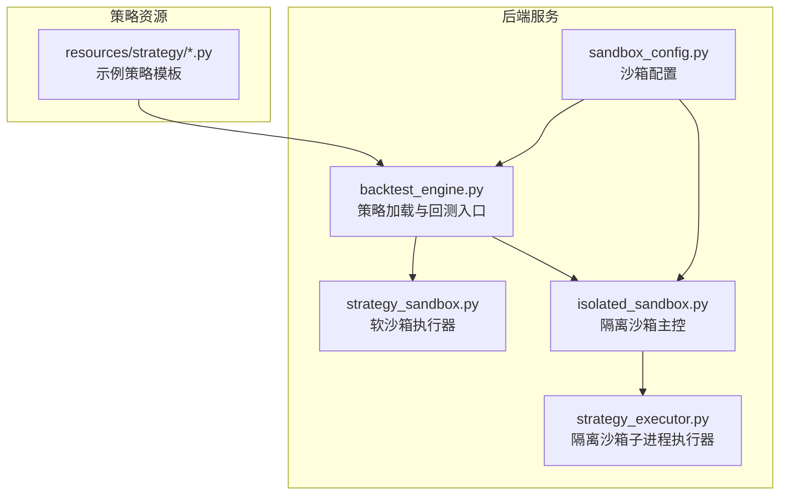
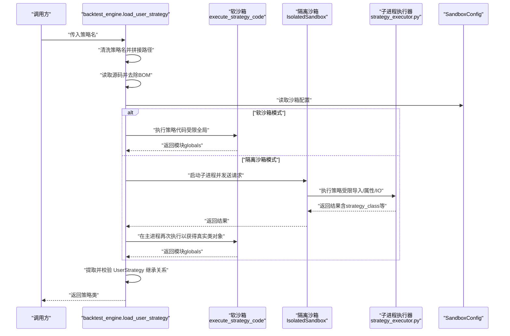
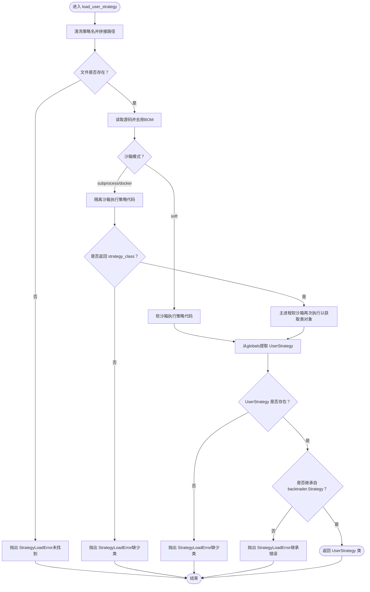
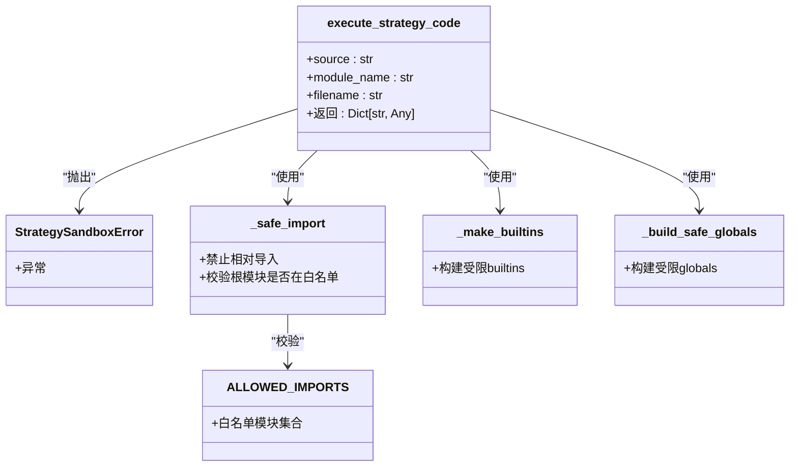
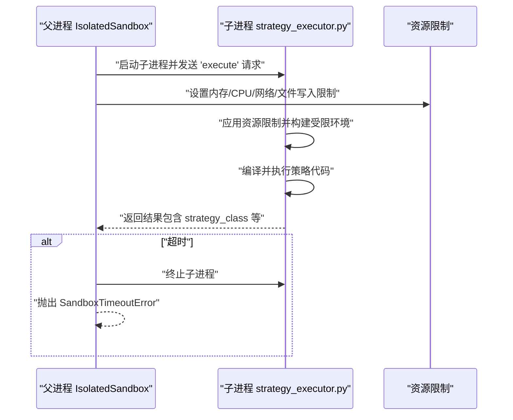
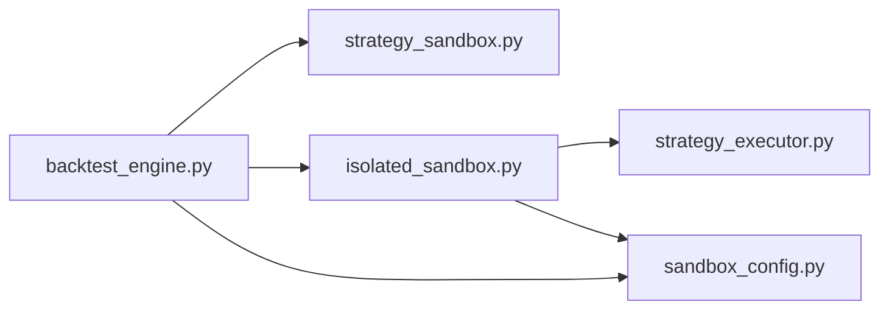

# 策略加载机制

<cite>
**本文引用的文件列表**
- [backend/src/service/backtest_engine.py](file://backend/src/service/backtest_engine.py)
- [backend/src/service/strategy_sandbox.py](file://backend/src/service/strategy_sandbox.py)
- [backend/src/service/isolated_sandbox.py](file://backend/src/service/isolated_sandbox.py)
- [backend/src/service/strategy_executor.py](file://backend/src/service/strategy_executor.py)
- [backend/src/config/sandbox_config.py](file://backend/src/config/sandbox_config.py)
- [backend/resources/strategy/sma_cross.py](file://backend/resources/strategy/sma_cross.py)
</cite>

## 目录
1. [引言](#引言)
2. [项目结构](#项目结构)
3. [核心组件](#核心组件)
4. [架构总览](#架构总览)
5. [详细组件分析](#详细组件分析)
6. [依赖关系分析](#依赖关系分析)
7. [性能与资源限制](#性能与资源限制)
8. [故障排查指南](#故障排查指南)
9. [结论](#结论)

## 引言
本文件围绕策略加载机制展开，重点解析后端服务中策略加载入口函数 load_user_strategy 的工作流程，涵盖：
- 策略名称的安全清洗与路径校验
- 文件存在性检查与源码读取
- 两种沙箱模式（软沙箱与子进程隔离沙箱）的工作原理与安全考量
- 在软沙箱模式下通过 execute_strategy_code 执行策略代码
- 在隔离沙箱模式下“先验证后安全执行”的双重保障机制
- 策略类 UserStrategy 的提取与校验（必须继承自 backtrader.Strategy）
- 异常处理流程（StrategyLoadError、SandboxTimeoutError 等）及其触发条件与应对策略

## 项目结构
策略加载相关代码主要分布在以下模块：
- 后端服务层：策略加载与回测引擎
- 沙箱执行层：软沙箱与隔离沙箱
- 配置层：沙箱运行参数来源
- 示例策略：用于演示 UserStrategy 类的正确写法

图表来源
- [backend/src/service/backtest_engine.py](file://backend/src/service/backtest_engine.py#L81-L165)
- [backend/src/service/strategy_sandbox.py](file://backend/src/service/strategy_sandbox.py#L179-L210)
- [backend/src/service/isolated_sandbox.py](file://backend/src/service/isolated_sandbox.py#L181-L283)
- [backend/src/service/strategy_executor.py](file://backend/src/service/strategy_executor.py#L498-L560)
- [backend/src/config/sandbox_config.py](file://backend/src/config/sandbox_config.py#L53-L87)
- [backend/resources/strategy/sma_cross.py](file://backend/resources/strategy/sma_cross.py#L1-L18)

章节来源
- [backend/src/service/backtest_engine.py](file://backend/src/service/backtest_engine.py#L1-L200)
- [backend/src/config/sandbox_config.py](file://backend/src/config/sandbox_config.py#L1-L115)

## 核心组件
- 策略加载入口：load_user_strategy
- 软沙箱执行器：execute_strategy_code
- 隔离沙箱主控：IsolatedSandbox
- 子进程执行器：strategy_executor.py
- 沙箱配置：SandboxConfig 及环境变量

章节来源
- [backend/src/service/backtest_engine.py](file://backend/src/service/backtest_engine.py#L81-L165)
- [backend/src/service/strategy_sandbox.py](file://backend/src/service/strategy_sandbox.py#L179-L210)
- [backend/src/service/isolated_sandbox.py](file://backend/src/service/isolated_sandbox.py#L181-L283)
- [backend/src/service/strategy_executor.py](file://backend/src/service/strategy_executor.py#L498-L560)
- [backend/src/config/sandbox_config.py](file://backend/src/config/sandbox_config.py#L53-L87)

## 架构总览
策略加载的整体流程如下：
- 输入策略名，进行安全清洗并定位策略文件
- 读取源码，根据配置选择沙箱模式
- 软沙箱：直接在当前进程中受限执行，快速但安全性较低
- 隔离沙箱：在独立子进程中执行，具备超时、内存限制、导入白名单、危险属性拦截等安全措施；先验证再在主进程安全执行
- 提取 UserStrategy 类并校验其继承自 backtrader.Strategy
- 返回策略类供后续回测使用

图表来源
- [backend/src/service/backtest_engine.py](file://backend/src/service/backtest_engine.py#L81-L165)
- [backend/src/service/strategy_sandbox.py](file://backend/src/service/strategy_sandbox.py#L179-L210)
- [backend/src/service/isolated_sandbox.py](file://backend/src/service/isolated_sandbox.py#L181-L283)
- [backend/src/service/strategy_executor.py](file://backend/src/service/strategy_executor.py#L427-L496)
- [backend/src/config/sandbox_config.py](file://backend/src/config/sandbox_config.py#L53-L87)

## 详细组件分析

### load_user_strategy 函数详解
- 安全清洗与路径验证
  - 对输入策略名进行去空白、去后缀、仅允许字母数字横线连字符的正则校验，并统一输出为“<name>.py”
  - 使用 STRATEGY_DIR + 清洗后的文件名拼接绝对路径
  - 若文件不存在，抛出 StrategyLoadError
- 源码读取与预处理
  - 读取 UTF-8 文本，若开头存在 BOM 则移除
- 沙箱模式选择
  - 从配置模块读取 SandboxConfig，支持 soft、subprocess、docker 三种模式
  - 若为 soft，则使用软沙箱执行策略代码
  - 若为 subprocess 或 docker，则使用隔离沙箱执行策略代码
- 隔离沙箱模式的“先验证后安全执行”双保险
  - 先通过 IsolatedSandbox.execute_strategy 在子进程中执行策略，返回包含 strategy_class 等信息的结果
  - 若子进程未返回 strategy_class，抛出 StrategyLoadError
  - 再在主进程中使用软沙箱执行策略，以获得真正的类对象（子进程无法直接返回类对象）
- 策略类提取与校验
  - 从模块 globals 中查找名为 UserStrategy 的类
  - 若未找到，抛出 StrategyLoadError
  - 若类存在但不是 backtrader.Strategy 的子类，抛出 StrategyLoadError
- 异常映射
  - SandboxTimeoutError 映射为 StrategyLoadError（带超时提示）
  - SandboxError/SandboxExecutionError 映射为 StrategyLoadError
  - OSError/StrategySandboxError 映射为 StrategyLoadError
- 返回值
  - 返回 UserStrategy 类型，供后续回测添加策略使用

图表来源
- [backend/src/service/backtest_engine.py](file://backend/src/service/backtest_engine.py#L81-L165)

章节来源
- [backend/src/service/backtest_engine.py](file://backend/src/service/backtest_engine.py#L81-L165)

### 软沙箱模式（soft sandbox）
- 设计目标
  - 在当前进程中对策略代码进行受限执行，便于调试与快速迭代
- 安全限制
  - 仅允许白名单模块导入（如 backtrader、pandas、numpy 等）
  - 重定义 __builtins__，仅暴露有限内置函数与异常类型
  - 屏蔽危险属性访问（如 __bases__、__code__、__globals__ 等）
  - 禁止相对导入
- 执行流程
  - 构建受限 globals（包含 bt、pd 等），设置 __name__、__file__ 等
  - 编译源码为字节码，捕获语法错误
  - 在受限环境中执行，捕获执行期异常并转换为 StrategySandboxError
  - 将执行产生的 globals 注册到 sys.modules，便于后续提取 UserStrategy
- 安全风险
  - 无法完全阻断反射、对象图遍历、文件系统与网络访问等高级攻击手段
  - 建议仅在可信策略或开发阶段使用

图表来源
- [backend/src/service/strategy_sandbox.py](file://backend/src/service/strategy_sandbox.py#L42-L210)

章节来源
- [backend/src/service/strategy_sandbox.py](file://backend/src/service/strategy_sandbox.py#L1-L213)

### 隔离沙箱模式（subprocess sandbox）
- 设计目标
  - 通过子进程隔离执行策略，提供更强的安全边界与资源限制
- 主控流程（IsolatedSandbox）
  - 启动子进程 strategy_executor.py，传递资源限制参数（内存、CPU、网络、文件写入）
  - 通过标准输入/输出以 JSON 协议发送请求（execute/validate/shutdown）
  - 设置超时，超时则终止子进程并抛出 SandboxTimeoutError
  - 解析子进程响应，成功时返回包含 strategy_class 等信息的结果
- 子进程执行器（strategy_executor.py）
  - 应用平台特定资源限制（Linux 使用 RLIMIT_AS/RLIMIT_CPU，Windows 通过 psutil 监控）
  - 构建受限 builtins 与导入白名单，屏蔽危险属性访问
  - 编译并执行策略代码，提取可序列化全局变量与 UserStrategy 类
  - 返回 JSON 响应给父进程
- “先验证后安全执行”的双重保障
  - 先在子进程中执行策略，返回 strategy_class 名称，确认策略结构有效
  - 再在主进程使用软沙箱执行策略，获得真实类对象，避免跨进程传递类对象的问题

图表来源
- [backend/src/service/isolated_sandbox.py](file://backend/src/service/isolated_sandbox.py#L181-L283)
- [backend/src/service/strategy_executor.py](file://backend/src/service/strategy_executor.py#L498-L560)

章节来源
- [backend/src/service/isolated_sandbox.py](file://backend/src/service/isolated_sandbox.py#L1-L393)
- [backend/src/service/strategy_executor.py](file://backend/src/service/strategy_executor.py#L1-L560)

### 策略类提取与继承校验
- 提取 UserStrategy 类
  - 在软沙箱模式下，直接从模块 globals 中获取键为 UserStrategy 的类对象
  - 在隔离沙箱模式下，先由子进程返回 strategy_class 名称，再在主进程软沙箱中获取类对象
- 继承校验
  - 使用 issubclass 检查 UserStrategy 是否继承自 backtrader.Strategy
  - 若不满足，抛出 StrategyLoadError
- 参数提取（辅助功能）
  - 通过策略类的 params 元类提取参数名称、默认值与类型，用于前端展示与回测参数注入

章节来源
- [backend/src/service/backtest_engine.py](file://backend/src/service/backtest_engine.py#L167-L218)

### 策略文件示例与规范
- 示例策略模板展示了正确的 UserStrategy 类定义方式，必须继承自 backtrader.Strategy，并包含必要的初始化与交易逻辑
- 建议用户在编辑器中参考示例模板编写策略，确保符合框架约定

章节来源
- [backend/resources/strategy/sma_cross.py](file://backend/resources/strategy/sma_cross.py#L1-L18)

## 依赖关系分析
- 模块耦合
  - backtest_engine 依赖 strategy_sandbox（软沙箱）与 isolated_sandbox（隔离沙箱）
  - isolated_sandbox 依赖 strategy_executor（子进程执行器）
  - sandbox_config 为两者提供统一的配置来源
- 外部依赖
  - backtrader、pandas、numpy 等第三方库在沙箱内受控可用
- 循环依赖
  - 未发现循环导入；各模块职责清晰，接口稳定

图表来源
- [backend/src/service/backtest_engine.py](file://backend/src/service/backtest_engine.py#L1-L60)
- [backend/src/service/isolated_sandbox.py](file://backend/src/service/isolated_sandbox.py#L1-L60)
- [backend/src/service/strategy_sandbox.py](file://backend/src/service/strategy_sandbox.py#L1-L40)
- [backend/src/config/sandbox_config.py](file://backend/src/config/sandbox_config.py#L1-L40)

章节来源
- [backend/src/service/backtest_engine.py](file://backend/src/service/backtest_engine.py#L1-L120)
- [backend/src/service/isolated_sandbox.py](file://backend/src/service/isolated_sandbox.py#L1-L120)
- [backend/src/service/strategy_sandbox.py](file://backend/src/service/strategy_sandbox.py#L1-L120)
- [backend/src/config/sandbox_config.py](file://backend/src/config/sandbox_config.py#L1-L115)

## 性能与资源限制
- 超时控制
  - 隔离沙箱通过线程定时器在父进程侧检测子进程是否超时，超时即终止子进程并抛出 SandboxTimeoutError
- 内存限制
  - Linux 下通过 RLIMIT_AS 设置虚拟地址空间上限；Windows 下通过 psutil 监控并在超出阈值时终止
- CPU 限制
  - Linux 下通过 RLIMIT_CPU 限制 CPU 时间；Windows 下通过 psutil 监控
- 导入与 IO 限制
  - 仅允许白名单模块导入；默认禁用文件写入；可按配置开启网络访问
- 进程池与缓存
  - 配置支持进程池大小与缓存开关，有助于减少重复启动成本与提升执行效率

章节来源
- [backend/src/service/isolated_sandbox.py](file://backend/src/service/isolated_sandbox.py#L181-L283)
- [backend/src/service/strategy_executor.py](file://backend/src/service/strategy_executor.py#L32-L119)
- [backend/src/config/sandbox_config.py](file://backend/src/config/sandbox_config.py#L53-L87)

## 故障排查指南
- 常见异常与触发条件
  - StrategyLoadError
    - 策略文件不存在或读取失败
    - 未找到 UserStrategy 类
    - UserStrategy 未继承自 backtrader.Strategy
    - 软沙箱执行失败（语法错误、导入非法、反射越界等）
    - 隔离沙箱执行失败（子进程返回错误）
    - 超时导致的加载失败（SandboxTimeoutError 映射）
  - SandboxTimeoutError
    - 子进程执行超过配置的超时时间，父进程终止子进程并抛出
  - SandboxError/SandboxExecutionError
    - 子进程执行期间发生异常或资源限制触发
  - OSError/StrategySandboxError
    - 文件系统或软沙箱约束被违反
- 排错建议
  - 检查策略名是否仅包含字母数字横线连字符，且不含路径穿越字符
  - 确认策略文件位于 STRATEGY_DIR 下，且编码为 UTF-8（自动去除 BOM）
  - 在隔离沙箱模式下，适当提高超时与内存限制以避免误判
  - 确保策略类名为 UserStrategy，并继承自 backtrader.Strategy
  - 如需网络或文件写入，请在配置中显式开启相应权限
  - 使用 validate_strategy 功能先验证策略源码，定位语法与危险模式问题

章节来源
- [backend/src/service/backtest_engine.py](file://backend/src/service/backtest_engine.py#L149-L165)
- [backend/src/service/isolated_sandbox.py](file://backend/src/service/isolated_sandbox.py#L205-L283)
- [backend/src/service/strategy_sandbox.py](file://backend/src/service/strategy_sandbox.py#L179-L210)

## 结论
- load_user_strategy 通过“软沙箱/隔离沙箱”双通道设计，在安全与性能之间取得平衡
- 隔离沙箱模式提供强安全边界与资源限制，适合生产环境与不可信策略
- 软沙箱模式便于开发与调试，但需谨慎使用
- 严格的策略类提取与继承校验确保策略兼容性
- 通过配置模块集中管理沙箱参数，便于运维与扩展