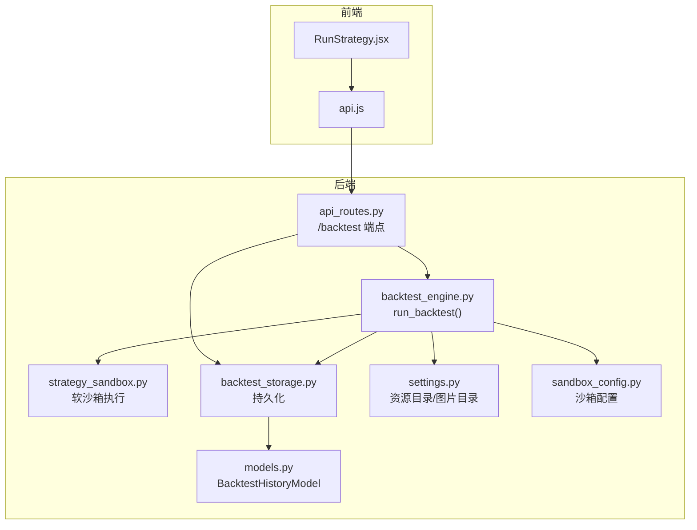
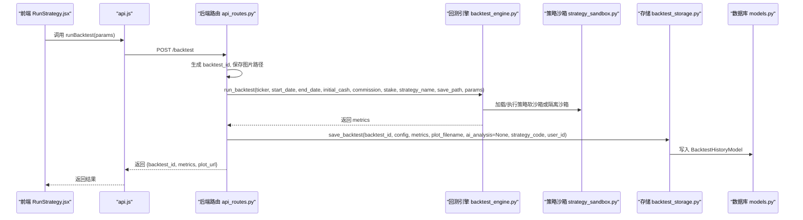
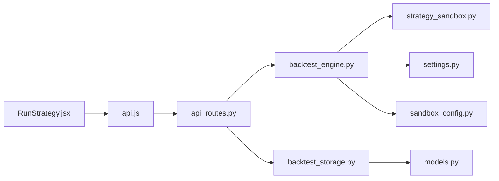

# 回测数据流

<cite>
**本文引用的文件**
- [api.js](file://frontend/src/services/api.js)
- [RunStrategy.jsx](file://frontend/src/pages/RunStrategy.jsx)
- [api_routes.py](file://backend/src/routes/api_routes.py)
- [backtest_engine.py](file://backend/src/service/backtest_engine.py)
- [strategy_sandbox.py](file://backend/src/service/strategy_sandbox.py)
- [backtest_storage.py](file://backend/src/db/backtest_storage.py)
- [models.py](file://backend/src/db/models.py)
- [settings.py](file://backend/src/config/settings.py)
- [sandbox_config.py](file://backend/src/config/sandbox_config.py)
</cite>

## 目录
1. [引言](#引言)
2. [项目结构](#项目结构)
3. [核心组件](#核心组件)
4. [架构总览](#架构总览)
5. [详细组件分析](#详细组件分析)
6. [依赖关系分析](#依赖关系分析)
7. [性能考量](#性能考量)
8. [故障排查指南](#故障排查指南)
9. [结论](#结论)

## 引言
本文件围绕“从前端发起回测请求到结果返回”的完整数据流展开，重点说明：
- 前端 RunStrategy 页面通过 api.js 服务调用 /backtest/start（即 /backtest）API 端点；
- 后端 api_routes.py 接收请求，准备回测配置并调用 backtest_engine.py 执行回测；
- backtest_engine.py 通过 strategy_sandbox.py 安全加载用户策略代码并执行；
- 回测完成后，通过 backtest_storage.py 将结果（包含性能指标、图表路径、AI分析等）持久化至数据库；
- 结合代码示例路径说明关键数据结构（如 BacktestRequest、BacktestResult）的传递过程；
- 解释系统如何处理回测过程中的错误与异常，并讨论该数据流设计对系统稳定性和用户体验的影响。

## 项目结构
从整体上看，回测数据流跨越前端与后端两大层：
- 前端层：RunStrategy 页面负责收集用户输入，api.js 提供统一的 HTTP 请求封装与认证注入；
- 后端层：FastAPI 路由接收请求，业务引擎执行回测，存储层持久化历史与指标。

图表来源
- [api.js](file://frontend/src/services/api.js#L97-L103)
- [RunStrategy.jsx](file://frontend/src/pages/RunStrategy.jsx#L93-L114)
- [api_routes.py](file://backend/src/routes/api_routes.py#L215-L296)
- [backtest_engine.py](file://backend/src/service/backtest_engine.py#L302-L384)
- [strategy_sandbox.py](file://backend/src/service/strategy_sandbox.py#L179-L210)
- [backtest_storage.py](file://backend/src/db/backtest_storage.py#L37-L109)
- [models.py](file://backend/src/db/models.py#L282-L345)
- [settings.py](file://backend/src/config/settings.py#L1-L107)
- [sandbox_config.py](file://backend/src/config/sandbox_config.py#L1-L115)

章节来源
- [api.js](file://frontend/src/services/api.js#L97-L103)
- [RunStrategy.jsx](file://frontend/src/pages/RunStrategy.jsx#L93-L114)
- [api_routes.py](file://backend/src/routes/api_routes.py#L215-L296)
- [backtest_engine.py](file://backend/src/service/backtest_engine.py#L302-L384)
- [strategy_sandbox.py](file://backend/src/service/strategy_sandbox.py#L179-L210)
- [backtest_storage.py](file://backend/src/db/backtest_storage.py#L37-L109)
- [models.py](file://backend/src/db/models.py#L282-L345)
- [settings.py](file://backend/src/config/settings.py#L1-L107)
- [sandbox_config.py](file://backend/src/config/sandbox_config.py#L1-L115)

## 核心组件
- 前端 RunStrategy 页面：收集参数（如 ticker、日期范围、初始资金、手续费、手数、策略名、参数覆盖），调用 api.js 的 runBacktest 发起回测请求。
- api.js：统一封装 fetch 请求，自动注入 Authorization 头（若存在令牌），解析响应并抛出错误；runBacktest 对应后端 /backtest。
- FastAPI 路由 api_routes.py：定义 BacktestRequest 模型，接收 /backtest 请求，生成 backtest_id，调用 run_backtest，保存到数据库（非阻塞），返回 backtest_id、metrics、plot_url。
- 回测引擎 backtest_engine.py：加载策略、构建 cerebro、添加分析器、运行回测、生成指标与图表；支持参数覆盖；提供 StrategyLoadError。
- 策略沙箱 strategy_sandbox.py：软沙箱执行策略代码，限制导入与内置函数，提供 StrategySandboxError；当前默认使用隔离沙箱（在 backtest_engine 中）。
- 存储 backtest_storage.py：将回测配置、指标、图表文件名、AI分析、策略代码快照等写入数据库表 BacktestHistoryModel，并做自动清理。
- 数据模型 models.py：定义 BacktestHistoryModel 字段，包含指标、AI分析、策略代码、参数、图表文件名等。
- 配置 settings.py：定义 IMAGES_DIR、STRATEGY_DIR 等资源目录；ensure_resource_dirs 确保目录存在。
- 沙箱配置 sandbox_config.py：提供 SandboxConfig，控制模式（soft/subprocess/docker）、超时、内存、CPU、网络与文件写入权限等。

章节来源
- [RunStrategy.jsx](file://frontend/src/pages/RunStrategy.jsx#L93-L114)
- [api.js](file://frontend/src/services/api.js#L97-L103)
- [api_routes.py](file://backend/src/routes/api_routes.py#L41-L66)
- [backtest_engine.py](file://backend/src/service/backtest_engine.py#L302-L384)
- [strategy_sandbox.py](file://backend/src/service/strategy_sandbox.py#L179-L210)
- [backtest_storage.py](file://backend/src/db/backtest_storage.py#L37-L109)
- [models.py](file://backend/src/db/models.py#L282-L345)
- [settings.py](file://backend/src/config/settings.py#L1-L107)
- [sandbox_config.py](file://backend/src/config/sandbox_config.py#L1-L115)

## 架构总览
下图展示从前端到后端再到存储的完整数据流，标注关键数据结构与错误处理路径。

图表来源
- [RunStrategy.jsx](file://frontend/src/pages/RunStrategy.jsx#L93-L114)
- [api.js](file://frontend/src/services/api.js#L97-L103)
- [api_routes.py](file://backend/src/routes/api_routes.py#L215-L296)
- [backtest_engine.py](file://backend/src/service/backtest_engine.py#L302-L384)
- [strategy_sandbox.py](file://backend/src/service/strategy_sandbox.py#L179-L210)
- [backtest_storage.py](file://backend/src/db/backtest_storage.py#L37-L109)
- [models.py](file://backend/src/db/models.py#L282-L345)

## 详细组件分析

### 前端：RunStrategy 页面与 api.js
- RunStrategy.jsx 收集用户输入，构建 BacktestRequest 参数对象（ticker、start_date、end_date、initial_cash、commission、stake、strategy_name、params），调用 api.runBacktest 发送请求。
- api.js 的 runBacktest 封装 fetch，设置 Content-Type，注入 Authorization（若可用），解析响应并在非 200 时抛出错误；parseResponse 处理 401 并重定向登录。

关键路径
- [RunStrategy.jsx](file://frontend/src/pages/RunStrategy.jsx#L93-L114)
- [api.js](file://frontend/src/services/api.js#L97-L103)
- [api.js](file://frontend/src/services/api.js#L55-L74)

章节来源
- [RunStrategy.jsx](file://frontend/src/pages/RunStrategy.jsx#L93-L114)
- [api.js](file://frontend/src/services/api.js#L55-L74)
- [api.js](file://frontend/src/services/api.js#L97-L103)

### 后端：api_routes.py 的 /backtest 端点
- 定义 BacktestRequest Pydantic 模型，接收前端参数；
- 生成 backtest_id 与图片文件名（保存在 IMAGES_DIR），调用 run_backtest；
- 若 run_backtest 返回空指标，抛出 500；
- 组装响应：backtest_id、metrics、plot_url；
- 使用 get_backtest_storage 单例初始化 BacktestStorage，异步保存回测记录（非阻塞），记录失败仅日志记录不中断响应；
- 捕获 StrategyLoadError（策略加载失败）与 DataLoadError（数据加载失败）并映射为 400/502，其他异常映射为 500。

关键路径
- [api_routes.py](file://backend/src/routes/api_routes.py#L41-L66)
- [api_routes.py](file://backend/src/routes/api_routes.py#L215-L296)

章节来源
- [api_routes.py](file://backend/src/routes/api_routes.py#L41-L66)
- [api_routes.py](file://backend/src/routes/api_routes.py#L215-L296)

### 回测引擎：backtest_engine.py
- run_backtest：
  - 若未指定策略名，自动选择可用策略；
  - load_user_strategy 加载策略类（优先隔离沙箱验证，再软沙箱执行以获得类对象）；
  - 构建 cerebro，添加策略、数据、分析器（SharpeRatio、DrawDown、Returns、AnnualReturn、SQN、TradeAnalyzer、TimeDrawDown、自定义 TradeRecorder）；
  - 运行回测，提取指标（final_value、sharpe、drawdown、returns、annual、sqn、trades、timedraw、trade_details）；
  - 可选绘制图表并保存到 IMAGES_DIR；
  - 返回 metrics。
- load_user_strategy：
  - 校验策略名合法性；
  - 读取策略源码，根据配置选择软沙箱或隔离沙箱执行；
  - 校验 UserStrategy 类存在且继承自 bt.Strategy；
  - 抛出 StrategyLoadError。
- extract_strategy_params：从策略类中提取参数列表（名称、值、类型）。

关键路径
- [backtest_engine.py](file://backend/src/service/backtest_engine.py#L302-L384)
- [backtest_engine.py](file://backend/src/service/backtest_engine.py#L81-L165)
- [backtest_engine.py](file://backend/src/service/backtest_engine.py#L167-L219)

章节来源
- [backtest_engine.py](file://backend/src/service/backtest_engine.py#L302-L384)
- [backtest_engine.py](file://backend/src/service/backtest_engine.py#L81-L165)
- [backtest_engine.py](file://backend/src/service/backtest_engine.py#L167-L219)

### 策略沙箱：strategy_sandbox.py（软沙箱）
- 提供软沙箱执行策略代码的能力，限制导入模块与内置函数，提供 StrategySandboxError；
- execute_strategy_code 构造安全 globals/builtins，编译并执行策略源码，返回模块 globals；
- 当前默认采用隔离沙箱（在 backtest_engine 中），软沙箱作为降级方案或受信任场景使用。

关键路径
- [strategy_sandbox.py](file://backend/src/service/strategy_sandbox.py#L179-L210)

章节来源
- [strategy_sandbox.py](file://backend/src/service/strategy_sandbox.py#L179-L210)

### 存储与模型：backtest_storage.py 与 models.py
- BacktestStorage.save_backtest：
  - 从 metrics 提取关键指标用于索引排序；
  - 构造 BacktestHistoryModel 记录，写入数据库；
  - 自动清理旧记录（保留最近 N 条），删除对应图片文件；
  - 异常回滚并记录日志。
- BacktestStorage.list_backtests/get_backtest/delete_backtest/update_ai_analysis：
  - 支持按条件过滤、排序、分页；
  - 删除记录时同步删除图片文件；
  - update_ai_analysis 支持多模型 AI 分析内容合并存储。
- BacktestHistoryModel 字段：
  - backtest_id、user_id、ticker、start_date、end_date、initial_cash、commission、stake、strategy_name、created_at；
  - denormalized 指标字段：final_value、total_return、sharpe_ratio、max_drawdown、total_trades、winning_trades、losing_trades；
  - 完整指标 JSON：metrics；
  - AI 分析 JSON：ai_analysis；
  - 策略代码快照：strategy_code；
  - 图表文件名：plot_filename；
  - 参数覆盖：params。

关键路径
- [backtest_storage.py](file://backend/src/db/backtest_storage.py#L37-L109)
- [backtest_storage.py](file://backend/src/db/backtest_storage.py#L118-L154)
- [backtest_storage.py](file://backend/src/db/backtest_storage.py#L184-L268)
- [backtest_storage.py](file://backend/src/db/backtest_storage.py#L269-L353)
- [backtest_storage.py](file://backend/src/db/backtest_storage.py#L354-L414)
- [models.py](file://backend/src/db/models.py#L282-L345)

章节来源
- [backtest_storage.py](file://backend/src/db/backtest_storage.py#L37-L109)
- [backtest_storage.py](file://backend/src/db/backtest_storage.py#L118-L154)
- [backtest_storage.py](file://backend/src/db/backtest_storage.py#L184-L268)
- [backtest_storage.py](file://backend/src/db/backtest_storage.py#L269-L353)
- [backtest_storage.py](file://backend/src/db/backtest_storage.py#L354-L414)
- [models.py](file://backend/src/db/models.py#L282-L345)

### 关键数据结构传递
- BacktestRequest（Pydantic 模型）：前端传入的回测参数，后端路由接收并转换为 run_backtest 的入参。
- BacktestResult（字典）：后端 run_backtest 返回的指标集合，包含 final_value、sharpe、drawdown、returns、annual、sqn、trades、timedraw、trade_details 等；api_routes.py 在响应中返回 backtest_id、metrics、plot_url。
- BacktestHistoryModel（SQLAlchemy 模型）：存储在数据库中的完整历史记录，包含 metrics、ai_analysis、strategy_code、plot_filename、params 等。

关键路径
- [api_routes.py](file://backend/src/routes/api_routes.py#L41-L66)
- [backtest_engine.py](file://backend/src/service/backtest_engine.py#L302-L384)
- [models.py](file://backend/src/db/models.py#L282-L345)

章节来源
- [api_routes.py](file://backend/src/routes/api_routes.py#L41-L66)
- [backtest_engine.py](file://backend/src/service/backtest_engine.py#L302-L384)
- [models.py](file://backend/src/db/models.py#L282-L345)

### 错误处理与异常传播
- 前端：
  - api.js 的 parseResponse 对非 200 响应抛错；对 401 且启用登录时重定向至登录页。
- 后端：
  - api_routes.py：
    - StrategyLoadError 映射为 400；
    - DataLoadError 映射为 502；
    - 其他异常映射为 500；
    - 保存历史记录失败仅记录日志，不影响主响应。
  - backtest_engine.py：
    - load_user_strategy 捕获沙箱超时、执行错误、策略类缺失、继承校验失败等，抛出 StrategyLoadError；
    - run_backtest 捕获回测运行异常与绘图失败，抛出异常或返回错误信息。
  - backtest_storage.py：
    - 保存、清理、查询、删除、更新 AI 分析均捕获异常并回滚事务，记录日志。

关键路径
- [api.js](file://frontend/src/services/api.js#L55-L74)
- [api_routes.py](file://backend/src/routes/api_routes.py#L287-L296)
- [backtest_engine.py](file://backend/src/service/backtest_engine.py#L151-L165)
- [backtest_engine.py](file://backend/src/service/backtest_engine.py#L344-L384)
- [backtest_storage.py](file://backend/src/db/backtest_storage.py#L108-L117)
- [backtest_storage.py](file://backend/src/db/backtest_storage.py#L151-L154)

章节来源
- [api.js](file://frontend/src/services/api.js#L55-L74)
- [api_routes.py](file://backend/src/routes/api_routes.py#L287-L296)
- [backtest_engine.py](file://backend/src/service/backtest_engine.py#L151-L165)
- [backtest_engine.py](file://backend/src/service/backtest_engine.py#L344-L384)
- [backtest_storage.py](file://backend/src/db/backtest_storage.py#L108-L117)
- [backtest_storage.py](file://backend/src/db/backtest_storage.py#L151-L154)

## 依赖关系分析
- 前端依赖 api.js 提供统一 API 访问与认证头注入；
- 后端路由依赖 backtest_engine 执行回测，依赖 backtest_storage 持久化；
- backtest_engine 依赖 strategy_sandbox（软沙箱）与 settings（资源目录）；
- backtest_storage 依赖 models（数据库模型）与 settings（图片目录）；
- 沙箱配置由 sandbox_config 提供，影响 backtest_engine 的策略加载行为。

图表来源
- [RunStrategy.jsx](file://frontend/src/pages/RunStrategy.jsx#L93-L114)
- [api.js](file://frontend/src/services/api.js#L97-L103)
- [api_routes.py](file://backend/src/routes/api_routes.py#L215-L296)
- [backtest_engine.py](file://backend/src/service/backtest_engine.py#L302-L384)
- [strategy_sandbox.py](file://backend/src/service/strategy_sandbox.py#L179-L210)
- [settings.py](file://backend/src/config/settings.py#L1-L107)
- [sandbox_config.py](file://backend/src/config/sandbox_config.py#L1-L115)
- [backtest_storage.py](file://backend/src/db/backtest_storage.py#L37-L109)
- [models.py](file://backend/src/db/models.py#L282-L345)

章节来源
- [RunStrategy.jsx](file://frontend/src/pages/RunStrategy.jsx#L93-L114)
- [api.js](file://frontend/src/services/api.js#L97-L103)
- [api_routes.py](file://backend/src/routes/api_routes.py#L215-L296)
- [backtest_engine.py](file://backend/src/service/backtest_engine.py#L302-L384)
- [strategy_sandbox.py](file://backend/src/service/strategy_sandbox.py#L179-L210)
- [settings.py](file://backend/src/config/settings.py#L1-L107)
- [sandbox_config.py](file://backend/src/config/sandbox_config.py#L1-L115)
- [backtest_storage.py](file://backend/src/db/backtest_storage.py#L37-L109)
- [models.py](file://backend/src/db/models.py#L282-L345)

## 性能考量
- 图表渲染：matplotlib 使用 Agg 后端，关闭交互显示，避免弹窗；保存图像时设置 DPI 与尺寸，确保质量与体积平衡。
- 沙箱隔离：默认采用隔离沙箱（subprocess）以提升安全性；可通过环境变量调整超时、内存、CPU、网络与文件写入权限。
- 数据库存储：BacktestHistoryModel 对常用指标建立索引（如 total_return、sharpe_ratio），便于排序与筛选；自动清理旧记录，限制最大条目数量，降低存储压力。
- 前端并发：api.js 的 fetch 已封装统一错误处理与认证注入，减少重复逻辑。

章节来源
- [backtest_engine.py](file://backend/src/service/backtest_engine.py#L1-L31)
- [backtest_engine.py](file://backend/src/service/backtest_engine.py#L366-L384)
- [sandbox_config.py](file://backend/src/config/sandbox_config.py#L1-L115)
- [backtest_storage.py](file://backend/src/db/backtest_storage.py#L25-L41)
- [models.py](file://backend/src/db/models.py#L311-L320)

## 故障排查指南
- 前端 401 未授权：
  - api.js 的 parseResponse 对 401 且启用登录时重定向至登录页；检查 Authorization 头是否正确注入。
- 后端 400 策略加载失败：
  - 可能原因：策略名非法、策略文件不存在、策略类未找到、未继承 bt.Strategy、沙箱执行/超时错误；查看 StrategyLoadError。
- 后端 502 数据加载失败：
  - 可能原因：数据源不可用或校验失败；查看 DataLoadError。
- 后端 500 服务器内部错误：
  - 可能原因：回测运行异常、绘图失败、数据库写入异常；查看日志与异常堆栈。
- 历史记录保存失败：
  - 后端保存历史记录为非阻塞操作，失败仅记录日志；可在后台任务中重试或检查数据库连接与权限。

章节来源
- [api.js](file://frontend/src/services/api.js#L55-L74)
- [api_routes.py](file://backend/src/routes/api_routes.py#L287-L296)
- [backtest_engine.py](file://backend/src/service/backtest_engine.py#L151-L165)
- [backtest_engine.py](file://backend/src/service/backtest_engine.py#L344-L384)
- [backtest_storage.py](file://backend/src/db/backtest_storage.py#L108-L117)

## 结论
该回测数据流通过清晰的前后端职责划分与健壮的错误处理机制，实现了从用户输入到结果返回的闭环：
- 前端负责参数收集与请求封装；
- 后端路由负责参数校验与协调引擎与存储；
- 回测引擎负责策略加载、执行与指标产出；
- 存储层负责历史记录与指标持久化；
- 沙箱配置保障了策略执行的安全性与可控性。

该设计在保证稳定性的同时，提升了用户体验：前端快速得到 backtest_id、metrics 与图表链接，后端异步持久化历史记录，即使存储失败也不会影响主流程；同时通过索引与自动清理优化了查询与存储效率。