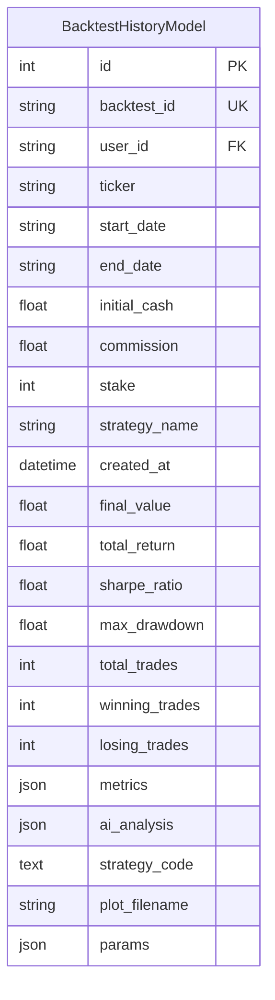
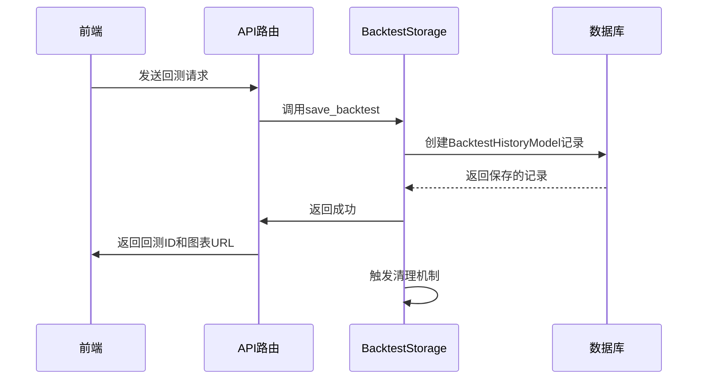
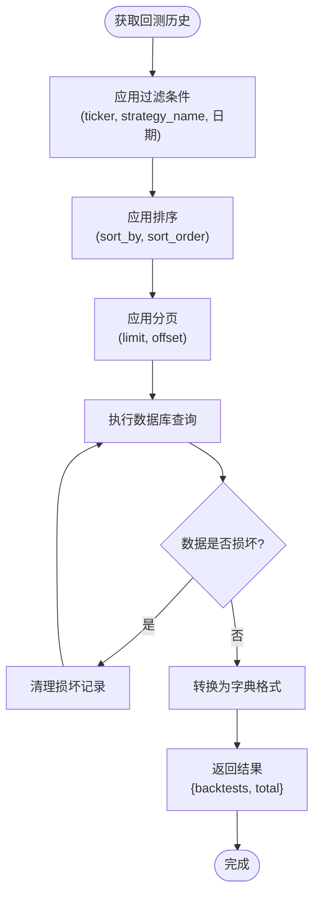
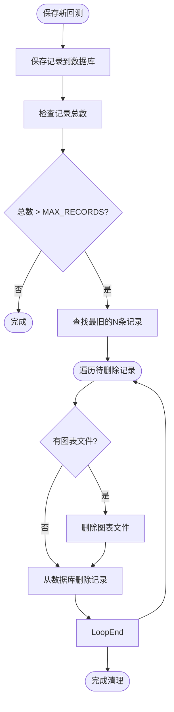
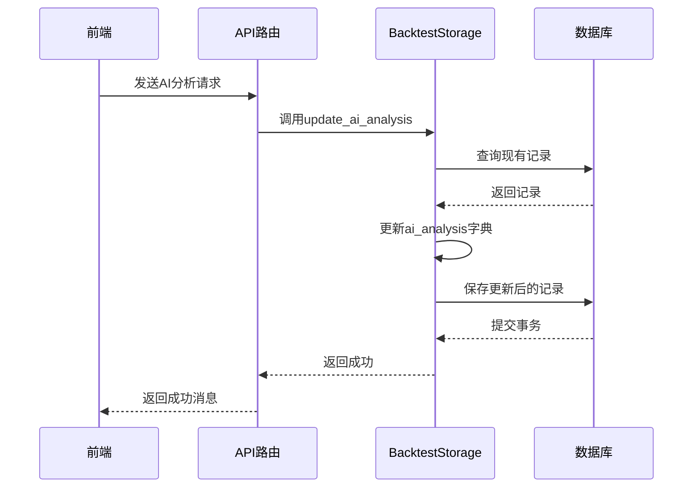

# 回测结果存储

<cite>
**本文档引用的文件**
- [backtest_storage.py](file://backend/src/db/backtest_storage.py)
- [models.py](file://backend/src/db/models.py)
- [settings.py](file://backend/src/config/settings.py)
- [backtest_engine.py](file://backend/src/service/backtest_engine.py)
- [api_routes.py](file://backend/src/routes/api_routes.py)
</cite>

## 目录
1. [简介](#简介)
2. [数据模型与持久化](#数据模型与持久化)
3. [保存回测结果](#保存回测结果)
4. [查询回测历史](#查询回测历史)
5. [自动清理机制](#自动清理机制)
6. [数据完整性与索引](#数据完整性与索引)
7. [AI分析结果存储](#ai分析结果存储)

## 简介
回测结果存储模块负责将回测引擎生成的性能指标、配置参数、图表文件和AI分析结果持久化到SQLite数据库中。该模块通过`BacktestStorage`类提供数据存取服务，确保回测历史记录的完整性和可检索性。系统设计了自动清理机制，防止数据库和磁盘空间无限增长，同时通过关键字段索引优化查询性能。

## 数据模型与持久化
回测结果的持久化基于`BacktestHistoryModel`数据库模型，该模型定义了回测记录的所有字段。数据存储在SQLite数据库中，由`BacktestStorage`类作为数据访问层进行管理。

**图表来源**
- [models.py](file://backend/src/db/models.py#L282-L337)
- [backtest_storage.py](file://backend/src/db/backtest_storage.py#L22-L450)

**本节来源**
- [models.py](file://backend/src/db/models.py#L282-L337)

## 保存回测结果
`save_backtest`方法是将回测结果存入数据库的核心方法。它接收来自回测引擎的指标、前端请求的配置、图表文件名和AI分析结果，并将其映射到`BacktestHistoryModel`。

该方法首先从`metrics`字典中提取关键性能指标（如`final_value`和`total_return`），然后创建`BacktestHistoryModel`实例。配置参数（`config`）中的`ticker`、`start_date`等字段被直接映射到模型的对应字段。完整的`metrics`字典、`ai_analysis`文本和`strategy_code`快照以JSON格式存储，而`plot_filename`则记录图表文件的名称。

**图表来源**
- [backtest_storage.py](file://backend/src/db/backtest_storage.py#L41-L112)
- [api_routes.py](file://backend/src/routes/api_routes.py#L215-L277)

**本节来源**
- [backtest_storage.py](file://backend/src/db/backtest_storage.py#L41-L112)
- [api_routes.py](file://backend/src/routes/api_routes.py#L215-L277)

## 查询回测历史
`list_backtests`和`get_backtest`方法提供了对回测历史的检索和过滤功能。

`list_backtests`方法支持多种过滤条件，包括`ticker`、`strategy_name`和日期范围。它还支持按`created_at`、`total_return`或`sharpe_ratio`进行排序，并实现了分页功能。该方法返回一个包含`backtests`列表和`total`总数的字典，便于前端分页显示。

`get_backtest`方法根据`backtest_id`获取单个回测的详细信息。如果记录存在，它会返回包含完整`metrics`、`ai_analysis`和`strategy_code`的字典。

**图表来源**
- [backtest_storage.py](file://backend/src/db/backtest_storage.py#L188-L271)
- [api_routes.py](file://backend/src/routes/api_routes.py#L394-L415)

**本节来源**
- [backtest_storage.py](file://backend/src/db/backtest_storage.py#L188-L271)
- [api_routes.py](file://backend/src/routes/api_routes.py#L394-L415)

## 自动清理机制
为防止数据库和磁盘空间耗尽，系统实现了自动清理机制。`BacktestStorage`类中定义了`MAX_RECORDS`常量，其值为100，表示系统最多保留最近的100条回测记录。

当调用`save_backtest`方法保存新记录后，会自动触发`_cleanup_old_records`私有方法。该方法首先查询数据库中的记录总数，如果超过`MAX_RECORDS`，则按`created_at`升序（即从最旧的开始）查询需要删除的记录。

对于每条待删除的记录，系统会先检查并删除其关联的图表文件（如果`plot_filename`不为空），然后再从数据库中删除该记录。此机制确保了旧的回测记录及其占用的磁盘空间被及时清理。

**图表来源**
- [backtest_storage.py](file://backend/src/db/backtest_storage.py#L122-L153)

**本节来源**
- [backtest_storage.py](file://backend/src/db/backtest_storage.py#L25-L26)
- [backtest_storage.py](file://backend/src/db/backtest_storage.py#L110-L111)
- [backtest_storage.py](file://backend/src/db/backtest_storage.py#L122-L153)

## 数据完整性与索引
为保障数据完整性和查询性能，`BacktestHistoryModel`在关键字段上建立了索引和约束。

`backtest_id`字段具有唯一约束（`unique=True`），确保每条回测记录的ID全局唯一。`user_id`、`ticker`和`strategy_name`字段也建立了索引，以加速基于用户、交易标的和策略名称的过滤查询。

性能指标字段`total_return`和`sharpe_ratio`被设置为索引字段（`index=True`），这使得在回测历史页面按收益率或夏普比率排序时，数据库查询非常高效。`created_at`字段同样被索引，以支持按时间排序和日期范围过滤。

此外，系统使用了自定义的`SafeJSON`类型来处理JSON字段，该类型能优雅地处理`NULL`和空字符串，防止因JSON反序列化错误导致的数据损坏。

**本节来源**
- [models.py](file://backend/src/db/models.py#L295-L315)

## AI分析结果存储
AI分析结果通过`update_ai_analysis`方法进行存储。该方法允许为同一个回测添加来自不同AI模型（如gpt-4o, deepseek-v3.1）的分析结果。

`ai_analysis`字段在数据库中是一个JSON类型的字段。当更新分析结果时，系统会先加载现有的分析字典，然后以`model_name`为键，将新的`analysis_content`存入字典，最后将更新后的字典整体存回数据库。这种方式使得一个回测可以保留多个AI模型的分析历史。

**图表来源**
- [backtest_storage.py](file://backend/src/db/backtest_storage.py#L357-L417)
- [api_routes.py](file://backend/src/routes/api_routes.py#L476-L493)

**本节来源**
- [backtest_storage.py](file://backend/src/db/backtest_storage.py#L357-L417)
- [models.py](file://backend/src/db/models.py#L324-L326)