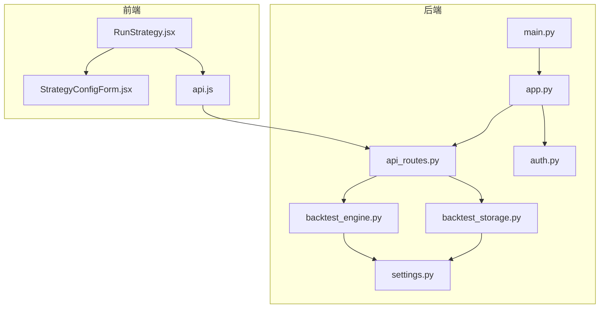
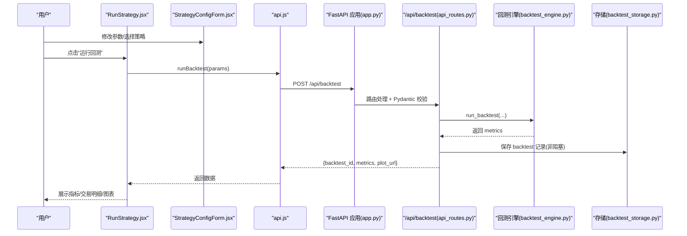
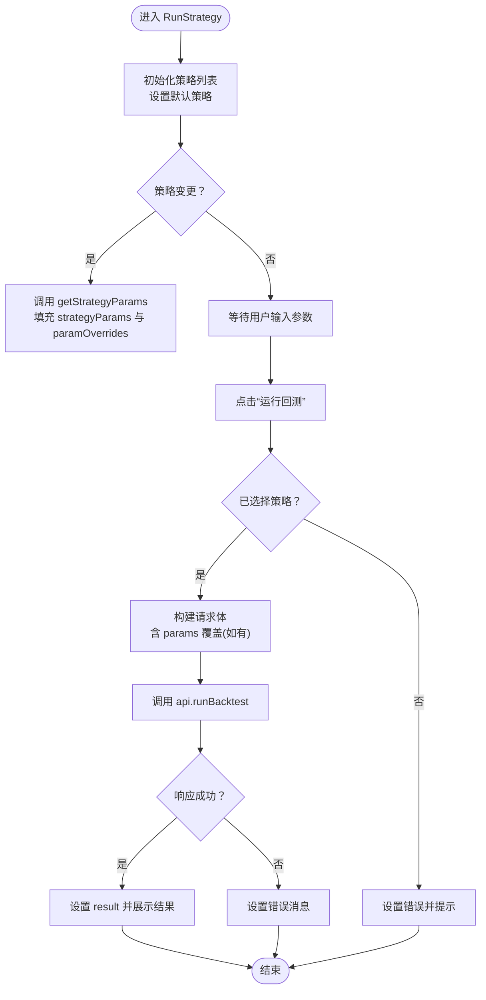
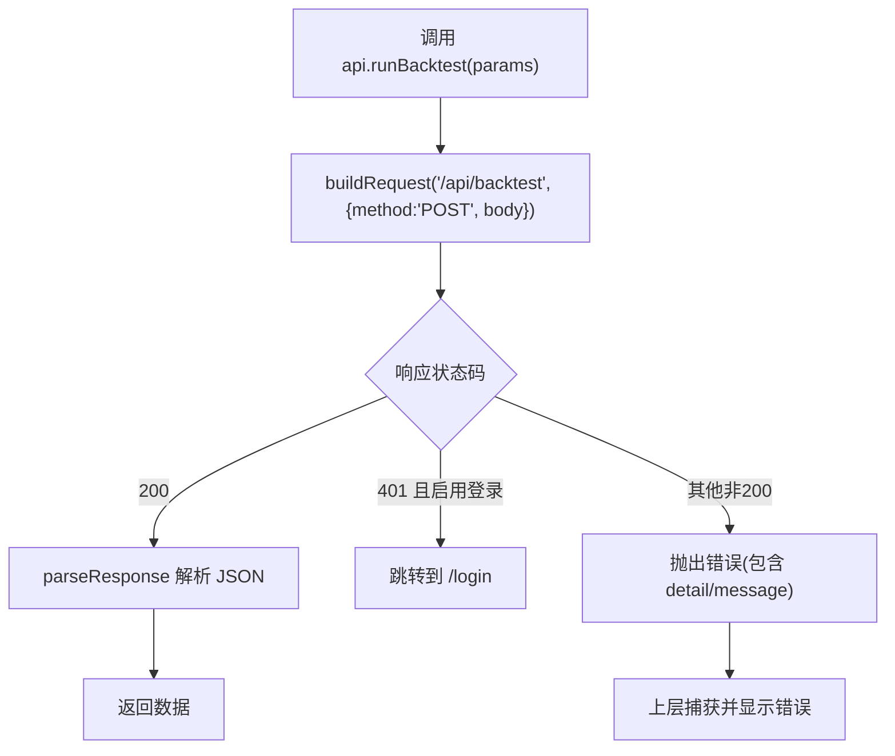
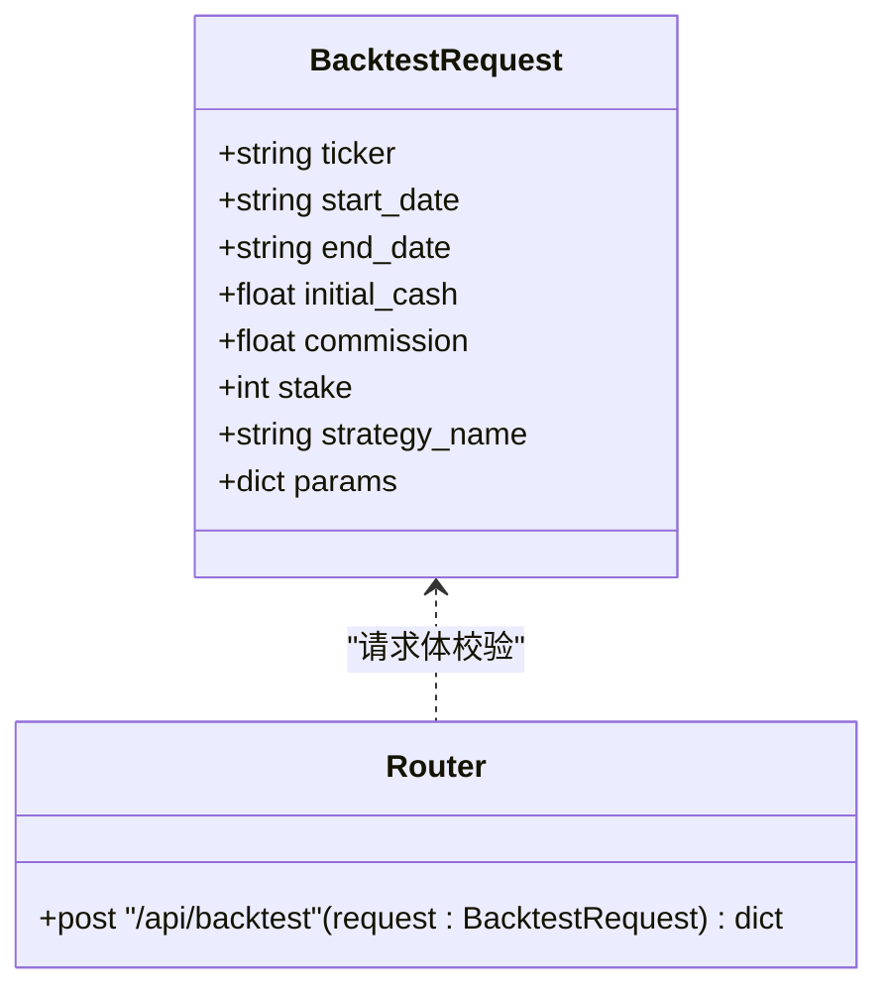
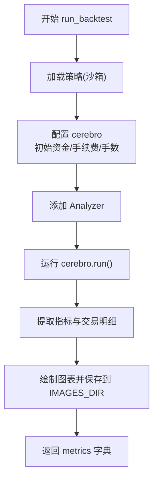
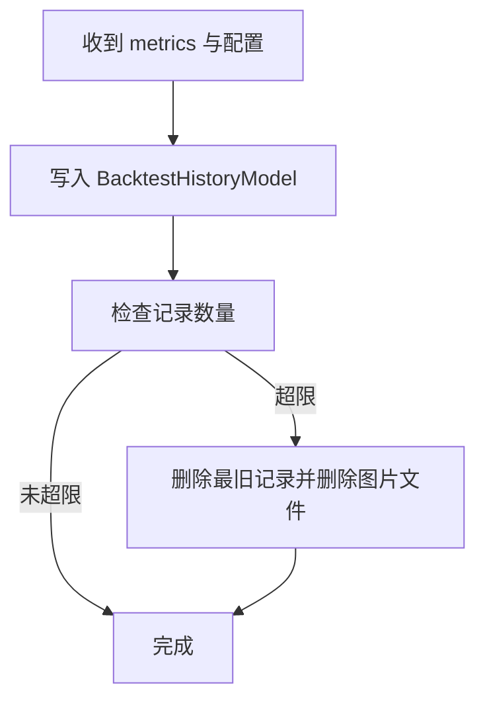
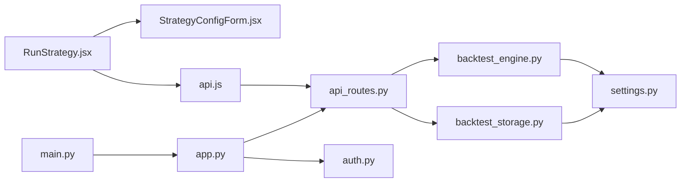

# 回测请求处理

<cite>
**本文引用的文件列表**
- [RunStrategy.jsx](file://frontend/src/pages/RunStrategy.jsx)
- [StrategyConfigForm.jsx](file://frontend/src/components/RunStrategy/StrategyConfigForm.jsx)
- [api.js](file://frontend/src/services/api.js)
- [api_routes.py](file://backend/src/routes/api_routes.py)
- [backtest_engine.py](file://backend/src/service/backtest_engine.py)
- [app.py](file://backend/src/service/app.py)
- [main.py](file://backend/main.py)
- [settings.py](file://backend/src/config/settings.py)
- [backtest_storage.py](file://backend/src/db/backtest_storage.py)
- [auth.py](file://backend/src/utils/auth.py)
</cite>

## 目录
1. [简介](#简介)
2. [项目结构](#项目结构)
3. [核心组件](#核心组件)
4. [架构总览](#架构总览)
5. [详细组件分析](#详细组件分析)
6. [依赖关系分析](#依赖关系分析)
7. [性能考量](#性能考量)
8. [故障排查指南](#故障排查指南)
9. [结论](#结论)

## 简介
本文件聚焦“回测请求处理”流程，围绕前端 RunStrategy 页面如何通过 React 组件与用户交互收集回测参数（交易对、时间范围、初始资金、手续费、下单手数、策略名称及策略参数覆盖），并通过 API 客户端调用后端 /api/backtest 端点完成回测运行。文档将详细说明：
- 前端表单与状态管理（加载态、错误态）
- API 客户端封装与统一错误处理
- FastAPI 后端路由定义与请求体校验（BacktestRequest 模型）
- 后端服务层执行回测、生成指标与图表
- 数据持久化与历史回测管理
- 错误处理与健壮性保障（网络错误、400/500 响应）

## 项目结构
前端与后端的关键模块如下：
- 前端
  - 页面：RunStrategy.jsx
  - 表单组件：StrategyConfigForm.jsx
  - API 客户端：api.js
- 后端
  - FastAPI 应用入口：app.py
  - 入口启动：main.py
  - 路由与模型：api_routes.py
  - 回测引擎：backtest_engine.py
  - 配置与资源目录：settings.py
  - 数据存储：backtest_storage.py
  - 认证依赖：auth.py

**图示来源**
- [RunStrategy.jsx](file://frontend/src/pages/RunStrategy.jsx#L1-L176)
- [StrategyConfigForm.jsx](file://frontend/src/components/RunStrategy/StrategyConfigForm.jsx#L1-L248)
- [api.js](file://frontend/src/services/api.js#L1-L403)
- [app.py](file://backend/src/service/app.py#L1-L46)
- [main.py](file://backend/main.py#L1-L32)
- [api_routes.py](file://backend/src/routes/api_routes.py#L1-L507)
- [backtest_engine.py](file://backend/src/service/backtest_engine.py#L1-L400)
- [settings.py](file://backend/src/config/settings.py#L1-L107)
- [backtest_storage.py](file://backend/src/db/backtest_storage.py#L1-L446)
- [auth.py](file://backend/src/utils/auth.py#L1-L210)

**章节来源**
- [RunStrategy.jsx](file://frontend/src/pages/RunStrategy.jsx#L1-L176)
- [StrategyConfigForm.jsx](file://frontend/src/components/RunStrategy/StrategyConfigForm.jsx#L1-L248)
- [api.js](file://frontend/src/services/api.js#L1-L403)
- [app.py](file://backend/src/service/app.py#L1-L46)
- [main.py](file://backend/main.py#L1-L32)
- [api_routes.py](file://backend/src/routes/api_routes.py#L1-L507)
- [backtest_engine.py](file://backend/src/service/backtest_engine.py#L1-L400)
- [settings.py](file://backend/src/config/settings.py#L1-L107)
- [backtest_storage.py](file://backend/src/db/backtest_storage.py#L1-L446)
- [auth.py](file://backend/src/utils/auth.py#L1-L210)

## 核心组件
- 前端页面 RunStrategy.jsx
  - 状态：交易对、起止日期、初始资金、手续费、下单手数、策略选择、策略参数覆盖、结果、加载与错误
  - 行为：提交时构建请求体，调用 api.runBacktest，捕获异常并设置错误消息，finally 中关闭加载态
- 表单组件 StrategyConfigForm.jsx
  - 输入项：策略选择、交易对、起止日期、初始资金、手续费、下单手数
  - 策略参数：根据选中策略动态拉取参数列表，支持数值类型转换与覆盖
- API 客户端 api.js
  - 统一封装 buildRequest 与 parseResponse
  - 自动注入 Authorization 头（当存在 token getter）
  - 对非 200 响应抛出错误；401 且启用登录时重定向至登录页
  - 提供 runBacktest 方法，POST /api/backtest
- 后端路由 api_routes.py
  - 定义 BacktestRequest Pydantic 模型，用于请求体校验
  - /api/backtest 接收 POST 请求，调用 run_backtest，返回 backtest_id、metrics、plot_url
  - 异常映射：策略加载失败 400、数据加载失败 502、其他 500
- 回测引擎 backtest_engine.py
  - 加载策略、构造回测环境、添加分析器、运行并提取指标
  - 生成图表并保存到 IMAGES_DIR，返回指标字典
- 存储 backtest_storage.py
  - 将回测配置、指标、图表文件名、策略代码快照等持久化
  - 自动清理旧记录并删除对应图片文件
- 认证 auth.py
  - 依赖 get_current_user，提供可选/必需认证
- 应用与启动 app.py/main.py
  - 注册路由前缀 /api，配置 CORS，挂载前端静态资源
  - Daphne 作为 ASGI 服务器启动

**章节来源**
- [RunStrategy.jsx](file://frontend/src/pages/RunStrategy.jsx#L1-L176)
- [StrategyConfigForm.jsx](file://frontend/src/components/RunStrategy/StrategyConfigForm.jsx#L1-L248)
- [api.js](file://frontend/src/services/api.js#L1-L403)
- [api_routes.py](file://backend/src/routes/api_routes.py#L1-L507)
- [backtest_engine.py](file://backend/src/service/backtest_engine.py#L1-L400)
- [backtest_storage.py](file://backend/src/db/backtest_storage.py#L1-L446)
- [auth.py](file://backend/src/utils/auth.py#L1-L210)
- [app.py](file://backend/src/service/app.py#L1-L46)
- [main.py](file://backend/main.py#L1-L32)

## 架构总览
下图展示从用户点击“运行回测”到后端返回指标与图表的完整链路。

**图示来源**
- [RunStrategy.jsx](file://frontend/src/pages/RunStrategy.jsx#L82-L114)
- [StrategyConfigForm.jsx](file://frontend/src/components/RunStrategy/StrategyConfigForm.jsx#L1-L248)
- [api.js](file://frontend/src/services/api.js#L97-L103)
- [app.py](file://backend/src/service/app.py#L37-L44)
- [api_routes.py](file://backend/src/routes/api_routes.py#L215-L296)
- [backtest_engine.py](file://backend/src/service/backtest_engine.py#L302-L384)
- [backtest_storage.py](file://backend/src/db/backtest_storage.py#L37-L117)

## 详细组件分析

### 前端：RunStrategy 页面与表单
- 状态管理
  - 使用 useState 维护回测参数、策略参数、覆盖值、结果、加载与错误
  - 初始化时拉取策略列表并默认选择第一个
  - 当策略变更时，异步获取策略参数列表并初始化覆盖值
- 提交逻辑
  - 校验是否选择了策略
  - 构建请求体：ticker、start_date、end_date、initial_cash、commission、stake、strategy_name、params（仅在有覆盖时发送）
  - 调用 api.runBacktest，捕获异常并设置错误消息，finally 关闭加载态
- 结果渲染
  - 成功后展示 PerformanceOverview、TradeLog、StrategyPlot

**图示来源**
- [RunStrategy.jsx](file://frontend/src/pages/RunStrategy.jsx#L32-L114)
- [StrategyConfigForm.jsx](file://frontend/src/components/RunStrategy/StrategyConfigForm.jsx#L1-L248)

**章节来源**
- [RunStrategy.jsx](file://frontend/src/pages/RunStrategy.jsx#L1-L176)
- [StrategyConfigForm.jsx](file://frontend/src/components/RunStrategy/StrategyConfigForm.jsx#L1-L248)

### 前端：API 客户端与错误处理
- 统一请求构建
  - buildRequest 自动设置 Content-Type 为 application/json
  - 若存在 token getter，则从资源域获取访问令牌并注入 Authorization: Bearer
- 响应解析
  - parseResponse 在非 200 时抛错；若 401 且启用登录则跳转到 /login
- runBacktest
  - POST /api/backtest，JSON 序列化请求体

**图示来源**
- [api.js](file://frontend/src/services/api.js#L19-L74)
- [api.js](file://frontend/src/services/api.js#L97-L103)

**章节来源**
- [api.js](file://frontend/src/services/api.js#L1-L403)

### 后端：FastAPI 路由与请求体校验
- 路由注册
  - app.py 将 api_router 挂载到 /api 前缀
- /api/backtest
  - 方法：POST
  - 请求体：BacktestRequest（Pydantic 模型）
  - 处理流程：
    - 生成 backtest_id 与图片文件名
    - 可选读取用户策略代码
    - 调用 run_backtest，传入 ticker、start_date、end_date、initial_cash、commission、stake、strategy_name、params
    - 返回 backtest_id、metrics、plot_url
    - 非阻塞保存到数据库（get_backtest_storage + save_backtest）
  - 异常映射：
    - StrategyLoadError -> 400
    - DataLoadError -> 502
    - 其他异常 -> 500

**图示来源**
- [api_routes.py](file://backend/src/routes/api_routes.py#L41-L50)
- [api_routes.py](file://backend/src/routes/api_routes.py#L215-L296)

**章节来源**
- [api_routes.py](file://backend/src/routes/api_routes.py#L1-L507)
- [app.py](file://backend/src/service/app.py#L37-L44)

### 后端：回测引擎与指标生成
- 策略加载
  - 支持软沙箱与隔离沙箱两种模式，确保策略代码安全执行
  - 校验策略类必须继承 backtrader.Strategy
- 回测执行
  - 设置初始资金、手续费、固定手数
  - 添加多种 Analyzer（夏普比率、最大回撤、收益、年化回报、SQN、交易分析、时间序列回撤、自定义 TradeRecorder）
  - 运行 cerebro，提取指标与交易明细
- 图表绘制
  - 使用 matplotlib 渲染 K 线+信号图，保存到 IMAGES_DIR

**图示来源**
- [backtest_engine.py](file://backend/src/service/backtest_engine.py#L302-L384)

**章节来源**
- [backtest_engine.py](file://backend/src/service/backtest_engine.py#L1-L400)
- [settings.py](file://backend/src/config/settings.py#L1-L107)

### 后端：数据持久化与历史管理
- BacktestStorage.save_backtest
  - 写入字段：backtest_id、user_id、ticker、start_date、end_date、initial_cash、commission、stake、strategy_name、created_at、final_value、total_return、sharpe_ratio、max_drawdown、total_trades、winning_trades、losing_trades、metrics、ai_analysis、strategy_code、plot_filename、params
  - 自动清理超过上限的历史记录，并删除对应图片文件
- 列表/查询/删除/更新 AI 分析
  - 提供分页、排序、过滤能力
  - 删除时同步删除图片文件

**图示来源**
- [backtest_storage.py](file://backend/src/db/backtest_storage.py#L37-L117)
- [backtest_storage.py](file://backend/src/db/backtest_storage.py#L118-L154)

**章节来源**
- [backtest_storage.py](file://backend/src/db/backtest_storage.py#L1-L446)

### 认证与跨域
- 认证
  - get_current_user 依赖 HTTP Bearer Token，支持可选/必需两种模式
  - 未启用登录时允许匿名访问
- CORS
  - app.py 配置 CORS，允许来源、方法、头等灵活设置

**章节来源**
- [auth.py](file://backend/src/utils/auth.py#L1-L210)
- [app.py](file://backend/src/service/app.py#L1-L46)

## 依赖关系分析
- 前端依赖
  - RunStrategy.jsx 依赖 StrategyConfigForm.jsx 与 api.js
  - api.js 依赖环境变量 VITE_API_RESOURCE 与可选的 token getter
- 后端依赖
  - app.py 依赖各路由模块与静态资源挂载
  - api_routes.py 依赖 backtest_engine.py、backtest_storage.py、auth.py
  - backtest_engine.py 依赖 settings.py 的资源目录与数据源
  - backtest_storage.py 依赖 SQLAlchemy 与 settings.py 的 IMAGES_DIR

**图示来源**
- [RunStrategy.jsx](file://frontend/src/pages/RunStrategy.jsx#L1-L176)
- [StrategyConfigForm.jsx](file://frontend/src/components/RunStrategy/StrategyConfigForm.jsx#L1-L248)
- [api.js](file://frontend/src/services/api.js#L1-L403)
- [app.py](file://backend/src/service/app.py#L1-L46)
- [main.py](file://backend/main.py#L1-L32)
- [api_routes.py](file://backend/src/routes/api_routes.py#L1-L507)
- [backtest_engine.py](file://backend/src/service/backtest_engine.py#L1-L400)
- [backtest_storage.py](file://backend/src/db/backtest_storage.py#L1-L446)
- [settings.py](file://backend/src/config/settings.py#L1-L107)
- [auth.py](file://backend/src/utils/auth.py#L1-L210)

**章节来源**
- [app.py](file://backend/src/service/app.py#L1-L46)
- [api_routes.py](file://backend/src/routes/api_routes.py#L1-L507)

## 性能考量
- 前端
  - 表单参数覆盖采用按需发送（仅在有覆盖时才携带 params），减少请求体大小
  - 并行获取策略参数与市场数据（在其他 API 方法中体现），提升用户体验
- 后端
  - 回测运行在子进程中进行（隔离沙箱），避免恶意代码影响主进程
  - 图表渲染使用非交互模式，避免弹窗与阻塞
  - 存储层采用自动清理策略，控制历史记录数量与磁盘占用
- 网络
  - API 客户端统一注入 Authorization 头，减少重复逻辑
  - parseResponse 统一错误处理，便于前端一致化展示

[本节为通用建议，不直接分析具体文件]

## 故障排查指南
- 前端常见问题
  - 401 未授权：确认已启用登录且 token getter 可用；parseResponse 会自动跳转到 /login
  - 网络错误：检查 VITE_API_RESOURCE 是否正确指向后端地址
  - 参数为空：RunStrategy.jsx 在未选择策略时会阻止提交并提示
- 后端常见问题
  - 策略加载失败：StrategyLoadError 映射为 400；检查策略文件是否存在、类名是否为 UserStrategy、是否继承 backtrader.Strategy
  - 数据加载失败：DataLoadError 映射为 502；检查数据源可用性与时间范围
  - 其他异常：映射为 500；查看日志定位具体异常栈
- 存储与历史
  - 历史记录过多：BacktestStorage 会自动清理超出上限的记录并删除图片文件
  - JSON 数据损坏：列表查询时会尝试清理损坏记录并重试

**章节来源**
- [api.js](file://frontend/src/services/api.js#L19-L74)
- [RunStrategy.jsx](file://frontend/src/pages/RunStrategy.jsx#L82-L114)
- [api_routes.py](file://backend/src/routes/api_routes.py#L287-L296)
- [backtest_engine.py](file://backend/src/service/backtest_engine.py#L33-L65)
- [backtest_storage.py](file://backend/src/db/backtest_storage.py#L118-L154)

## 结论
该回测请求处理流程通过清晰的前后端职责划分实现了高内聚低耦合：
- 前端负责参数收集与 UI 呈现，API 客户端统一处理网络与鉴权
- 后端通过 Pydantic 模型严格校验请求体，回测引擎独立执行并生成指标与图表，存储层负责历史与清理
- 错误处理贯穿全链路，既保证了用户体验，也提升了系统的健壮性