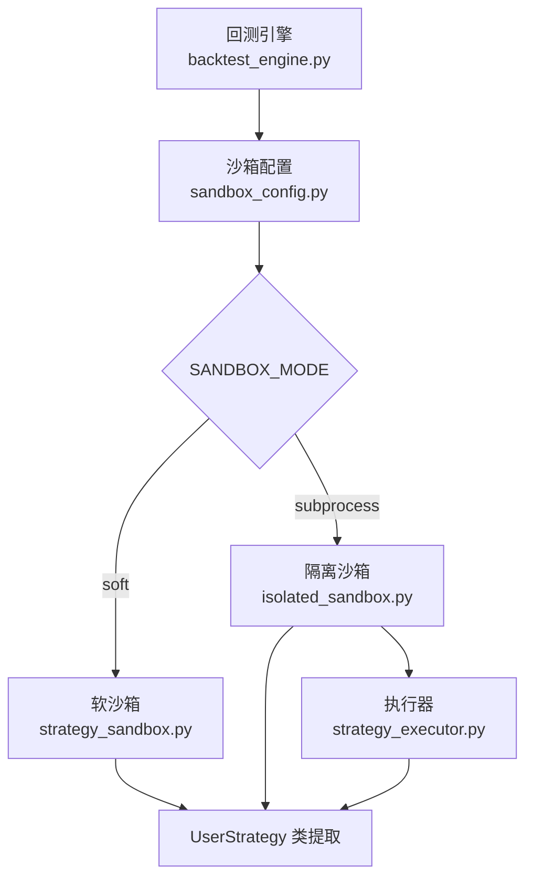
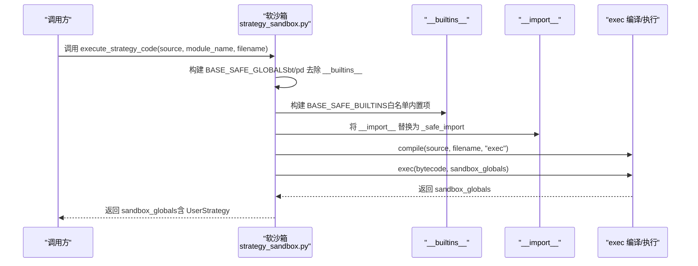
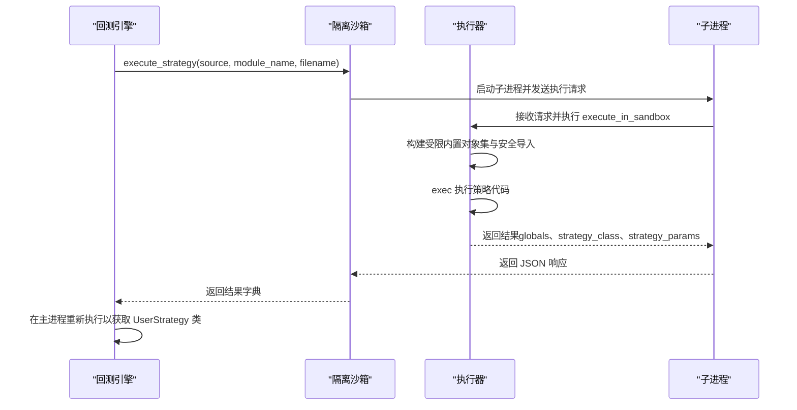
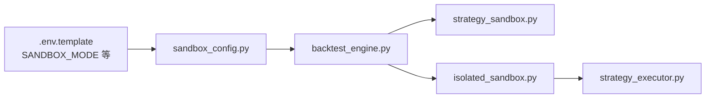

# 策略沙箱机制

<cite>
**本文引用的文件**
- [strategy_sandbox.py](file://backend/src/service/strategy_sandbox.py)
- [test_strategy_sandbox.py](file://backend/tests/service/test_strategy_sandbox.py)
- [isolated_sandbox.py](file://backend/src/service/isolated_sandbox.py)
- [strategy_executor.py](file://backend/src/service/strategy_executor.py)
- [backtest_engine.py](file://backend/src/service/backtest_engine.py)
- [sandbox_config.py](file://backend/src/config/sandbox_config.py)
- [.env.template](file://backend/.env.template)
- [buy_and_hold.py](file://backend/resources/strategy/buy_and_hold.py)
- [ema_cross.py](file://backend/resources/strategy/templates/ema_cross.py)
</cite>

## 目录
1. [引言](#引言)
2. [项目结构](#项目结构)
3. [核心组件](#核心组件)
4. [架构总览](#架构总览)
5. [详细组件分析](#详细组件分析)
6. [依赖关系分析](#依赖关系分析)
7. [性能与安全特性](#性能与安全特性)
8. [故障排查指南](#故障排查指南)
9. [结论](#结论)
10. [附录](#附录)

## 引言
本专项文档聚焦于策略沙箱机制，系统阐述后端服务中软沙箱模块如何通过 execute_strategy_code 函数在受限环境中安全地执行用户策略代码。重点解释以下关键点：
- 如何通过限制 __builtins__ 和重写 __import__ 函数（_safe_import）来阻止危险操作（如文件系统访问、网络请求），并仅允许导入白名单模块（如 backtrader、pandas、numpy 等）。
- 如何构建隔离的全局命名空间（sandbox_globals），编译并执行用户策略代码，并从执行结果中提取 UserStrategy 类。
- 设计如何有效防范恶意代码注入，同时允许策略使用必要的量化分析库。
- 结合测试用例说明沙箱的错误处理（StrategySandboxError）和安全边界。

## 项目结构
策略沙箱相关代码主要分布在后端服务层，包含软沙箱实现、隔离沙箱实现、策略执行器、回测引擎以及配置模块。下图展示与策略沙箱直接相关的文件及其交互关系。

```mermaid
graph TB
subgraph "服务层"
SS["strategy_sandbox.py<br/>软沙箱实现"]
IS["isolated_sandbox.py<br/>隔离沙箱实现"]
SE["strategy_executor.py<br/>子进程执行器"]
BE["backtest_engine.py<br/>回测引擎"]
SC["sandbox_config.py<br/>沙箱配置"]
end
subgraph "资源与模板"
BH["buy_and_hold.py<br/>策略模板"]
EMAC["ema_cross.py<br/>策略模板"]
end
subgraph "环境配置"
ENV[".env.template<br/>SANDBOX_MODE 等配置"]
end
BE --> SS
BE --> IS
IS --> SE
SS --> SC
IS --> SC
BE --> ENV
BH -. 使用 . 被沙箱允许 .-> SS
EMAC -. 使用 . 被沙箱允许 .-> SS
```

图表来源
- [strategy_sandbox.py](file://backend/src/service/strategy_sandbox.py#L1-L213)
- [isolated_sandbox.py](file://backend/src/service/isolated_sandbox.py#L1-L392)
- [strategy_executor.py](file://backend/src/service/strategy_executor.py#L220-L470)
- [backtest_engine.py](file://backend/src/service/backtest_engine.py#L86-L152)
- [sandbox_config.py](file://backend/src/config/sandbox_config.py#L1-L115)
- [.env.template](file://backend/.env.template#L112-L134)
- [buy_and_hold.py](file://backend/resources/strategy/buy_and_hold.py#L1-L11)
- [ema_cross.py](file://backend/resources/strategy/templates/ema_cross.py#L1-L41)

章节来源
- [strategy_sandbox.py](file://backend/src/service/strategy_sandbox.py#L1-L213)
- [backtest_engine.py](file://backend/src/service/backtest_engine.py#L86-L152)
- [sandbox_config.py](file://backend/src/config/sandbox_config.py#L1-L115)
- [.env.template](file://backend/.env.template#L112-L134)

## 核心组件
- 软沙箱（strategy_sandbox.py）
  - 提供 execute_strategy_code 函数，用于在受限环境中编译并执行用户策略代码。
  - 通过白名单控制导入（ALLOWED_IMPORTS）、限制 __builtins__、重写 __import__ 为 _safe_import，从而阻断危险操作。
  - 构建 sandbox_globals 并返回执行后的全局命名空间，便于上层提取 UserStrategy 类。
- 隔离沙箱（isolated_sandbox.py + strategy_executor.py）
  - 在独立子进程中执行策略，提供更强的安全性（超时、内存限制、网络/文件写入开关等）。
  - 执行器负责构建受限的内置对象集、安全导入、序列化可导出值等。
- 回测引擎（backtest_engine.py）
  - 根据配置选择软沙箱或隔离沙箱模式，加载策略源码并执行。
  - 在隔离沙箱模式下先验证策略，再在主进程中安全地重新执行以获得实际类对象。
- 沙箱配置（sandbox_config.py）
  - 从环境变量读取 SANDBOX_MODE、超时、内存上限、网络/文件写入权限等参数。
- 策略模板（buy_and_hold.py、ema_cross.py）
  - 展示标准 UserStrategy 类结构，供用户参考编写策略。

章节来源
- [strategy_sandbox.py](file://backend/src/service/strategy_sandbox.py#L1-L213)
- [isolated_sandbox.py](file://backend/src/service/isolated_sandbox.py#L1-L392)
- [strategy_executor.py](file://backend/src/service/strategy_executor.py#L220-L470)
- [backtest_engine.py](file://backend/src/service/backtest_engine.py#L86-L152)
- [sandbox_config.py](file://backend/src/config/sandbox_config.py#L1-L115)
- [buy_and_hold.py](file://backend/resources/strategy/buy_and_hold.py#L1-L11)
- [ema_cross.py](file://backend/resources/strategy/templates/ema_cross.py#L1-L41)

## 架构总览
下图展示了策略沙箱的整体架构：回测引擎根据配置选择沙箱模式；软沙箱直接在当前进程中执行；隔离沙箱通过子进程执行器在隔离环境中运行。



图表来源
- [backtest_engine.py](file://backend/src/service/backtest_engine.py#L86-L152)
- [sandbox_config.py](file://backend/src/config/sandbox_config.py#L1-L115)
- [strategy_sandbox.py](file://backend/src/service/strategy_sandbox.py#L1-L213)
- [isolated_sandbox.py](file://backend/src/service/isolated_sandbox.py#L1-L392)
- [strategy_executor.py](file://backend/src/service/strategy_executor.py#L220-L470)

## 详细组件分析

### 软沙箱：execute_strategy_code 的执行流程
软沙箱通过构建受限的内置对象集和安全的全局命名空间，确保用户策略只能使用白名单内的模块和受控的内置能力。其核心流程如下：



图表来源
- [strategy_sandbox.py](file://backend/src/service/strategy_sandbox.py#L179-L210)

章节来源
- [strategy_sandbox.py](file://backend/src/service/strategy_sandbox.py#L179-L210)

#### 安全边界与限制
- 白名单导入（ALLOWED_IMPORTS）：仅允许 backtrader、pandas、numpy、math、statistics、random、datetime、decimal、fractions、collections、itertools、functools、typing、operator、bisect、heapq 等模块。
- 重写 __import__：_safe_import 对相对导入（level!=0）直接拒绝；对根模块不在白名单中的导入抛出异常；导入失败也会被包装为 StrategySandboxError。
- 限制 __builtins__：仅暴露必要内置项，不包含 open、os、sys 等危险入口。
- 全局命名空间：通过 sandbox_globals 注入 __name__、__file__、__builtins__ 等，避免污染主进程环境。

章节来源
- [strategy_sandbox.py](file://backend/src/service/strategy_sandbox.py#L46-L87)
- [strategy_sandbox.py](file://backend/src/service/strategy_sandbox.py#L89-L177)
- [strategy_sandbox.py](file://backend/src/service/strategy_sandbox.py#L179-L210)

#### 错误处理与测试验证
- 语法错误：compile 失败时抛出 StrategySandboxError，提示“包含语法错误”。
- 运行时错误：exec 抛出异常时包装为 StrategySandboxError，提示“执行失败”。
- 测试覆盖：
  - 允许白名单导入（如 math）。
  - 拒绝非白名单导入（如 os）。
  - 拒绝相对导入。
  - 缺少内置（如 open）会被阻止并触发执行失败。
  - 语法错误被包装为 StrategySandboxError。

章节来源
- [test_strategy_sandbox.py](file://backend/tests/service/test_strategy_sandbox.py#L1-L39)
- [strategy_sandbox.py](file://backend/src/service/strategy_sandbox.py#L195-L209)

### 隔离沙箱：子进程执行与安全强化
隔离沙箱通过子进程执行策略，提供更强的安全保障（超时、内存限制、网络/文件写入开关等）。其关键点包括：
- 子进程执行器（strategy_executor.py）：
  - 构建受限的内置对象集（包含安全的 __import__、getattr、setattr 等），显式不包含 open 等危险内置。
  - 在执行过程中捕获并转换异常为 SandboxExecutionError。
  - 从执行结果中提取可序列化的全局变量（如参数、数值型变量），并记录 UserStrategy 类名以便后续处理。
- 隔离沙箱（isolated_sandbox.py）：
  - 启动子进程，发送执行请求，读取响应并进行超时/内存错误分类。
  - 支持配置超时、最大内存、网络/文件写入权限等。
- 回测引擎（backtest_engine.py）：
  - 当 SANDBOX_MODE 不是 soft 时，优先使用隔离沙箱进行策略验证与执行。
  - 在隔离沙箱模式下，先在子进程验证策略，再在主进程安全地重新执行以获取 UserStrategy 类对象。



图表来源
- [backtest_engine.py](file://backend/src/service/backtest_engine.py#L86-L152)
- [isolated_sandbox.py](file://backend/src/service/isolated_sandbox.py#L181-L265)
- [strategy_executor.py](file://backend/src/service/strategy_executor.py#L255-L336)

章节来源
- [backtest_engine.py](file://backend/src/service/backtest_engine.py#L86-L152)
- [isolated_sandbox.py](file://backend/src/service/isolated_sandbox.py#L181-L265)
- [strategy_executor.py](file://backend/src/service/strategy_executor.py#L255-L336)

### UserStrategy 类的提取与使用
- 在软沙箱模式下，execute_strategy_code 返回 sandbox_globals，上层从其中读取 UserStrategy 类。
- 在隔离沙箱模式下，先由子进程返回 strategy_class 名称，再在主进程重新执行策略以获得实际类对象。
- 策略模板展示了标准的 UserStrategy 结构，便于用户理解类接口与参数定义。

章节来源
- [strategy_sandbox.py](file://backend/src/service/strategy_sandbox.py#L179-L210)
- [backtest_engine.py](file://backend/src/service/backtest_engine.py#L110-L149)
- [buy_and_hold.py](file://backend/resources/strategy/buy_and_hold.py#L1-L11)
- [ema_cross.py](file://backend/resources/strategy/templates/ema_cross.py#L1-L41)

## 依赖关系分析
软沙箱与隔离沙箱在功能上互补：软沙箱适合可信策略或开发调试场景，隔离沙箱适合生产环境与不可信策略。两者均依赖配置模块读取环境变量，回测引擎根据配置动态选择执行路径。



图表来源
- [.env.template](file://backend/.env.template#L112-L134)
- [sandbox_config.py](file://backend/src/config/sandbox_config.py#L53-L87)
- [backtest_engine.py](file://backend/src/service/backtest_engine.py#L86-L152)
- [strategy_sandbox.py](file://backend/src/service/strategy_sandbox.py#L1-L213)
- [isolated_sandbox.py](file://backend/src/service/isolated_sandbox.py#L1-L392)
- [strategy_executor.py](file://backend/src/service/strategy_executor.py#L220-L470)

章节来源
- [.env.template](file://backend/.env.template#L112-L134)
- [sandbox_config.py](file://backend/src/config/sandbox_config.py#L53-L87)
- [backtest_engine.py](file://backend/src/service/backtest_engine.py#L86-L152)

## 性能与安全特性
- 性能特征
  - 软沙箱：无进程切换开销，执行速度快，适合快速迭代与调试。
  - 隔离沙箱：存在进程启动与通信开销，但具备更强的安全性与稳定性。
- 安全边界
  - 软沙箱明确标注无法抵御恶意代码（反射、对象图遍历、pandas/numpy 文件 I/O 等可能绕过），建议在生产环境使用隔离沙箱。
  - 隔离沙箱通过子进程、超时、内存限制、网络/文件写入开关等手段提升安全性。
- 配置驱动
  - 通过环境变量 SANDBOX_MODE 控制沙箱模式，默认推荐 subprocess。
  - 可配置超时、内存上限、网络/文件写入权限等，满足不同场景需求。

章节来源
- [strategy_sandbox.py](file://backend/src/service/strategy_sandbox.py#L1-L23)
- [isolated_sandbox.py](file://backend/src/service/isolated_sandbox.py#L1-L392)
- [sandbox_config.py](file://backend/src/config/sandbox_config.py#L53-L87)
- [.env.template](file://backend/.env.template#L112-L134)

## 故障排查指南
- 常见问题与定位
  - 导入失败：检查是否使用了非白名单模块或相对导入。软沙箱会直接抛出 StrategySandboxError。
  - 语法错误：compile 失败会包装为 StrategySandboxError，提示“包含语法错误”。
  - 运行时错误：exec 抛出异常会被包装为 StrategySandboxError，提示“执行失败”。
  - 找不到 UserStrategy：确认策略文件中定义了 UserStrategy 类，且类名大小写正确。
- 隔离沙箱相关
  - 超时：子进程在指定时间内未完成执行会触发 SandboxTimeoutError。
  - 内存溢出：超过配置的最大内存会触发 SandboxMemoryError。
  - 执行失败：子进程返回的错误类型会被映射为 SandboxExecutionError 或具体异常类型。
- 建议排查步骤
  - 将策略简化为最小可复现版本，逐步添加复杂度。
  - 在软沙箱模式下先验证基本功能，再切换到隔离沙箱。
  - 检查环境变量 SANDBOX_MODE、超时与内存配置是否合理。

章节来源
- [test_strategy_sandbox.py](file://backend/tests/service/test_strategy_sandbox.py#L1-L39)
- [strategy_sandbox.py](file://backend/src/service/strategy_sandbox.py#L195-L209)
- [isolated_sandbox.py](file://backend/src/service/isolated_sandbox.py#L231-L265)
- [strategy_executor.py](file://backend/src/service/strategy_executor.py#L427-L469)

## 结论
软沙箱通过严格的白名单导入、受限 __builtins__ 与安全的全局命名空间，实现了对常见危险操作的有效阻断，同时允许策略使用 backtrader、pandas、numpy 等必要的量化分析库。对于不可信或生产级场景，强烈建议采用隔离沙箱，借助子进程与资源限制进一步提升安全性。回测引擎根据配置自动选择合适的沙箱模式，既保证了灵活性，也兼顾了安全性与可维护性。

## 附录
- 策略模板参考
  - [buy_and_hold.py](file://backend/resources/strategy/buy_and_hold.py#L1-L11)
  - [ema_cross.py](file://backend/resources/strategy/templates/ema_cross.py#L1-L41)
- 关键实现路径
  - [execute_strategy_code](file://backend/src/service/strategy_sandbox.py#L179-L210)
  - [_safe_import](file://backend/src/service/strategy_sandbox.py#L75-L87)
  - [ALLOWED_IMPORTS](file://backend/src/service/strategy_sandbox.py#L46-L64)
  - [StrategySandboxError](file://backend/src/service/strategy_sandbox.py#L42-L45)
  - [IsolatedSandbox.execute_strategy](file://backend/src/service/isolated_sandbox.py#L181-L265)
  - [execute_in_sandbox](file://backend/src/service/strategy_executor.py#L255-L336)
  - [get_sandbox_config](file://backend/src/config/sandbox_config.py#L53-L87)
  - [回测引擎选择沙箱模式](file://backend/src/service/backtest_engine.py#L86-L152)