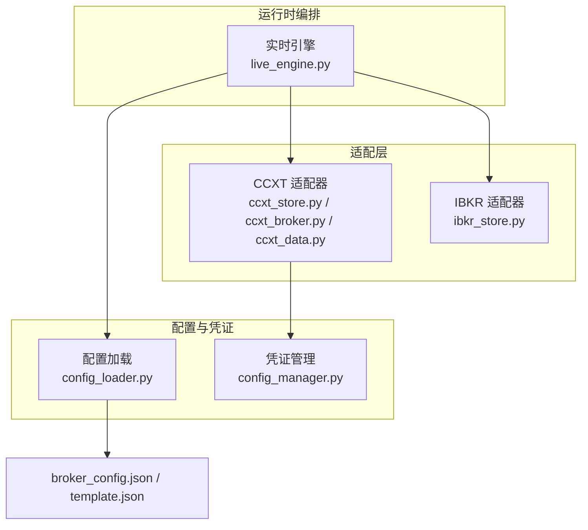
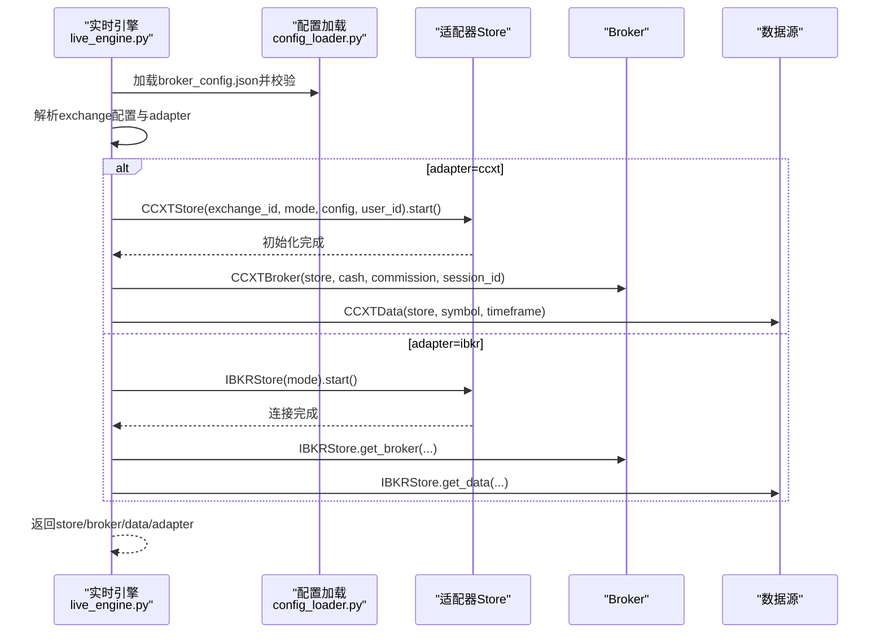
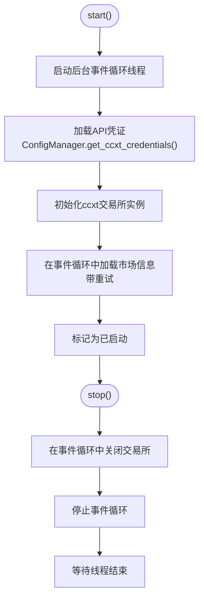
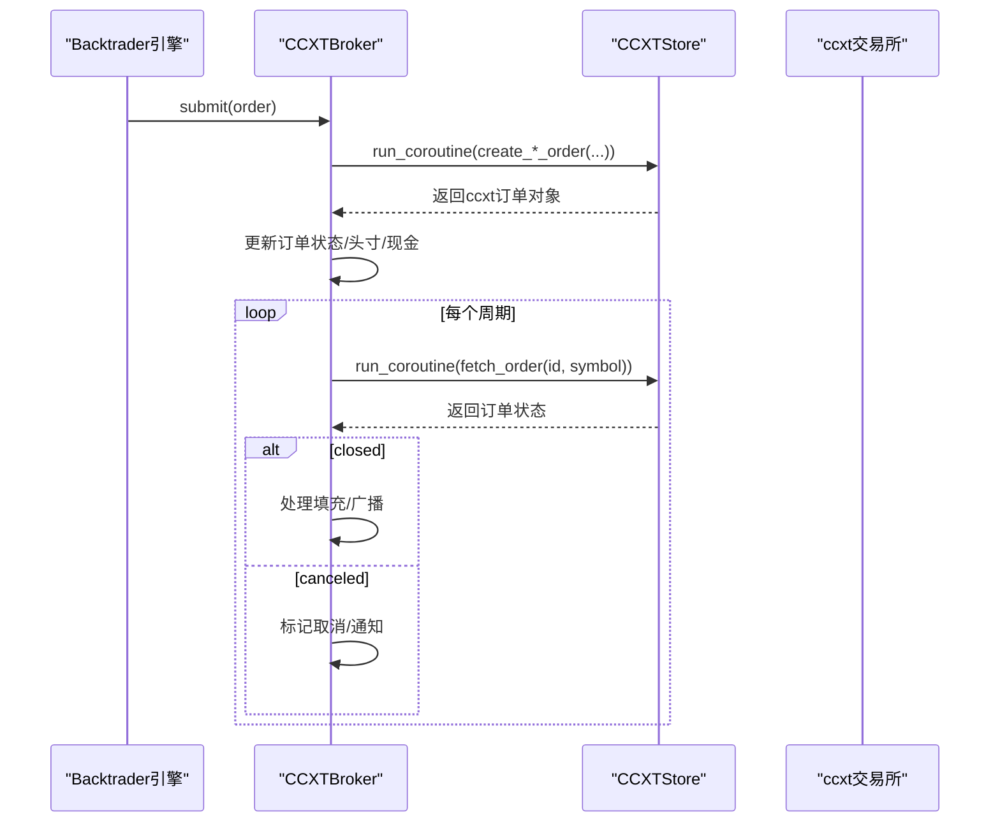
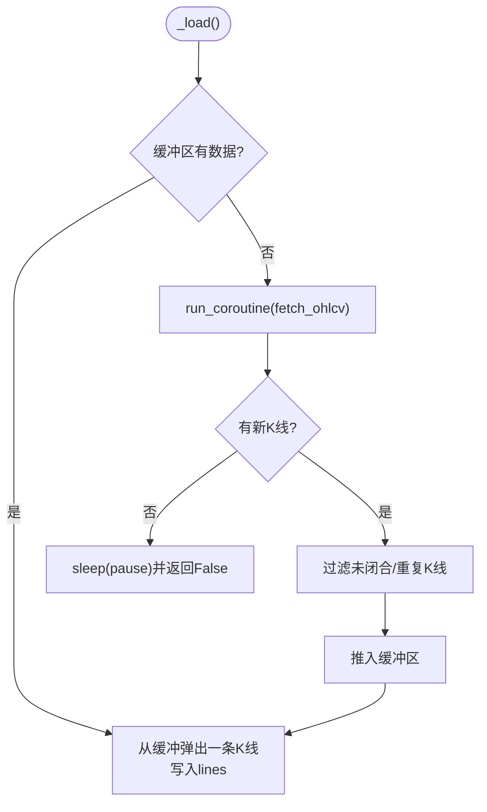
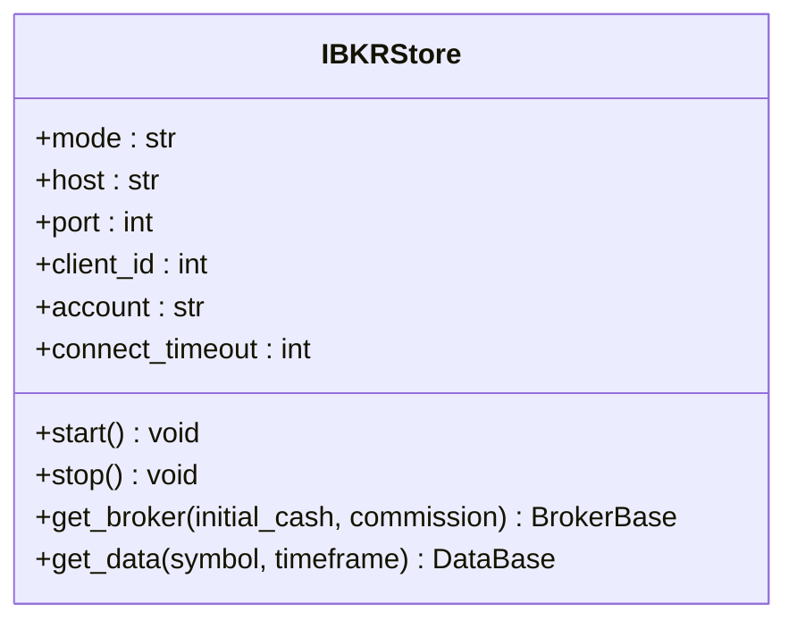
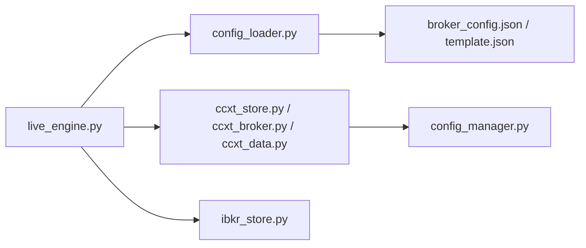

# 交易所适配器机制

<cite>
**本文引用的文件**
- [ccxt_store.py](file://backend/src/brokers/ccxt_adapter/ccxt_store.py)
- [ccxt_broker.py](file://backend/src/brokers/ccxt_adapter/ccxt_broker.py)
- [ccxt_data.py](file://backend/src/brokers/ccxt_adapter/ccxt_data.py)
- [ibkr_store.py](file://backend/src/brokers/ibkr_adapter/ibkr_store.py)
- [config_manager.py](file://backend/src/config/config_manager.py)
- [config_loader.py](file://backend/src/utils/config_loader.py)
- [live_engine.py](file://backend/src/service/live_engine.py)
- [broker_config.json](file://backend/resources/config/broker_config.json)
- [broker_config.template.json](file://backend/resources/config/broker_config.template.json)
- [test_ccxt_store.py](file://backend/tests/brokers/ccxt_adapter/test_ccxt_store.py)
- [test_ibkr_store.py](file://backend/tests/brokers/ibkr_adapter/test_ibkr_store.py)
- [brokers.md](file://backend/src/brokers/brokers.md)
</cite>

## 目录
1. [引言](#引言)
2. [项目结构](#项目结构)
3. [核心组件](#核心组件)
4. [架构总览](#架构总览)
5. [详细组件分析](#详细组件分析)
6. [依赖关系分析](#依赖关系分析)
7. [性能考量](#性能考量)
8. [故障排查指南](#故障排查指南)
9. [结论](#结论)
10. [附录](#附录)

## 引言
本文件系统化阐述交易所适配器机制，重点覆盖：
- CCXTAdapter与IBKRAdapter的设计模式与职责边界
- CCXTStore如何封装ccxt库，提供统一的start、stop、run_coroutine、create_order、fetch_balance等接口，并通过配置文件（broker_config.json）管理多个交易所的凭据与参数
- IBKRStore如何连接盈透证券API，处理会话、订单与市场数据流
- 两种适配器在认证方式、API调用模式与错误处理策略上的差异
- 在broker_config.template.json中添加新交易所的配置示例与系统如何按配置动态加载适配器
- 适配器模式如何提升系统的可扩展性与可维护性，便于集成更多交易所

## 项目结构
围绕“适配层”形成清晰的模块划分：
- 适配层入口与说明：brokers.md
- CCXT适配器：ccxt_store、ccxt_broker、ccxt_data
- IBKR适配器：ibkr_store
- 配置与凭证：config_loader（配置校验）、config_manager（凭证加载）
- 运行时编排：live_engine（按配置自动选择适配器）

图表来源
- [live_engine.py](file://backend/src/service/live_engine.py#L50-L102)
- [config_loader.py](file://backend/src/utils/config_loader.py#L113-L170)
- [config_manager.py](file://backend/src/config/config_manager.py#L180-L233)
- [ccxt_store.py](file://backend/src/brokers/ccxt_adapter/ccxt_store.py#L60-L123)
- [ibkr_store.py](file://backend/src/brokers/ibkr_adapter/ibkr_store.py#L84-L122)

章节来源
- [brokers.md](file://backend/src/brokers/brokers.md#L1-L23)

## 核心组件
- CCXTStore：负责启动/停止事件循环、加载凭证、初始化ccxt交易所实例、执行带重试的异步操作、提供run_coroutine桥接Backtrader同步框架与ccxt异步调用
- CCXTBroker：面向Backtrader的Broker实现，提交/取消订单、跟踪资金与头寸、周期性轮询订单状态、广播WebSocket更新
- CCXTData：实时OHLCV数据源，支持回填、抓取补漏、过滤未闭合K线、错误重试与速率限制尊重
- IBKRStore：薄封装Backtrader IBStore，统一生命周期与参数来源（环境变量），提供get_broker/get_data
- 配置与凭证：config_loader负责broker_config.json的结构化加载与校验；config_manager负责凭证优先级（数据库→环境变量→默认值）

章节来源
- [ccxt_store.py](file://backend/src/brokers/ccxt_adapter/ccxt_store.py#L60-L123)
- [ccxt_broker.py](file://backend/src/brokers/ccxt_adapter/ccxt_broker.py#L132-L218)
- [ccxt_data.py](file://backend/src/brokers/ccxt_adapter/ccxt_data.py#L94-L123)
- [ibkr_store.py](file://backend/src/brokers/ibkr_adapter/ibkr_store.py#L84-L122)
- [config_loader.py](file://backend/src/utils/config_loader.py#L113-L170)
- [config_manager.py](file://backend/src/config/config_manager.py#L180-L233)

## 架构总览
适配器模式通过统一的生命周期接口（start/stop）与工厂式组件构建（store/broker/data），屏蔽不同交易所/券商的差异，使上层策略与引擎无需感知底层实现细节。

图表来源
- [live_engine.py](file://backend/src/service/live_engine.py#L50-L102)
- [config_loader.py](file://backend/src/utils/config_loader.py#L179-L217)

## 详细组件分析

### CCXTStore：统一的交易所连接与事件循环桥接
- 启动流程：先启动后台事件循环线程，再加载凭证，初始化ccxt交易所实例，最后在事件循环内加载市场信息并进行带重试的验证
- 凭证加载：通过ConfigManager按用户维度从数据库或环境变量获取API密钥与口令；支持paper/live双模式
- 会话与沙盒：根据模式启用沙盒/测试网；对特定交易所（如Binance Spot Testnet）进行URL覆盖
- 异步桥接：run_coroutine在同步上下文中安全地调度并等待异步任务结果，超时与异常均被显式处理
- 错误与重试：对网络类错误进行指数退避重试，非网络错误直接抛出
- 资源清理：stop方法在事件循环中优雅关闭ccxt连接，停止事件循环并等待线程退出

图表来源
- [ccxt_store.py](file://backend/src/brokers/ccxt_adapter/ccxt_store.py#L60-L123)
- [ccxt_store.py](file://backend/src/brokers/ccxt_adapter/ccxt_store.py#L171-L204)
- [ccxt_store.py](file://backend/src/brokers/ccxt_adapter/ccxt_store.py#L205-L257)
- [ccxt_store.py](file://backend/src/brokers/ccxt_adapter/ccxt_store.py#L258-L299)
- [ccxt_store.py](file://backend/src/brokers/ccxt_adapter/ccxt_store.py#L299-L320)

章节来源
- [ccxt_store.py](file://backend/src/brokers/ccxt_adapter/ccxt_store.py#L60-L123)
- [ccxt_store.py](file://backend/src/brokers/ccxt_adapter/ccxt_store.py#L171-L204)
- [ccxt_store.py](file://backend/src/brokers/ccxt_adapter/ccxt_store.py#L205-L257)
- [ccxt_store.py](file://backend/src/brokers/ccxt_adapter/ccxt_store.py#L258-L299)
- [ccxt_store.py](file://backend/src/brokers/ccxt_adapter/ccxt_store.py#L299-L320)

### CCXTBroker：订单路由与头寸管理
- 生命周期：start时在paper模式下使用初始现金，在live模式下拉取真实余额；stop时取消所有挂单
- 订单提交：根据Backtrader订单类型映射到ccxt的市价/限价单，记录ccxt订单ID，立即返回Accepted或直接按响应标记Completed
- 订单轮询：next周期内轮询未成交订单状态，按closed/canceled分支处理填充与取消通知
- 资金与头寸：按成交均价更新头寸与可用现金，计算组合价值与P&L，通过WebSocket广播订单/成交/头寸/P&L更新
- 兼容性：提供getcash/getvalue兼容方法，确保与Backtrader分析器与引擎交互顺畅

图表来源
- [ccxt_broker.py](file://backend/src/brokers/ccxt_adapter/ccxt_broker.py#L170-L218)
- [ccxt_broker.py](file://backend/src/brokers/ccxt_adapter/ccxt_broker.py#L318-L362)
- [ccxt_broker.py](file://backend/src/brokers/ccxt_adapter/ccxt_broker.py#L467-L496)

章节来源
- [ccxt_broker.py](file://backend/src/brokers/ccxt_adapter/ccxt_broker.py#L132-L218)
- [ccxt_broker.py](file://backend/src/brokers/ccxt_adapter/ccxt_broker.py#L318-L362)
- [ccxt_broker.py](file://backend/src/brokers/ccxt_adapter/ccxt_broker.py#L467-L496)

### CCXTData：实时OHLCV数据流与回填
- 实时抓取：基于上次已知K线时间戳计算since，批量拉取OHLCV，过滤未闭合K线与重复时间戳
- 回填支持：可选的历史回填，按批次拉取并尊重交易所rateLimit
- 缓冲与补漏：历史与实时数据统一进入缓冲队列，逐条推送至Backtrader
- 时间粒度映射：将CCXT时间粒度字符串映射为Backtrader的TimeFrame与Compression

图表来源
- [ccxt_data.py](file://backend/src/brokers/ccxt_adapter/ccxt_data.py#L94-L123)
- [ccxt_data.py](file://backend/src/brokers/ccxt_adapter/ccxt_data.py#L124-L171)
- [ccxt_data.py](file://backend/src/brokers/ccxt_adapter/ccxt_data.py#L194-L258)

章节来源
- [ccxt_data.py](file://backend/src/brokers/ccxt_adapter/ccxt_data.py#L94-L123)
- [ccxt_data.py](file://backend/src/brokers/ccxt_adapter/ccxt_data.py#L124-L171)
- [ccxt_data.py](file://backend/src/brokers/ccxt_adapter/ccxt_data.py#L194-L258)

### IBKRStore：IBKR薄封装与参数来源
- 参数来源：优先显式参数，其次环境变量（IBKR_{MODE}_HOST/PORT/CLIENT_ID/ACCOUNT），默认端口随paper/live切换
- 连接管理：start时创建IBStore并开启重连与超时控制；stop时断开底层连接
- 组件提供：get_broker设置初始现金与手续费；get_data创建实时数据流（rtbar=True，historical=False，useRTH=True）

图表来源
- [ibkr_store.py](file://backend/src/brokers/ibkr_adapter/ibkr_store.py#L47-L122)

章节来源
- [ibkr_store.py](file://backend/src/brokers/ibkr_adapter/ibkr_store.py#L47-L122)

### 配置与凭证加载：broker_config.json与模板
- broker_config.json定义了各交易所的启用状态、适配器类型、ccxt_id、默认市场、纸盘沙盒参数、速率限制等
- broker_config.template.json提供完整示例与注释，指导复制、启用交易所、配置API密钥、调整风控与通知
- config_loader使用Pydantic模型对配置进行结构化校验，提供get_exchange_config、list_enabled_exchanges、validate_timeframe等工具函数
- config_manager提供凭证优先级：数据库（用户级加密）→环境变量（.env）→默认值，CCXT凭证键名遵循CCXT_{EXCHANGE}_{MODE}_API_KEY/SECRET/PASSPHRASE约定

章节来源
- [broker_config.json](file://backend/resources/config/broker_config.json#L1-L131)
- [broker_config.template.json](file://backend/resources/config/broker_config.template.json#L1-L114)
- [config_loader.py](file://backend/src/utils/config_loader.py#L113-L170)
- [config_loader.py](file://backend/src/utils/config_loader.py#L179-L217)
- [config_loader.py](file://backend/src/utils/config_loader.py#L219-L246)
- [config_loader.py](file://backend/src/utils/config_loader.py#L304-L333)
- [config_manager.py](file://backend/src/config/config_manager.py#L180-L233)

## 依赖关系分析
- 适配器选择：live_engine根据broker_config中的adapter字段自动选择CCXT或IBKR路径
- CCXT链路：CCXTStore依赖ccxt异步库与ConfigManager；CCXTBroker/CCXTData依赖CCXTStore
- IBKR链路：IBKRStore依赖Backtrader IBStore（ibapi），通过环境变量驱动连接参数
- 配置链路：config_loader负责broker_config.json的加载与校验；config_manager负责凭证加载

图表来源
- [live_engine.py](file://backend/src/service/live_engine.py#L50-L102)
- [config_loader.py](file://backend/src/utils/config_loader.py#L113-L170)
- [config_manager.py](file://backend/src/config/config_manager.py#L180-L233)

章节来源
- [live_engine.py](file://backend/src/service/live_engine.py#L50-L102)
- [config_loader.py](file://backend/src/utils/config_loader.py#L113-L170)
- [config_manager.py](file://backend/src/config/config_manager.py#L180-L233)

## 性能考量
- 事件循环与线程：CCXTStore在独立线程中运行事件循环，run_coroutine通过run_coroutine_threadsafe调度，避免阻塞主线程
- 批量抓取与缓冲：CCXTData使用缓冲队列与批量拉取减少频繁请求，同时过滤未闭合K线避免未来数据泄漏
- 重试与退避：CCXTStore对网络错误采用指数退避重试，降低瞬时抖动影响
- 速率限制：CCXTData尊重交易所rateLimit，回填阶段按间隔sleep，避免触发限流
- 纸盘优化：IBKRStore在paper模式下可直接设置初始现金，避免首次查询账户余额的额外延迟

## 故障排查指南
- 启动失败
  - CCXTStore：检查事件循环是否成功启动（超时/无法启动）；确认凭证加载是否成功（数据库/环境变量）
  - IBKRStore：确认IBStore可用且环境变量正确（HOST/PORT/CLIENT_ID/ACCOUNT）
- 订单问题
  - CCXTBroker：确认订单类型映射（Market/Limit）与symbol格式；检查next轮询是否正常拉取订单状态
- 数据问题
  - CCXTData：检查timeframe是否受支持；查看缓冲区是否持续为空（网络/限流/过滤导致）
- 配置问题
  - broker_config.json：确认exchange.enabled与adapter字段；validate_timeframe与validate_symbol是否报错

章节来源
- [ccxt_store.py](file://backend/src/brokers/ccxt_adapter/ccxt_store.py#L258-L299)
- [ccxt_store.py](file://backend/src/brokers/ccxt_adapter/ccxt_store.py#L299-L320)
- [ibkr_store.py](file://backend/src/brokers/ibkr_adapter/ibkr_store.py#L84-L122)
- [config_loader.py](file://backend/src/utils/config_loader.py#L304-L333)
- [test_ccxt_store.py](file://backend/tests/brokers/ccxt_adapter/test_ccxt_store.py#L1-L64)
- [test_ibkr_store.py](file://backend/tests/brokers/ibkr_adapter/test_ibkr_store.py#L1-L52)

## 结论
通过适配器模式，系统实现了对CCXT与IBKR两类交易接口的统一抽象：
- CCXTAdapter以事件循环与凭证管理为核心，提供稳健的异步桥接与订单/数据处理
- IBKRAdapter以薄封装与环境变量驱动连接，满足传统券商业务场景
- 配置与凭证体系确保了可插拔与可运维性，便于快速扩展新的交易所或券商

该设计提升了系统的可扩展性与可维护性，新增适配器只需遵循统一的生命周期与接口约定，即可无缝接入实时引擎。

## 附录

### 在broker_config.template.json中添加新交易所的配置示例
- 复制template文件为正式配置文件后，按以下步骤添加：
  - 在exchanges下新增一个键（建议使用交易所ID，如“gateio”）
  - 设置enabled为true/false
  - adapter选择“ccxt”或“ibkr”
  - ccxt_id填写ccxt库支持的交易所ID（若adapter=ccxt）
  - markets列出支持的市场类型（如spot/futures/swap/linear等）
  - default_market设置默认市场类型
  - paper_mode配置沙盒URL与初始资金
  - rate_limits按交易所实际限制填写
  - 如为IBKR，补充notes中关于IB Gateway/TWS的环境变量说明
- 完成后通过config_loader加载并校验，确保adapter字段合法

章节来源
- [broker_config.template.json](file://backend/resources/config/broker_config.template.json#L1-L114)
- [config_loader.py](file://backend/src/utils/config_loader.py#L179-L217)

### 系统如何根据配置动态加载适配器
- live_engine在运行时加载broker_config.json，调用get_exchange_config解析指定exchange的配置
- 根据ex_config.adapter选择CCXT或IBKR路径，分别构造CCXTStore/IBKRStore、Broker与Data Feed
- CCXT路径下，CCXTStore.start()会加载凭证并初始化ccxt实例；IBKR路径下，IBKRStore.start()建立与IB Gateway/TWS的连接

章节来源
- [live_engine.py](file://backend/src/service/live_engine.py#L50-L102)
- [config_loader.py](file://backend/src/utils/config_loader.py#L179-L217)