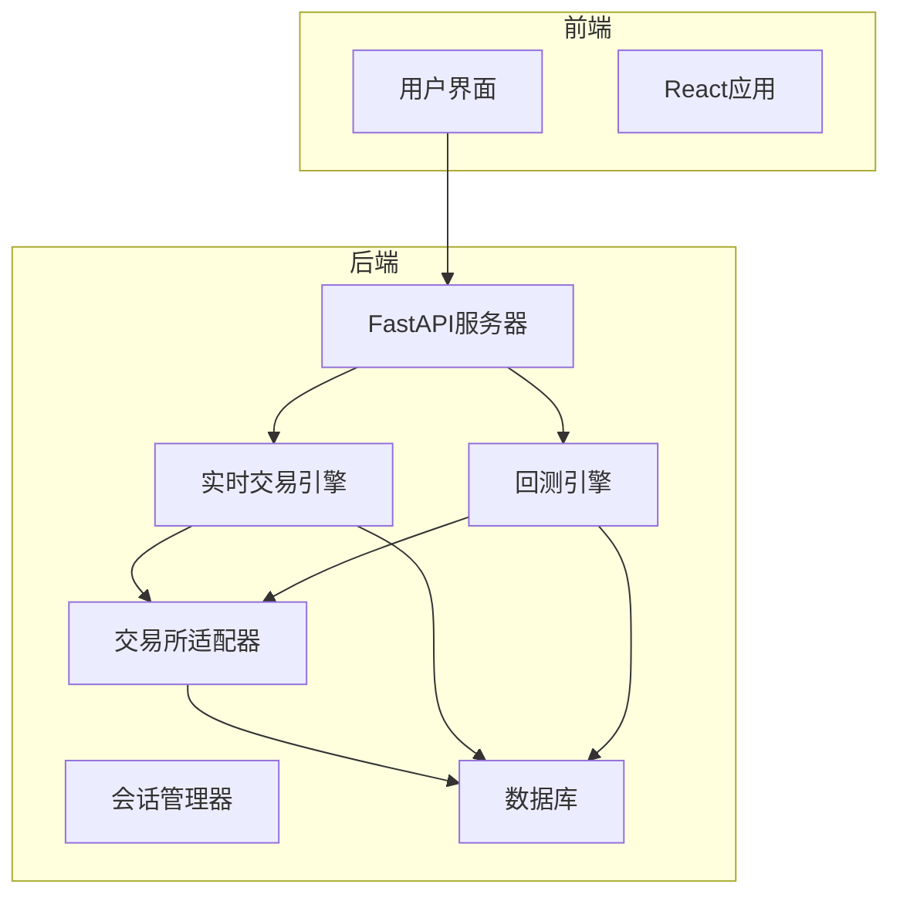
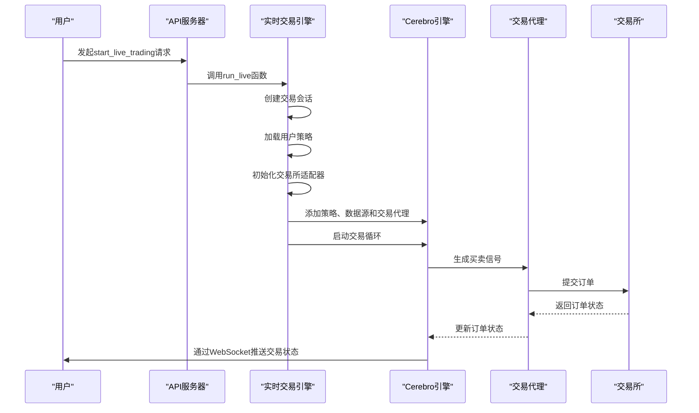
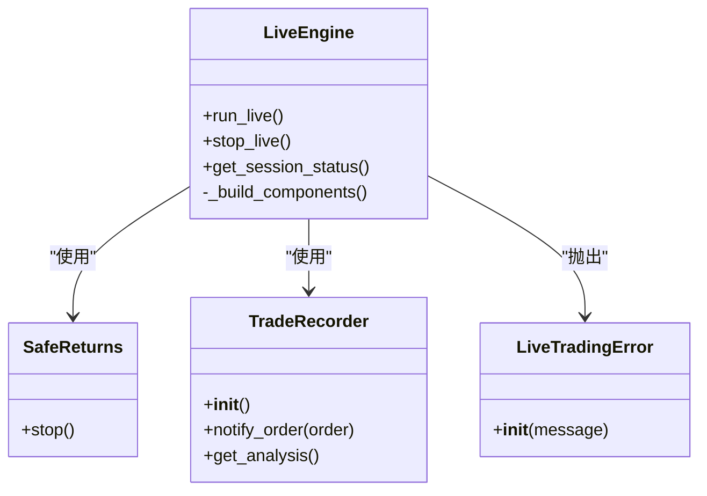
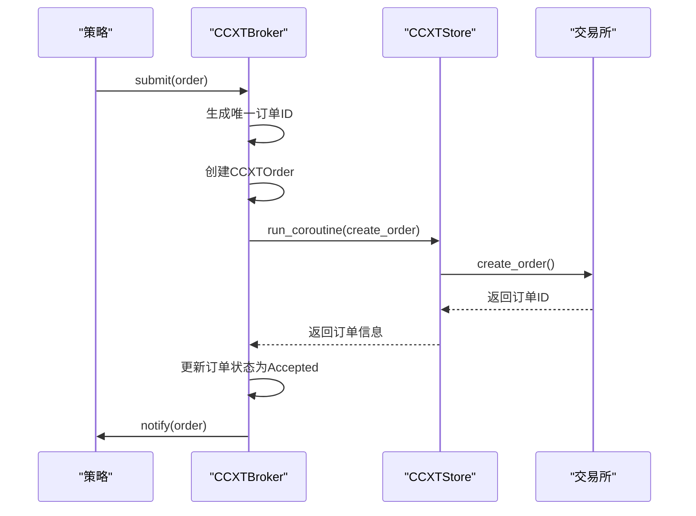
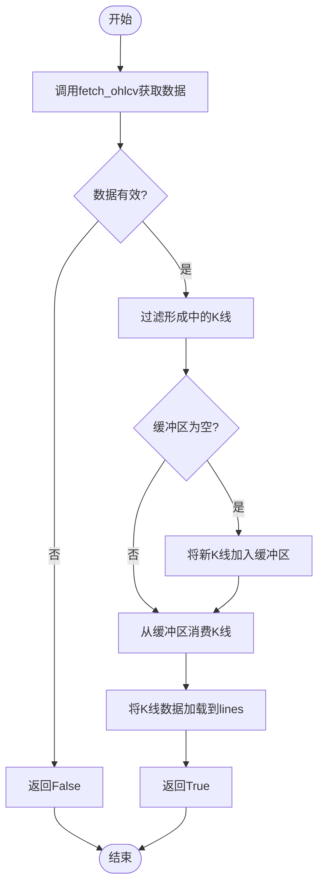
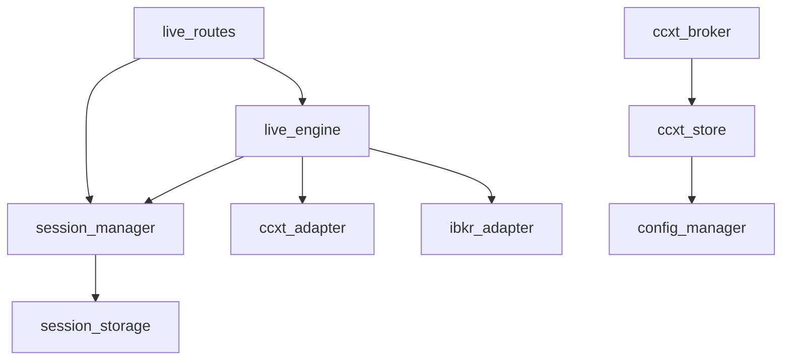

# 交易执行流程

<cite>
**本文档引用的文件**
- [main.py](file://backend/main.py)
- [api.py](file://backend/api.py)
- [app.py](file://backend/src/service/app.py)
- [live_engine.py](file://backend/src/service/live_engine.py)
- [backtest_engine.py](file://backend/src/service/backtest_engine.py)
- [live_routes.py](file://backend/src/routes/live_routes.py)
- [ccxt_broker.py](file://backend/src/brokers/ccxt_adapter/ccxt_broker.py)
- [ccxt_store.py](file://backend/src/brokers/ccxt_adapter/ccxt_store.py)
- [ccxt_data.py](file://backend/src/brokers/ccxt_adapter/ccxt_data.py)
- [ibkr_store.py](file://backend/src/brokers/ibkr_adapter/ibkr_store.py)
- [session_manager.py](file://backend/src/service/session_manager.py)
- [session_storage.py](file://backend/src/db/session_storage.py)
- [sma_cross.py](file://backend/resources/strategy/sma_cross.py)
</cite>

## 目录
1. [简介](#简介)
2. [项目结构](#项目结构)
3. [核心组件](#核心组件)
4. [交易执行流程概述](#交易执行流程概述)
5. [详细组件分析](#详细组件分析)
6. [依赖关系分析](#依赖关系分析)
7. [性能考虑](#性能考虑)
8. [故障排除指南](#故障排除指南)
9. [结论](#结论)

## 简介
本文档详细描述了从策略信号生成到订单提交的完整交易执行流程。以`run_live`函数为起点，说明Cerebro引擎如何加载用户策略并启动回测循环。文档详细解释了CCXTBroker和IBKRStore如何作为Backtrader的broker适配器，拦截策略的buy/sell信号，并通过各自的API与交易所进行交互（如create_order、fetch_orders）。同时，文档说明了交易执行过程中的关键环节：市场数据获取（CCXTData）、订单状态同步、成交回报处理以及PnL计算。结合代码片段展示如何在策略中实现交易逻辑，并分析系统如何处理网络延迟、订单拒绝等异常情况，确保交易的可靠性。

## 项目结构
本项目采用分层架构设计，主要分为前端（frontend）、后端（backend）和自动化测试（auto_test）三个部分。后端服务是交易执行的核心，包含了策略管理、回测引擎、实时交易引擎、数据库操作和WebSocket通信等模块。前端通过REST API与后端交互，实现策略配置、交易监控和结果展示等功能。

**图表来源**
- [main.py](file://backend/main.py#L1-L32)
- [app.py](file://backend/src/service/app.py#L1-L46)
- [live_engine.py](file://backend/src/service/live_engine.py#L1-L338)

**章节来源**
- [main.py](file://backend/main.py#L1-L32)
- [app.py](file://backend/src/service/app.py#L1-L46)

## 核心组件
系统的核心组件包括实时交易引擎（live_engine）、会话管理器（session_manager）、交易所适配器（ccxt_adapter和ibkr_adapter）以及策略管理模块。`run_live`函数是实时交易的入口点，它通过Cerebro引擎加载用户策略并启动交易循环。CCXTBroker和IBKRStore作为Backtrader的broker适配器，负责拦截策略的买卖信号，并通过各自的API与交易所进行交互。市场数据通过CCXTData组件获取，确保策略能够基于最新的市场信息做出决策。

**章节来源**
- [live_engine.py](file://backend/src/service/live_engine.py#L105-L338)
- [session_manager.py](file://backend/src/service/session_manager.py#L1-L419)
- [ccxt_broker.py](file://backend/src/brokers/ccxt_adapter/ccxt_broker.py#L1-L545)

## 交易执行流程概述
交易执行流程从用户通过API发起`start_live_trading`请求开始。`live_routes.py`中的路由处理函数验证请求参数后，调用`live_engine.py`中的`run_live`函数。`run_live`函数首先创建一个交易会话，然后加载用户指定的策略类。接着，根据配置初始化交易所适配器（CCXTStore或IBKRStore），并创建相应的数据源（CCXTData）和交易代理（CCXTBroker）。最后，将策略、数据源和交易代理添加到Cerebro引擎中，并在后台线程中启动交易循环。

**图表来源**
- [live_routes.py](file://backend/src/routes/live_routes.py#L102-L176)
- [live_engine.py](file://backend/src/service/live_engine.py#L105-L269)
- [ccxt_broker.py](file://backend/src/brokers/ccxt_adapter/ccxt_broker.py#L170-L218)

**章节来源**
- [live_routes.py](file://backend/src/routes/live_routes.py#L102-L176)
- [live_engine.py](file://backend/src/service/live_engine.py#L105-L269)

## 详细组件分析

### 实时交易引擎分析
实时交易引擎是整个系统的核心，负责协调策略执行、数据获取和订单管理。`run_live`函数是引擎的入口点，它通过`_build_components`函数根据配置初始化交易所适配器。对于CCXT适配器，它创建`CCXTStore`实例来管理与交易所的连接，`CCXTBroker`实例来处理订单执行，以及`CCXTData`实例来获取市场数据。引擎还集成了会话管理器，用于跟踪和管理多个并发的交易会话。

#### 对于API/服务组件：

**图表来源**
- [live_engine.py](file://backend/src/service/live_engine.py#L31-L338)

**章节来源**
- [live_engine.py](file://backend/src/service/live_engine.py#L105-L338)

### 交易所适配器分析
交易所适配器是连接Backtrader框架与外部交易所的桥梁。系统支持两种适配器：`CCXTAdapter`用于加密货币交易所，`IBKRAdapter`用于传统金融市场的Interactive Brokers。`CCXTStore`负责管理与CCXT交易所的异步连接，通过在后台线程中运行事件循环来桥接异步的CCXT库和同步的Backtrader框架。`CCXTBroker`继承自`bt.BrokerBase`，实现了`submit`、`cancel`、`get_cash`和`get_value`等方法，将Backtrader的订单指令转换为CCXT的API调用。

#### 对于API/服务组件：

**图表来源**
- [ccxt_broker.py](file://backend/src/brokers/ccxt_adapter/ccxt_broker.py#L170-L218)
- [ccxt_store.py](file://backend/src/brokers/ccxt_adapter/ccxt_store.py#L138-L169)

**章节来源**
- [ccxt_broker.py](file://backend/src/brokers/ccxt_adapter/ccxt_broker.py#L1-L545)
- [ccxt_store.py](file://backend/src/brokers/ccxt_adapter/ccxt_store.py#L1-L330)

### 市场数据获取分析
市场数据是策略决策的基础。`CCXTData`组件负责从交易所获取实时的OHLCV（开盘价、最高价、最低价、收盘价、成交量）数据。它通过`_fetch_from_exchange`方法定期调用CCXT的`fetch_ohlcv` API获取数据，并通过`_consume_from_buffer`方法将数据提供给Backtrader引擎。为了防止使用未完成的K线（repainting/future leaks），组件会过滤掉时间戳大于当前时间的“形成中”K线。

#### 对于复杂逻辑组件：

**图表来源**
- [ccxt_data.py](file://backend/src/brokers/ccxt_adapter/ccxt_data.py#L94-L192)

**章节来源**
- [ccxt_data.py](file://backend/src/brokers/ccxt_adapter/ccxt_data.py#L1-L288)

### 策略实现分析
用户策略通过继承`bt.Strategy`类来实现。一个典型的策略如`sma_cross.py`，定义了两个移动平均线指标，并在`next`方法中检查它们的交叉点。当短期均线向上穿越长期均线时，策略发出买入信号；反之，则发出卖出信号。策略的参数（如均线周期）可以在`params`元组中定义，便于在回测和实盘中进行优化。

**章节来源**
- [sma_cross.py](file://backend/resources/strategy/sma_cross.py#L1-L19)

## 依赖关系分析
系统各组件之间存在紧密的依赖关系。`live_engine`依赖于`session_manager`来管理会话生命周期，依赖于`ccxt_adapter`或`ibkr_adapter`来与交易所交互。`ccxt_broker`依赖于`ccxt_store`来执行API调用，而`ccxt_store`又依赖于`config_manager`来加载API凭据。`session_manager`依赖于`session_storage`来持久化会话数据，确保系统重启后可以恢复会话状态。

**图表来源**
- [live_engine.py](file://backend/src/service/live_engine.py#L1-L338)
- [session_manager.py](file://backend/src/service/session_manager.py#L1-L419)
- [ccxt_broker.py](file://backend/src/brokers/ccxt_adapter/ccxt_broker.py#L1-L545)

**章节来源**
- [live_engine.py](file://backend/src/service/live_engine.py#L1-L338)
- [session_manager.py](file://backend/src/service/session_manager.py#L1-L419)

## 性能考虑
系统的性能主要受网络延迟、API调用频率和数据处理速度的影响。`CCXTStore`通过在后台线程中运行事件循环来避免阻塞主线程，确保交易引擎的实时性。`CCXTData`组件通过批量获取数据（由`limit`参数控制）和适当的暂停时间（由`pause`参数控制）来平衡数据新鲜度和API调用频率。在高并发场景下，系统通过`SessionManager`的线程锁来确保会话管理的线程安全。

## 故障排除指南
系统在设计时充分考虑了异常情况的处理。`CCXTStore`的`_fetch_with_retry`方法实现了网络错误的重试机制，最多重试3次，每次间隔逐渐增加。`CCXTBroker`的`next`方法在每次K线更新时都会检查已提交订单的状态，通过`fetch_order` API同步订单的最新状态。如果订单被交易所拒绝或取消，`CCXTBroker`会更新订单状态并通知Cerebro引擎。此外，系统通过WebSocket向客户端广播订单更新、成交回报、持仓变化和PnL更新，确保用户能够实时了解交易状态。

**章节来源**
- [ccxt_store.py](file://backend/src/brokers/ccxt_adapter/ccxt_store.py#L299-L319)
- [ccxt_broker.py](file://backend/src/brokers/ccxt_adapter/ccxt_broker.py#L467-L496)

## 结论
本文档详细描述了基于Backtrader框架的交易执行流程。系统通过`run_live`函数启动，利用Cerebro引擎加载用户策略，并通过CCXTBroker或IBKRStore适配器与交易所进行交互。市场数据通过CCXTData组件实时获取，确保策略决策的准确性。系统通过会话管理器和数据库持久化来管理交易会话，确保了系统的可靠性和可恢复性。通过合理的异常处理和性能优化，系统能够稳定地执行交易策略，为用户提供可靠的交易服务。