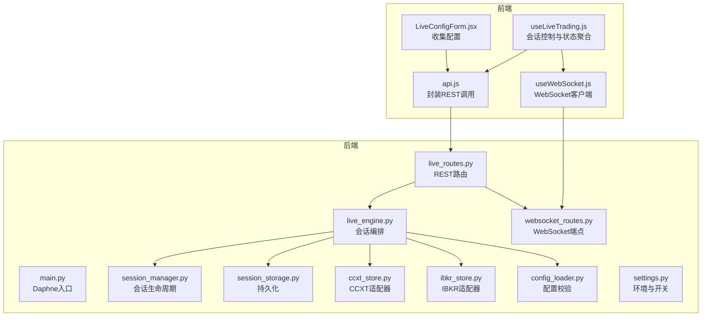
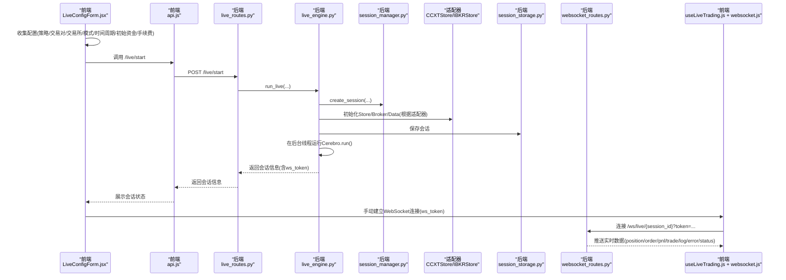
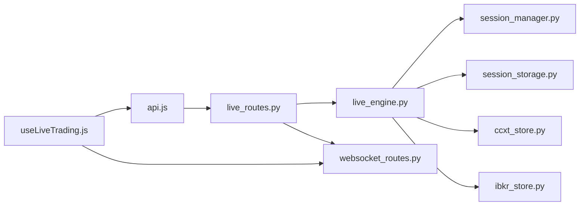

# 实盘交易数据流

<cite>
**本文引用的文件**
- [backend/main.py](file://backend/main.py)
- [backend/src/routes/live_routes.py](file://backend/src/routes/live_routes.py)
- [backend/src/service/live_engine.py](file://backend/src/service/live_engine.py)
- [backend/src/service/session_manager.py](file://backend/src/service/session_manager.py)
- [backend/src/brokers/ccxt_adapter/ccxt_store.py](file://backend/src/brokers/ccxt_adapter/ccxt_store.py)
- [backend/src/brokers/ibkr_adapter/ibkr_store.py](file://backend/src/brokers/ibkr_adapter/ibkr_store.py)
- [backend/src/utils/config_loader.py](file://backend/src/utils/config_loader.py)
- [backend/src/db/session_storage.py](file://backend/src/db/session_storage.py)
- [backend/src/config/settings.py](file://backend/src/config/settings.py)
- [backend/src/routes/websocket_routes.py](file://backend/src/routes/websocket_routes.py)
- [frontend/src/components/LiveTrading/LiveConfigForm.jsx](file://frontend/src/components/LiveTrading/LiveConfigForm.jsx)
- [frontend/src/services/api.js](file://frontend/src/services/api.js)
- [frontend/src/hooks/useLiveTrading.js](file://frontend/src/hooks/useLiveTrading.js)
- [frontend/src/services/websocket.js](file://frontend/src/services/websocket.js)
</cite>

## 目录
1. [引言](#引言)
2. [项目结构](#项目结构)
3. [核心组件](#核心组件)
4. [架构总览](#架构总览)
5. [详细组件分析](#详细组件分析)
6. [依赖关系分析](#依赖关系分析)
7. [性能考量](#性能考量)
8. [故障排查指南](#故障排查指南)
9. [结论](#结论)

## 引言
本文件面向实盘交易数据流，系统性梳理从用户在前端配置并启动实盘会话，到后端路由、引擎、会话管理、适配器与交易所API交互，再到实时数据推送的完整链路。重点覆盖：
- 前端LiveConfigForm如何收集配置并通过api.js调用后端/live/start
- 后端live_routes.py接收请求并委托给live_engine.py
- live_engine.py通过SessionManager创建和管理交易会话
- 会话通过CCXTStore或IBKRStore适配器与具体交易所API交互（订单提交、持仓查询、市场数据获取）
- 系统如何处理会话生命周期（启动、停止、状态查询）与错误恢复
- 数据流设计对交易安全性与可靠性的保障

## 项目结构
后端采用FastAPI + Daphne作为服务端，使用Backtrader作为策略运行框架；前端基于React，提供LiveConfigForm表单与实时数据展示。WebSocket用于向前端推送实时更新。

图表来源
- [backend/main.py](file://backend/main.py#L1-L32)
- [backend/src/routes/live_routes.py](file://backend/src/routes/live_routes.py#L1-L120)
- [backend/src/service/live_engine.py](file://backend/src/service/live_engine.py#L1-L120)
- [backend/src/service/session_manager.py](file://backend/src/service/session_manager.py#L1-L120)
- [backend/src/db/session_storage.py](file://backend/src/db/session_storage.py#L1-L80)
- [backend/src/brokers/ccxt_adapter/ccxt_store.py](file://backend/src/brokers/ccxt_adapter/ccxt_store.py#L1-L120)
- [backend/src/brokers/ibkr_adapter/ibkr_store.py](file://backend/src/brokers/ibkr_adapter/ibkr_store.py#L1-L80)
- [backend/src/utils/config_loader.py](file://backend/src/utils/config_loader.py#L1-L120)
- [backend/src/routes/websocket_routes.py](file://backend/src/routes/websocket_routes.py#L1-L80)
- [frontend/src/components/LiveTrading/LiveConfigForm.jsx](file://frontend/src/components/LiveTrading/LiveConfigForm.jsx#L1-L120)
- [frontend/src/services/api.js](file://frontend/src/services/api.js#L1-L120)
- [frontend/src/hooks/useLiveTrading.js](file://frontend/src/hooks/useLiveTrading.js#L1-L120)
- [frontend/src/services/websocket.js](file://frontend/src/services/websocket.js#L1-L120)

章节来源
- [backend/main.py](file://backend/main.py#L1-L32)
- [frontend/src/components/LiveTrading/LiveConfigForm.jsx](file://frontend/src/components/LiveTrading/LiveConfigForm.jsx#L1-L120)

## 核心组件
- 前端组件与服务
  - LiveConfigForm.jsx：收集策略、交易对、交易所、模式、时间周期、初始资金、手续费等配置
  - api.js：封装REST调用，包含/start、/stop、/status、/sessions、/orders、/exchanges、/health等接口
  - useLiveTrading.js：会话生命周期控制、WebSocket连接与消息处理
  - websocket.js：通用WebSocket客户端Hook，支持心跳、重连策略与消息解析
- 后端路由与服务
  - live_routes.py：REST端点，负责参数校验、权限检查、调用引擎与会话管理
  - live_engine.py：会话编排，构建Store/Broker/Data，启动Cerebro线程，维护状态与持久化
  - session_manager.py：会话生命周期管理（创建、启动、停止、状态查询），线程安全
  - ccxt_store.py / ibkr_store.py：适配器层，抽象CCXT与IBKR连接、事件循环、凭证加载、市场数据与订单执行
  - config_loader.py：Broker配置加载与校验（交换器、市场类型、时间周期、风控）
  - session_storage.py：数据库持久化（会话、订单、头寸）
  - websocket_routes.py：WebSocket端点，按会话ID与ws_token鉴权，推送实时数据
  - settings.py：平台级开关（如LIVE_TRADING_ENABLED）、默认值与资源目录

章节来源
- [frontend/src/components/LiveTrading/LiveConfigForm.jsx](file://frontend/src/components/LiveTrading/LiveConfigForm.jsx#L1-L241)
- [frontend/src/services/api.js](file://frontend/src/services/api.js#L180-L260)
- [frontend/src/hooks/useLiveTrading.js](file://frontend/src/hooks/useLiveTrading.js#L1-L200)
- [frontend/src/services/websocket.js](file://frontend/src/services/websocket.js#L1-L120)
- [backend/src/routes/live_routes.py](file://backend/src/routes/live_routes.py#L1-L120)
- [backend/src/service/live_engine.py](file://backend/src/service/live_engine.py#L1-L120)
- [backend/src/service/session_manager.py](file://backend/src/service/session_manager.py#L1-L120)
- [backend/src/brokers/ccxt_adapter/ccxt_store.py](file://backend/src/brokers/ccxt_adapter/ccxt_store.py#L1-L120)
- [backend/src/brokers/ibkr_adapter/ibkr_store.py](file://backend/src/brokers/ibkr_adapter/ibkr_store.py#L1-L80)
- [backend/src/utils/config_loader.py](file://backend/src/utils/config_loader.py#L1-L120)
- [backend/src/db/session_storage.py](file://backend/src/db/session_storage.py#L1-L120)
- [backend/src/routes/websocket_routes.py](file://backend/src/routes/websocket_routes.py#L1-L120)
- [backend/src/config/settings.py](file://backend/src/config/settings.py#L1-L60)

## 架构总览
下图展示从前端到后端的端到端数据流，包括配置收集、REST启动、引擎编排、适配器交互与WebSocket推送。

图表来源
- [frontend/src/components/LiveTrading/LiveConfigForm.jsx](file://frontend/src/components/LiveTrading/LiveConfigForm.jsx#L1-L120)
- [frontend/src/services/api.js](file://frontend/src/services/api.js#L180-L260)
- [backend/src/routes/live_routes.py](file://backend/src/routes/live_routes.py#L100-L180)
- [backend/src/service/live_engine.py](file://backend/src/service/live_engine.py#L105-L210)
- [backend/src/service/session_manager.py](file://backend/src/service/session_manager.py#L139-L210)
- [backend/src/brokers/ccxt_adapter/ccxt_store.py](file://backend/src/brokers/ccxt_adapter/ccxt_store.py#L60-L120)
- [backend/src/brokers/ibkr_adapter/ibkr_store.py](file://backend/src/brokers/ibkr_adapter/ibkr_store.py#L80-L120)
- [backend/src/db/session_storage.py](file://backend/src/db/session_storage.py#L59-L120)
- [backend/src/routes/websocket_routes.py](file://backend/src/routes/websocket_routes.py#L20-L80)
- [frontend/src/hooks/useLiveTrading.js](file://frontend/src/hooks/useLiveTrading.js#L120-L200)
- [frontend/src/services/websocket.js](file://frontend/src/services/websocket.js#L1-L120)

## 详细组件分析

### 前端：LiveConfigForm与API调用
- LiveConfigForm.jsx
  - 加载策略列表与可用交易所
  - 提供资产类别切换（加密货币/股票），动态加载交易所
  - 校验必填项（策略、交易对、交易所、模式、时间周期、初始资金、手续费）
  - 将配置传递给父组件回调
- api.js
  - 封装 /live/start、/live/stop、/live/status/{session_id}、/live/sessions、/live/orders/{session_id}、/live/exchanges、/live/health
  - 统一注入Authorization头（若存在访问令牌）
  - 统一解析响应，处理401跳转登录
- useLiveTrading.js
  - 启动会话：调用api.startLiveTrading，初始化状态与PnL历史，手动连接WebSocket（携带ws_token）
  - 停止会话：调用api.stopLiveTrading，断开WebSocket并清理状态
  - 刷新状态：轮询api.getLiveStatus与api.getSessionOrders
  - 处理WebSocket消息：POSITION/ORDER/PNL/TRADE/LOG/ERROR/STATUS
- websocket.js
  - 提供connect/disconnect、心跳、最大重连次数、消息解析常量

章节来源
- [frontend/src/components/LiveTrading/LiveConfigForm.jsx](file://frontend/src/components/LiveTrading/LiveConfigForm.jsx#L1-L241)
- [frontend/src/services/api.js](file://frontend/src/services/api.js#L180-L260)
- [frontend/src/hooks/useLiveTrading.js](file://frontend/src/hooks/useLiveTrading.js#L120-L200)
- [frontend/src/services/websocket.js](file://frontend/src/services/websocket.js#L1-L120)

### 后端：REST路由与会话启动
- live_routes.py
  - /live/start：校验LIVE_TRADING_ENABLED、mode、exchange、symbol、timeframe；调用run_live
  - /live/stop：校验会话存在且处于活动状态，调用stop_session
  - /live/status/{session_id}：返回会话详情（含positions/open_orders）
  - /live/sessions：分页列出会话，支持按状态过滤与仅活跃
  - /live/exchanges：返回启用的交易所列表及适配器信息
  - /live/orders/{session_id}：返回会话所有订单
  - /live/health：系统健康检查
- 配置校验
  - 通过config_loader加载broker配置，校验exchange、symbol格式、timeframe支持性

章节来源
- [backend/src/routes/live_routes.py](file://backend/src/routes/live_routes.py#L100-L180)
- [backend/src/utils/config_loader.py](file://backend/src/utils/config_loader.py#L179-L246)

### 引擎与会话管理
- live_engine.py
  - run_live：生成session_id，创建会话，加载策略类，按适配器初始化Store/Broker/Data，添加分析器，保存会话，后台线程运行Cerebro.run()，更新状态与持久化
  - stop_live/get_session_status：通过SessionManager停止或查询会话
  - _build_components：根据exchange配置选择CCXT或IBKR适配器
- session_manager.py
  - TradingSession：封装会话字段（状态、时间、指标、订单与头寸等）
  - SessionManager：单例，线程安全，提供create_session、update_session、stop_session、list_sessions、统计计数等
  - stop_session：优雅关闭Store、等待线程退出、更新状态
- session_storage.py
  - 保存/加载会话、列出会话、删除会话、保存订单、查询会话订单、统计各状态数量

章节来源
- [backend/src/service/live_engine.py](file://backend/src/service/live_engine.py#L105-L210)
- [backend/src/service/session_manager.py](file://backend/src/service/session_manager.py#L139-L210)
- [backend/src/db/session_storage.py](file://backend/src/db/session_storage.py#L59-L120)

### 适配器层：CCXTStore与IBKRStore
- CCXTStore
  - start：启动异步事件循环线程，加载凭证（ConfigManager），初始化CCXT exchange实例，加载市场，设置沙盒模式（paper）
  - run_coroutine：在同步Backtrader上下文中桥接异步CCXT操作
  - stop：关闭exchange、停止事件循环、等待线程结束
  - _fetch_with_retry：网络错误重试（指数退避）
- IBKRStore
  - start：连接IB Gateway/TWS（支持host/port/client_id/account），可选沙盒
  - get_broker/get_data：返回Backtrader Broker与Data Feed
  - parse_timeframe：将字符串映射为Backtrader时间框架

章节来源
- [backend/src/brokers/ccxt_adapter/ccxt_store.py](file://backend/src/brokers/ccxt_adapter/ccxt_store.py#L60-L120)
- [backend/src/brokers/ccxt_adapter/ccxt_store.py](file://backend/src/brokers/ccxt_adapter/ccxt_store.py#L171-L240)
- [backend/src/brokers/ibkr_adapter/ibkr_store.py](file://backend/src/brokers/ibkr_adapter/ibkr_store.py#L80-L120)

### WebSocket实时推送
- websocket_routes.py
  - /ws/live/{session_id}：按session_id与ws_token鉴权，保持长连接，支持ping/pong
  - 消息类型：connected、position、order、pnl、trade、log、error、status
- useLiveTrading.js + websocket.js
  - 手动连接WebSocket，解析消息类型，更新UI状态（头寸、订单、PnL、统计数据）

章节来源
- [backend/src/routes/websocket_routes.py](file://backend/src/routes/websocket_routes.py#L20-L80)
- [frontend/src/hooks/useLiveTrading.js](file://frontend/src/hooks/useLiveTrading.js#L1-L120)
- [frontend/src/services/websocket.js](file://frontend/src/services/websocket.js#L1-L120)

## 依赖关系分析
- 组件耦合
  - live_routes.py依赖live_engine.py与session_manager.py，同时依赖config_loader进行配置校验
  - live_engine.py依赖session_manager.py、session_storage.py、ccxt_store.py或ibkr_store.py、config_loader.py
  - CCXTStore/IBKRStore独立于策略，仅暴露统一接口（start/stop、get_broker/get_data）
  - 前端api.js与useLiveTrading.js解耦于后端实现细节，通过REST与WebSocket交互
- 关键依赖链
  - LiveConfigForm.jsx → api.js → live_routes.py → live_engine.py → session_manager.py → ccxt_store/ibkr_store → 交易所API
  - live_engine.py → session_storage.py（持久化）
  - live_routes.py → websocket_routes.py（实时推送）
- 安全与可靠性
  - 认证：api.js自动注入Authorization头；WebSocket按ws_token鉴权
  - 开关：LIVE_TRADING_ENABLED控制是否允许实盘
  - 错误处理：统一HTTP异常、超时与回滚；CCXTStore重试与事件循环清理
  - 生命周期：stop_session优雅关闭，避免资源泄漏

图表来源
- [frontend/src/services/api.js](file://frontend/src/services/api.js#L180-L260)
- [backend/src/routes/live_routes.py](file://backend/src/routes/live_routes.py#L100-L180)
- [backend/src/service/live_engine.py](file://backend/src/service/live_engine.py#L105-L210)
- [backend/src/service/session_manager.py](file://backend/src/service/session_manager.py#L139-L210)
- [backend/src/db/session_storage.py](file://backend/src/db/session_storage.py#L59-L120)
- [backend/src/brokers/ccxt_adapter/ccxt_store.py](file://backend/src/brokers/ccxt_adapter/ccxt_store.py#L60-L120)
- [backend/src/brokers/ibkr_adapter/ibkr_store.py](file://backend/src/brokers/ibkr_adapter/ibkr_store.py#L80-L120)
- [backend/src/routes/websocket_routes.py](file://backend/src/routes/websocket_routes.py#L20-L80)
- [frontend/src/hooks/useLiveTrading.js](file://frontend/src/hooks/useLiveTrading.js#L120-L200)

## 性能考量
- 并发与线程
  - live_engine.py在后台线程运行Cerebro，避免阻塞主进程
  - CCXTStore在独立线程中运行事件循环，run_coroutine桥接异步调用
- 资源管理
  - stop_session与store.stop确保连接与线程释放
  - CCXTStore在停止时取消挂起任务并关闭事件循环
- 网络与重试
  - CCXTStore对网络错误进行指数退避重试
- 数据持久化
  - session_storage.py批量写入，异常回滚，减少不一致风险

[本节为通用指导，无需特定文件引用]

## 故障排查指南
- 启动失败
  - 检查LIVE_TRADING_ENABLED是否开启
  - 校验exchange、symbol、timeframe是否在broker配置中启用与支持
  - 查看后端日志中的run_live异常堆栈
- WebSocket无法连接
  - 确认ws_token来自/live/start返回值
  - 检查/ws/live/{session_id}路径与查询参数token
- 会话状态异常
  - 使用GET /live/status/{session_id}与GET /live/sessions确认状态
  - 若会话已停止但未清理，调用GET /live/stop再次触发停止逻辑
- 订单与头寸不更新
  - 确认WebSocket已连接且消息类型正确
  - 检查适配器凭证配置（CCXTStore/IBKRStore）
- 性能问题
  - 观察CCXTStore事件循环是否正常运行
  - 检查是否有过多重连尝试导致延迟

章节来源
- [backend/src/config/settings.py](file://backend/src/config/settings.py#L38-L46)
- [backend/src/routes/live_routes.py](file://backend/src/routes/live_routes.py#L100-L180)
- [backend/src/routes/websocket_routes.py](file://backend/src/routes/websocket_routes.py#L20-L80)
- [backend/src/brokers/ccxt_adapter/ccxt_store.py](file://backend/src/brokers/ccxt_adapter/ccxt_store.py#L171-L240)
- [frontend/src/hooks/useLiveTrading.js](file://frontend/src/hooks/useLiveTrading.js#L120-L200)

## 结论
该实盘交易数据流以“前端配置—REST启动—引擎编排—适配器交互—WebSocket推送”为主线，具备清晰的职责分离与健壮的生命周期管理。通过配置校验、凭证加载、事件循环与线程管理、数据库持久化与WebSocket鉴权等机制，系统在保证交易安全性的同时提升了可靠性与可观测性。建议在生产环境中：
- 明确LIVE_TRADING_ENABLED开关与凭证管理策略
- 对关键路径增加限流与熔断
- 优化WebSocket消息压缩与去重
- 增强错误告警与审计日志