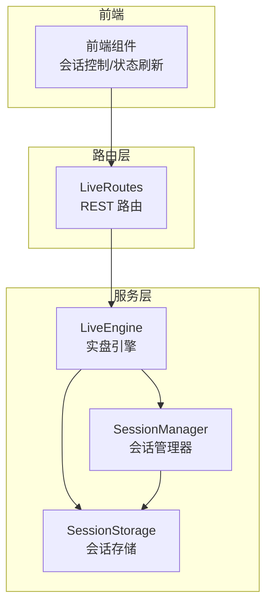
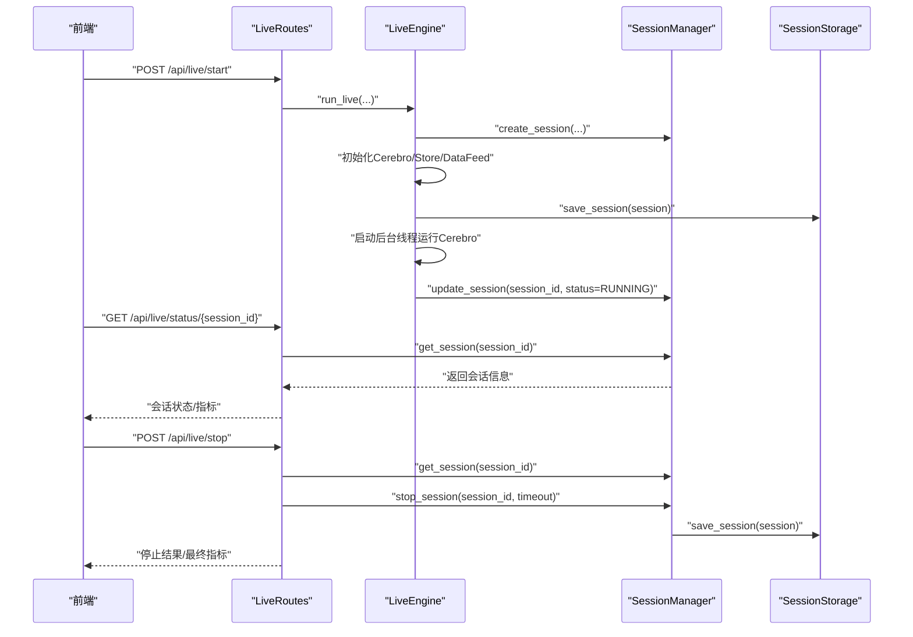
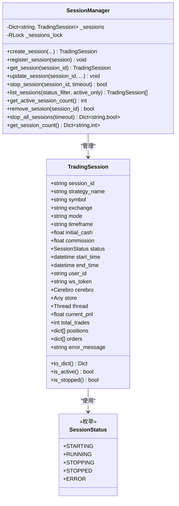
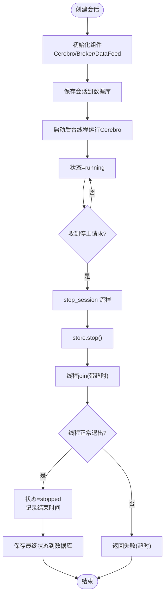
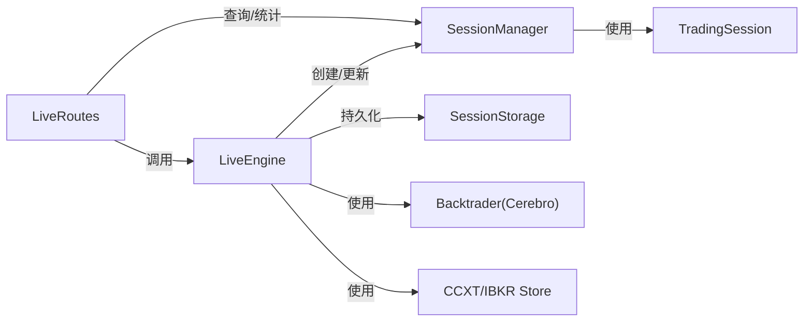

# 实盘会话管理

<cite>
**本文引用的文件列表**
- [session_manager.py](file://backend/src/service/session_manager.py)
- [live_engine.py](file://backend/src/service/live_engine.py)
- [live_routes.py](file://backend/src/routes/live_routes.py)
- [session_storage.py](file://backend/src/db/session_storage.py)
- [test_session_manager.py](file://backend/tests/service/test_session_manager.py)
</cite>

## 目录
1. [引言](#引言)
2. [项目结构](#项目结构)
3. [核心组件](#核心组件)
4. [架构总览](#架构总览)
5. [详细组件分析](#详细组件分析)
6. [依赖关系分析](#依赖关系分析)
7. [性能考量](#性能考量)
8. [故障排查指南](#故障排查指南)
9. [结论](#结论)
10. [附录](#附录)

## 引言
本文件围绕实盘会话管理展开，重点解析 SessionManager 单例类的设计与实现，说明其如何通过线程锁实现并发安全的会话注册、查询、更新与删除；详解 TradingSession 数据类的结构与字段含义；梳理会话生命周期：从 create_session 创建、run_live 启动、到 stop_session 的优雅关闭（含线程 join 与资源释放）；并结合接口使用示例，展示如何通过 get_session_manager() 获取全局实例，调用 list_sessions、get_active_session_count 等方法进行会话监控。最后总结该设计对系统稳定性与并发处理能力的保障。

## 项目结构
本次文档聚焦后端服务中的会话管理模块，涉及以下关键文件：
- backend/src/service/session_manager.py：会话管理器与会话数据类定义
- backend/src/service/live_engine.py：实盘引擎入口，负责创建会话、初始化组件、后台线程运行与状态更新
- backend/src/routes/live_routes.py：对外提供 REST 接口，封装会话启动、停止、查询、统计等
- backend/src/db/session_storage.py：会话持久化层，负责数据库读写与会话状态落盘
- backend/tests/service/test_session_manager.py：会话管理器单元测试，验证并发与行为正确性

图表来源
- [session_manager.py](file://backend/src/service/session_manager.py#L1-L419)
- [live_engine.py](file://backend/src/service/live_engine.py#L1-L338)
- [live_routes.py](file://backend/src/routes/live_routes.py#L1-L430)
- [session_storage.py](file://backend/src/db/session_storage.py#L1-L392)

章节来源
- [session_manager.py](file://backend/src/service/session_manager.py#L1-L419)
- [live_engine.py](file://backend/src/service/live_engine.py#L1-L338)
- [live_routes.py](file://backend/src/routes/live_routes.py#L1-L430)
- [session_storage.py](file://backend/src/db/session_storage.py#L1-L392)

## 核心组件
- SessionStatus 枚举：定义会话状态（starting、running、stopping、stopped、error），用于统一状态表达与过滤。
- TradingSession 数据类：承载会话配置、运行时对象（cerebro、store、thread）、跟踪指标（PnL、订单、持仓、错误信息）以及序列化输出方法 to_dict()。
- SessionManager 单例类：提供会话创建、注册、查询、更新、删除、停止、统计等能力，内部以 RLock 保证并发安全。
- LiveEngine：在 run_live 中完成策略加载、组件初始化、后台线程执行与状态更新；stop_live 调用 SessionManager 停止会话。
- LiveRoutes：对外暴露 REST 接口，调用 LiveEngine 与 SessionManager 提供会话管理能力。
- SessionStorage：数据库持久化层，负责会话的保存、加载、列表与计数。

章节来源
- [session_manager.py](file://backend/src/service/session_manager.py#L20-L120)
- [session_manager.py](file://backend/src/service/session_manager.py#L120-L419)
- [live_engine.py](file://backend/src/service/live_engine.py#L105-L338)
- [live_routes.py](file://backend/src/routes/live_routes.py#L100-L430)
- [session_storage.py](file://backend/src/db/session_storage.py#L1-L392)

## 架构总览
下图展示了从路由到引擎再到会话管理与存储的整体交互流程。

图表来源
- [live_routes.py](file://backend/src/routes/live_routes.py#L100-L261)
- [live_engine.py](file://backend/src/service/live_engine.py#L105-L314)
- [session_manager.py](file://backend/src/service/session_manager.py#L139-L305)
- [session_storage.py](file://backend/src/db/session_storage.py#L59-L123)

## 详细组件分析

### SessionManager 单例类与线程安全
- 单例模式：通过类变量与双重检查锁定确保全局唯一实例，避免多处重复初始化带来的状态不一致。
- 并发控制：使用 RLock 对会话字典进行加锁，所有读写操作均在锁内执行，保证多线程场景下的数据一致性。
- 关键方法：
  - create_session/register_session：创建或注册会话，防止重复 ID。
  - get_session/update_session：按 ID 查询与更新属性，忽略未知字段。
  - stop_session：设置状态为 stopping，调用 store.stop()，等待线程 join（带超时），成功后更新状态为 stopped 并记录结束时间；异常时置为 error 并记录错误信息。
  - list_sessions/get_active_session_count/remove_session/stop_all_sessions/get_session_count：提供会话列表、活跃数量、移除、批量停止与按状态计数等管理能力。
- 全局访问：get_session_manager() 返回全局实例，便于各模块共享同一会话视图。

图表来源
- [session_manager.py](file://backend/src/service/session_manager.py#L20-L120)
- [session_manager.py](file://backend/src/service/session_manager.py#L120-L419)

章节来源
- [session_manager.py](file://backend/src/service/session_manager.py#L120-L419)

### TradingSession 数据类结构与字段
- 配置字段：会话标识、策略名、交易对、交易所、模式（paper/live）、时间框架、初始资金、手续费。
- 状态字段：状态、开始/结束时间、用户标识、WebSocket 认证令牌。
- 运行时对象：cerebro（Backtrader 引擎实例）、store（适配器存储，如 CCXTStore）、thread（后台执行线程）。
- 跟踪指标：当前 PnL、总交易数、持仓列表、订单列表、错误信息。
- 序列化：to_dict() 输出 API 友好的可序列化结构，包含状态、时间、指标、订单等。
- 活跃判断：is_active()/is_stopped() 用于快速判断会话是否处于运行或已停止状态。

章节来源
- [session_manager.py](file://backend/src/service/session_manager.py#L29-L120)

### 会话生命周期管理流程
- 创建：LiveEngine 在 run_live 中调用 SessionManager.create_session 创建会话，填充配置与默认状态。
- 启动：LiveEngine 初始化 Cerebro、Broker、DataFeed 与 Analyzer，将运行时对象注入会话，保存至数据库，然后在后台线程中运行 cerebro.run()，期间将状态更新为 running。
- 运行：后台线程持续执行策略逻辑，实时更新会话的 PnL、订单与持仓等指标。
- 停止：LiveRoutes 或外部调用 stop_live，通过 SessionManager.stop_session 执行优雅关闭：
  - 设置状态为 stopping；
  - 调用 store.stop() 关闭连接；
  - 等待线程 join（带超时），若超时则返回失败；
  - 成功后更新状态为 stopped 并记录结束时间；
  - 异常时置为 error 并记录错误信息；
  - 最终保存会话状态到数据库。
- 移除：remove_session 仅从管理器中移除跟踪，不强制停止，若移除活跃会话会给出警告提示。

图表来源
- [live_engine.py](file://backend/src/service/live_engine.py#L105-L314)
- [session_manager.py](file://backend/src/service/session_manager.py#L247-L305)
- [session_storage.py](file://backend/src/db/session_storage.py#L59-L123)

章节来源
- [live_engine.py](file://backend/src/service/live_engine.py#L105-L314)
- [session_manager.py](file://backend/src/service/session_manager.py#L247-L305)
- [session_storage.py](file://backend/src/db/session_storage.py#L59-L123)

### 通过 get_session_manager() 进行会话监控
- 全局实例：get_session_manager() 返回全局 SessionManager 实例，便于跨模块共享。
- 列表与统计：
  - list_sessions(status_filter=None, active_only=False)：支持按状态过滤或仅返回活跃会话。
  - get_active_session_count()：快速获取活跃会话数量。
  - get_session_count()：按状态统计会话数量与总数、活跃数。
- 路由集成：LiveRoutes 在 /live/sessions、/live/health 等接口中直接调用上述方法，实现会话列表与健康检查。

章节来源
- [session_manager.py](file://backend/src/service/session_manager.py#L302-L405)
- [live_routes.py](file://backend/src/routes/live_routes.py#L295-L429)

## 依赖关系分析
- SessionManager 依赖：
  - threading.RLock：保护会话字典的并发访问。
  - dataclasses.dataclass：简化会话数据结构定义。
  - datetime：记录起止时间。
  - backtrader.Cerebro：运行策略。
- LiveEngine 依赖：
  - CCXT/IBKR 适配器：构建 store、broker、data_feed。
  - SessionManager：创建与更新会话状态。
  - SessionStorage：保存会话状态到数据库。
- LiveRoutes 依赖：
  - LiveEngine：启动/停止会话。
  - SessionManager：查询与统计会话。
- SessionStorage 依赖：
  - SQLAlchemy：数据库访问与模型映射。

图表来源
- [session_manager.py](file://backend/src/service/session_manager.py#L120-L419)
- [live_engine.py](file://backend/src/service/live_engine.py#L1-L338)
- [live_routes.py](file://backend/src/routes/live_routes.py#L1-L430)
- [session_storage.py](file://backend/src/db/session_storage.py#L1-L392)

章节来源
- [session_manager.py](file://backend/src/service/session_manager.py#L120-L419)
- [live_engine.py](file://backend/src/service/live_engine.py#L1-L338)
- [live_routes.py](file://backend/src/routes/live_routes.py#L1-L430)
- [session_storage.py](file://backend/src/db/session_storage.py#L1-L392)

## 性能考量
- 线程安全与锁粒度：SessionManager 使用 RLock 包裹所有会话操作，避免竞态条件；但频繁的锁竞争可能影响高并发场景下的吞吐。建议：
  - 将热点路径（如只读查询）尽量缩短持锁时间；
  - 对于高频更新（如订单、PnL）可在业务侧做缓冲合并后再写入。
- 后台线程 join 超时：stop_session 的 join 超时参数可避免阻塞导致的资源泄漏；建议根据实际运行时长合理设置超时值。
- 数据库持久化：save_session 采用独立事务提交，异常回滚；建议在批量操作时考虑批量提交以降低 I/O 压力。
- 并发测试：单元测试覆盖了重复创建、更新未知字段、缺失会话停止、超时返回等边界情况，有助于发现潜在并发问题。

章节来源
- [session_manager.py](file://backend/src/service/session_manager.py#L247-L305)
- [test_session_manager.py](file://backend/tests/service/test_session_manager.py#L1-L83)

## 故障排查指南
- 会话无法停止：
  - 检查线程是否仍在运行且未响应 join（超时返回 False）。
  - 查看 store.stop() 是否被调用，确认底层适配器连接已关闭。
  - 观察日志中 error 状态与错误信息，定位异常原因。
- 重复创建会话：
  - create_session 会在 ID 已存在时抛出异常；请确保 session_id 唯一或允许自动生成。
- 更新字段无效：
  - update_session 仅更新已存在的字段，未知字段会被忽略；请核对字段名。
- 移除活跃会话：
  - remove_session 不会自动停止会话，若直接移除活跃会话可能导致资源泄漏；应先调用 stop_session 再移除。
- 接口返回异常：
  - LiveRoutes 对异常进行捕获并返回标准 HTTP 错误码；检查日志定位具体原因。

章节来源
- [session_manager.py](file://backend/src/service/session_manager.py#L139-L305)
- [test_session_manager.py](file://backend/tests/service/test_session_manager.py#L1-L83)
- [live_routes.py](file://backend/src/routes/live_routes.py#L191-L261)

## 结论
SessionManager 通过单例与 RLock 实现了对多会话的线程安全管理；TradingSession 数据类清晰地封装了会话配置、运行时对象与跟踪指标；LiveEngine 与 LiveRoutes 将会话生命周期与 REST 接口紧密耦合，配合 SessionStorage 完成状态持久化。整体设计在并发与稳定性方面具备良好基础，适合在高负载场景下扩展与演进。

## 附录
- 示例调用路径（以路径代替代码片段）：
  - 获取全局实例：[get_session_manager](file://backend/src/service/session_manager.py#L411-L419)
  - 列出会话：[list_sessions](file://backend/src/service/session_manager.py#L302-L326)
  - 获取活跃会话数：[get_active_session_count](file://backend/src/service/session_manager.py#L327-L331)
  - 创建会话：[create_session](file://backend/src/service/session_manager.py#L139-L196)
  - 启动会话（后台线程）：[run_live](file://backend/src/service/live_engine.py#L105-L269)
  - 停止会话：[stop_session](file://backend/src/service/session_manager.py#L247-L305)
  - 停止会话（路由）：[stop_live_trading](file://backend/src/routes/live_routes.py#L191-L261)
  - 保存会话到数据库：[save_session](file://backend/src/db/session_storage.py#L59-L123)