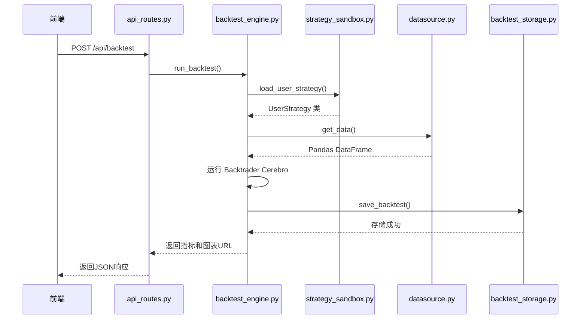
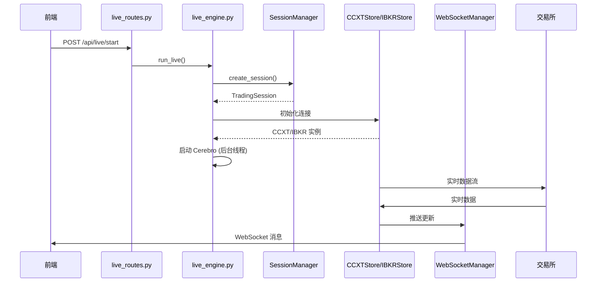
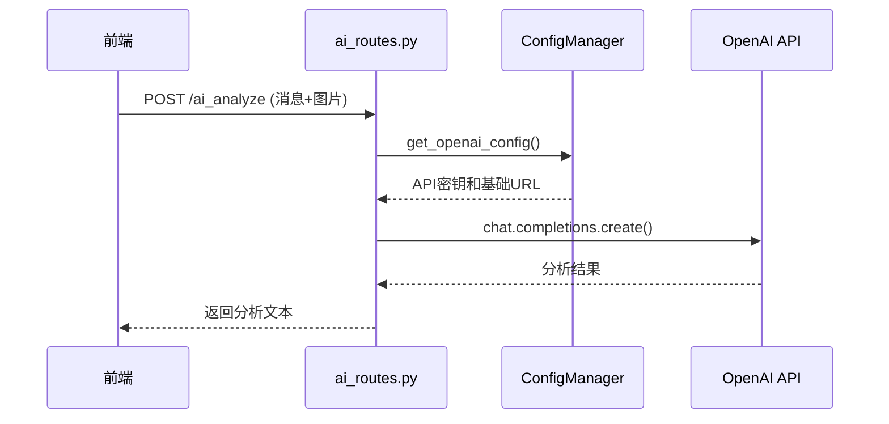

# 数据流与架构设计

<cite>
**本文档引用的文件**   
- [README.md](file://README.md)
- [main.py](file://backend/main.py)
- [api.py](file://backend/api.py)
- [api_routes.py](file://backend/src/routes/api_routes.py)
- [backtest_engine.py](file://backend/src/service/backtest_engine.py)
- [strategy_sandbox.py](file://backend/src/service/strategy_sandbox.py)
- [datasource.py](file://backend/src/db/datasource.py)
- [live_routes.py](file://backend/src/routes/live_routes.py)
- [live_engine.py](file://backend/src/service/live_engine.py)
- [session_manager.py](file://backend/src/service/session_manager.py)
- [websocket_manager.py](file://backend/src/service/websocket_manager.py)
- [ccxt_store.py](file://backend/src/brokers/ccxt_adapter/ccxt_store.py)
- [ibkr_store.py](file://backend/src/brokers/ibkr_adapter/ibkr_store.py)
- [ai_routes.py](file://backend/src/routes/ai_routes.py)
</cite>

## 目录
1. [回测流程](#回测流程)
2. [实盘交易流程](#实盘交易流程)
3. [AI分析流程](#ai分析流程)
4. [关键设计模式](#关键设计模式)

## 回测流程

回测流程始于前端用户发起请求，通过 `api_routes.py` 中的 `/api/backtest` 接口，调用 `backtest_engine.py` 模块执行回测。该引擎首先通过 `strategy_sandbox.py` 安全地加载和执行用户提供的策略代码，然后通过 `datasource.py` 获取所需的历史市场数据。数据获取后，回测引擎使用 Backtrader 的 Cerebro 框架运行策略，生成性能指标和图表。最终，回测结果被存储到数据库中，并将指标和图表的 URL 返回给前端。

**Diagram sources**
- [api_routes.py](file://backend/src/routes/api_routes.py#L215-L285)
- [backtest_engine.py](file://backend/src/service/backtest_engine.py#L302-L383)
- [strategy_sandbox.py](file://backend/src/service/strategy_sandbox.py#L179-L209)
- [datasource.py](file://backend/src/db/datasource.py#L203-L224)

**Section sources**
- [api_routes.py](file://backend/src/routes/api_routes.py#L215-L285)
- [backtest_engine.py](file://backend/src/service/backtest_engine.py#L302-L383)

## 实盘交易流程

实盘交易流程由 `live_routes.py` 中的 `/api/live/start` 接口启动。该请求调用 `live_engine.py` 模块，该模块通过 `SessionManager` 创建一个新的交易会话。`SessionManager` 作为单例管理所有会话的生命周期。随后，`live_engine.py` 根据配置加载相应的 `CCXTStore` 或 `IBKRStore` 适配器，建立与交易所的连接。Cerebro 引擎在后台线程中启动，开始实时交易。`WebSocketManager` 负责将交易状态、订单和持仓等实时数据推送到前端。

**Diagram sources**
- [live_routes.py](file://backend/src/routes/live_routes.py#L102-L176)
- [live_engine.py](file://backend/src/service/live_engine.py#L105-L268)
- [session_manager.py](file://backend/src/service/session_manager.py#L139-L195)
- [ccxt_store.py](file://backend/src/brokers/ccxt_adapter/ccxt_store.py#L60-L92)
- [ibkr_store.py](file://backend/src/brokers/ibkr_adapter/ibkr_store.py#L84-L105)
- [websocket_manager.py](file://backend/src/service/websocket_manager.py#L45-L73)

**Section sources**
- [live_routes.py](file://backend/src/routes/live_routes.py#L102-L176)
- [live_engine.py](file://backend/src/service/live_engine.py#L105-L268)

## AI分析流程

AI分析流程由前端触发，通过 `ai_routes.py` 中的 `/ai_analyze` 接口。该接口接收用户输入的文本消息和可选的图表图片，然后使用 `AsyncOpenAI` 客户端调用 OpenAI API。在调用之前，系统会通过 `ConfigManager` 获取用户的 API 密钥和代理配置。OpenAI 模型处理请求后，返回分析结果，该结果再被发送回前端。

**Diagram sources**
- [ai_routes.py](file://backend/src/routes/ai_routes.py#L17-L88)
- [config_manager.py](file://backend/src/config/config_manager.py)

**Section sources**
- [ai_routes.py](file://backend/src/routes/ai_routes.py#L17-L88)

## 关键设计模式

本系统采用了多种关键设计模式来确保其安全性、可维护性和可扩展性。

**单例模式**：`SessionManager` 和 `WebSocketManager` 都实现了单例模式。`SessionManager` 通过其 `__new__` 方法和类级锁确保全局只有一个实例，从而集中管理所有交易会话的状态。`WebSocketManager` 也通过全局实例 `_ws_manager` 和 `get_websocket_manager()` 函数实现单例，统一处理所有 WebSocket 连接。

**适配器模式**：系统通过 `CCXTStore` 和 `IBKRStore` 适配器统一了与不同交易所（如 Binance、OKX、Interactive Brokers）的交互接口。`live_engine.py` 无需关心底层交易所的具体实现，只需通过适配器提供的标准接口（如 `get_broker` 和 `get_data`）进行操作，极大地提高了系统的灵活性和可扩展性。

**沙箱模式**：为了安全执行用户上传的策略代码，系统实现了两层沙箱。`strategy_sandbox.py` 提供了一个“软沙箱”，通过限制导入模块和内置函数来降低风险。更安全的是 `isolated_sandbox.py`，它在独立的子进程中执行代码，施加内存和超时限制，有效防止恶意代码对主系统造成损害。

**观察者模式**：`WebSocketManager` 是观察者模式的典型应用。`live_engine.py` 中的 Cerebro 引擎作为被观察者，当发生订单、持仓或 P&L 变化时，会通知 `WebSocketManager`。`WebSocketManager` 作为观察者，负责将这些事件广播给所有连接的前端客户端，实现了实时数据推送。

这些设计模式共同提升了系统的整体质量。单例模式保证了核心服务的全局唯一性，避免了状态混乱；适配器模式解耦了业务逻辑与外部服务，使系统易于维护和扩展；沙箱模式是安全性的基石，保护系统免受不可信代码的攻击；观察者模式则实现了高效的实时通信，提升了用户体验。

**Section sources**
- [session_manager.py](file://backend/src/service/session_manager.py#L120-L130)
- [websocket_manager.py](file://backend/src/service/websocket_manager.py#L389-L392)
- [ccxt_store.py](file://backend/src/brokers/ccxt_adapter/ccxt_store.py)
- [ibkr_store.py](file://backend/src/brokers/ibkr_adapter/ibkr_store.py)
- [strategy_sandbox.py](file://backend/src/service/strategy_sandbox.py)
- [isolated_sandbox.py](file://backend/src/service/isolated_sandbox.py)