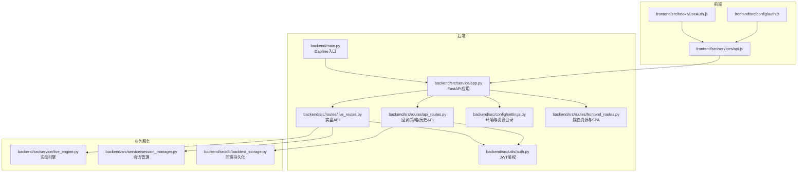
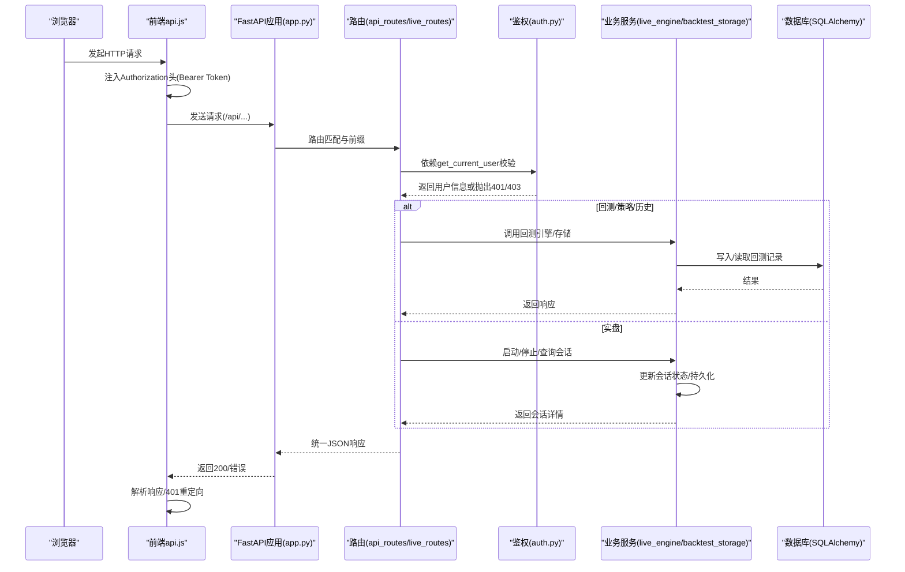
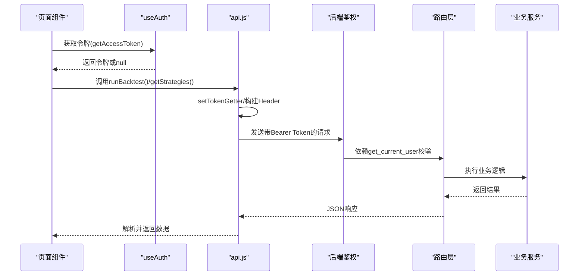
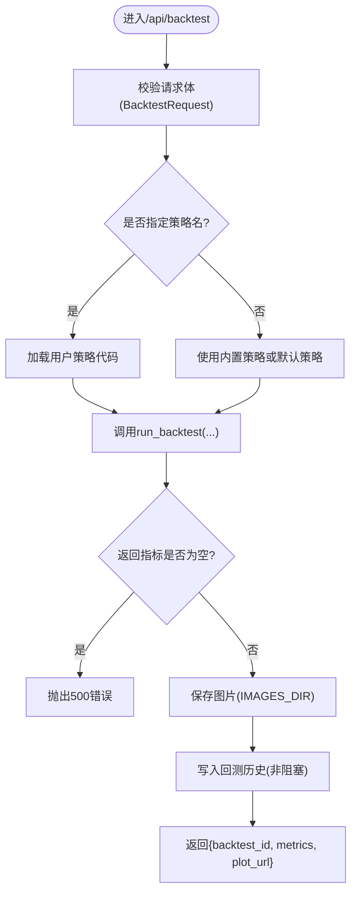
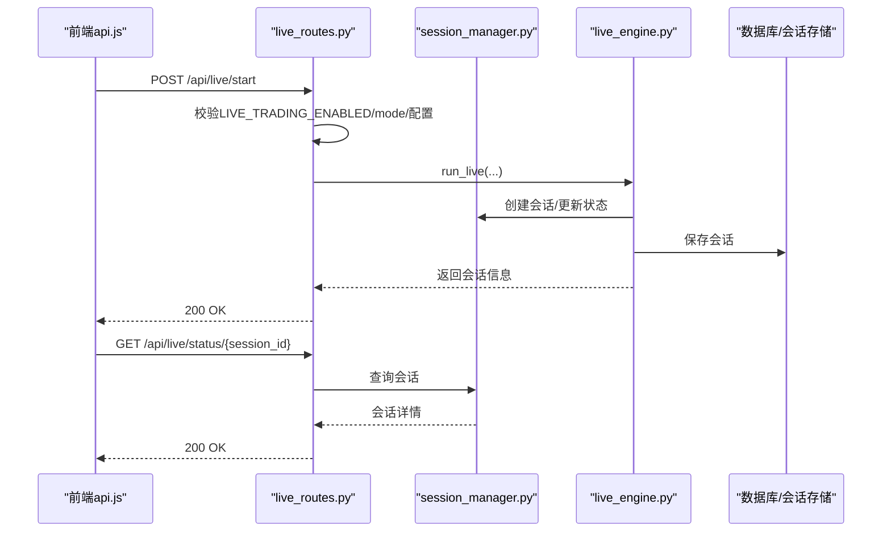
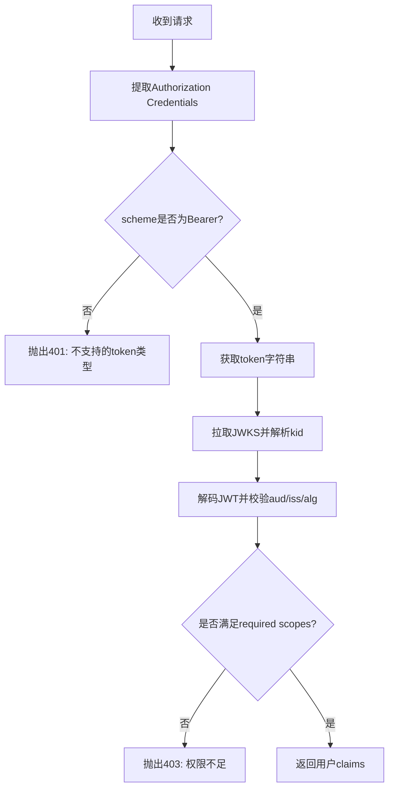
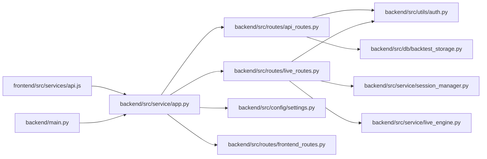

# RESTful API调用流程

<cite>
**本文引用的文件**
- [backend/src/service/app.py](file://backend/src/service/app.py)
- [backend/api.py](file://backend/api.py)
- [backend/main.py](file://backend/main.py)
- [backend/src/routes/api_routes.py](file://backend/src/routes/api_routes.py)
- [backend/src/routes/live_routes.py](file://backend/src/routes/live_routes.py)
- [backend/src/utils/auth.py](file://backend/src/utils/auth.py)
- [backend/src/service/live_engine.py](file://backend/src/service/live_engine.py)
- [backend/src/service/session_manager.py](file://backend/src/service/session_manager.py)
- [backend/src/db/backtest_storage.py](file://backend/src/db/backtest_storage.py)
- [backend/src/config/settings.py](file://backend/src/config/settings.py)
- [backend/src/routes/frontend_routes.py](file://backend/src/routes/frontend_routes.py)
- [frontend/src/services/api.js](file://frontend/src/services/api.js)
- [frontend/src/config/auth.js](file://frontend/src/config/auth.js)
- [frontend/src/hooks/useAuth.js](file://frontend/src/hooks/useAuth.js)
</cite>

## 目录
1. [简介](#简介)
2. [项目结构](#项目结构)
3. [核心组件](#核心组件)
4. [架构总览](#架构总览)
5. [详细组件分析](#详细组件分析)
6. [依赖关系分析](#依赖关系分析)
7. [性能考量](#性能考量)
8. [故障排查指南](#故障排查指南)
9. [结论](#结论)
10. [附录](#附录)

## 简介
本文件系统性梳理了该交易系统中RESTful API的调用流程，覆盖从前端通过api.js发起HTTP请求，到后端FastAPI路由层解析与鉴权，再到业务服务（如回测引擎、实盘引擎）执行与持久化的完整链路。重点说明：
- 认证机制：基于Bearer Token的JWT校验，支持可选登录模式
- 请求参数验证：Pydantic模型驱动的输入校验
- 错误处理与响应格式：统一的HTTP状态码与错误载荷
- 调试工具与方法：前端解析器、后端日志与健康检查
- 性能优化建议：缓存JWKS、异步处理、数据库索引与分页

## 项目结构
后端采用FastAPI应用，按功能模块拆分为路由层、服务层、数据层与配置层；前端通过独立的api.js封装HTTP请求与鉴权头注入。

图表来源
- [backend/src/service/app.py](file://backend/src/service/app.py#L1-L31)
- [backend/main.py](file://backend/main.py#L1-L21)
- [backend/src/routes/api_routes.py](file://backend/src/routes/api_routes.py#L1-L341)
- [backend/src/routes/live_routes.py](file://backend/src/routes/live_routes.py#L1-L423)
- [backend/src/utils/auth.py](file://backend/src/utils/auth.py#L1-L191)
- [backend/src/service/live_engine.py](file://backend/src/service/live_engine.py#L1-L329)
- [backend/src/service/session_manager.py](file://backend/src/service/session_manager.py#L1-L410)
- [backend/src/db/backtest_storage.py](file://backend/src/db/backtest_storage.py#L1-L444)
- [backend/src/config/settings.py](file://backend/src/config/settings.py#L1-L81)
- [backend/src/routes/frontend_routes.py](file://backend/src/routes/frontend_routes.py#L1-L34)
- [frontend/src/services/api.js](file://frontend/src/services/api.js#L1-L255)
- [frontend/src/config/auth.js](file://frontend/src/config/auth.js#L1-L4)
- [frontend/src/hooks/useAuth.js](file://frontend/src/hooks/useAuth.js#L1-L30)

章节来源
- [backend/src/service/app.py](file://backend/src/service/app.py#L1-L31)
- [backend/main.py](file://backend/main.py#L1-L21)
- [frontend/src/services/api.js](file://frontend/src/services/api.js#L1-L255)

## 核心组件
- 前端HTTP封装与鉴权
  - api.js负责构建请求、注入Authorization头、解析响应与错误处理
  - useAuth.js与auth.js配合控制登录开关与令牌获取
- 后端FastAPI应用与路由
  - app.py注册CORS、挂载各路由前缀、挂载前端静态资源
  - api_routes.py提供回测、策略、历史等API
  - live_routes.py提供实盘启动/停止/查询等API
- 鉴权与配置
  - auth.py实现Bearer Token校验、JWKS拉取与缓存、Scope校验
  - settings.py加载环境变量与资源目录
- 业务服务
  - live_engine.py编排实盘引擎（Cerebro、CCXT/IBKR）
  - session_manager.py集中管理会话生命周期
  - backtest_storage.py提供回测结果的持久化与查询

章节来源
- [frontend/src/services/api.js](file://frontend/src/services/api.js#L1-L255)
- [frontend/src/hooks/useAuth.js](file://frontend/src/hooks/useAuth.js#L1-L30)
- [frontend/src/config/auth.js](file://frontend/src/config/auth.js#L1-L4)
- [backend/src/service/app.py](file://backend/src/service/app.py#L1-L31)
- [backend/src/routes/api_routes.py](file://backend/src/routes/api_routes.py#L1-L341)
- [backend/src/routes/live_routes.py](file://backend/src/routes/live_routes.py#L1-L423)
- [backend/src/utils/auth.py](file://backend/src/utils/auth.py#L1-L191)
- [backend/src/config/settings.py](file://backend/src/config/settings.py#L1-L81)
- [backend/src/service/live_engine.py](file://backend/src/service/live_engine.py#L1-L329)
- [backend/src/service/session_manager.py](file://backend/src/service/session_manager.py#L1-L410)
- [backend/src/db/backtest_storage.py](file://backend/src/db/backtest_storage.py#L1-L444)

## 架构总览
下图展示从浏览器到后端服务的整体调用路径，包括鉴权、路由、业务执行与持久化。

图表来源
- [backend/src/service/app.py](file://backend/src/service/app.py#L1-L31)
- [backend/src/routes/api_routes.py](file://backend/src/routes/api_routes.py#L1-L341)
- [backend/src/routes/live_routes.py](file://backend/src/routes/live_routes.py#L1-L423)
- [backend/src/utils/auth.py](file://backend/src/utils/auth.py#L1-L191)
- [backend/src/service/live_engine.py](file://backend/src/service/live_engine.py#L1-L329)
- [backend/src/db/backtest_storage.py](file://backend/src/db/backtest_storage.py#L1-L444)
- [frontend/src/services/api.js](file://frontend/src/services/api.js#L1-L255)

## 详细组件分析

### 前端API封装与调用流程
- 请求构建
  - 自动设置Content-Type为application/json
  - 可选注入Authorization: Bearer <token>，token来自useAuth钩子
- 响应解析
  - 非200时抛出错误，若为401且启用登录则跳转至登录页
  - 成功时返回JSON数据
- 典型API方法
  - 回测：/api/backtest、/api/data、/api/strategy、/api/analyze
  - 历史：/api/backtest/history、/api/backtest/history/{id}、/api/backtest/history/{id}/ai-analysis
  - 实盘：/api/live/start、/api/live/stop、/api/live/status/{id}、/api/live/sessions、/api/live/orders/{id}、/api/live/exchanges、/api/live/health

图表来源
- [frontend/src/services/api.js](file://frontend/src/services/api.js#L1-L255)
- [frontend/src/hooks/useAuth.js](file://frontend/src/hooks/useAuth.js#L1-L30)
- [frontend/src/config/auth.js](file://frontend/src/config/auth.js#L1-L4)
- [backend/src/utils/auth.py](file://backend/src/utils/auth.py#L1-L191)
- [backend/src/routes/api_routes.py](file://backend/src/routes/api_routes.py#L1-L341)
- [backend/src/routes/live_routes.py](file://backend/src/routes/live_routes.py#L1-L423)

章节来源
- [frontend/src/services/api.js](file://frontend/src/services/api.js#L1-L255)
- [frontend/src/hooks/useAuth.js](file://frontend/src/hooks/useAuth.js#L1-L30)
- [frontend/src/config/auth.js](file://frontend/src/config/auth.js#L1-L4)

### 后端路由与业务服务

#### 回测API（/api）
- 路由定义与依赖
  - 使用Depends(get_current_user)进行鉴权
  - Pydantic模型用于请求体校验（BacktestRequest、DataRequest、StrategyCode、BacktestHistoryQuery等）
- 主要接口
  - GET /api/strategies：列出策略名称
  - POST /api/data：获取行情数据
  - POST /api/backtest：运行回测，保存图片与历史记录
  - GET /api/strategy：获取策略代码
  - POST /api/strategy：保存策略代码
  - POST /api/analyze：基于指标生成分析文本
  - POST /api/backtest/history：分页查询回测历史
  - GET /api/backtest/history/{id}：按ID获取回测详情
  - DELETE /api/backtest/history/{id}：删除回测记录
  - POST /api/backtest/history/{id}/ai-analysis：更新AI分析

图表来源
- [backend/src/routes/api_routes.py](file://backend/src/routes/api_routes.py#L1-L341)
- [backend/src/db/backtest_storage.py](file://backend/src/db/backtest_storage.py#L1-L444)
- [backend/src/config/settings.py](file://backend/src/config/settings.py#L1-L81)

章节来源
- [backend/src/routes/api_routes.py](file://backend/src/routes/api_routes.py#L1-L341)
- [backend/src/db/backtest_storage.py](file://backend/src/db/backtest_storage.py#L1-L444)
- [backend/src/config/settings.py](file://backend/src/config/settings.py#L1-L81)

#### 实盘API（/api/live）
- 路由定义与依赖
  - 通过Depends(get_current_user)进行鉴权
  - 配置校验：LIVE_TRADING_ENABLED、交易所/时间框架/符号合法性
- 主要接口
  - POST /api/live/start：启动新会话，创建Session并后台运行Cerebro
  - POST /api/live/stop：停止会话，保存最终状态
  - GET /api/live/status/{session_id}：获取会话状态
  - GET /api/live/sessions：列出会话（支持过滤/排序/限制）
  - GET /api/live/orders/{session_id}：获取订单列表
  - GET /api/live/exchanges：获取可用交易所信息
  - GET /api/live/health：健康检查

图表来源
- [backend/src/routes/live_routes.py](file://backend/src/routes/live_routes.py#L1-L423)
- [backend/src/service/live_engine.py](file://backend/src/service/live_engine.py#L1-L329)
- [backend/src/service/session_manager.py](file://backend/src/service/session_manager.py#L1-L410)

章节来源
- [backend/src/routes/live_routes.py](file://backend/src/routes/live_routes.py#L1-L423)
- [backend/src/service/live_engine.py](file://backend/src/service/live_engine.py#L1-L329)
- [backend/src/service/session_manager.py](file://backend/src/service/session_manager.py#L1-L410)

### 认证机制与请求参数验证

#### 认证机制
- Bearer Token校验
  - 提取Authorization头，校验scheme为Bearer
  - 从LOGTO_JWKS_URI拉取JWKS并缓存，解析kid匹配签名密钥
  - 使用python-jose解码JWT，校验audience/issuer与过期时间
  - 支持可选登录模式：当ENABLE_LOGIN=false时允许匿名访问
- Scope校验
  - 若配置了LOGTO_REQUIRED_SCOPES，则要求token包含对应scope
- 依赖注入
  - get_current_user作为FastAPI依赖，自动在路由上生效
  - get_optional_user用于可选鉴权场景

图表来源
- [backend/src/utils/auth.py](file://backend/src/utils/auth.py#L1-L191)
- [backend/src/config/settings.py](file://backend/src/config/settings.py#L1-L81)

章节来源
- [backend/src/utils/auth.py](file://backend/src/utils/auth.py#L1-L191)
- [backend/src/config/settings.py](file://backend/src/config/settings.py#L1-L81)
- [frontend/src/config/auth.js](file://frontend/src/config/auth.js#L1-L4)
- [frontend/src/hooks/useAuth.js](file://frontend/src/hooks/useAuth.js#L1-L30)

#### 请求参数验证
- Pydantic模型
  - 回测：BacktestRequest（ticker、start_date、end_date、initial_cash、commission、stake、strategy_name）
  - 数据：DataRequest（ticker、start_date、end_date）
  - 策略：StrategyCode（name、code）
  - 历史查询：BacktestHistoryQuery（ticker、strategy_name、start_date、end_date、sort_by、sort_order、limit、offset）
  - 实盘：StartLiveRequest（strategy_name、symbol、exchange、mode、timeframe、initial_cash、commission）、StopLiveRequest（session_id）
- 路由层自动校验并返回422错误

章节来源
- [backend/src/routes/api_routes.py](file://backend/src/routes/api_routes.py#L1-L341)
- [backend/src/routes/live_routes.py](file://backend/src/routes/live_routes.py#L1-L423)

### 错误处理与响应格式
- 统一错误响应
  - 非200状态：parseResponse抛出错误，前端根据状态码处理
  - 401：若启用登录则重定向至登录页
  - 403：权限不足（Scope不足或未启用实盘）
  - 404：资源不存在（策略、会话、回测记录）
  - 500：服务器内部错误
- 路由层异常转换
  - StrategyLoadError/DataLoadError映射为400/502
  - 其他异常捕获并返回500
- 响应格式
  - 成功：JSON对象，字段由各路由定义
  - 失败：包含错误码与消息的JSON对象

章节来源
- [frontend/src/services/api.js](file://frontend/src/services/api.js#L1-L255)
- [backend/src/routes/api_routes.py](file://backend/src/routes/api_routes.py#L1-L341)
- [backend/src/routes/live_routes.py](file://backend/src/routes/live_routes.py#L1-L423)

## 依赖关系分析

图表来源
- [frontend/src/services/api.js](file://frontend/src/services/api.js#L1-L255)
- [backend/src/service/app.py](file://backend/src/service/app.py#L1-L31)
- [backend/src/routes/api_routes.py](file://backend/src/routes/api_routes.py#L1-L341)
- [backend/src/routes/live_routes.py](file://backend/src/routes/live_routes.py#L1-L423)
- [backend/src/utils/auth.py](file://backend/src/utils/auth.py#L1-L191)
- [backend/src/db/backtest_storage.py](file://backend/src/db/backtest_storage.py#L1-L444)
- [backend/src/service/session_manager.py](file://backend/src/service/session_manager.py#L1-L410)
- [backend/src/service/live_engine.py](file://backend/src/service/live_engine.py#L1-L329)
- [backend/src/config/settings.py](file://backend/src/config/settings.py#L1-L81)
- [backend/src/routes/frontend_routes.py](file://backend/src/routes/frontend_routes.py#L1-L34)
- [backend/main.py](file://backend/main.py#L1-L21)

章节来源
- [backend/src/service/app.py](file://backend/src/service/app.py#L1-L31)
- [backend/src/routes/api_routes.py](file://backend/src/routes/api_routes.py#L1-L341)
- [backend/src/routes/live_routes.py](file://backend/src/routes/live_routes.py#L1-L423)
- [backend/src/utils/auth.py](file://backend/src/utils/auth.py#L1-L191)
- [backend/src/db/backtest_storage.py](file://backend/src/db/backtest_storage.py#L1-L444)
- [backend/src/service/session_manager.py](file://backend/src/service/session_manager.py#L1-L410)
- [backend/src/service/live_engine.py](file://backend/src/service/live_engine.py#L1-L329)
- [backend/src/config/settings.py](file://backend/src/config/settings.py#L1-L81)
- [backend/src/routes/frontend_routes.py](file://backend/src/routes/frontend_routes.py#L1-L34)
- [backend/main.py](file://backend/main.py#L1-L21)

## 性能考量
- 鉴权性能
  - JWKS缓存：auth.py使用LRU缓存避免频繁拉取，失败时自动清缓存重试
  - 建议：合理设置缓存大小与超时，确保网络代理配置正确
- 异步与并发
  - 回测与实盘均可能耗时较长，建议在路由层保持同步以简化错误传播；若需高并发，考虑任务队列与异步执行
- 数据库与I/O
  - 回测历史写入采用非阻塞方式，但需关注磁盘IO与图片文件清理
  - 建议：为回测历史表建立索引（ticker、strategy_name、created_at），优化分页查询
- 资源目录
  - images目录与策略/配置目录需提前创建，避免运行时IO错误

章节来源
- [backend/src/utils/auth.py](file://backend/src/utils/auth.py#L1-L191)
- [backend/src/db/backtest_storage.py](file://backend/src/db/backtest_storage.py#L1-L444)
- [backend/src/config/settings.py](file://backend/src/config/settings.py#L1-L81)

## 故障排查指南
- 前端常见问题
  - 401未授权：确认已登录且令牌有效；检查VITE_API_RESOURCE与登录开关
  - 403禁止访问：确认Scope满足要求或实盘开关已开启
  - 404资源不存在：确认ID或名称正确
- 后端常见问题
  - JWKS拉取失败：检查LOGTO_JWKS_URI、代理配置与网络连通性
  - 会话无法停止：查看会话线程是否存活，必要时增大超时或强制清理
  - 回测历史损坏：storage层会尝试清理损坏记录并重试查询
- 健康检查
  - 实盘健康检查：GET /api/live/health，返回系统状态、活动会话数与配置信息

章节来源
- [frontend/src/services/api.js](file://frontend/src/services/api.js#L1-L255)
- [backend/src/utils/auth.py](file://backend/src/utils/auth.py#L1-L191)
- [backend/src/routes/live_routes.py](file://backend/src/routes/live_routes.py#L1-L423)
- [backend/src/db/backtest_storage.py](file://backend/src/db/backtest_storage.py#L1-L444)

## 结论
该系统通过清晰的前后端职责划分与模块化设计，实现了从策略编写、回测执行、历史管理到实盘交易的全链路REST API。前端以api.js统一封装请求与鉴权，后端以FastAPI路由与Pydantic模型保障请求安全与一致性，业务服务通过会话管理与持久化支撑复杂交易场景。建议在生产环境中进一步完善异步任务、数据库索引与监控告警体系，以提升稳定性与可观测性。

## 附录
- 关键环境变量
  - LOGTO_*：JWT Issuer/JWKS/Audience与Scope
  - ENABLE_LOGIN：是否启用登录
  - LIVE_TRADING_ENABLED：是否允许实盘
  - DATABASE_URL：数据库连接串
  - OPENAI_*：AI分析相关
  - HTTP_PROXY/HTTPS_PROXY：代理配置
- 路由前缀
  - /api：回测/策略/历史/实盘API
  - /images：静态图片资源
  - /assets：静态资源（视构建情况）

章节来源
- [backend/src/config/settings.py](file://backend/src/config/settings.py#L1-L81)
- [backend/src/service/app.py](file://backend/src/service/app.py#L1-L31)
- [backend/src/routes/frontend_routes.py](file://backend/src/routes/frontend_routes.py#L1-L34)