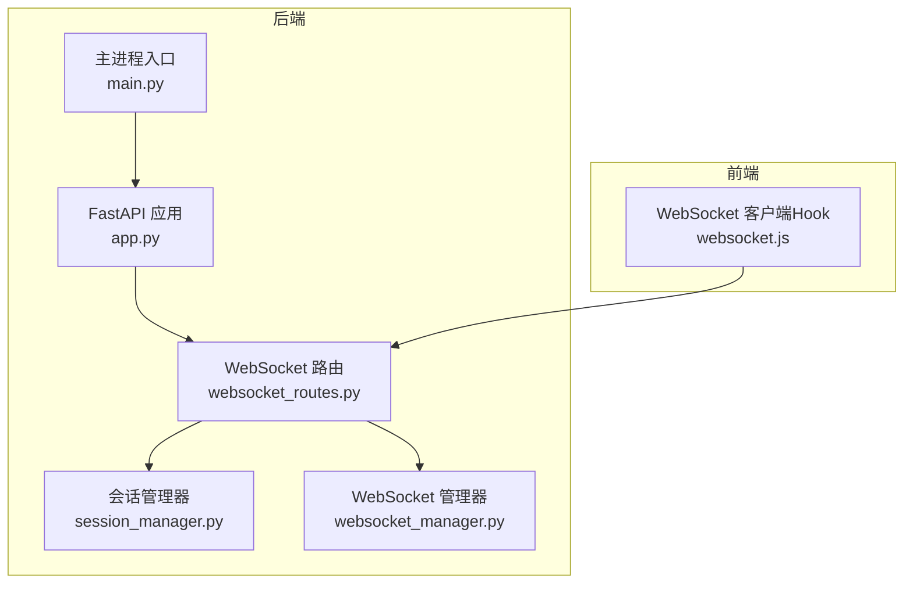
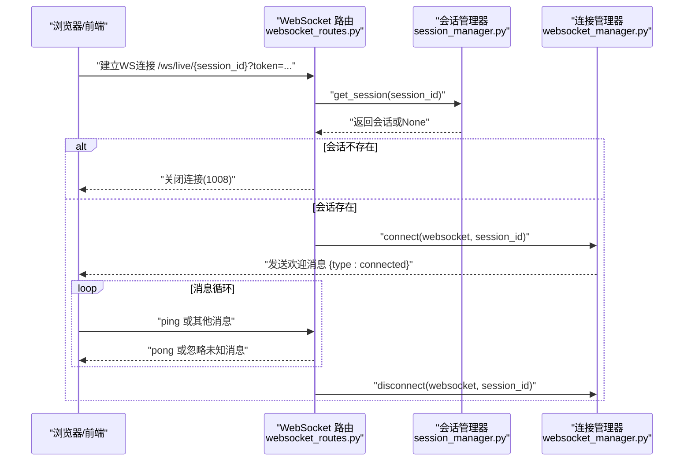
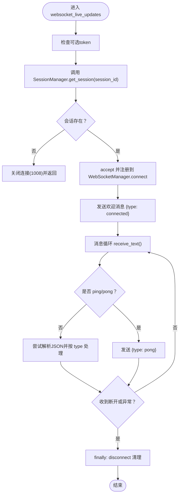
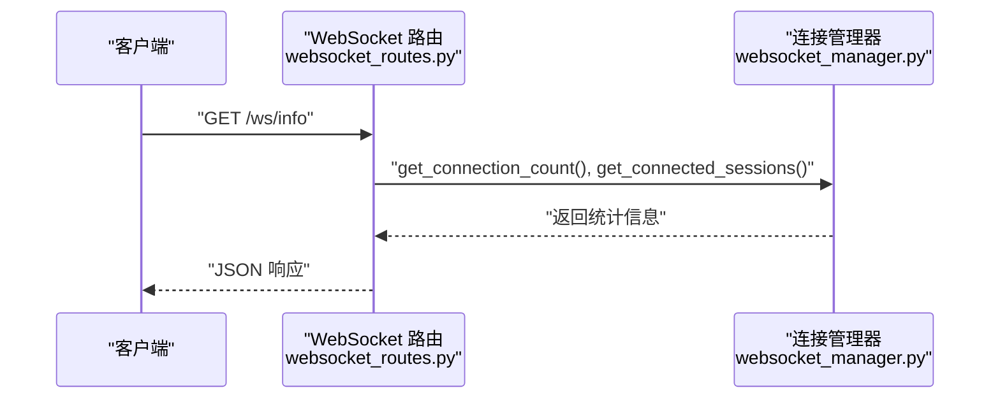
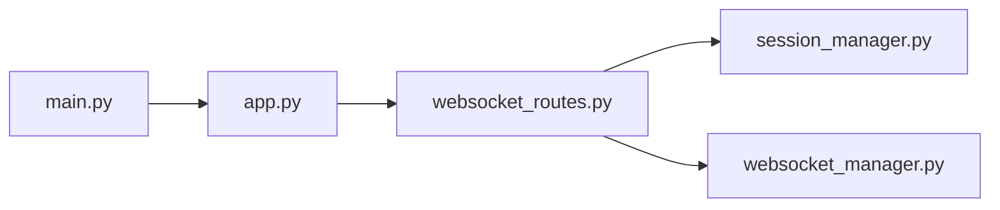

# WebSocket API端点

<cite>
**本文引用的文件**
- [websocket_routes.py](file://backend/src/routes/websocket_routes.py)
- [websocket_manager.py](file://backend/src/service/websocket_manager.py)
- [session_manager.py](file://backend/src/service/session_manager.py)
- [app.py](file://backend/src/service/app.py)
- [main.py](file://backend/main.py)
- [websocket.js](file://frontend/src/services/websocket.js)
- [settings.py](file://backend/src/config/settings.py)
- [auth.py](file://backend/src/utils/auth.py)
</cite>

## 目录
1. [简介](#简介)
2. [项目结构](#项目结构)
3. [核心组件](#核心组件)
4. [架构总览](#架构总览)
5. [详细组件分析](#详细组件分析)
6. [依赖关系分析](#依赖关系分析)
7. [性能考量](#性能考量)
8. [故障排查指南](#故障排查指南)
9. [结论](#结论)
10. [附录](#附录)

## 简介
本文件系统性地文档化了WebSocket API端点，重点覆盖以下内容：
- 路由配置：/ws/live/{session_id} 的参数定义与行为约束
- 异步处理函数 websocket_live_updates() 的工作流：连接验证、消息循环、异常处理
- /ws/info 诊断接口的返回结构与使用场景
- 客户端连接URL构建规则（ws/wss协议选择）、查询参数（token）的用途
- curl命令与JavaScript示例

## 项目结构
WebSocket相关能力由后端FastAPI应用提供，前端通过React Hook消费实时数据。关键模块如下：
- 后端路由层：定义WebSocket端点与诊断接口
- 会话管理：校验session_id有效性
- 连接管理：集中维护每个会话的WebSocket连接池，负责广播与清理
- 应用入口：注册路由并挂载前端静态资源
- 前端Hook：自动心跳、重连、错误处理与消息解析

图表来源
- [app.py](file://backend/src/service/app.py#L1-L31)
- [websocket_routes.py](file://backend/src/routes/websocket_routes.py#L1-L239)
- [session_manager.py](file://backend/src/service/session_manager.py#L1-L410)
- [websocket_manager.py](file://backend/src/service/websocket_manager.py#L1-L401)
- [main.py](file://backend/main.py#L1-L21)
- [websocket.js](file://frontend/src/services/websocket.js#L1-L282)

章节来源
- [app.py](file://backend/src/service/app.py#L1-L31)
- [main.py](file://backend/main.py#L1-L21)

## 核心组件
- WebSocket端点 /ws/live/{session_id}
  - 参数：session_id（路径参数）、token（可选查询参数）
  - 行为：校验会话存在性；接受WebSocket连接；发送欢迎消息；维持心跳；关闭时清理连接
- 诊断接口 /ws/info
  - 返回：endpoint、protocol、active_connections、connected_sessions、message_types、client_messages、description
- 会话管理器 SessionManager
  - 提供 get_session(session_id) 用于校验会话是否存在
- 连接管理器 WebSocketManager
  - 维护每个会话的连接集合；广播消息；清理死连接；统计连接数与会话列表

章节来源
- [websocket_routes.py](file://backend/src/routes/websocket_routes.py#L21-L239)
- [session_manager.py](file://backend/src/service/session_manager.py#L205-L217)
- [websocket_manager.py](file://backend/src/service/websocket_manager.py#L38-L148)

## 架构总览
WebSocket端点在FastAPI中以独立路由注册，不带前缀。应用启动由Daphne服务器承载，监听TCP端口。

图表来源
- [websocket_routes.py](file://backend/src/routes/websocket_routes.py#L152-L214)
- [session_manager.py](file://backend/src/service/session_manager.py#L205-L217)
- [websocket_manager.py](file://backend/src/service/websocket_manager.py#L45-L90)

章节来源
- [app.py](file://backend/src/service/app.py#L25-L30)
- [main.py](file://backend/main.py#L7-L17)

## 详细组件分析

### /ws/live/{session_id} 端点
- 路由定义
  - 方法：WEBSOCKET
  - 路径：/ws/live/{session_id}
  - 查询参数：token（可选）
- 参数与约束
  - session_id：必须存在且被会话管理器识别
  - token：可选；当前实现记录日志但未强制校验
- 连接验证
  - 使用 SessionManager.get_session(session_id) 校验会话存在性
  - 若不存在，立即关闭连接（1008）
- 连接建立
  - 接受WebSocket并注册到 WebSocketManager
  - 立即向客户端发送欢迎消息 {type: connected}
- 消息循环
  - 接收文本消息
  - 支持 ping/pong 心跳（字符串或JSON对象）
  - 其他JSON消息按 type 分发（当前仅记录调试日志）
- 异常处理
  - 捕获 WebSocketDisconnect 正常断开
  - 捕获通用异常并记录
  - finally 中确保清理连接
- 安全策略
  - 当前未实现基于token的鉴权；token存在时仅记录日志
  - 未来版本计划在路由中启用鉴权（TODO标注）

图表来源
- [websocket_routes.py](file://backend/src/routes/websocket_routes.py#L152-L214)

章节来源
- [websocket_routes.py](file://backend/src/routes/websocket_routes.py#L21-L214)
- [session_manager.py](file://backend/src/service/session_manager.py#L205-L217)
- [websocket_manager.py](file://backend/src/service/websocket_manager.py#L45-L90)

### /ws/info 诊断接口
- 路由定义
  - 方法：GET
  - 路径：/ws/info
- 返回字段
  - endpoint：WebSocket端点路径模板
  - protocol：ws 或 wss（根据部署环境判断）
  - active_connections：全局活跃连接数
  - connected_sessions：当前有连接的会话ID列表
  - message_types：服务端支持的消息类型数组
  - client_messages：客户端可发送的消息类型数组
  - description：简要描述
- 使用场景
  - 前端在连接前预检端点可用性
  - 运维监控连接状态与消息类型

图表来源
- [websocket_routes.py](file://backend/src/routes/websocket_routes.py#L216-L239)
- [websocket_manager.py](file://backend/src/service/websocket_manager.py#L364-L387)

章节来源
- [websocket_routes.py](file://backend/src/routes/websocket_routes.py#L216-L239)
- [websocket_manager.py](file://backend/src/service/websocket_manager.py#L364-L387)

### 客户端连接URL构建规则与查询参数
- 协议选择
  - 浏览器运行在 https 时使用 wss
  - 浏览器运行在 http 时使用 ws
- 主机与端口
  - 开发模式：localhost:8000
  - 生产模式：window.location.host
- 路径
  - /ws/live/{session_id}
- 查询参数
  - token：可选；当前后端未强制校验，仅记录日志
- JavaScript示例
  - 前端Hook已内置URL构造逻辑与心跳、重连、错误处理
  - 参考路径：frontend/src/services/websocket.js
- curl示例
  - 由于WebSocket是二进制协议，curl对文本帧支持有限；建议使用浏览器或专用工具进行测试
  - 可参考前端URL构造逻辑自行拼接

章节来源
- [websocket.js](file://frontend/src/services/websocket.js#L47-L59)
- [websocket_routes.py](file://backend/src/routes/websocket_routes.py#L155-L165)

### 异步处理函数 websocket_live_updates() 工作流程
- 连接验证
  - 校验 session_id 对应的会话是否存在
  - 不存在则直接关闭连接
- 连接建立
  - 接受WebSocket并注册到连接管理器
  - 发送欢迎消息
- 消息循环
  - 接收文本消息
  - 支持 ping/pong 心跳
  - 其他JSON消息按 type 分发（当前记录调试日志）
- 异常处理
  - 捕获断开与异常
  - finally 中清理连接
- 安全策略
  - token 可选；当前未强制鉴权

章节来源
- [websocket_routes.py](file://backend/src/routes/websocket_routes.py#L152-L214)

## 依赖关系分析
- 路由层依赖
  - websocket_routes.py 依赖 get_websocket_manager() 与 get_session_manager()
- 管理器依赖
  - WebSocketManager 依赖 FastAPI WebSocket
  - SessionManager 提供线程安全的会话生命周期管理
- 应用与部署
  - app.py 注册所有路由（含WebSocket路由）
  - main.py 使用 Daphne 作为ASGI服务器监听端口

图表来源
- [websocket_routes.py](file://backend/src/routes/websocket_routes.py#L1-L30)
- [session_manager.py](file://backend/src/service/session_manager.py#L1-L40)
- [websocket_manager.py](file://backend/src/service/websocket_manager.py#L1-L40)
- [app.py](file://backend/src/service/app.py#L1-L31)
- [main.py](file://backend/main.py#L1-L21)

章节来源
- [websocket_routes.py](file://backend/src/routes/websocket_routes.py#L1-L30)
- [app.py](file://backend/src/service/app.py#L25-L30)
- [main.py](file://backend/main.py#L7-L17)

## 性能考量
- 连接池与广播
  - WebSocketManager 使用集合维护每会话连接，并在广播时复制连接集合，避免迭代期间修改
  - 发送失败时收集死连接并在锁内清理，降低后续广播成本
- 锁粒度
  - 使用 asyncio.Lock 保护共享状态，减少竞态
- 心跳与保活
  - 前端定时发送 ping，后端返回 pong，有助于及时发现断线
- 日志与可观测性
  - 关键事件均记录日志，便于定位问题

章节来源
- [websocket_manager.py](file://backend/src/service/websocket_manager.py#L91-L148)

## 故障排查指南
- 连接被拒绝（1008）
  - 原因：session_id 不存在
  - 处理：确认会话已创建且未停止
- 频繁断开
  - 检查前端心跳间隔与后端心跳响应
  - 查看日志中 WebSocketDisconnect 记录
- 无消息到达
  - 确认会话处于运行状态
  - 使用 /ws/info 检查 active_connections 与 connected_sessions
- 安全相关
  - 当前未强制鉴权；如需访问控制，请在路由中启用鉴权逻辑

章节来源
- [websocket_routes.py](file://backend/src/routes/websocket_routes.py#L160-L166)
- [websocket_manager.py](file://backend/src/service/websocket_manager.py#L113-L148)
- [websocket.js](file://frontend/src/services/websocket.js#L120-L182)

## 结论
- /ws/live/{session_id} 提供了低延迟的实时交易更新通道，当前实现以会话校验与心跳保活为核心
- /ws/info 为运维与前端提供了便捷的诊断能力
- 安全策略目前为可选token，未来版本将在此端点引入鉴权
- 建议在生产环境中使用 wss，并配合心跳与重连策略提升稳定性

## 附录

### curl命令示例（WebSocket）
- 说明：curl对WebSocket支持有限，建议使用浏览器或专用工具进行测试
- 参考URL构造逻辑：前端Hook中的 getWebSocketUrl

章节来源
- [websocket.js](file://frontend/src/services/websocket.js#L47-L59)

### JavaScript示例（前端Hook）
- 功能要点
  - 自动计算协议（ws/wss）
  - 自动心跳（ping/pong）
  - 断线重连与最大重试次数
  - 错误处理与状态管理
- 参考路径：frontend/src/services/websocket.js

章节来源
- [websocket.js](file://frontend/src/services/websocket.js#L1-L282)

### 安全策略与认证
- 当前实现
  - /ws/live/{session_id} 的 token 为可选参数，未强制校验
- 建议
  - 在路由中启用鉴权依赖（例如基于 Bearer Token 的验证），并与会话归属绑定
  - 可参考后端通用认证工具链（如基于JWKS的JWT验证）

章节来源
- [websocket_routes.py](file://backend/src/routes/websocket_routes.py#L155-L165)
- [auth.py](file://backend/src/utils/auth.py#L1-L190)