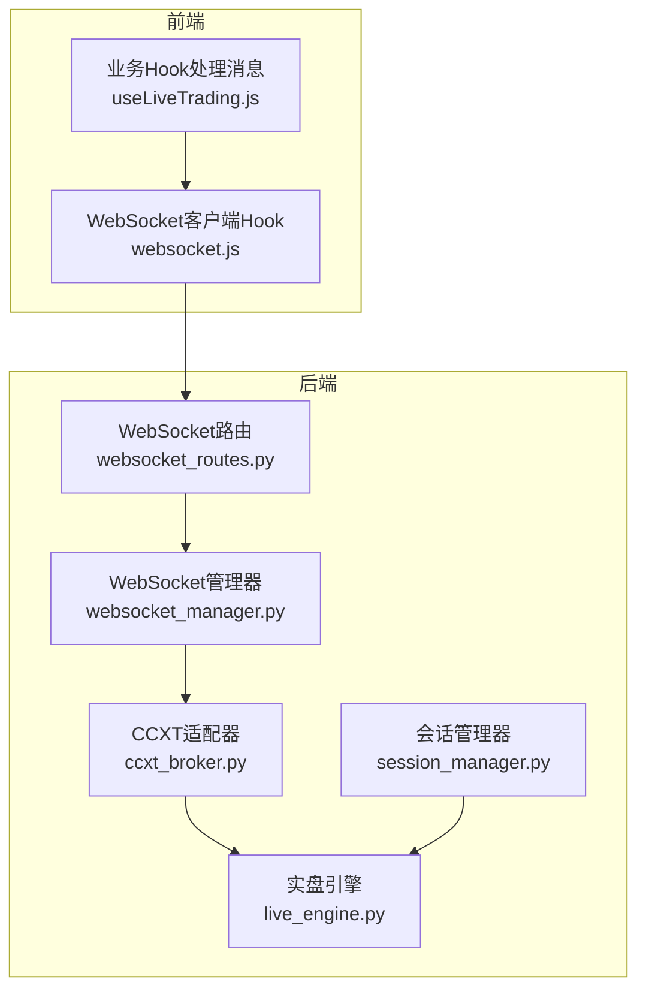
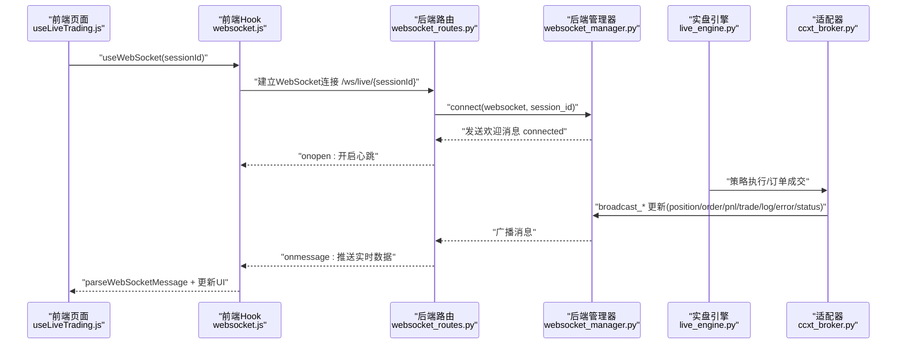
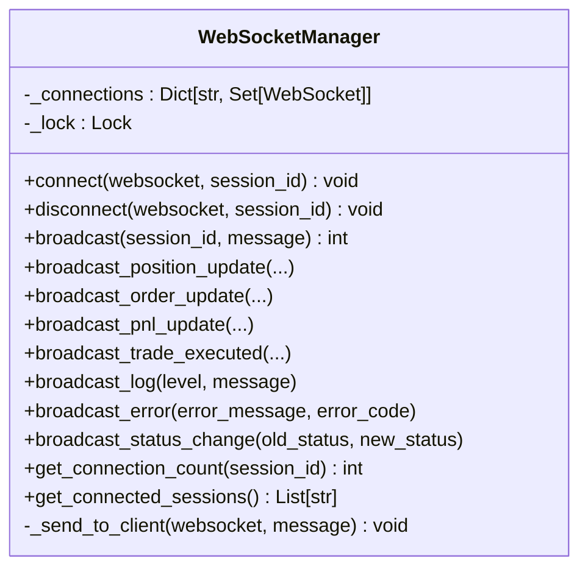
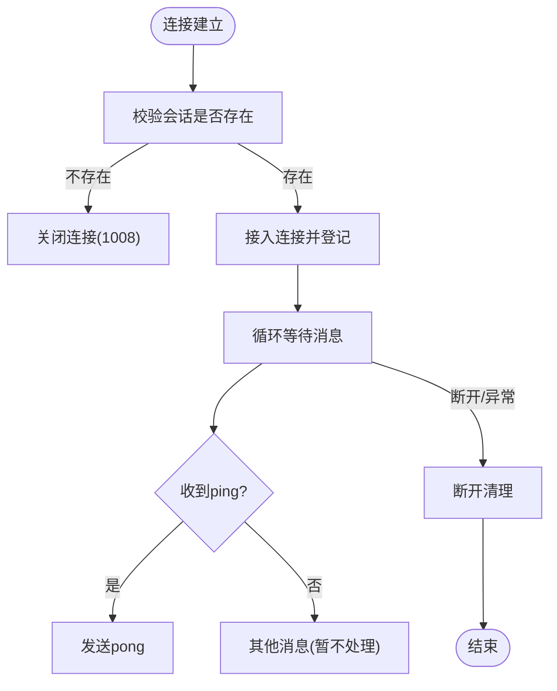
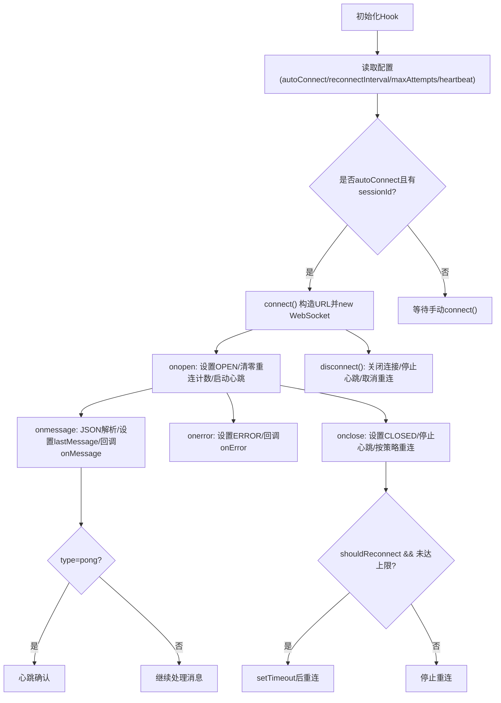
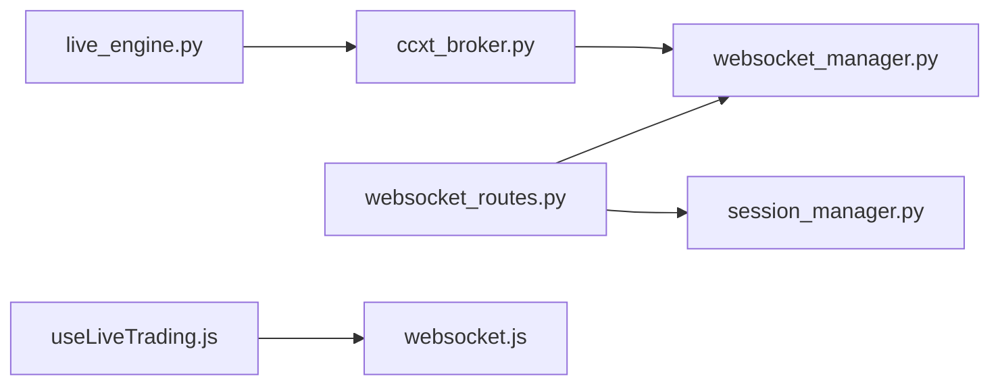

# WebSocket实时通信

<cite>
**本文引用的文件列表**
- [websocket_manager.py](file://backend/src/service/websocket_manager.py)
- [websocket_routes.py](file://backend/src/routes/websocket_routes.py)
- [websocket.js](file://frontend/src/services/websocket.js)
- [useLiveTrading.js](file://frontend/src/hooks/useLiveTrading.js)
- [session_manager.py](file://backend/src/service/session_manager.py)
- [live_engine.py](file://backend/src/service/live_engine.py)
- [ccxt_broker.py](file://backend/src/brokers/ccxt_adapter/ccxt_broker.py)
</cite>

## 目录
1. [引言](#引言)
2. [项目结构](#项目结构)
3. [核心组件](#核心组件)
4. [架构总览](#架构总览)
5. [详细组件分析](#详细组件分析)
6. [依赖关系分析](#依赖关系分析)
7. [性能与稳定性优化](#性能与稳定性优化)
8. [故障排查指南](#故障排查指南)
9. [结论](#结论)

## 引言
本文件系统性解析后端 WebSocket 管理器与前端 WebSocket 客户端的双向通信协议，覆盖连接建立、消息广播机制、支持的消息类型（position、order、pnl 等）、错误处理策略，并结合代码路径示例说明如何从前端订阅实时数据以及后端如何推送交易更新。同时提供性能优化与连接稳定性保障的最佳实践建议。

## 项目结构
围绕 WebSocket 实时通信的关键文件分布如下：
- 后端服务层：WebSocket 管理器、会话管理器、WebSocket 路由、实盘引擎与适配器
- 前端服务层：React Hook 封装的 WebSocket 客户端、业务 Hook 处理消息

图表来源
- [websocket_routes.py](file://backend/src/routes/websocket_routes.py#L21-L214)
- [websocket_manager.py](file://backend/src/service/websocket_manager.py#L45-L148)
- [session_manager.py](file://backend/src/service/session_manager.py#L96-L131)
- [live_engine.py](file://backend/src/service/live_engine.py#L100-L200)
- [ccxt_broker.py](file://backend/src/brokers/ccxt_adapter/ccxt_broker.py#L428-L462)
- [websocket.js](file://frontend/src/services/websocket.js#L48-L246)
- [useLiveTrading.js](file://frontend/src/hooks/useLiveTrading.js#L32-L125)

章节来源
- [websocket_routes.py](file://backend/src/routes/websocket_routes.py#L21-L214)
- [websocket_manager.py](file://backend/src/service/websocket_manager.py#L45-L148)
- [websocket.js](file://frontend/src/services/websocket.js#L48-L246)
- [useLiveTrading.js](file://frontend/src/hooks/useLiveTrading.js#L32-L125)

## 核心组件
- 后端 WebSocket 管理器：维护按会话分组的连接池，负责连接接入、断开清理、消息广播与去死连接。
- 后端 WebSocket 路由：提供 /ws/live/{session_id} 端点，校验会话存在性，握手接入，心跳保活，接收客户端消息。
- 前端 WebSocket 客户端 Hook：封装连接、断开、重连、心跳、消息解析与状态管理。
- 业务 Hook：在前端侧根据消息类型更新 UI 状态，如持仓、订单、PnL、统计指标等。
- 会话管理器：生命周期管理（创建、启动、停止、状态跟踪），为 WebSocket 路由提供会话校验。
- 实盘引擎与适配器：驱动策略执行，通过适配器在订单成交、仓位变化、PnL 更新时触发广播。

章节来源
- [websocket_manager.py](file://backend/src/service/websocket_manager.py#L18-L38)
- [websocket_routes.py](file://backend/src/routes/websocket_routes.py#L21-L214)
- [websocket.js](file://frontend/src/services/websocket.js#L26-L246)
- [useLiveTrading.js](file://frontend/src/hooks/useLiveTrading.js#L32-L125)
- [session_manager.py](file://backend/src/service/session_manager.py#L96-L131)
- [live_engine.py](file://backend/src/service/live_engine.py#L100-L200)
- [ccxt_broker.py](file://backend/src/brokers/ccxt_adapter/ccxt_broker.py#L428-L462)

## 架构总览
WebSocket 双向通信流程概览：
- 前端通过 useWebSocket 连接后端 /ws/live/{session_id}，自动发送 ping 保持心跳。
- 后端路由校验会话存在性，接入连接并进入循环等待消息。
- 实盘引擎在事件发生（订单成交、仓位变化、PnL 更新）时调用适配器，适配器再调用 WebSocket 管理器进行广播。
- 前端收到消息后，useLiveTrading 解析并更新本地状态。

图表来源
- [websocket_routes.py](file://backend/src/routes/websocket_routes.py#L21-L214)
- [websocket_manager.py](file://backend/src/service/websocket_manager.py#L45-L148)
- [websocket.js](file://frontend/src/services/websocket.js#L96-L203)
- [useLiveTrading.js](file://frontend/src/hooks/useLiveTrading.js#L32-L125)
- [live_engine.py](file://backend/src/service/live_engine.py#L100-L200)
- [ccxt_broker.py](file://backend/src/brokers/ccxt_adapter/ccxt_broker.py#L428-L462)

## 详细组件分析

### 后端 WebSocket 管理器（WebSocketManager）
- 连接接入与断开：接受新连接并登记到按 session_id 分组的集合；断开时移除并清理空会话。
- 广播机制：复制当前会话连接集合，逐个发送消息；捕获异常记录死连接并清理；返回成功送达数量。
- 消息类型广播：提供 position、order、pnl、trade、log、error、status 的专用广播方法，统一序列化为 JSON。
- 内部锁：使用异步锁保护连接集合读写，避免并发修改。
- 连接计数与会话列表：用于监控与健康检查。

图表来源
- [websocket_manager.py](file://backend/src/service/websocket_manager.py#L45-L387)

章节来源
- [websocket_manager.py](file://backend/src/service/websocket_manager.py#L45-L148)
- [websocket_manager.py](file://backend/src/service/websocket_manager.py#L150-L387)

### 后端 WebSocket 路由（websocket_routes.py）
- 端点：/ws/live/{session_id}
- 连接校验：通过会话管理器验证 session_id 存在，不存在则关闭连接。
- 心跳保活：接收客户端 ping，返回 pong；忽略非 JSON 文本消息。
- 生命周期：连接建立后进入循环等待消息；断开或异常时清理连接。
- 信息接口：/ws/info 返回端点、协议、连接数、会话列表、消息类型与客户端可发消息。

图表来源
- [websocket_routes.py](file://backend/src/routes/websocket_routes.py#L21-L214)

章节来源
- [websocket_routes.py](file://backend/src/routes/websocket_routes.py#L21-L214)
- [websocket_routes.py](file://backend/src/routes/websocket_routes.py#L216-L239)

### 前端 WebSocket 客户端 Hook（websocket.js）
- 自动连接：可配置 autoConnect，在挂载时自动连接；否则手动 connect。
- URL 构造：根据环境选择 ws/wss 与主机地址，拼接 /ws/live/{sessionId}。
- 心跳保活：周期性发送 ping，收到 pong 即视为心跳正常。
- 重连策略：可配置最大重连次数与间隔，断开后按指数退避尝试重连。
- 错误处理：onerror/onclose/onmessage 统一处理，失败时记录日志并触发重连。
- 发送消息：支持字符串或对象，自动 JSON 序列化。

图表来源
- [websocket.js](file://frontend/src/services/websocket.js#L48-L246)

章节来源
- [websocket.js](file://frontend/src/services/websocket.js#L26-L246)

### 前端业务 Hook（useLiveTrading.js）
- 消息处理：根据 WS_MESSAGE_TYPES 分派到不同状态更新逻辑，包括 position、order、pnl、trade、log、error、status。
- 会话控制：与后端 API 配合，先启动会话，再手动连接 WebSocket，避免自动重连导致的异常回环。
- UI 通知：对 trade、error 等关键事件弹出消息提示并加入通知中心。
- 统计更新：基于 PnL 数据更新总交易数、胜率等统计指标。

章节来源
- [useLiveTrading.js](file://frontend/src/hooks/useLiveTrading.js#L32-L125)
- [useLiveTrading.js](file://frontend/src/hooks/useLiveTrading.js#L127-L204)
- [useLiveTrading.js](file://frontend/src/hooks/useLiveTrading.js#L205-L281)

### 会话管理器（SessionManager）
- 单例模式：全局唯一实例，线程安全访问。
- 生命周期：创建、启动、停止、状态查询、活跃会话统计。
- 与 WebSocket 路由协作：路由在接入前校验会话存在性。

章节来源
- [session_manager.py](file://backend/src/service/session_manager.py#L96-L131)
- [session_manager.py](file://backend/src/service/session_manager.py#L205-L237)
- [session_manager.py](file://backend/src/service/session_manager.py#L238-L292)

### 实盘引擎与适配器（live_engine.py、ccxt_broker.py）
- 实盘引擎：加载策略、初始化数据源与 Broker，添加分析器，保存会话并运行。
- CCXT 适配器：在订单成交时广播 position、pnl、trade 等消息，触发实时更新。

章节来源
- [live_engine.py](file://backend/src/service/live_engine.py#L100-L200)
- [ccxt_broker.py](file://backend/src/brokers/ccxt_adapter/ccxt_broker.py#L428-L462)

## 依赖关系分析
- WebSocket 路由依赖 WebSocket 管理器与会话管理器，确保连接与会话有效性。
- WebSocket 管理器被适配器调用以广播各类消息。
- 前端 useLiveTrading 依赖 websocket.js 提供的连接能力与消息解析常量。
- 实盘引擎与适配器共同驱动交易事件，形成从策略到前端的闭环。

图表来源
- [websocket_routes.py](file://backend/src/routes/websocket_routes.py#L21-L214)
- [websocket_manager.py](file://backend/src/service/websocket_manager.py#L45-L148)
- [session_manager.py](file://backend/src/service/session_manager.py#L96-L131)
- [ccxt_broker.py](file://backend/src/brokers/ccxt_adapter/ccxt_broker.py#L428-L462)
- [useLiveTrading.js](file://frontend/src/hooks/useLiveTrading.js#L32-L125)
- [websocket.js](file://frontend/src/services/websocket.js#L48-L246)
- [live_engine.py](file://backend/src/service/live_engine.py#L100-L200)

章节来源
- [websocket_routes.py](file://backend/src/routes/websocket_routes.py#L21-L214)
- [websocket_manager.py](file://backend/src/service/websocket_manager.py#L45-L148)
- [ccxt_broker.py](file://backend/src/brokers/ccxt_adapter/ccxt_broker.py#L428-L462)
- [useLiveTrading.js](file://frontend/src/hooks/useLiveTrading.js#L32-L125)
- [websocket.js](file://frontend/src/services/websocket.js#L48-L246)
- [live_engine.py](file://backend/src/service/live_engine.py#L100-L200)

## 性能与稳定性优化
- 连接池与广播优化
  - 使用异步锁保护连接集合，避免并发修改引发异常。
  - 广播前复制连接集合，避免迭代期间集合变更导致的异常。
  - 对发送失败的连接进行清理，降低后续广播成本。
- 心跳与保活
  - 前端周期性发送 ping，后端收到即返回 pong，维持长连接稳定。
  - 建议合理设置心跳间隔，避免过于频繁造成带宽压力。
- 重连策略
  - 前端支持最大重连次数与间隔配置，断线后自动恢复。
  - 建议在业务层禁用自动重连，改为手动连接，避免会话未就绪时的无效重连。
- 消息体积与频率
  - 合理聚合高频消息（如 PnL），减少广播次数。
  - 对大字段（如日志）仅在必要时传输，避免阻塞主通道。
- 会话隔离
  - 按 session_id 分组广播，避免跨会话干扰。
  - 在路由层严格校验会话存在性，防止无效连接占用资源。

[本节为通用指导，无需列出具体文件来源]

## 故障排查指南
- 连接失败
  - 检查 /ws/info 是否可达，确认端点与协议。
  - 确认 sessionId 是否存在，路由会在会话不存在时主动关闭连接。
- 心跳异常
  - 前端 onerror/onclose 触发时，查看断开码与原因；确认网络与代理配置。
  - 后端路由未收到 ping 或收到非 JSON 文本时会记录调试日志。
- 消息缺失
  - 检查 WebSocket 管理器广播返回值，若为 0 表示无连接或已清理。
  - 确认前端 onmessage 是否正确解析 JSON，未知类型会被忽略。
- 会话状态不一致
  - 使用会话管理器提供的状态查询接口，核对会话生命周期。
- 订单与 PnL 不更新
  - 确认实盘引擎与适配器是否触发了广播方法（position、order、pnl、trade）。

章节来源
- [websocket_routes.py](file://backend/src/routes/websocket_routes.py#L21-L214)
- [websocket_manager.py](file://backend/src/service/websocket_manager.py#L91-L148)
- [websocket.js](file://frontend/src/services/websocket.js#L133-L182)
- [useLiveTrading.js](file://frontend/src/hooks/useLiveTrading.js#L32-L125)
- [session_manager.py](file://backend/src/service/session_manager.py#L205-L237)

## 结论
该 WebSocket 实时通信方案通过后端集中式管理器与前端 Hook 的配合，实现了从策略执行到前端可视化的低延迟闭环。消息类型覆盖 position、order、pnl、trade、log、error、status，前端具备心跳保活与重连策略，后端具备连接清理与广播优化。建议在生产环境中进一步细化订阅机制、限流与鉴权，并持续监控连接数与广播耗时，以保障系统稳定性与性能。