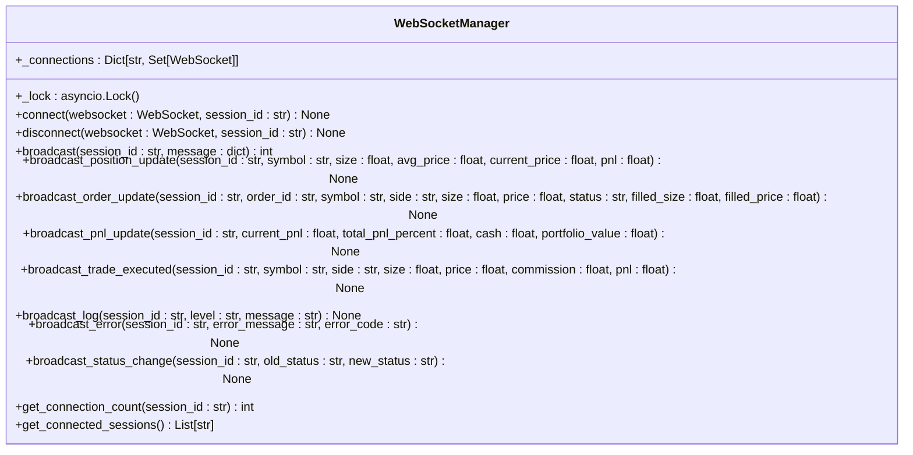
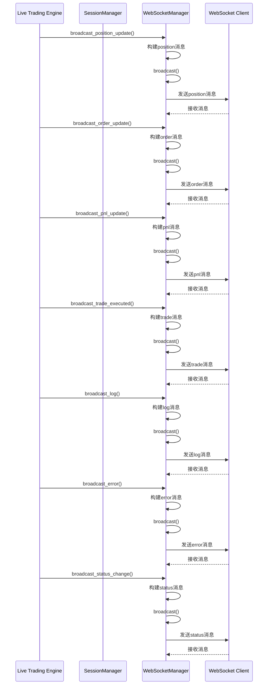
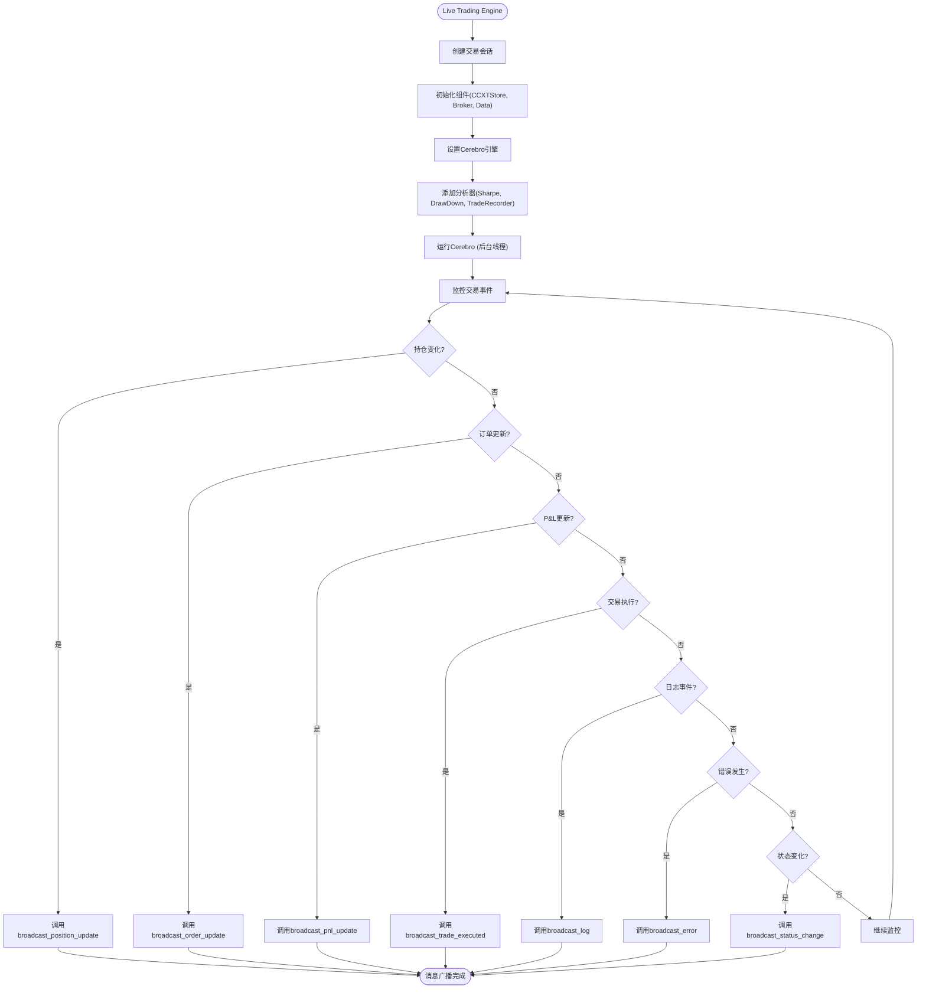
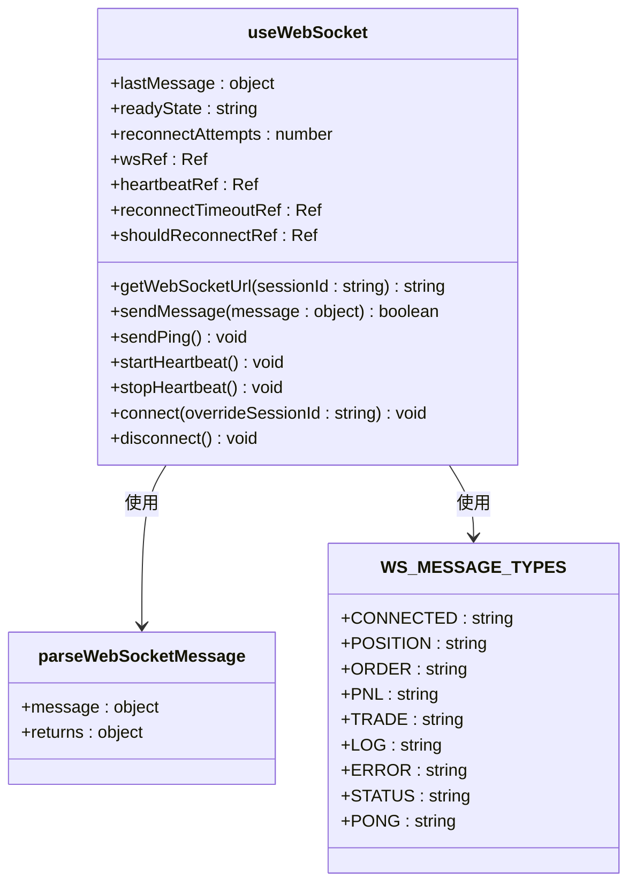
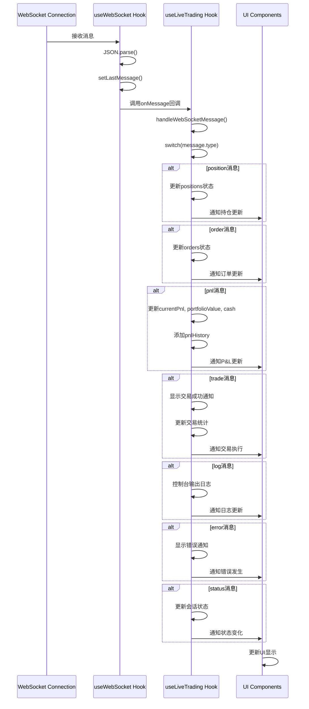
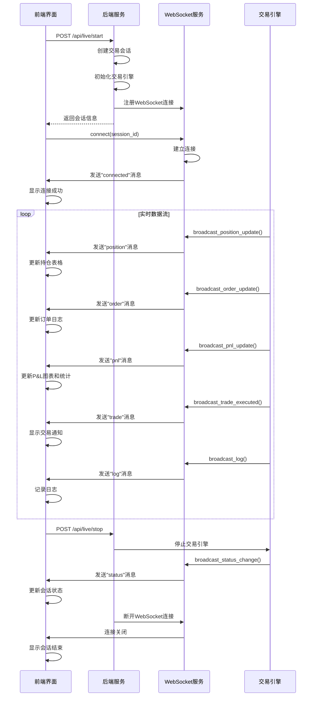
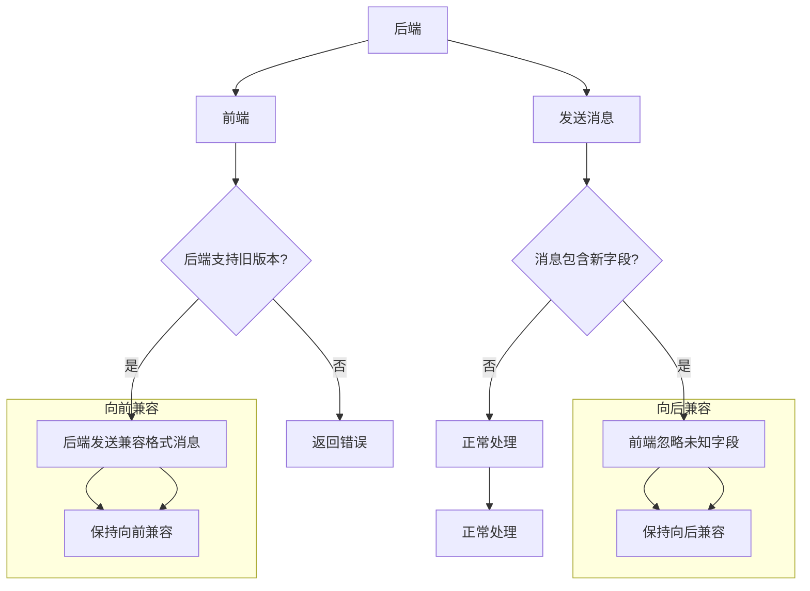
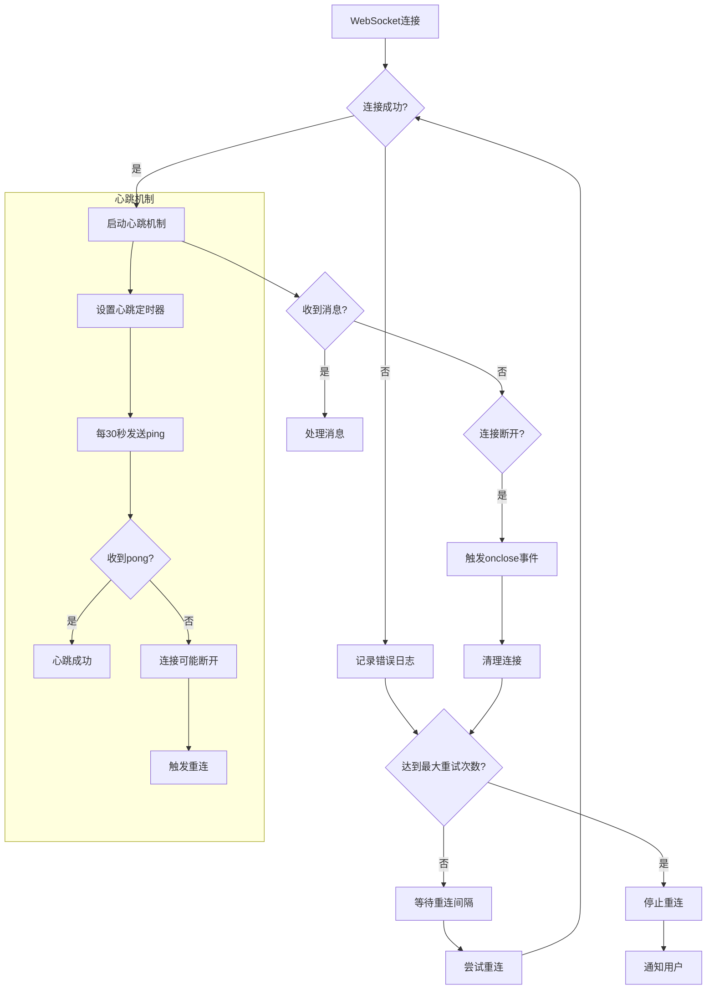

# WebSocket消息协议

<cite>
**本文档引用的文件**
- [websocket_routes.py](file://backend/src/routes/websocket_routes.py)
- [websocket_manager.py](file://backend/src/service/websocket_manager.py)
- [websocket.js](file://frontend/src/services/websocket.js)
- [useLiveTrading.js](file://frontend/src/hooks/useLiveTrading.js)
- [live_routes.py](file://backend/src/routes/live_routes.py)
- [session_manager.py](file://backend/src/service/session_manager.py)
- [live_engine.py](file://backend/src/service/live_engine.py)
- [backtest_engine.py](file://backend/src/service/backtest_engine.py)
</cite>

## 目录
1. [WebSocket消息类型](#websocket消息类型)
2. [消息格式规范](#消息格式规范)
3. [后端广播机制](#后端广播机制)
4. [前端消息处理](#前端消息处理)
5. [协同工作流程](#协同工作流程)
6. [最佳实践](#最佳实践)

## WebSocket消息类型

WebSocket消息协议定义了七种核心消息类型，用于实时传输交易会话的关键状态和事件信息。这些消息类型包括position（持仓）、order（订单）、pnl（盈亏）、trade（交易）、log（日志）、error（错误）和status（状态），每种类型都有其特定的业务语义和数据结构。

**Section sources**
- [websocket_routes.py](file://backend/src/routes/websocket_routes.py#L37-L138)
- [websocket_manager.py](file://backend/src/service/websocket_manager.py#L28-L36)

## 消息格式规范

### Position消息
Position消息用于实时更新交易持仓信息，包含持仓的详细数据。

```json
{
  "type": "position",
  "data": {
    "symbol": "BTC/USDT",
    "size": 0.1,
    "avg_price": 95000,
    "current_price": 95500,
    "pnl": 50,
    "pnl_percent": 0.53
  }
}
```

**字段说明：**
- `symbol`: 交易对，字符串类型，表示交易的资产对
- `size`: 持仓数量，浮点数类型，正值表示多头，负值表示空头
- `avg_price`: 平均开仓价格，浮点数类型
- `current_price`: 当前市场价格，浮点数类型
- `pnl`: 未实现盈亏，浮点数类型
- `pnl_percent`: 盈亏百分比，浮点数类型，由系统自动计算

**Section sources**
- [websocket_routes.py](file://backend/src/routes/websocket_routes.py#L46-L58)
- [websocket_manager.py](file://backend/src/service/websocket_manager.py#L150-L180)

### Order消息
Order消息用于通知订单状态的更新，包括订单的创建、部分成交和完全成交等状态变化。

```json
{
  "type": "order",
  "data": {
    "order_id": "12345",
    "symbol": "BTC/USDT",
    "side": "buy",
    "size": 0.1,
    "price": 95000,
    "status": "filled",
    "filled_size": 0.1,
    "filled_price": 95000
  }
}
```

**字段说明：**
- `order_id`: 订单ID，字符串类型，交易所返回的唯一标识
- `symbol`: 交易对，字符串类型
- `side`: 交易方向，字符串类型，"buy"表示买入，"sell"表示卖出
- `size`: 订单数量，浮点数类型
- `price`: 订单价格，浮点数类型
- `status`: 订单状态，字符串类型，如"created"、"submitted"、"partial"、"filled"等
- `filled_size`: 已成交数量，浮点数类型
- `filled_price`: 成交均价，浮点数类型

**Section sources**
- [websocket_routes.py](file://backend/src/routes/websocket_routes.py#L61-L75)
- [websocket_manager.py](file://backend/src/service/websocket_manager.py#L182-L220)

### PNL消息
PNL消息用于实时更新账户的盈亏状况和资产价值。

```json
{
  "type": "pnl",
  "data": {
    "current_pnl": 150.5,
    "total_pnl_percent": 1.5,
    "cash": 9850,
    "portfolio_value": 10150.5
  }
}
```

**字段说明：**
- `current_pnl`: 当前盈亏，浮点数类型
- `total_pnl_percent`: 总盈亏百分比，浮点数类型
- `cash`: 现金余额，浮点数类型
- `portfolio_value`: 投资组合总价值，浮点数类型

**Section sources**
- [websocket_routes.py](file://backend/src/routes/websocket_routes.py#L78-L88)
- [websocket_manager.py](file://backend/src/service/websocket_manager.py#L222-L248)

### Trade消息
Trade消息用于通知已完成的交易执行情况。

```json
{
  "type": "trade",
  "data": {
    "symbol": "BTC/USDT",
    "side": "buy",
    "size": 0.1,
    "price": 95000,
    "commission": 9.5,
    "pnl": null
  }
}
```

**字段说明：**
- `symbol`: 交易对，字符串类型
- `side`: 交易方向，字符串类型
- `size`: 交易数量，浮点数类型
- `price`: 交易价格，浮点数类型
- `commission`: 手续费，浮点数类型
- `pnl`: 盈亏，浮点数类型，平仓时提供，开仓时为null

**Section sources**
- [websocket_routes.py](file://backend/src/routes/websocket_routes.py#L91-L103)
- [websocket_manager.py](file://backend/src/service/websocket_manager.py#L250-L282)

### Log消息
Log消息用于传输策略执行过程中的日志信息。

```json
{
  "type": "log",
  "data": {
    "level": "info",
    "message": "Strategy bought BTC/USDT @ 95000",
    "timestamp": 1702345678.123
  }
}
```

**字段说明：**
- `level`: 日志级别，字符串类型，如"info"、"warning"、"error"
- `message`: 日志内容，字符串类型
- `timestamp`: 时间戳，浮点数类型，Unix时间戳

**Section sources**
- [websocket_routes.py](file://backend/src/routes/websocket_routes.py#L106-L115)
- [websocket_manager.py](file://backend/src/service/websocket_manager.py#L284-L305)

### Error消息
Error消息用于通知系统或交易过程中的错误。

```json
{
  "type": "error",
  "data": {
    "message": "Order rejected: insufficient balance",
    "code": "INSUFFICIENT_BALANCE"
  }
}
```

**字段说明：**
- `message`: 错误信息，字符串类型
- `code`: 错误代码，字符串类型，用于前端分类处理

**Section sources**
- [websocket_routes.py](file://backend/src/routes/websocket_routes.py#L118-L126)
- [websocket_manager.py](file://backend/src/service/websocket_manager.py#L307-L327)

### Status消息
Status消息用于通知交易会话状态的变化。

```json
{
  "type": "status",
  "data": {
    "old_status": "running",
    "new_status": "stopped"
  }
}
```

**字段说明：**
- `old_status`: 原状态，字符串类型
- `new_status`: 新状态，字符串类型

**Section sources**
- [websocket_routes.py](file://backend/src/routes/websocket_routes.py#L129-L137)
- [websocket_manager.py](file://backend/src/service/websocket_manager.py#L329-L349)

## 后端广播机制

### WebSocket管理器
WebSocket管理器是消息广播的核心组件，负责管理所有WebSocket连接并广播消息到客户端。



**Diagram sources**
- [websocket_manager.py](file://backend/src/service/websocket_manager.py#L18-L388)

### 消息广播流程
后端通过WebSocket管理器提供的专用方法广播消息，这些方法封装了消息格式并调用通用的broadcast方法。



**Diagram sources**
- [live_engine.py](file://backend/src/service/live_engine.py#L100-L329)
- [websocket_manager.py](file://backend/src/service/websocket_manager.py#L150-L349)

### 与交易引擎的集成
WebSocket管理器与交易引擎深度集成，当交易状态发生变化时，引擎会调用相应的广播方法。



**Diagram sources**
- [live_engine.py](file://backend/src/service/live_engine.py#L100-L329)
- [backtest_engine.py](file://backend/src/service/backtest_engine.py#L99-L177)

## 前端消息处理

### WebSocket服务
前端通过WebSocket服务管理WebSocket连接和消息处理。



**Diagram sources**
- [websocket.js](file://frontend/src/services/websocket.js#L8-L282)

### 消息处理流程
前端通过useLiveTrading钩子处理WebSocket消息，根据消息类型更新相应的状态。



**Diagram sources**
- [useLiveTrading.js](file://frontend/src/hooks/useLiveTrading.js#L7-L281)
- [websocket.js](file://frontend/src/services/websocket.js#L8-L282)

### UI组件更新
不同的UI组件根据WebSocket消息更新其显示内容。

```mermaid
flowchart TD
Start([WebSocket Message]) --> ParseMessage["解析消息类型"]
ParseMessage --> UpdatePositionTable{"消息类型: position?"}
UpdatePositionTable --> |是| PositionTable["更新PositionTable组件"]
PositionTable --> PositionTableRender["重新渲染持仓表格"]
PositionTableRender --> End1([UI更新完成])
ParseMessage --> UpdateOrderLog{"消息类型: order?"}
UpdateOrderLog --> |是| OrderLog["更新OrderLog组件"]
OrderLog --> OrderLogRender["重新渲染订单日志"]
OrderLogRender --> End2([UI更新完成])
ParseMessage --> UpdatePnLChart{"消息类型: pnl?"}
UpdatePnLChart --> |是| PnLChart["更新PnLChart组件"]
PnLChart --> PnLChartData["更新图表数据"]
PnLChart --> PnLChartColor["更新图表颜色"]
PnLChartColor --> PnLChartRender["重新渲染P&L图表"]
PnLChartRender --> End3([UI更新完成])
ParseMessage --> UpdateStatistics{"消息类型: pnl?"}
UpdateStatistics --> |是| Statistics["更新统计卡片"]
Statistics --> StatisticsRender["重新渲染统计信息"]
StatisticsRender --> End4([UI更新完成])
ParseMessage --> ShowNotification{"消息类型: trade?"}
ShowNotification --> |是| Notification["显示交易通知"]
Notification --> NotificationRender["显示成功通知"]
NotificationRender --> End5([UI更新完成])
ParseMessage --> ShowError{"消息类型: error?"}
ShowError --> |是| ErrorNotification["显示错误通知"]
ErrorNotification --> ErrorNotificationRender["显示错误通知"]
ErrorNotificationRender --> End6([UI更新完成])
PositionTableRender --> End
OrderLogRender --> End
PnLChartRender --> End
StatisticsRender --> End
NotificationRender --> End
ErrorNotificationRender --> End
subgraph "PositionTable.jsx"
PositionTableRender["重新渲染持仓表格"]
PositionTableRender --> SymbolColumn["显示交易对"]
PositionTableRender --> SideColumn["显示多空方向"]
PositionTableRender --> SizeColumn["显示持仓数量"]
PositionTableRender --> AvgPriceColumn["显示平均价格"]
PositionTableRender --> CurrentPriceColumn["显示当前价格"]
PositionTableRender --> PnLColumn["显示未实现盈亏"]
PositionTableRender --> PnLPercentColumn["显示盈亏百分比"]
end
subgraph "OrderLog.jsx"
OrderLogRender["重新渲染订单日志"]
OrderLogRender --> TimeColumn["显示时间"]
OrderLogRender --> SymbolColumn["显示交易对"]
OrderLogRender --> SideColumn["显示买卖方向"]
OrderLogRender --> SizeColumn["显示订单数量"]
OrderLogRender --> PriceColumn["显示订单价格"]
OrderLogRender --> FilledColumn["显示已成交"]
OrderLogRender --> AvgFillPriceColumn["显示成交均价"]
OrderLogRender --> StatusColumn["显示订单状态"]
OrderLogRender --> CommissionColumn["显示手续费"]
end
subgraph "PnLChart.jsx"
PnLChartRender["重新渲染P&L图表"]
PnLChartRender --> UpdateChartData["更新图表数据"]
PnLChartRender --> UpdateLineColor["更新线条颜色"]
PnLChartRender --> AddZeroLine["添加零线"]
PnLChartRender --> RenderChart["渲染图表"]
end
```



**Diagram sources**
- [PositionTable.jsx](file://frontend/src/components/LiveTrading/PositionTable.jsx#L1-L99)
- [OrderLog.jsx](file://frontend/src/components/LiveTrading/OrderLog.jsx#L1-L139)
- [PnLChart.jsx](file://frontend/src/components/LiveTrading/PnLChart.jsx#L1-L113)

## 协同工作流程

### 会话生命周期
WebSocket消息协议与交易会话的整个生命周期紧密集成，从会话创建到结束的每个阶段都有相应的消息交互。



**Diagram sources**
- [live_routes.py](file://backend/src/routes/live_routes.py#L101-L254)
- [websocket_routes.py](file://backend/src/routes/websocket_routes.py#L21-L239)
- [useLiveTrading.js](file://frontend/src/hooks/useLiveTrading.js#L128-L204)

### 消息序列化与反序列化
消息在传输过程中需要进行序列化和反序列化处理，确保数据的完整性和一致性。

```mermaid
flowchart LR
A[后端] --> B[创建消息对象]
B --> C[JSON序列化]
C --> D[通过WebSocket发送]
D --> E[网络传输]
E --> F[前端接收]
F --> G[JSON反序列化]
G --> H[parseWebSocketMessage]
H --> I[添加时间戳]
I --> J[分发到处理函数]
J --> K[更新UI状态]
subgraph "后端序列化"
B["创建消息对象"]
B --> C["JSON序列化"]
C --> |{"type":"position","data":{...}}| D["通过WebSocket发送"]
end
subgraph "前端反序列化"
F["前端接收"]
F --> |{"type":"position","data":{...}}| G["JSON反序列化"]
G --> H["parseWebSocketMessage"]
H --> I["添加时间戳"]
I --> J["分发到处理函数"]
J --> K["更新UI状态"]
end
```

**Diagram sources**
- [websocket_manager.py](file://backend/src/service/websocket_manager.py#L351-L363)
- [websocket.js](file://frontend/src/services/websocket.js#L134-L136)
- [websocket.js](file://frontend/src/services/websocket.js#L254-L263)

## 最佳实践

### 时间戳同步
为了确保前后端时间的一致性，系统采用了多种时间同步机制。

```mermaid
flowchart TD
A[后端] --> B[使用asyncio事件循环时间]
B --> C[在broadcast_log时获取时间戳]
C --> D[发送到前端]
D --> E[前端]
E --> F[使用Date.now()作为本地时间]
F --> G[比较后端时间戳和本地时间]
G --> H{时间差>阈值?}
H --> |是| I[显示时间同步警告]
H --> |否| J[正常显示消息]
subgraph "后端时间戳"
B["使用asyncio.get_event_loop().time()"]
B --> |Unix时间戳| C["在broadcast_log时获取"]
end
subgraph "前端时间戳"
F["使用Date.now()"]
F --> |毫秒时间戳| G["比较时间差"]
end
```

**Section sources**
- [websocket_manager.py](file://backend/src/service/websocket_manager.py#L303)
- [websocket.js](file://frontend/src/services/websocket.js#L262)

### 版本兼容性处理
系统设计考虑了未来的扩展性，通过灵活的消息结构支持版本兼容性。



**Section sources**
- [websocket_routes.py](file://backend/src/routes/websocket_routes.py#L35-L138)
- [websocket.js](file://frontend/src/services/websocket.js#L254-L263)

### 错误处理与重连机制
系统实现了健壮的错误处理和自动重连机制，确保连接的可靠性。



**Section sources**
- [websocket.js](file://frontend/src/services/websocket.js#L72-L86)
- [websocket.js](file://frontend/src/services/websocket.js#L171-L181)