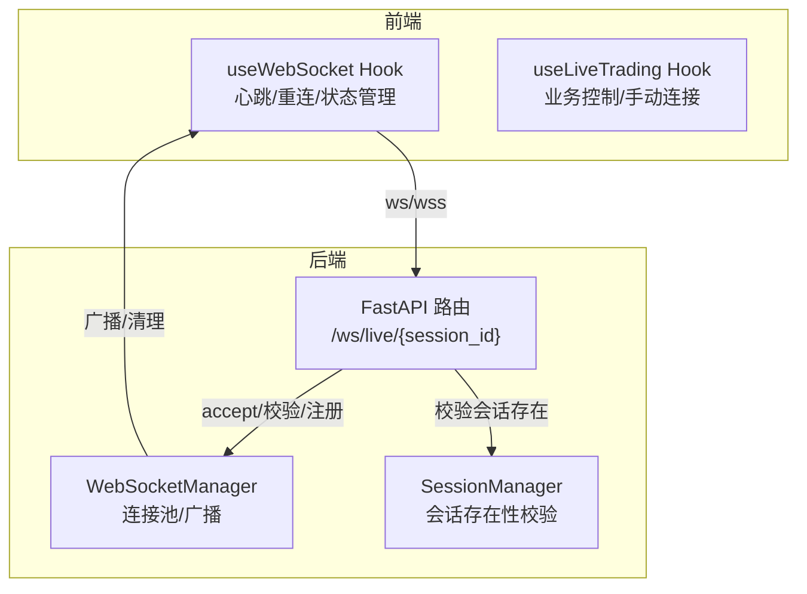
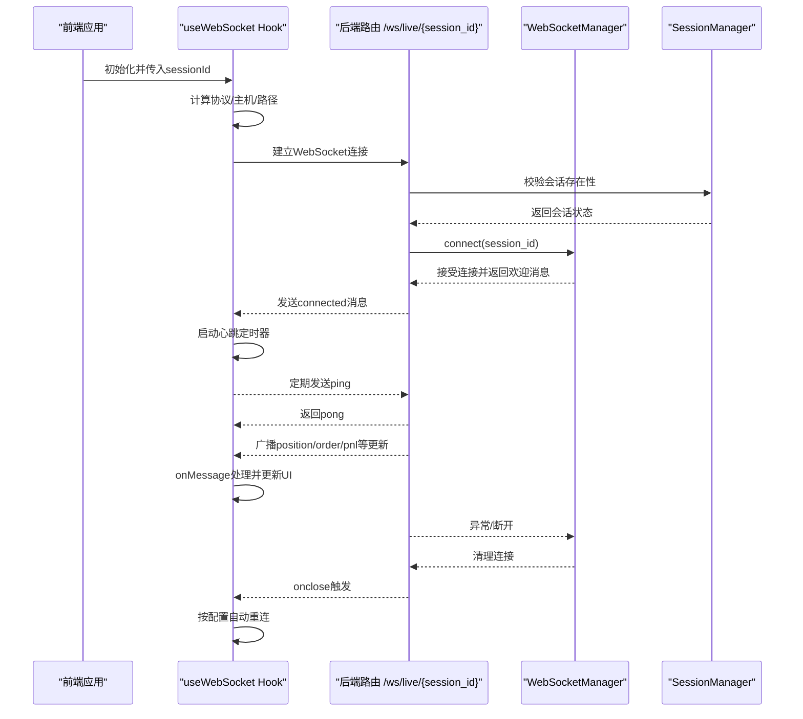
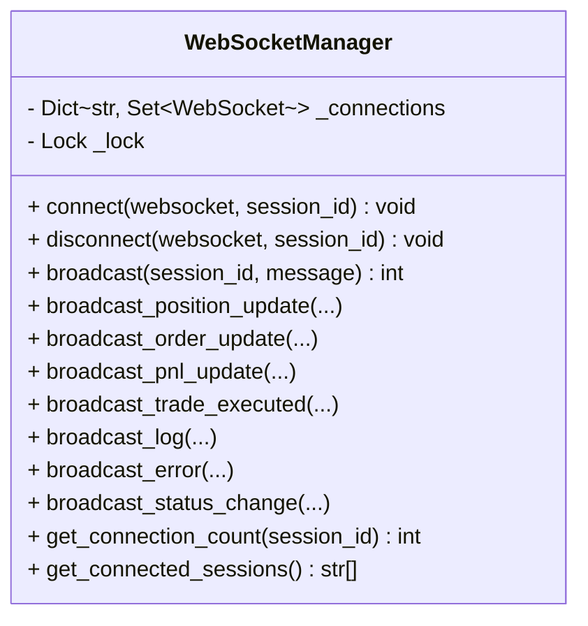
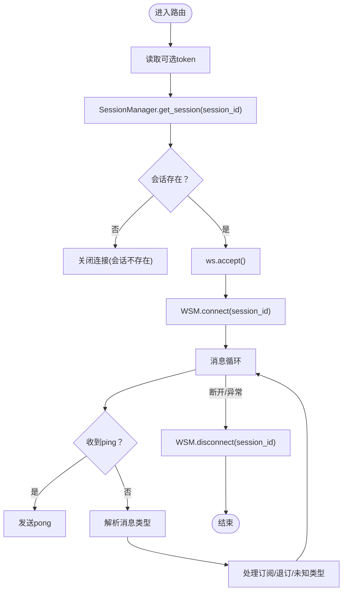
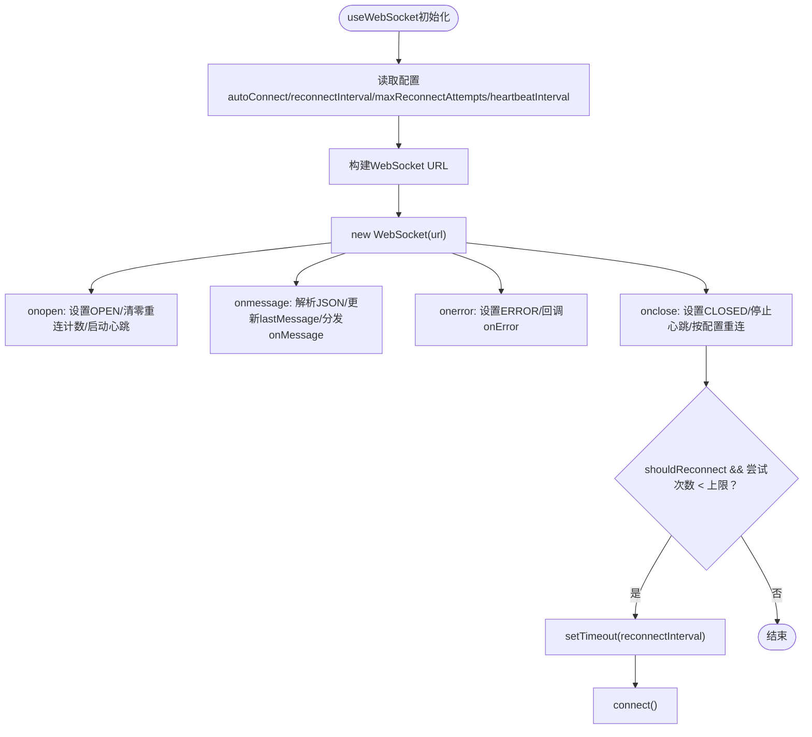
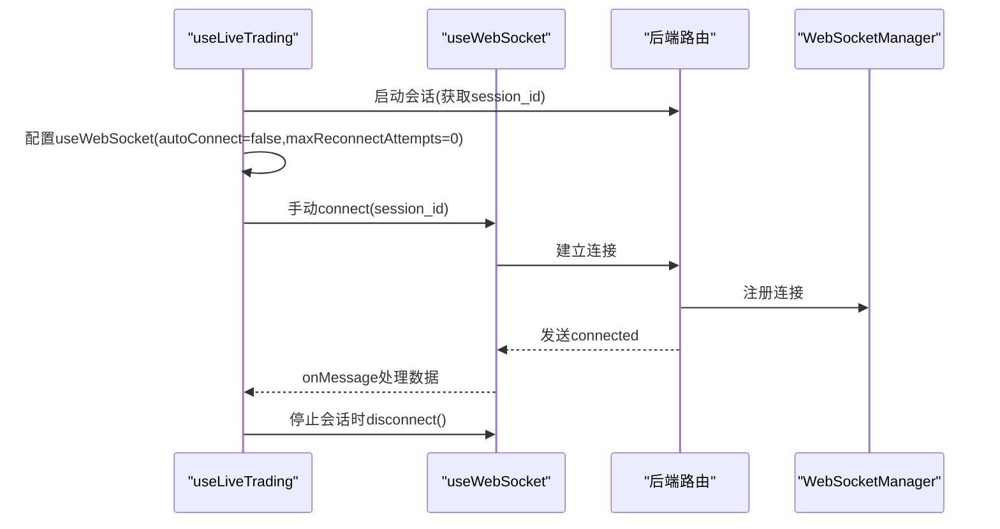
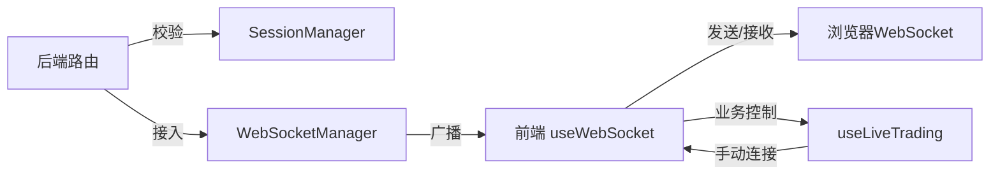

# WebSocket连接管理

<cite>
**本文引用的文件**
- [websocket_manager.py](file://backend/src/service/websocket_manager.py)
- [websocket_routes.py](file://backend/src/routes/websocket_routes.py)
- [websocket.js](file://frontend/src/services/websocket.js)
- [useLiveTrading.js](file://frontend/src/hooks/useLiveTrading.js)
- [session_manager.py](file://backend/src/service/session_manager.py)
</cite>

## 目录
1. [简介](#简介)
2. [项目结构](#项目结构)
3. [核心组件](#核心组件)
4. [架构总览](#架构总览)
5. [详细组件分析](#详细组件分析)
6. [依赖关系分析](#依赖关系分析)
7. [性能与稳定性考量](#性能与稳定性考量)
8. [故障排查指南](#故障排查指南)
9. [结论](#结论)

## 简介
本文件围绕实时交易场景下的WebSocket连接生命周期管理展开，重点说明后端WebSocketManager类的连接接入与断开流程、前端useWebSocket Hook的初始化、重连与心跳机制，并结合useLiveTrading Hook在生产环境中的使用方式，给出认证、会话绑定、异常处理与稳定性最佳实践建议。文档同时提供关键流程的时序图与架构图，帮助读者快速理解前后端协作与消息流转。

## 项目结构
- 后端通过FastAPI路由提供WebSocket端点，接入WebSocketManager进行连接池管理与广播。
- 前端通过React Hook useWebSocket封装WebSocket连接、心跳与自动重连逻辑，并在useLiveTrading中按业务需求控制连接时机与错误处理。

图表来源
- [websocket_routes.py](file://backend/src/routes/websocket_routes.py#L21-L214)
- [websocket_manager.py](file://backend/src/service/websocket_manager.py#L45-L90)
- [websocket.js](file://frontend/src/services/websocket.js#L96-L246)
- [useLiveTrading.js](file://frontend/src/hooks/useLiveTrading.js#L127-L171)

章节来源
- [websocket_routes.py](file://backend/src/routes/websocket_routes.py#L21-L214)
- [websocket_manager.py](file://backend/src/service/websocket_manager.py#L45-L90)
- [websocket.js](file://frontend/src/services/websocket.js#L96-L246)
- [useLiveTrading.js](file://frontend/src/hooks/useLiveTrading.js#L127-L171)

## 核心组件
- 后端WebSocketManager：负责连接接入、断开、广播、死连接清理与会话维度统计。
- 后端WebSocket路由：提供/ws/live/{session_id}端点，完成会话存在性校验、连接接入与消息循环。
- 前端useWebSocket Hook：封装连接、心跳、自动重连、状态机与事件回调。
- 前端useLiveTrading Hook：在业务层控制连接时机，避免自动重连导致的循环连接问题。

章节来源
- [websocket_manager.py](file://backend/src/service/websocket_manager.py#L45-L90)
- [websocket_routes.py](file://backend/src/routes/websocket_routes.py#L21-L214)
- [websocket.js](file://frontend/src/services/websocket.js#L96-L246)
- [useLiveTrading.js](file://frontend/src/hooks/useLiveTrading.js#L127-L171)

## 架构总览
WebSocket端到端交互包含以下关键步骤：
- 前端根据当前会话ID构造URL并发起连接请求。
- 后端路由校验会话是否存在，若不存在则关闭连接；否则接入WebSocketManager并注册连接。
- 后端向客户端发送“已连接”欢迎消息，随后进入消息循环，处理心跳与客户端消息。
- 前端启动心跳定时器，收到pong响应后确认链路健康；断开时按配置自动重连。
- 后端在异常或断开时清理连接池，释放资源。

图表来源
- [websocket_routes.py](file://backend/src/routes/websocket_routes.py#L21-L214)
- [websocket_manager.py](file://backend/src/service/websocket_manager.py#L45-L90)
- [websocket.js](file://frontend/src/services/websocket.js#L96-L246)

## 详细组件分析

### 后端WebSocketManager类：连接生命周期与广播
- 连接接入(connect)
  - 接受新连接并注册到对应会话的连接集合。
  - 发送“已连接”欢迎消息，包含会话ID与提示信息。
- 断开处理(disconnect)
  - 从会话集合中移除该连接；若会话无其他连接，则删除该会话键。
- 广播(broadcast)
  - 对会话内的所有客户端发送消息；对发送失败的连接进行记录并在锁内清理。
  - 返回成功送达数量，便于监控与调试。
- 辅助方法
  - 统计连接数、列出活跃会话，便于运维与诊断。

图表来源
- [websocket_manager.py](file://backend/src/service/websocket_manager.py#L45-L387)

章节来源
- [websocket_manager.py](file://backend/src/service/websocket_manager.py#L45-L90)
- [websocket_manager.py](file://backend/src/service/websocket_manager.py#L91-L149)
- [websocket_manager.py](file://backend/src/service/websocket_manager.py#L150-L349)
- [websocket_manager.py](file://backend/src/service/websocket_manager.py#L364-L387)

### 后端WebSocket路由：会话校验与消息循环
- 路由定义与参数
  - 提供/ws/live/{session_id}端点，支持可选token查询参数（当前为可选，后续可扩展鉴权）。
- 会话校验
  - 使用SessionManager获取会话；若不存在则以特定关闭码拒绝连接。
- 连接接入
  - 调用WebSocketManager.connect完成接入与欢迎消息发送。
- 心跳与消息处理
  - 支持ping/pong保活；解析客户端消息类型，处理订阅/退订等未来扩展。
- 异常与清理
  - 捕获断开与异常，finally中调用WebSocketManager.disconnect清理连接。

图表来源
- [websocket_routes.py](file://backend/src/routes/websocket_routes.py#L21-L214)
- [session_manager.py](file://backend/src/service/session_manager.py#L205-L217)
- [websocket_manager.py](file://backend/src/service/websocket_manager.py#L45-L90)

章节来源
- [websocket_routes.py](file://backend/src/routes/websocket_routes.py#L21-L214)
- [session_manager.py](file://backend/src/service/session_manager.py#L205-L217)

### 前端useWebSocket Hook：初始化、心跳与自动重连
- 连接初始化
  - 根据当前协议与开发/生产环境决定主机与端口，拼装/ws/live/{session_id} URL。
  - 关闭旧连接后创建新的WebSocket实例，设置onopen/onmessage/onerror/onclose回调。
- 心跳机制
  - 在onopen后启动心跳定时器，周期性发送ping；收到pong不重复处理。
- 自动重连
  - onclose中判断是否允许重连与尝试次数上限；满足条件则延时重试，直至达到最大重连次数。
- 状态管理
  - 维护readyState、lastMessage、reconnectAttempts等状态，导出isOpen/isConnecting/isClosed等便捷属性。
- 选项配置
  - autoConnect、reconnectInterval、maxReconnectAttempts、heartbeatInterval、onOpen/onClose/onError/onMessage等。

图表来源
- [websocket.js](file://frontend/src/services/websocket.js#L96-L246)

章节来源
- [websocket.js](file://frontend/src/services/websocket.js#L96-L246)

### 前端useLiveTrading Hook：业务层连接控制与异常抑制
- 会话启动后，禁用自动连接(autoConnect=false)，避免因会话未就绪导致的重连风暴。
- 手动在会话状态为运行时再调用connect，确保连接与会话状态一致。
- 为避免UI频繁弹窗，onError回调中仅记录日志，不直接触发通知。
- 在会话停止时主动断开连接，防止后台残留连接占用资源。

图表来源
- [useLiveTrading.js](file://frontend/src/hooks/useLiveTrading.js#L127-L171)
- [websocket.js](file://frontend/src/services/websocket.js#L96-L246)
- [websocket_routes.py](file://backend/src/routes/websocket_routes.py#L21-L214)
- [websocket_manager.py](file://backend/src/service/websocket_manager.py#L45-L90)

章节来源
- [useLiveTrading.js](file://frontend/src/hooks/useLiveTrading.js#L127-L171)
- [websocket.js](file://frontend/src/services/websocket.js#L96-L246)

## 依赖关系分析
- 后端
  - WebSocket路由依赖WebSocketManager与SessionManager，前者负责连接池与广播，后者负责会话存在性校验。
- 前端
  - useWebSocket依赖浏览器原生WebSocket API与React Hooks；useLiveTrading基于useWebSocket进行业务控制。

图表来源
- [websocket_routes.py](file://backend/src/routes/websocket_routes.py#L21-L214)
- [websocket_manager.py](file://backend/src/service/websocket_manager.py#L45-L90)
- [session_manager.py](file://backend/src/service/session_manager.py#L205-L217)
- [websocket.js](file://frontend/src/services/websocket.js#L96-L246)
- [useLiveTrading.js](file://frontend/src/hooks/useLiveTrading.js#L127-L171)

章节来源
- [websocket_routes.py](file://backend/src/routes/websocket_routes.py#L21-L214)
- [websocket_manager.py](file://backend/src/service/websocket_manager.py#L45-L90)
- [session_manager.py](file://backend/src/service/session_manager.py#L205-L217)
- [websocket.js](file://frontend/src/services/websocket.js#L96-L246)
- [useLiveTrading.js](file://frontend/src/hooks/useLiveTrading.js#L127-L171)

## 性能与稳定性考量
- 连接池与广播
  - WebSocketManager使用锁保护连接集合，广播时复制连接集合避免迭代期间修改；对发送失败的连接进行清理，降低无效连接占用。
- 心跳保活
  - 前端定期发送ping，后端返回pong；心跳间隔应与网络状况匹配，避免过于频繁造成额外负载。
- 自动重连策略
  - 建议在生产环境中适度降低重连频率与上限，避免雪崩式重连；在业务层（如useLiveTrading）禁用自动重连，改为手动控制，减少异常状态下的反复连接。
- 会话绑定
  - 后端路由在接入前校验会话存在性，避免无效连接；前端仅在会话处于运行态时建立连接，确保数据一致性。
- 错误处理
  - 前端onerror回调仅记录日志，避免UI频繁弹窗；后端捕获异常并记录，finally中清理连接，保证资源回收。

章节来源
- [websocket_manager.py](file://backend/src/service/websocket_manager.py#L91-L149)
- [websocket_routes.py](file://backend/src/routes/websocket_routes.py#L160-L214)
- [websocket.js](file://frontend/src/services/websocket.js#L96-L246)
- [useLiveTrading.js](file://frontend/src/hooks/useLiveTrading.js#L127-L171)

## 故障排查指南
- 常见问题定位
  - “会话不存在”：检查后端路由是否正确校验SessionManager；确认前端传入的session_id是否有效。
  - “连接未建立”：查看前端URL构造逻辑（协议/主机/端口），确认后端路由是否被正确访问。
  - “心跳中断”：检查前端心跳定时器是否启动，后端是否正确返回pong；排查网络中间件是否拦截ping/pong。
  - “自动重连风暴”：在业务层禁用自动重连，改为手动连接；合理设置重连间隔与上限。
- 日志与监控
  - 后端路由与WebSocketManager均输出关键日志，可用于定位断开原因与清理情况。
  - 前端onerror/onclose回调可用于记录异常与断开原因，辅助定位网络或服务端问题。

章节来源
- [websocket_routes.py](file://backend/src/routes/websocket_routes.py#L160-L214)
- [websocket_manager.py](file://backend/src/service/websocket_manager.py#L91-L149)
- [websocket.js](file://frontend/src/services/websocket.js#L96-L246)
- [useLiveTrading.js](file://frontend/src/hooks/useLiveTrading.js#L127-L171)

## 结论
本项目在后端通过WebSocketManager集中管理连接与广播，在前端通过useWebSocket提供稳定的心跳与重连能力，并在useLiveTrading中实现业务层的连接控制与异常抑制。生产环境下建议：
- 后端：严格校验会话存在性，完善鉴权（当前为可选，后续应启用），优化广播与清理逻辑。
- 前端：在业务层禁用自动重连，改为手动连接；合理设置心跳与重连参数；统一错误处理策略，避免UI干扰。