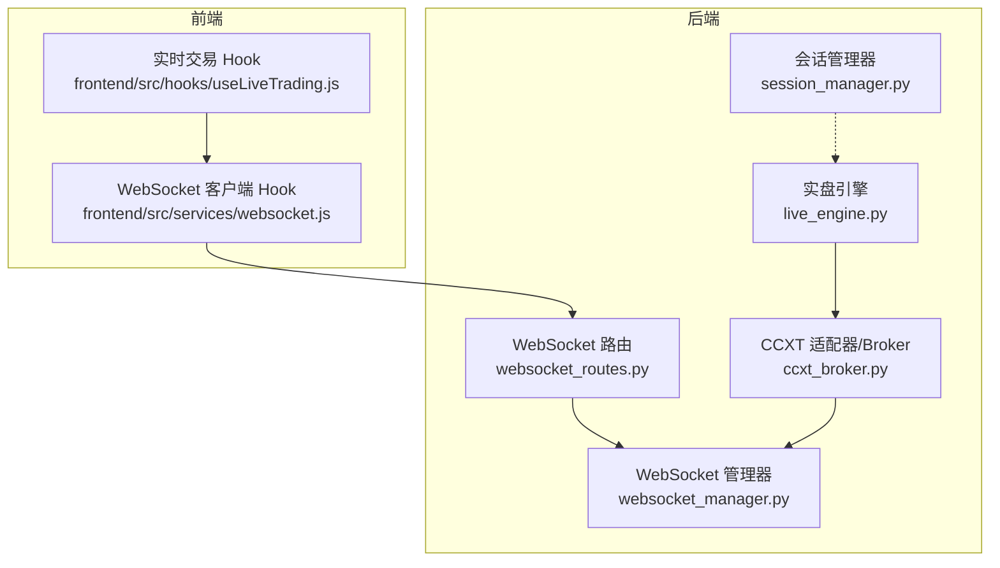
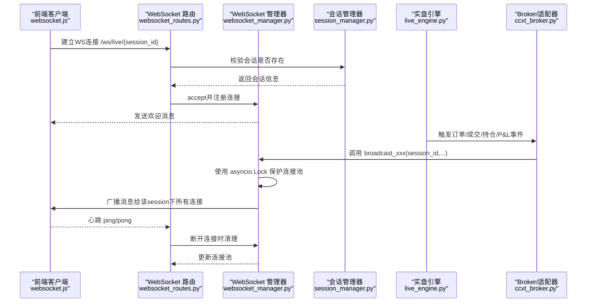
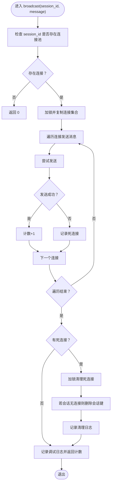
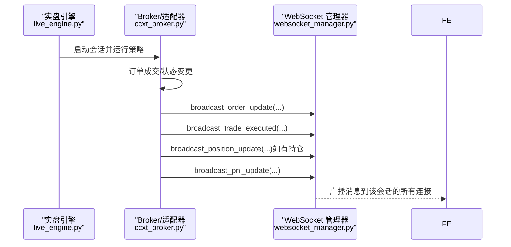
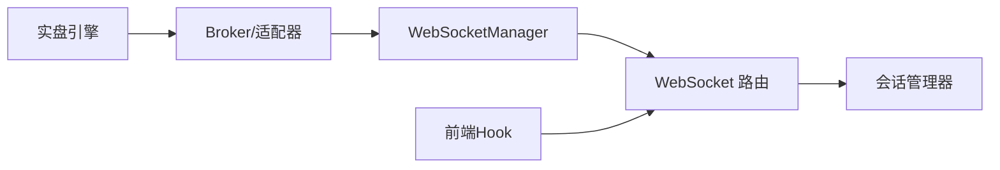

# 广播机制与事件推送

<cite>
**本文引用的文件列表**
- [websocket_manager.py](file://backend/src/service/websocket_manager.py)
- [websocket_routes.py](file://backend/src/routes/websocket_routes.py)
- [session_manager.py](file://backend/src/service/session_manager.py)
- [live_engine.py](file://backend/src/service/live_engine.py)
- [ccxt_broker.py](file://backend/src/brokers/ccxt_adapter/ccxt_broker.py)
- [websocket.js](file://frontend/src/services/websocket.js)
- [useLiveTrading.js](file://frontend/src/hooks/useLiveTrading.js)
</cite>

## 目录
1. [简介](#简介)
2. [项目结构](#项目结构)
3. [核心组件](#核心组件)
4. [架构总览](#架构总览)
5. [详细组件分析](#详细组件分析)
6. [依赖关系分析](#依赖关系分析)
7. [性能考量](#性能考量)
8. [故障排查指南](#故障排查指南)
9. [结论](#结论)
10. [附录：压力测试与优化建议](#附录压力测试与优化建议)

## 简介
本文件聚焦于WebSocketManager的广播机制实现原理，系统性解析以下主题：
- broadcast()方法的线程安全设计（asyncio.Lock）
- 死连接清理机制
- 批量推送优化策略
- 基于session_id的连接池管理方式
- 一对多的实时数据推送
- 上游组件（如live_engine.py、ccxt_broker.py）调用broadcast_xxx系列方法的场景
- 事件驱动架构下的消息发布流程
- 高并发场景下的性能优化建议与压力测试指导

## 项目结构
后端采用FastAPI + asyncio异步模型，WebSocket路由负责接入，WebSocketManager集中管理连接并进行广播；上游引擎在交易执行时触发广播；前端通过React Hook建立长连接并接收实时消息。

图表来源
- [websocket_routes.py](file://backend/src/routes/websocket_routes.py#L1-L239)
- [websocket_manager.py](file://backend/src/service/websocket_manager.py#L1-L401)
- [session_manager.py](file://backend/src/service/session_manager.py#L1-L410)
- [live_engine.py](file://backend/src/service/live_engine.py#L1-L329)
- [ccxt_broker.py](file://backend/src/brokers/ccxt_adapter/ccxt_broker.py#L390-L545)
- [websocket.js](file://frontend/src/services/websocket.js#L1-L282)
- [useLiveTrading.js](file://frontend/src/hooks/useLiveTrading.js#L1-L200)

章节来源
- [websocket_routes.py](file://backend/src/routes/websocket_routes.py#L1-L239)
- [websocket_manager.py](file://backend/src/service/websocket_manager.py#L1-L401)
- [session_manager.py](file://backend/src/service/session_manager.py#L1-L410)
- [live_engine.py](file://backend/src/service/live_engine.py#L1-L329)
- [ccxt_broker.py](file://backend/src/brokers/ccxt_adapter/ccxt_broker.py#L390-L545)
- [websocket.js](file://frontend/src/services/websocket.js#L1-L282)
- [useLiveTrading.js](file://frontend/src/hooks/useLiveTrading.js#L1-L200)

## 核心组件
- WebSocketManager：维护按session_id分组的连接集合，提供广播接口与各类业务广播方法，内置asyncio.Lock保证并发安全。
- WebSocket 路由：校验会话存在性，接受连接，维持心跳，断开时清理连接。
- 会话管理器：生命周期管理、状态跟踪，为WebSocket路由提供会话存在性校验。
- 实盘引擎与Broker：在订单成交、持仓变化、P&L更新等事件发生时，调用WebSocketManager的广播方法。
- 前端Hook：建立WebSocket连接、发送心跳、处理消息类型、自动重连。

章节来源
- [websocket_manager.py](file://backend/src/service/websocket_manager.py#L1-L401)
- [websocket_routes.py](file://backend/src/routes/websocket_routes.py#L1-L239)
- [session_manager.py](file://backend/src/service/session_manager.py#L1-L410)
- [live_engine.py](file://backend/src/service/live_engine.py#L1-L329)
- [ccxt_broker.py](file://backend/src/brokers/ccxt_adapter/ccxt_broker.py#L390-L545)
- [websocket.js](file://frontend/src/services/websocket.js#L1-L282)
- [useLiveTrading.js](file://frontend/src/hooks/useLiveTrading.js#L1-L200)

## 架构总览
WebSocketManager作为事件分发中心，上游组件在业务事件发生时调用其广播方法，路由层负责连接生命周期管理，前端通过Hook订阅实时消息。

图表来源
- [websocket_routes.py](file://backend/src/routes/websocket_routes.py#L1-L239)
- [websocket_manager.py](file://backend/src/service/websocket_manager.py#L1-L401)
- [session_manager.py](file://backend/src/service/session_manager.py#L1-L410)
- [live_engine.py](file://backend/src/service/live_engine.py#L1-L329)
- [ccxt_broker.py](file://backend/src/brokers/ccxt_adapter/ccxt_broker.py#L390-L545)
- [websocket.js](file://frontend/src/services/websocket.js#L1-L282)

## 详细组件分析

### WebSocketManager 广播机制与线程安全
- 连接池管理
  - 以session_id为键，维护Set[WebSocket]的连接池，支持多会话并行。
  - 连接/断开均在asyncio.Lock保护下进行，避免竞态条件。
- broadcast()方法的线程安全设计
  - 在进入广播前复制当前会话的连接集合，避免迭代期间连接被增删导致异常。
  - 对每个连接单独try/except发送，记录失败的死连接，随后统一清理。
  - 清理阶段再次使用asyncio.Lock，确保连接池一致性。
- 死连接清理机制
  - 收集发送失败的连接，断开后从连接池移除；若会话无连接则删除该会话键。
  - 日志记录清理数量，便于监控。
- 批量推送优化策略
  - 复制连接集合避免锁持有时间过长。
  - 单条消息逐个发送，减少单次阻塞；可考虑在上层聚合消息后再调用broadcast()以降低调用次数。
  - 前端心跳保持连接活跃，减少因超时导致的发送异常。
- 基于session_id的一对多推送
  - 每个session_id对应一组WebSocket连接，广播时仅遍历该集合，天然实现一对多。
- 典型广播方法
  - broadcast_position_update / broadcast_order_update / broadcast_pnl_update / broadcast_trade_executed / broadcast_log / broadcast_error / broadcast_status_change
  - 内部统一调用broadcast(session_id, message)，message包含type与data字段。

图表来源
- [websocket_manager.py](file://backend/src/service/websocket_manager.py#L91-L148)

章节来源
- [websocket_manager.py](file://backend/src/service/websocket_manager.py#L1-L401)

### WebSocket 路由与心跳保活
- 连接建立
  - 校验session存在性，否则关闭连接。
  - 调用WebSocketManager.connect()完成accept与注册。
- 心跳保活
  - 接收客户端ping或{"type":"ping"}，立即回复{"type":"pong"}。
  - 前端Hook周期性发送ping，避免中间设备断开。
- 断开清理
  - 捕获WebSocketDisconnect与异常，在finally中调用WebSocketManager.disconnect()清理。

章节来源
- [websocket_routes.py](file://backend/src/routes/websocket_routes.py#L1-L239)
- [websocket.js](file://frontend/src/services/websocket.js#L1-L282)

### 会话管理器与上游调用链
- 会话管理器
  - 提供创建、启动、停止、查询、统计等能力，为WebSocket路由提供会话存在性校验。
- 上游调用
  - 实盘引擎在后台线程运行Cerebro，Broker在订单成交时调用WebSocketManager的广播方法，实现事件驱动的消息发布。
  - Broker侧在成交后依次广播：订单更新、成交回报、持仓更新、P&L更新。

图表来源
- [live_engine.py](file://backend/src/service/live_engine.py#L1-L329)
- [ccxt_broker.py](file://backend/src/brokers/ccxt_adapter/ccxt_broker.py#L390-L545)
- [websocket_manager.py](file://backend/src/service/websocket_manager.py#L1-L401)

章节来源
- [session_manager.py](file://backend/src/service/session_manager.py#L1-L410)
- [live_engine.py](file://backend/src/service/live_engine.py#L1-L329)
- [ccxt_broker.py](file://backend/src/brokers/ccxt_adapter/ccxt_broker.py#L390-L545)

### 前端实时订阅与消息处理
- 连接与心跳
  - 自动连接指定session_id的WebSocket，周期性发送ping，收到pong确认心跳。
  - 断线自动重连，最多尝试若干次。
- 消息解析
  - 解析服务端下发的消息，区分connected、position、order、pnl、trade、log、error、status等类型。
- 通知与UI更新
  - 根据消息类型更新UI状态、弹出通知、刷新图表与表格。

章节来源
- [websocket.js](file://frontend/src/services/websocket.js#L1-L282)
- [useLiveTrading.js](file://frontend/src/hooks/useLiveTrading.js#L1-L200)

## 依赖关系分析
- 组件耦合
  - WebSocketManager与FastAPI WebSocket强耦合，但内部通过asyncio.Lock隔离并发风险。
  - WebSocket路由依赖会话管理器进行会话校验，依赖WebSocketManager进行连接管理。
  - Broker依赖WebSocketManager进行事件广播，依赖会话ID进行分发。
- 可能的循环依赖
  - 当前模块间为单向依赖，未发现循环导入。
- 外部依赖
  - FastAPI、asyncio、logging、json等标准库。

图表来源
- [websocket_manager.py](file://backend/src/service/websocket_manager.py#L1-L401)
- [websocket_routes.py](file://backend/src/routes/websocket_routes.py#L1-L239)
- [session_manager.py](file://backend/src/service/session_manager.py#L1-L410)
- [live_engine.py](file://backend/src/service/live_engine.py#L1-L329)
- [ccxt_broker.py](file://backend/src/brokers/ccxt_adapter/ccxt_broker.py#L390-L545)
- [websocket.js](file://frontend/src/services/websocket.js#L1-L282)

## 性能考量
- 并发与锁粒度
  - broadcast()在复制连接集合后释放锁，再逐个发送，避免长时间持锁。
  - 死连接清理在独立分支进行，减少对主广播路径的影响。
- 批量优化建议
  - 上层聚合高频事件（如多个订单同时成交），合并为更少的广播调用，降低锁竞争与网络往返。
  - 对相同数据的多次广播，可在上层去重或延迟合并。
- 心跳与保活
  - 前端固定间隔发送ping，服务端立即响应pong，减少空闲连接被中间设备回收的概率。
- 资源管理
  - 断开时及时清理连接池，避免内存泄漏。
- 监控与日志
  - 记录发送计数、清理数量、异常信息，便于定位热点会话与异常连接。

[本节为通用性能讨论，不直接分析具体文件]

## 故障排查指南
- 连接无法建立
  - 检查会话是否存在（WebSocket路由会在会话不存在时关闭连接）。
  - 查看WebSocketManager的日志，确认connect是否被调用。
- 消息未到达
  - 检查broadcast()返回值，若为0可能表示会话无连接或连接已清理。
  - 关注死连接清理日志，确认是否有大量异常导致连接被移除。
- 心跳失效
  - 前端未发送ping或未收到pong，检查前端Hook的心跳定时器与网络状况。
  - 服务端未响应pong，检查WebSocket路由的ping/pong处理逻辑。
- 异常断开
  - 捕获WebSocketDisconnect与异常，确认finally中是否调用了disconnect()。
- 性能问题
  - 高频事件导致广播压力大，考虑上层合并策略或限流。

章节来源
- [websocket_routes.py](file://backend/src/routes/websocket_routes.py#L1-L239)
- [websocket_manager.py](file://backend/src/service/websocket_manager.py#L1-L401)
- [websocket.js](file://frontend/src/services/websocket.js#L1-L282)

## 结论
WebSocketManager通过asyncio.Lock实现了广播过程中的线程安全，结合死连接清理与心跳保活，构建了稳定的一对多实时推送通道。上游引擎与Broker在关键业务节点触发广播，前端Hook负责订阅与展示，形成清晰的事件驱动架构。通过合理的批量优化与监控告警，可在高并发场景下保持良好的吞吐与稳定性。

[本节为总结性内容，不直接分析具体文件]

## 附录：压力测试与优化建议
- 压力测试建议
  - 场景一：单会话多连接（N个客户端同时订阅同一session_id），观察broadcast()耗时与清理频率。
  - 场景二：多会话并发（M个不同session_id），评估连接池增长与锁竞争。
  - 场景三：高吞吐事件（每秒大量订单成交），验证上层是否需要合并广播。
  - 指标：每秒广播次数、平均发送耗时、死连接清理率、CPU/内存占用。
- 优化建议
  - 上层聚合：将短时间内的多次广播合并为一次，减少锁竞争与网络开销。
  - 分片广播：对超大会话拆分推送（如按symbol分组），降低单次广播规模。
  - 缓存与去重：对重复消息进行缓存与去重，避免冗余推送。
  - 背压控制：在队列深度或内存阈值过高时降级或限速。
  - 监控埋点：在broadcast()前后增加计时与计数，结合日志输出关键指标。

[本节为通用指导，不直接分析具体文件]