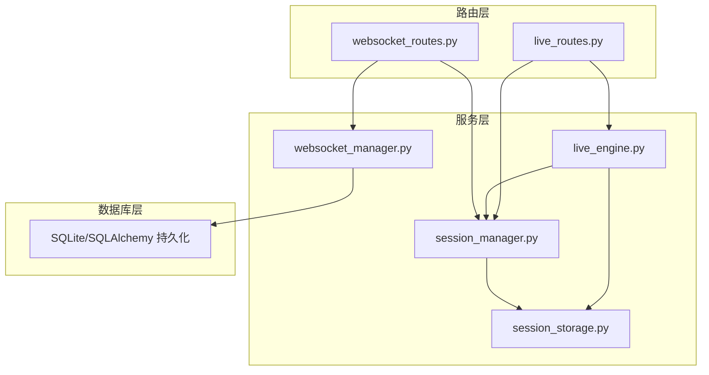
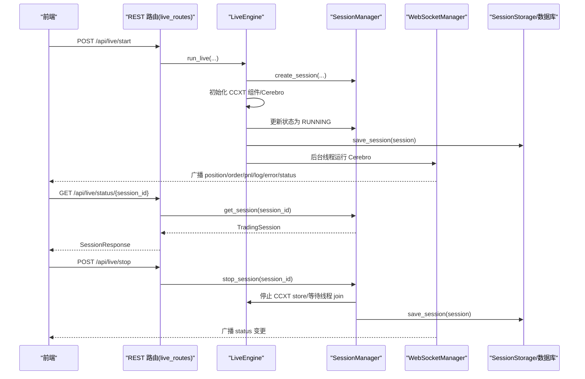
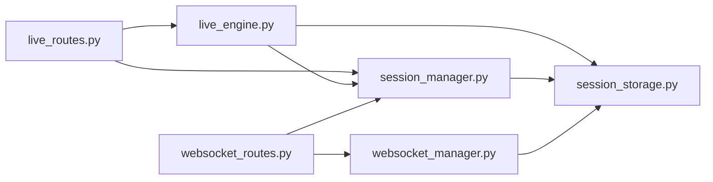

# 会话状态管理

<cite>
**本文引用的文件列表**
- [session_manager.py](file://backend/src/service/session_manager.py)
- [live_engine.py](file://backend/src/service/live_engine.py)
- [websocket_routes.py](file://backend/src/routes/websocket_routes.py)
- [websocket_manager.py](file://backend/src/service/websocket_manager.py)
- [live_routes.py](file://backend/src/routes/live_routes.py)
- [session_storage.py](file://backend/src/db/session_storage.py)
- [test_session_manager.py](file://auto_test/test_session_manager.py)
- [test_support.py](file://auto_test/test_support.py)
</cite>

## 目录
1. [引言](#引言)
2. [项目结构](#项目结构)
3. [核心组件](#核心组件)
4. [架构总览](#架构总览)
5. [详细组件分析](#详细组件分析)
6. [依赖关系分析](#依赖关系分析)
7. [性能考量](#性能考量)
8. [故障排查指南](#故障排查指南)
9. [结论](#结论)

## 引言
本文件围绕 SessionManager 单例类的设计与实现进行系统化说明，重点覆盖以下方面：
- 交易会话的全生命周期管理：创建、启动、停止、状态查询与统计
- 线程安全的会话访问机制
- 关键方法（如 create_session、stop_session、list_sessions）的使用方式与边界条件
- 会话状态与 WebSocket 连接的关联机制
- 在系统异常时的恢复策略与错误处理

## 项目结构
后端采用分层设计：路由层负责对外接口，服务层负责业务编排（引擎与会话管理），数据库层负责持久化，前端通过 WebSocket 实时接收会话状态变化。

图表来源
- [live_routes.py](file://backend/src/routes/live_routes.py#L1-L423)
- [websocket_routes.py](file://backend/src/routes/websocket_routes.py#L1-L239)
- [live_engine.py](file://backend/src/service/live_engine.py#L1-L329)
- [session_manager.py](file://backend/src/service/session_manager.py#L1-L410)
- [websocket_manager.py](file://backend/src/service/websocket_manager.py#L1-L401)
- [session_storage.py](file://backend/src/db/session_storage.py#L1-L392)

章节来源
- [live_routes.py](file://backend/src/routes/live_routes.py#L1-L423)
- [websocket_routes.py](file://backend/src/routes/websocket_routes.py#L1-L239)
- [live_engine.py](file://backend/src/service/live_engine.py#L1-L329)
- [session_manager.py](file://backend/src/service/session_manager.py#L1-L410)
- [websocket_manager.py](file://backend/src/service/websocket_manager.py#L1-L401)
- [session_storage.py](file://backend/src/db/session_storage.py#L1-L392)

## 核心组件
- SessionManager 单例：集中管理多个并发交易会话，提供创建、注册、更新、查询、停止、统计等能力，并确保线程安全。
- TradingSession 数据模型：封装会话的配置、运行期对象（Cerebro、Store、线程）、状态与指标。
- LiveEngine：负责构建 CCXT 组件、启动 Cerebro 线程、更新会话状态并在异常时标记错误状态。
- WebSocketManager：维护每个会话的 WebSocket 连接池，广播实时事件（位置、订单、P&L、日志、错误、状态变更）。
- WebSocket 路由：为前端提供 /ws/live/{session_id} 的实时订阅通道，并在连接建立/断开时与 WebSocketManager 协作。
- SessionStorage：将会话状态持久化到数据库，支持加载、保存、统计与删除。

章节来源
- [session_manager.py](file://backend/src/service/session_manager.py#L1-L410)
- [live_engine.py](file://backend/src/service/live_engine.py#L1-L329)
- [websocket_manager.py](file://backend/src/service/websocket_manager.py#L1-L401)
- [websocket_routes.py](file://backend/src/routes/websocket_routes.py#L1-L239)
- [session_storage.py](file://backend/src/db/session_storage.py#L1-L392)

## 架构总览
下图展示从 REST 接口到会话管理、引擎执行、WebSocket 广播与数据库持久化的整体流程。

图表来源
- [live_routes.py](file://backend/src/routes/live_routes.py#L100-L247)
- [live_engine.py](file://backend/src/service/live_engine.py#L100-L305)
- [session_manager.py](file://backend/src/service/session_manager.py#L133-L396)
- [websocket_manager.py](file://backend/src/service/websocket_manager.py#L45-L148)
- [websocket_routes.py](file://backend/src/routes/websocket_routes.py#L21-L214)
- [session_storage.py](file://backend/src/db/session_storage.py#L59-L118)

## 详细组件分析

### SessionManager 单例类
- 设计要点
  - 单例模式：双重检查锁确保全局唯一实例，避免重复初始化。
  - 线程安全：使用可重入锁保护会话字典与状态更新；对敏感操作加锁，防止竞态。
  - 生命周期管理：提供创建、注册、更新、查询、停止、批量停止、统计等方法。
  - 状态枚举：SessionStatus 定义 starting、running、stopping、stopped、error 五种状态。
  - 数据模型：TradingSession 包含会话配置、运行期对象（cerebro、store、thread）、指标与错误信息，并提供 to_dict 序列化。

- 关键方法与边界条件
  - create_session(session_id, ...)：若 session_id 已存在则抛出异常；返回新建会话对象。
  - register_session(session)：注册已存在的会话对象；若 ID 冲突则抛出异常。
  - get_session(session_id)：按 ID 获取会话，不存在返回 None。
  - update_session(session_id, **kwargs)：仅允许更新会话对象上的属性；不存在不报错但记录警告。
  - stop_session(session_id, timeout)：将状态置为 stopping，尝试停止 store 并等待线程 join；超时未停则返回 False；异常时置为 error 并记录错误消息。
  - list_sessions(status_filter=None, active_only=False)：支持按状态过滤或仅活跃会话；返回会话列表。
  - get_active_session_count()：统计活跃会话数量。
  - remove_session(session_id)：移除跟踪中的会话；若仍处于活跃状态发出警告。
  - stop_all_sessions(timeout)：遍历所有活跃会话逐一停止，返回各会话停止结果。
  - get_session_count()：按状态统计会话数量并包含总数与活跃数。

- 线程安全策略
  - 所有读写 _sessions 字典的操作均在 _sessions_lock 下进行。
  - 对外暴露的方法内部统一加锁，避免并发修改导致的数据不一致。
  - 状态转换与持久化调用在锁内完成，确保一致性。

- 与 WebSocket 的关联
  - WebSocket 路由在连接建立时校验会话是否存在，随后通过 WebSocketManager 将连接加入会话池。
  - 当会话状态发生改变（例如从 running 到 stopped 或 error），WebSocketManager 可以广播 status 类型消息，前端据此刷新 UI。

- 与数据库的协作
  - LiveEngine 在会话状态变化（启动、正常结束、异常）时调用 SessionStorage.save_session，确保状态持久化。
  - SessionStorage 提供 save/load/list/delete 等操作，支持按状态过滤与分页。

- 测试用例验证
  - 自动化测试覆盖了 create/get、stop、stop_all 等关键路径，验证状态变更与时间戳设置。

章节来源
- [session_manager.py](file://backend/src/service/session_manager.py#L1-L410)
- [test_session_manager.py](file://auto_test/test_session_manager.py#L1-L71)
- [test_support.py](file://auto_test/test_support.py#L1-L47)

### TradingSession 数据模型
- 字段与用途
  - 配置字段：strategy_name、symbol、exchange、mode、timeframe、initial_cash、commission
  - 状态字段：status、start_time、end_time
  - 运行期对象：cerebro、store、thread
  - 指标与追踪：current_pnl、total_trades、positions、orders、error_message
  - 序列化：to_dict 输出 API 友好的结构，包含 open_orders（未平仓订单）
  - 辅助方法：is_active、is_stopped

- 复杂度与性能
  - to_dict 为 O(n)（n 为 orders 数量），用于前端渲染；orders 列表在会话中频繁更新，建议在高频场景下谨慎序列化。
  - is_active/is_stopped 为 O(1)，用于快速判断。

章节来源
- [session_manager.py](file://backend/src/service/session_manager.py#L29-L94)

### LiveEngine 与会话生命周期
- 启动流程
  - 生成 session_id（若未提供）
  - 调用 SessionManager.create_session 创建会话
  - 加载策略类与 broker 配置，初始化 CCXT 组件与 Cerebro
  - 将 cerebro、store 注入会话，并持久化保存
  - 在后台线程中将状态置为 running 并运行 cerebro
  - 正常结束或异常时更新状态、时间戳与错误信息，并持久化保存

- 停止流程
  - 通过 SessionManager.stop_session 触发停止逻辑
  - 停止 store、等待线程 join、更新状态为 stopped
  - 异常时置为 error 并记录错误消息

- 错误处理
  - 在 run_cerebro 中捕获异常，设置 error 状态与错误消息
  - 在 stop_live 中对找不到会话或停止失败抛出 HTTP 异常

章节来源
- [live_engine.py](file://backend/src/service/live_engine.py#L100-L305)

### WebSocket 管理与状态联动
- WebSocket 路由
  - /ws/live/{session_id}：校验会话存在性，接入 WebSocketManager，处理 ping/pong 与 keep-alive
  - /ws/info：返回 WebSocket 端点、连接数、消息类型等信息

- WebSocketManager
  - 维护 session_id -> Set[WebSocket] 的连接池
  - 广播各类消息（position、order、pnl、trade、log、error、status）
  - 清理断连的客户端，自动移除空会话

- 与 SessionManager 的交互
  - 路由层在连接建立时校验 get_session(session_id) 是否存在
  - 当会话状态变化（starting/running/stopping/stopped/error）时，可通过 WebSocketManager 广播 status 消息，前端据此更新 UI

章节来源
- [websocket_routes.py](file://backend/src/routes/websocket_routes.py#L21-L214)
- [websocket_manager.py](file://backend/src/service/websocket_manager.py#L1-L401)

### 数据持久化与恢复策略
- SessionStorage
  - save_session：根据是否存在记录决定新增或更新，写入状态、时间戳、指标与错误信息
  - load_session：从数据库加载会话并转换为 TradingSession
  - list_sessions：支持按状态过滤与分页
  - get_session_count：按状态统计总数

- 恢复策略
  - 系统重启后，可通过 load_session 重建内存中的会话状态
  - 对于异常终止的会话，状态被标记为 error，前端可据此提示用户重新启动或清理
  - 建议在系统启动时扫描数据库中未结束的会话并进行一致性检查

章节来源
- [session_storage.py](file://backend/src/db/session_storage.py#L59-L118)
- [session_storage.py](file://backend/src/db/session_storage.py#L124-L168)
- [session_storage.py](file://backend/src/db/session_storage.py#L173-L234)
- [session_storage.py](file://backend/src/db/session_storage.py#L361-L392)

## 依赖关系分析
- 组件耦合
  - live_routes 依赖 live_engine 与 session_manager，用于启动、停止、查询与列出会话
  - live_engine 依赖 session_manager 与 session_storage，用于状态更新与持久化
  - websocket_routes 依赖 websocket_manager 与 session_manager，用于连接建立与状态广播
  - websocket_manager 与 session_storage 独立工作，分别负责连接池与数据持久化

- 外部依赖
  - Backtrader（Cerebro）、CCXT（Store/Broker/Data）、FastAPI（WebSocket/HTTP）、SQLAlchemy（数据库）

图表来源
- [live_routes.py](file://backend/src/routes/live_routes.py#L1-L423)
- [live_engine.py](file://backend/src/service/live_engine.py#L1-L329)
- [session_manager.py](file://backend/src/service/session_manager.py#L1-L410)
- [websocket_routes.py](file://backend/src/routes/websocket_routes.py#L1-L239)
- [websocket_manager.py](file://backend/src/service/websocket_manager.py#L1-L401)
- [session_storage.py](file://backend/src/db/session_storage.py#L1-L392)

## 性能考量
- 线程安全成本
  - 所有会话读写均在锁内进行，高并发场景下应尽量减少锁持有时间，避免阻塞其他请求
- WebSocket 广播
  - 广播时复制连接集合，避免迭代期间集合被修改；对发送失败的连接进行清理，降低后续广播成本
- 序列化与传输
  - to_dict 与 orders 列表在高频场景下可能成为瓶颈，建议前端按需请求或分页获取
- 数据库写入
  - save_session 使用事务提交，异常回滚；批量停止时多次写入，建议在业务层合并状态更新以减少写入次数

## 故障排查指南
- 常见问题与定位
  - 会话无法停止：检查 stop_session 的 timeout 设置是否过短；查看线程 join 是否成功；确认 store.stop 是否抛出异常
  - 会话状态异常：LiveEngine 在异常时会将状态置为 error 并记录错误消息；通过 get_session 查询 error_message 定位问题
  - WebSocket 不推送：确认 /ws/live/{session_id} 是否正确连接；检查 WebSocketManager 的连接池与广播逻辑；关注断连清理日志
  - REST 接口 404/500：核对 session_id 是否存在；检查 live_routes 的参数校验与异常分支

- 关键日志点
  - SessionManager：创建、更新、停止、移除、批量停止等关键动作均有日志输出
  - LiveEngine：会话启动、状态切换、异常捕获、存储保存等
  - WebSocketManager：连接/断开、广播、清理死连接等
  - WebSocket 路由：连接校验、消息处理、异常捕获

章节来源
- [session_manager.py](file://backend/src/service/session_manager.py#L133-L396)
- [live_engine.py](file://backend/src/service/live_engine.py#L200-L248)
- [websocket_manager.py](file://backend/src/service/websocket_manager.py#L45-L148)
- [websocket_routes.py](file://backend/src/routes/websocket_routes.py#L160-L214)

## 结论
SessionManager 通过单例与锁保障了多会话并发下的线程安全，结合 LiveEngine 的状态机与 WebSocketManager 的实时广播，形成了完整的交易会话生命周期闭环。配合 SessionStorage 的持久化能力，系统具备良好的可观测性与可恢复性。建议在高并发场景下进一步优化锁粒度与序列化频率，并完善异常恢复策略（如自动重试与告警）以提升稳定性。