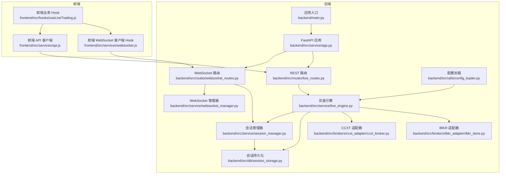
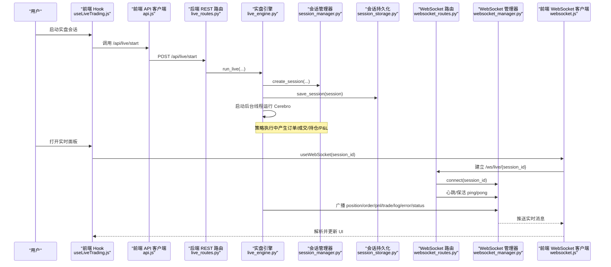
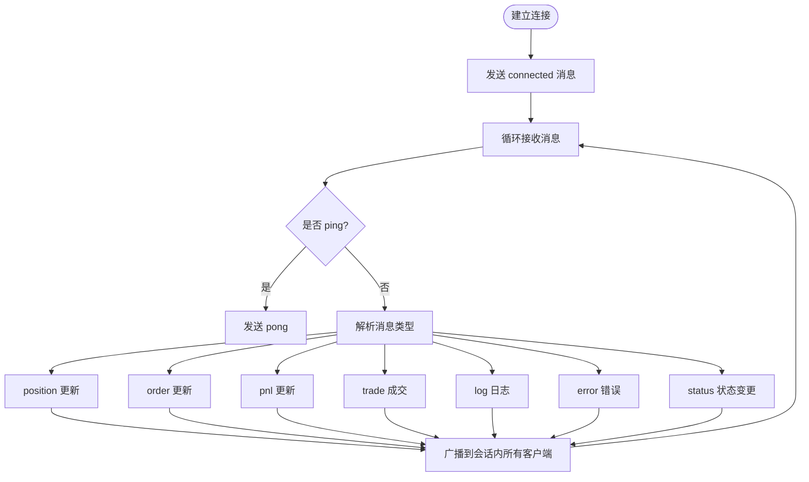
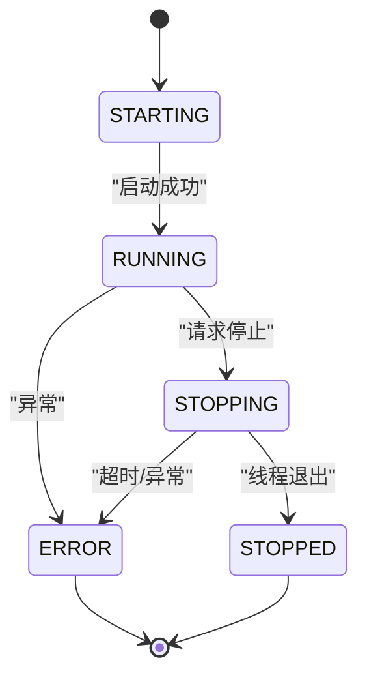
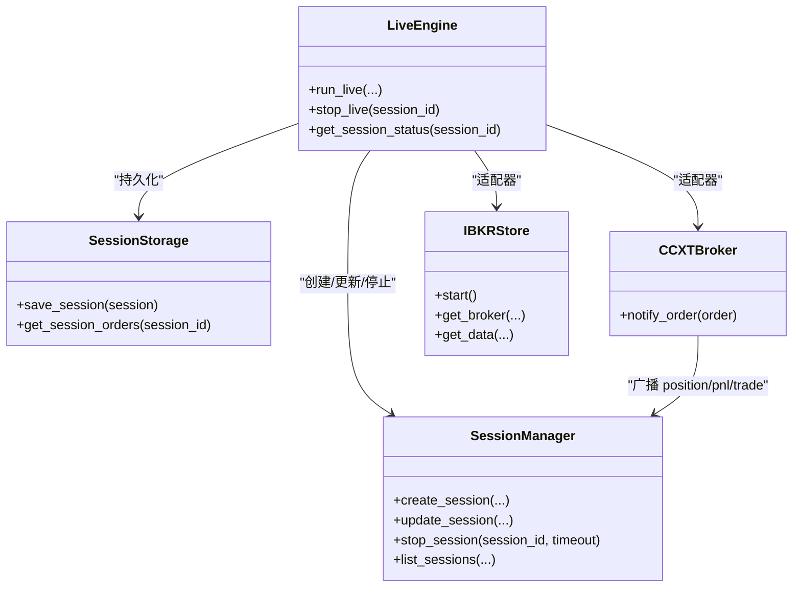
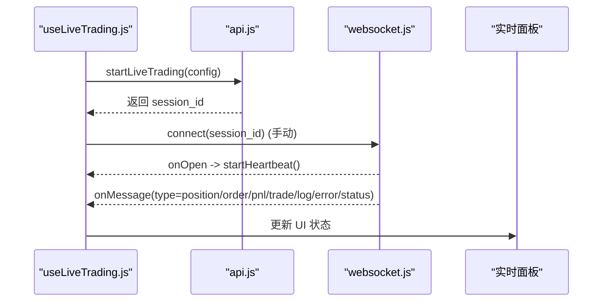
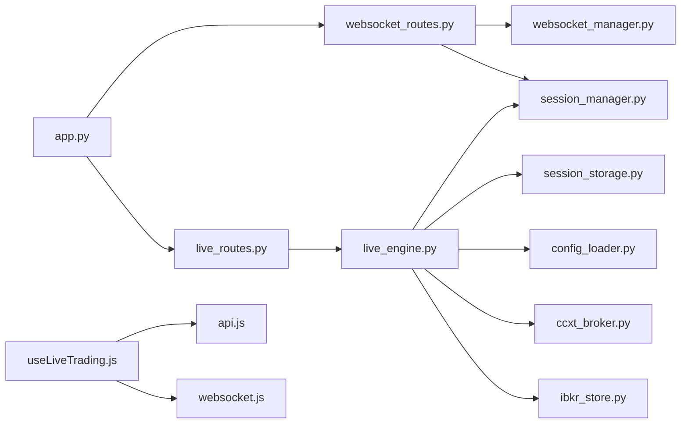

# 数据流与通信

<cite>
**本文引用的文件**
- [backend/main.py](file://backend/main.py)
- [backend/api.py](file://backend/api.py)
- [backend/src/service/app.py](file://backend/src/service/app.py)
- [backend/src/routes/websocket_routes.py](file://backend/src/routes/websocket_routes.py)
- [backend/src/service/websocket_manager.py](file://backend/src/service/websocket_manager.py)
- [backend/src/service/session_manager.py](file://backend/src/service/session_manager.py)
- [backend/src/service/live_engine.py](file://backend/src/service/live_engine.py)
- [backend/src/db/session_storage.py](file://backend/src/db/session_storage.py)
- [backend/src/utils/config_loader.py](file://backend/src/utils/config_loader.py)
- [backend/src/brokers/ccxt_adapter/ccxt_broker.py](file://backend/src/brokers/ccxt_adapter/ccxt_broker.py)
- [backend/src/brokers/ibkr_adapter/ibkr_store.py](file://backend/src/brokers/ibkr_adapter/ibkr_store.py)
- [frontend/src/services/api.js](file://frontend/src/services/api.js)
- [frontend/src/services/websocket.js](file://frontend/src/services/websocket.js)
- [frontend/src/hooks/useLiveTrading.js](file://frontend/src/hooks/useLiveTrading.js)
</cite>

## 目录
1. [简介](#简介)
2. [项目结构](#项目结构)
3. [核心组件](#核心组件)
4. [架构总览](#架构总览)
5. [详细组件分析](#详细组件分析)
6. [依赖关系分析](#依赖关系分析)
7. [性能考量](#性能考量)
8. [故障排查指南](#故障排查指南)
9. [结论](#结论)

## 简介
本文件聚焦于系统内部“数据流与通信”机制，完整梳理从前端API调用到后端服务、再到适配器与交易所交互、最终通过WebSocket实时推送至前端的全链路流程。重点解析：
- WebSocket 双向通信协议：消息格式、事件类型、心跳与重连策略、连接生命周期管理
- 会话状态管理：session_manager 如何维护交易会话状态并与各服务组件协同
- 实时数据广播：从策略执行到订单成交、持仓变动、P&L更新的广播路径
- 调试与优化：定位通信问题的方法、日志与监控点、性能优化建议

## 项目结构
系统采用前后端分离架构，后端基于 FastAPI 提供 REST API 与 WebSocket 路由，前端使用 React Hooks 与 WebSocket 客户端进行实时订阅。

图表来源
- [backend/main.py](file://backend/main.py#L1-L21)
- [backend/src/service/app.py](file://backend/src/service/app.py#L1-L31)
- [backend/src/routes/websocket_routes.py](file://backend/src/routes/websocket_routes.py#L1-L239)
- [backend/src/routes/live_routes.py](file://backend/src/routes/live_routes.py#L1-L423)
- [backend/src/service/websocket_manager.py](file://backend/src/service/websocket_manager.py#L1-L401)
- [backend/src/service/session_manager.py](file://backend/src/service/session_manager.py#L1-L410)
- [backend/src/service/live_engine.py](file://backend/src/service/live_engine.py#L1-L329)
- [backend/src/db/session_storage.py](file://backend/src/db/session_storage.py#L1-L392)
- [backend/src/utils/config_loader.py](file://backend/src/utils/config_loader.py#L173-L265)
- [backend/src/brokers/ccxt_adapter/ccxt_broker.py](file://backend/src/brokers/ccxt_adapter/ccxt_broker.py#L428-L462)
- [backend/src/brokers/ibkr_adapter/ibkr_store.py](file://backend/src/brokers/ibkr_adapter/ibkr_store.py#L1-L156)
- [frontend/src/services/api.js](file://frontend/src/services/api.js#L1-L255)
- [frontend/src/services/websocket.js](file://frontend/src/services/websocket.js#L1-L282)
- [frontend/src/hooks/useLiveTrading.js](file://frontend/src/hooks/useLiveTrading.js#L1-L281)

章节来源
- [backend/main.py](file://backend/main.py#L1-L21)
- [backend/src/service/app.py](file://backend/src/service/app.py#L1-L31)

## 核心组件
- WebSocket 管理器：集中管理每个会话的连接池、广播、心跳清理与连接统计
- 会话管理器：生命周期管理、状态机、线程安全访问、持久化协调
- 实盘引擎：策略加载、适配器初始化、Cerebro 运行、状态变更与持久化
- 配置加载：交换器与适配器选择、校验、可用市场列表
- 前端 API 客户端：REST 请求封装、鉴权注入、错误处理
- 前端 WebSocket 客户端 Hook：连接、心跳、自动重连、消息解析与事件分发

章节来源
- [backend/src/service/websocket_manager.py](file://backend/src/service/websocket_manager.py#L1-L401)
- [backend/src/service/session_manager.py](file://backend/src/service/session_manager.py#L1-L410)
- [backend/src/service/live_engine.py](file://backend/src/service/live_engine.py#L1-L329)
- [backend/src/utils/config_loader.py](file://backend/src/utils/config_loader.py#L173-L265)
- [frontend/src/services/api.js](file://frontend/src/services/api.js#L1-L255)
- [frontend/src/services/websocket.js](file://frontend/src/services/websocket.js#L1-L282)

## 架构总览
下图展示从用户操作到实时推送的关键序列：

图表来源
- [frontend/src/hooks/useLiveTrading.js](file://frontend/src/hooks/useLiveTrading.js#L127-L171)
- [frontend/src/services/api.js](file://frontend/src/services/api.js#L160-L176)
- [backend/src/routes/live_routes.py](file://backend/src/routes/live_routes.py#L100-L169)
- [backend/src/service/live_engine.py](file://backend/src/service/live_engine.py#L100-L260)
- [backend/src/service/session_manager.py](file://backend/src/service/session_manager.py#L133-L217)
- [backend/src/db/session_storage.py](file://backend/src/db/session_storage.py#L59-L119)
- [backend/src/routes/websocket_routes.py](file://backend/src/routes/websocket_routes.py#L21-L215)
- [backend/src/service/websocket_manager.py](file://backend/src/service/websocket_manager.py#L45-L149)
- [frontend/src/services/websocket.js](file://frontend/src/services/websocket.js#L96-L202)

## 详细组件分析

### WebSocket 协议与消息格式
- 服务器端消息类型
  - connected：连接确认
  - position：持仓更新
  - order：订单更新
  - pnl：收益与资产更新
  - trade：成交记录
  - log：策略日志
  - error：错误通知
  - status：会话状态变更
- 客户端消息类型
  - ping：心跳保活，服务器返回 pong
- 心跳与保活
  - 前端定时发送 ping，收到 pong 后确认连接有效
  - 断线自动重连，可配置最大重试次数与间隔
- 连接管理
  - 按会话维度维护连接集合
  - 广播时复制连接集合，避免迭代期间修改
  - 发送失败自动清理死连接
  - 支持查询当前连接数与已连接会话列表

图表来源
- [backend/src/routes/websocket_routes.py](file://backend/src/routes/websocket_routes.py#L35-L151)
- [backend/src/service/websocket_manager.py](file://backend/src/service/websocket_manager.py#L150-L349)
- [frontend/src/services/websocket.js](file://frontend/src/services/websocket.js#L72-L101)

章节来源
- [backend/src/routes/websocket_routes.py](file://backend/src/routes/websocket_routes.py#L21-L215)
- [backend/src/service/websocket_manager.py](file://backend/src/service/websocket_manager.py#L1-L401)
- [frontend/src/services/websocket.js](file://frontend/src/services/websocket.js#L1-L282)

### 会话状态管理（session_manager）
- 生命周期
  - 创建：创建会话对象并注册到管理器
  - 启动：后台线程运行 Cerebro，状态置为 running
  - 停止：优雅关闭，等待线程结束，更新状态与结束时间
  - 清理：移除跟踪或强制停止
- 状态机
  - STARTING → RUNNING → STOPPING → STOPPED 或 ERROR
- 线程安全
  - 使用 RLock 保护会话字典读写
- 统计与查询
  - 活跃会话计数、按状态计数、列出会话
- 与持久化的协作
  - 启动/停止/更新均保存到数据库

图表来源
- [backend/src/service/session_manager.py](file://backend/src/service/session_manager.py#L20-L95)
- [backend/src/service/session_manager.py](file://backend/src/service/session_manager.py#L133-L217)
- [backend/src/service/session_manager.py](file://backend/src/service/session_manager.py#L238-L292)
- [backend/src/db/session_storage.py](file://backend/src/db/session_storage.py#L59-L119)

章节来源
- [backend/src/service/session_manager.py](file://backend/src/service/session_manager.py#L1-L410)
- [backend/src/db/session_storage.py](file://backend/src/db/session_storage.py#L1-L392)

### 实盘引擎与适配器
- 组件装配
  - 根据配置选择 CCXT 或 IBKR 适配器
  - 初始化 Store、Broker、DataFeed
  - 添加分析器（夏普比率、回撤、收益、交易记录）
- 运行与状态
  - 后台线程运行 Cerebro，状态在开始/结束/异常时更新
  - 将运行期对象（cerebro/store/thread）存入会话
- 订单与成交事件
  - 订单完成时计算 P&L、手续费、收益
  - 触发 position/pnl/trade 的广播
- 与数据库
  - 启动/停止/更新均持久化

图表来源
- [backend/src/service/live_engine.py](file://backend/src/service/live_engine.py#L100-L260)
- [backend/src/service/session_manager.py](file://backend/src/service/session_manager.py#L133-L217)
- [backend/src/db/session_storage.py](file://backend/src/db/session_storage.py#L59-L119)
- [backend/src/brokers/ccxt_adapter/ccxt_broker.py](file://backend/src/brokers/ccxt_adapter/ccxt_broker.py#L428-L462)
- [backend/src/brokers/ibkr_adapter/ibkr_store.py](file://backend/src/brokers/ibkr_adapter/ibkr_store.py#L82-L156)

章节来源
- [backend/src/service/live_engine.py](file://backend/src/service/live_engine.py#L1-L329)
- [backend/src/brokers/ccxt_adapter/ccxt_broker.py](file://backend/src/brokers/ccxt_adapter/ccxt_broker.py#L428-L462)
- [backend/src/brokers/ibkr_adapter/ibkr_store.py](file://backend/src/brokers/ibkr_adapter/ibkr_store.py#L1-L156)

### 前端 API 与 WebSocket 集成
- API 客户端
  - 自动注入 Authorization 头（若存在令牌）
  - 统一错误处理，401 时可触发登录跳转
- WebSocket 客户端 Hook
  - 自动连接、心跳、断线重连
  - 消息解析与事件分发（位置、订单、P&L、成交、日志、错误、状态）
- 业务 Hook useLiveTrading
  - 启动会话后手动连接 WebSocket，避免自动重连导致的异常回环
  - 根据消息类型更新 UI 状态与统计数据

图表来源
- [frontend/src/hooks/useLiveTrading.js](file://frontend/src/hooks/useLiveTrading.js#L127-L171)
- [frontend/src/services/api.js](file://frontend/src/services/api.js#L160-L176)
- [frontend/src/services/websocket.js](file://frontend/src/services/websocket.js#L96-L202)

章节来源
- [frontend/src/services/api.js](file://frontend/src/services/api.js#L1-L255)
- [frontend/src/services/websocket.js](file://frontend/src/services/websocket.js#L1-L282)
- [frontend/src/hooks/useLiveTrading.js](file://frontend/src/hooks/useLiveTrading.js#L1-L281)

## 依赖关系分析
- 后端
  - FastAPI 应用聚合路由：REST 路由与 WebSocket 路由
  - WebSocket 路由依赖 WebSocket 管理器与会话管理器
  - 实盘引擎依赖会话管理器、持久化层、适配器
  - 配置加载贯穿引擎与路由
- 前端
  - useLiveTrading 依赖 API 客户端与 WebSocket Hook
  - WebSocket Hook 依赖消息常量与解析函数

图表来源
- [backend/src/service/app.py](file://backend/src/service/app.py#L1-L31)
- [backend/src/routes/websocket_routes.py](file://backend/src/routes/websocket_routes.py#L1-L239)
- [backend/src/routes/live_routes.py](file://backend/src/routes/live_routes.py#L1-L423)
- [backend/src/service/websocket_manager.py](file://backend/src/service/websocket_manager.py#L1-L401)
- [backend/src/service/session_manager.py](file://backend/src/service/session_manager.py#L1-L410)
- [backend/src/service/live_engine.py](file://backend/src/service/live_engine.py#L1-L329)
- [backend/src/db/session_storage.py](file://backend/src/db/session_storage.py#L1-L392)
- [backend/src/utils/config_loader.py](file://backend/src/utils/config_loader.py#L173-L265)
- [frontend/src/hooks/useLiveTrading.js](file://frontend/src/hooks/useLiveTrading.js#L1-L281)
- [frontend/src/services/api.js](file://frontend/src/services/api.js#L1-L255)
- [frontend/src/services/websocket.js](file://frontend/src/services/websocket.js#L1-L282)

章节来源
- [backend/src/service/app.py](file://backend/src/service/app.py#L1-L31)
- [frontend/src/hooks/useLiveTrading.js](file://frontend/src/hooks/useLiveTrading.js#L1-L281)

## 性能考量
- 广播效率
  - 广播前复制连接集合，避免迭代期间修改
  - 发送失败时批量清理死连接，减少后续无效发送
- 心跳与重连
  - 合理设置心跳间隔，避免频繁 ping/pong 带来的 CPU 压力
  - 限制最大重连次数与间隔，防止风暴式重连
- 会话并发
  - 使用 RLock 保护会话字典，避免高并发下的锁竞争
  - 启动/停止线程时设置合理超时，避免阻塞
- 数据库写入
  - 保存会话状态时尽量合并提交，减少事务开销
- 适配器选择
  - CCXT 与 IBKR 在不同网络环境下的延迟差异较大，建议在生产环境评估并固定适配器

[本节为通用指导，不直接分析具体文件]

## 故障排查指南
- WebSocket 连接问题
  - 检查 /ws/info 是否返回预期的消息类型与连接数
  - 关注服务器端日志中的连接/断开与未知消息类型
  - 前端检查 onOpen/onClose/onError 回调输出
- 会话状态异常
  - 通过 /api/live/status/{session_id} 获取会话详情
  - 若状态卡在 STARTING/STOPPING，检查线程是否正常退出
  - 查看数据库中会话记录的 end_time 与 error_message
- 订单与成交未推送
  - 确认 CCXTBroker 的 notify_order 是否被触发
  - 检查广播方法是否被调用（position/pnl/trade/log/error/status）
- 鉴权与跨域
  - 确认前端 API 客户端已正确注入 Authorization
  - FastAPI 已启用 CORS，确保前端域名匹配

章节来源
- [backend/src/routes/websocket_routes.py](file://backend/src/routes/websocket_routes.py#L216-L239)
- [backend/src/service/websocket_manager.py](file://backend/src/service/websocket_manager.py#L91-L149)
- [backend/src/service/session_manager.py](file://backend/src/service/session_manager.py#L238-L292)
- [backend/src/db/session_storage.py](file://backend/src/db/session_storage.py#L59-L119)
- [backend/src/brokers/ccxt_adapter/ccxt_broker.py](file://backend/src/brokers/ccxt_adapter/ccxt_broker.py#L428-L462)
- [frontend/src/services/api.js](file://frontend/src/services/api.js#L19-L41)
- [frontend/src/services/websocket.js](file://frontend/src/services/websocket.js#L120-L182)

## 结论
该系统通过清晰的模块边界与职责划分，实现了从前端 API 到后端服务、适配器与交易所的完整闭环，并以 WebSocket 实现实时数据推送。WebSocket 管理器与会话管理器分别承担连接与状态两大核心职责，配合实盘引擎与持久化层，保证了数据一致性与可观测性。建议在生产环境中进一步完善鉴权与限流策略，并对心跳与广播逻辑进行压测与容量规划。