# 数据管理

<cite>
**本文档引用的文件**   
- [data_cache.py](file://backend/src/db/storage/data_cache.py)
- [market_data.py](file://backend/src/db/storage/market_data.py)
- [resampler.py](file://backend/src/db/storage/resampler.py)
- [market_data_routes.py](file://backend/src/routes/market_data_routes.py)
- [DataManagement.jsx](file://frontend/src/pages/DataManagement.jsx)
- [CacheStatsCards.jsx](file://frontend/src/components/DataManagement/CacheStatsCards.jsx)
- [WarmupCard.jsx](file://frontend/src/components/DataManagement/WarmupCard.jsx)
- [ResampleCard.jsx](file://frontend/src/components/DataManagement/ResampleCard.jsx)
- [CleanupCard.jsx](file://frontend/src/components/DataManagement/CleanupCard.jsx)
- [market.py](file://backend/src/db/models/market.py)
- [ticker_metadata.py](file://backend/src/db/storage/ticker_metadata.py)
- [data_source.py](file://backend/src/db/storage/settings/data_source.py)
- [base.py](file://backend/src/db/storage/base.py)
</cite>

## 目录
1. [简介](#简介)
2. [数据管理架构](#数据管理架构)
3. [核心组件分析](#核心组件分析)
4. [数据缓存管理](#数据缓存管理)
5. [数据预热与清理](#数据预热与清理)
6. [数据重采样](#数据重采样)
7. [数据源配置](#数据源配置)
8. [前端界面](#前端界面)
9. [数据库模型](#数据库模型)
10. [结论](#结论)

## 简介
数据管理模块是交易回测系统的核心组件，负责市场数据的获取、缓存、预热、清理和重采样。该模块通过优化数据访问模式，减少对外部API的依赖，提高系统性能和用户体验。系统支持从多个数据源获取数据，并提供灵活的缓存管理和数据处理功能。

## 数据管理架构
数据管理模块采用分层架构设计，包括前端界面、API路由、业务逻辑和数据存储层。前端通过API与后端交互，后端通过统一的存储接口管理数据缓存和访问。

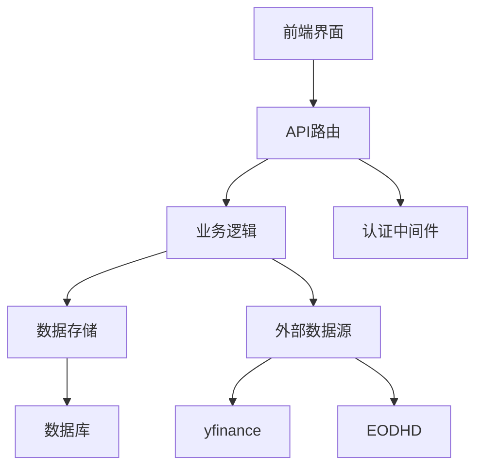

**图表来源**
- [market_data_routes.py](file://backend/src/routes/market_data_routes.py#L28-L29)
- [DataManagement.jsx](file://frontend/src/pages/DataManagement.jsx#L8-L9)

## 核心组件分析
数据管理模块由多个核心组件构成，每个组件负责特定的功能。这些组件通过清晰的接口进行通信，确保系统的可维护性和扩展性。

### 数据缓存存储
DataCacheStorage类负责管理市场数据缓存，提供缓存统计、批量预热和清理功能。该类继承自BaseStorage，共享数据库连接和会话管理。

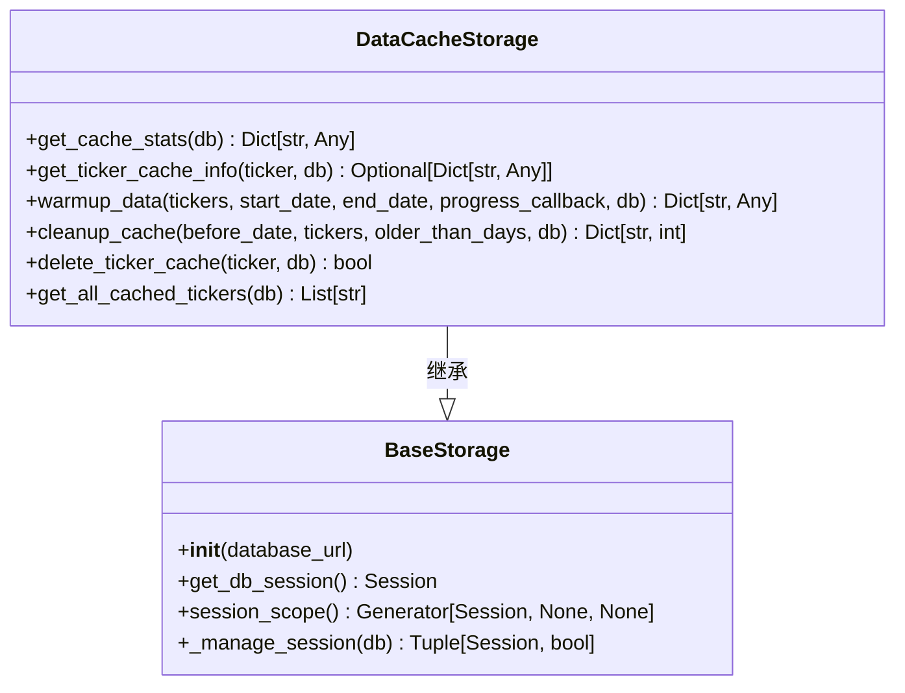

**图表来源**
- [data_cache.py](file://backend/src/db/storage/data_cache.py#L24-L364)
- [base.py](file://backend/src/db/storage/base.py#L19-L87)

**本节来源**
- [data_cache.py](file://backend/src/db/storage/data_cache.py#L1-L419)
- [base.py](file://backend/src/db/storage/base.py#L1-L89)

### 市场数据管理
market_data模块负责从外部数据源获取市场数据，并将其存储到数据库中。该模块支持多种数据源，并根据配置的优先级顺序尝试获取数据。

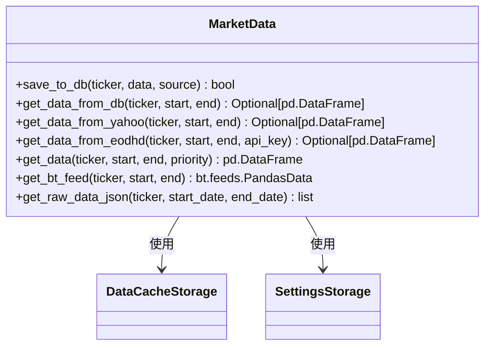

**图表来源**
- [market_data.py](file://backend/src/db/storage/market_data.py#L39-L357)
- [data_cache.py](file://backend/src/db/storage/data_cache.py#L36-L364)

**本节来源**
- [market_data.py](file://backend/src/db/storage/market_data.py#L1-L408)

## 数据缓存管理
数据缓存管理是系统性能优化的关键。通过缓存市场数据，系统可以显著减少对外部API的调用次数，提高数据访问速度。

### 缓存统计
系统提供详细的缓存统计信息，包括总记录数、总交易品种数、日期范围和每个交易品种的缓存详情。

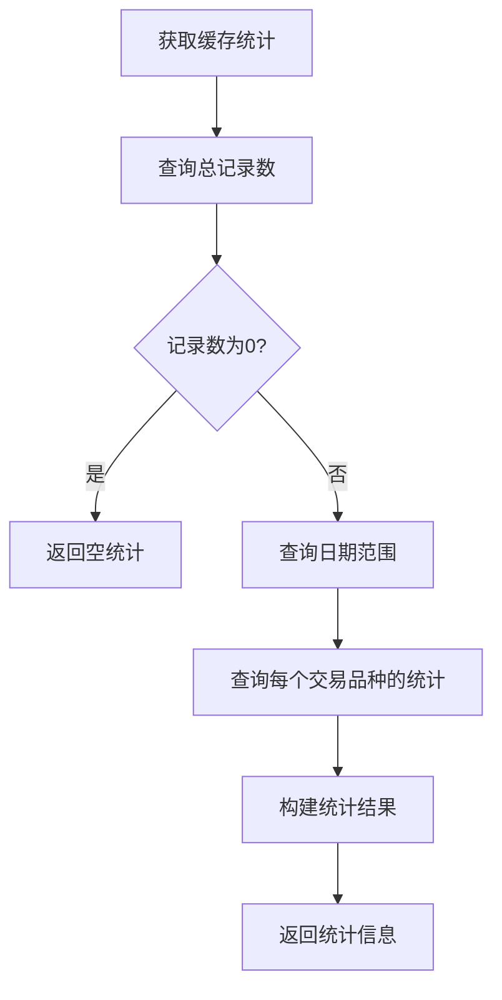

**图表来源**
- [data_cache.py](file://backend/src/db/storage/data_cache.py#L36-L105)

**本节来源**
- [data_cache.py](file://backend/src/db/storage/data_cache.py#L36-L105)
- [market_data_routes.py](file://backend/src/routes/market_data_routes.py#L130-L144)

### 缓存信息查询
系统支持查询特定交易品种的缓存信息，包括记录数、日期范围、首次缓存时间和最后更新时间。

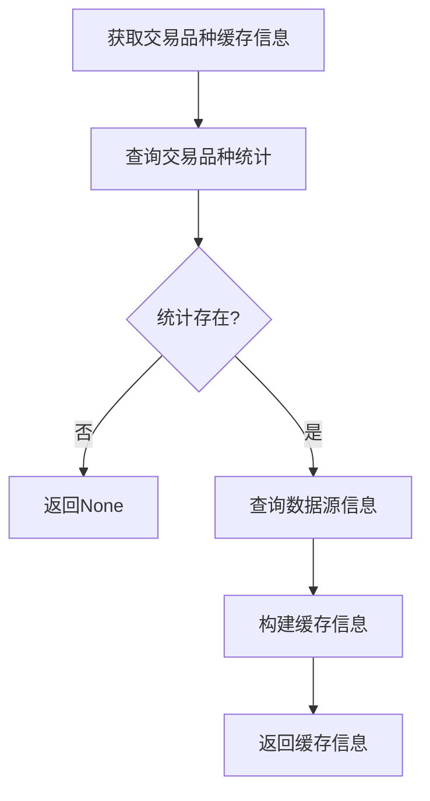

**图表来源**
- [data_cache.py](file://backend/src/db/storage/data_cache.py#L106-L158)

**本节来源**
- [data_cache.py](file://backend/src/db/storage/data_cache.py#L106-L158)
- [market_data_routes.py](file://backend/src/routes/market_data_routes.py#L158-L184)

## 数据预热与清理
数据预热和清理功能帮助用户优化缓存使用，确保数据的及时性和存储效率。

### 数据预热
数据预热功能允许用户批量预加载多个交易品种的数据到缓存中，提高后续操作的性能。

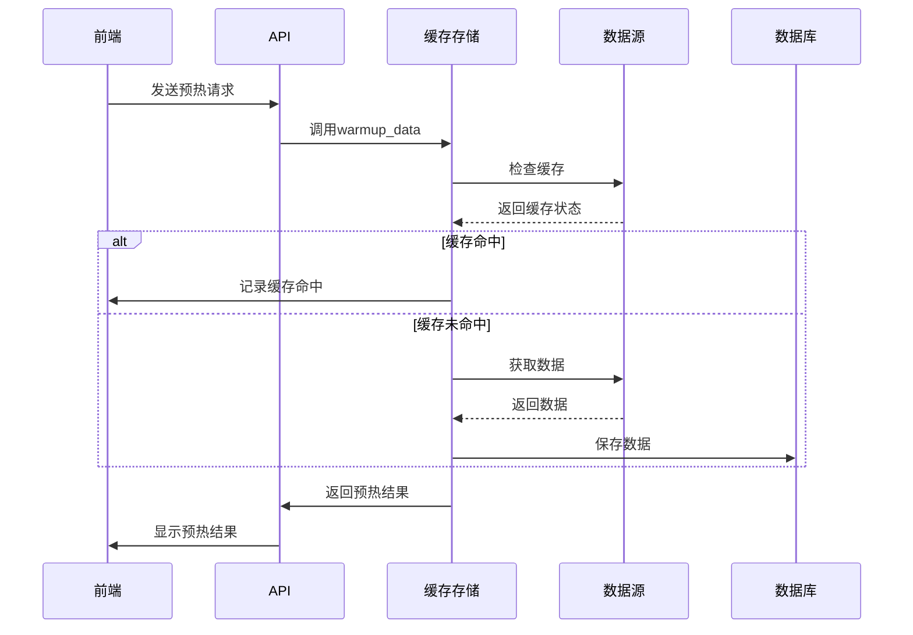

**图表来源**
- [data_cache.py](file://backend/src/db/storage/data_cache.py#L160-L255)
- [market_data_routes.py](file://backend/src/routes/market_data_routes.py#L186-L208)

**本节来源**
- [data_cache.py](file://backend/src/db/storage/data_cache.py#L160-L255)
- [WarmupCard.jsx](file://frontend/src/components/DataManagement/WarmupCard.jsx#L13-L89)
- [market_data_routes.py](file://backend/src/routes/market_data_routes.py#L186-L208)

### 缓存清理
缓存清理功能允许用户根据日期、交易品种或保留天数删除过期的缓存数据，释放存储空间。

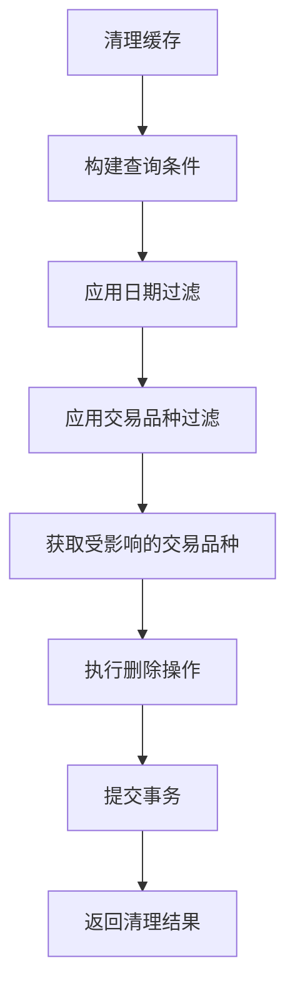

**图表来源**
- [data_cache.py](file://backend/src/db/storage/data_cache.py#L257-L325)

**本节来源**
- [data_cache.py](file://backend/src/db/storage/data_cache.py#L257-L325)
- [CleanupCard.jsx](file://frontend/src/components/DataManagement/CleanupCard.jsx#L22-L107)
- [market_data_routes.py](file://backend/src/routes/market_data_routes.py#L210-L243)

## 数据重采样
数据重采样功能允许用户将高频率的市场数据聚合为低频率的数据，支持多种时间框架。

### 重采样规则
系统支持以下时间框架的重采样，遵循标准的OHLCV聚合规则：
- 1分钟 → 5分钟 → 15分钟 → 30分钟 → 1小时 → 4小时 → 1天 → 1周

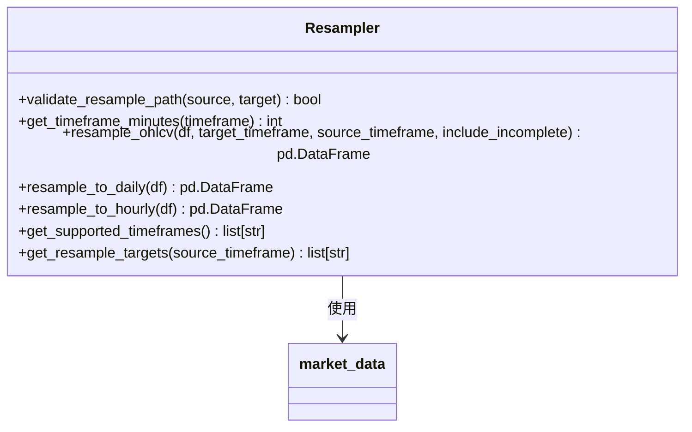

**图表来源**
- [resampler.py](file://backend/src/db/storage/resampler.py#L89-L205)

**本节来源**
- [resampler.py](file://backend/src/db/storage/resampler.py#L1-L284)
- [ResampleCard.jsx](file://frontend/src/components/DataManagement/ResampleCard.jsx#L26-L148)
- [market_data_routes.py](file://backend/src/routes/market_data_routes.py#L308-L383)

## 数据源配置
系统支持配置多个数据源的优先级，并管理EODHD API密钥。

### 数据源优先级
用户可以配置数据源的获取优先级，系统将按照配置的顺序尝试从不同数据源获取数据。

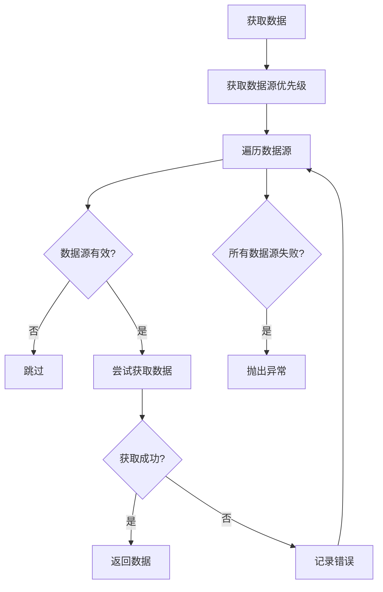

**图表来源**
- [market_data.py](file://backend/src/db/storage/market_data.py#L282-L349)

**本节来源**
- [data_source.py](file://backend/src/db/storage/settings/data_source.py#L30-L125)
- [market_data.py](file://backend/src/db/storage/market_data.py#L282-L349)

## 前端界面
前端界面提供直观的数据管理功能，包括缓存统计、数据预热、重采样和缓存清理。

### 界面布局
数据管理页面采用响应式布局，适配不同屏幕尺寸。

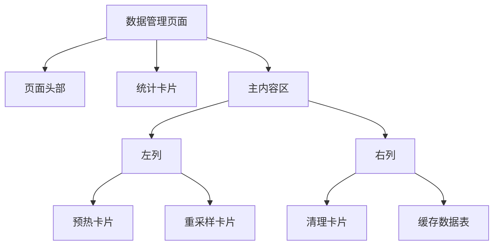

**图表来源**
- [DataManagement.jsx](file://frontend/src/pages/DataManagement.jsx#L138-L174)

**本节来源**
- [DataManagement.jsx](file://frontend/src/pages/DataManagement.jsx#L1-L180)
- [CacheStatsCards.jsx](file://frontend/src/components/DataManagement/CacheStatsCards.jsx#L1-L68)

## 数据库模型
系统使用SQLAlchemy定义数据库模型，存储市场数据和交易品种元数据。

### 市场数据模型
MarketDataModel存储历史价格数据，包括开盘价、最高价、最低价、收盘价和成交量。

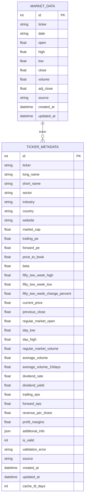

**图表来源**
- [market.py](file://backend/src/db/models/market.py#L16-L146)

**本节来源**
- [market.py](file://backend/src/db/models/market.py#L1-L147)
- [ticker_metadata.py](file://backend/src/db/storage/ticker_metadata.py#L1-L305)

## 结论
数据管理模块通过高效的缓存机制、灵活的数据处理功能和直观的用户界面，为交易回测系统提供了可靠的数据支持。系统的设计考虑了性能、可维护性和用户体验，支持从数据获取到处理的完整流程。通过合理的架构设计和组件划分，系统具有良好的扩展性，可以方便地添加新的数据源或功能。