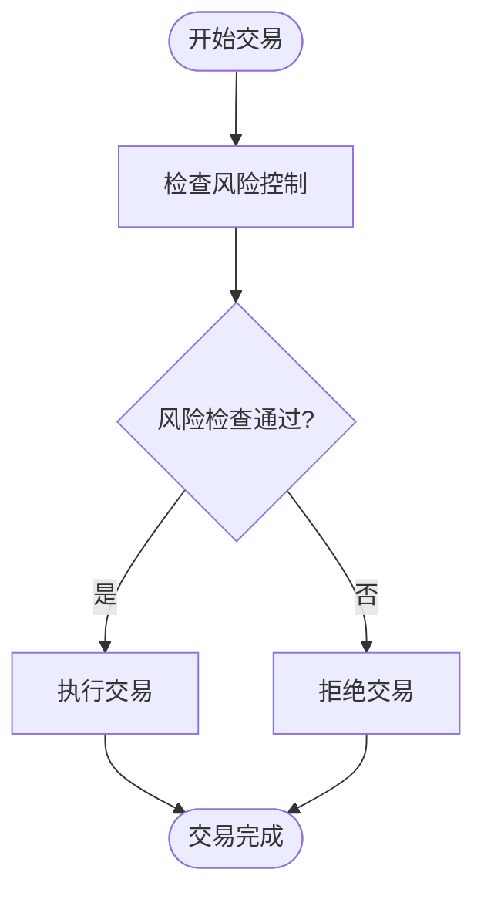

# 最佳实践

<cite>
**本文档中引用的文件**
- [feature.md](file://feature.md)
- [operations-log.md](file://operations-log.md)
- [auto_test/auto_test.md](file://auto_test/auto_test.md)
- [backend/src/service/service.md](file://backend/src/service/service.md)
- [backend/src/routes/routes.md](file://backend/src/routes/routes.md)
- [backend/src/service/live_engine.py](file://backend/src/service/live_engine.py)
- [backend/src/service/session_manager.py](file://backend/src/service/session_manager.py)
- [backend/src/brokers/ccxt_adapter/ccxt_broker.py](file://backend/src/brokers/ccxt_adapter/ccxt_broker.py)
- [backend/src/brokers/ibkr_adapter/ibkr_store.py](file://backend/src/brokers/ibkr_adapter/ibkr_store.py)
- [backend/src/db/datasource.py](file://backend/src/db/datasource.py)
- [auto_test/test_live_routes.py](file://auto_test/test_live_routes.py)
- [auto_test/test_session_manager.py](file://auto_test/test_session_manager.py)
- [backend/src/utils/config_loader.py](file://backend/src/utils/config_loader.py)
- [backend/src/config/settings.py](file://backend/src/config/settings.py)
- [AGENTS.md](file://AGENTS.md)
- [backend/src/brokers/ccxt_adapter/ccxt_store.py](file://backend/src/brokers/ccxt_adapter/ccxt_store.py)
- [backend/src/service/websocket_manager.py](file://backend/src/service/websocket_manager.py)
</cite>

## 目录
1. [引言](#引言)
2. [策略开发最佳实践](#策略开发最佳实践)
3. [风险控制最佳实践](#风险控制最佳实践)
4. [性能优化最佳实践](#性能优化最佳实践)
5. [系统维护最佳实践](#系统维护最佳实践)
6. [自动化测试最佳实践](#自动化测试最佳实践)
7. [实盘交易问题与解决方案](#实盘交易问题与解决方案)
8. [代码质量与安全性指导原则](#代码质量与安全性指导原则)
9. [结论](#结论)

## 引言

本文件旨在总结基于`feature.md`和`operations-log.md`中实际经验的项目开发和使用最佳实践。文档涵盖了策略开发、风险控制、性能优化、系统维护、自动化测试以及实盘交易中的典型问题和解决方案。通过提供全面的指导原则，确保系统的长期可维护性、稳定性和安全性。

## 策略开发最佳实践

在策略开发过程中，应遵循以下最佳实践以确保代码的可重用性、可测试性和可维护性。

### 统一的策略接口

所有策略应遵循Backtrader框架的标准接口，确保可以在回测和实盘环境中无缝切换。策略代码不应直接依赖于特定的交易所适配器（如CCXT或IBKR），而是通过`live_engine.py`中的`_build_components`函数进行抽象。这使得策略可以在不同的交易环境中运行，而无需修改核心逻辑。

**Section sources**
- [backend/src/service/live_engine.py](file://backend/src/service/live_engine.py#L50-L97)

### 策略模块化

策略应被设计为独立的模块，每个策略文件（如`sma_cross.py`、`rsi_reversion.py`）包含一个或多个策略类。这有助于代码的组织和复用，并便于进行单元测试和集成测试。

**Section sources**
- [backend/resources/strategy/](file://backend/resources/strategy/)

### 策略配置化

策略的参数（如移动平均线的周期、RSI的阈值等）应通过配置文件或API调用进行传递，而不是硬编码在策略代码中。这使得策略的参数可以动态调整，支持参数优化和网格搜索。

**Section sources**
- [feature.md](file://feature.md#L4)

## 风险控制最佳实践

有效的风险控制是确保交易系统稳定运行的关键。以下是在本项目中实施的风险控制最佳实践。

### 统一的风控模块

项目中应实现一个统一的风控模块，负责管理滑点模型、交易时间窗、风险预算和仓位分级。风控模块应在策略执行前进行检查，确保所有交易符合预设的风险规则。

**Diagram sources**
- [feature.md](file://feature.md#L6)

### 风险配置管理

风险控制参数应通过`broker_config.json`文件进行配置，并使用Pydantic模型进行验证。`config_loader.py`模块提供了`RiskManagement`、`PositionLimits`、`LossLimits`和`OrderLimits`等模型，确保配置的正确性和一致性。

**Section sources**
- [backend/src/utils/config_loader.py](file://backend/src/utils/config_loader.py#L49-L68)

### 实时风险监控

在实盘交易中，应实时监控账户的P&L、最大回撤和每日亏损，一旦超过预设阈值，立即触发警报或自动停止交易。`CCXTBroker`类中的`get_value`方法用于计算投资组合的总价值，为风险监控提供数据支持。

**Section sources**
- [backend/src/brokers/ccxt_adapter/ccxt_broker.py](file://backend/src/brokers/ccxt_adapter/ccxt_broker.py#L271-L295)

## 性能优化最佳实践

为了提高系统的性能和响应速度，应采取以下优化措施。

### 数据层强化

接入行情缓存或数据库读写，以减少对第三方API的依赖。`datasource.py`模块实现了从数据库加载数据的逻辑，优先从数据库获取数据，如果数据库中没有，则从yfinance获取。这可以显著提高数据加载速度，特别是在回测大量历史数据时。

**Section sources**
- [feature.md](file://feature.md#L3)
- [backend/src/db/datasource.py](file://backend/src/db/datasource.py#L16-L69)

### 并行参数优化

为`run_backtest`函数增加`optstrategy`接口和任务队列，支持并行参数优化。前端可以展示最佳参数和效率图（年化收益 vs 参数），帮助用户快速找到最优参数组合。

**Section sources**
- [feature.md](file://feature.md#L4)

### 异步处理

在处理耗时操作（如网络请求、数据库查询）时，应使用异步处理以避免阻塞主线程。`CCXTStore`类中的`run_coroutine`方法用于执行异步协程，确保系统在高并发场景下的稳定性。

**Section sources**
- [backend/src/brokers/ccxt_adapter/ccxt_store.py](file://backend/src/brokers/ccxt_adapter/ccxt_store.py#L305-L314)

## 系统维护最佳实践

良好的系统维护是确保系统长期稳定运行的基础。以下是一些关键的维护实践。

### 日志记录

系统应记录详细的日志，包括交易日志、错误日志和性能日志。日志应包含时间戳、会话ID、操作类型和详细信息，以便于问题排查和审计。`logging`模块被广泛用于各个组件中，确保所有关键操作都有日志记录。

**Section sources**
- [backend/src/service/live_engine.py](file://backend/src/service/live_engine.py#L8)
- [backend/src/service/session_manager.py](file://backend/src/service/session_manager.py#L8)

### 会话管理

`session_manager.py`模块实现了会话管理功能，负责管理实盘交易会话的生命周期。会话管理器使用单例模式，确保全局只有一个实例，避免资源冲突。会话状态包括`STARTING`、`RUNNING`、`STOPPING`、`STOPPED`和`ERROR`，便于监控和管理。

**Section sources**
- [backend/src/service/session_manager.py](file://backend/src/service/session_manager.py#L20-L27)

### 健康检查

系统应提供健康检查接口，用于监控系统的运行状态。`live_routes.py`中的`/api/live/health`端点返回系统的健康状态，包括启用的交易所列表和会话计数，帮助运维人员快速了解系统状态。

**Section sources**
- [auto_test/test_live_routes.py](file://auto_test/test_live_routes.py#L68-L77)

## 自动化测试最佳实践

自动化测试是确保系统质量和稳定性的关键环节。以下是在本项目中实施的自动化测试最佳实践。

### 测试用例设计

测试用例应覆盖核心功能，包括API合同测试、高阶工作流检查和回归测试。测试用例应使用`pytest`或`unittest`框架编写，避免副作用，确保测试的可重复性。

**Section sources**
- [auto_test/auto_test.md](file://auto_test/auto_test.md#L5-L9)

### 测试覆盖率要求

测试覆盖率应达到80%以上，特别是对于核心业务逻辑和关键路径。测试应包括单元测试、集成测试和端到端测试，确保各个层次的功能都得到充分验证。

**Section sources**
- [auto_test/auto_test.md](file://auto_test/auto_test.md#L15)

### 模拟外部服务

为了避免网络调用和真实凭据，测试中应使用模拟（mock）或存根（stub）来替代外部服务。`test_live_routes.py`中使用了`_DummyExchange`类来模拟CCXT交易所，确保测试可以在没有真实交易所连接的情况下运行。

**Section sources**
- [auto_test/test_live_routes.py](file://auto_test/test_live_routes.py#L16-L37)

### 测试运行

测试应通过`python -m pytest auto_test -q`命令运行，支持运行所有测试或单个测试用例。测试应在CI/CD管道中自动执行，确保每次代码提交都经过充分测试。

**Section sources**
- [auto_test/auto_test.md](file://auto_test/auto_test.md#L19-L21)

## 实盘交易问题与解决方案

在实盘交易中，可能会遇到各种问题。以下是基于`operations-log.md`中记录的典型问题及其解决方案。

### CCXTData初始化问题

在`operations-log.md`中记录了CCXTData初始化时参数丢失的问题。解决方案是将`**kwargs`透传给Backtrader基类，确保`timeframe`、`backfill`等参数不丢失。

**Section sources**
- [operations-log.md](file://operations-log.md#L3)

### 兼容性问题

`operations-log.md`中记录了`pycares` 5.0.0与`aiodns` 3.6.0的兼容性问题。解决方案是在`requirements.txt`中固定`aiodns`和`pycares`的低版本，并在README中补充故障排查指南。

**Section sources**
- [operations-log.md](file://operations-log.md#L9)

### 环境变量配置

在使用IBKR适配器时，需要通过环境变量配置主机、端口、客户端ID和账户信息。`ibkr_store.py`中通过`os.getenv`获取这些配置，确保配置的灵活性和安全性。

**Section sources**
- [operations-log.md](file://operations-log.md#L16)
- [backend/src/brokers/ibkr_adapter/ibkr_store.py](file://backend/src/brokers/ibkr_adapter/ibkr_store.py#L56-L70)

## 代码质量与安全性指导原则

为了确保代码的质量和安全性，应遵循以下指导原则。

### 代码审查

所有代码提交都应经过同行审查，确保代码符合编码规范，没有潜在的安全漏洞。审查应关注代码的可读性、可维护性和性能。

### 安全配置

敏感信息（如API密钥、数据库密码）必须存储在环境变量或`.env`文件中，不得硬编码在代码中。`settings.py`中通过`os.getenv`获取这些配置，确保敏感信息的安全。

**Section sources**
- [AGENTS.md](file://AGENTS.md#L43)
- [backend/src/config/settings.py](file://backend/src/config/settings.py#L31-L36)

### 输入验证

所有外部输入（如API请求参数、用户输入）都应进行严格的验证，防止注入攻击和其他安全威胁。`config_loader.py`中使用Pydantic模型对配置文件进行验证，确保配置的正确性和安全性。

**Section sources**
- [backend/src/utils/config_loader.py](file://backend/src/utils/config_loader.py#L154)

### 错误处理

系统应具备完善的错误处理机制，能够捕获和处理各种异常情况。错误信息应记录到日志中，并通过WebSocket广播给前端，帮助用户及时了解问题。

**Section sources**
- [backend/src/service/websocket_manager.py](file://backend/src/service/websocket_manager.py#L294-L344)

## 结论

通过遵循上述最佳实践，可以确保交易系统的高质量、高稳定性和高安全性。策略开发应注重模块化和配置化，风险控制应全面且实时，性能优化应从数据层和异步处理入手，系统维护应注重日志记录和健康检查，自动化测试应覆盖全面且可重复，代码质量和安全性应贯穿整个开发过程。这些实践将为团队提供坚实的指导，确保系统的长期可维护性。