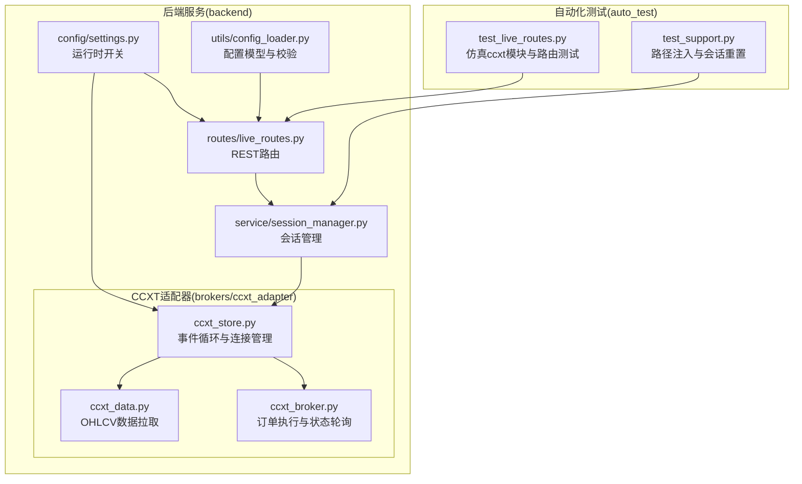
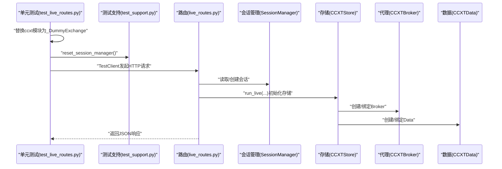
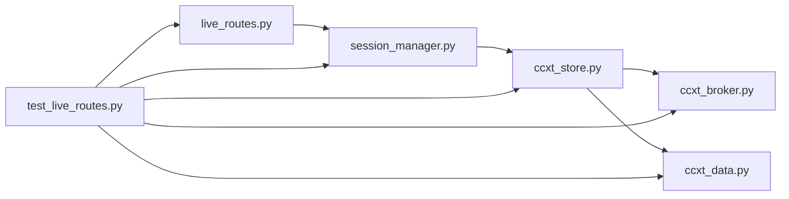

# 仿真环境

<cite>
**本文引用的文件**
- [auto_test/test_live_routes.py](file://auto_test/test_live_routes.py)
- [auto_test/test_support.py](file://auto_test/test_support.py)
- [backend/src/routes/live_routes.py](file://backend/src/routes/live_routes.py)
- [backend/src/service/session_manager.py](file://backend/src/service/session_manager.py)
- [backend/src/brokers/ccxt_adapter/ccxt_store.py](file://backend/src/brokers/ccxt_adapter/ccxt_store.py)
- [backend/src/brokers/ccxt_adapter/ccxt_broker.py](file://backend/src/brokers/ccxt_adapter/ccxt_broker.py)
- [backend/src/brokers/ccxt_adapter/ccxt_data.py](file://backend/src/brokers/ccxt_adapter/ccxt_data.py)
- [backend/src/config/settings.py](file://backend/src/config/settings.py)
- [backend/src/utils/config_loader.py](file://backend/src/utils/config_loader.py)
</cite>

## 目录
1. [引言](#引言)
2. [项目结构](#项目结构)
3. [核心组件](#核心组件)
4. [架构总览](#架构总览)
5. [详细组件分析](#详细组件分析)
6. [依赖关系分析](#依赖关系分析)
7. [性能考量](#性能考量)
8. [故障排查指南](#故障排查指南)
9. [结论](#结论)
10. [附录：扩展仿真功能指南](#附录扩展仿真功能指南)

## 引言
本文件围绕“在无真实交易所凭据条件下”的仿真测试方案展开，重点解析 auto_test/test_live_routes.py 中通过 Python 内置 types 模块动态替换 ccxt 异步模块与类的方式，实现对 CCXT 异步接口的轻量级模拟（_DummyExchange）。该方案在不引入真实网络调用的前提下，保持与生产接口一致的调用签名，从而确保 API 路由层与会话管理逻辑在 CI/CD 流程中的稳定性与可重复性。同时，文档梳理了 CCXTStore、CCXTBroker、CCXTData 等核心组件的异步桥接机制，并给出扩展仿真能力（模拟不同市场状态、网络错误与异常响应）的实践建议。

## 项目结构
- 自动化测试位于 auto_test，包含针对 live 路由的端到端测试与通用测试辅助工具。
- 后端路由层位于 backend/src/routes，提供 /api/live/* 接口，受配置开关控制。
- 会话管理位于 backend/src/service，负责会话生命周期与状态跟踪。
- CCXT 适配器位于 backend/src/brokers/ccxt_adapter，包含 CCXTStore、CCXTBroker、CCXTData，分别承担连接管理、订单执行与数据流。
- 配置加载与设置位于 backend/src/config 与 backend/src/utils，提供 broker 配置与运行参数校验。

图表来源
- [auto_test/test_live_routes.py](file://auto_test/test_live_routes.py#L1-L124)
- [auto_test/test_support.py](file://auto_test/test_support.py#L1-L47)
- [backend/src/routes/live_routes.py](file://backend/src/routes/live_routes.py#L1-L423)
- [backend/src/service/session_manager.py](file://backend/src/service/session_manager.py#L1-L410)
- [backend/src/brokers/ccxt_adapter/ccxt_store.py](file://backend/src/brokers/ccxt_adapter/ccxt_store.py#L1-L324)
- [backend/src/brokers/ccxt_adapter/ccxt_broker.py](file://backend/src/brokers/ccxt_adapter/ccxt_broker.py#L1-L545)
- [backend/src/brokers/ccxt_adapter/ccxt_data.py](file://backend/src/brokers/ccxt_adapter/ccxt_data.py#L1-L288)
- [backend/src/config/settings.py](file://backend/src/config/settings.py#L1-L81)
- [backend/src/utils/config_loader.py](file://backend/src/utils/config_loader.py#L1-L343)

章节来源
- [auto_test/test_live_routes.py](file://auto_test/test_live_routes.py#L1-L124)
- [auto_test/test_support.py](file://auto_test/test_support.py#L1-L47)
- [backend/src/routes/live_routes.py](file://backend/src/routes/live_routes.py#L1-L423)
- [backend/src/service/session_manager.py](file://backend/src/service/session_manager.py#L1-L410)
- [backend/src/brokers/ccxt_adapter/ccxt_store.py](file://backend/src/brokers/ccxt_adapter/ccxt_store.py#L1-L324)
- [backend/src/brokers/ccxt_adapter/ccxt_broker.py](file://backend/src/brokers/ccxt_adapter/ccxt_broker.py#L1-L545)
- [backend/src/brokers/ccxt_adapter/ccxt_data.py](file://backend/src/brokers/ccxt_adapter/ccxt_data.py#L1-L288)
- [backend/src/config/settings.py](file://backend/src/config/settings.py#L1-L81)
- [backend/src/utils/config_loader.py](file://backend/src/utils/config_loader.py#L1-L343)

## 核心组件
- 仿真 ccxt 模块与类
  - 在测试启动前，使用 types.ModuleType 动态创建 ccxt.async_support 与 ccxt 根模块，并将 ccxt.Exchange、ccxt.NetworkError 以及 ccxt.<exchange> 替换为 _DummyExchange 类型，使应用导入 ccxt 的路径在测试期间直接解析到自定义类，从而避免真实网络调用。
  - _DummyExchange 提供最小可用的异步方法签名（如 fetch_status、load_markets、close），返回稳定且可预测的结果，保证上层路由与会话管理逻辑正常工作。
- 路由层
  - /api/live/start、/api/live/stop、/api/live/sessions、/api/live/health 等端点，受 LIVE_TRADING_ENABLED 开关控制；当未启用时，明确返回 403。
- 会话管理
  - SessionManager 单例负责会话创建、状态更新、列表查询与停止；测试通过 reset_session_manager 清理全局状态，确保用例隔离。
- CCXTStore/CCXTBroker/CCXTData
  - CCXTStore 在后台线程启动 asyncio 事件循环，初始化 ccxt.Exchange 实例，提供 run_coroutine 将异步操作桥接到同步框架；支持重试与沙箱模式；在 paper 模式下可使用测试网地址。
  - CCXTBroker 将 Backtrader 订单转换为 CCXT 订单，提交至交易所并轮询状态；在 paper 模式下不进行真实下单。
  - CCXTData 从交易所拉取 OHLCV 数据，过滤“形成中”K 线，支持回填与 catch-up。

章节来源
- [auto_test/test_live_routes.py](file://auto_test/test_live_routes.py#L1-L124)
- [auto_test/test_support.py](file://auto_test/test_support.py#L1-L47)
- [backend/src/routes/live_routes.py](file://backend/src/routes/live_routes.py#L1-L423)
- [backend/src/service/session_manager.py](file://backend/src/service/session_manager.py#L1-L410)
- [backend/src/brokers/ccxt_adapter/ccxt_store.py](file://backend/src/brokers/ccxt_adapter/ccxt_store.py#L1-L324)
- [backend/src/brokers/ccxt_adapter/ccxt_broker.py](file://backend/src/brokers/ccxt_adapter/ccxt_broker.py#L1-L545)
- [backend/src/brokers/ccxt_adapter/ccxt_data.py](file://backend/src/brokers/ccxt_adapter/ccxt_data.py#L1-L288)

## 架构总览
下图展示了仿真测试的关键交互：测试在导入应用前替换 ccxt 模块，使路由层与会话管理无需真实网络即可运行；路由层再驱动 CCXTStore/CCXTBroker/CCXTData 完成数据与订单处理。

图表来源
- [auto_test/test_live_routes.py](file://auto_test/test_live_routes.py#L1-L124)
- [auto_test/test_support.py](file://auto_test/test_support.py#L1-L47)
- [backend/src/routes/live_routes.py](file://backend/src/routes/live_routes.py#L1-L423)
- [backend/src/service/session_manager.py](file://backend/src/service/session_manager.py#L1-L410)
- [backend/src/brokers/ccxt_adapter/ccxt_store.py](file://backend/src/brokers/ccxt_adapter/ccxt_store.py#L1-L324)
- [backend/src/brokers/ccxt_adapter/ccxt_broker.py](file://backend/src/brokers/ccxt_adapter/ccxt_broker.py#L1-L545)
- [backend/src/brokers/ccxt_adapter/ccxt_data.py](file://backend/src/brokers/ccxt_adapter/ccxt_data.py#L1-L288)

## 详细组件分析

### 仿真模块替换与 _DummyExchange
- 设计要点
  - 使用 types.ModuleType 创建 ccxt.async_support 与 ccxt 根模块的轻量替身，将 ccxt.Exchange、ccxt.NetworkError 以及 ccxt.<exchange> 绑定到 _DummyExchange，确保所有 import ccxt.* 的路径均解析到自定义类。
  - _DummyExchange 提供最小可用的异步方法，返回稳定结果，避免真实网络调用。
- 作用范围
  - 使路由层与会话管理在测试期间无需真实交易所凭据也能正常工作；同时保持接口签名一致，便于验证 API 行为与状态流转。
- 关键路径
  - [auto_test/test_live_routes.py](file://auto_test/test_live_routes.py#L1-L48)

章节来源
- [auto_test/test_live_routes.py](file://auto_test/test_live_routes.py#L1-L48)

### 路由层与开关控制
- 行为特征
  - /api/live/start 在 LIVE_TRADING_ENABLED=false 时返回 403，明确提示禁用原因。
  - /api/live/health 返回系统健康状态、活动会话数与已启用交易所列表。
  - /api/live/sessions 返回会话列表，测试用例验证种子会话字段与状态。
- 关键路径
  - [backend/src/routes/live_routes.py](file://backend/src/routes/live_routes.py#L100-L182)
  - [backend/src/routes/live_routes.py](file://backend/src/routes/live_routes.py#L288-L338)
  - [backend/src/routes/live_routes.py](file://backend/src/routes/live_routes.py#L392-L423)
  - [backend/src/config/settings.py](file://backend/src/config/settings.py#L38-L46)

章节来源
- [backend/src/routes/live_routes.py](file://backend/src/routes/live_routes.py#L100-L182)
- [backend/src/routes/live_routes.py](file://backend/src/routes/live_routes.py#L288-L338)
- [backend/src/routes/live_routes.py](file://backend/src/routes/live_routes.py#L392-L423)
- [backend/src/config/settings.py](file://backend/src/config/settings.py#L38-L46)

### 会话管理与测试隔离
- 行为特征
  - SessionManager 单例维护会话字典，提供创建、查询、停止、统计等能力；测试通过 reset_session_manager 清空全局状态，确保用例互不干扰。
  - 测试用例验证 /api/live/sessions 返回值与种子会话字段一致。
- 关键路径
  - [backend/src/service/session_manager.py](file://backend/src/service/session_manager.py#L1-L410)
  - [auto_test/test_support.py](file://auto_test/test_support.py#L31-L42)
  - [auto_test/test_live_routes.py](file://auto_test/test_live_routes.py#L95-L121)

章节来源
- [backend/src/service/session_manager.py](file://backend/src/service/session_manager.py#L1-L410)
- [auto_test/test_support.py](file://auto_test/test_support.py#L31-L42)
- [auto_test/test_live_routes.py](file://auto_test/test_live_routes.py#L95-L121)

### CCXTStore 异步桥接与重试
- 行为特征
  - 在后台线程启动 asyncio 事件循环，初始化 ccxt.Exchange 实例；提供 run_coroutine 将异步调用桥接至同步框架。
  - 支持 _fetch_with_retry 对 ccxt.NetworkError 与 RequestTimeout 进行指数退避重试。
  - paper 模式下可启用沙箱模式与测试网地址（如 Binance Spot Testnet）。
- 关键路径
  - [backend/src/brokers/ccxt_adapter/ccxt_store.py](file://backend/src/brokers/ccxt_adapter/ccxt_store.py#L58-L121)
  - [backend/src/brokers/ccxt_adapter/ccxt_store.py](file://backend/src/brokers/ccxt_adapter/ccxt_store.py#L136-L168)
  - [backend/src/brokers/ccxt_adapter/ccxt_store.py](file://backend/src/brokers/ccxt_adapter/ccxt_store.py#L293-L314)
  - [backend/src/brokers/ccxt_adapter/ccxt_store.py](file://backend/src/brokers/ccxt_adapter/ccxt_store.py#L231-L250)

章节来源
- [backend/src/brokers/ccxt_adapter/ccxt_store.py](file://backend/src/brokers/ccxt_adapter/ccxt_store.py#L58-L121)
- [backend/src/brokers/ccxt_adapter/ccxt_store.py](file://backend/src/brokers/ccxt_adapter/ccxt_store.py#L136-L168)
- [backend/src/brokers/ccxt_adapter/ccxt_store.py](file://backend/src/brokers/ccxt_adapter/ccxt_store.py#L293-L314)
- [backend/src/brokers/ccxt_adapter/ccxt_store.py](file://backend/src/brokers/ccxt_adapter/ccxt_store.py#L231-L250)

### CCXTBroker 订单提交与状态轮询
- 行为特征
  - 将 Backtrader 订单转换为 CCXT 订单，提交至交易所；根据订单类型（市价/限价）构造请求；在 paper 模式下不进行真实下单。
  - next() 方法轮询订单状态，处理已成交、已取消等状态并广播 WebSocket 更新。
- 关键路径
  - [backend/src/brokers/ccxt_adapter/ccxt_broker.py](file://backend/src/brokers/ccxt_adapter/ccxt_broker.py#L170-L219)
  - [backend/src/brokers/ccxt_adapter/ccxt_broker.py](file://backend/src/brokers/ccxt_adapter/ccxt_broker.py#L318-L362)
  - [backend/src/brokers/ccxt_adapter/ccxt_broker.py](file://backend/src/brokers/ccxt_adapter/ccxt_broker.py#L467-L496)

章节来源
- [backend/src/brokers/ccxt_adapter/ccxt_broker.py](file://backend/src/brokers/ccxt_adapter/ccxt_broker.py#L170-L219)
- [backend/src/brokers/ccxt_adapter/ccxt_broker.py](file://backend/src/brokers/ccxt_adapter/ccxt_broker.py#L318-L362)
- [backend/src/brokers/ccxt_adapter/ccxt_broker.py](file://backend/src/brokers/ccxt_adapter/ccxt_broker.py#L467-L496)

### CCXTData OHLCV 拉取与过滤
- 行为特征
  - 通过 run_coroutine 调用 exchange.fetch_ohlcv，过滤“形成中”K 线与重复时间戳，支持回填与 catch-up。
  - 提供调试日志与错误计数，防止快速错误循环。
- 关键路径
  - [backend/src/brokers/ccxt_adapter/ccxt_data.py](file://backend/src/brokers/ccxt_adapter/ccxt_data.py#L94-L123)
  - [backend/src/brokers/ccxt_adapter/ccxt_data.py](file://backend/src/brokers/ccxt_adapter/ccxt_data.py#L124-L171)
  - [backend/src/brokers/ccxt_adapter/ccxt_data.py](file://backend/src/brokers/ccxt_adapter/ccxt_data.py#L194-L258)

章节来源
- [backend/src/brokers/ccxt_adapter/ccxt_data.py](file://backend/src/brokers/ccxt_adapter/ccxt_data.py#L94-L123)
- [backend/src/brokers/ccxt_adapter/ccxt_data.py](file://backend/src/brokers/ccxt_adapter/ccxt_data.py#L124-L171)
- [backend/src/brokers/ccxt_adapter/ccxt_data.py](file://backend/src/brokers/ccxt_adapter/ccxt_data.py#L194-L258)

## 依赖关系分析
- 模块耦合
  - 路由层依赖会话管理与配置加载；会话管理持有 CCXTStore 引用；CCXTStore 依赖 ccxt.async_support；CCXTBroker/CCXTData 均依赖 CCXTStore。
- 外部依赖
  - ccxt.async_support 作为外部库被动态替换为 _DummyExchange，从而在测试期间避免真实网络调用。
- 循环依赖规避
  - CCXTBroker 中的 WebSocket 广播采用延迟导入，避免循环依赖。

图表来源
- [backend/src/routes/live_routes.py](file://backend/src/routes/live_routes.py#L1-L423)
- [backend/src/service/session_manager.py](file://backend/src/service/session_manager.py#L1-L410)
- [backend/src/brokers/ccxt_adapter/ccxt_store.py](file://backend/src/brokers/ccxt_adapter/ccxt_store.py#L1-L324)
- [backend/src/brokers/ccxt_adapter/ccxt_broker.py](file://backend/src/brokers/ccxt_adapter/ccxt_broker.py#L1-L545)
- [backend/src/brokers/ccxt_adapter/ccxt_data.py](file://backend/src/brokers/ccxt_adapter/ccxt_data.py#L1-L288)
- [auto_test/test_live_routes.py](file://auto_test/test_live_routes.py#L1-L124)

章节来源
- [backend/src/routes/live_routes.py](file://backend/src/routes/live_routes.py#L1-L423)
- [backend/src/service/session_manager.py](file://backend/src/service/session_manager.py#L1-L410)
- [backend/src/brokers/ccxt_adapter/ccxt_store.py](file://backend/src/brokers/ccxt_adapter/ccxt_store.py#L1-L324)
- [backend/src/brokers/ccxt_adapter/ccxt_broker.py](file://backend/src/brokers/ccxt_adapter/ccxt_broker.py#L1-L545)
- [backend/src/brokers/ccxt_adapter/ccxt_data.py](file://backend/src/brokers/ccxt_adapter/ccxt_data.py#L1-L288)
- [auto_test/test_live_routes.py](file://auto_test/test_live_routes.py#L1-L124)

## 性能考量
- 事件循环与线程
  - CCXTStore 在后台线程运行 asyncio 事件循环，run_coroutine 通过 run_coroutine_threadsafe 将协程调度到该循环，避免阻塞主线程。
- 重试策略
  - _fetch_with_retry 对网络错误进行指数退避重试，降低瞬时网络波动影响。
- 数据拉取
  - CCXTData 通过批量拉取与缓冲区减少频繁网络请求，过滤“形成中”K 线避免未来数据泄漏。

章节来源
- [backend/src/brokers/ccxt_adapter/ccxt_store.py](file://backend/src/brokers/ccxt_adapter/ccxt_store.py#L136-L168)
- [backend/src/brokers/ccxt_adapter/ccxt_store.py](file://backend/src/brokers/ccxt_adapter/ccxt_store.py#L293-L314)
- [backend/src/brokers/ccxt_adapter/ccxt_data.py](file://backend/src/brokers/ccxt_adapter/ccxt_data.py#L124-L171)

## 故障排查指南
- 启用开关未生效
  - 检查 LIVE_TRADING_ENABLED 是否为 false 导致 /api/live/start 返回 403。
  - 参考路径：[backend/src/config/settings.py](file://backend/src/config/settings.py#L38-L46)，[backend/src/routes/live_routes.py](file://backend/src/routes/live_routes.py#L122-L127)
- 会话状态异常
  - 使用 reset_session_manager 清理全局状态，避免用例间污染。
  - 参考路径：[auto_test/test_support.py](file://auto_test/test_support.py#L31-L42)
- 网络错误与超时
  - CCXTStore 的 _fetch_with_retry 对 ccxt.NetworkError 与 RequestTimeout 进行重试；若仍失败，检查环境变量与沙箱配置。
  - 参考路径：[backend/src/brokers/ccxt_adapter/ccxt_store.py](file://backend/src/brokers/ccxt_adapter/ccxt_store.py#L293-L314)
- 数据拉取问题
  - CCXTData 在错误时增加 consecutive_errors 并暂停等待，避免快速错误循环；必要时开启 debug 日志定位。
  - 参考路径：[backend/src/brokers/ccxt_adapter/ccxt_data.py](file://backend/src/brokers/ccxt_adapter/ccxt_data.py#L115-L123)

章节来源
- [backend/src/config/settings.py](file://backend/src/config/settings.py#L38-L46)
- [backend/src/routes/live_routes.py](file://backend/src/routes/live_routes.py#L122-L127)
- [auto_test/test_support.py](file://auto_test/test_support.py#L31-L42)
- [backend/src/brokers/ccxt_adapter/ccxt_store.py](file://backend/src/brokers/ccxt_adapter/ccxt_store.py#L293-L314)
- [backend/src/brokers/ccxt_adapter/ccxt_data.py](file://backend/src/brokers/ccxt_adapter/ccxt_data.py#L115-L123)

## 结论
通过在测试启动前动态替换 ccxt 模块与类，auto_test/test_live_routes.py 成功实现了“无真实交易所凭据”的仿真测试：路由层与会话管理在不发起真实网络请求的情况下完成端到端验证，确保了 CI/CD 的稳定性与可重复性。同时，CCXTStore/CCXTBroker/CCXTData 的异步桥接与重试机制为仿真环境提供了良好的扩展基础。后续可在 _DummyExchange 中进一步丰富模拟行为，以覆盖更复杂的市场状态与异常场景。

## 附录：扩展仿真功能指南
- 扩展 _DummyExchange 的方法签名
  - 为 fetch_status、load_markets、fetch_ohlcv、create_market_order、create_limit_order、fetch_order、cancel_order、close 等方法添加可配置返回值，以便模拟不同市场状态（如休市、熔断、流动性不足）与订单生命周期。
  - 参考路径：[auto_test/test_live_routes.py](file://auto_test/test_live_routes.py#L16-L31)
- 注入网络错误与异常
  - 在 _DummyExchange 的异步方法中抛出 ccxt.NetworkError 或 ccxt.RequestTimeout，验证 CCXTStore 的重试与降级逻辑。
  - 参考路径：[backend/src/brokers/ccxt_adapter/ccxt_store.py](file://backend/src/brokers/ccxt_adapter/ccxt_store.py#L293-L314)
- 模拟不同市场状态
  - 通过 fetch_status 返回“ok/offline/maintenance”，load_markets 返回空或部分市场，模拟交易所状态变化。
  - 参考路径：[auto_test/test_live_routes.py](file://auto_test/test_live_routes.py#L22-L27)
- 模拟订单异常
  - 在 create_market_order/create_limit_order 中返回“rejected”或抛出异常，验证 CCXTBroker 的拒绝处理与通知队列。
  - 参考路径：[backend/src/brokers/ccxt_adapter/ccxt_broker.py](file://backend/src/brokers/ccxt_adapter/ccxt_broker.py#L170-L219)
- 模拟数据异常
  - 在 fetch_ohlcv 中返回空数组或部分缺失字段，验证 CCXTData 的缓冲与过滤逻辑。
  - 参考路径：[backend/src/brokers/ccxt_adapter/ccxt_data.py](file://backend/src/brokers/ccxt_adapter/ccxt_data.py#L124-L171)
- 保持接口一致性
  - 为所有新增方法提供与 ccxt.Exchange 一致的参数与返回结构，确保上层逻辑无需修改即可切换仿真与真实实现。
- CI/CD 稳定性保障
  - 在测试前统一注入 _DummyExchange，使用 reset_session_manager 清理状态，确保用例独立性与可重复性。
  - 参考路径：[auto_test/test_support.py](file://auto_test/test_support.py#L31-L42)