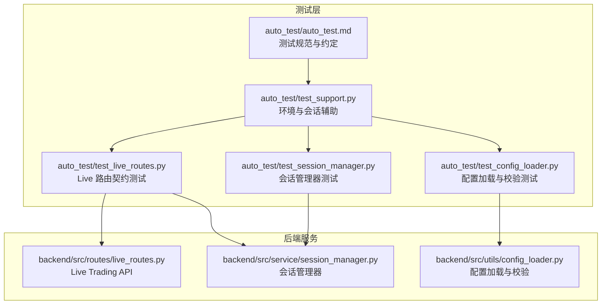
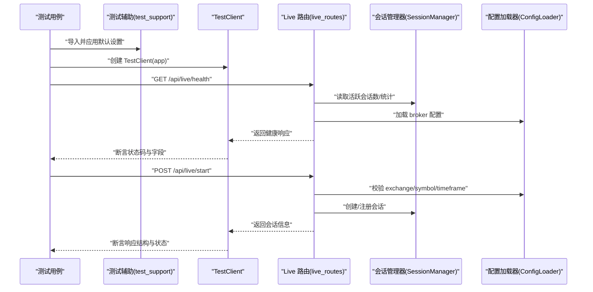
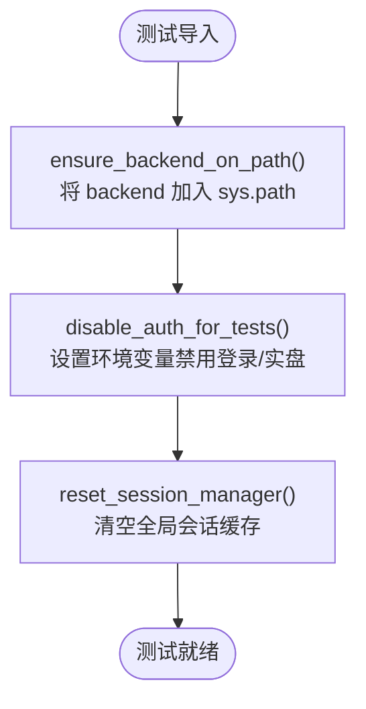
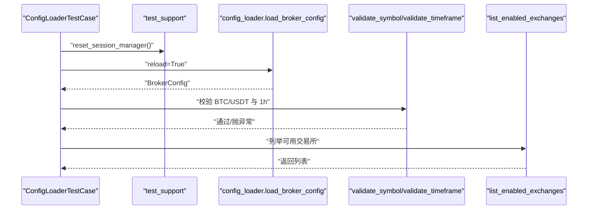
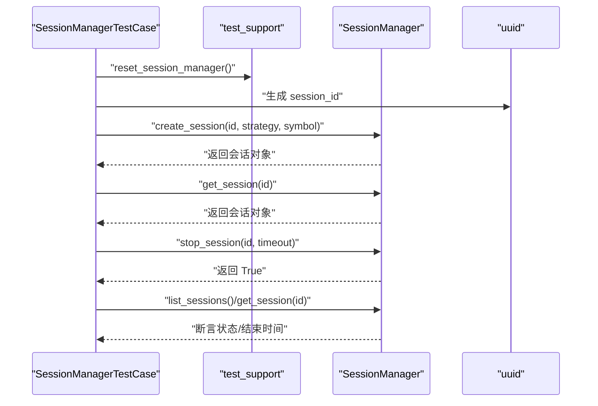
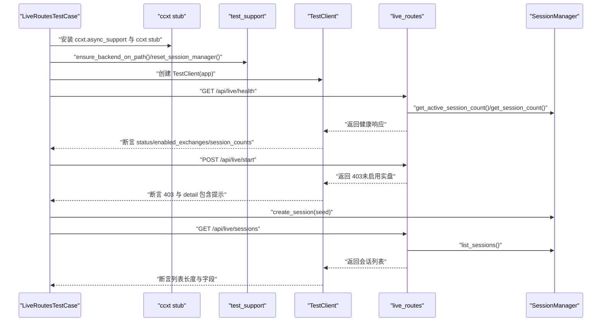
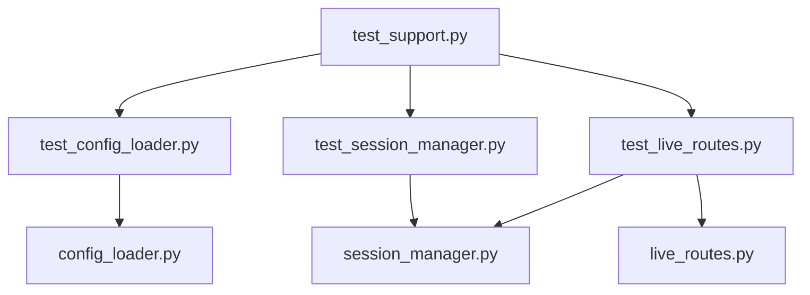

# 测试框架

<cite>
**本文引用的文件**
- [auto_test.md](file://auto_test/auto_test.md)
- [test_support.py](file://auto_test/test_support.py)
- [test_config_loader.py](file://auto_test/test_config_loader.py)
- [test_session_manager.py](file://auto_test/test_session_manager.py)
- [test_live_routes.py](file://auto_test/test_live_routes.py)
- [session_manager.py](file://backend/src/service/session_manager.py)
- [config_loader.py](file://backend/src/utils/config_loader.py)
- [live_routes.py](file://backend/src/routes/live_routes.py)
</cite>

## 目录
1. [引言](#引言)
2. [项目结构](#项目结构)
3. [核心组件](#核心组件)
4. [架构总览](#架构总览)
5. [详细组件分析](#详细组件分析)
6. [依赖关系分析](#依赖关系分析)
7. [性能考量](#性能考量)
8. [故障排查指南](#故障排查指南)
9. [结论](#结论)
10. [附录](#附录)

## 引言
本文件系统化阐述该仓库自动化测试框架的设计与实现，围绕以下目标展开：
- 解释测试用例的组织结构、命名约定与执行流程
- 阐述 test_support.py 提供的测试辅助能力（环境准备、会话重置）
- 说明如何使用 TestClient 进行 API 契约测试，确保可重复性与隔离性
- 给出编写新测试用例的最佳实践（mock 外部服务、测试数据管理）

## 项目结构
auto_test 目录用于存放集成/冒烟/系统级自动化测试，覆盖 FastAPI API 合同测试与高层工作流验证；单元测试应与被测代码就近存放。测试遵循“文件名以 test_* 开头”“避免网络调用”的约定，并在 CI 中可无真实密钥运行。

图表来源
- [auto_test/auto_test.md](file://auto_test/auto_test.md#L1-L26)
- [auto_test/test_support.py](file://auto_test/test_support.py#L1-L47)
- [auto_test/test_config_loader.py](file://auto_test/test_config_loader.py#L1-L57)
- [auto_test/test_session_manager.py](file://auto_test/test_session_manager.py#L1-L71)
- [auto_test/test_live_routes.py](file://auto_test/test_live_routes.py#L1-L125)
- [backend/src/routes/live_routes.py](file://backend/src/routes/live_routes.py#L1-L423)
- [backend/src/service/session_manager.py](file://backend/src/service/session_manager.py#L1-L410)
- [backend/src/utils/config_loader.py](file://backend/src/utils/config_loader.py#L1-L343)

章节来源
- [auto_test/auto_test.md](file://auto_test/auto_test.md#L1-L26)

## 核心组件
- 测试规范与约定：定义测试范围、命名与运行方式，强调无副作用、不依赖真实密钥与网络。
- 测试辅助模块：统一导入路径、禁用登录鉴权、重置全局会话管理器状态。
- 配置加载测试：验证 broker 配置加载、校验规则与可用交易所列表。
- 会话管理器测试：验证会话创建、停止、批量停止与状态一致性。
- Live 路由测试：通过 TestClient 对 /api/live/* 端点进行契约测试，包含健康检查、启动拒绝、会话列表等。

章节来源
- [auto_test/auto_test.md](file://auto_test/auto_test.md#L1-L26)
- [auto_test/test_support.py](file://auto_test/test_support.py#L1-L47)
- [auto_test/test_config_loader.py](file://auto_test/test_config_loader.py#L1-L57)
- [auto_test/test_session_manager.py](file://auto_test/test_session_manager.py#L1-L71)
- [auto_test/test_live_routes.py](file://auto_test/test_live_routes.py#L1-L125)

## 架构总览
测试框架采用“测试辅助 + FastAPI TestClient + 后端服务”的分层设计：
- 测试辅助负责环境初始化与隔离（导入路径、鉴权开关、会话缓存清理）
- TestClient 直接驱动后端 FastAPI 应用，绕过真实网络，确保可重复性
- 后端服务提供稳定的 API 接口与数据模型，便于契约测试

图表来源
- [auto_test/test_support.py](file://auto_test/test_support.py#L1-L47)
- [auto_test/test_live_routes.py](file://auto_test/test_live_routes.py#L1-L125)
- [backend/src/routes/live_routes.py](file://backend/src/routes/live_routes.py#L1-L423)
- [backend/src/service/session_manager.py](file://backend/src/service/session_manager.py#L1-L410)
- [backend/src/utils/config_loader.py](file://backend/src/utils/config_loader.py#L1-L343)

## 详细组件分析

### 测试辅助模块（test_support.py）
职责与机制：
- 将 backend 目录加入 Python 搜索路径，使测试可直接导入后端模块
- 在本地测试时禁用登录鉴权与实盘交易开关，保证测试可重复且无需真实密钥
- 提供 reset_session_manager，清空全局 SessionManager 的会话缓存，确保测试隔离

图表来源
- [auto_test/test_support.py](file://auto_test/test_support.py#L1-L47)

章节来源
- [auto_test/test_support.py](file://auto_test/test_support.py#L1-L47)

### 配置加载测试（test_config_loader.py）
测试要点：
- 加载 broker 配置并断言版本、交易所启用状态、默认市场、支持的时间框架
- 使用校验函数验证符号格式与时间框架是否符合配置
- 列举可用交易所并断言纸模式可用性与市场集合

图表来源
- [auto_test/test_config_loader.py](file://auto_test/test_config_loader.py#L1-L57)
- [backend/src/utils/config_loader.py](file://backend/src/utils/config_loader.py#L1-L343)

章节来源
- [auto_test/test_config_loader.py](file://auto_test/test_config_loader.py#L1-L57)
- [backend/src/utils/config_loader.py](file://backend/src/utils/config_loader.py#L1-L343)

### 会话管理器测试（test_session_manager.py）
测试要点：
- 创建会话并断言初始状态为“starting”，且 is_active 返回真
- 停止单个会话并断言状态变为“stopped”，结束时间非空，is_stopped 返回真
- 批量停止多个会话并断言返回成功映射与最终状态一致

图表来源
- [auto_test/test_session_manager.py](file://auto_test/test_session_manager.py#L1-L71)
- [backend/src/service/session_manager.py](file://backend/src/service/session_manager.py#L1-L410)

章节来源
- [auto_test/test_session_manager.py](file://auto_test/test_session_manager.py#L1-L71)
- [backend/src/service/session_manager.py](file://backend/src/service/session_manager.py#L1-L410)

### Live 路由契约测试（test_live_routes.py）
测试要点：
- 通过轻量 stub 替换 ccxt 模块，避免真实网络与重依赖
- 使用 TestClient 直连 FastAPI 应用，对 /api/live/* 端点进行契约测试
- 断言健康检查返回值、启动接口在未启用实盘时返回 403、会话列表能反映种子会话

图表来源
- [auto_test/test_live_routes.py](file://auto_test/test_live_routes.py#L1-L125)
- [backend/src/routes/live_routes.py](file://backend/src/routes/live_routes.py#L1-L423)
- [backend/src/service/session_manager.py](file://backend/src/service/session_manager.py#L1-L410)

章节来源
- [auto_test/test_live_routes.py](file://auto_test/test_live_routes.py#L1-L125)
- [backend/src/routes/live_routes.py](file://backend/src/routes/live_routes.py#L1-L423)
- [backend/src/service/session_manager.py](file://backend/src/service/session_manager.py#L1-L410)

## 依赖关系分析
- 测试用例依赖 test_support 提供的环境与会话重置能力，确保每个测试用例独立、可重复
- 配置加载测试依赖 config_loader 的加载与校验逻辑
- 会话管理器测试依赖 SessionManager 的线程安全与状态机
- Live 路由测试依赖 live_routes 的 API 定义与 SessionManager、config_loader 的协作

图表来源
- [auto_test/test_support.py](file://auto_test/test_support.py#L1-L47)
- [auto_test/test_config_loader.py](file://auto_test/test_config_loader.py#L1-L57)
- [auto_test/test_session_manager.py](file://auto_test/test_session_manager.py#L1-L71)
- [auto_test/test_live_routes.py](file://auto_test/test_live_routes.py#L1-L125)
- [backend/src/utils/config_loader.py](file://backend/src/utils/config_loader.py#L1-L343)
- [backend/src/service/session_manager.py](file://backend/src/service/session_manager.py#L1-L410)
- [backend/src/routes/live_routes.py](file://backend/src/routes/live_routes.py#L1-L423)

章节来源
- [auto_test/test_support.py](file://auto_test/test_support.py#L1-L47)
- [auto_test/test_config_loader.py](file://auto_test/test_config_loader.py#L1-L57)
- [auto_test/test_session_manager.py](file://auto_test/test_session_manager.py#L1-L71)
- [auto_test/test_live_routes.py](file://auto_test/test_live_routes.py#L1-L125)
- [backend/src/utils/config_loader.py](file://backend/src/utils/config_loader.py#L1-L343)
- [backend/src/service/session_manager.py](file://backend/src/service/session_manager.py#L1-L410)
- [backend/src/routes/live_routes.py](file://backend/src/routes/live_routes.py#L1-L423)

## 性能考量
- 使用 TestClient 直连应用，避免真实网络与外部服务，显著提升测试速度与稳定性
- 通过 reset_session_manager 清理全局缓存，避免跨用例状态污染
- 通过 stub 替换 ccxt，减少导入开销与潜在阻塞
- 配置加载具备缓存机制，测试中可按需 reload，兼顾性能与一致性

## 故障排查指南
- 启动被拒（403）：确认未启用实盘交易，或在测试中显式设置相关环境变量以满足预期行为
- 会话状态异常：检查 reset_session_manager 是否在 setUp/tearDown 中正确调用
- 健康检查失败：核对 broker 配置文件是否存在、格式是否合法，以及配置加载是否成功
- 时间框架/符号校验失败：根据配置加载器的校验规则修正请求参数

章节来源
- [auto_test/test_live_routes.py](file://auto_test/test_live_routes.py#L1-L125)
- [auto_test/test_session_manager.py](file://auto_test/test_session_manager.py#L1-L71)
- [backend/src/utils/config_loader.py](file://backend/src/utils/config_loader.py#L1-L343)

## 结论
该测试框架通过“测试辅助 + FastAPI TestClient + 后端服务”的组合，实现了可重复、可隔离、可维护的自动化测试体系。测试用例严格遵循命名与运行约定，借助 stub 与环境开关避免真实依赖，确保在 CI 中稳定运行。建议后续持续补充更多契约测试与边界场景，保持测试覆盖率与质量。

## 附录

### 编写新测试用例最佳实践
- 命名与组织
  - 文件名以 test_* 开头，pytest/unittest 无副作用
  - 将测试与被测模块就近存放，避免在 auto_test 中堆积细粒度单元测试
- 环境与隔离
  - 在 setUp/tearDown 中调用 reset_session_manager，确保会话状态干净
  - 使用 test_support.apply_defaults，确保导入路径与鉴权开关一致
- API 契约测试
  - 使用 TestClient 直连应用，断言状态码、响应结构与关键字段
  - 对于外部依赖（如 ccxt），在测试导入前安装轻量 stub，避免真实网络
- 数据与配置
  - 使用最小化、确定性的测试数据，必要时通过 reload 强制刷新配置
  - 对配置加载与校验逻辑进行针对性测试，覆盖正常与异常分支
- 可重复性与可维护性
  - 避免写入外部目录或依赖真实密钥
  - 在测试文件头部记录所需 stubs/mocks，便于后续贡献者理解

章节来源
- [auto_test/auto_test.md](file://auto_test/auto_test.md#L1-L26)
- [auto_test/test_support.py](file://auto_test/test_support.py#L1-L47)
- [auto_test/test_live_routes.py](file://auto_test/test_live_routes.py#L1-L125)