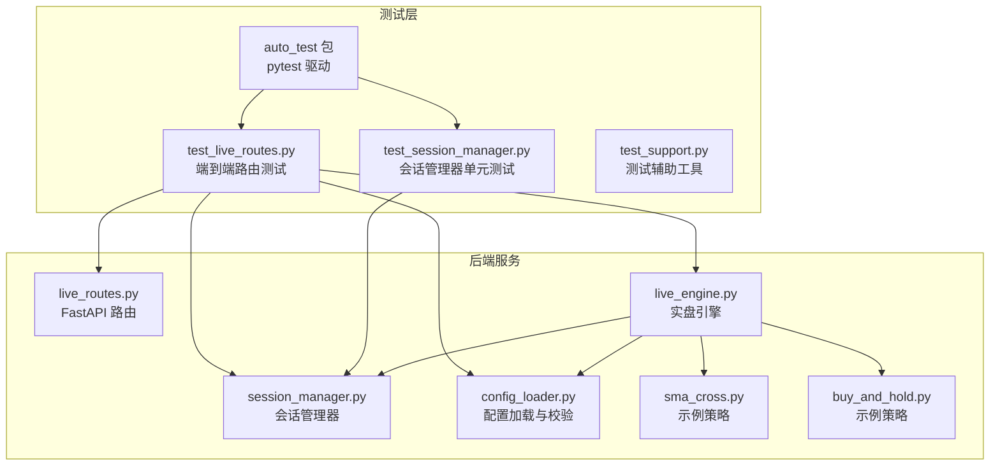
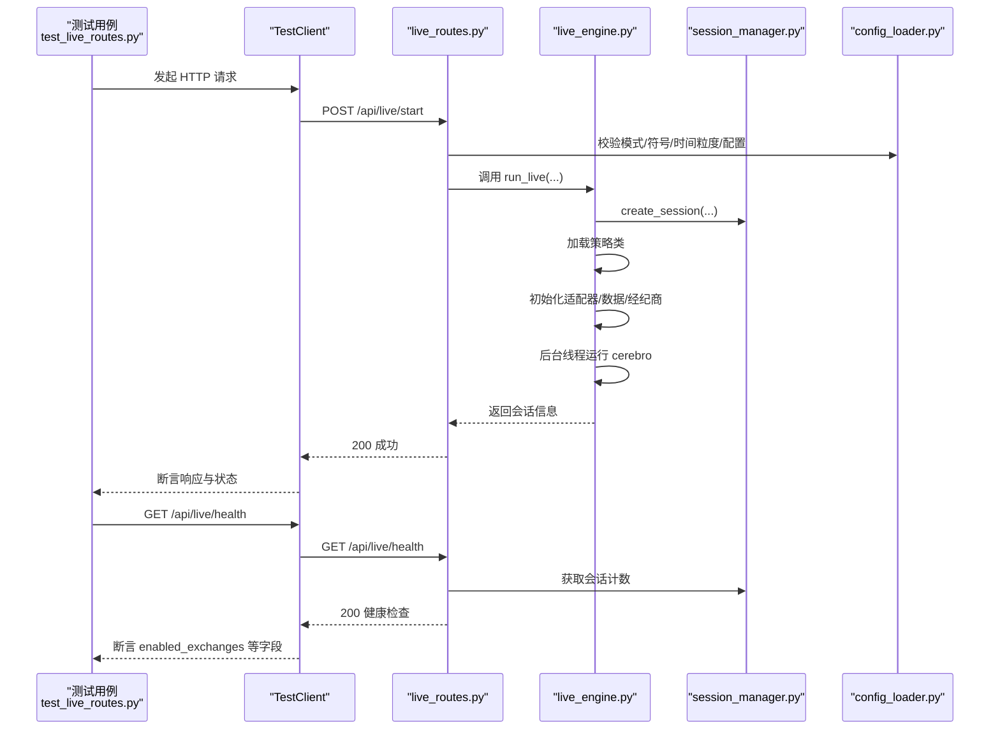
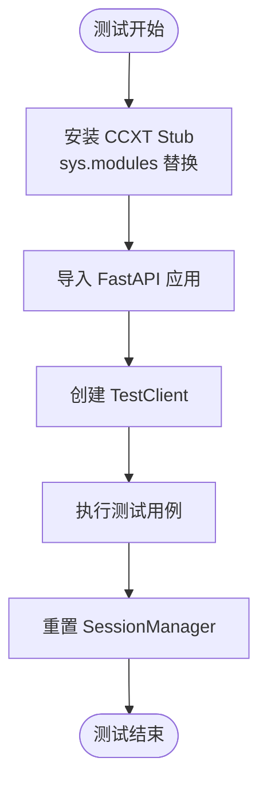
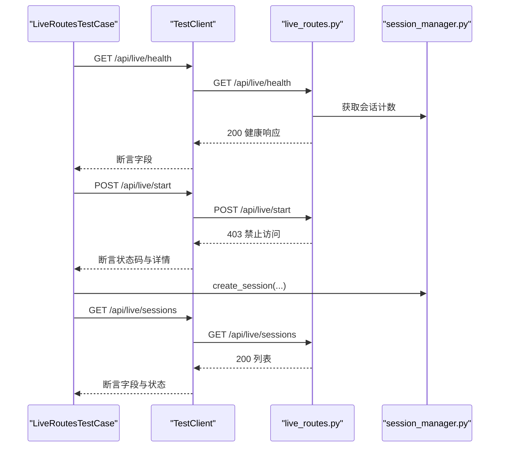
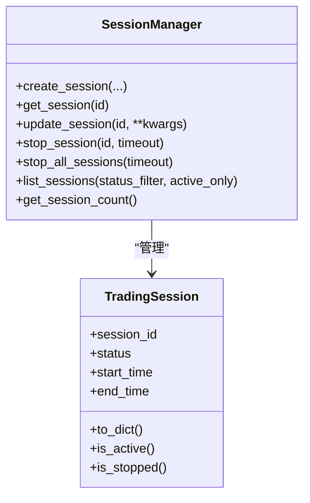
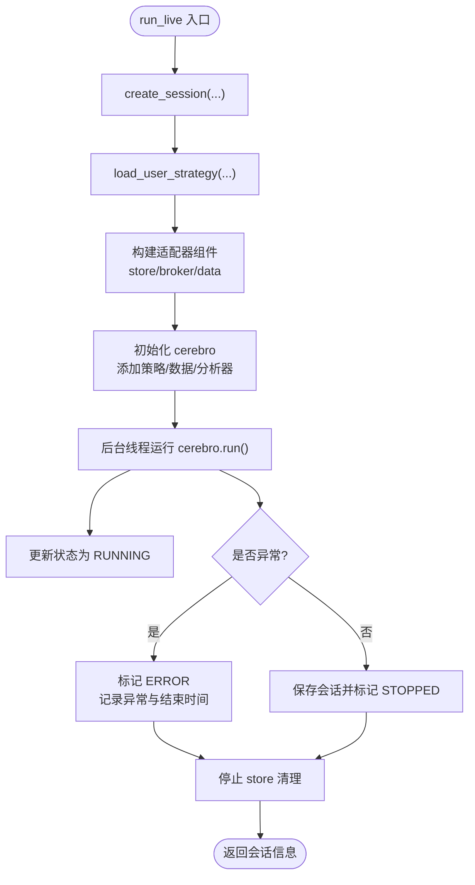
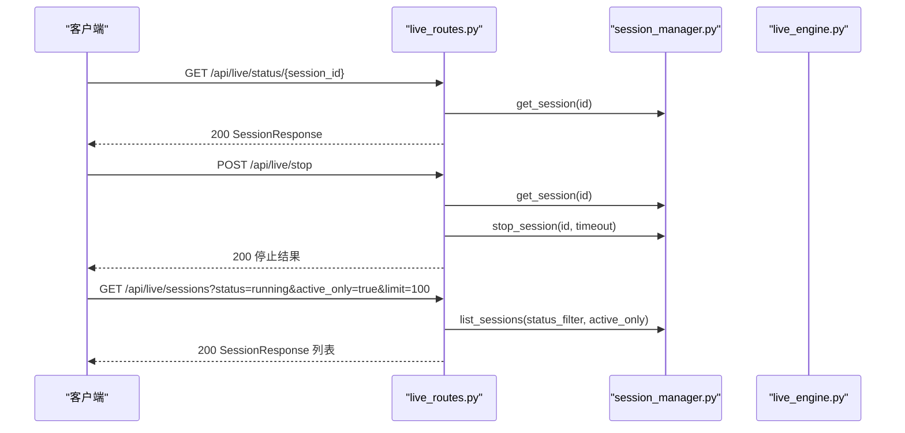
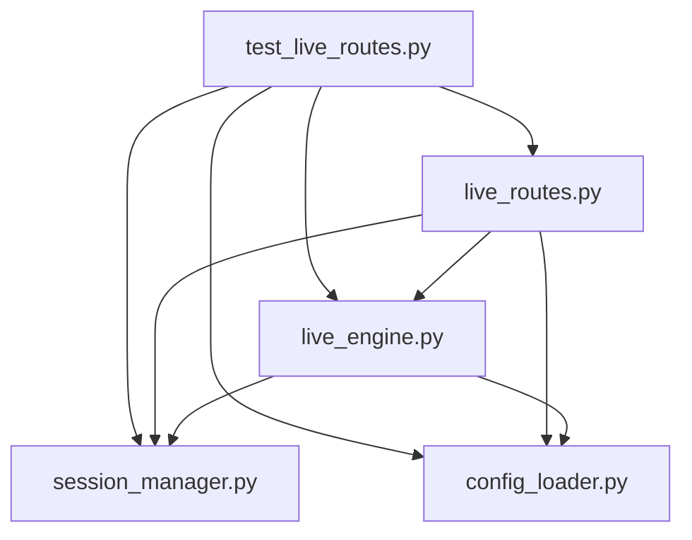

# 测试验证最佳实践

<cite>
**本文引用的文件**
- [auto_test.md](file://auto_test/auto_test.md)
- [test_live_routes.py](file://auto_test/test_live_routes.py)
- [test_session_manager.py](file://auto_test/test_session_manager.py)
- [test_support.py](file://auto_test/test_support.py)
- [live_routes.py](file://backend/src/routes/live_routes.py)
- [live_engine.py](file://backend/src/service/live_engine.py)
- [session_manager.py](file://backend/src/service/session_manager.py)
- [config_loader.py](file://backend/src/utils/config_loader.py)
- [sma_cross.py](file://backend/resources/strategy/sma_cross.py)
- [buy_and_hold.py](file://backend/resources/strategy/buy_and_hold.py)
</cite>

## 目录
1. [引言](#引言)
2. [项目结构](#项目结构)
3. [核心组件](#核心组件)
4. [架构总览](#架构总览)
5. [详细组件分析](#详细组件分析)
6. [依赖分析](#依赖分析)
7. [性能考虑](#性能考虑)
8. [故障排查指南](#故障排查指南)
9. [结论](#结论)
10. [附录](#附录)

## 引言
本文件围绕仓库中的自动化测试与验证体系，总结端到端集成测试的设计原则，并结合现有测试用例与业务实现，给出覆盖设计、断言标准、回归范围与仿真测试方案。重点覆盖：
- 基于 auto_test.md 的测试框架约定与运行方式
- 对实盘交易流程的端到端测试方法：会话创建、策略加载、订单执行等关键路径
- 结合 live_engine.py 的业务逻辑，定义测试覆盖率目标与回归测试范围
- 在无真实交易所凭据条件下进行仿真测试，保障 CI/CD 的可重复性与稳定性

## 项目结构
自动测试位于 auto_test 目录，采用 pytest 驱动，通过 FastAPI TestClient 调用后端路由，配合轻量 stub 模拟外部依赖（如 CCXT），确保测试不依赖真实网络或密钥。

图表来源
- [test_live_routes.py](file://auto_test/test_live_routes.py#L1-L125)
- [test_session_manager.py](file://auto_test/test_session_manager.py#L1-L71)
- [test_support.py](file://auto_test/test_support.py#L1-L47)
- [live_routes.py](file://backend/src/routes/live_routes.py#L1-L423)
- [live_engine.py](file://backend/src/service/live_engine.py#L1-L329)
- [session_manager.py](file://backend/src/service/session_manager.py#L1-L410)
- [config_loader.py](file://backend/src/utils/config_loader.py#L1-L200)
- [sma_cross.py](file://backend/resources/strategy/sma_cross.py#L1-L19)
- [buy_and_hold.py](file://backend/resources/strategy/buy_and_hold.py#L1-L11)

章节来源
- [auto_test.md](file://auto_test/auto_test.md#L1-L26)

## 核心组件
- 自动化测试框架与约定
  - 使用 pytest 运行，测试文件命名规范为 test_*.py，避免副作用
  - 不允许真实网络调用；使用 stub 或 mock 外部服务
  - 环境自包含：不写入仓库外内容，不依赖真实密钥
  - 运行方式：从仓库根目录执行 pytest 命令
- 测试支撑工具
  - 将 backend 加入 sys.path，保证从仓库根导入后端模块
  - 在测试期间禁用登录与实盘开关，确保可重复运行
  - 提供重置 SessionManager 的工具，隔离测试状态
- 实盘路由与引擎
  - 路由层负责参数校验、权限控制、错误映射与响应模型
  - 引擎层负责会话生命周期、策略加载、组件初始化、后台线程运行与状态持久化
  - 会话管理器提供单例、线程安全、状态更新与批量停止能力

章节来源
- [auto_test.md](file://auto_test/auto_test.md#L1-L26)
- [test_support.py](file://auto_test/test_support.py#L1-L47)
- [live_routes.py](file://backend/src/routes/live_routes.py#L1-L423)
- [live_engine.py](file://backend/src/service/live_engine.py#L1-L329)
- [session_manager.py](file://backend/src/service/session_manager.py#L1-L410)

## 架构总览
下图展示端到端测试如何覆盖实盘交易的关键路径：路由校验与权限、会话创建与状态、引擎启动与后台执行、会话查询与健康检查。

图表来源
- [test_live_routes.py](file://auto_test/test_live_routes.py#L1-L125)
- [live_routes.py](file://backend/src/routes/live_routes.py#L100-L182)
- [live_engine.py](file://backend/src/service/live_engine.py#L100-L266)
- [session_manager.py](file://backend/src/service/session_manager.py#L133-L217)
- [config_loader.py](file://backend/src/utils/config_loader.py#L113-L200)

## 详细组件分析

### 设计原则与测试用例划分
- 分层测试
  - 路由层：校验请求模型、权限开关、错误码映射、响应模型一致性
  - 引擎层：会话生命周期、策略加载、组件初始化、后台线程与异常处理
  - 会话管理器：创建/获取/停止/批量停止、状态转换、并发安全
- 用例划分
  - 健康检查：确认系统可用、启用交易所列表、会话计数
  - 权限拒绝：未启用实盘时拒绝启动
  - 会话种子：手动创建会话并通过路由列出
  - 参数校验：模式、符号、时间粒度、配置有效性
  - 生命周期：启动、运行、停止、错误状态
- 断言标准
  - HTTP 状态码与错误详情
  - 响应体字段完整性与类型一致性
  - 会话状态值与预期一致
  - 计数统计与过滤参数生效

章节来源
- [auto_test.md](file://auto_test/auto_test.md#L1-L26)
- [test_live_routes.py](file://auto_test/test_live_routes.py#L68-L121)
- [test_session_manager.py](file://auto_test/test_session_manager.py#L18-L67)

### mock 策略与外部依赖隔离
- CCXT stub 安装
  - 在应用模块导入前，动态注入轻量 stub，替换 ccxt/ccxt.async_support 及其子模块
  - 提供最小接口满足引擎初始化需求，避免真实网络调用
- 环境变量控制
  - 禁用登录与实盘开关，确保测试可在离线环境稳定运行
- 会话管理器隔离
  - 每个测试前后清理全局会话缓存，避免跨用例污染

图表来源
- [test_live_routes.py](file://auto_test/test_live_routes.py#L11-L48)
- [test_support.py](file://auto_test/test_support.py#L19-L47)
- [test_session_manager.py](file://auto_test/test_session_manager.py#L11-L17)

章节来源
- [test_live_routes.py](file://auto_test/test_live_routes.py#L11-L48)
- [test_support.py](file://auto_test/test_support.py#L19-L47)

### 实盘交易流程测试方法（test_live_routes.py）
- 健康检查
  - 调用 /api/live/health，断言返回 200，状态为 healthy，包含启用交易所列表与会话计数字段
- 权限拒绝
  - 在未启用实盘时，POST /api/live/start 返回 403，错误详情包含“Live trading is disabled”
- 会话种子与列表
  - 手动创建会话，GET /api/live/sessions 返回包含该会话的列表，字段与会话对象一致，状态为 STARTING

图表来源
- [test_live_routes.py](file://auto_test/test_live_routes.py#L68-L121)
- [live_routes.py](file://backend/src/routes/live_routes.py#L392-L423)
- [session_manager.py](file://backend/src/service/session_manager.py#L133-L217)

章节来源
- [test_live_routes.py](file://auto_test/test_live_routes.py#L68-L121)
- [live_routes.py](file://backend/src/routes/live_routes.py#L100-L182)

### 会话管理器测试（test_session_manager.py）
- 创建与获取
  - create_session 返回会话对象，状态为 STARTING，is_active 为真
- 停止会话
  - stop_session 标记 STOPPING 并最终变为 STOPPED，设置 end_time，is_stopped 为真
- 批量停止
  - stop_all_sessions 对多个会话逐一停止，返回成功字典，所有会话状态为 STOPPED

图表来源
- [test_session_manager.py](file://auto_test/test_session_manager.py#L18-L67)
- [session_manager.py](file://backend/src/service/session_manager.py#L133-L217)

章节来源
- [test_session_manager.py](file://auto_test/test_session_manager.py#L18-L67)
- [session_manager.py](file://backend/src/service/session_manager.py#L133-L217)

### 引擎与策略加载（live_engine.py）
- 关键路径
  - 会话创建：SessionManager.create_session
  - 策略加载：load_user_strategy
  - 组件初始化：根据适配器选择 CCXT 或 IBKR，初始化 store/broker/data
  - 后台运行：在独立线程中运行 cerebro，更新状态并保存
  - 停止与清理：stop_live 委托 SessionManager 停止，关闭 store，更新状态
- 错误处理
  - 异常捕获并标记 ERROR，记录错误消息与结束时间
  - SafeReturns 避免零条目导致除零错误
- 数据与分析
  - 添加 SharpeRatio、DrawDown、Returns、TradeRecorder 等分析器

图表来源
- [live_engine.py](file://backend/src/service/live_engine.py#L100-L266)

章节来源
- [live_engine.py](file://backend/src/service/live_engine.py#L100-L266)

### 路由层契约与断言（live_routes.py）
- 启动接口
  - 校验 LIVE_TRADING_ENABLED，模式仅允许 paper/live，校验符号与时间粒度，调用 run_live 并返回会话信息
- 停止接口
  - 校验会话存在与活跃状态，委托 SessionManager 停止，返回最终状态与指标
- 查询接口
  - status：返回完整会话信息
  - sessions：支持按状态过滤、仅活跃、限制数量
  - orders：返回会话内订单列表
  - exchanges：返回启用交易所列表
  - health：返回系统健康状态与会话计数

图表来源
- [live_routes.py](file://backend/src/routes/live_routes.py#L256-L338)
- [session_manager.py](file://backend/src/service/session_manager.py#L293-L317)

章节来源
- [live_routes.py](file://backend/src/routes/live_routes.py#L100-L182)
- [live_routes.py](file://backend/src/routes/live_routes.py#L184-L247)
- [live_routes.py](file://backend/src/routes/live_routes.py#L256-L338)
- [live_routes.py](file://backend/src/routes/live_routes.py#L340-L423)

### 配置加载与策略资源
- 配置加载
  - BrokerConfig、ExchangeConfig 等 Pydantic 模型，提供强类型配置与校验
  - 支持缓存与热加载，缺失文件与结构错误抛出明确异常
- 示例策略
  - sma_cross：简单均线交叉策略
  - buy_and_hold：只做一次买入持有策略

章节来源
- [config_loader.py](file://backend/src/utils/config_loader.py#L1-L200)
- [sma_cross.py](file://backend/resources/strategy/sma_cross.py#L1-L19)
- [buy_and_hold.py](file://backend/resources/strategy/buy_and_hold.py#L1-L11)

## 依赖分析
- 测试对后端的耦合点
  - 路由层依赖配置加载与会话管理器
  - 引擎层依赖策略加载、适配器组件与数据库会话存储
  - 测试通过 stub 与环境变量降低对外部系统的依赖
- 关键依赖关系图

图表来源
- [test_live_routes.py](file://auto_test/test_live_routes.py#L51-L55)
- [live_routes.py](file://backend/src/routes/live_routes.py#L1-L40)
- [live_engine.py](file://backend/src/service/live_engine.py#L1-L30)
- [session_manager.py](file://backend/src/service/session_manager.py#L1-L30)
- [config_loader.py](file://backend/src/utils/config_loader.py#L1-L30)

章节来源
- [test_live_routes.py](file://auto_test/test_live_routes.py#L51-L55)
- [live_routes.py](file://backend/src/routes/live_routes.py#L1-L40)
- [live_engine.py](file://backend/src/service/live_engine.py#L1-L30)
- [session_manager.py](file://backend/src/service/session_manager.py#L1-L30)
- [config_loader.py](file://backend/src/utils/config_loader.py#L1-L30)

## 性能考虑
- 测试执行效率
  - 使用 TestClient 直连应用，避免真实网络开销
  - 通过 stub 替换外部依赖，减少 IO 与连接建立时间
- 并发与隔离
  - 会话管理器使用锁保护，测试中通过 reset_session_manager 隔离状态
- 资源释放
  - 引擎在异常与正常退出时均清理 store，避免资源泄漏

[本节为通用建议，无需具体文件引用]

## 故障排查指南
- 常见问题定位
  - 启动被拒：检查 LIVE_TRADING_ENABLED 是否开启
  - 参数错误：核对模式、符号格式、时间粒度是否在配置允许范围内
  - 会话不存在：确认 session_id 是否正确，或先通过 create_session 种子
- 日志与状态
  - 引擎与路由均记录关键事件，可通过日志定位异常
  - 使用 GET /api/live/status/{session_id} 查看当前状态与错误信息
- 回归测试范围
  - 路由层：启动/停止/状态/会话列表/订单/交易所/健康检查
  - 引擎层：会话生命周期、策略加载、组件初始化、后台线程、异常处理
  - 会话管理器：创建/获取/更新/停止/批量停止、状态统计

章节来源
- [live_routes.py](file://backend/src/routes/live_routes.py#L100-L182)
- [live_routes.py](file://backend/src/routes/live_routes.py#L184-L247)
- [live_routes.py](file://backend/src/routes/live_routes.py#L256-L338)
- [live_engine.py](file://backend/src/service/live_engine.py#L268-L329)
- [session_manager.py](file://backend/src/service/session_manager.py#L238-L292)

## 结论
通过将外部依赖 stub 化、环境变量隔离与严格的断言标准，本项目的自动化测试实现了对实盘交易关键路径的高覆盖验证。建议持续扩展以下方面：
- 增加更多策略与配置场景的回归用例
- 引入更细粒度的单元测试，覆盖策略与适配器边界条件
- 在 CI 中固定 Python 版本与依赖版本，确保可重复性
- 对关键错误路径补充断言，提升可观测性

[本节为总结性内容，无需具体文件引用]

## 附录

### 测试覆盖率目标与回归范围
- 路由层
  - 启动接口：参数校验、权限控制、错误映射、响应模型
  - 停止接口：会话存在性、活跃状态、停止行为、最终状态
  - 查询接口：状态、会话列表（过滤/限制）、订单、交易所、健康检查
- 引擎层
  - 会话生命周期：创建、运行、停止、错误
  - 策略加载：策略文件存在性、类名正确性
  - 组件初始化：适配器选择、store/broker/data 正常启动
  - 后台执行：线程运行、状态更新、异常捕获
- 会话管理器
  - 单例与线程安全
  - 状态转换与统计
  - 批量停止与清理

章节来源
- [live_routes.py](file://backend/src/routes/live_routes.py#L100-L182)
- [live_routes.py](file://backend/src/routes/live_routes.py#L184-L247)
- [live_routes.py](file://backend/src/routes/live_routes.py#L256-L338)
- [live_engine.py](file://backend/src/service/live_engine.py#L100-L266)
- [session_manager.py](file://backend/src/service/session_manager.py#L133-L217)

### 仿真测试方案（无真实交易所凭据）
- CCXT stub 安装
  - 在应用导入前，通过 sys.modules 注入轻量 stub，提供最小接口满足引擎初始化
- 环境变量
  - 禁用登录与实盘开关，确保测试可在离线环境稳定运行
- 会话种子
  - 使用 reset_session_manager 清理全局状态，手动创建会话作为种子数据
- 运行方式
  - 从仓库根目录执行 pytest，确保 backend 可导入且环境变量生效

章节来源
- [test_live_routes.py](file://auto_test/test_live_routes.py#L11-L48)
- [test_support.py](file://auto_test/test_support.py#L19-L47)
- [test_session_manager.py](file://auto_test/test_session_manager.py#L11-L17)