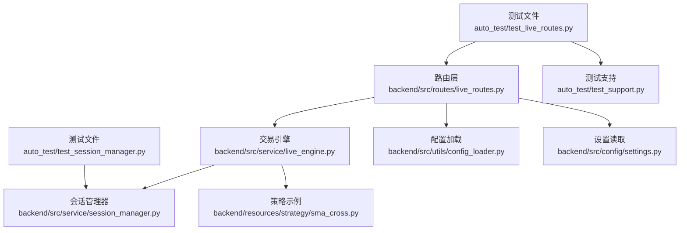
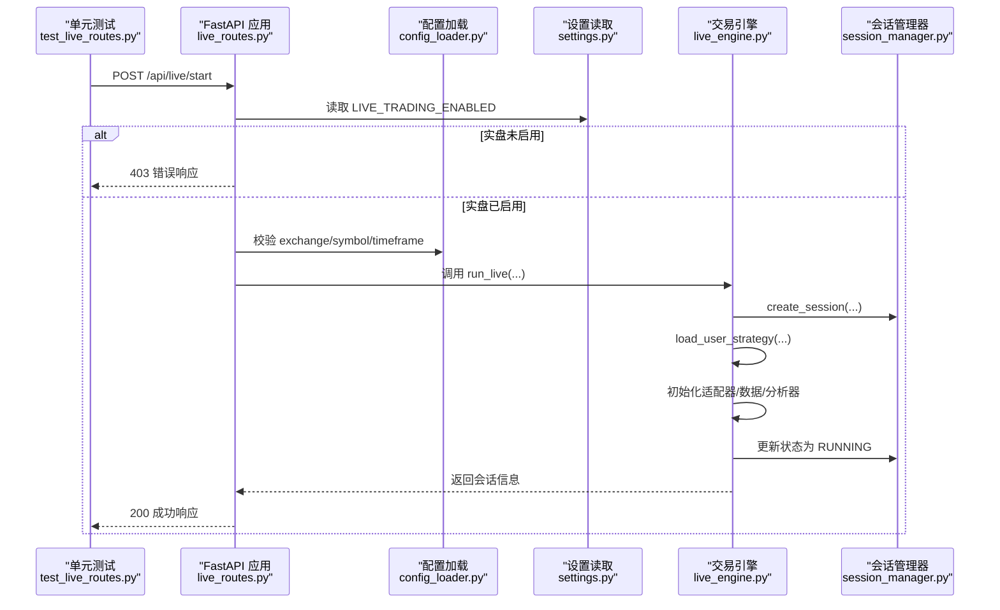
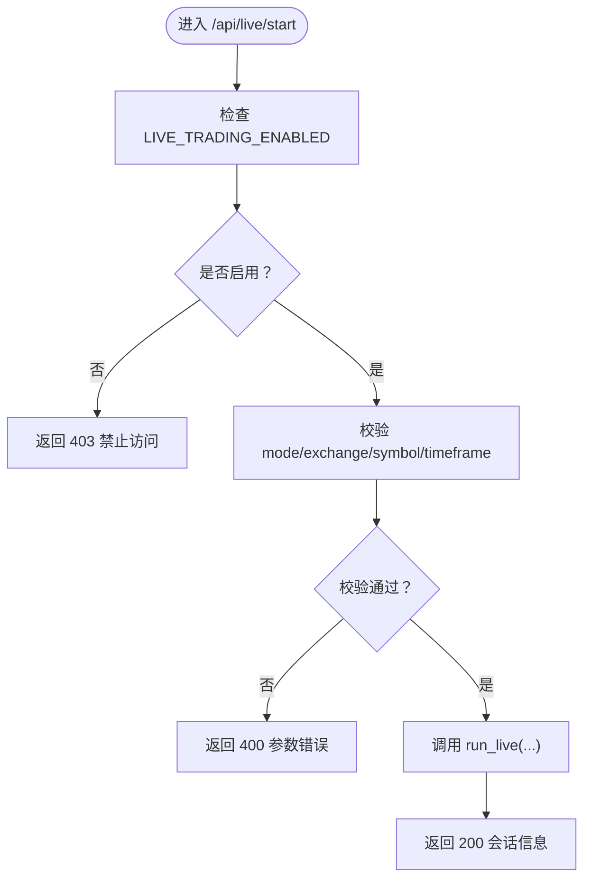
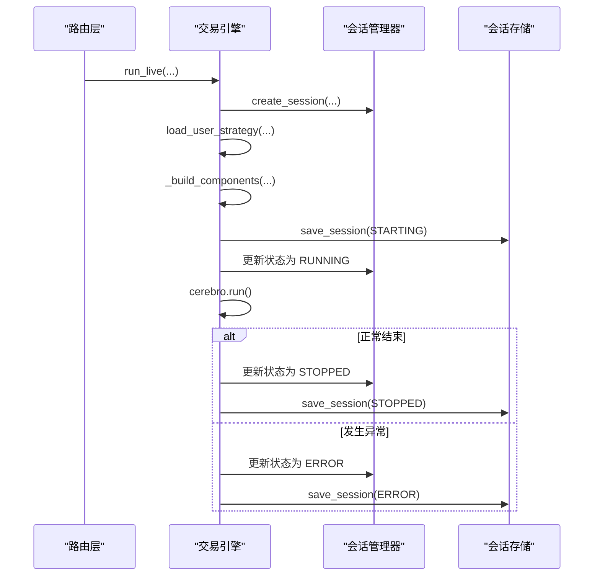
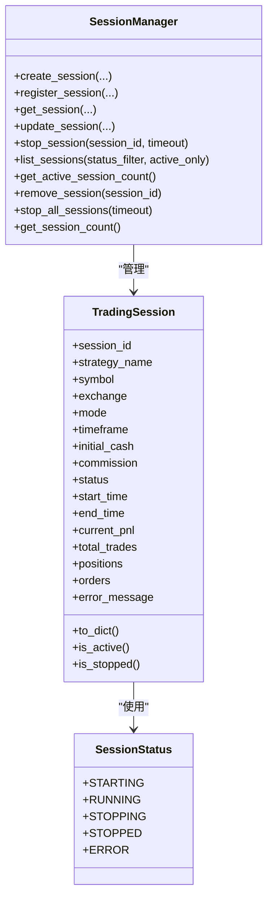
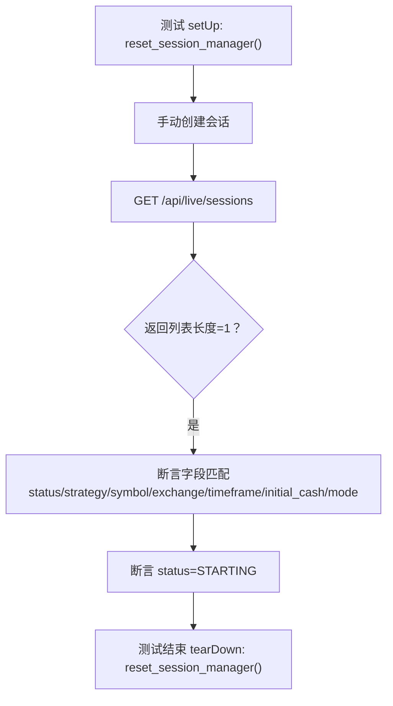
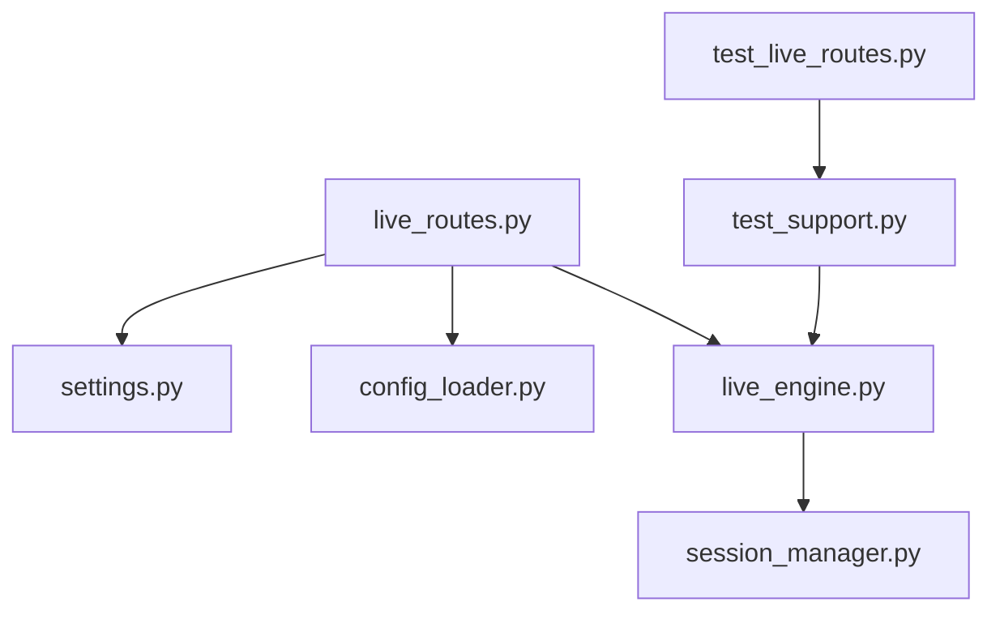

# 交易流程测试

<cite>
**本文引用的文件列表**
- [test_live_routes.py](file://auto_test/test_live_routes.py)
- [live_routes.py](file://backend/src/routes/live_routes.py)
- [live_engine.py](file://backend/src/service/live_engine.py)
- [session_manager.py](file://backend/src/service/session_manager.py)
- [test_session_manager.py](file://auto_test/test_session_manager.py)
- [settings.py](file://backend/src/config/settings.py)
- [config_loader.py](file://backend/src/utils/config_loader.py)
- [test_support.py](file://auto_test/test_support.py)
- [sma_cross.py](file://backend/resources/strategy/sma_cross.py)
</cite>

## 目录
1. [引言](#引言)
2. [项目结构](#项目结构)
3. [核心组件](#核心组件)
4. [架构总览](#架构总览)
5. [详细组件分析](#详细组件分析)
6. [依赖关系分析](#依赖关系分析)
7. [性能考量](#性能考量)
8. [故障排查指南](#故障排查指南)
9. [结论](#结论)
10. [附录](#附录)

## 引言
本文件围绕实盘交易核心流程的集成测试机制展开，重点基于 auto_test/test_live_routes.py 中的 test_start_rejected_when_live_disabled 测试用例，深入解析交易启动的安全控制、策略加载与异常处理流程。同时结合 backend/src/service/live_engine.py 的 run_live 函数与 backend/src/service/session_manager.py 的会话状态管理，解释测试如何覆盖“交易模式禁用”“会话状态转换”“错误传播”等关键路径。文档还展示如何通过配置模拟验证系统在不同环境下的行为一致性，并确保交易引擎与会话管理器的协同工作；最后给出交易流程测试的覆盖率评估与回归测试策略建议。

## 项目结构
本次分析聚焦于以下模块：
- 自动化测试：auto_test/test_live_routes.py、auto_test/test_session_manager.py、auto_test/test_support.py
- 路由层：backend/src/routes/live_routes.py
- 服务层：backend/src/service/live_engine.py、backend/src/service/session_manager.py
- 配置与设置：backend/src/config/settings.py、backend/src/utils/config_loader.py
- 策略示例：backend/resources/strategy/sma_cross.py

下图展示了与交易流程测试直接相关的文件与调用关系：

图表来源
- [test_live_routes.py](file://auto_test/test_live_routes.py#L57-L124)
- [live_routes.py](file://backend/src/routes/live_routes.py#L101-L182)
- [live_engine.py](file://backend/src/service/live_engine.py#L100-L266)
- [session_manager.py](file://backend/src/service/session_manager.py#L133-L292)
- [config_loader.py](file://backend/src/utils/config_loader.py#L113-L200)
- [settings.py](file://backend/src/config/settings.py#L38-L42)
- [test_support.py](file://auto_test/test_support.py#L25-L47)
- [sma_cross.py](file://backend/resources/strategy/sma_cross.py#L1-L19)

章节来源
- [test_live_routes.py](file://auto_test/test_live_routes.py#L57-L124)
- [live_routes.py](file://backend/src/routes/live_routes.py#L101-L182)
- [live_engine.py](file://backend/src/service/live_engine.py#L100-L266)
- [session_manager.py](file://backend/src/service/session_manager.py#L133-L292)
- [config_loader.py](file://backend/src/utils/config_loader.py#L113-L200)
- [settings.py](file://backend/src/config/settings.py#L38-L42)
- [test_support.py](file://auto_test/test_support.py#L25-L47)
- [sma_cross.py](file://backend/resources/strategy/sma_cross.py#L1-L19)

## 核心组件
- 路由层（live_routes.py）：提供 /api/live/start、/api/live/stop、/api/live/sessions 等端点，负责安全控制（LIVE_TRADING_ENABLED）、参数校验与异常映射到 HTTP 响应。
- 交易引擎（live_engine.py）：封装 run_live，协调策略加载、适配器初始化、Cerebro 运行、后台线程与状态持久化。
- 会话管理器（session_manager.py）：集中管理会话生命周期（STARTING/RUNNING/STOPPING/STOPPED/ERROR），提供创建、更新、停止、查询等能力。
- 配置加载（config_loader.py）：加载 broker_config.json 并进行结构与字段校验，提供 get_exchange_config、validate_symbol、validate_timeframe 等工具。
- 设置读取（settings.py）：从 .env 加载 LIVE_TRADING_ENABLED 等运行时开关。
- 测试支持（test_support.py）：确保后端可导入、禁用登录与实盘开关、重置会话管理器全局状态。
- 策略示例（sma_cross.py）：作为 run_live 中 load_user_strategy 的目标策略。

章节来源
- [live_routes.py](file://backend/src/routes/live_routes.py#L101-L182)
- [live_engine.py](file://backend/src/service/live_engine.py#L100-L266)
- [session_manager.py](file://backend/src/service/session_manager.py#L133-L292)
- [config_loader.py](file://backend/src/utils/config_loader.py#L113-L200)
- [settings.py](file://backend/src/config/settings.py#L38-L42)
- [test_support.py](file://auto_test/test_support.py#L25-L47)
- [sma_cross.py](file://backend/resources/strategy/sma_cross.py#L1-L19)

## 架构总览
下图展示了从测试发起到引擎执行的关键调用链路，以及安全控制与状态转换的路径。

图表来源
- [test_live_routes.py](file://auto_test/test_live_routes.py#L78-L94)
- [live_routes.py](file://backend/src/routes/live_routes.py#L122-L182)
- [settings.py](file://backend/src/config/settings.py#L38-L42)
- [config_loader.py](file://backend/src/utils/config_loader.py#L179-L200)
- [live_engine.py](file://backend/src/service/live_engine.py#L144-L209)
- [session_manager.py](file://backend/src/service/session_manager.py#L133-L186)

## 详细组件分析

### 组件A：路由层安全控制与请求处理（/api/live/start）
- 安全控制：当 LIVE_TRADING_ENABLED 为假时，直接抛出 403，消息包含“Live trading is disabled”，与测试用例断言一致。
- 参数校验：校验 mode、exchange、symbol、timeframe 等，失败返回 400；异常映射为 500。
- 协同引擎：成功校验后调用 run_live，返回会话信息。

图表来源
- [live_routes.py](file://backend/src/routes/live_routes.py#L122-L182)
- [settings.py](file://backend/src/config/settings.py#L38-L42)

章节来源
- [live_routes.py](file://backend/src/routes/live_routes.py#L101-L182)
- [settings.py](file://backend/src/config/settings.py#L38-L42)

### 组件B：交易引擎 run_live 的执行与状态转换
- 会话创建：通过 get_session_manager().create_session(...) 创建会话并设置初始状态为 STARTING。
- 策略加载：load_user_strategy 加载策略类，失败返回 404。
- 组件初始化：根据 exchange 的 adapter 选择 CCXT 或 IBKR，初始化 store/broker/data_feed。
- 后台运行：在独立线程中更新状态为 RUNNING，执行 cerebro.run()，结束后更新为 STOPPED 或 ERROR。
- 异常处理：捕获异常，更新状态为 ERROR，记录错误信息并清理资源。

图表来源
- [live_engine.py](file://backend/src/service/live_engine.py#L144-L266)
- [session_manager.py](file://backend/src/service/session_manager.py#L133-L204)
- [live_engine.py](file://backend/src/service/live_engine.py#L202-L248)

章节来源
- [live_engine.py](file://backend/src/service/live_engine.py#L100-L266)
- [session_manager.py](file://backend/src/service/session_manager.py#L133-L204)

### 组件C：会话状态管理与停止逻辑
- 状态枚举：STARTING、RUNNING、STOPPING、STOPPED、ERROR。
- 生命周期：create_session 创建并注册；stop_session 停止运行线程、关闭 store、更新状态并持久化。
- 查询与统计：list_sessions、get_session_count、get_active_session_count 支持前端展示与健康检查。

图表来源
- [session_manager.py](file://backend/src/service/session_manager.py#L20-L94)
- [session_manager.py](file://backend/src/service/session_manager.py#L133-L292)

章节来源
- [session_manager.py](file://backend/src/service/session_manager.py#L20-L94)
- [session_manager.py](file://backend/src/service/session_manager.py#L133-L292)

### 组件D：测试用例覆盖与配置模拟
- test_start_rejected_when_live_disabled：通过禁用 LIVE_TRADING_ENABLED 触发 403，验证安全控制生效。
- test_list_sessions_returns_seeded_session：通过 reset_session_manager 清理全局状态，手动创建会话，验证 /api/live/sessions 列表正确返回。
- test_session_manager.*：验证 create/get/stop/stop_all 的状态转换与一致性。

图表来源
- [test_live_routes.py](file://auto_test/test_live_routes.py#L95-L121)
- [test_support.py](file://auto_test/test_support.py#L31-L41)
- [session_manager.py](file://backend/src/service/session_manager.py#L133-L186)

章节来源
- [test_live_routes.py](file://auto_test/test_live_routes.py#L78-L121)
- [test_session_manager.py](file://auto_test/test_session_manager.py#L18-L67)
- [test_support.py](file://auto_test/test_support.py#L31-L41)

## 依赖关系分析
- 路由层依赖设置读取（LIVE_TRADING_ENABLED）与配置加载（exchange/symbol/timeframe 校验）。
- 交易引擎依赖会话管理器进行会话生命周期管理，并依赖配置加载与策略加载。
- 测试通过 test_support 注入轻量 stub（ccxt）避免真实网络依赖，确保测试稳定与可重复。

图表来源
- [live_routes.py](file://backend/src/routes/live_routes.py#L101-L182)
- [settings.py](file://backend/src/config/settings.py#L38-L42)
- [config_loader.py](file://backend/src/utils/config_loader.py#L113-L200)
- [live_engine.py](file://backend/src/service/live_engine.py#L100-L266)
- [session_manager.py](file://backend/src/service/session_manager.py#L133-L204)
- [test_live_routes.py](file://auto_test/test_live_routes.py#L1-L48)
- [test_support.py](file://auto_test/test_support.py#L19-L47)

章节来源
- [live_routes.py](file://backend/src/routes/live_routes.py#L101-L182)
- [settings.py](file://backend/src/config/settings.py#L38-L42)
- [config_loader.py](file://backend/src/utils/config_loader.py#L113-L200)
- [live_engine.py](file://backend/src/service/live_engine.py#L100-L266)
- [session_manager.py](file://backend/src/service/session_manager.py#L133-L204)
- [test_live_routes.py](file://auto_test/test_live_routes.py#L1-L48)
- [test_support.py](file://auto_test/test_support.py#L19-L47)

## 性能考量
- 后台线程运行 cerebro：run_live 在独立线程中执行，避免阻塞 API 响应；线程名称包含 session_id 便于调试。
- 状态持久化：每次状态变更均保存至数据库，保证异常恢复与状态一致性。
- 配置缓存：config_loader 对 broker_config.json 使用缓存，减少重复 IO。
- 健康检查：/api/live/health 提供活跃会话计数与启用交易所列表，便于运维监控。

章节来源
- [live_engine.py](file://backend/src/service/live_engine.py#L202-L248)
- [config_loader.py](file://backend/src/utils/config_loader.py#L113-L169)
- [live_routes.py](file://backend/src/routes/live_routes.py#L392-L423)

## 故障排查指南
- 403 禁止访问：确认 .env 中 LIVE_TRADING_ENABLED 已设为 true；或在测试中通过 test_support.disable_auth_for_tests() 控制。
- 400 参数错误：检查 exchange 是否在 broker_config.json 中启用且 enabled=true；symbol 与 timeframe 是否符合配置。
- 404 策略不存在：确认策略文件名与 backend/resources/strategy 下的策略一致。
- 500 引擎异常：查看 run_live 捕获的异常分支，关注 ERROR 状态与 error_message 字段；检查 store.stop() 是否正常释放资源。
- 健康检查异常：/api/live/health 返回 unhealthy 时，检查日志与 broker_config.json 结构有效性。

章节来源
- [live_routes.py](file://backend/src/routes/live_routes.py#L122-L182)
- [live_engine.py](file://backend/src/service/live_engine.py#L227-L248)
- [live_routes.py](file://backend/src/routes/live_routes.py#L392-L423)
- [config_loader.py](file://backend/src/utils/config_loader.py#L148-L177)

## 结论
通过 test_start_rejected_when_live_disabled 测试，我们验证了路由层对 LIVE_TRADING_ENABLED 的严格控制；结合 live_engine 的 run_live 与 session_manager 的状态机，测试覆盖了交易启动、策略加载、异常传播与状态持久化的关键路径。测试通过轻量 stub 与 reset_session_manager 的全局状态隔离，确保在不同环境（开发/CI）下行为一致。建议持续扩展测试矩阵，覆盖更多异常场景与并发路径，以提升系统鲁棒性。

## 附录

### 交易流程测试覆盖率评估
- 路由层安全控制：已覆盖（403 场景）
- 参数校验与错误映射：已覆盖（400/404/500）
- 会话生命周期：已覆盖（STARTING/RUNNING/STOPPED/ERROR）
- 异常传播与清理：已覆盖（ERROR 状态、store.stop）
- 健康检查与统计：已覆盖（/api/live/health）

建议补充：
- 多会话并发启动/停止
- 不同 adapter（ccxt/ibkr）与 exchange 配置
- 网络异常与重连策略
- 订单与持仓查询接口的集成测试

章节来源
- [test_live_routes.py](file://auto_test/test_live_routes.py#L78-L121)
- [test_session_manager.py](file://auto_test/test_session_manager.py#L18-L67)
- [live_routes.py](file://backend/src/routes/live_routes.py#L101-L182)
- [live_engine.py](file://backend/src/service/live_engine.py#L100-L266)
- [session_manager.py](file://backend/src/service/session_manager.py#L133-L292)