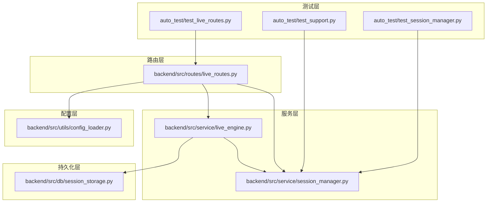
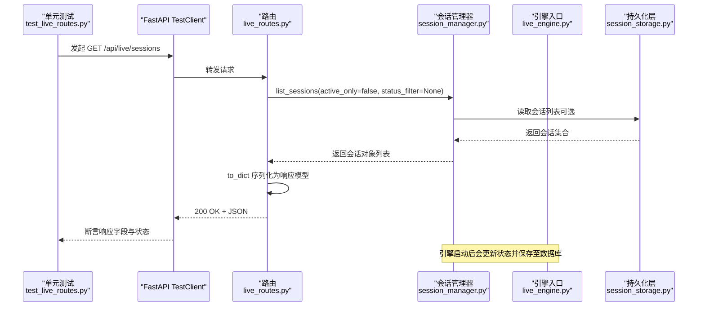
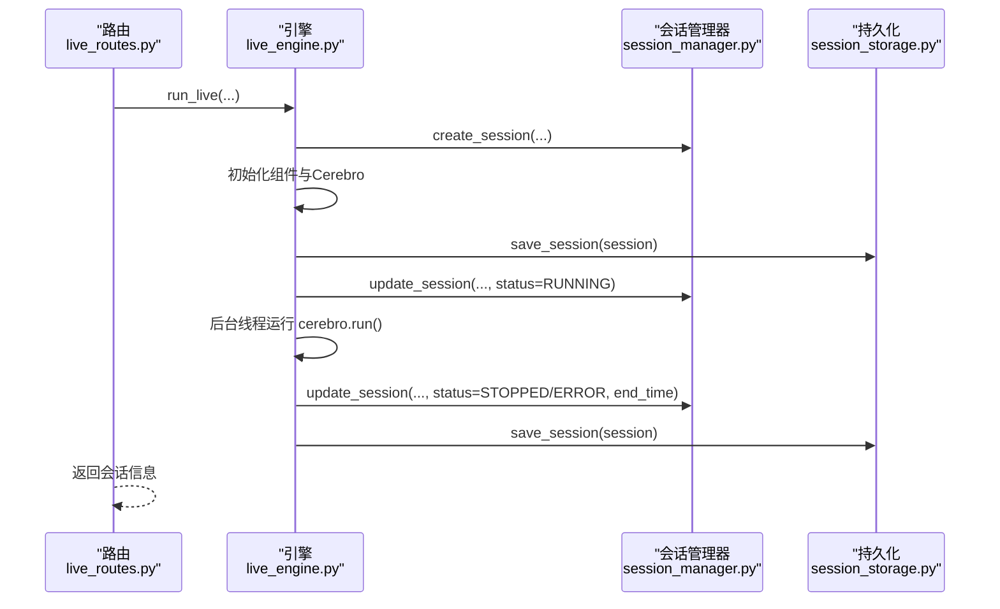
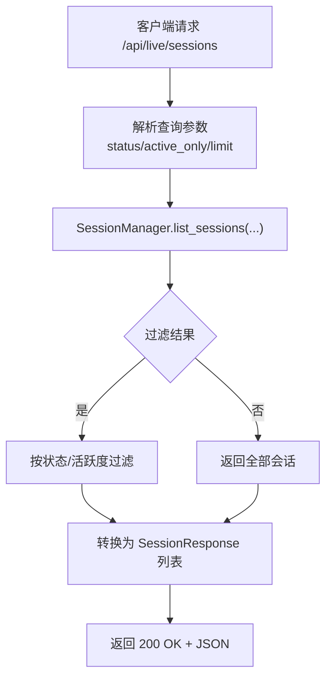
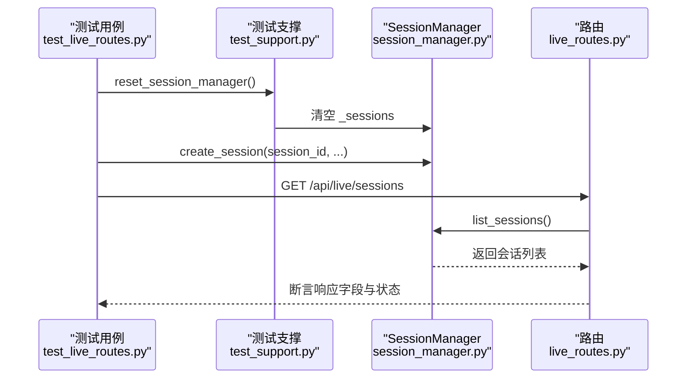
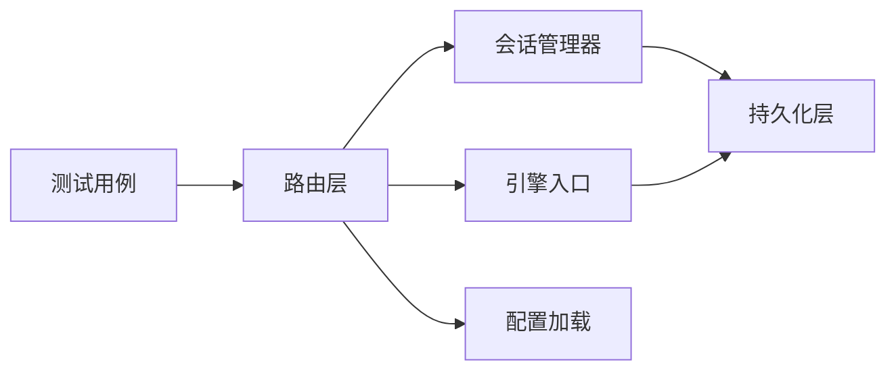

# 会话管理测试

<cite>
**本文引用的文件列表**
- [test_live_routes.py](file://auto_test/test_live_routes.py)
- [test_session_manager.py](file://auto_test/test_session_manager.py)
- [test_support.py](file://auto_test/test_support.py)
- [session_manager.py](file://backend/src/service/session_manager.py)
- [live_routes.py](file://backend/src/routes/live_routes.py)
- [live_engine.py](file://backend/src/service/live_engine.py)
- [session_storage.py](file://backend/src/db/session_storage.py)
- [config_loader.py](file://backend/src/utils/config_loader.py)
</cite>

## 目录
1. [引言](#引言)
2. [项目结构](#项目结构)
3. [核心组件](#核心组件)
4. [架构总览](#架构总览)
5. [详细组件分析](#详细组件分析)
6. [依赖关系分析](#依赖关系分析)
7. [性能考量](#性能考量)
8. [故障排查指南](#故障排查指南)
9. [结论](#结论)
10. [附录](#附录)

## 引言
本文件围绕实盘交易会话管理功能的集成测试展开，重点以 auto_test/test_live_routes.py 中的 test_list_sessions_returns_seeded_session 测试用例为切入点，系统阐述如何通过预置会话数据验证会话创建、查询与状态同步的完整性；并结合 backend/src/service/session_manager.py 的 SessionManager 实现，解释测试如何验证会话生命周期管理、线程安全操作与状态持久化。同时，文档给出测试用例在边界条件与异常场景下的覆盖策略建议，帮助读者全面理解会话状态机的正确性与鲁棒性。

## 项目结构
本次分析聚焦于以下模块：
- 自动化测试：auto_test/test_live_routes.py、auto_test/test_session_manager.py、auto_test/test_support.py
- 服务层：backend/src/service/session_manager.py（会话管理）、backend/src/service/live_engine.py（引擎入口）
- 路由层：backend/src/routes/live_routes.py（REST API）
- 数据持久化：backend/src/db/session_storage.py（数据库访问）
- 配置加载：backend/src/utils/config_loader.py（配置校验与加载）



图表来源
- [test_live_routes.py](file://auto_test/test_live_routes.py#L1-L125)
- [test_session_manager.py](file://auto_test/test_session_manager.py#L1-L71)
- [test_support.py](file://auto_test/test_support.py#L1-L47)
- [live_routes.py](file://backend/src/routes/live_routes.py#L1-L423)
- [session_manager.py](file://backend/src/service/session_manager.py#L1-L410)
- [live_engine.py](file://backend/src/service/live_engine.py#L1-L329)
- [session_storage.py](file://backend/src/db/session_storage.py#L1-L392)
- [config_loader.py](file://backend/src/utils/config_loader.py#L1-L200)

章节来源
- [test_live_routes.py](file://auto_test/test_live_routes.py#L1-L125)
- [test_session_manager.py](file://auto_test/test_session_manager.py#L1-L71)
- [test_support.py](file://auto_test/test_support.py#L1-L47)
- [live_routes.py](file://backend/src/routes/live_routes.py#L1-L423)
- [session_manager.py](file://backend/src/service/session_manager.py#L1-L410)
- [live_engine.py](file://backend/src/service/live_engine.py#L1-L329)
- [session_storage.py](file://backend/src/db/session_storage.py#L1-L392)
- [config_loader.py](file://backend/src/utils/config_loader.py#L1-L200)

## 核心组件
- 会话模型与状态机：SessionStatus 枚举与 TradingSession 数据类定义了会话的生命周期状态与运行时字段，并提供序列化 to_dict() 供 API 响应使用。
- 会话管理器：SessionManager 提供单例模式、线程安全的会话注册、查询、更新、停止、统计等能力，并协调持久化层。
- 引擎入口：live_engine.run_live 将会话创建、组件初始化、Cerebro 运行与后台线程管理整合，驱动状态变更与持久化。
- 路由接口：live_routes 暴露 /api/live/sessions 等端点，调用 SessionManager 获取会话列表并返回标准化响应模型。
- 测试支撑：test_support.reset_session_manager 清理全局 SessionManager 状态，确保测试隔离；test_live_routes 使用 TestClient 对路由进行集成测试。

章节来源
- [session_manager.py](file://backend/src/service/session_manager.py#L20-L120)
- [session_manager.py](file://backend/src/service/session_manager.py#L120-L220)
- [session_manager.py](file://backend/src/service/session_manager.py#L220-L410)
- [live_engine.py](file://backend/src/service/live_engine.py#L100-L267)
- [live_routes.py](file://backend/src/routes/live_routes.py#L288-L338)
- [test_support.py](file://auto_test/test_support.py#L31-L47)
- [test_live_routes.py](file://auto_test/test_live_routes.py#L95-L122)

## 架构总览
下图展示了从测试到路由、服务与持久化的端到端流程，以及关键状态流转路径。



图表来源
- [test_live_routes.py](file://auto_test/test_live_routes.py#L95-L122)
- [live_routes.py](file://backend/src/routes/live_routes.py#L288-L338)
- [session_manager.py](file://backend/src/service/session_manager.py#L293-L317)
- [live_engine.py](file://backend/src/service/live_engine.py#L199-L226)
- [session_storage.py](file://backend/src/db/session_storage.py#L173-L234)

## 详细组件分析

### 组件A：会话生命周期与状态机
- 状态枚举：STARTING、RUNNING、STOPPING、STOPPED、ERROR，用于统一表示会话状态。
- 会话对象：包含配置字段、运行时对象（cerebro、store、thread）与指标字段（PnL、订单、持仓），并通过 to_dict() 输出标准化响应。
- 生命周期方法：
  - 创建：create_session 注册新会话，默认状态为 STARTING。
  - 更新：update_session 支持按需更新字段（如 status）。
  - 停止：stop_session 设置 STOPPING 并等待线程结束，最终设置 STOPPED 或 ERROR。
  - 列表：list_sessions 支持按状态或仅活跃会话过滤。
  - 统计：get_session_count、get_active_session_count 提供聚合信息。

```mermaid
classDiagram
class SessionStatus {
<<enumeration>>
"starting"
"running"
"stopping"
"stopped"
"error"
}
class TradingSession {
+string session_id
+string strategy_name
+string symbol
+string exchange
+string mode
+string timeframe
+float initial_cash
+float commission
+SessionStatus status
+datetime start_time
+datetime end_time
+float current_pnl
+int total_trades
+dict[] positions
+dict[] orders
+string error_message
+to_dict() dict
+is_active() bool
+is_stopped() bool
}
class SessionManager {
-Dict~string, TradingSession~ _sessions
-RLock _sessions_lock
+create_session(...) TradingSession
+register_session(session) void
+get_session(session_id) TradingSession
+update_session(session_id, ...) void
+stop_session(session_id, timeout) bool
+list_sessions(status_filter, active_only) TradingSession[]
+get_active_session_count() int
+remove_session(session_id) bool
+stop_all_sessions(timeout) Dict~string, bool~
+get_session_count() Dict~string, int~
}
TradingSession <.. SessionManager : "管理"
```

图表来源
- [session_manager.py](file://backend/src/service/session_manager.py#L20-L120)
- [session_manager.py](file://backend/src/service/session_manager.py#L120-L220)
- [session_manager.py](file://backend/src/service/session_manager.py#L293-L410)

章节来源
- [session_manager.py](file://backend/src/service/session_manager.py#L20-L120)
- [session_manager.py](file://backend/src/service/session_manager.py#L120-L220)
- [session_manager.py](file://backend/src/service/session_manager.py#L293-L410)

### 组件B：引擎启动与状态同步
- run_live：生成 session_id、创建会话、加载策略、初始化适配器与数据源、将运行时对象注入会话、保存到数据库，并在后台线程中将状态切换为 RUNNING，执行 cerebro.run 后根据结果更新为 STOPPED 或 ERROR。
- stop_live：调用 SessionManager.stop_session 完成优雅停机，并保存最终状态。
- get_session_status：直接返回会话的序列化视图。



图表来源
- [live_engine.py](file://backend/src/service/live_engine.py#L100-L267)
- [session_manager.py](file://backend/src/service/session_manager.py#L133-L187)
- [session_storage.py](file://backend/src/db/session_storage.py#L59-L119)

章节来源
- [live_engine.py](file://backend/src/service/live_engine.py#L100-L267)
- [session_manager.py](file://backend/src/service/session_manager.py#L133-L187)
- [session_storage.py](file://backend/src/db/session_storage.py#L59-L119)

### 组件C：路由与API响应一致性
- /api/live/sessions：支持 status 与 active_only 查询参数，内部调用 SessionManager.list_sessions 并将结果映射为 SessionResponse。
- /api/live/status/{session_id}：返回单个会话的完整信息。
- /api/live/health：返回系统健康状态、启用交易所与会话统计。



图表来源
- [live_routes.py](file://backend/src/routes/live_routes.py#L288-L338)
- [session_manager.py](file://backend/src/service/session_manager.py#L293-L317)

章节来源
- [live_routes.py](file://backend/src/routes/live_routes.py#L288-L338)
- [session_manager.py](file://backend/src/service/session_manager.py#L293-L317)

### 组件D：测试用例与断言策略
- test_list_sessions_returns_seeded_session：通过 reset_session_manager 清理全局状态，使用 manager.create_session 预置一个会话，然后调用 /api/live/sessions，断言返回列表长度、元素数量与关键字段（包括 status 为 STARTING）。
- test_session_manager：独立验证 create_session/get_session、stop_session、stop_all_sessions 的行为与状态一致性。
- test_support：提供 ensure_backend_on_path 与 disable_auth_for_tests，reset_session_manager 清空全局 SessionManager 的 _sessions 字典，确保测试隔离。



图表来源
- [test_live_routes.py](file://auto_test/test_live_routes.py#L95-L122)
- [test_support.py](file://auto_test/test_support.py#L31-L47)
- [session_manager.py](file://backend/src/service/session_manager.py#L293-L317)
- [live_routes.py](file://backend/src/routes/live_routes.py#L288-L338)

章节来源
- [test_live_routes.py](file://auto_test/test_live_routes.py#L95-L122)
- [test_session_manager.py](file://auto_test/test_session_manager.py#L1-L71)
- [test_support.py](file://auto_test/test_support.py#L31-L47)

## 依赖关系分析
- 测试对路由的依赖：TestClient 直接调用 FastAPI 应用，路由层负责业务编排与错误处理。
- 路由对服务层的依赖：路由层通过 get_session_manager 获取 SessionManager 单例，调用其方法完成会话管理。
- 服务层对持久化层的依赖：引擎在关键节点调用 SessionStorage.save_session 完成状态持久化。
- 配置加载：路由层在启动会话前调用配置加载工具进行校验，确保交换所、时间框架等参数有效。



图表来源
- [live_routes.py](file://backend/src/routes/live_routes.py#L101-L182)
- [live_engine.py](file://backend/src/service/live_engine.py#L100-L167)
- [session_storage.py](file://backend/src/db/session_storage.py#L59-L119)
- [config_loader.py](file://backend/src/utils/config_loader.py#L113-L169)

章节来源
- [live_routes.py](file://backend/src/routes/live_routes.py#L101-L182)
- [live_engine.py](file://backend/src/service/live_engine.py#L100-L167)
- [session_storage.py](file://backend/src/db/session_storage.py#L59-L119)
- [config_loader.py](file://backend/src/utils/config_loader.py#L113-L169)

## 性能考量
- 线程安全：SessionManager 使用 RLock 保护会话字典，避免并发修改；后台线程运行 cerebro.run，避免阻塞主线程。
- 持久化开销：save_session 在状态变更与启动/停止时调用，建议在高频更新场景下合并写入或采用批量策略。
- 列表查询：list_sessions 支持 active_only 与 status 过滤，建议在大数据量时配合分页与索引优化。
- 资源清理：stop_session 会等待线程退出并关闭 store，超时失败时记录警告，避免资源泄漏。

[本节为通用指导，不涉及具体文件分析]

## 故障排查指南
- Live trading 禁用：当 LIVE_TRADING_ENABLED 未开启时，/api/live/start 返回 403，需检查环境变量与配置文件。
- 会话不存在：/api/live/status/{session_id} 与 /api/live/stop 若传入无效 session_id，路由抛出 404。
- 停止失败：stop_session 在线程未按时退出时返回 False，并将状态置为 ERROR，需检查线程 join 超时与异常日志。
- 配置校验失败：启动会话前对 exchange、symbol、timeframe 进行校验，若配置缺失或格式错误，返回 400。
- 测试隔离：每次测试前调用 reset_session_manager 清空全局状态，避免跨用例污染。

章节来源
- [live_routes.py](file://backend/src/routes/live_routes.py#L122-L182)
- [live_routes.py](file://backend/src/routes/live_routes.py#L216-L247)
- [live_routes.py](file://backend/src/routes/live_routes.py#L271-L286)
- [session_manager.py](file://backend/src/service/session_manager.py#L238-L292)
- [test_support.py](file://auto_test/test_support.py#L31-L47)

## 结论
通过对 test_list_sessions_returns_seeded_session 的深入剖析，结合 SessionManager 的生命周期管理、线程安全与状态持久化机制，可以确认：
- 会话创建与查询在路由与服务层保持一致；
- 状态同步在引擎启动与停止过程中得到可靠维护；
- 测试通过预置数据验证了 API 响应的完整性与准确性；
- 状态机（STARTING/RUNNING/STOPPING/STOPPED/ERROR）在不同场景下均被正确驱动。

建议在后续测试中补充更多边界与异常场景，以进一步提升覆盖率与鲁棒性。

[本节为总结性内容，不涉及具体文件分析]

## 附录

### 边界条件与异常场景覆盖策略
- 重复创建会话：create_session 传入已存在的 session_id，应触发异常；测试断言异常类型与消息。
- 并发访问：多线程同时创建/更新/停止会话，验证 RLock 是否保证一致性。
- 停止超时：stop_session 设置较短 timeout，验证返回 False 且状态为 ERROR。
- 会话不存在：对不存在的 session_id 调用 stop/status/list，验证 404/400 行为。
- 配置无效：exchange/symbol/timeframe 校验失败，验证 400 与错误详情。
- 健康检查：/api/live/health 返回启用交易所列表与会话统计，验证字段存在与数值合理。

章节来源
- [session_manager.py](file://backend/src/service/session_manager.py#L133-L187)
- [session_manager.py](file://backend/src/service/session_manager.py#L238-L292)
- [live_routes.py](file://backend/src/routes/live_routes.py#L122-L182)
- [live_routes.py](file://backend/src/routes/live_routes.py#L216-L247)
- [live_routes.py](file://backend/src/routes/live_routes.py#L392-L423)