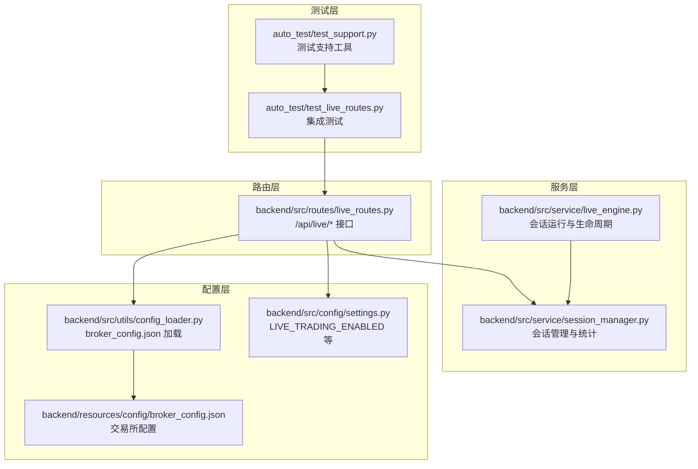
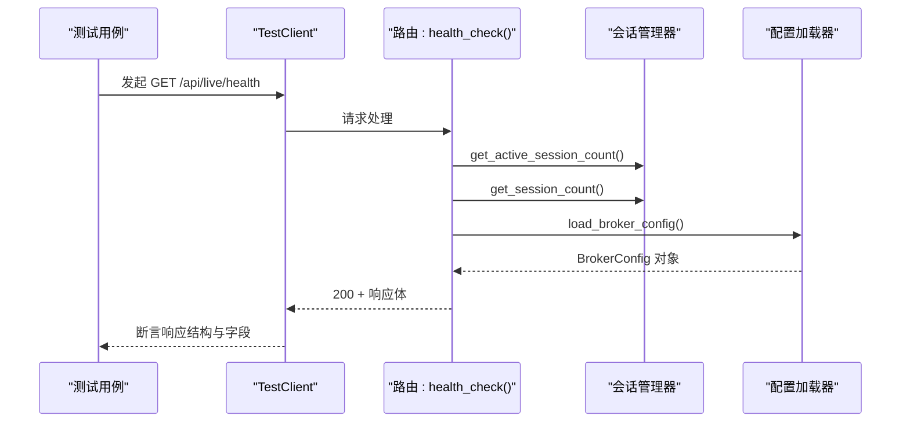
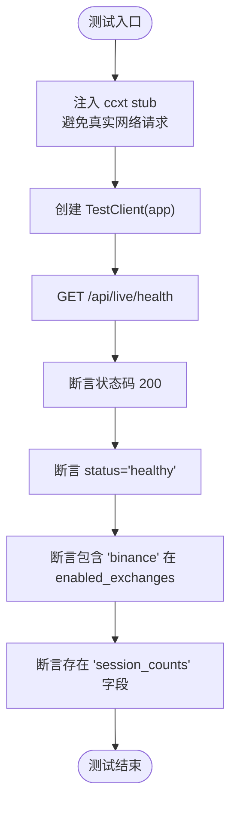
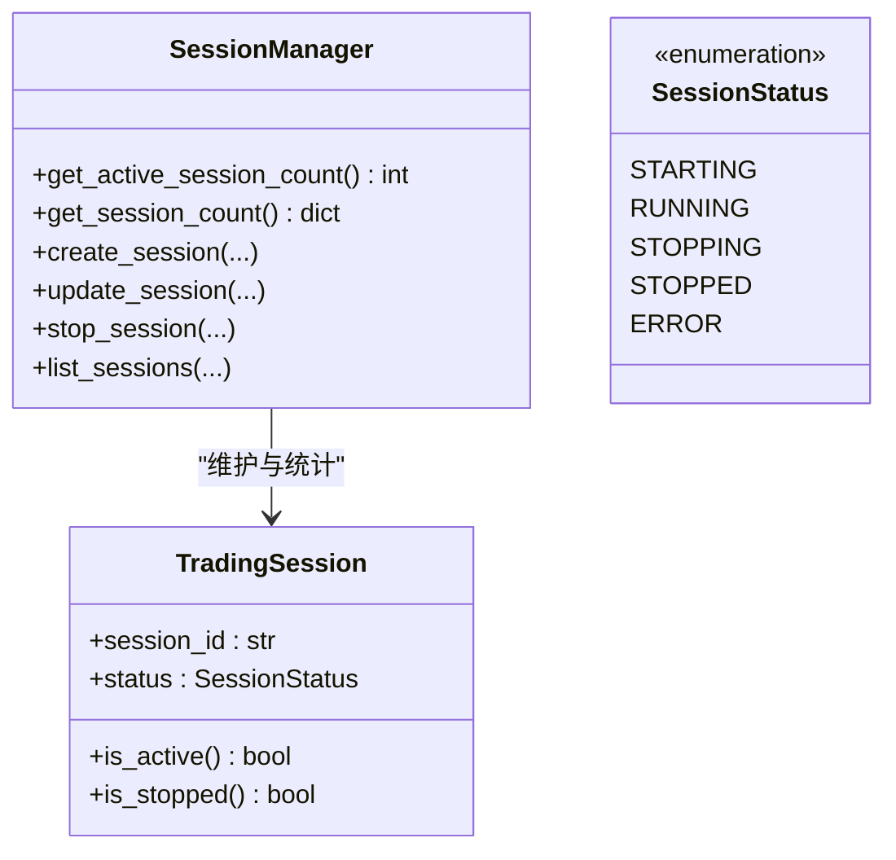
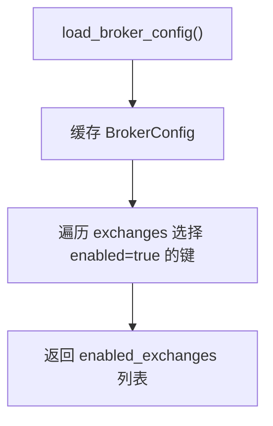
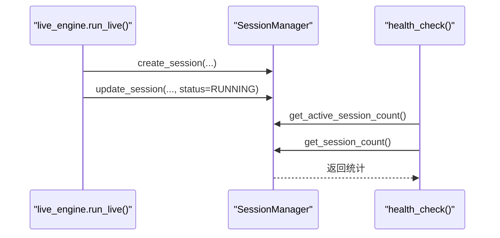
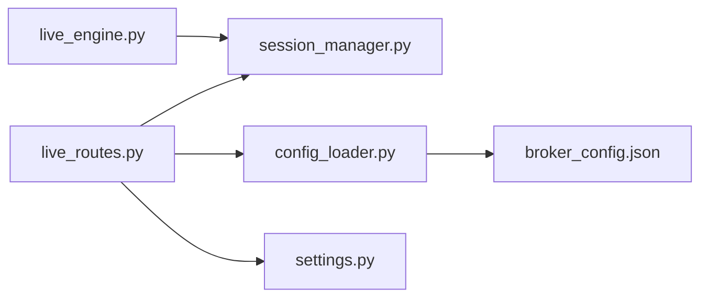

# 健康检查测试

<cite>
**本文引用的文件**
- [test_live_routes.py](file://auto_test/test_live_routes.py)
- [test_support.py](file://auto_test/test_support.py)
- [live_routes.py](file://backend/src/routes/live_routes.py)
- [live_engine.py](file://backend/src/service/live_engine.py)
- [session_manager.py](file://backend/src/service/session_manager.py)
- [config_loader.py](file://backend/src/utils/config_loader.py)
- [settings.py](file://backend/src/config/settings.py)
- [broker_config.json](file://backend/resources/config/broker_config.json)
</cite>

## 目录
1. [引言](#引言)
2. [项目结构](#项目结构)
3. [核心组件](#核心组件)
4. [架构总览](#架构总览)
5. [详细组件分析](#详细组件分析)
6. [依赖关系分析](#依赖关系分析)
7. [性能考量](#性能考量)
8. [故障排查指南](#故障排查指南)
9. [结论](#结论)

## 引言
本文件围绕实盘交易健康检查接口的集成测试展开，重点基于 auto_test/test_live_routes.py 中的 test_health_reports_enabled_exchanges 测试用例，系统性说明如何验证：
- 系统健康状态
- 启用的交易所列表
- 会话统计信息（活动会话数与按状态分组的计数）

同时结合 live_engine.py 的运行时逻辑，解释健康检查如何反映实际系统状态；并通过模拟环境展示测试如何验证 API 响应结构与状态码，且不依赖真实交易所连接。最后总结测试断言设计的最佳实践与常见故障排查方法。

## 项目结构
本次分析涉及的后端模块与测试文件如下：
- 路由层：/backend/src/routes/live_routes.py 提供 /api/live/health 等接口
- 服务层：/backend/src/service/live_engine.py 实现会话生命周期与运行时逻辑
- 会话管理：/backend/src/service/session_manager.py 维护会话状态与统计
- 配置加载：/backend/src/utils/config_loader.py 加载 broker_config.json 并提供启用交易所列表
- 设置与环境变量：/backend/src/config/settings.py 定义 LIVE_TRADING_ENABLED 等关键开关
- 测试与支持：/auto_test/test_live_routes.py 与 /auto_test/test_support.py 提供测试客户端与隔离机制

图表来源
- [test_live_routes.py](file://auto_test/test_live_routes.py#L68-L77)
- [live_routes.py](file://backend/src/routes/live_routes.py#L392-L422)
- [session_manager.py](file://backend/src/service/session_manager.py#L318-L396)
- [config_loader.py](file://backend/src/utils/config_loader.py#L113-L169)
- [settings.py](file://backend/src/config/settings.py#L38-L42)
- [broker_config.json](file://backend/resources/config/broker_config.json#L1-L131)

章节来源
- [test_live_routes.py](file://auto_test/test_live_routes.py#L1-L125)
- [live_routes.py](file://backend/src/routes/live_routes.py#L392-L422)
- [session_manager.py](file://backend/src/service/session_manager.py#L318-L396)
- [config_loader.py](file://backend/src/utils/config_loader.py#L113-L169)
- [settings.py](file://backend/src/config/settings.py#L38-L42)
- [broker_config.json](file://backend/resources/config/broker_config.json#L1-L131)

## 核心组件
- 健康检查接口：/api/live/health 返回系统健康状态、启用的交易所列表、活动会话数与按状态分组的计数等。
- 会话管理器：提供活动会话计数、按状态计数、会话创建与更新等能力，是健康检查数据来源。
- 配置加载器：从 broker_config.json 解析启用的交易所，用于健康检查返回的 enabled_exchanges 字段。
- 设置与环境变量：LIVE_TRADING_ENABLED 控制是否允许启动实盘交易，影响 /api/live/start 的行为；健康检查本身不受此开关限制。

章节来源
- [live_routes.py](file://backend/src/routes/live_routes.py#L392-L422)
- [session_manager.py](file://backend/src/service/session_manager.py#L318-L396)
- [config_loader.py](file://backend/src/utils/config_loader.py#L113-L169)
- [settings.py](file://backend/src/config/settings.py#L38-L42)

## 架构总览
健康检查的调用链路如下：
- 测试通过 TestClient 访问 /api/live/health
- 路由处理器 health_check() 调用 SessionManager 获取活动会话数与按状态计数
- health_check() 还调用配置加载器获取 broker_config.json，并提取启用的交易所列表
- 返回包含 status、live_trading_enabled、active_sessions、session_counts、enabled_exchanges 的 JSON

图表来源
- [test_live_routes.py](file://auto_test/test_live_routes.py#L68-L77)
- [live_routes.py](file://backend/src/routes/live_routes.py#L392-L422)
- [session_manager.py](file://backend/src/service/session_manager.py#L318-L396)
- [config_loader.py](file://backend/src/utils/config_loader.py#L113-L169)

## 详细组件分析

### 健康检查接口实现与测试断言
- 接口定义与返回字段
  - 健康检查返回字段包括：status、live_trading_enabled、active_sessions、session_counts、enabled_exchanges
  - 其中 enabled_exchanges 来自 broker_config.json 中 enabled=true 的交易所键集合
- 测试断言要点
  - 状态码为 200
  - status 字段为 "healthy"
  - enabled_exchanges 包含 "binance"
  - session_counts 字段存在
- 模拟环境与隔离
  - 测试通过 sys.modules 注入轻量级 ccxt stub，避免真实网络请求
  - 使用 reset_session_manager 清理全局 SessionManager 状态，保证测试隔离

图表来源
- [test_live_routes.py](file://auto_test/test_live_routes.py#L1-L48)
- [test_live_routes.py](file://auto_test/test_live_routes.py#L68-L77)

章节来源
- [test_live_routes.py](file://auto_test/test_live_routes.py#L68-L77)
- [test_support.py](file://auto_test/test_support.py#L31-L47)

### 会话统计信息的来源与计算
- 活动会话数：get_active_session_count() 统计处于 STARTING 或 RUNNING 状态的会话数量
- 按状态计数：get_session_count() 返回各状态的数量字典，并包含 total 与 active
- 这些统计直接用于健康检查响应中的 active_sessions 与 session_counts 字段

图表来源
- [session_manager.py](file://backend/src/service/session_manager.py#L318-L396)
- [session_manager.py](file://backend/src/service/session_manager.py#L20-L94)

章节来源
- [session_manager.py](file://backend/src/service/session_manager.py#L318-L396)

### 启用的交易所列表与配置加载
- 配置加载器从 broker_config.json 读取并缓存 BrokerConfig
- enabled_exchanges 字段来自 exchanges 下 enabled=true 的键集合
- 健康检查将该列表作为 enabled_exchanges 返回

图表来源
- [config_loader.py](file://backend/src/utils/config_loader.py#L113-L169)
- [broker_config.json](file://backend/resources/config/broker_config.json#L1-L131)

章节来源
- [config_loader.py](file://backend/src/utils/config_loader.py#L113-L169)
- [broker_config.json](file://backend/resources/config/broker_config.json#L1-L131)

### 运行时逻辑对健康检查的影响
- live_engine.py 中 run_live() 创建会话并将其注册到 SessionManager，随后在后台线程运行 Cerebro
- 会话状态变化（STARTING → RUNNING → STOPPED/ERROR）会影响 get_active_session_count() 与 get_session_count() 的结果
- 因此健康检查能够实时反映当前活跃会话数与会话分布

图表来源
- [live_engine.py](file://backend/src/service/live_engine.py#L144-L209)
- [session_manager.py](file://backend/src/service/session_manager.py#L133-L187)
- [session_manager.py](file://backend/src/service/session_manager.py#L218-L237)
- [live_routes.py](file://backend/src/routes/live_routes.py#L392-L422)

章节来源
- [live_engine.py](file://backend/src/service/live_engine.py#L144-L209)
- [session_manager.py](file://backend/src/service/session_manager.py#L133-L187)
- [session_manager.py](file://backend/src/service/session_manager.py#L218-L237)

### 测试如何通过模拟环境验证 API 响应结构与状态码
- 使用 TestClient 直接发起 HTTP 请求，绕过真实交易所连接
- 通过 sys.modules 注入 ccxt stub，使路由层无需真实网络交互
- 断言响应结构与字段，确保不依赖外部服务可用性

章节来源
- [test_live_routes.py](file://auto_test/test_live_routes.py#L1-L48)
- [test_live_routes.py](file://auto_test/test_live_routes.py#L68-L77)

## 依赖关系分析
- 路由层依赖会话管理器与配置加载器
- 服务层依赖会话管理器进行会话生命周期管理
- 配置加载器依赖 broker_config.json
- 设置层提供 LIVE_TRADING_ENABLED 等开关，影响启动流程但不影响健康检查

图表来源
- [live_routes.py](file://backend/src/routes/live_routes.py#L392-L422)
- [session_manager.py](file://backend/src/service/session_manager.py#L318-L396)
- [config_loader.py](file://backend/src/utils/config_loader.py#L113-L169)
- [broker_config.json](file://backend/resources/config/broker_config.json#L1-L131)
- [settings.py](file://backend/src/config/settings.py#L38-L42)

章节来源
- [live_routes.py](file://backend/src/routes/live_routes.py#L392-L422)
- [session_manager.py](file://backend/src/service/session_manager.py#L318-L396)
- [config_loader.py](file://backend/src/utils/config_loader.py#L113-L169)
- [broker_config.json](file://backend/resources/config/broker_config.json#L1-L131)
- [settings.py](file://backend/src/config/settings.py#L38-L42)

## 性能考量
- 健康检查仅做轻量统计与配置读取，复杂度低，适合高频调用
- 配置加载器具备缓存机制，避免重复解析 broker_config.json
- 测试阶段通过 ccxt stub 减少网络开销，提升测试执行速度

[本节为通用建议，不直接分析具体文件]

## 故障排查指南
- 常见问题与定位
  - 响应缺少字段：确认 enabled_exchanges 是否正确加载，检查 broker_config.json 结构与 enabled 字段
  - 活动会话数异常：检查 SessionManager 的 create/update/stop 流程，确认状态转换是否符合预期
  - 健康状态为 unhealthy：查看路由层异常分支，捕获异常并记录错误信息
- 测试层面的排查
  - 使用 reset_session_manager 清理全局状态，避免跨用例干扰
  - 确认 sys.modules 中 ccxt stub 已注入，避免真实网络请求导致测试不稳定
  - 若 /api/live/start 返回 403，检查 LIVE_TRADING_ENABLED 环境变量与设置层逻辑

章节来源
- [test_support.py](file://auto_test/test_support.py#L31-L47)
- [live_routes.py](file://backend/src/routes/live_routes.py#L392-L422)
- [settings.py](file://backend/src/config/settings.py#L38-L42)

## 结论
- 健康检查接口通过会话管理器与配置加载器，提供系统健康状态、启用交易所列表与会话统计信息
- 测试通过模拟环境与断言设计，确保响应结构稳定且不依赖真实交易所连接
- 最佳实践包括：使用 ccxt stub、隔离 SessionManager 状态、明确断言字段与状态码、关注配置缓存与异常分支
- 健康检查可作为系统可观测性的基础，建议在 CI 中高频运行以保障线上稳定性