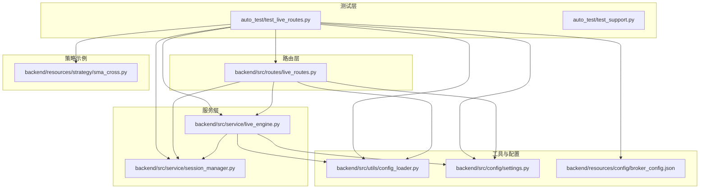
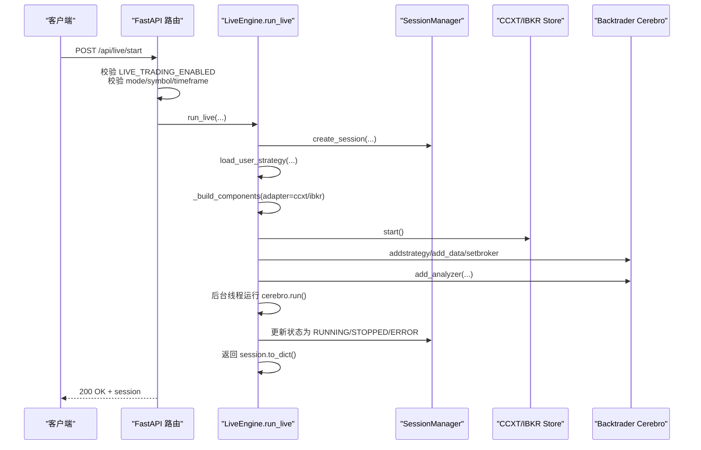
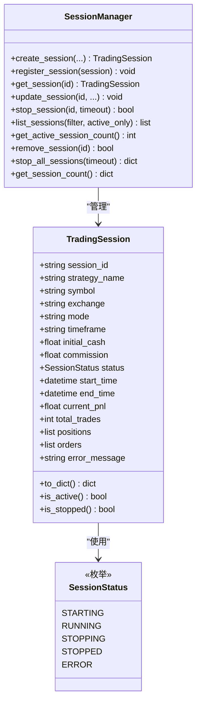
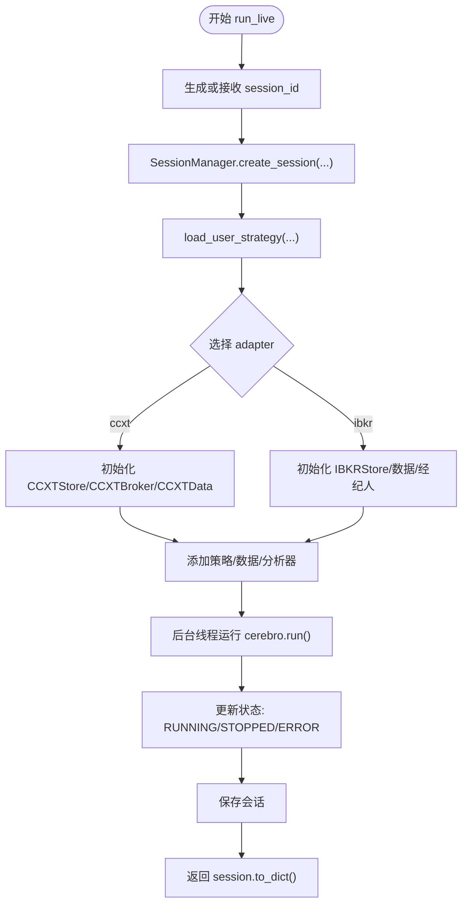
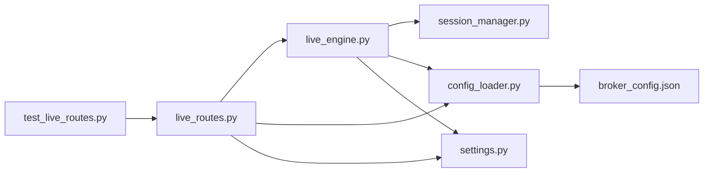

# 集成测试

<cite>
**本文引用的文件**
- [test_live_routes.py](file://auto_test/test_live_routes.py)
- [test_support.py](file://auto_test/test_support.py)
- [live_routes.py](file://backend/src/routes/live_routes.py)
- [live_engine.py](file://backend/src/service/live_engine.py)
- [session_manager.py](file://backend/src/service/session_manager.py)
- [config_loader.py](file://backend/src/utils/config_loader.py)
- [settings.py](file://backend/src/config/settings.py)
- [broker_config.json](file://backend/resources/config/broker_config.json)
- [sma_cross.py](file://backend/resources/strategy/sma_cross.py)
</cite>

## 目录
1. [引言](#引言)
2. [项目结构](#项目结构)
3. [核心组件](#核心组件)
4. [架构总览](#架构总览)
5. [详细组件分析](#详细组件分析)
6. [依赖关系分析](#依赖关系分析)
7. [性能考量](#性能考量)
8. [故障排查指南](#故障排查指南)
9. [结论](#结论)
10. [附录](#附录)

## 引言
本文件围绕实盘交易流程的端到端集成测试展开，基于 auto_test/test_live_routes.py 中的测试用例，系统性说明会话创建、策略加载、订单执行等关键路径的验证方法；结合 backend/src/service/live_engine.py 的业务逻辑，解释测试如何覆盖正常流程与异常场景（如禁用实盘交易时的拒绝响应），并通过模拟交易所适配器（_DummyExchange）实现“无真实交易所凭据”的系统集成验证，并给出测试覆盖率评估与回归测试范围定义的指导原则。

## 项目结构
本次分析聚焦于以下模块：
- 自动化测试：auto_test/test_live_routes.py、auto_test/test_support.py
- 路由层：backend/src/routes/live_routes.py
- 服务层：backend/src/service/live_engine.py、backend/src/service/session_manager.py
- 工具与配置：backend/src/utils/config_loader.py、backend/src/config/settings.py、backend/resources/config/broker_config.json
- 策略示例：backend/resources/strategy/sma_cross.py

图表来源
- [test_live_routes.py](file://auto_test/test_live_routes.py#L1-L125)
- [live_routes.py](file://backend/src/routes/live_routes.py#L1-L423)
- [live_engine.py](file://backend/src/service/live_engine.py#L1-L329)
- [session_manager.py](file://backend/src/service/session_manager.py#L1-L410)
- [config_loader.py](file://backend/src/utils/config_loader.py#L1-L343)
- [settings.py](file://backend/src/config/settings.py#L1-L81)
- [broker_config.json](file://backend/resources/config/broker_config.json#L1-L131)
- [sma_cross.py](file://backend/resources/strategy/sma_cross.py#L1-L19)

章节来源
- [test_live_routes.py](file://auto_test/test_live_routes.py#L1-L125)
- [live_routes.py](file://backend/src/routes/live_routes.py#L1-L423)
- [live_engine.py](file://backend/src/service/live_engine.py#L1-L329)
- [session_manager.py](file://backend/src/service/session_manager.py#L1-L410)
- [config_loader.py](file://backend/src/utils/config_loader.py#L1-L343)
- [settings.py](file://backend/src/config/settings.py#L1-L81)
- [broker_config.json](file://backend/resources/config/broker_config.json#L1-L131)
- [sma_cross.py](file://backend/resources/strategy/sma_cross.py#L1-L19)

## 核心组件
- 测试用例（test_live_routes.py）
  - 使用 FastAPI TestClient 对 /api/live/* 接口进行端到端验证
  - 通过 _DummyExchange 模拟 ccxt 适配器，避免真实交易所凭据
  - 通过 test_support.reset_session_manager 清理全局 SessionManager 状态，保证测试隔离
- 路由层（live_routes.py）
  - 提供 /api/live/start、/api/live/stop、/api/live/status/{session_id}、/api/live/sessions、/api/live/exchanges、/api/live/orders/{session_id}、/api/live/health 等接口
  - 在启动前检查 LIVE_TRADING_ENABLED，若关闭则返回 403
  - 调用 live_engine.run_live、stop_live、get_session_status 等服务函数
- 服务层（live_engine.py）
  - run_live：创建会话、加载策略、初始化 CCXT/IBKR 组件、启动 Cerebro 线程、持久化状态
  - stop_live：停止会话、清理 store、更新状态
  - get_session_status：查询会话信息
- 会话管理（session_manager.py）
  - 单例 SessionManager，维护 TradingSession 列表，提供创建、更新、停止、查询等能力
- 配置与校验（config_loader.py、settings.py、broker_config.json）
  - 加载 broker_config.json，提供 get_exchange_config、validate_symbol、validate_timeframe 等校验
  - settings.LIVE_TRADING_ENABLED 控制是否允许实盘交易

章节来源
- [test_live_routes.py](file://auto_test/test_live_routes.py#L1-L125)
- [live_routes.py](file://backend/src/routes/live_routes.py#L100-L182)
- [live_engine.py](file://backend/src/service/live_engine.py#L100-L329)
- [session_manager.py](file://backend/src/service/session_manager.py#L1-L410)
- [config_loader.py](file://backend/src/utils/config_loader.py#L179-L333)
- [settings.py](file://backend/src/config/settings.py#L38-L46)
- [broker_config.json](file://backend/resources/config/broker_config.json#L1-L131)

## 架构总览
下图展示了从 HTTP 请求到业务执行再到状态持久化的整体调用链路。

图表来源
- [live_routes.py](file://backend/src/routes/live_routes.py#L100-L182)
- [live_engine.py](file://backend/src/service/live_engine.py#L143-L266)
- [session_manager.py](file://backend/src/service/session_manager.py#L133-L187)

## 详细组件分析

### 测试用例：会话健康检查与启动拒绝
- 健康检查
  - 路由：GET /api/live/health
  - 断言：返回 200，包含 status、enabled_exchanges、session_counts 等字段
  - 关联：live_routes.health_check 调用 SessionManager 获取活跃会话数与已启用交易所列表
- 启动被拒绝（禁用实盘交易）
  - 路由：POST /api/live/start
  - 触发条件：LIVE_TRADING_ENABLED=false
  - 断言：返回 403，错误详情包含“Live trading is disabled”
  - 关联：live_routes.start_live_trading 在启动前检查 LIVE_TRADING_ENABLED 并抛出 HTTPException

章节来源
- [test_live_routes.py](file://auto_test/test_live_routes.py#L68-L94)
- [live_routes.py](file://backend/src/routes/live_routes.py#L392-L423)
- [settings.py](file://backend/src/config/settings.py#L38-L46)

### 测试用例：会话列表与种子数据
- 路由：GET /api/live/sessions
- 行为：测试在手动创建会话后，接口能正确返回该会话信息
- 断言：返回数组长度为 1，字段值与创建时一致，且初始状态为 STARTING
- 关联：使用 test_support.reset_session_manager 清空全局 SessionManager，再通过 SessionManager.create_session 手动注入一个会话

章节来源
- [test_live_routes.py](file://auto_test/test_live_routes.py#L95-L121)
- [test_support.py](file://auto_test/test_support.py#L31-L47)
- [session_manager.py](file://backend/src/service/session_manager.py#L133-L187)

### 会话创建与生命周期（SessionManager）
- 创建会话
  - SessionManager.create_session：生成 TradingSession，设置初始状态 STARTING
- 更新状态
  - SessionManager.update_session：支持动态更新属性（如 status、error_message）
- 停止会话
  - SessionManager.stop_session：优雅关闭 store、等待线程结束、更新状态为 STOPPED 或 ERROR
- 查询与统计
  - list_sessions、get_session、get_session_count、get_active_session_count

图表来源
- [session_manager.py](file://backend/src/service/session_manager.py#L20-L94)
- [session_manager.py](file://backend/src/service/session_manager.py#L133-L396)

章节来源
- [session_manager.py](file://backend/src/service/session_manager.py#L1-L410)

### 实盘引擎：策略加载与组件构建
- run_live 主流程
  - 生成 session_id（未传入时自动生成）
  - SessionManager.create_session 创建会话
  - load_user_strategy 加载用户策略类
  - _build_components 基于 adapter 初始化 CCXTStore/IBKRStore、CCXTBroker、CCXTData
  - Cerebro 添加策略、数据、分析器
  - 后台线程运行 cerebro.run()，期间更新状态为 RUNNING/STOPPED/ERROR
  - 最终保存会话并返回 session.to_dict()
- stop_live 主流程
  - 通过 SessionManager.get_session 校验存在性
  - 调用 SessionManager.stop_session 停止
  - 保存最终状态并返回结果
- get_session_status 主流程
  - 通过 SessionManager.get_session 获取会话并转换为字典

图表来源
- [live_engine.py](file://backend/src/service/live_engine.py#L134-L266)

章节来源
- [live_engine.py](file://backend/src/service/live_engine.py#L100-L329)

### 路由层：启动、停止、查询与健康检查
- POST /api/live/start
  - 校验 LIVE_TRADING_ENABLED、mode、exchange、symbol、timeframe
  - 调用 run_live 并返回 session 信息
- POST /api/live/stop
  - 校验 session 存在性与活动状态，调用 stop_live
- GET /api/live/status/{session_id}
  - 返回 SessionResponse
- GET /api/live/sessions
  - 支持按状态过滤、仅活跃、限制数量
- GET /api/live/exchanges
  - 返回可用交易所列表
- GET /api/live/orders/{session_id}
  - 返回会话内所有订单
- GET /api/live/health
  - 返回系统健康状态、会话计数、启用交易所

章节来源
- [live_routes.py](file://backend/src/routes/live_routes.py#L100-L423)

### 配置与校验：broker_config.json 与 settings
- broker_config.json
  - 定义各交易所的启用状态、适配器、市场类型、纸面交易参数、限流等
- config_loader.py
  - 提供 get_exchange_config、validate_symbol、validate_timeframe 等校验函数
- settings.py
  - 读取环境变量 LIVE_TRADING_ENABLED 控制是否允许实盘交易

章节来源
- [broker_config.json](file://backend/resources/config/broker_config.json#L1-L131)
- [config_loader.py](file://backend/src/utils/config_loader.py#L179-L333)
- [settings.py](file://backend/src/config/settings.py#L38-L46)

### 策略加载与订单执行
- 策略加载
  - live_engine.run_live 调用 load_user_strategy 加载策略类
  - 示例策略：sma_cross.py 展示了基本多空入场/出场逻辑
- 订单执行
  - CCXTBroker/IBKRStore 作为经纪人接入交易所
  - 通过 Cerebro.run() 驱动策略下单、成交、记录交易

章节来源
- [live_engine.py](file://backend/src/service/live_engine.py#L160-L191)
- [sma_cross.py](file://backend/resources/strategy/sma_cross.py#L1-L19)

### 模拟交易所适配器（_DummyExchange）与测试隔离
- _DummyExchange
  - 替换 ccxt.async_support 与 ccxt 根模块，提供 fetch_status/load_markets/close 等异步方法
  - 用于在测试中绕过真实交易所连接，避免凭据依赖
- 测试隔离
  - test_support.reset_session_manager 清空全局 SessionManager，确保每次测试独立
  - test_support.disable_auth_for_tests 将 LIVE_TRADING_ENABLED 设为 false，便于验证禁用场景

章节来源
- [test_live_routes.py](file://auto_test/test_live_routes.py#L16-L48)
- [test_support.py](file://auto_test/test_support.py#L25-L47)

## 依赖关系分析
- 测试对路由层的依赖
  - TestClient 直接调用 /api/live/* 接口，间接依赖 live_engine 与 session_manager
- 路由层对服务层的依赖
  - live_routes 依赖 live_engine 与 session_manager 提供的业务能力
- 服务层对工具与配置的依赖
  - live_engine 依赖 config_loader 进行交换机与参数校验，依赖 settings 读取 LIVE_TRADING_ENABLED
- 配置对 broker_config.json 的依赖
  - config_loader 从 broker_config.json 加载并校验交换机配置

图表来源
- [test_live_routes.py](file://auto_test/test_live_routes.py#L56-L121)
- [live_routes.py](file://backend/src/routes/live_routes.py#L100-L182)
- [live_engine.py](file://backend/src/service/live_engine.py#L100-L266)
- [session_manager.py](file://backend/src/service/session_manager.py#L133-L396)
- [config_loader.py](file://backend/src/utils/config_loader.py#L179-L333)
- [settings.py](file://backend/src/config/settings.py#L38-L46)
- [broker_config.json](file://backend/resources/config/broker_config.json#L1-L131)

章节来源
- [test_live_routes.py](file://auto_test/test_live_routes.py#L56-L121)
- [live_routes.py](file://backend/src/routes/live_routes.py#L100-L182)
- [live_engine.py](file://backend/src/service/live_engine.py#L100-L266)
- [session_manager.py](file://backend/src/service/session_manager.py#L133-L396)
- [config_loader.py](file://backend/src/utils/config_loader.py#L179-L333)
- [settings.py](file://backend/src/config/settings.py#L38-L46)
- [broker_config.json](file://backend/resources/config/broker_config.json#L1-L131)

## 性能考量
- 启动开销
  - run_live 包含策略加载、组件初始化、Cerebro 设置与后台线程启动，建议在测试中尽量复用会话或使用 _DummyExchange 减少外部依赖
- 线程与资源
  - 后台线程负责 cerebro.run()，stop_live 通过 SessionManager.stop_session 等待线程退出，超时控制可调
- 配置缓存
  - config_loader 内部缓存 broker_config.json，减少重复 IO；测试中可通过 reload_config 强制刷新

章节来源
- [live_engine.py](file://backend/src/service/live_engine.py#L202-L266)
- [config_loader.py](file://backend/src/utils/config_loader.py#L113-L169)

## 故障排查指南
- 启动被拒绝（403）
  - 现象：POST /api/live/start 返回 403，错误详情包含“Live trading is disabled”
  - 排查：确认环境变量 LIVE_TRADING_ENABLED 是否为 true；检查 settings.py 的读取逻辑
- 策略未找到（404）
  - 现象：启动时报错 404
  - 排查：确认策略文件位于策略目录，文件名与请求 strategy_name 一致
- 参数校验失败（400）
  - 现象：mode 非法、symbol 格式错误、timeframe 不支持
  - 排查：参考 config_loader.validate_* 的错误提示，修正请求体
- 会话不存在（404）
  - 现象：查询状态或停止会话时报错
  - 排查：确认 session_id 正确，或先通过 /api/live/sessions 查看当前会话列表
- 停止失败（500）
  - 现象：stop 时返回 500
  - 排查：查看日志，确认 SessionManager.stop_session 是否成功，必要时增加超时时间

章节来源
- [live_routes.py](file://backend/src/routes/live_routes.py#L122-L182)
- [live_routes.py](file://backend/src/routes/live_routes.py#L184-L254)
- [live_routes.py](file://backend/src/routes/live_routes.py#L256-L338)
- [live_routes.py](file://backend/src/routes/live_routes.py#L339-L390)
- [live_routes.py](file://backend/src/routes/live_routes.py#L392-L423)

## 结论
本集成测试以 test_live_routes.py 为核心，覆盖了实盘交易的关键路径：健康检查、启动拒绝（禁用场景）、会话列表与种子数据。通过 _DummyExchange 与 test_support.reset_session_manager，测试在不依赖真实交易所凭据的前提下完成端到端验证。结合 live_engine.py 的业务流程与 live_routes.py 的路由约束，测试有效验证了会话创建、策略加载、组件初始化与状态流转。建议在回归测试中持续覆盖上述关键路径，并扩展更多异常场景（如网络错误、配置缺失、策略异常）以提升鲁棒性。

## 附录
- 测试覆盖率评估建议
  - 路由层：对 /api/live/* 的每个分支（成功/失败）至少覆盖一次
  - 服务层：run_live、stop_live、get_session_status 的主路径与异常路径
  - 工具层：config_loader 的校验函数（get_exchange_config、validate_symbol、validate_timeframe）
  - 配置层：broker_config.json 的不同交换机配置与 settings 的环境变量读取
- 回归测试范围定义
  - 新增/修改路由：同步新增对应路由测试
  - 修改策略加载：验证策略文件变更后的加载与执行
  - 修改配置：验证 broker_config.json 变更对校验与启动的影响
  - 异常场景：禁用实盘交易、模式非法、符号格式错误、时间框架不支持、会话不存在、停止失败等