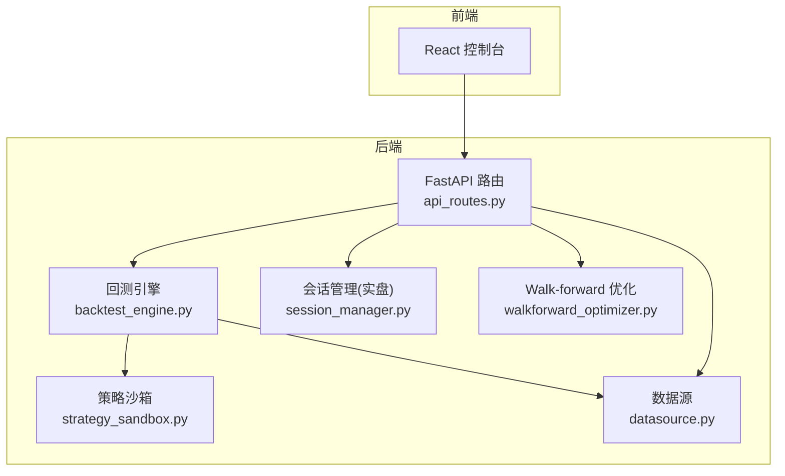
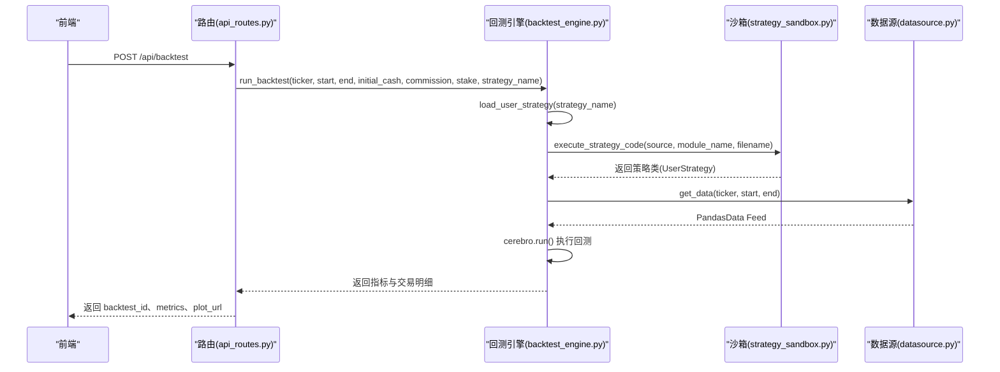
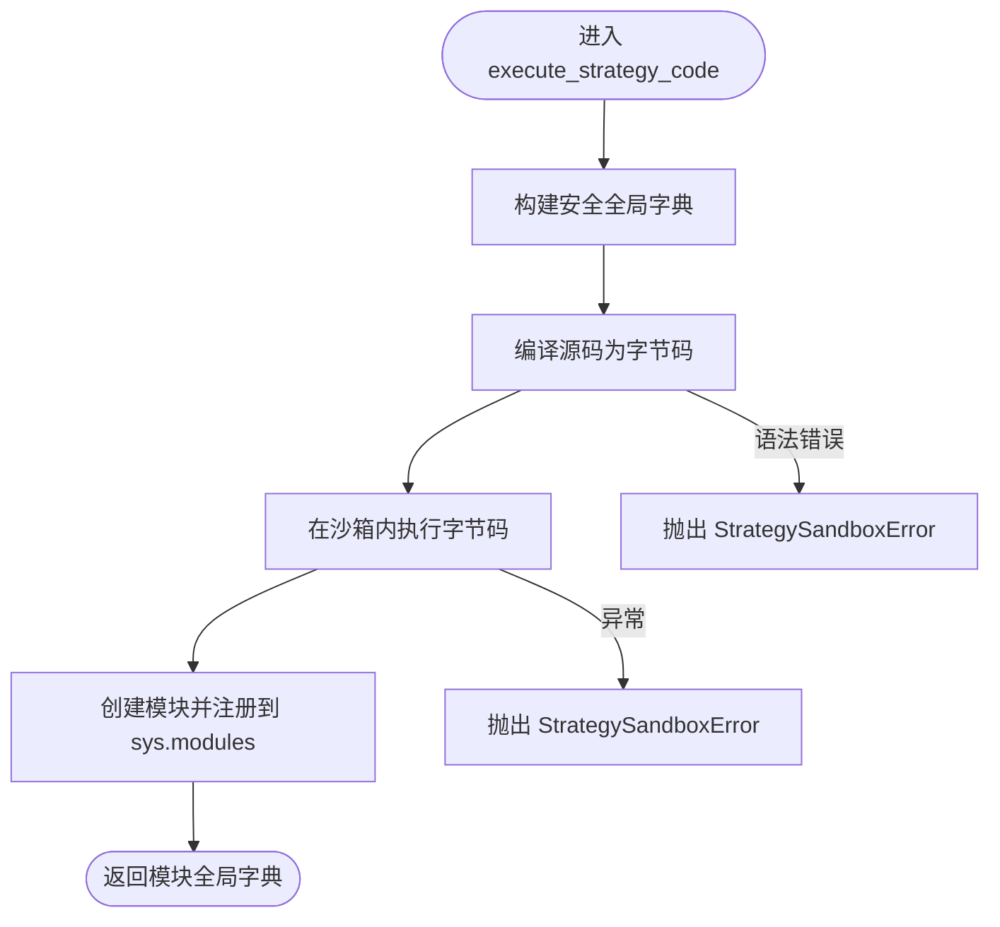
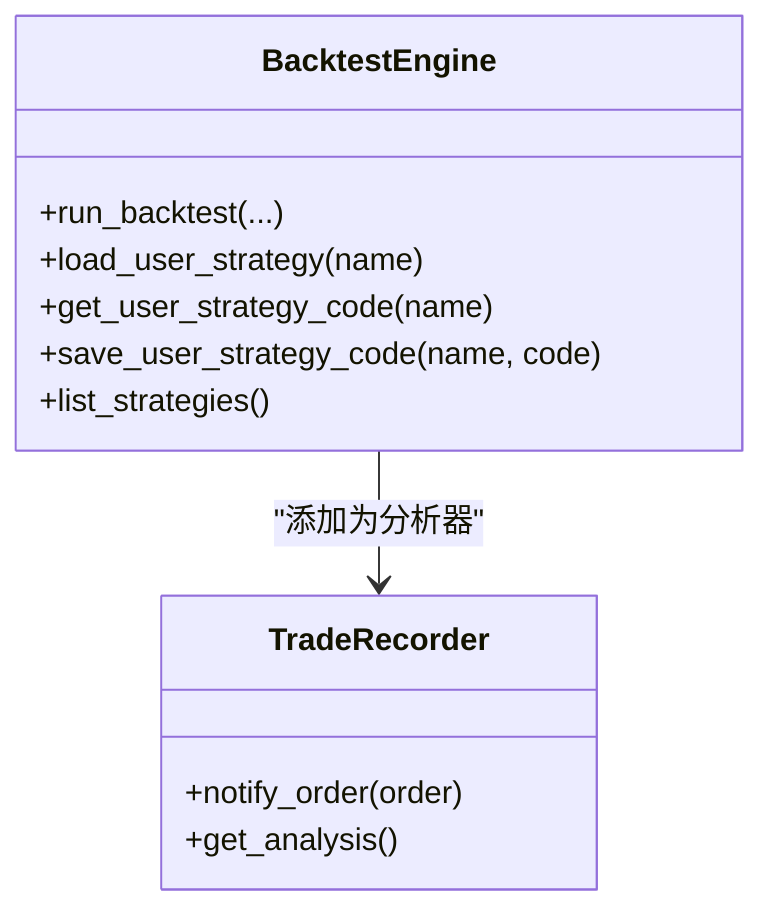
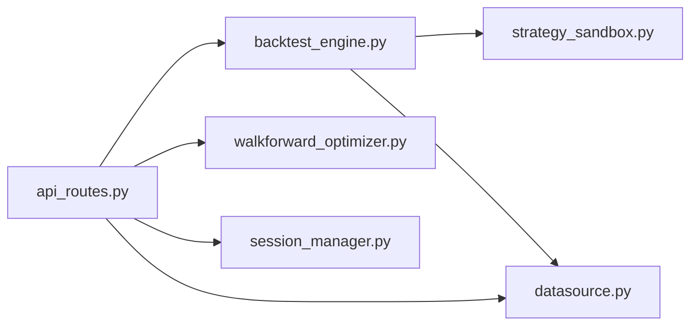

# 策略开发最佳实践

<cite>
**本文引用的文件**
- [feature.md](file://feature.md)
- [strategy.md](file://backend/resources/strategy/strategy.md)
- [strategy_sandbox.py](file://backend/src/service/strategy_sandbox.py)
- [backtest_engine.py](file://backend/src/service/backtest_engine.py)
- [api_routes.py](file://backend/src/routes/api_routes.py)
- [datasource.py](file://backend/src/db/datasource.py)
- [breakout.py](file://backend/resources/strategy/breakout.py)
- [sma_cross.py](file://backend/resources/strategy/sma_cross.py)
- [rsi_reversion.py](file://backend/resources/strategy/rsi_reversion.py)
- [session_manager.py](file://backend/src/service/session_manager.py)
- [walkforward_optimizer.py](file://backend/src/service/walkforward_optimizer.py)
</cite>

## 目录
1. [引言](#引言)
2. [项目结构](#项目结构)
3. [核心组件](#核心组件)
4. [架构总览](#架构总览)
5. [详细组件分析](#详细组件分析)
6. [依赖关系分析](#依赖关系分析)
7. [性能考量](#性能考量)
8. [故障排查指南](#故障排查指南)
9. [结论](#结论)
10. [附录](#附录)

## 引言
本文件围绕策略开发的最佳实践展开，结合仓库中已有的设计思路与实现，系统阐述策略代码结构、参数设计、风险控制逻辑的实现方式；解释如何编写可复用且安全的策略代码，确保其在回测与实盘环境中行为一致；深入解析策略沙箱执行机制的技术细节（strategy_sandbox.py），说明代码加载、隔离执行与异常处理；结合回测引擎（backtest_engine.py）说明策略与回测引擎的集成方式，并给出多时间框架、多标的策略开发示例；最后强调避免未来函数、过度拟合等常见问题的编码规范。

## 项目结构
该工程采用前后端分离架构，后端以 FastAPI 提供 API，前端为多语言控制台。策略代码位于后端资源目录，回测引擎与沙箱执行模块位于服务层，数据源模块负责行情数据加载，路由模块承接前端请求并调用服务层。

图表来源
- [api_routes.py](file://backend/src/routes/api_routes.py#L1-L200)
- [backtest_engine.py](file://backend/src/service/backtest_engine.py#L1-L272)
- [strategy_sandbox.py](file://backend/src/service/strategy_sandbox.py#L1-L182)
- [datasource.py](file://backend/src/db/datasource.py#L1-L156)
- [session_manager.py](file://backend/src/service/session_manager.py#L1-L410)
- [walkforward_optimizer.py](file://backend/src/service/walkforward_optimizer.py#L402-L512)

章节来源
- [feature.md](file://feature.md#L1-L12)

## 核心组件
- 策略沙箱（strategy_sandbox.py）：限制用户导入模块、内置函数与执行权限，构建安全的执行环境，防止策略代码访问系统资源或执行危险操作。
- 回测引擎（backtest_engine.py）：负责策略加载、数据准备、回测执行、指标计算与可视化输出。
- 数据源（datasource.py）：优先从数据库拉取，其次使用 yfinance 下载，失败时生成合成数据，保证回测流水线可用。
- 路由（api_routes.py）：对外提供回测、策略查询/保存、数据分析等接口，串联引擎与存储。
- 示例策略（breakout.py、sma_cross.py、rsi_reversion.py）：展示参数化、技术指标与风控逻辑的典型写法。
- 实盘会话管理（session_manager.py）：统一管理多个并发实盘会话，支持启动、停止、状态跟踪与持久化协调。
- Walk-forward 优化（walkforward_optimizer.py）：提供滚动窗口优化与过拟合检测指标，辅助策略稳健性评估。

章节来源
- [strategy_sandbox.py](file://backend/src/service/strategy_sandbox.py#L1-L182)
- [backtest_engine.py](file://backend/src/service/backtest_engine.py#L1-L272)
- [datasource.py](file://backend/src/db/datasource.py#L1-L156)
- [api_routes.py](file://backend/src/routes/api_routes.py#L1-L200)
- [breakout.py](file://backend/resources/strategy/breakout.py#L1-L32)
- [sma_cross.py](file://backend/resources/strategy/sma_cross.py#L1-L19)
- [rsi_reversion.py](file://backend/resources/strategy/rsi_reversion.py#L1-L18)
- [session_manager.py](file://backend/src/service/session_manager.py#L1-L410)
- [walkforward_optimizer.py](file://backend/src/service/walkforward_optimizer.py#L402-L512)

## 架构总览
策略从“用户编辑/保存”的策略文件开始，经由沙箱加载为标准 Backtrader 策略类，再由回测引擎注入数据、设置参数并执行。回测完成后，引擎收集指标与交易明细，并生成可视化图表。路由模块对外暴露统一接口，同时负责持久化与错误处理。

图表来源
- [api_routes.py](file://backend/src/routes/api_routes.py#L77-L146)
- [backtest_engine.py](file://backend/src/service/backtest_engine.py#L180-L257)
- [strategy_sandbox.py](file://backend/src/service/strategy_sandbox.py#L148-L181)
- [datasource.py](file://backend/src/db/datasource.py#L114-L120)

## 详细组件分析

### 策略沙箱执行机制（strategy_sandbox.py）
- 安全导入白名单：仅允许特定模块导入，禁止相对导入与未授权模块，防止策略访问系统资源。
- 内置函数裁剪：构建受限的内置函数集合，替换默认 __import__，确保策略只能使用受控能力。
- 全局变量隔离：构造安全的全局字典，注入 bt 与 pd 等必要对象，避免污染宿主环境。
- 编译与执行：编译用户源码为字节码，捕获语法与运行时异常，统一抛出沙箱错误类型。
- 模块注册：将执行结果作为模块注册到 sys.modules，供后续加载使用。

图表来源
- [strategy_sandbox.py](file://backend/src/service/strategy_sandbox.py#L148-L181)

章节来源
- [strategy_sandbox.py](file://backend/src/service/strategy_sandbox.py#L1-L182)

### 回测引擎与策略集成（backtest_engine.py）
- 策略加载：校验策略名称、读取策略文件、通过沙箱执行并提取 UserStrategy 类，确保继承自 bt.Strategy。
- 数据注入：根据 ticker、起止日期获取数据，转换为 Backtrader Feed 并添加到 cerebro。
- 参数与指标：设置初始资金、手续费、固定仓位；添加多种 Analyzer 收集指标；自定义 TradeRecorder 记录每笔交易细节。
- 可视化：关闭本地显示，生成图表并保存至指定路径。
- 错误处理：捕获回测过程中的异常并记录日志，向上抛出。

图表来源
- [backtest_engine.py](file://backend/src/service/backtest_engine.py#L180-L257)
- [backtest_engine.py](file://backend/src/service/backtest_engine.py#L99-L178)

章节来源
- [backtest_engine.py](file://backend/src/service/backtest_engine.py#L1-L272)

### 数据源与多标的/多时间框架
- 数据优先级：数据库 > yfinance > 合成数据，保证稳定性与可用性。
- 多标的：可在单次回测中添加多个数据源，或在上层路由中循环调用回测引擎，分别对不同标的执行。
- 多时间框架：通过数据源层进行重采样或在策略层使用不同时间框架的数据 Feed，实现跨周期信号融合。

章节来源
- [datasource.py](file://backend/src/db/datasource.py#L1-L156)

### 示例策略与参数设计
- 布林带突破（breakout.py）：参数 lookback、stop_loss、take_profit；使用最高/最低价判断入场与出场，并支持止盈止损。
- SMA 交叉（sma_cross.py）：参数 fast_period、slow_period；使用 SMA 与 CrossOver 判断多空方向。
- RSI 反转（rsi_reversion.py）：参数 period、lower、upper；在超卖/超买区域反向开仓。

章节来源
- [breakout.py](file://backend/resources/strategy/breakout.py#L1-L32)
- [sma_cross.py](file://backend/resources/strategy/sma_cross.py#L1-L19)
- [rsi_reversion.py](file://backend/resources/strategy/rsi_reversion.py#L1-L18)

### 实盘会话管理（session_manager.py）
- 生命周期：创建、启动、停止、状态跟踪与持久化协调。
- 并发：线程安全的数据结构与锁，支持多会话并发运行。
- 统一接口：提供会话状态查询、统计与批量停止能力。

章节来源
- [session_manager.py](file://backend/src/service/session_manager.py#L1-L410)

### Walk-forward 优化与过拟合检测
- 滚动窗口：将总时间区间拆分为多个训练/测试窗口，逐个窗口优化参数并评估测试表现。
- 过拟合指标：计算训练/测试相关性、平均退化率、一致性评分与退化标准差，综合判断是否过拟合。

章节来源
- [walkforward_optimizer.py](file://backend/src/service/walkforward_optimizer.py#L402-L512)

## 依赖关系分析
- 路由依赖回测引擎与数据源，回测引擎依赖沙箱与数据源。
- 策略文件通过沙箱加载为标准 Backtrader 类，再由回测引擎实例化并运行。
- 实盘场景通过会话管理器统一调度，与回测引擎共享策略类定义。

图表来源
- [api_routes.py](file://backend/src/routes/api_routes.py#L1-L200)
- [backtest_engine.py](file://backend/src/service/backtest_engine.py#L1-L272)
- [strategy_sandbox.py](file://backend/src/service/strategy_sandbox.py#L1-L182)
- [datasource.py](file://backend/src/db/datasource.py#L1-L156)
- [session_manager.py](file://backend/src/service/session_manager.py#L1-L410)
- [walkforward_optimizer.py](file://backend/src/service/walkforward_optimizer.py#L402-L512)

## 性能考量
- 图表渲染：在 API 环境禁用本地显示，统一关闭交互模式，避免阻塞与图形上下文问题。
- 数据加载：优先数据库，减少网络波动；失败时快速降级为合成数据，保障回测可用性。
- 多标的/多时间框架：尽量在数据层完成重采样与合成，避免策略层重复计算。
- 会话管理：线程安全与锁粒度控制，避免高并发下的竞争条件。

章节来源
- [backtest_engine.py](file://backend/src/service/backtest_engine.py#L1-L272)
- [datasource.py](file://backend/src/db/datasource.py#L1-L156)
- [session_manager.py](file://backend/src/service/session_manager.py#L1-L410)

## 故障排查指南
- 策略加载失败：检查策略文件是否存在、类名是否为 UserStrategy、是否继承自 bt.Strategy。
- 导入异常：确认导入模块在白名单内，避免相对导入与未授权模块。
- 数据加载失败：确认 DATABASE_URL 配置、yfinance 可用性；若均不可用，系统将使用合成数据。
- 回测异常：查看日志输出，定位具体异常位置；必要时在沙箱外进行最小化复现。
- 实盘会话异常：检查会话状态、线程是否存活、store 是否正常停止。

章节来源
- [backtest_engine.py](file://backend/src/service/backtest_engine.py#L25-L96)
- [strategy_sandbox.py](file://backend/src/service/strategy_sandbox.py#L44-L56)
- [datasource.py](file://backend/src/db/datasource.py#L70-L113)
- [session_manager.py](file://backend/src/service/session_manager.py#L238-L292)

## 结论
通过策略沙箱、标准化回测引擎与严格的数据源策略，系统实现了“安全、可复用、可扩展”的策略开发与运行环境。配合 Walk-forward 优化与过拟合检测，能够有效提升策略稳健性。在多标的与多时间框架场景下，建议在数据层完成必要的重采样与合成，策略层专注于信号与风控逻辑，确保回测与实盘的一致性与可维护性。

## 附录

### 编码规范与最佳实践清单
- 风险控制
  - 明确止盈止损参数与触发条件，避免未来函数（仅使用当前与历史数据）。
  - 在策略中显式设置初始资金、手续费与仓位管理，确保与实盘一致。
  - 使用 Analyzer 记录交易细节，便于回测后复盘与审计。
- 参数设计
  - 将关键参数以 params 形式声明，便于外部配置与优化。
  - 参数命名清晰、含义明确，避免魔法数字。
- 多标的/多时间框架
  - 在数据层完成多周期合成与重采样，策略层通过不同数据 Feed 协作。
  - 对多标的组合，建议在上层路由或优化器中统一调度。
- 避免未来函数与过度拟合
  - 仅使用过去与当前数据，不使用未来数据。
  - 使用 Walk-forward 与滚动窗口优化，结合过拟合检测指标评估策略稳健性。
- 安全与合规
  - 禁止在策略中写入敏感信息；策略文件与配置分离。
  - 通过沙箱执行策略代码，限制导入与内置函数，降低安全风险。

章节来源
- [feature.md](file://feature.md#L1-L12)
- [strategy.md](file://backend/resources/strategy/strategy.md#L1-L28)
- [walkforward_optimizer.py](file://backend/src/service/walkforward_optimizer.py#L402-L512)