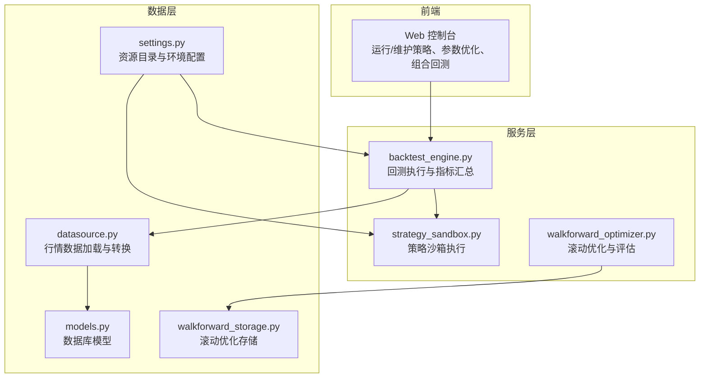
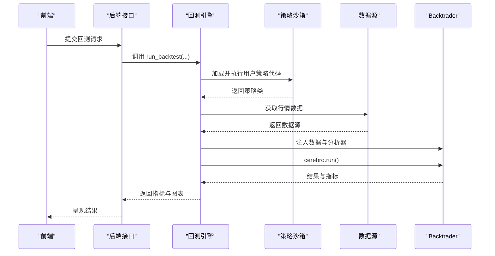
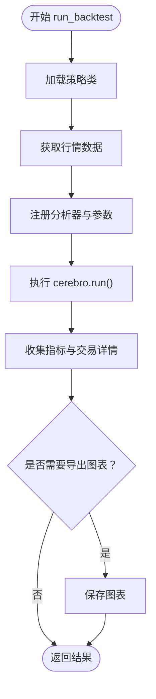
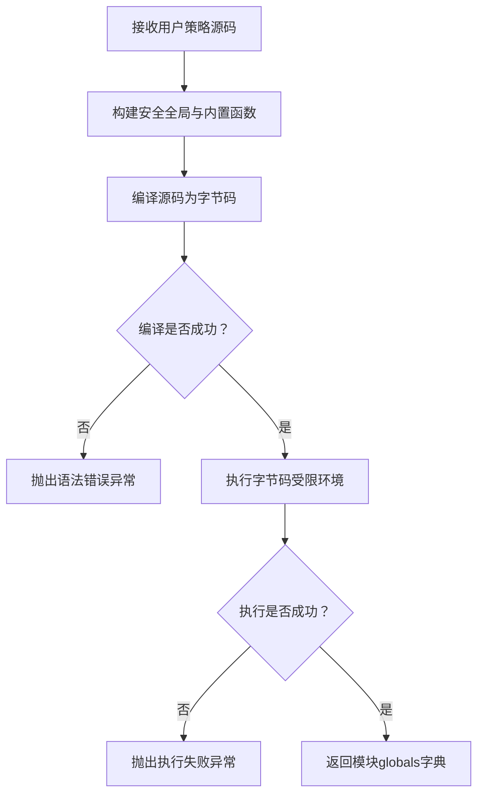
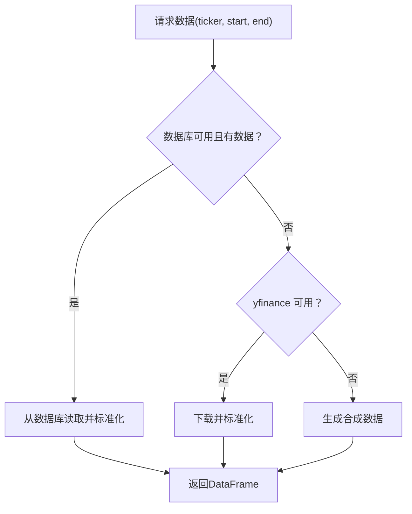
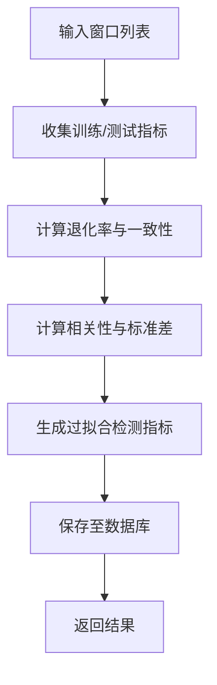
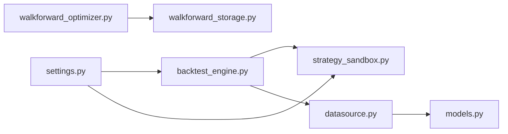

# 策略性能优化

<cite>
**本文引用的文件**
- [backtest_engine.py](file://backend/src/service/backtest_engine.py)
- [strategy_sandbox.py](file://backend/src/service/strategy_sandbox.py)
- [datasource.py](file://backend/src/db/datasource.py)
- [settings.py](file://backend/src/config/settings.py)
- [walkforward_optimizer.py](file://backend/src/service/walkforward_optimizer.py)
- [walkforward_storage.py](file://backend/src/db/walkforward_storage.py)
- [models.py](file://backend/src/db/models.py)
- [feature.md](file://feature.md)
- [breakout.py](file://backend/resources/strategy/breakout.py)
- [sma_cross.py](file://backend/resources/strategy/sma_cross.py)
</cite>

## 目录
1. [引言](#引言)
2. [项目结构](#项目结构)
3. [核心组件](#核心组件)
4. [架构总览](#架构总览)
5. [详细组件分析](#详细组件分析)
6. [依赖关系分析](#依赖关系分析)
7. [性能考量](#性能考量)
8. [故障排查指南](#故障排查指南)
9. [结论](#结论)
10. [附录](#附录)

## 引言
本文件围绕策略性能优化展开，结合后端回测引擎的执行流程，系统梳理影响策略运行效率的关键因素，并提出可落地的优化建议。重点覆盖：
- 数据预加载与缓存策略
- 循环计算优化与向量化替代
- 避免在 next() 中进行复杂操作
- 利用 pandas/numpy 进行向量化计算
- 多标的/组合回测的内存与计算优化
- 策略沙箱环境对性能的影响
- 使用 Python 内置分析工具（如 cProfile）进行性能分析与瓶颈定位

## 项目结构
后端采用 FastAPI + Backtrader 架构，服务层负责策略加载、回测执行、分析器输出与绘图；数据层负责行情数据的数据库/网络拉取与转换；配置层提供资源目录与环境变量；前端通过 API 调用后端能力。

图表来源
- [backtest_engine.py](file://backend/src/service/backtest_engine.py#L1-L272)
- [strategy_sandbox.py](file://backend/src/service/strategy_sandbox.py#L1-L182)
- [datasource.py](file://backend/src/db/datasource.py#L1-L155)
- [settings.py](file://backend/src/config/settings.py#L1-L81)
- [walkforward_optimizer.py](file://backend/src/service/walkforward_optimizer.py#L442-L537)
- [walkforward_storage.py](file://backend/src/db/walkforward_storage.py#L114-L236)
- [models.py](file://backend/src/db/models.py#L1-L200)

章节来源
- [backtest_engine.py](file://backend/src/service/backtest_engine.py#L1-L272)
- [strategy_sandbox.py](file://backend/src/service/strategy_sandbox.py#L1-L182)
- [datasource.py](file://backend/src/db/datasource.py#L1-L155)
- [settings.py](file://backend/src/config/settings.py#L1-L81)
- [walkforward_optimizer.py](file://backend/src/service/walkforward_optimizer.py#L442-L537)
- [walkforward_storage.py](file://backend/src/db/walkforward_storage.py#L114-L236)
- [models.py](file://backend/src/db/models.py#L1-L200)

## 核心组件
- 回测引擎：负责策略加载、数据注入、分析器注册、执行回测并生成指标与图表。
- 策略沙箱：限制用户可导入模块与内置函数，隔离执行环境，兼顾安全与性能。
- 数据源：优先从数据库拉取，其次网络下载，最后降级为合成数据，确保回测可用性。
- 滚动优化：提供多窗口训练/测试评估，计算一致性与过拟合检测指标。
- 配置与资源：统一管理策略目录、图片目录等资源路径。

章节来源
- [backtest_engine.py](file://backend/src/service/backtest_engine.py#L180-L272)
- [strategy_sandbox.py](file://backend/src/service/strategy_sandbox.py#L148-L181)
- [datasource.py](file://backend/src/db/datasource.py#L70-L121)
- [walkforward_optimizer.py](file://backend/src/service/walkforward_optimizer.py#L442-L537)
- [settings.py](file://backend/src/config/settings.py#L48-L81)

## 架构总览
回测执行主流程如下：前端触发回测请求 → 后端加载策略代码 → 沙箱执行策略类 → 注入数据 → 注册分析器 → 执行 cerebro.run() → 收集指标与绘图 → 返回结果。

图表来源
- [backtest_engine.py](file://backend/src/service/backtest_engine.py#L180-L272)
- [strategy_sandbox.py](file://backend/src/service/strategy_sandbox.py#L148-L181)
- [datasource.py](file://backend/src/db/datasource.py#L114-L121)

## 详细组件分析

### 组件A：回测引擎（backtest_engine.py）
- 策略加载与校验：从策略目录读取用户策略文件，沙箱执行后提取 UserStrategy 类，校验继承关系。
- 数据注入：通过数据源模块获取 PandasData 并注入 cerebro。
- 分析器注册：内置多种分析器（夏普比率、最大回撤、收益、年化收益、SQN、交易统计、时间序列回撤、自定义交易记录器）。
- 执行与输出：执行 cerebro.run()，收集指标，必要时导出图表。

图表来源
- [backtest_engine.py](file://backend/src/service/backtest_engine.py#L180-L272)

章节来源
- [backtest_engine.py](file://backend/src/service/backtest_engine.py#L180-L272)

### 组件B：策略沙箱（strategy_sandbox.py）
- 安全约束：限定允许导入的模块集合，拦截相对导入，限制内置函数白名单。
- 编译与执行：对用户源码进行编译，再在受控全局环境中执行，返回模块字典供后续使用。
- 性能影响：沙箱引入编译与导入检查，带来一定开销；但这是必要的安全成本。

图表来源
- [strategy_sandbox.py](file://backend/src/service/strategy_sandbox.py#L148-L181)

章节来源
- [strategy_sandbox.py](file://backend/src/service/strategy_sandbox.py#L1-L182)

### 组件C：数据源（datasource.py）
- 优先级：数据库 → yfinance → 合成数据。
- 数据转换：标准化列名、索引、缺失值处理，保证与 Backtrader 期望一致。
- 性能要点：数据库查询与 pandas 读取在回测前完成，避免在策略内重复 IO。

图表来源
- [datasource.py](file://backend/src/db/datasource.py#L70-L121)

章节来源
- [datasource.py](file://backend/src/db/datasource.py#L1-L155)

### 组件D：滚动优化（walkforward_optimizer.py 与 walkforward_storage.py）
- 训练/测试窗口：遍历窗口，分别计算训练与测试指标，统计退化率、相关性与一致性得分。
- 存储：将结果写入数据库，包含摘要字段与完整结果，便于前端展示与二次分析。

图表来源
- [walkforward_optimizer.py](file://backend/src/service/walkforward_optimizer.py#L442-L537)
- [walkforward_storage.py](file://backend/src/db/walkforward_storage.py#L114-L236)

章节来源
- [walkforward_optimizer.py](file://backend/src/service/walkforward_optimizer.py#L442-L537)
- [walkforward_storage.py](file://backend/src/db/walkforward_storage.py#L114-L236)

## 依赖关系分析
- 回测引擎依赖策略沙箱与数据源，用于加载策略与准备数据。
- 滚动优化依赖存储模块，用于持久化结果。
- 配置模块提供资源目录，保障策略与图片目录存在。

图表来源
- [backtest_engine.py](file://backend/src/service/backtest_engine.py#L1-L272)
- [strategy_sandbox.py](file://backend/src/service/strategy_sandbox.py#L1-L182)
- [datasource.py](file://backend/src/db/datasource.py#L1-L155)
- [walkforward_optimizer.py](file://backend/src/service/walkforward_optimizer.py#L442-L537)
- [walkforward_storage.py](file://backend/src/db/walkforward_storage.py#L114-L236)
- [settings.py](file://backend/src/config/settings.py#L48-L81)
- [models.py](file://backend/src/db/models.py#L1-L200)

章节来源
- [backtest_engine.py](file://backend/src/service/backtest_engine.py#L1-L272)
- [strategy_sandbox.py](file://backend/src/service/strategy_sandbox.py#L1-L182)
- [datasource.py](file://backend/src/db/datasource.py#L1-L155)
- [walkforward_optimizer.py](file://backend/src/service/walkforward_optimizer.py#L442-L537)
- [walkforward_storage.py](file://backend/src/db/walkforward_storage.py#L114-L236)
- [settings.py](file://backend/src/config/settings.py#L48-L81)
- [models.py](file://backend/src/db/models.py#L1-L200)

## 性能考量

### 影响策略运行效率的关键因素
- 数据预加载与缓存
  - 优先从数据库拉取，减少网络延迟与重复下载。
  - 对于高频回测场景，可在进程启动时预热常用数据，避免每次回测重复 IO。
- 循环计算优化
  - 在策略的 next() 方法中尽量避免复杂逻辑与频繁对象创建。
  - 使用 Backtrader 内置指标与向量化运算，减少逐条数据处理的 Python 层开销。
- 避免在 next() 中进行复杂操作
  - 将耗时计算移至初始化阶段或批处理阶段，减少每根 K 线上的计算量。
- 向量化计算替代原生循环
  - 利用 pandas/numpy 的向量化操作，显著降低 Python 循环开销。
  - 在策略中使用 pandas 的 shift、rolling、resample 等方法，配合 Backtrader 的数据访问接口，实现高效信号生成。

章节来源
- [backtest_engine.py](file://backend/src/service/backtest_engine.py#L180-L272)
- [datasource.py](file://backend/src/db/datasource.py#L70-L121)
- [breakout.py](file://backend/resources/strategy/breakout.py#L1-L32)
- [sma_cross.py](file://backend/resources/strategy/sma_cross.py#L1-L19)

### 多标的/组合回测的内存与计算优化
- 数据组织
  - 将多个标的的数据合并为统一的时间轴，减少跨标的查找与拼接成本。
  - 使用分组与重采样，避免在每根 K 线上进行 O(N) 的跨标迭代。
- 指标与信号
  - 在初始化阶段一次性计算跨标的统计量（如协方差矩阵、相关系数），并在 next() 中直接查表使用。
- 资金分配
  - 将资金分配策略抽象为独立模块，在回测前计算权重，避免在每根 K 线上重复计算。

章节来源
- [feature.md](file://feature.md#L1-L12)
- [walkforward_optimizer.py](file://backend/src/service/walkforward_optimizer.py#L442-L537)

### 策略沙箱环境对性能的影响
- 编译与导入检查会引入额外开销，但这是安全边界所必需的成本。
- 建议：
  - 将策略代码保持简洁，避免不必要的导入与复杂语法。
  - 在开发阶段提前发现语法错误，减少运行期编译失败带来的重试成本。

章节来源
- [strategy_sandbox.py](file://backend/src/service/strategy_sandbox.py#L148-L181)

### 使用 cProfile 进行策略性能分析
- 在回测入口处启用 cProfile，采集策略执行的热点函数与耗时占比。
- 关注点：
  - 策略 next() 中的计算密集型函数。
  - 指标计算与订单提交的频率与开销。
  - 数据访问与转换的热点路径。
- 解决方案：
  - 将热点逻辑向量化或缓存中间结果。
  - 减少每根 K 线上的对象创建与字典更新。
  - 合理设置分析器数量与输出频率，避免分析器成为瓶颈。

章节来源
- [backtest_engine.py](file://backend/src/service/backtest_engine.py#L180-L272)

## 故障排查指南
- 策略加载失败
  - 检查策略文件是否存在、命名是否合法、UserStrategy 是否存在且继承自 Backtrader 策略基类。
  - 查看沙箱执行日志，确认导入模块是否在白名单内。
- 数据加载失败
  - 检查数据库连接字符串与表结构，确认字段名与索引规范。
  - 若网络不可用，确认降级为合成数据的逻辑是否生效。
- 回测执行异常
  - 查看回测日志，定位异常发生的具体阶段（加载、执行、绘图）。
  - 检查分析器注册与输出是否正确。

章节来源
- [backtest_engine.py](file://backend/src/service/backtest_engine.py#L180-L272)
- [strategy_sandbox.py](file://backend/src/service/strategy_sandbox.py#L148-L181)
- [datasource.py](file://backend/src/db/datasource.py#L1-L155)

## 结论
策略性能优化是一个系统工程，需从前端数据预处理、策略内部向量化计算、沙箱安全边界与分析器开销等多个维度协同优化。通过合理的数据组织、指标缓存与向量化替代，可以在不牺牲策略表达力的前提下显著提升回测效率。对于多标的/组合回测，应特别关注跨标的计算与资金分配的批处理优化。同时，借助 cProfile 等工具持续定位瓶颈，形成“分析—优化—验证”的闭环。

## 附录

### 性能优化清单
- 数据层
  - 优先数据库拉取，必要时本地缓存常用数据。
  - 规范数据格式，减少回测阶段的数据转换。
- 策略层
  - 在初始化阶段完成复杂计算与缓存。
  - 使用 Backtrader 内置指标与 pandas/numpy 向量化操作。
  - 避免在 next() 中进行 IO、频繁对象创建与复杂字典更新。
- 执行层
  - 合理配置分析器数量与输出频率。
  - 在沙箱中保持策略简洁，减少编译与导入开销。
- 多标的/组合回测
  - 统一时间轴与分组处理，减少跨标迭代。
  - 将资金分配与风控逻辑批处理化。

### 典型性能瓶颈与对策
- 瓶颈：每根 K 线上多次调用复杂函数
  - 对策：将函数结果缓存到策略属性，或在初始化阶段批量计算。
- 瓶颈：频繁的 pandas 操作在回测循环中
  - 对策：使用向量化操作与内置指标，减少逐行处理。
- 瓶颈：过多分析器导致回测变慢
  - 对策：按需启用分析器，或在回测完成后集中生成报告。
- 瓶颈：多标的回测中跨标查找
  - 对策：预计算相关统计量，使用映射表快速查表。