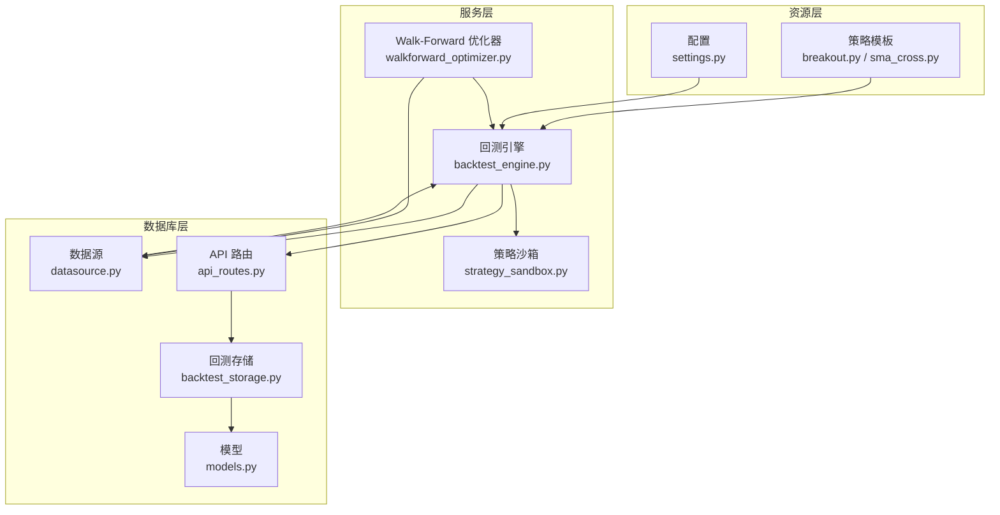
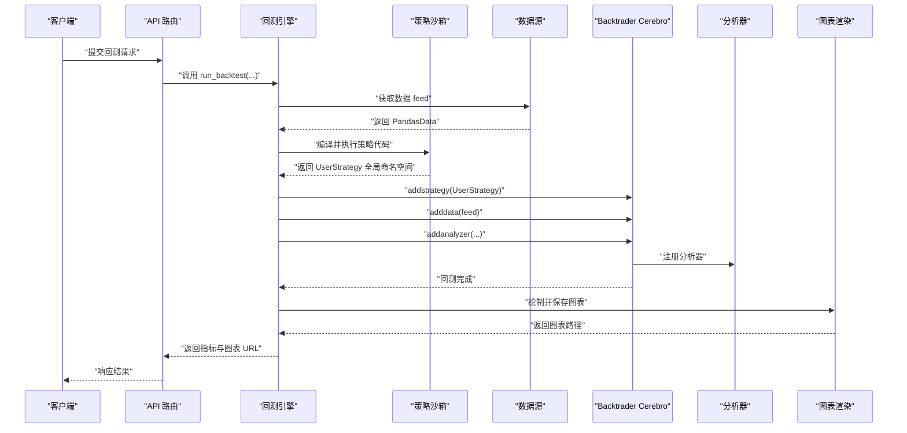
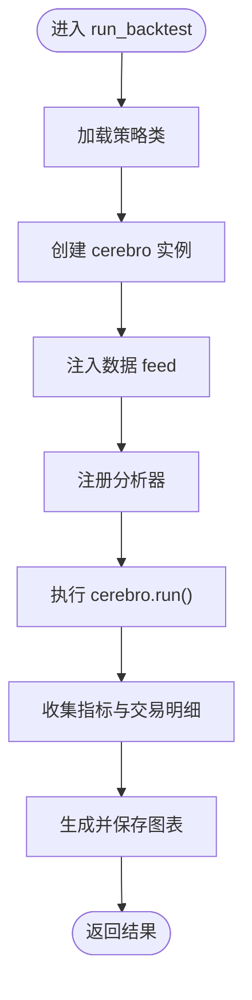
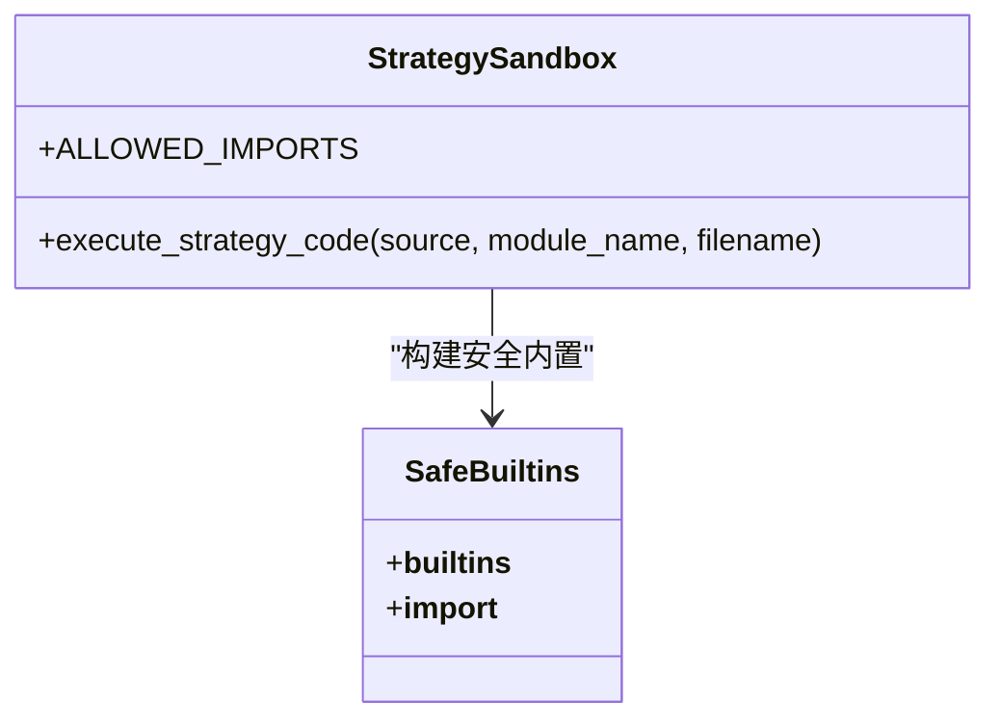
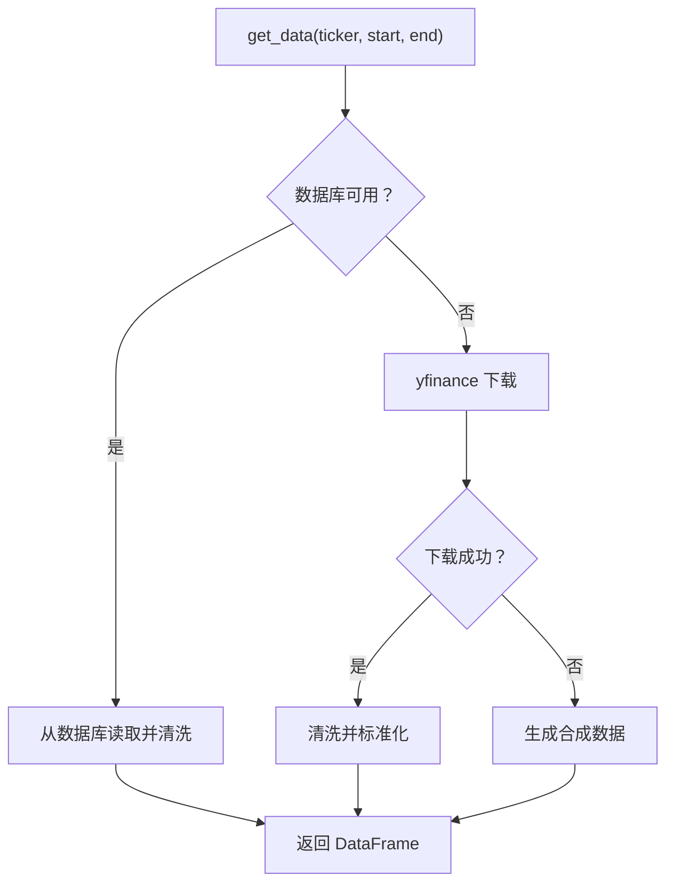
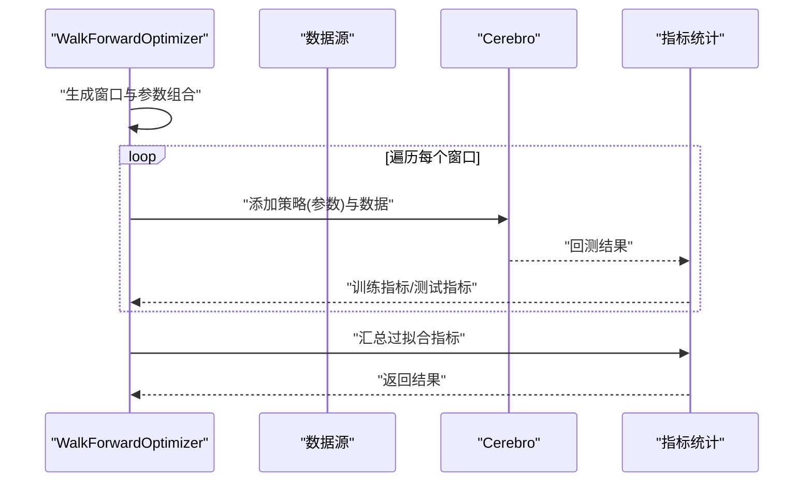
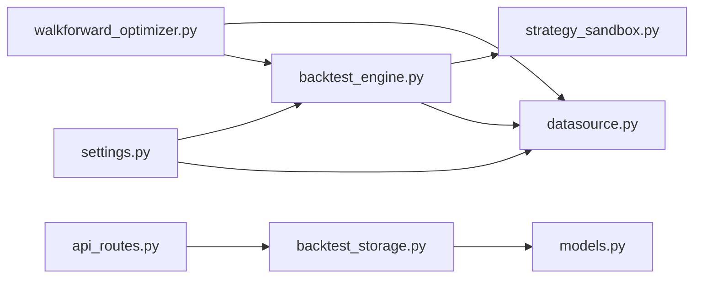

# 计算效率优化

<cite>
**本文引用的文件**
- [backend/src/service/backtest_engine.py](file://backend/src/service/backtest_engine.py)
- [backend/src/service/strategy_sandbox.py](file://backend/src/service/strategy_sandbox.py)
- [backend/src/db/datasource.py](file://backend/src/db/datasource.py)
- [backend/resources/strategy/breakout.py](file://backend/resources/strategy/breakout.py)
- [backend/resources/strategy/sma_cross.py](file://backend/resources/strategy/sma_cross.py)
- [backend/src/config/settings.py](file://backend/src/config/settings.py)
- [backend/src/service/walkforward_optimizer.py](file://backend/src/service/walkforward_optimizer.py)
- [backend/src/db/models.py](file://backend/src/db/models.py)
- [backend/src/db/backtest_storage.py](file://backend/src/db/backtest_storage.py)
- [backend/src/routes/api_routes.py](file://backend/src/routes/api_routes.py)
</cite>

## 目录
1. [引言](#引言)
2. [项目结构](#项目结构)
3. [核心组件](#核心组件)
4. [架构总览](#架构总览)
5. [详细组件分析](#详细组件分析)
6. [依赖关系分析](#依赖关系分析)
7. [性能考量](#性能考量)
8. [故障排查指南](#故障排查指南)
9. [结论](#结论)
10. [附录](#附录)

## 引言
本文件围绕回测引擎的计算效率优化展开，聚焦于回测执行流程中的三大关键环节：数据加载、策略逻辑执行与图表渲染。通过对回测引擎、策略沙箱与数据源的代码级分析，总结出避免在 next() 中执行高开销操作、采用向量化计算替代 Python 原生循环、利用 pandas/numpy 进行高效数据处理的实践路径；同时解释策略沙箱对代码编译与执行的影响，包括模块导入限制与内置函数封装带来的性能开销；最后给出使用 cProfile 等工具定位瓶颈的方法与典型优化建议（如降低日志频率、预计算指标缓存等）。

## 项目结构
后端服务由“服务层”“数据库层”“资源层”构成：
- 服务层：回测引擎、策略沙箱、优化器、WebSocket 管理等
- 数据库层：数据源、模型、存储与路由
- 资源层：策略模板、配置与静态资源目录

图示来源
- [backend/src/service/backtest_engine.py](file://backend/src/service/backtest_engine.py#L1-L272)
- [backend/src/service/strategy_sandbox.py](file://backend/src/service/strategy_sandbox.py#L1-L182)
- [backend/src/db/datasource.py](file://backend/src/db/datasource.py#L1-L156)
- [backend/resources/strategy/breakout.py](file://backend/resources/strategy/breakout.py#L1-L32)
- [backend/resources/strategy/sma_cross.py](file://backend/resources/strategy/sma_cross.py#L1-L19)
- [backend/src/config/settings.py](file://backend/src/config/settings.py#L1-L81)
- [backend/src/service/walkforward_optimizer.py](file://backend/src/service/walkforward_optimizer.py#L1-L537)
- [backend/src/db/models.py](file://backend/src/db/models.py#L341-L372)
- [backend/src/db/backtest_storage.py](file://backend/src/db/backtest_storage.py#L41-L142)
- [backend/src/routes/api_routes.py](file://backend/src/routes/api_routes.py#L100-L140)

章节来源
- [backend/src/service/backtest_engine.py](file://backend/src/service/backtest_engine.py#L1-L272)
- [backend/src/service/strategy_sandbox.py](file://backend/src/service/strategy_sandbox.py#L1-L182)
- [backend/src/db/datasource.py](file://backend/src/db/datasource.py#L1-L156)
- [backend/resources/strategy/breakout.py](file://backend/resources/strategy/breakout.py#L1-L32)
- [backend/resources/strategy/sma_cross.py](file://backend/resources/strategy/sma_cross.py#L1-L19)
- [backend/src/config/settings.py](file://backend/src/config/settings.py#L1-L81)
- [backend/src/service/walkforward_optimizer.py](file://backend/src/service/walkforward_optimizer.py#L1-L537)
- [backend/src/db/models.py](file://backend/src/db/models.py#L341-L372)
- [backend/src/db/backtest_storage.py](file://backend/src/db/backtest_storage.py#L41-L142)
- [backend/src/routes/api_routes.py](file://backend/src/routes/api_routes.py#L100-L140)

## 核心组件
- 回测引擎：负责策略加载、数据注入、指标分析器注册、回测执行与图表渲染导出
- 策略沙箱：限制用户可导入模块与内置函数，构建安全的执行环境
- 数据源：优先从数据库拉取，其次使用 yfinance 下载，最后生成合成数据
- Walk-Forward 优化器：训练窗口参数优化 + 测试窗口验证，检测过拟合
- 存储与路由：持久化回测结果与图表文件，提供 API 接口

章节来源
- [backend/src/service/backtest_engine.py](file://backend/src/service/backtest_engine.py#L180-L272)
- [backend/src/service/strategy_sandbox.py](file://backend/src/service/strategy_sandbox.py#L148-L181)
- [backend/src/db/datasource.py](file://backend/src/db/datasource.py#L70-L120)
- [backend/src/service/walkforward_optimizer.py](file://backend/src/service/walkforward_optimizer.py#L181-L273)

## 架构总览
回测执行主流程如下：策略文件经沙箱安全编译与执行，生成 UserStrategy 类；回测引擎创建 cerebro 实例，注入数据与分析器，运行回测并导出图表。

图示来源
- [backend/src/service/backtest_engine.py](file://backend/src/service/backtest_engine.py#L180-L272)
- [backend/src/service/strategy_sandbox.py](file://backend/src/service/strategy_sandbox.py#L148-L181)
- [backend/src/db/datasource.py](file://backend/src/db/datasource.py#L114-L120)
- [backend/src/routes/api_routes.py](file://backend/src/routes/api_routes.py#L100-L140)

## 详细组件分析

### 组件A：回测引擎（backtest_engine.py）
- 策略加载与校验：读取策略文件，通过沙箱执行，校验 UserStrategy 是否继承自 bt.Strategy
- 数据注入：从数据源获取 PandasData 并注入 cerebro
- 分析器注册：注册多种分析器（夏普比率、最大回撤、收益、年化回报、SQN、交易分析、时间序列回撤、自定义交易记录器）
- 图表渲染：关闭交互式绘图，批量生成并保存图表，异常时记录日志并抛出错误

图示来源
- [backend/src/service/backtest_engine.py](file://backend/src/service/backtest_engine.py#L180-L272)

章节来源
- [backend/src/service/backtest_engine.py](file://backend/src/service/backtest_engine.py#L180-L272)

### 组件B：策略沙箱（strategy_sandbox.py）
- 安全导入白名单：仅允许有限模块导入（如 backtrader、math、statistics、random、datetime、decimal、fractions、collections、itertools、functools、typing、operator、bisect、heapq、pandas、numpy）
- 内置函数封装：重定义 __builtins__，替换 __import__ 为安全导入函数，移除模块自带 __builtins__ 引用
- 编译与执行：compile 后 exec 执行，捕获语法与运行时错误，返回模块全局命名空间

图示来源
- [backend/src/service/strategy_sandbox.py](file://backend/src/service/strategy_sandbox.py#L148-L181)

章节来源
- [backend/src/service/strategy_sandbox.py](file://backend/src/service/strategy_sandbox.py#L1-L182)

### 组件C：数据源（datasource.py）
- 优先级：数据库 > yfinance > 合成数据
- 数据清洗：列名标准化、索引设置、缺失值填充、多指数列处理
- Backtrader feed 包装：将 DataFrame 封装为 PandasData
- 原始数据 JSON 导出：用于前端展示

图示来源
- [backend/src/db/datasource.py](file://backend/src/db/datasource.py#L70-L120)

章节来源
- [backend/src/db/datasource.py](file://backend/src/db/datasource.py#L1-L156)

### 组件D：Walk-Forward 优化器（walkforward_optimizer.py）
- 窗口生成：按滚动或锚定方式生成训练/测试窗口
- 参数组合：笛卡尔积生成参数组合
- 训练优化：在训练窗口上遍历参数组合，选择优化指标最佳参数
- 测试验证：在测试窗口上验证最佳参数，统计指标
- 过拟合检测：计算训练/测试相关性、平均退化率、一致性得分等

图示来源
- [backend/src/service/walkforward_optimizer.py](file://backend/src/service/walkforward_optimizer.py#L181-L273)
- [backend/src/service/walkforward_optimizer.py](file://backend/src/service/walkforward_optimizer.py#L372-L537)

章节来源
- [backend/src/service/walkforward_optimizer.py](file://backend/src/service/walkforward_optimizer.py#L1-L537)

### 组件E：策略模板（breakout.py / sma_cross.py）
- 示例策略：演示在 next() 中进行信号判断与下单
- 注意事项：这些策略适合展示，但不直接体现向量化优化；实际优化应放在 next() 外部或使用向量化指标

章节来源
- [backend/resources/strategy/breakout.py](file://backend/resources/strategy/breakout.py#L1-L32)
- [backend/resources/strategy/sma_cross.py](file://backend/resources/strategy/sma_cross.py#L1-L19)

## 依赖关系分析
- 回测引擎依赖策略沙箱进行策略加载与安全执行
- 数据源为回测引擎提供 feed，也为 Walk-Forward 优化器提供数据
- 存储与路由负责持久化与对外接口，与回测引擎结果耦合
- 配置模块提供资源目录与环境变量，影响策略与图像保存路径

图示来源
- [backend/src/service/backtest_engine.py](file://backend/src/service/backtest_engine.py#L1-L272)
- [backend/src/service/strategy_sandbox.py](file://backend/src/service/strategy_sandbox.py#L1-L182)
- [backend/src/db/datasource.py](file://backend/src/db/datasource.py#L1-L156)
- [backend/src/service/walkforward_optimizer.py](file://backend/src/service/walkforward_optimizer.py#L1-L537)
- [backend/src/db/backtest_storage.py](file://backend/src/db/backtest_storage.py#L41-L142)
- [backend/src/db/models.py](file://backend/src/db/models.py#L341-L372)
- [backend/src/config/settings.py](file://backend/src/config/settings.py#L1-L81)
- [backend/src/routes/api_routes.py](file://backend/src/routes/api_routes.py#L100-L140)

## 性能考量

### 影响性能的关键环节
- 数据加载
  - 优先从数据库读取，避免网络延迟与重复下载
  - 对 yfinance 的调用需谨慎，尽量复用已下载数据
  - 合成数据仅作为兜底，避免在生产环境频繁触发
- 策略逻辑执行
  - 避免在 next() 中执行高开销操作（如频繁 IO、复杂字符串拼接、逐条 Python 循环）
  - 使用向量化计算（pandas/numpy）替代 Python 原生循环
  - 在初始化阶段预计算指标，减少每根 K 线上的重复计算
- 图表渲染
  - 关闭交互式绘图，批量生成并保存图像，避免本地弹窗导致阻塞
  - 控制图像尺寸与 DPI，平衡质量与体积

章节来源
- [backend/src/db/datasource.py](file://backend/src/db/datasource.py#L70-L120)
- [backend/src/service/backtest_engine.py](file://backend/src/service/backtest_engine.py#L180-L272)

### 策略沙箱对性能的影响
- 模块导入限制：仅允许有限模块导入，减少不必要的依赖加载
- 内置函数封装：重写 __builtins__ 与 __import__，带来额外的函数调用开销
- 安全检查：编译与执行前的安全检查会增加少量 CPU 时间
- 建议：在策略中显式导入所需模块，避免动态导入；尽量使用 pandas/numpy 提供的向量函数

章节来源
- [backend/src/service/strategy_sandbox.py](file://backend/src/service/strategy_sandbox.py#L148-L181)

### 向量化计算与高效数据处理
- 使用 pandas/numpy 的向量化函数替代逐行循环
- 在初始化阶段计算常用指标（如移动最高/最低价、均线差等），在 next() 中只做索引访问
- 利用内置 Backtrader 指标（如 Highest/Lowest、SMA、CrossOver）减少自定义循环

章节来源
- [backend/resources/strategy/breakout.py](file://backend/resources/strategy/breakout.py#L1-L32)
- [backend/resources/strategy/sma_cross.py](file://backend/resources/strategy/sma_cross.py#L1-L19)

### 典型场景下的优化建议
- 减少日志输出频率：在高频回测中，降低 INFO 级别日志，仅在关键节点输出
- 预计算指标缓存：将历史窗口内的统计量缓存到数组或 Series，避免每根 K 线重复计算
- 降低图表生成成本：仅在需要时生成图表，或降低 DPI 与尺寸
- 数据预处理：在数据源层完成必要的清洗与标准化，减少回测阶段的数据转换

章节来源
- [backend/src/service/backtest_engine.py](file://backend/src/service/backtest_engine.py#L240-L256)
- [backend/src/db/datasource.py](file://backend/src/db/datasource.py#L1-L156)

### 使用 cProfile 定位性能瓶颈
- 在回测入口处启用 cProfile，采集 CPU 时间分布
- 关注 compile/exec、数据下载、指标计算、图表生成等热点区域
- 结合日志与指标输出，确认瓶颈是否来自策略逻辑或外部依赖

章节来源
- [backend/src/service/backtest_engine.py](file://backend/src/service/backtest_engine.py#L180-L272)
- [backend/src/db/datasource.py](file://backend/src/db/datasource.py#L70-L120)

## 故障排查指南
- 策略加载失败
  - 检查策略文件是否存在与命名规范
  - 确认 UserStrategy 类存在且继承自 bt.Strategy
  - 沙箱报错通常来自非法导入或语法错误
- 数据加载失败
  - 数据库连接失败或查询无结果时回退到 yfinance 或合成数据
  - 网络异常时可考虑缓存最近一次下载数据
- 图表渲染失败
  - 关闭交互式绘图，确保保存路径存在
  - 捕获异常并记录详细日志，避免中断回测流程

章节来源
- [backend/src/service/backtest_engine.py](file://backend/src/service/backtest_engine.py#L59-L96)
- [backend/src/service/strategy_sandbox.py](file://backend/src/service/strategy_sandbox.py#L148-L181)
- [backend/src/db/datasource.py](file://backend/src/db/datasource.py#L70-L120)

## 结论
回测引擎的性能优化应从“数据加载—策略执行—图表渲染”三段式入手：优先保证数据稳定高效地到达回测框架；在策略层面采用向量化与预计算，避免在 next() 中执行高开销操作；在渲染阶段控制输出规模与频率。策略沙箱虽然带来一定性能开销，但通过合理的导入与内置函数使用，可在安全性与效率之间取得平衡。借助 cProfile 等工具持续定位瓶颈，配合日志降频与缓存策略，可显著提升大规模回测与 Walk-Forward 优化的执行效率。

## 附录
- 资源目录与策略模板位置
  - 资源目录由配置模块统一管理，策略模板位于 resources/strategy
- 存储与 API
  - 回测结果与图表文件通过存储模块持久化，API 路由提供访问与删除接口

章节来源
- [backend/src/config/settings.py](file://backend/src/config/settings.py#L1-L81)
- [backend/src/db/backtest_storage.py](file://backend/src/db/backtest_storage.py#L41-L142)
- [backend/src/routes/api_routes.py](file://backend/src/routes/api_routes.py#L100-L140)