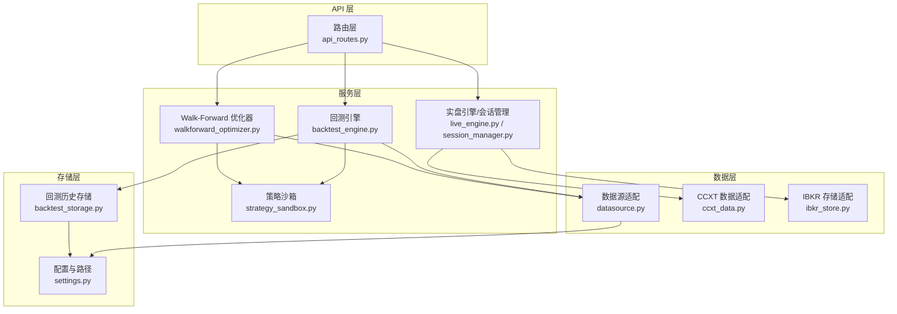
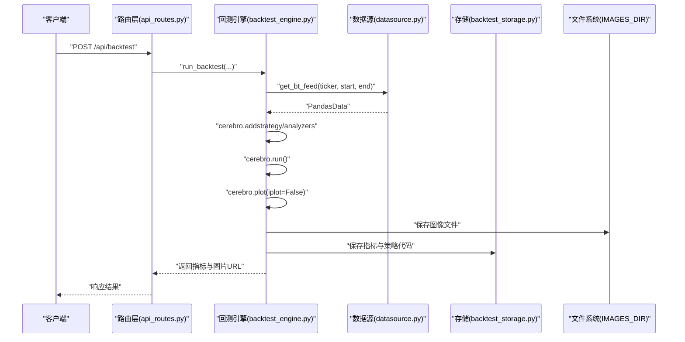
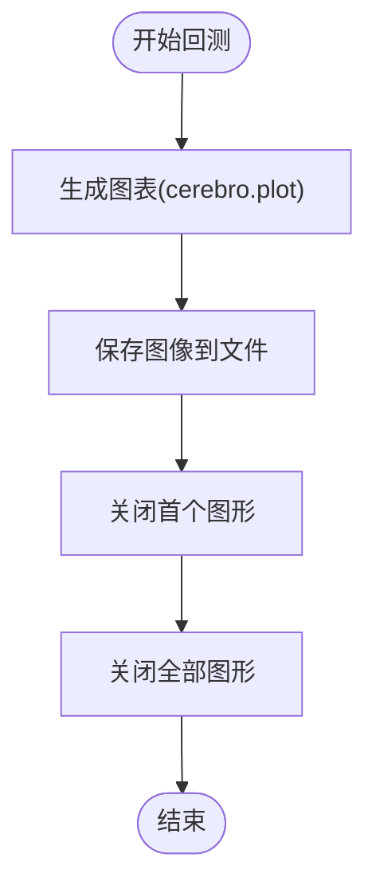
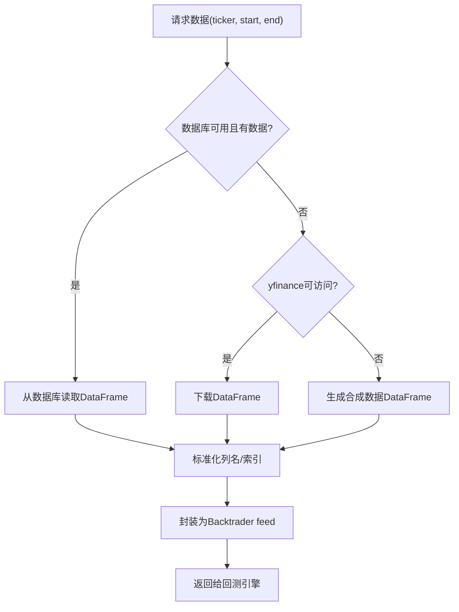
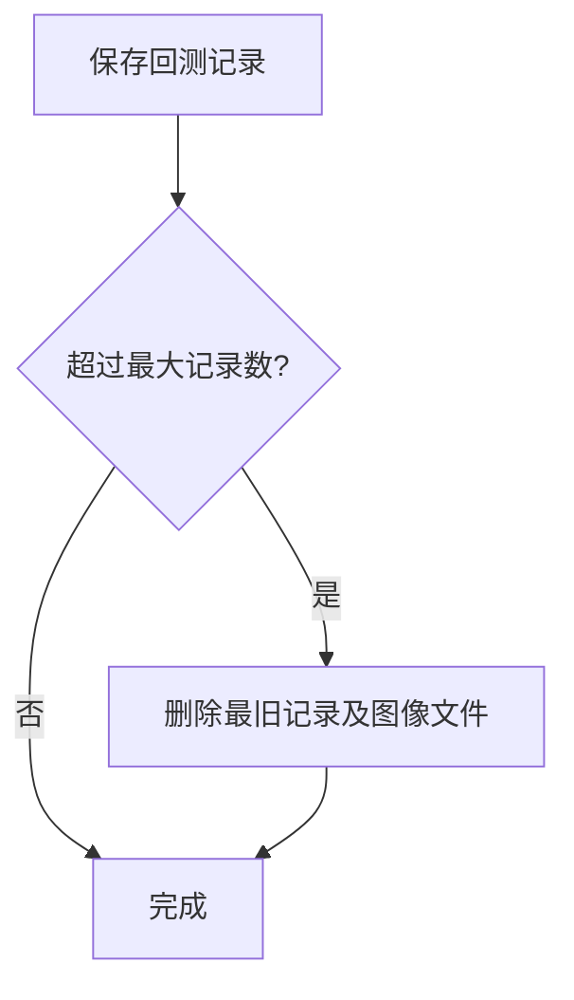
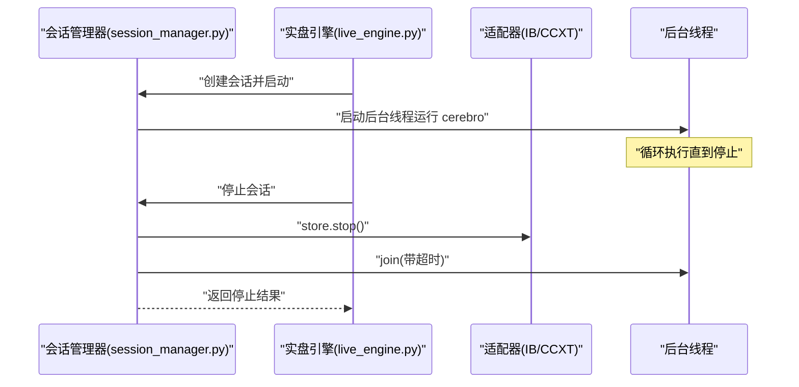
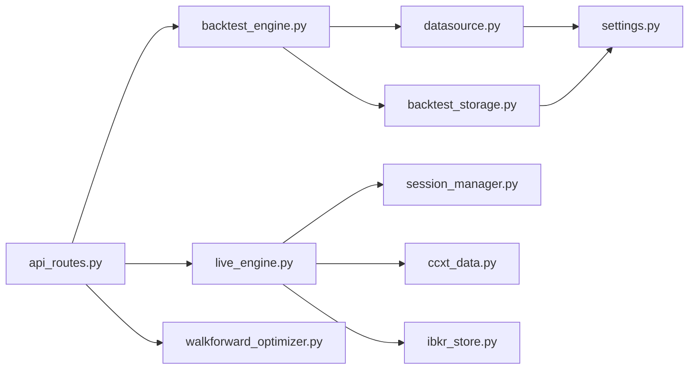

# 资源管理优化

<cite>
**本文引用的文件**
- [feature.md](file://feature.md)
- [backtest_engine.py](file://backend/src/service/backtest_engine.py)
- [settings.py](file://backend/src/config/settings.py)
- [datasource.py](file://backend/src/db/datasource.py)
- [backtest_storage.py](file://backend/src/db/backtest_storage.py)
- [api_routes.py](file://backend/src/routes/api_routes.py)
- [live_engine.py](file://backend/src/service/live_engine.py)
- [session_manager.py](file://backend/src/service/session_manager.py)
- [ccxt_data.py](file://backend/src/brokers/ccxt_adapter/ccxt_data.py)
- [ibkr_store.py](file://backend/src/brokers/ibkr_adapter/ibkr_store.py)
- [strategy_sandbox.py](file://backend/src/service/strategy_sandbox.py)
- [walkforward_optimizer.py](file://backend/src/service/walkforward_optimizer.py)
- [main.py](file://backend/main.py)
</cite>

## 目录
1. [引言](#引言)
2. [项目结构](#项目结构)
3. [核心组件](#核心组件)
4. [架构总览](#架构总览)
5. [详细组件分析](#详细组件分析)
6. [依赖关系分析](#依赖关系分析)
7. [性能与内存考量](#性能与内存考量)
8. [故障排查指南](#故障排查指南)
9. [结论](#结论)

## 引言
本文件围绕策略运行过程中的内存与资源管理最佳实践展开，结合 feature.md 中提出的多标的/组合回测能力，系统分析大规模资产回测场景下的内存占用问题，并给出分批加载数据、共享数据源实例、及时释放无用对象等策略；同时讨论长时间运行回测的资源泄漏风险与任务隔离机制，以及多策略并发执行时的进程/线程资源分配建议。文档特别强调在 backtest_engine.py 中的资源清理逻辑，尤其是图像生成后的及时关闭与内存回收的重要性。

## 项目结构
后端采用 FastAPI + Backtrader 架构，服务层负责策略加载、回测执行、分析器与绘图输出，数据层通过数据库或 yfinance 提供行情数据馈送，存储层持久化回测结果与图像文件。整体流程从 API 入口进入，经由路由层调用回测引擎，再由引擎创建 cerebro 实例、添加数据与分析器、运行策略并生成图表，最后落库保存。

**图表来源**
- [api_routes.py](file://backend/src/routes/api_routes.py#L90-L146)
- [backtest_engine.py](file://backend/src/service/backtest_engine.py#L180-L256)
- [live_engine.py](file://backend/src/service/live_engine.py#L196-L267)
- [session_manager.py](file://backend/src/service/session_manager.py#L84-L409)
- [walkforward_optimizer.py](file://backend/src/service/walkforward_optimizer.py#L181-L273)
- [datasource.py](file://backend/src/db/datasource.py#L70-L120)
- [ccxt_data.py](file://backend/src/brokers/ccxt_adapter/ccxt_data.py#L137-L177)
- [ibkr_store.py](file://backend/src/brokers/ibkr_adapter/ibkr_store.py#L126-L156)
- [backtest_storage.py](file://backend/src/db/backtest_storage.py#L51-L108)
- [settings.py](file://backend/src/config/settings.py#L1-L81)

**章节来源**
- [feature.md](file://feature.md#L1-L12)
- [main.py](file://backend/main.py#L1-L21)

## 核心组件
- 回测引擎：负责构建 cerebro、注入数据与分析器、运行策略、生成图表并落库。
- 数据源适配：优先从数据库拉取，失败则回退到 yfinance 或合成数据，统一包装为 Backtrader feed。
- 存储层：持久化回测指标、图像文件与策略代码快照，包含自动清理旧记录与损坏记录的机制。
- 实盘/会话管理：后台线程运行 cerebro，提供会话生命周期管理与优雅停止。
- Walk-Forward 优化器：滚动窗口训练/验证，避免过拟合并评估稳定性。
- 策略沙箱：限制用户导入与内置函数，保障执行安全。

**章节来源**
- [backtest_engine.py](file://backend/src/service/backtest_engine.py#L180-L256)
- [datasource.py](file://backend/src/db/datasource.py#L70-L120)
- [backtest_storage.py](file://backend/src/db/backtest_storage.py#L51-L108)
- [live_engine.py](file://backend/src/service/live_engine.py#L196-L267)
- [session_manager.py](file://backend/src/service/session_manager.py#L84-L409)
- [walkforward_optimizer.py](file://backend/src/service/walkforward_optimizer.py#L181-L273)
- [strategy_sandbox.py](file://backend/src/service/strategy_sandbox.py#L148-L181)

## 架构总览
下图展示了从 API 到回测引擎再到数据与存储的整体交互，以及绘图与落库的关键节点。

**图表来源**
- [api_routes.py](file://backend/src/routes/api_routes.py#L90-L146)
- [backtest_engine.py](file://backend/src/service/backtest_engine.py#L180-L256)
- [datasource.py](file://backend/src/db/datasource.py#L114-L120)
- [backtest_storage.py](file://backend/src/db/backtest_storage.py#L51-L108)
- [settings.py](file://backend/src/config/settings.py#L1-L81)

## 详细组件分析

### 组件一：回测引擎与绘图资源清理
- 关键点：
  - 使用非交互模式渲染图表，避免本地弹窗导致的资源驻留。
  - 在生成图像后显式关闭当前图形与全部图形，防止内存泄漏。
  - 将图像保存到指定目录，便于后续清理与复用。
- 最佳实践：
  - 对于大规模回测，建议在每次回测完成后主动调用关闭与回收。
  - 若需要批量生成图表，应逐个关闭，避免累积占用。

**图表来源**
- [backtest_engine.py](file://backend/src/service/backtest_engine.py#L243-L254)

**章节来源**
- [backtest_engine.py](file://backend/src/service/backtest_engine.py#L1-L272)

### 组件二：数据馈送与内存占用控制
- 关键点：
  - 数据优先从数据库拉取，若为空则回退到 yfinance，最后使用合成数据保证流程可用。
  - 数据以 Pandas DataFrame 形式传入 Backtrader feed，注意大时间序列的内存占用。
- 最佳实践：
  - 对超大规模时间序列，建议分批加载（按日期窗口）或使用数据库原生分页查询。
  - 在数据馈送层对列名与索引进行标准化，减少重复转换成本。
  - 对于实时数据，采用缓冲与批量消费策略，避免一次性塞满内存。

**图表来源**
- [datasource.py](file://backend/src/db/datasource.py#L70-L120)

**章节来源**
- [datasource.py](file://backend/src/db/datasource.py#L1-L156)

### 组件三：存储层与图像文件清理
- 关键点：
  - 保存回测指标、策略代码快照与图像文件名。
  - 自动清理超过上限的历史记录，并删除对应图像文件。
  - 对损坏记录进行识别与清理，保证查询稳定性。
- 最佳实践：
  - 控制最大记录数量，避免磁盘与内存压力。
  - 清理策略应异步或定时执行，避免阻塞主流程。
  - 图像文件命名与路径统一管理，便于快速定位与删除。

**图表来源**
- [backtest_storage.py](file://backend/src/db/backtest_storage.py#L104-L149)

**章节来源**
- [backtest_storage.py](file://backend/src/db/backtest_storage.py#L51-L108)

### 组件四：实盘/会话管理与资源泄漏防护
- 关键点：
  - 后台线程运行 cerebro，支持优雅停止与资源回收。
  - 会话管理器提供全局单例，统一跟踪与停止活动会话。
  - 停止时调用底层 store 的 stop()，确保外部连接释放。
- 最佳实践：
  - 长时间运行的实盘会话应设置超时与健康检查。
  - 建议定期重启或轮换会话，降低长期运行带来的资源泄漏风险。

**图表来源**
- [live_engine.py](file://backend/src/service/live_engine.py#L196-L267)
- [session_manager.py](file://backend/src/service/session_manager.py#L239-L278)

**章节来源**
- [live_engine.py](file://backend/src/service/live_engine.py#L196-L267)
- [session_manager.py](file://backend/src/service/session_manager.py#L84-L409)

### 组件五：Walk-Forward 优化与内存管理
- 关键点：
  - 按滚动窗口分别训练与验证，避免一次性加载全量数据。
  - 每个窗口独立创建 cerebro 实例，结束后自然释放。
- 最佳实践：
  - 参数网格组合较多时，建议分批提交任务，避免单次内存峰值过高。
  - 在每个窗口结束后显式清理分析器与中间对象，减少累积占用。

**章节来源**
- [walkforward_optimizer.py](file://backend/src/service/walkforward_optimizer.py#L181-L273)

### 组件六：策略沙箱与资源隔离
- 关键点：
  - 限制用户导入模块与内置函数，避免越权与资源滥用。
  - 通过编译与执行沙箱环境，隔离用户代码对宿主的影响。
- 最佳实践：
  - 对用户策略进行语法与执行错误捕获，防止异常导致的资源泄漏。
  - 在策略加载失败时及时清理临时对象与缓存。

**章节来源**
- [strategy_sandbox.py](file://backend/src/service/strategy_sandbox.py#L148-L181)

## 依赖关系分析
- 回测引擎依赖数据源适配与存储层，用于数据馈送与结果持久化。
- 实盘引擎依赖会话管理器与适配器（CCXT/IBKR），用于连接外部市场数据与订单执行。
- Walk-Forward 优化器复用回测引擎的数据与策略加载能力，形成可扩展的参数搜索框架。
- 配置模块提供资源目录与环境变量，确保路径与外部服务的一致性。

**图表来源**
- [api_routes.py](file://backend/src/routes/api_routes.py#L90-L146)
- [backtest_engine.py](file://backend/src/service/backtest_engine.py#L180-L256)
- [live_engine.py](file://backend/src/service/live_engine.py#L196-L267)
- [session_manager.py](file://backend/src/service/session_manager.py#L84-L409)
- [walkforward_optimizer.py](file://backend/src/service/walkforward_optimizer.py#L181-L273)
- [datasource.py](file://backend/src/db/datasource.py#L70-L120)
- [backtest_storage.py](file://backend/src/db/backtest_storage.py#L51-L108)
- [settings.py](file://backend/src/config/settings.py#L1-L81)

**章节来源**
- [main.py](file://backend/main.py#L1-L21)

## 性能与内存考量
- 大规模资产回测的内存占用主要来自：
  - 行情数据 DataFrame 的尺寸与列数。
  - Backtrader 内部的分析器与绘图对象。
  - 多标的/组合回测时的多数据馈送与分析器叠加。
- 优化建议：
  - 分批加载数据：按日期窗口分段拉取，避免一次性加载全量历史。
  - 共享数据源实例：在同一批次内复用数据馈送，减少重复解析与对象创建。
  - 及时释放无用对象：回测结束后关闭图形、清理分析器、断开外部连接。
  - 合理配置 cerebro 实例：仅添加必要的分析器与绘图，避免冗余计算。
  - 优化数据馈送结构：统一列名与索引，减少转换与拷贝。
  - 长时间运行场景：定期重启回测进程或采用任务隔离机制，降低资源泄漏风险。
  - 多策略并发：为不同策略分配独立进程/线程池，设置资源上限与超时，避免相互影响。

[本节为通用指导，无需特定文件引用]

## 故障排查指南
- 绘图失败或内存泄漏：
  - 确认已关闭当前图形与全部图形，避免遗留句柄。
  - 检查图像保存路径是否存在权限问题。
- 数据加载异常：
  - 检查数据库连接字符串与表结构是否匹配。
  - 确认 yfinance 可用性与网络代理配置。
- 存储清理失败：
  - 查看清理日志，确认文件是否存在与权限是否足够。
  - 对损坏记录进行手动清理或重试。
- 实盘会话无法停止：
  - 检查 store.stop() 是否被正确调用。
  - 设置合理的 join 超时，必要时强制中断。

**章节来源**
- [backtest_engine.py](file://backend/src/service/backtest_engine.py#L243-L254)
- [backtest_storage.py](file://backend/src/db/backtest_storage.py#L104-L149)
- [live_engine.py](file://backend/src/service/live_engine.py#L196-L267)
- [session_manager.py](file://backend/src/service/session_manager.py#L239-L278)

## 结论
通过在回测引擎中严格执行绘图后的关闭与回收、在数据层采用分批加载与标准化馈送、在存储层实施自动清理与损坏记录修复、在实盘会话中提供优雅停止与资源释放，可以有效降低大规模资产回测场景下的内存占用与资源泄漏风险。结合多标的/组合回测与 Walk-Forward 优化，建议进一步引入任务隔离与进程/线程池管理，确保系统在高负载与长时间运行场景下的稳定性与可维护性。