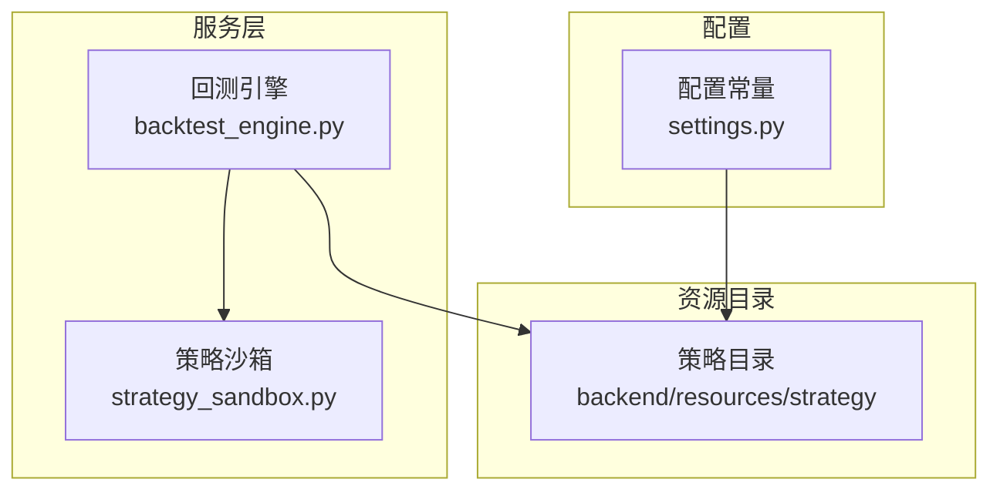
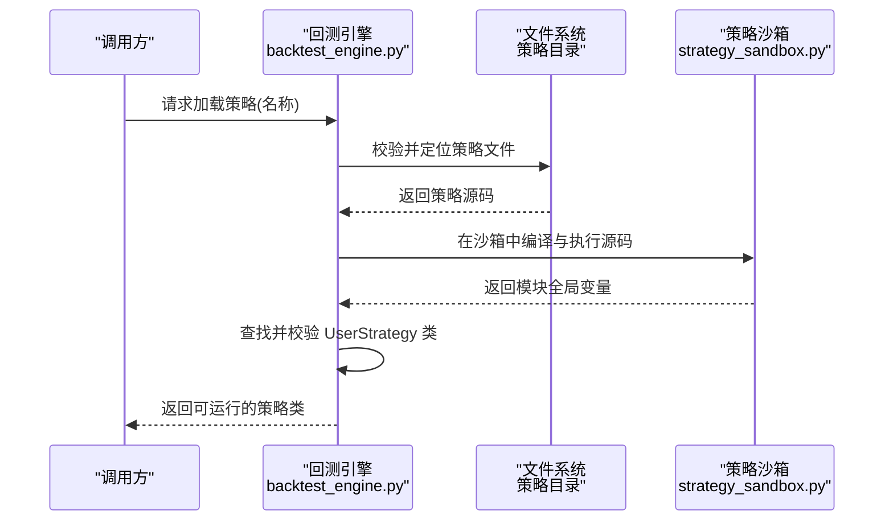
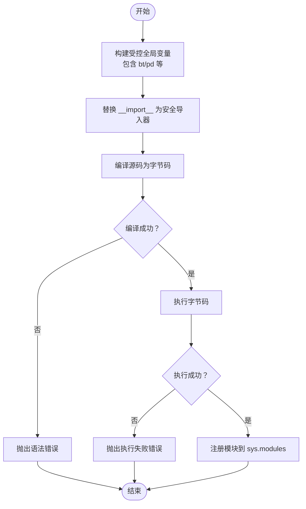
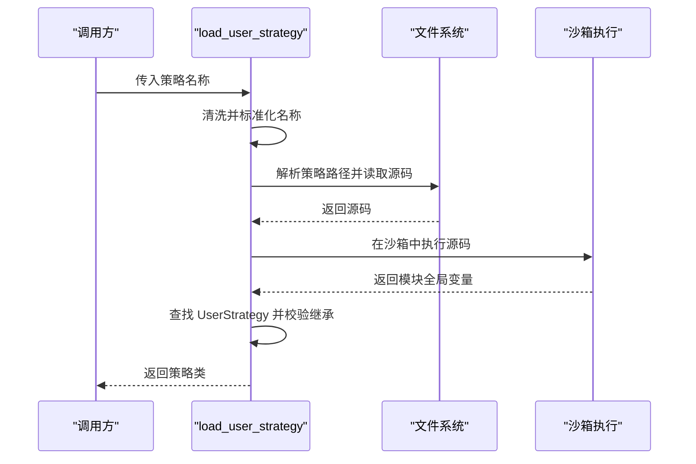
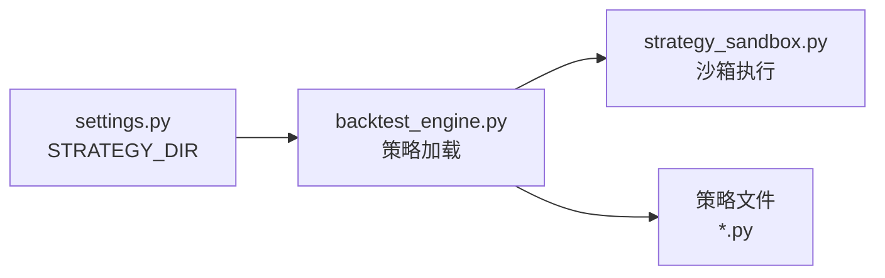

# 策略编码规范

<cite>
**本文引用的文件**
- [strategy.md](file://backend/resources/strategy/strategy.md)
- [strategy_sandbox.py](file://backend/src/service/strategy_sandbox.py)
- [backtest_engine.py](file://backend/src/service/backtest_engine.py)
- [settings.py](file://backend/src/config/settings.py)
- [breakout.py](file://backend/resources/strategy/breakout.py)
- [buy_and_hold.py](file://backend/resources/strategy/buy_and_hold.py)
- [rsi_reversion.py](file://backend/resources/strategy/rsi_reversion.py)
- [sma_cross.py](file://backend/resources/strategy/sma_cross.py)
</cite>

## 目录
1. [引言](#引言)
2. [项目结构](#项目结构)
3. [核心组件](#核心组件)
4. [架构总览](#架构总览)
5. [详细组件分析](#详细组件分析)
6. [依赖关系分析](#依赖关系分析)
7. [性能考虑](#性能考虑)
8. [故障排查指南](#故障排查指南)
9. [结论](#结论)
10. [附录](#附录)

## 引言
本规范面向策略开发者，系统性说明策略脚本的命名约定、文件组织方式、代码结构要求、沙箱导入限制、安全与合规实践，以及策略加载机制。目标是帮助团队在统一标准下高效、安全地开发与维护策略，降低回测与实盘风险。

## 项目结构
策略资源位于后端资源目录下的 strategy 子目录中，策略加载与执行由后端服务负责。关键路径与职责如下：
- 策略目录：backend/resources/strategy
- 策略加载与执行：backend/src/service/backtest_engine.py
- 沙箱执行与导入限制：backend/src/service/strategy_sandbox.py
- 资源目录常量与策略目录路径：backend/src/config/settings.py

图表来源
- [settings.py](file://backend/src/config/settings.py#L1-L81)
- [backtest_engine.py](file://backend/src/service/backtest_engine.py#L1-L272)
- [strategy_sandbox.py](file://backend/src/service/strategy_sandbox.py#L1-L182)

章节来源
- [settings.py](file://backend/src/config/settings.py#L1-L81)

## 核心组件
- 策略命名与组织
  - 命名约定：小写加下划线，如 ma_cross.py、grid_trader.py。
  - 组织方式：稳定版本置于主目录；实验性代码放入 sandbox 或独立分支，避免污染主目录。
  - 依赖与路径：使用相对路径，并在 README 中注明来源与用法。
- 代码结构要求
  - 必须包含 UserStrategy 类，并继承自 backtrader.Strategy。
  - 使用 params 元组声明策略参数，便于回测与优化。
- 沙箱导入限制
  - 仅允许导入 backtrader、pandas、numpy 等白名单模块；禁止相对导入与未授权模块。
- 加载机制
  - 通过 load_user_strategy 动态加载策略文件，执行于受控沙箱环境，校验类定义与继承关系。
- 安全与合规
  - 禁止将真实交易密钥、账户信息或敏感配置写入仓库；回测参数应与真实环境保持一致或明确差异。

章节来源
- [strategy.md](file://backend/resources/strategy/strategy.md#L1-L28)
- [backtest_engine.py](file://backend/src/service/backtest_engine.py#L73-L96)
- [strategy_sandbox.py](file://backend/src/service/strategy_sandbox.py#L15-L56)

## 架构总览
策略从文件系统读取，经沙箱编译与执行，最终在回测引擎中实例化并运行。加载流程严格校验策略名称、文件存在性、语法与类定义规范。

图表来源
- [backtest_engine.py](file://backend/src/service/backtest_engine.py#L73-L96)
- [strategy_sandbox.py](file://backend/src/service/strategy_sandbox.py#L148-L179)

## 详细组件分析

### 策略命名与文件组织
- 命名约定
  - 使用小写加下划线，避免大小写与连字符混用，提升跨平台一致性。
- 文件组织
  - 主目录存放稳定版本策略；实验性代码与临时文件放入 sandbox 或独立分支，确保主目录的稳定性。
- 依赖与路径
  - 使用相对路径访问外部数据/配置；在 README 中明确来源与用法，便于他人复用与审计。

章节来源
- [strategy.md](file://backend/resources/strategy/strategy.md#L10-L13)

### 代码结构要求：UserStrategy 类与继承
- 必须提供 UserStrategy 类，且继承自 backtrader.Strategy。
- 推荐使用 params 元组声明策略参数，便于参数扫描与优化。
- 示例策略展示了基本结构：params、__init__ 中初始化指标与状态，next 中实现交易逻辑。

参考示例（路径）
- [breakout.py](file://backend/resources/strategy/breakout.py#L1-L32)
- [buy_and_hold.py](file://backend/resources/strategy/buy_and_hold.py#L1-L11)
- [rsi_reversion.py](file://backend/resources/strategy/rsi_reversion.py#L1-L18)
- [sma_cross.py](file://backend/resources/strategy/sma_cross.py#L1-L19)

章节来源
- [backtest_engine.py](file://backend/src/service/backtest_engine.py#L91-L96)

### 沙箱导入限制与执行流程
- 白名单模块
  - 允许导入 backtrader、pandas、numpy 等常用库；其余模块一律拒绝。
- 导入约束
  - 禁止相对导入；任何非法导入将触发沙箱错误。
- 执行流程
  - 构建受控 globals（包含 bt、pd 等），替换 __builtins__ 的 __import__ 为安全导入器；
  - 编译源码为字节码，捕获语法错误；
  - 执行字节码，捕获异常并抛出沙箱错误；
  - 将执行结果注册为模块，供后续加载使用。

图表来源
- [strategy_sandbox.py](file://backend/src/service/strategy_sandbox.py#L142-L179)

章节来源
- [strategy_sandbox.py](file://backend/src/service/strategy_sandbox.py#L15-L56)
- [strategy_sandbox.py](file://backend/src/service/strategy_sandbox.py#L142-L179)

### 策略加载机制：load_user_strategy
- 名称清洗与路径解析
  - 仅允许字母、数字、连字符与下划线；自动去除多余空白与可选 .py 后缀。
- 文件读取与编码
  - 读取 UTF-8 文本；若存在 BOM 则剥离。
- 沙箱执行与类校验
  - 在沙箱中执行策略源码，获取模块全局变量；
  - 查找名为 UserStrategy 的类；
  - 校验其是否继承自 backtrader.Strategy；
  - 任一环节失败均抛出加载错误。

图表来源
- [backtest_engine.py](file://backend/src/service/backtest_engine.py#L73-L96)
- [strategy_sandbox.py](file://backend/src/service/strategy_sandbox.py#L148-L179)

章节来源
- [backtest_engine.py](file://backend/src/service/backtest_engine.py#L34-L47)
- [backtest_engine.py](file://backend/src/service/backtest_engine.py#L73-L96)

### 安全与合规实践
- 禁止将敏感信息写入仓库
  - 禁止写入真实交易密钥、账户信息或敏感配置；使用环境变量或外部配置管理。
- 回测一致性
  - 回测参数、滑点、手续费需与真实环境一致或明确差异，避免误导性结论。
- 实盘前置复核
  - 对接实盘前再次人工复核风险边界与风控触发条件。

章节来源
- [strategy.md](file://backend/resources/strategy/strategy.md#L20-L23)

### 代码模板与最佳实践
- 模板要点
  - 文件名：小写加下划线，如 my_strategy.py。
  - 类名：UserStrategy，继承自 backtrader.Strategy。
  - 参数：使用 params 元组声明策略参数。
  - 逻辑：在 __init__ 中初始化指标与状态，在 next 中实现交易信号与风控。
  - 导入：仅使用白名单模块（backtrader、pandas、numpy 等）。
  - 路径：使用相对路径访问外部数据/配置，并在 README 中说明来源。
- 参考实现
  - 多个示例策略展示了不同信号类型的实现模式，可作为模板参考。

参考示例（路径）
- [breakout.py](file://backend/resources/strategy/breakout.py#L1-L32)
- [buy_and_hold.py](file://backend/resources/strategy/buy_and_hold.py#L1-L11)
- [rsi_reversion.py](file://backend/resources/strategy/rsi_reversion.py#L1-L18)
- [sma_cross.py](file://backend/resources/strategy/sma_cross.py#L1-L19)

章节来源
- [strategy.md](file://backend/resources/strategy/strategy.md#L10-L13)
- [strategy_sandbox.py](file://backend/src/service/strategy_sandbox.py#L15-L56)
- [backtest_engine.py](file://backend/src/service/backtest_engine.py#L91-L96)

## 依赖关系分析
- 策略目录与配置
  - 策略目录由配置模块统一管理，确保资源目录存在。
- 加载链路
  - 回测引擎依赖策略目录定位策略文件，再委托沙箱执行策略源码。
- 沙箱约束
  - 沙箱通过白名单与导入拦截，限制策略可使用的模块集合，保障运行安全。

图表来源
- [settings.py](file://backend/src/config/settings.py#L1-L81)
- [backtest_engine.py](file://backend/src/service/backtest_engine.py#L1-L272)
- [strategy_sandbox.py](file://backend/src/service/strategy_sandbox.py#L1-L182)

章节来源
- [settings.py](file://backend/src/config/settings.py#L1-L81)
- [backtest_engine.py](file://backend/src/service/backtest_engine.py#L1-L272)
- [strategy_sandbox.py](file://backend/src/service/strategy_sandbox.py#L1-L182)

## 性能考虑
- 沙箱执行成本
  - 沙箱引入额外的编译与执行步骤，建议在策略中避免不必要的复杂度与冗余计算。
- 数据访问
  - 使用相对路径访问数据，减少 IO 开销；避免在策略中频繁进行昂贵的外部网络请求。
- 回测参数
  - 合理设置回测周期与数据规模，避免过长回测时间导致资源占用过高。

## 故障排查指南
- 策略加载失败
  - 症状：抛出加载错误，提示找不到策略或类定义不合法。
  - 排查：检查策略名称是否仅含允许字符、文件是否存在、是否包含 UserStrategy 类且继承自 backtrader.Strategy。
- 语法错误
  - 症状：沙箱执行阶段抛出语法错误。
  - 排查：逐行检查缩进、括号匹配、关键字拼写等常见问题。
- 导入被拒
  - 症状：沙箱报错提示不允许导入某模块或相对导入。
  - 排查：移除未授权模块导入，改为白名单模块；删除相对导入。
- 运行时异常
  - 症状：策略执行过程中抛出异常。
  - 排查：检查指标初始化顺序、参数边界、风控逻辑与订单状态判断。

章节来源
- [backtest_engine.py](file://backend/src/service/backtest_engine.py#L73-L96)
- [strategy_sandbox.py](file://backend/src/service/strategy_sandbox.py#L148-L179)

## 结论
遵循本规范可显著提升策略开发的安全性与一致性：严格的命名与组织规范确保可维护性；沙箱机制与导入白名单有效隔离潜在风险；加载机制与类定义校验保证策略可被正确实例化与运行。请在编写策略时始终遵守命名、结构、导入与安全规范，并在提交前完成最小回测与验证。

## 附录
- 常用参考文件
  - 策略目录说明：[strategy.md](file://backend/resources/strategy/strategy.md#L1-L28)
  - 策略沙箱：[strategy_sandbox.py](file://backend/src/service/strategy_sandbox.py#L1-L182)
  - 回测引擎与加载：[backtest_engine.py](file://backend/src/service/backtest_engine.py#L1-L272)
  - 资源目录常量：[settings.py](file://backend/src/config/settings.py#L1-L81)
- 示例策略
  - 断突破策略：[breakout.py](file://backend/resources/strategy/breakout.py#L1-L32)
  - 买入持有策略：[buy_and_hold.py](file://backend/resources/strategy/buy_and_hold.py#L1-L11)
  - RSI 反转策略：[rsi_reversion.py](file://backend/resources/strategy/rsi_reversion.py#L1-L18)
  - SMA 交叉策略：[sma_cross.py](file://backend/resources/strategy/sma_cross.py#L1-L19)