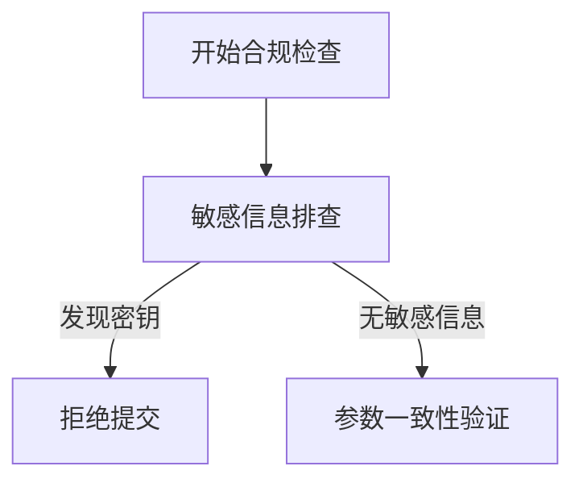
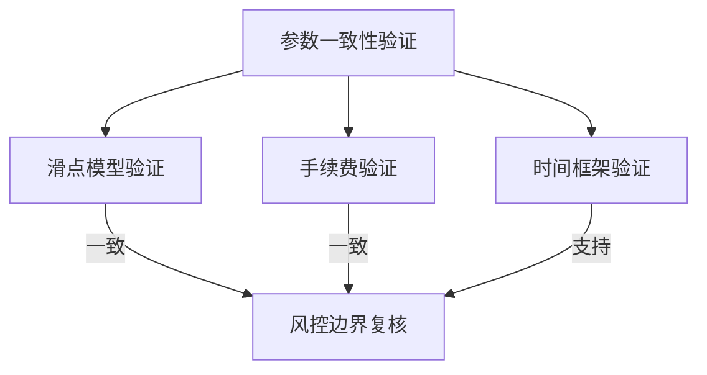
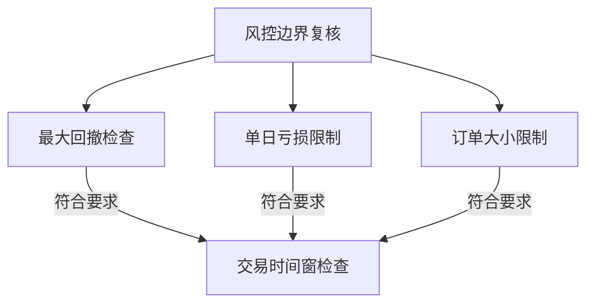
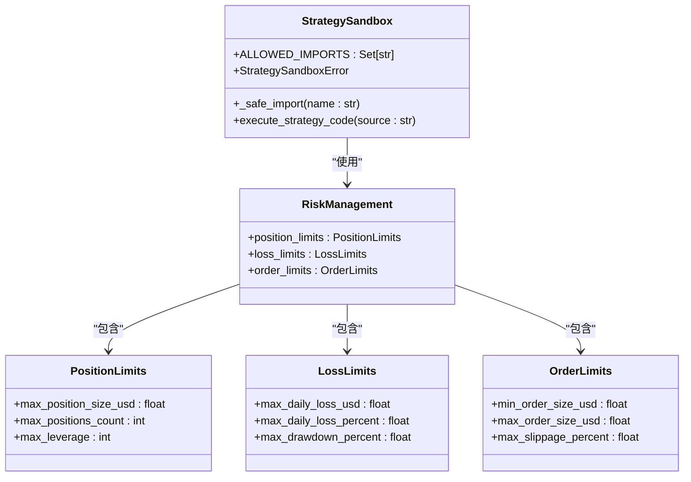
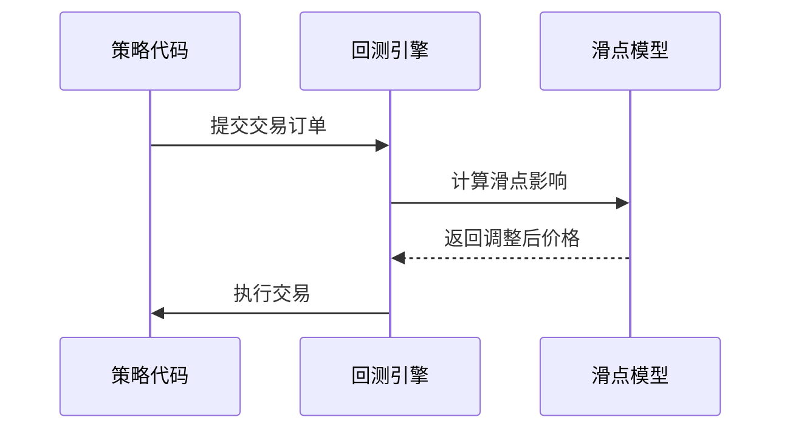
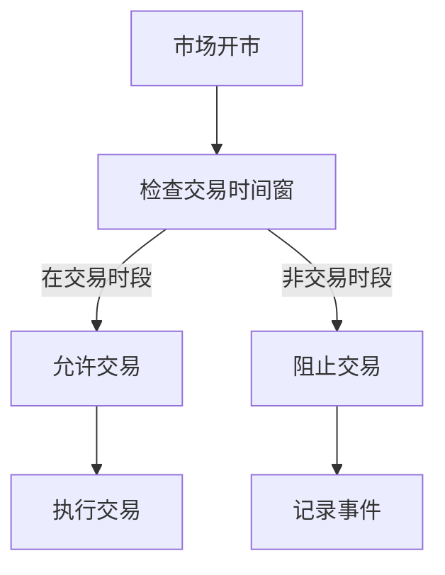
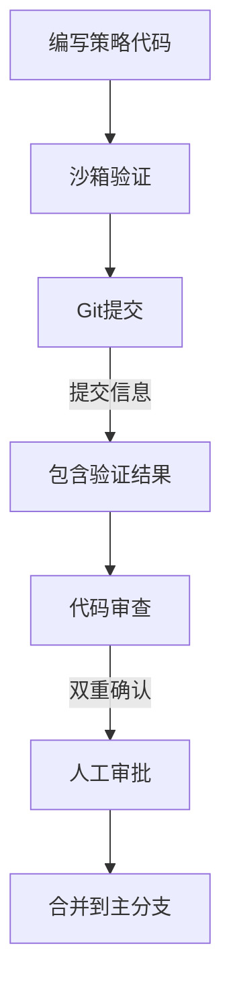
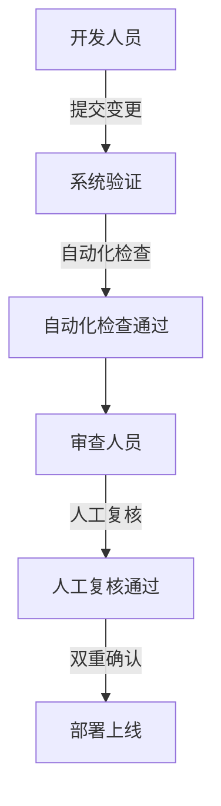

# 合规性验证

<cite>
**本文档引用的文件**
- [strategy.md](file://backend/resources/strategy/strategy.md)
- [feature.md](file://feature.md)
- [config_loader.py](file://backend/src/utils/config_loader.py)
- [broker_config.template.json](file://backend/resources/config/broker_config.template.json)
- [strategy_sandbox.py](file://backend/src/service/strategy_sandbox.py)
- [AGENTS.md](file://AGENTS.md)
- [breakout.py](file://backend/resources/strategy/breakout.py)
- [rsi_reversion.py](file://backend/resources/strategy/rsi_reversion.py)
</cite>

## 目录
1. [引言](#引言)
2. [策略开发合规性框架](#策略开发合规性框架)
3. [人工负责人合规检查清单](#人工负责人合规检查清单)
4. [系统化合规验证机制](#系统化合规验证机制)
5. [策略发布流程与双重确认机制](#策略发布流程与双重确认机制)
6. [结论](#结论)

## 引言
本文件深入阐述了交易策略开发过程中的合规性与安全性验证流程。基于项目中定义的权限责任、变更流程和安全提示，详细说明了在策略发布前必须执行的合规检查。结合风控模块建议，本文档将阐述如何建立系统化的合规验证机制，确保所有策略变更都经过充分测试和人工审批。

## 策略开发合规性框架

项目建立了明确的策略开发合规性框架，通过文档和代码双重保障策略的安全性和可靠性。核心原则包括人工负责制、安全提示和变更流程控制。

**Section sources**
- [strategy.md](file://backend/resources/strategy/strategy.md#L1-L28)
- [AGENTS.md](file://AGENTS.md#L41-L45)

## 人工负责人合规检查清单

人工负责人在策略发布前必须执行严格的合规检查清单，确保策略的安全性和一致性。

### 敏感信息排查
禁止将任何敏感信息提交到代码仓库中。所有真实交易密钥、账户信息或敏感配置必须仅存在于环境变量文件中，不得写入代码库。

**Diagram sources**
- [AGENTS.md](file://AGENTS.md#L43)
- [backend/.env.template](file://backend/.env.template)

**Section sources**
- [AGENTS.md](file://AGENTS.md#L41-L45)

### 交易参数一致性验证
确保回测参数与实盘环境保持一致是保证策略有效性的关键。必须验证滑点、手续费等参数与真实环境一致或明确差异。

**Diagram sources**
- [strategy.md](file://backend/resources/strategy/strategy.md#L22)
- [config_loader.py](file://backend/src/utils/config_loader.py#L65-L67)

**Section sources**
- [strategy.md](file://backend/resources/strategy/strategy.md#L21-L24)
- [config_loader.py](file://backend/src/utils/config_loader.py#L51-L98)

### 风控边界复核
在策略上线前，必须人工复核所有风控边界和触发条件，包括最大回撤、单日交易频率限制和订单大小限制。

**Diagram sources**
- [config_loader.py](file://backend/src/utils/config_loader.py#L58-L60)
- [broker_config.template.json](file://backend/resources/config/broker_config.template.json#L85-L91)

**Section sources**
- [config_loader.py](file://backend/src/utils/config_loader.py#L56-L68)
- [broker_config.template.json](file://backend/resources/config/broker_config.template.json#L85-L91)

## 系统化合规验证机制

为提高合规验证的效率和可靠性，项目建议建立系统化的自动化验证机制。

### 自动化脚本检查
通过自动化脚本检查策略代码中的高风险操作，如禁止导入不安全的模块或执行危险函数。

**Diagram sources**
- [strategy_sandbox.py](file://backend/src/service/strategy_sandbox.py#L16-L33)
- [config_loader.py](file://backend/src/utils/config_loader.py#L49-L74)

**Section sources**
- [strategy_sandbox.py](file://backend/src/service/strategy_sandbox.py#L1-L182)
- [config_loader.py](file://backend/src/utils/config_loader.py#L1-L343)

### 集成滑点模型
为确保回测真实性，必须集成滑点模型，使回测结果更接近实盘表现。

**Diagram sources**
- [config_loader.py](file://backend/src/utils/config_loader.py#L65-L67)
- [broker_config.template.json](file://backend/resources/config/broker_config.template.json#L87-L89)

**Section sources**
- [config_loader.py](file://backend/src/utils/config_loader.py#L63-L68)
- [feature.md](file://feature.md#L6)

### 设置交易时间窗
通过设置交易时间窗防止在非交易时段下单，避免因市场流动性不足导致的异常交易。

**Diagram sources**
- [feature.md](file://feature.md#L6)
- [config_loader.py](file://backend/src/utils/config_loader.py#L77-L85)

**Section sources**
- [feature.md](file://feature.md#L6)
- [config_loader.py](file://backend/src/utils/config_loader.py#L77-L85)

## 策略发布流程与双重确认机制

建立严格的策略发布流程和双重确认机制，确保所有变更都经过充分验证。

### Git提交流程记录
通过Git提交流程记录所有验证结果，确保变更的可追溯性。

**Diagram sources**
- [strategy.md](file://backend/resources/strategy/strategy.md#L16-L19)
- [strategy_sandbox.py](file://backend/src/service/strategy_sandbox.py#L148-L181)

**Section sources**
- [strategy.md](file://backend/resources/strategy/strategy.md#L15-L19)
- [strategy_sandbox.py](file://backend/src/service/strategy_sandbox.py#L148-L181)

### 双重确认机制
实施双重确认机制，确保所有策略变更都经过测试和审批。

**Diagram sources**
- [strategy.md](file://backend/resources/strategy/strategy.md#L5-L8)
- [feature.md](file://feature.md#L11)

**Section sources**
- [strategy.md](file://backend/resources/strategy/strategy.md#L5-L28)
- [feature.md](file://feature.md#L1-L12)

## 结论
通过建立完善的合规性验证流程，包括人工检查清单、系统化验证机制和双重确认流程，可以有效保障交易策略的安全性和可靠性。所有策略变更都必须经过严格的验证和审批，确保符合项目的安全标准和业务要求。