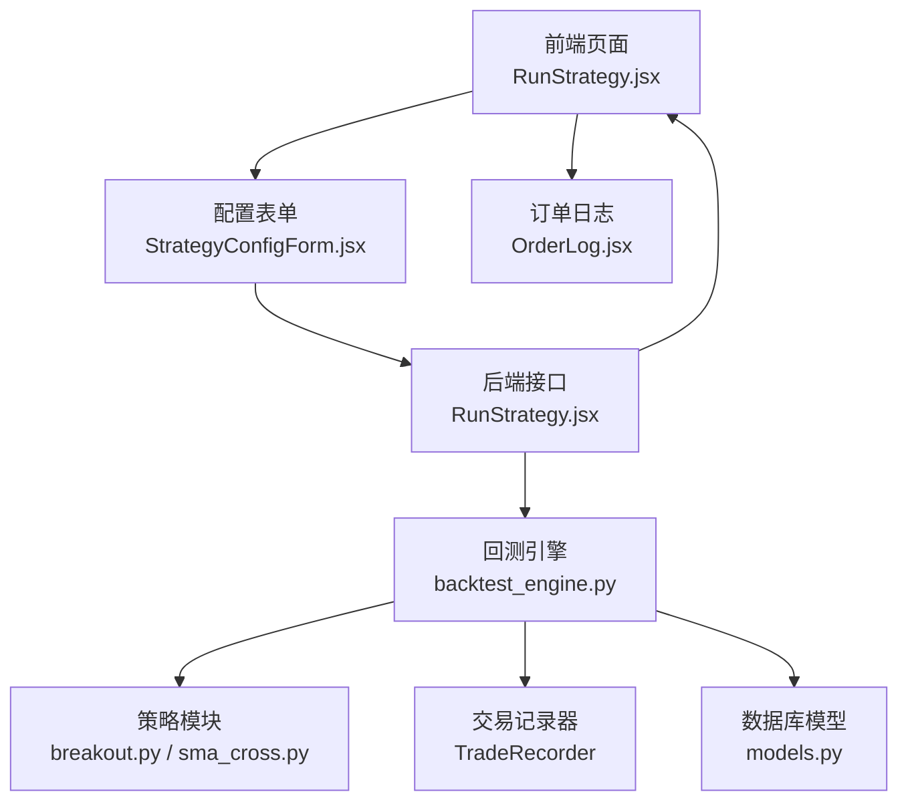
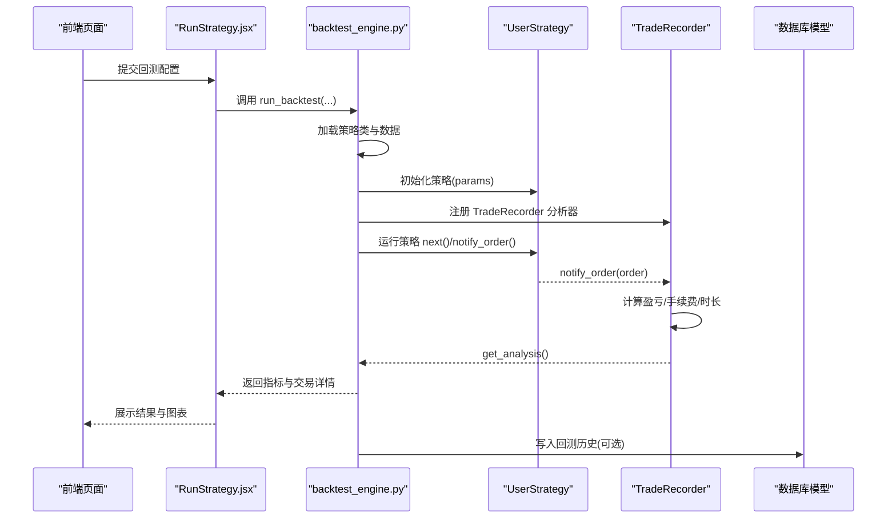
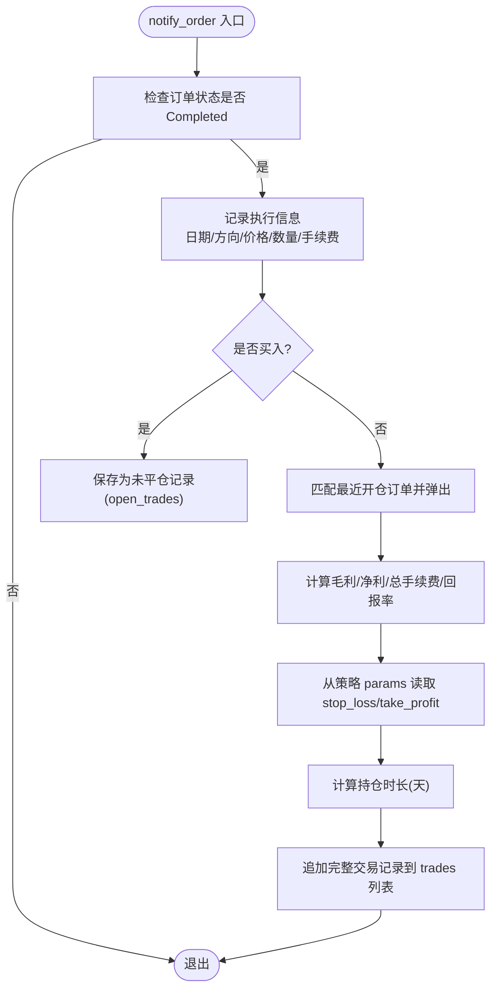
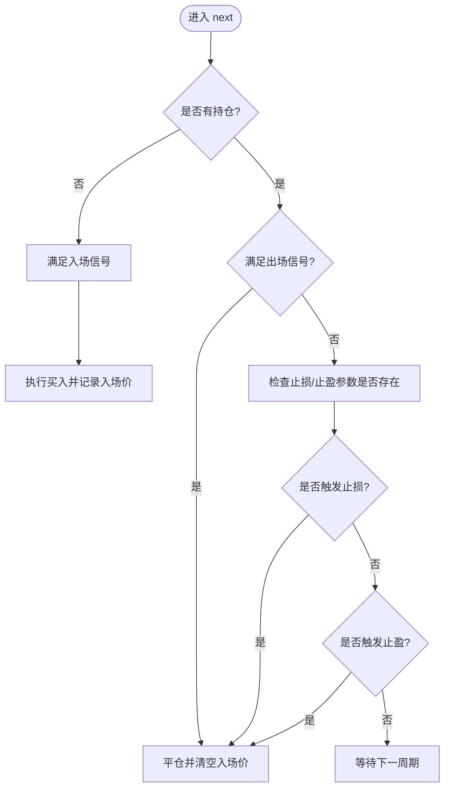
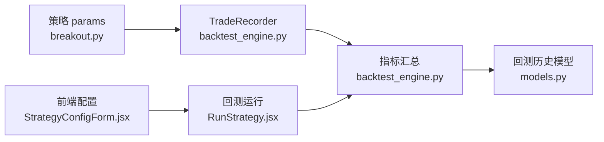

# 止损策略

<cite>
**本文引用的文件**
- [backtest_engine.py](file://backend/src/service/backtest_engine.py)
- [breakout.py](file://backend/resources/strategy/breakout.py)
- [sma_cross.py](file://backend/resources/strategy/sma_cross.py)
- [strategy.md](file://backend/resources/strategy/strategy.md)
- [RunStrategy.jsx](file://frontend/src/pages/RunStrategy.jsx)
- [StrategyConfigForm.jsx](file://frontend/src/components/RunStrategy/StrategyConfigForm.jsx)
- [WalkForwardConfigModal.jsx](file://frontend/src/components/WalkForward/WalkForwardConfigModal.jsx)
- [OrderLog.jsx](file://frontend/src/components/LiveTrading/OrderLog.jsx)
- [ccxt_broker.py](file://backend/src/brokers/ccxt_adapter/ccxt_broker.py)
- [models.py](file://backend/src/db/models.py)
</cite>

## 目录
1. [引言](#引言)
2. [项目结构](#项目结构)
3. [核心组件](#核心组件)
4. [架构总览](#架构总览)
5. [详细组件分析](#详细组件分析)
6. [依赖关系分析](#依赖关系分析)
7. [性能与回测注意事项](#性能与回测注意事项)
8. [故障排查指南](#故障排查指南)
9. [结论](#结论)
10. [附录](#附录)

## 引言
本文件围绕系统中的止损止盈机制展开，重点基于 backtest_engine.py 中的 TradeRecorder 分析器对止损止盈参数的读取逻辑（getattr(self.strategy.params, 'stop_loss', None)），系统性说明如何在策略中定义与应用固定点数止损、移动止损、时间止损等方法；结合 Backtrader 的订单管理与 notify_order 回调，演示如何跟踪订单状态并执行止损逻辑；同时参考 strategy.md 的风控提示，强调在回测中准确模拟滑点与手续费对止损有效性的影响；最后给出基于技术指标（如 ATR）动态调整止损位、多级止盈策略的实现思路，并说明如何利用 TradeRecorder 的交易记录功能评估不同止损策略的表现。

## 项目结构
本项目采用前后端分离架构：
- 后端服务负责策略加载、回测引擎、分析器与数据库持久化；
- 前端提供策略配置、回测运行、图表展示与实时订单日志；
- 策略资源位于 backend/resources/strategy 下，包含示例策略与风控说明。

图示来源
- [RunStrategy.jsx](file://frontend/src/pages/RunStrategy.jsx#L70-L105)
- [StrategyConfigForm.jsx](file://frontend/src/components/RunStrategy/StrategyConfigForm.jsx#L1-L189)
- [backtest_engine.py](file://backend/src/service/backtest_engine.py#L180-L272)
- [breakout.py](file://backend/resources/strategy/breakout.py#L1-L32)
- [sma_cross.py](file://backend/resources/strategy/sma_cross.py#L1-L19)
- [models.py](file://backend/src/db/models.py#L257-L316)
- [OrderLog.jsx](file://frontend/src/components/LiveTrading/OrderLog.jsx#L1-L138)

章节来源
- [RunStrategy.jsx](file://frontend/src/pages/RunStrategy.jsx#L70-L105)
- [StrategyConfigForm.jsx](file://frontend/src/components/RunStrategy/StrategyConfigForm.jsx#L1-L189)
- [backtest_engine.py](file://backend/src/service/backtest_engine.py#L180-L272)

## 核心组件
- TradeRecorder 分析器：在订单完成时记录开平仓细节、手续费、盈亏、持仓时长，并从策略 params 读取 stop_loss 与 take_profit 参数用于统计分析。
- 回测引擎 run_backtest：组装策略、数据源、分析器与绘图，最终输出包含 TradeRecorder 细节在内的指标集合。
- 示例策略 breakout.py：展示了如何在 params 中定义 stop_loss 与 take_profit，并在 next 中按固定比例触发止损/止盈。
- 前端配置与可视化：提供初始资金、手续费、下单数量等回测参数输入，以及交易记录与订单日志展示。

章节来源
- [backtest_engine.py](file://backend/src/service/backtest_engine.py#L99-L178)
- [backtest_engine.py](file://backend/src/service/backtest_engine.py#L180-L272)
- [breakout.py](file://backend/resources/strategy/breakout.py#L1-L32)
- [strategy.md](file://backend/resources/strategy/strategy.md#L1-L28)
- [RunStrategy.jsx](file://frontend/src/pages/RunStrategy.jsx#L70-L105)
- [StrategyConfigForm.jsx](file://frontend/src/components/RunStrategy/StrategyConfigForm.jsx#L1-L189)

## 架构总览
下图展示回测执行的关键流程：前端发起回测请求，后端加载策略、添加 TradeRecorder 分析器，Cerebro 运行策略并回调 notify_order，TradeRecorder 在订单完成时记录交易细节，最终汇总指标返回前端。

图示来源
- [RunStrategy.jsx](file://frontend/src/pages/RunStrategy.jsx#L70-L105)
- [backtest_engine.py](file://backend/src/service/backtest_engine.py#L180-L272)
- [breakout.py](file://backend/resources/strategy/breakout.py#L1-L32)

## 详细组件分析

### TradeRecorder 分析器与止损止盈参数读取
- 订单完成回调：当 order.status 为 Completed 时，记录开仓/平仓的日期、方向、成交价、成交量、成交额与手续费。
- 开仓与平仓配对：以 ref 作为键追踪未平仓交易，平仓时弹出对应开仓记录并计算毛利/净利、总手续费与回报率。
- 止损止盈参数读取：通过 getattr(self.strategy.params, 'stop_loss', None) 与 getattr(self.strategy.params, 'take_profit', None) 从策略 params 读取规则，用于后续统计维度。
- 持仓时长计算：基于开仓与平仓日期差计算天数，便于评估持有周期与策略表现。

图示来源
- [backtest_engine.py](file://backend/src/service/backtest_engine.py#L114-L178)

章节来源
- [backtest_engine.py](file://backend/src/service/backtest_engine.py#L99-L178)

### 策略中定义与应用止损止盈
- 固定点数止损：在 params 中定义 stop_loss（例如 0.05 表示 5%），在 next 中根据当前价格与入场价比较触发平仓。
- 固定点数止盈：在 params 中定义 take_profit（例如 0.1 表示 10%），在 next 中根据当前价格与入场价比较触发平仓。
- 示例策略：breakout.py 展示了上述两种规则的组合使用，同时保留了 entry_price 以便在止盈/止损触发后清空。

图示来源
- [breakout.py](file://backend/resources/strategy/breakout.py#L1-L32)

章节来源
- [breakout.py](file://backend/resources/strategy/breakout.py#L1-L32)

### 移动止损与时间止损的实现思路
- 移动止损（追踪止损）：在 params 中定义 trail_points 或 trail_percent，结合策略内部的最高价/最低价或移动窗口，动态更新止损位。当价格朝有利方向变动时，止损位随之上移（多头）或下移（空头），若价格反向达到止损位则触发平仓。
- 时间止损：在 params 中定义 max_holding_days，结合 TradeRecorder 记录的 open_date/close_date 计算持仓天数，超过阈值即强制平仓。
- 多级止盈：在 params 中定义多个 take_profit_level（如两级止盈目标），在每次价格触及更高目标时部分平仓，剩余仓位继续持有直至更大目标或止损触发。

说明：以上为实现思路与最佳实践建议，具体实现需在策略的 next 中根据指标与状态机逻辑进行扩展。

### 基于技术指标（如 ATR）动态调整止损位
- 使用 ATR 计算波动幅度，将止损设置为入场价 ± N × ATR，N 为倍数因子。
- 随着 ATR 的变化动态调整止损位，避免固定点数在震荡市中过早触发。
- 结合趋势指标（如均线）过滤方向，避免逆势止损。

### 回测中滑点与手续费对止损有效性的影响
- 滑点：实际成交价可能偏离委托价，导致止损/止盈提前或延后触发，影响净收益与胜率。
- 手续费：双向手续费叠加会侵蚀利润，尤其在高频或窄幅震荡策略中显著降低策略净收益。
- 建议：在回测配置中设置合理的 commission（百分比）与可选的 slippage（点数或比例），并与真实环境保持一致，以便更准确评估策略表现。

章节来源
- [strategy.md](file://backend/resources/strategy/strategy.md#L20-L28)

### 订单管理与 notify_order 回调
- Backtrader 通过 notify_order 回调通知订单状态变化，TradeRecorder 在 Completed 时记录交易细节。
- 实盘/纸交易中，Broker 层会将成交回报给策略与分析器，确保 TradeRecorder 能正确统计每笔交易的成交价、手续费与时间戳。

章节来源
- [backtest_engine.py](file://backend/src/service/backtest_engine.py#L114-L178)
- [ccxt_broker.py](file://backend/src/brokers/ccxt_adapter/ccxt_broker.py#L159-L203)
- [ccxt_broker.py](file://backend/src/brokers/ccxt_adapter/ccxt_broker.py#L391-L462)

### 交易记录与策略表现评估
- TradeRecorder 输出 trades 列表与汇总指标（总交易数、胜/负次数、总/平均净收益等），可用于对比不同止损策略的稳定性与盈利能力。
- 前端页面 RunStrategy.jsx 从后端指标中提取 trade_details 并展示，便于直观评估策略效果。

章节来源
- [backtest_engine.py](file://backend/src/service/backtest_engine.py#L168-L178)
- [RunStrategy.jsx](file://frontend/src/pages/RunStrategy.jsx#L70-L105)

## 依赖关系分析
- TradeRecorder 依赖策略 params 中的 stop_loss 与 take_profit 字段，用于统计维度标注。
- 回测引擎 run_backtest 将 TradeRecorder 注册为分析器，统一收集交易数据。
- 前端通过配置表单传入 initial_cash、commission、stake 等参数，影响回测结果与 TradeRecorder 的收益计算口径。
- 数据库模型 models.py 用于持久化回测历史与优化结果，便于长期对比与审计。

图示来源
- [breakout.py](file://backend/resources/strategy/breakout.py#L1-L32)
- [backtest_engine.py](file://backend/src/service/backtest_engine.py#L180-L272)
- [StrategyConfigForm.jsx](file://frontend/src/components/RunStrategy/StrategyConfigForm.jsx#L1-L189)
- [RunStrategy.jsx](file://frontend/src/pages/RunStrategy.jsx#L70-L105)
- [models.py](file://backend/src/db/models.py#L257-L316)

章节来源
- [backtest_engine.py](file://backend/src/service/backtest_engine.py#L180-L272)
- [StrategyConfigForm.jsx](file://frontend/src/components/RunStrategy/StrategyConfigForm.jsx#L1-L189)
- [RunStrategy.jsx](file://frontend/src/pages/RunStrategy.jsx#L70-L105)
- [models.py](file://backend/src/db/models.py#L257-L316)

## 性能与回测注意事项
- 回测参数一致性：确保 commission 与滑点设置与真实环境一致，避免回测与实盘偏差过大。
- 指标计算成本：复杂指标（如 ATR）在高频数据上会增加计算开销，建议在策略中缓存必要中间值。
- TradeRecorder 统计口径：注意手续费与滑点对净收益的影响，避免仅看毛利而忽略交易成本。
- 前端渲染：回测图表绘制在后端执行，避免在本地弹窗干扰，已通过非交互模式输出图像。

章节来源
- [strategy.md](file://backend/resources/strategy/strategy.md#L20-L28)
- [backtest_engine.py](file://backend/src/service/backtest_engine.py#L180-L272)

## 故障排查指南
- 策略加载失败：检查策略文件是否存在、UserStrategy 类是否继承自 bt.Strategy，以及策略名称是否符合命名规范。
- 未产生交易记录：确认策略确实有开仓/平仓动作，且订单状态为 Completed；检查 TradeRecorder 是否被注册。
- 止损/止盈未生效：确认 params 中已正确设置 stop_loss 与 take_profit；检查策略逻辑中是否在 next 中触发了平仓。
- 实盘订单状态：可通过前端订单日志组件 OrderLog.jsx 查看实时状态与填充进度，定位网络/交易所延迟问题。

章节来源
- [backtest_engine.py](file://backend/src/service/backtest_engine.py#L73-L96)
- [OrderLog.jsx](file://frontend/src/components/LiveTrading/OrderLog.jsx#L1-L138)

## 结论
通过 TradeRecorder 对止损止盈参数的读取与交易记录的统计，系统能够有效评估不同止损策略在回测中的表现。结合 Backtrader 的订单管理与 notify_order 回调，策略可以灵活实现固定点数止损、移动止损、时间止损与多级止盈等多样化风控手段。在回测中准确模拟滑点与手续费，有助于提升策略在真实市场中的稳健性与胜率。建议在策略设计阶段明确风控边界，并通过 TradeRecorder 的交易明细与汇总指标持续迭代优化。

## 附录
- 回测参数配置入口（前端）：StrategyConfigForm.jsx、WalkForwardConfigModal.jsx
- 回测运行入口（后端）：RunStrategy.jsx
- 回测引擎与分析器：backtest_engine.py
- 示例策略：breakout.py、sma_cross.py
- 风控提示：strategy.md
- 实盘订单日志：OrderLog.jsx
- Broker 订单流转：ccxt_broker.py
- 回测历史模型：models.py