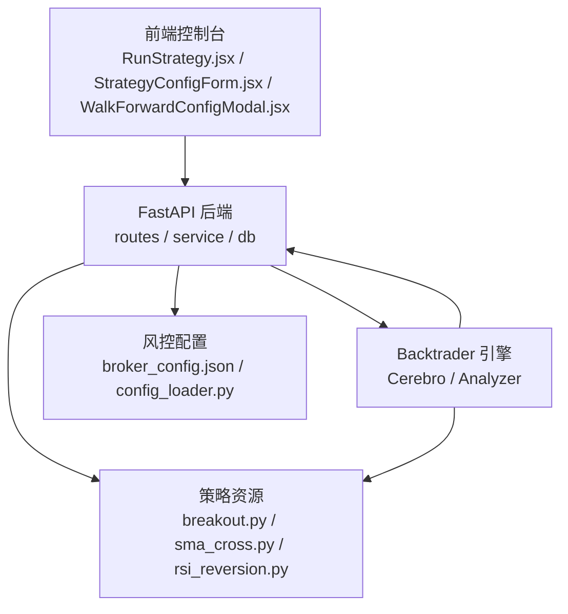
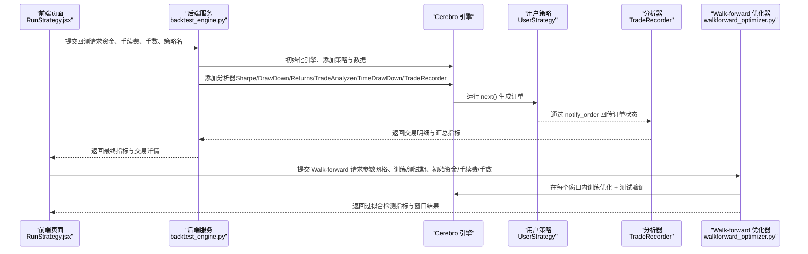
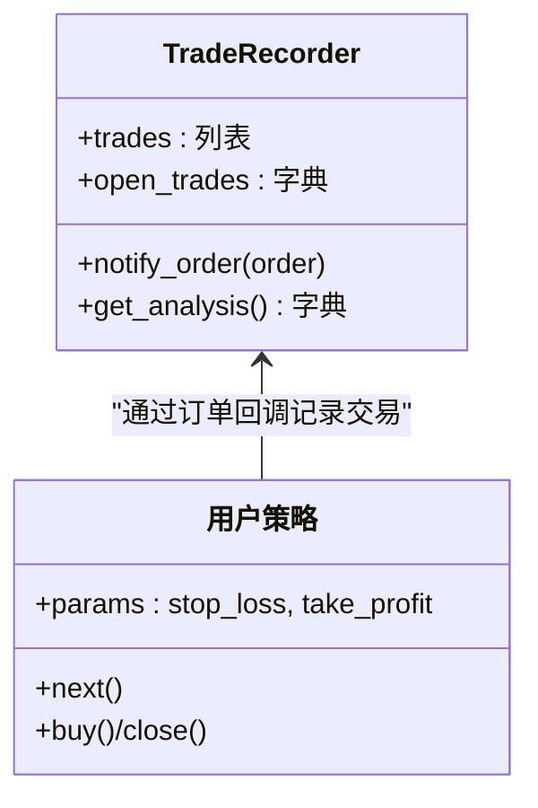
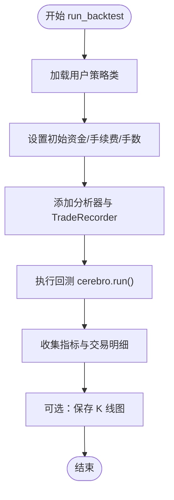
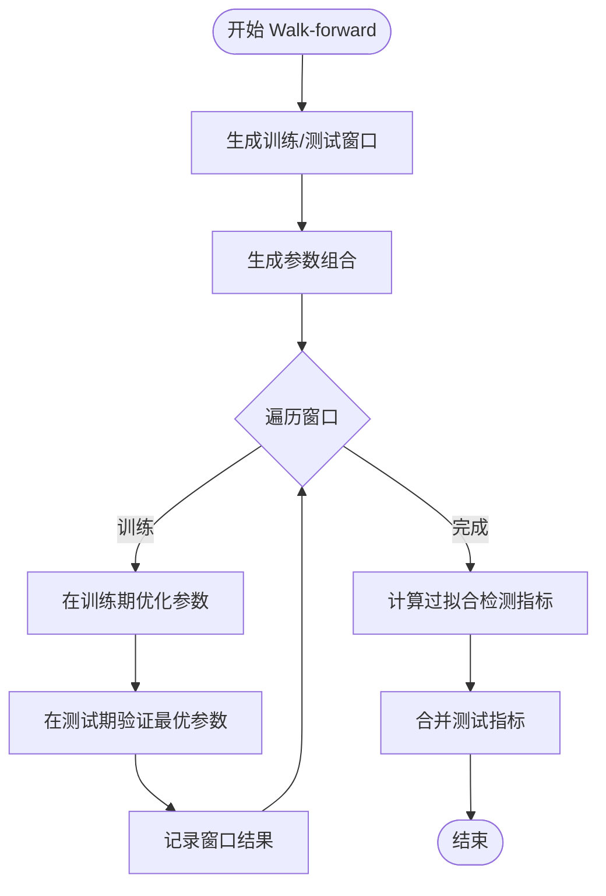
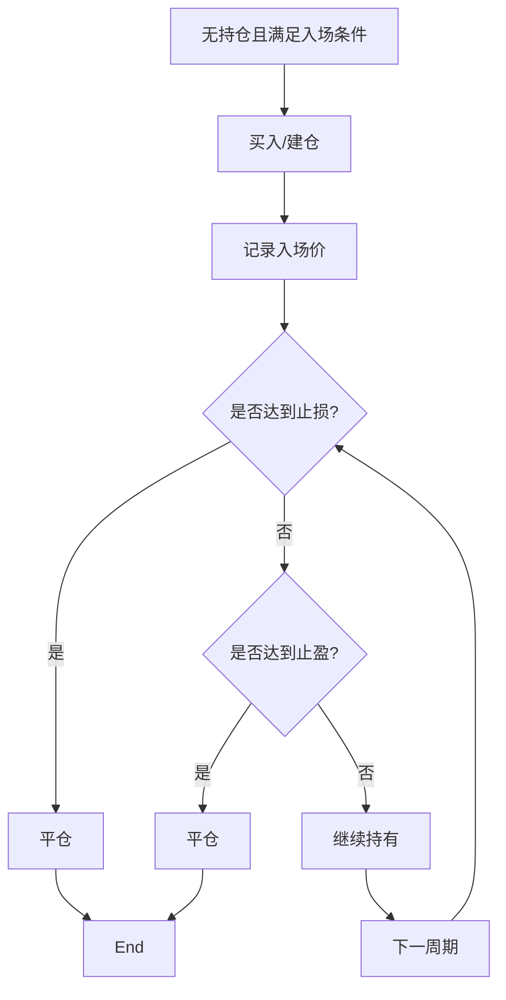
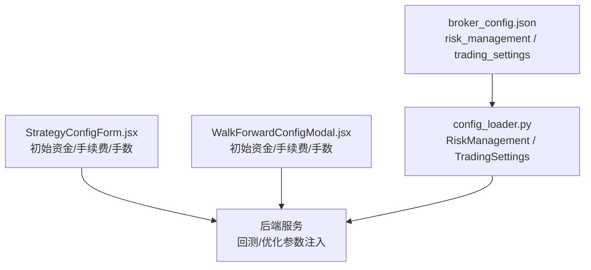
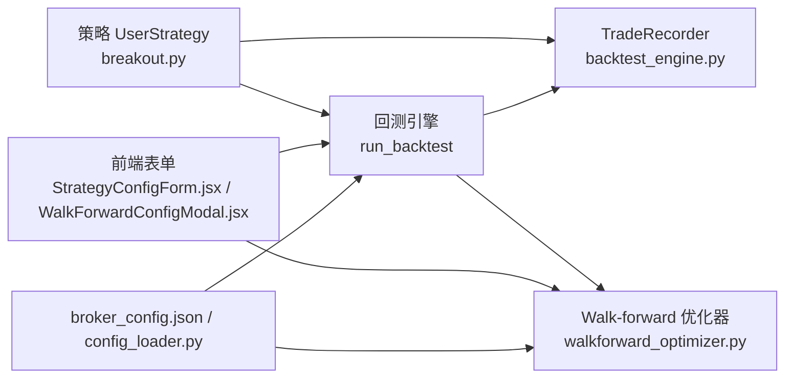

# 策略风险控制

<cite>
**本文引用的文件**
- [feature.md](file://feature.md)
- [strategy.md](file://backend/src/resources/strategy/strategy.md)
- [backtest_engine.py](file://backend/src/service/backtest_engine.py)
- [walkforward_optimizer.py](file://backend/src/service/walkforward_optimizer.py)
- [walkforward_storage.py](file://backend/src/db/walkforward_storage.py)
- [breakout.py](file://backend/resources/strategy/breakout.py)
- [sma_cross.py](file://backend/resources/strategy/sma_cross.py)
- [rsi_reversion.py](file://backend/resources/strategy/rsi_reversion.py)
- [broker_config.json](file://backend/resources/config/broker_config.json)
- [config_loader.py](file://backend/src/utils/config_loader.py)
- [StrategyConfigForm.jsx](file://frontend/src/components/RunStrategy/StrategyConfigForm.jsx)
- [RunStrategy.jsx](file://frontend/src/pages/RunStrategy.jsx)
- [WalkForwardConfigModal.jsx](file://frontend/src/components/WalkForward/WalkForwardConfigModal.jsx)
</cite>

## 目录
1. [引言](#引言)
2. [项目结构](#项目结构)
3. [核心组件](#核心组件)
4. [架构总览](#架构总览)
5. [详细组件分析](#详细组件分析)
6. [依赖关系分析](#依赖关系分析)
7. [性能考量](#性能考量)
8. [故障排查指南](#故障排查指南)
9. [结论](#结论)
10. [附录](#附录)

## 引言
本文件系统性阐述策略开发中的风险控制机制，围绕以下目标展开：
- 在策略代码中实现有效的资金管理（仓位大小、风险预算）
- 实现止损止盈逻辑（固定点数、移动止损、时间止损）
- 结合 TradeRecorder 分析器记录每笔交易的盈亏、手续费与持仓时长，用于事后风险评估
- 参考风控模块建议，集成滑点模型、交易时间窗控制与最大回撤限制
- 在回测与实盘环境保持一致的风险参数设置
- 提供防止过度拟合的实践（Walk-forward 分析与多时间段验证）

## 项目结构
后端采用 FastAPI + Backtrader 架构，前端提供多语言控制台，支持策略运行、回测历史、实盘/纸盘桥接与 Walk-forward 优化。风险控制相关能力主要体现在：
- 策略模板与示例策略（含止损止盈参数）
- 自定义分析器 TradeRecorder（记录交易细节）
- 回测引擎与 Walk-forward 优化器（参数优化、过拟合检测）
- 风控配置（位置限额、损失限额、订单限额等）
- 前端表单与页面（资金、手续费、手数等输入项）

图表来源
- [RunStrategy.jsx](file://frontend/src/pages/RunStrategy.jsx#L70-L105)
- [StrategyConfigForm.jsx](file://frontend/src/components/RunStrategy/StrategyConfigForm.jsx#L1-L189)
- [WalkForwardConfigModal.jsx](file://frontend/src/components/WalkForward/WalkForwardConfigModal.jsx#L275-L299)
- [backtest_engine.py](file://backend/src/service/backtest_engine.py#L180-L272)
- [walkforward_optimizer.py](file://backend/src/service/walkforward_optimizer.py#L1-L538)
- [broker_config.json](file://backend/resources/config/broker_config.json#L85-L130)
- [config_loader.py](file://backend/src/utils/config_loader.py#L51-L98)

章节来源
- [feature.md](file://feature.md#L1-L12)
- [backtest_engine.py](file://backend/src/service/backtest_engine.py#L180-L272)
- [walkforward_optimizer.py](file://backend/src/service/walkforward_optimizer.py#L1-L538)
- [broker_config.json](file://backend/resources/config/broker_config.json#L85-L130)

## 核心组件
- 自定义分析器 TradeRecorder：记录每笔交易的开仓/平仓时间、价格、数量、手续费、净盈亏、收益率与持仓时长；汇总总交易数、胜率、总净盈亏等指标。
- 回测引擎 run_backtest：加载用户策略、添加分析器、运行回测并返回指标与交易明细。
- Walk-forward 优化器：按训练/测试窗口滚动优化参数，计算过拟合检测指标（训练-测试相关性、平均退化百分比、一致性评分等）。
- 风控配置：位置限额、损失限额、订单限额、交易时间窗与滑点模型建议。
- 策略示例：breakout.py 展示了固定点数止损止盈参数与逻辑；sma_cross.py、rsi_reversion.py 展示基础入场/出场条件。

章节来源
- [backtest_engine.py](file://backend/src/service/backtest_engine.py#L99-L178)
- [backtest_engine.py](file://backend/src/service/backtest_engine.py#L180-L272)
- [walkforward_optimizer.py](file://backend/src/service/walkforward_optimizer.py#L1-L538)
- [broker_config.json](file://backend/resources/config/broker_config.json#L85-L130)
- [breakout.py](file://backend/resources/strategy/breakout.py#L1-L32)
- [sma_cross.py](file://backend/resources/strategy/sma_cross.py#L1-L19)
- [rsi_reversion.py](file://backend/resources/strategy/rsi_reversion.py#L1-L18)

## 架构总览
下图展示了从前端到后端、再到 Backtrader 引擎与策略的调用链路，以及风控配置与 Walk-forward 优化的集成方式。

图表来源
- [RunStrategy.jsx](file://frontend/src/pages/RunStrategy.jsx#L70-L105)
- [backtest_engine.py](file://backend/src/service/backtest_engine.py#L180-L272)
- [walkforward_optimizer.py](file://backend/src/service/walkforward_optimizer.py#L181-L273)

## 详细组件分析

### 组件一：TradeRecorder 分析器
TradeRecorder 记录每笔交易的完整生命周期，包括开仓/平仓时间与价格、数量、手续费、净盈亏、收益率与持仓时长，并汇总统计指标。该分析器在回测完成后通过 get_analysis 返回交易明细与汇总。

图表来源
- [backtest_engine.py](file://backend/src/service/backtest_engine.py#L99-L178)

章节来源
- [backtest_engine.py](file://backend/src/service/backtest_engine.py#L99-L178)

### 组件二：回测引擎 run_backtest
回测引擎负责：
- 加载用户策略类
- 设置初始资金、手续费、固定手数
- 添加多个分析器（夏普比率、最大回撤、收益、SQN、交易分析、时间回撤）与 TradeRecorder
- 运行回测并提取指标与交易明细

图表来源
- [backtest_engine.py](file://backend/src/service/backtest_engine.py#L180-L272)

章节来源
- [backtest_engine.py](file://backend/src/service/backtest_engine.py#L180-L272)

### 组件三：Walk-forward 优化器
Walk-forward 优化器通过滚动窗口在训练期内进行参数优化，在测试期内验证最优参数表现，从而检测过拟合风险。其输出包含：
- 每个窗口的最佳参数与训练/测试指标
- 过拟合检测指标（训练-测试相关性、平均退化百分比、一致性评分、退化标准差）
- 跨窗口合并的测试指标（总收益、平均夏普、平均最大回撤、总交易数、胜率等）

图表来源
- [walkforward_optimizer.py](file://backend/src/service/walkforward_optimizer.py#L116-L159)
- [walkforward_optimizer.py](file://backend/src/service/walkforward_optimizer.py#L161-L179)
- [walkforward_optimizer.py](file://backend/src/service/walkforward_optimizer.py#L274-L319)
- [walkforward_optimizer.py](file://backend/src/service/walkforward_optimizer.py#L321-L339)
- [walkforward_optimizer.py](file://backend/src/service/walkforward_optimizer.py#L395-L417)
- [walkforward_optimizer.py](file://backend/src/service/walkforward_optimizer.py#L419-L494)
- [walkforward_optimizer.py](file://backend/src/service/walkforward_optimizer.py#L495-L531)

章节来源
- [walkforward_optimizer.py](file://backend/src/service/walkforward_optimizer.py#L1-L538)

### 组件四：策略示例与止损止盈逻辑
- breakout.py 展示了通过策略参数 stop_loss 与 take_profit 实现固定点数止损止盈，并在入场后跟踪入场价以触发止盈/止损。
- sma_cross.py 与 rsi_reversion.py 展示基础入场/出场条件，可作为风控策略的信号基础。

图表来源
- [breakout.py](file://backend/resources/strategy/breakout.py#L1-L32)

章节来源
- [breakout.py](file://backend/resources/strategy/breakout.py#L1-L32)
- [sma_cross.py](file://backend/resources/strategy/sma_cross.py#L1-L19)
- [rsi_reversion.py](file://backend/resources/strategy/rsi_reversion.py#L1-L18)

### 组件五：风控配置与参数输入
- broker_config.json 中定义了位置限额、损失限额、订单限额与交易设置，为实盘/纸盘桥接提供统一风控参数。
- 前端表单支持初始资金、手续费、手数等输入，确保回测与实盘参数一致。

图表来源
- [broker_config.json](file://backend/resources/config/broker_config.json#L85-L130)
- [config_loader.py](file://backend/src/utils/config_loader.py#L51-L98)
- [StrategyConfigForm.jsx](file://frontend/src/components/RunStrategy/StrategyConfigForm.jsx#L1-L189)
- [WalkForwardConfigModal.jsx](file://frontend/src/components/WalkForward/WalkForwardConfigModal.jsx#L275-L299)

章节来源
- [broker_config.json](file://backend/resources/config/broker_config.json#L85-L130)
- [config_loader.py](file://backend/src/utils/config_loader.py#L51-L98)
- [StrategyConfigForm.jsx](file://frontend/src/components/RunStrategy/StrategyConfigForm.jsx#L1-L189)
- [WalkForwardConfigModal.jsx](file://frontend/src/components/WalkForward/WalkForwardConfigModal.jsx#L275-L299)

## 依赖关系分析
- TradeRecorder 依赖策略参数（如 stop_loss、take_profit）与订单回调，用于识别开仓/平仓并计算净盈亏与持仓时长。
- 回测引擎依赖 TradeRecorder 与其他分析器，统一输出指标与交易明细。
- Walk-forward 优化器依赖回测引擎，按窗口重复运行回测以检测过拟合。
- 前端表单将用户输入（初始资金、手续费、手数）传递给后端，保证回测与实盘参数一致。

图表来源
- [backtest_engine.py](file://backend/src/service/backtest_engine.py#L99-L178)
- [backtest_engine.py](file://backend/src/service/backtest_engine.py#L180-L272)
- [walkforward_optimizer.py](file://backend/src/service/walkforward_optimizer.py#L181-L273)
- [broker_config.json](file://backend/resources/config/broker_config.json#L85-L130)
- [config_loader.py](file://backend/src/utils/config_loader.py#L51-L98)
- [StrategyConfigForm.jsx](file://frontend/src/components/RunStrategy/StrategyConfigForm.jsx#L1-L189)
- [WalkForwardConfigModal.jsx](file://frontend/src/components/WalkForward/WalkForwardConfigModal.jsx#L275-L299)

章节来源
- [backtest_engine.py](file://backend/src/service/backtest_engine.py#L99-L178)
- [backtest_engine.py](file://backend/src/service/backtest_engine.py#L180-L272)
- [walkforward_optimizer.py](file://backend/src/service/walkforward_optimizer.py#L181-L273)
- [broker_config.json](file://backend/resources/config/broker_config.json#L85-L130)
- [config_loader.py](file://backend/src/utils/config_loader.py#L51-L98)
- [StrategyConfigForm.jsx](file://frontend/src/components/RunStrategy/StrategyConfigForm.jsx#L1-L189)
- [WalkForwardConfigModal.jsx](file://frontend/src/components/WalkForward/WalkForwardConfigModal.jsx#L275-L299)

## 性能考量
- 回测性能：TradeRecorder 仅在订单完成时记录，避免在 next 中频繁计算；Walk-forward 优化器对参数组合与窗口数量敏感，应合理设置参数网格与窗口长度。
- 存储与查询：Walk-forward 结果存储于数据库，提供分页、过滤与排序能力，便于大规模结果检索与可视化。
- 前端渲染：回测图输出为静态图片，避免本地弹窗与阻塞，适合在 API 调用中批量生成。

章节来源
- [backtest_engine.py](file://backend/src/service/backtest_engine.py#L180-L272)
- [walkforward_storage.py](file://backend/src/db/walkforward_storage.py#L238-L308)

## 故障排查指南
- 策略加载失败：检查策略文件是否存在、类名是否为 UserStrategy、是否继承自 backtrader.Strategy。
- 回测异常：查看回测引擎日志，确认数据源可用、参数合法、分析器正常注册。
- Walk-forward 失败：检查窗口生成逻辑、参数组合数量、数据库连接与权限。
- 风控配置错误：核对 broker_config.json 的字段类型与范围，确保与 config_loader.py 的校验一致。

章节来源
- [backtest_engine.py](file://backend/src/service/backtest_engine.py#L59-L96)
- [walkforward_optimizer.py](file://backend/src/service/walkforward_optimizer.py#L356-L417)
- [config_loader.py](file://backend/src/utils/config_loader.py#L51-L98)

## 结论
本系统通过 TradeRecorder、回测引擎与 Walk-forward 优化器实现了从交易层面到参数层面的全链路风险控制与过拟合检测。配合 broker_config.json 的统一风控参数与前端表单的一致性输入，可在回测与实盘环境中保持一致的风险约束。建议在策略开发中：
- 明确资金管理与止损止盈参数（固定点数/移动止损/时间止损）
- 使用 TradeRecorder 记录并复盘每笔交易
- 采用 Walk-forward 与多时间段验证防止过度拟合
- 在实盘前充分进行纸盘测试与风控参数校准

## 附录

### 风险控制机制清单（策略侧）
- 资金管理
  - 固定手数：通过回测引擎与前端表单设置 stake，确保回测与实盘一致
  - 风险预算：结合 broker_config.json 的损失限额与订单限额，控制单日/累计回撤与订单规模
- 止损止盈
  - 固定点数止损止盈：在策略参数中设置 stop_loss/take_profit，结合入场价触发
  - 移动止损：可在策略中根据技术指标动态调整止损位
  - 时间止损：在策略 next 中增加时间维度判断，避免长期挂单
- 交易频率限制
  - 通过策略内部状态变量限制连续开仓频率（例如只在特定信号出现时开仓）
  - 通过 broker_config.json 的订单限额与交易设置，限制最小/最大订单规模与滑点容忍度

章节来源
- [breakout.py](file://backend/resources/strategy/breakout.py#L1-L32)
- [broker_config.json](file://backend/resources/config/broker_config.json#L85-L130)
- [StrategyConfigForm.jsx](file://frontend/src/components/RunStrategy/StrategyConfigForm.jsx#L1-L189)
- [WalkForwardConfigModal.jsx](file://frontend/src/components/WalkForward/WalkForwardConfigModal.jsx#L275-L299)

### 交易记录与分析要点（TradeRecorder）
- 记录内容：开仓/平仓日期与价格、数量、手续费、总/净盈亏、收益率、持仓时长
- 汇总指标：总交易数、胜/负交易数、总净盈亏、平均净盈亏
- 应用场景：事后风险评估、交易行为复盘、参数敏感性分析

章节来源
- [backtest_engine.py](file://backend/src/service/backtest_engine.py#L99-L178)

### Walk-forward 分析与过拟合检测
- 训练期优化：在训练窗口内对参数组合进行回测，选择优化指标（如夏普比率、总收益、利润因子）对应的最佳参数
- 测试期验证：在测试窗口内验证上一步选出的最佳参数，比较训练与测试表现
- 过拟合检测指标：训练-测试相关性、平均退化百分比、一致性评分、退化标准差
- 合并测试指标：跨窗口汇总总收益、平均夏普、平均最大回撤、总交易数与胜率

章节来源
- [walkforward_optimizer.py](file://backend/src/service/walkforward_optimizer.py#L116-L159)
- [walkforward_optimizer.py](file://backend/src/service/walkforward_optimizer.py#L161-L179)
- [walkforward_optimizer.py](file://backend/src/service/walkforward_optimizer.py#L274-L319)
- [walkforward_optimizer.py](file://backend/src/service/walkforward_optimizer.py#L321-L339)
- [walkforward_optimizer.py](file://backend/src/service/walkforward_optimizer.py#L395-L417)
- [walkforward_optimizer.py](file://backend/src/service/walkforward_optimizer.py#L419-L494)
- [walkforward_optimizer.py](file://backend/src/service/walkforward_optimizer.py#L495-L531)

### 回测与实盘一致性建议
- 参数一致性：前端表单与 Walk-forward 配置中的初始资金、手续费、手数需与 broker_config.json 的风控参数一致
- 滑点与手续费：在回测中设置合理的 commission 与滑点模型（建议在策略中预留滑点参数），并在实盘中保持一致
- 交易时间窗：通过 broker_config.json 的交易设置与策略内部的时间窗判断，避免非交易时段下单
- 最大回撤限制：在 broker_config.json 中设置 max_drawdown_percent，并在策略中结合时间止损与移动止损降低回撤

章节来源
- [broker_config.json](file://backend/resources/config/broker_config.json#L85-L130)
- [config_loader.py](file://backend/src/utils/config_loader.py#L51-L98)
- [StrategyConfigForm.jsx](file://frontend/src/components/RunStrategy/StrategyConfigForm.jsx#L1-L189)
- [WalkForwardConfigModal.jsx](file://frontend/src/components/WalkForward/WalkForwardConfigModal.jsx#L275-L299)