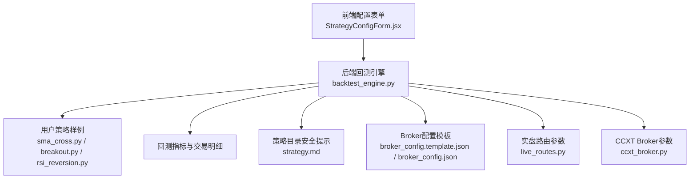
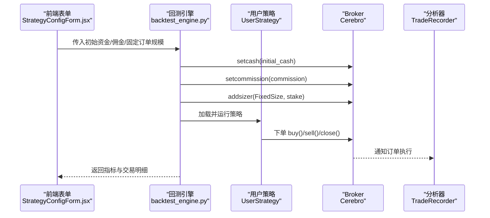
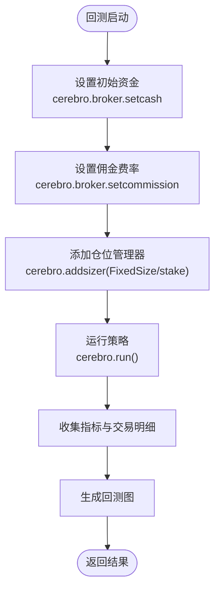
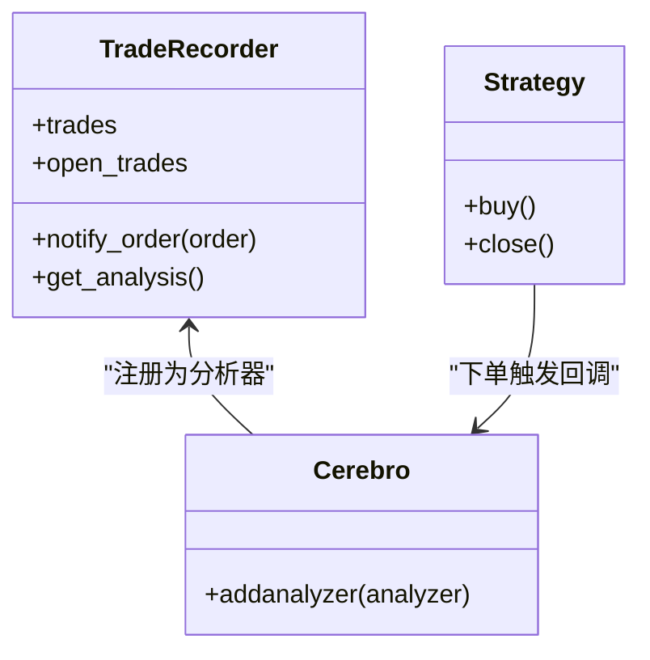
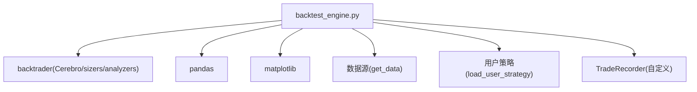

# 资金管理

<cite>
**本文引用的文件**
- [backtest_engine.py](file://backend/src/service/backtest_engine.py)
- [strategy.md](file://backend/resources/strategy/strategy.md)
- [sma_cross.py](file://backend/resources/strategy/sma_cross.py)
- [breakout.py](file://backend/resources/strategy/breakout.py)
- [rsi_reversion.py](file://backend/resources/strategy/rsi_reversion.py)
- [StrategyConfigForm.jsx](file://frontend/src/components/RunStrategy/StrategyConfigForm.jsx)
- [settings.py](file://backend/src/config/settings.py)
- [broker_config.template.json](file://backend/resources/config/broker_config.template.json)
- [broker_config.json](file://backend/resources/config/broker_config.json)
- [ccxt_broker.py](file://backend/src/brokers/ccxt_adapter/ccxt_broker.py)
- [live_routes.py](file://backend/src/routes/live_routes.py)
</cite>

## 目录
1. [引言](#引言)
2. [项目结构](#项目结构)
3. [核心组件](#核心组件)
4. [架构总览](#架构总览)
5. [详细组件分析](#详细组件分析)
6. [依赖关系分析](#依赖关系分析)
7. [性能考量](#性能考量)
8. [故障排查指南](#故障排查指南)
9. [结论](#结论)
10. [附录](#附录)

## 引言
本章节围绕策略开发中的资金管理机制展开，重点基于回测引擎对初始资金、佣金费率与固定/动态仓位大小的配置方式，以及 bt.sizers 模块在资金分配中的作用进行系统化说明。同时结合安全提示，强调在策略代码中实现风险预算控制的重要性，例如根据账户净值动态调整仓位规模，或设置单笔交易最大风险比例（如1%规则）。最后给出如何在 UserStrategy 中集成资金管理逻辑，并通过回测引擎的 TradeRecorder 分析器验证资金管理策略的有效性，确保回测与实盘环境的一致性。

## 项目结构
围绕资金管理的关键文件与职责如下：
- 后端回测引擎：负责初始化 Cerebro、设置初始资金、佣金与仓位管理器，并收集回测指标与交易明细。
- 用户策略模板：提供多种策略样例，展示如何在策略中使用 buy/close 等下单方法，为资金管理提供入口。
- 前端配置表单：允许用户输入初始资金、佣金率与固定订单规模（stake），驱动回测引擎参数。
- 配置与安全：策略目录安全提示与 broker 配置模板，体现回测参数与实盘一致性要求。
- 实盘适配：CCXT Broker 的参数与 live 路由参数，保证回测与实盘资金与费率一致。

图表来源
- [backtest_engine.py](file://backend/src/service/backtest_engine.py#L180-L257)
- [StrategyConfigForm.jsx](file://frontend/src/components/RunStrategy/StrategyConfigForm.jsx#L1-L189)
- [sma_cross.py](file://backend/resources/strategy/sma_cross.py#L1-L19)
- [breakout.py](file://backend/resources/strategy/breakout.py#L1-L32)
- [rsi_reversion.py](file://backend/resources/strategy/rsi_reversion.py#L1-L18)
- [strategy.md](file://backend/resources/strategy/strategy.md#L20-L28)
- [broker_config.template.json](file://backend/resources/config/broker_config.template.json#L44-L101)
- [broker_config.json](file://backend/resources/config/broker_config.json#L55-L130)
- [live_routes.py](file://backend/src/routes/live_routes.py#L35-L73)
- [ccxt_broker.py](file://backend/src/brokers/ccxt_adapter/ccxt_broker.py#L49-L91)

章节来源
- [backtest_engine.py](file://backend/src/service/backtest_engine.py#L180-L257)
- [StrategyConfigForm.jsx](file://frontend/src/components/RunStrategy/StrategyConfigForm.jsx#L1-L189)
- [settings.py](file://backend/src/config/settings.py#L1-L81)

## 核心组件
- 初始资金与佣金设置
  - 在回测引擎中通过 cerebro.broker.setcash 设置账户初始资金；通过 cerebro.broker.setcommission 设置佣金费率。
  - 前端表单允许用户输入初始资金与佣金率，驱动回测引擎参数。
- 仓位管理器
  - 通过 cerebro.addsizer(bt.sizers.FixedSize, stake=...) 设置固定订单规模。
  - bt.sizers 模块提供多种仓位管理器，可按需替换以实现动态仓位。
- 交易记录与验证
  - TradeRecorder 分析器记录每笔交易的开平仓时间、价格、数量、手续费、净收益等，用于验证资金管理策略的有效性。

章节来源
- [backtest_engine.py](file://backend/src/service/backtest_engine.py#L204-L206)
- [StrategyConfigForm.jsx](file://frontend/src/components/RunStrategy/StrategyConfigForm.jsx#L108-L148)
- [backtest_engine.py](file://backend/src/service/backtest_engine.py#L198-L216)

## 架构总览
资金管理在回测流程中的关键路径如下：
- 前端表单收集初始资金、佣金率与固定订单规模。
- 后端回测引擎加载用户策略类，创建 Cerebro 实例，设置 broker 初始资金与佣金，添加固定/动态仓位管理器。
- 运行回测，收集 Sharpe、DrawDown、Returns、SQN、TradeAnalyzer 等指标，以及 TradeRecorder 的交易明细。
- 将最终账户净值与交易明细返回给前端，用于可视化与分析。

图表来源
- [backtest_engine.py](file://backend/src/service/backtest_engine.py#L180-L257)
- [StrategyConfigForm.jsx](file://frontend/src/components/RunStrategy/StrategyConfigForm.jsx#L108-L148)

## 详细组件分析

### 组件一：回测引擎的资金管理配置
- 初始资金与佣金
  - 使用 cerebro.broker.setcash 设置账户初始资金。
  - 使用 cerebro.broker.setcommission 设置佣金费率。
- 仓位管理器
  - 使用 cerebro.addsizer(bt.sizers.FixedSize, stake=...) 设置固定订单规模。
  - bt.sizers 模块提供多种仓位管理器，可按需替换以实现动态仓位（例如按账户净值百分比、波动率缩放等）。
- 交易记录与指标
  - 添加 TradeRecorder 分析器，记录每笔交易的开平仓细节，便于验证资金管理策略有效性。
  - 收集 SharpeRatio、DrawDown、Returns、AnnualReturn、SQN、TimeDrawDown、TradeAnalyzer 等指标。

图表来源
- [backtest_engine.py](file://backend/src/service/backtest_engine.py#L180-L257)

章节来源
- [backtest_engine.py](file://backend/src/service/backtest_engine.py#L204-L206)
- [backtest_engine.py](file://backend/src/service/backtest_engine.py#L208-L216)
- [backtest_engine.py](file://backend/src/service/backtest_engine.py#L224-L238)

### 组件二：bt.sizers 模块在资金分配中的作用
- 固定订单规模（FixedSize）
  - 适合简单策略或希望严格控制单次下单数量的场景。
  - 通过 cerebro.addsizer(bt.sizers.FixedSize, stake=...) 应用。
- 百分比仓位（PercentSizer）
  - 适合按账户净值百分比动态分配资金的场景，例如“单笔交易最大风险比例”（如1%规则）。
  - 可通过 cerebro.addsizer(bt.sizers.PercentSizer, percents=...) 应用，其中 percents 表示账户净值的百分比。
- 其他常用管理器
  - PercentSizerInt：按整数百分比分配资金。
  - SizerFix：固定手数。
  - SizerPercent：百分比分配（与 PercentSizer 类似）。
- 适用场景
  - 固定订单规模：趋势跟踪、均值回归等策略在固定手数下的稳健性验证。
  - 百分比仓位：在波动率上升时降低仓位，或在账户净值增长时提高仓位上限，实现动态风险预算。

章节来源
- [backtest_engine.py](file://backend/src/service/backtest_engine.py#L206-L206)

### 组件三：TradeRecorder 分析器验证资金管理策略
- 功能概述
  - 记录每笔交易的开仓/平仓时间、价格、数量、手续费、净收益、持有期等。
  - 通过 get_analysis 返回交易统计，便于评估资金管理策略的有效性。
- 验证要点
  - 检查手续费与佣金是否与回测参数一致，避免回测与实盘偏差。
  - 根据交易明细计算单笔最大回撤、胜率、盈亏比等，评估动态仓位策略的效果。
  - 结合 SharpeRatio、DrawDown、SQN 等指标，综合判断资金管理策略对整体收益与风险的影响。

图表来源
- [backtest_engine.py](file://backend/src/service/backtest_engine.py#L99-L178)
- [backtest_engine.py](file://backend/src/service/backtest_engine.py#L213-L216)

章节来源
- [backtest_engine.py](file://backend/src/service/backtest_engine.py#L99-L178)
- [backtest_engine.py](file://backend/src/service/backtest_engine.py#L224-L238)

### 组件四：用户策略中的资金管理集成
- 在策略中使用 buy()/close() 等下单方法，配合固定/动态仓位管理器实现资金分配。
- 示例策略（sma_cross、breakout、rsi_reversion）展示了基本的入场/出场逻辑，可在其基础上加入风险预算控制（如按净值百分比下单）。

章节来源
- [sma_cross.py](file://backend/resources/strategy/sma_cross.py#L1-L19)
- [breakout.py](file://backend/resources/strategy/breakout.py#L1-L32)
- [rsi_reversion.py](file://backend/resources/strategy/rsi_reversion.py#L1-L18)

### 组件五：前端参数与回测引擎对接
- 前端表单提供初始资金、佣金率与固定订单规模输入项，回测引擎接收并应用到 cerebro.broker 与 cerebro.addsizer。
- 该对接确保用户在界面层即可直观地调整资金管理参数，快速迭代策略。

章节来源
- [StrategyConfigForm.jsx](file://frontend/src/components/RunStrategy/StrategyConfigForm.jsx#L108-L148)
- [backtest_engine.py](file://backend/src/service/backtest_engine.py#L180-L207)

### 组件六：实盘一致性与安全提示
- 策略目录安全提示强调：回测参数、滑点、手续费需与真实环境一致或明确差异；对接实盘前需人工复核风险边界与风控触发条件。
- Broker 配置模板与 live 路由参数提供了初始资金与佣金率的参考值，有助于回测与实盘的一致性。

章节来源
- [strategy.md](file://backend/resources/strategy/strategy.md#L20-L28)
- [broker_config.template.json](file://backend/resources/config/broker_config.template.json#L44-L101)
- [broker_config.json](file://backend/resources/config/broker_config.json#L55-L130)
- [live_routes.py](file://backend/src/routes/live_routes.py#L35-L73)

## 依赖关系分析
- 回测引擎依赖
  - 用户策略类：通过 load_user_strategy 加载并运行。
  - 数据源：通过 get_data 获取回测数据。
  - 分析器：内置分析器与自定义 TradeRecorder。
- 外部依赖
  - backtrader：Cerebro、sizers、analyzers。
  - matplotlib：回测图输出。
  - pandas：数据处理。

图表来源
- [backtest_engine.py](file://backend/src/service/backtest_engine.py#L1-L272)

章节来源
- [backtest_engine.py](file://backend/src/service/backtest_engine.py#L1-L272)

## 性能考量
- 固定订单规模（FixedSize）在策略频繁交易时可能放大手续费成本，建议结合 PercentSizer 等动态管理器以降低交易频率与成本。
- 在高波动市场中，适当降低 percents 可有效控制单笔最大回撤，提升回撤控制能力。
- TradeRecorder 的交易明细会增加内存占用，建议在大规模回测中按需启用或限制输出字段。

## 故障排查指南
- 策略无法加载
  - 确认策略文件存在且包含继承自 bt.Strategy 的 UserStrategy 类。
  - 检查策略沙箱导入限制，避免使用不允许的模块。
- 交易记录缺失
  - 确认已添加 TradeRecorder 分析器并正确调用 cerebro.addanalyzer。
  - 检查策略是否真正发出 buy()/close() 等下单指令。
- 回测与实盘不一致
  - 对照 broker_config 模板与 live 路由参数，确保初始资金与佣金率一致。
  - 在 strategy.md 中强调的回测参数、滑点、手续费一致性要求必须满足。

章节来源
- [backtest_engine.py](file://backend/src/service/backtest_engine.py#L73-L96)
- [backtest_engine.py](file://backend/src/service/backtest_engine.py#L198-L216)
- [strategy.md](file://backend/resources/strategy/strategy.md#L20-L28)
- [broker_config.template.json](file://backend/resources/config/broker_config.template.json#L44-L101)
- [live_routes.py](file://backend/src/routes/live_routes.py#L35-L73)

## 结论
资金管理是策略开发的核心环节。通过回测引擎对初始资金、佣金率与仓位管理器的统一配置，结合 TradeRecorder 的交易明细分析，可以有效验证资金管理策略在不同市场环境下的表现。bt.sizers 模块提供了从固定订单规模到按净值百分比动态分配的多种选择，建议在策略中引入风险预算控制（如1%规则），并在对接实盘前严格遵循安全提示，确保回测与实盘的一致性。

## 附录
- 代码示例路径（不展示具体代码内容）
  - 初始资金与佣金设置：[回测引擎设置](file://backend/src/service/backtest_engine.py#L204-L206)
  - 固定订单规模：[添加固定订单规模](file://backend/src/service/backtest_engine.py#L206-L206)
  - 百分比仓位（动态）：[添加百分比仓位](file://backend/src/service/backtest_engine.py#L206-L206)
  - 交易记录与分析：[TradeRecorder](file://backend/src/service/backtest_engine.py#L99-L178)
  - 指标收集与返回：[指标与交易明细](file://backend/src/service/backtest_engine.py#L224-L238)
  - 前端参数输入：[初始资金/佣金/订单规模](file://frontend/src/components/RunStrategy/StrategyConfigForm.jsx#L108-L148)
  - 实盘参数参考：[Broker配置模板](file://backend/resources/config/broker_config.template.json#L44-L101)、[Broker配置文件](file://backend/resources/config/broker_config.json#L55-L130)、[Live路由参数](file://backend/src/routes/live_routes.py#L35-L73)
  - CCXT Broker参数：[初始资金与佣金](file://backend/src/brokers/ccxt_adapter/ccxt_broker.py#L49-L91)
  - 策略样例（集成下单）：[SMA交叉](file://backend/resources/strategy/sma_cross.py#L1-L19)、[突破策略](file://backend/resources/strategy/breakout.py#L1-L32)、[RSI反转](file://backend/resources/strategy/rsi_reversion.py#L1-L18)