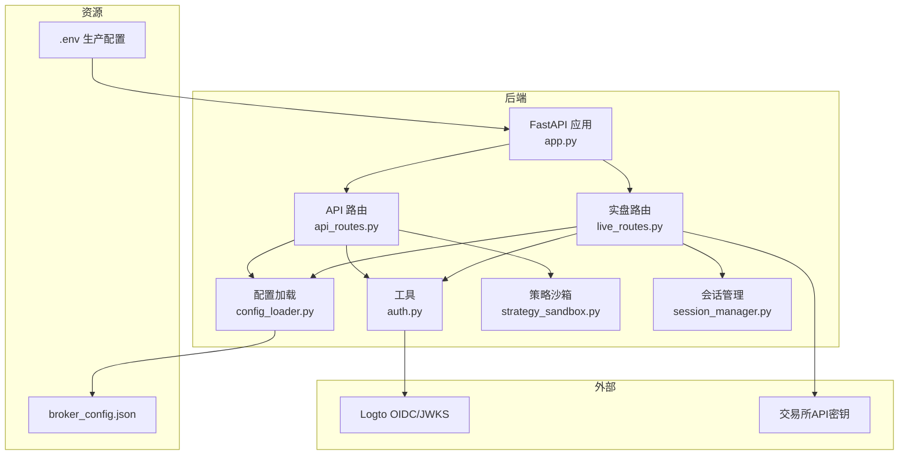
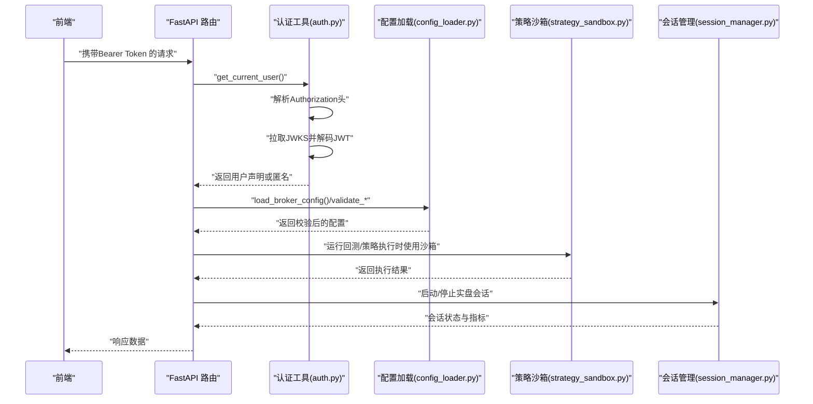
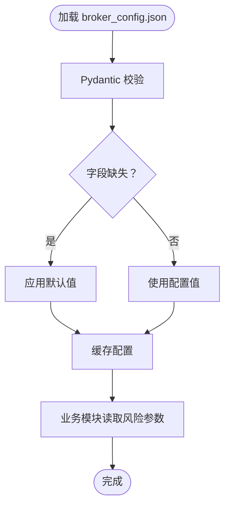
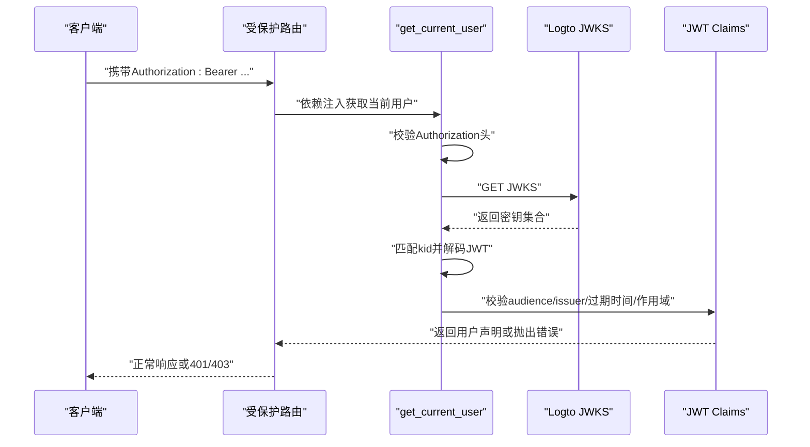
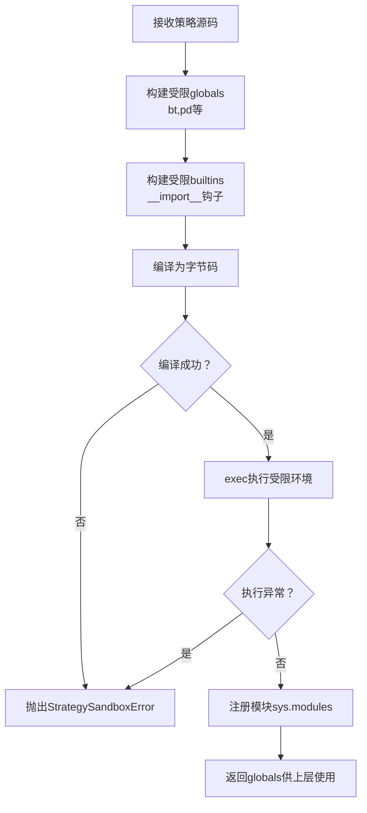
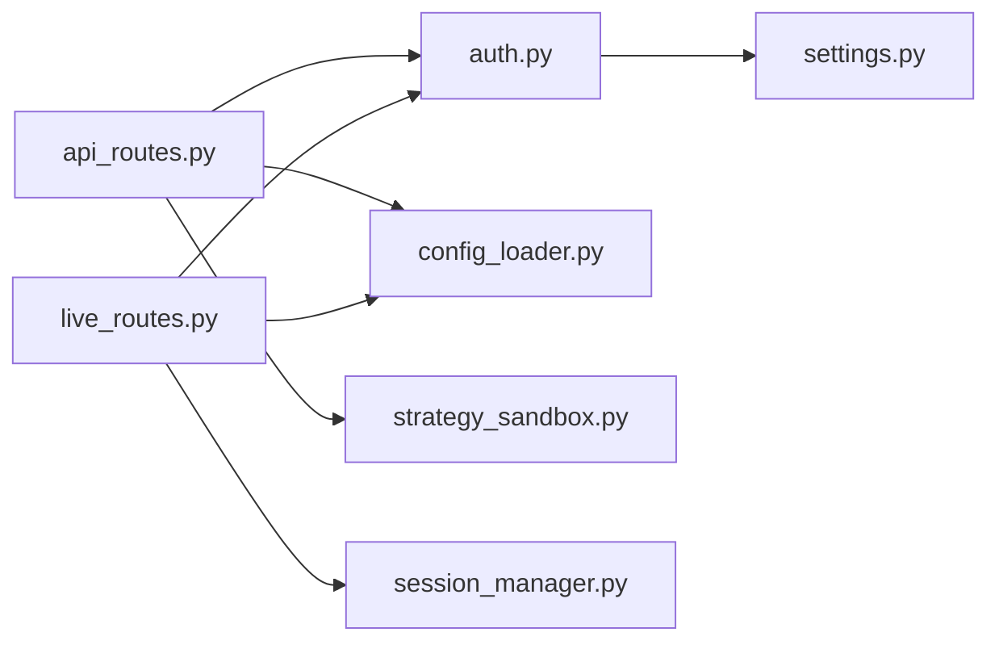

# 安全管理

<cite>
**本文引用的文件**
- [CLAUDE.md](file://CLAUDE.md)
- [broker_config.json](file://backend/resources/config/broker_config.json)
- [settings.py](file://backend/src/config/settings.py)
- [auth.py](file://backend/src/utils/auth.py)
- [.env.prod](file://backend/.env.prod)
- [config_loader.py](file://backend/src/utils/config_loader.py)
- [strategy_sandbox.py](file://backend/src/service/strategy_sandbox.py)
- [api_routes.py](file://backend/src/routes/api_routes.py)
- [live_routes.py](file://backend/src/routes/live_routes.py)
- [session_manager.py](file://backend/src/service/session_manager.py)
</cite>

## 目录
1. [引言](#引言)
2. [项目结构](#项目结构)
3. [核心组件](#核心组件)
4. [架构总览](#架构总览)
5. [详细组件分析](#详细组件分析)
6. [依赖关系分析](#依赖关系分析)
7. [性能考虑](#性能考虑)
8. [故障排查指南](#故障排查指南)
9. [结论](#结论)
10. [附录](#附录)

## 引言
本文件面向系统安全管理，围绕以下目标展开：
- 基于仓库中的安全建议，制定API密钥管理规范（存储、访问控制、轮换机制）
- 阐述broker_config.json中的风险参数安全配置（最大仓位、最大亏损限额等）
- 解释JWT认证机制的实现原理与安全加固要点（IP白名单、2FA等）
- 提供策略代码注入防护的沙箱机制说明
- 给出生产环境安全审计清单

## 项目结构
后端采用FastAPI + Backtrader架构，前端为React应用。安全相关的关键位置如下：
- 环境变量与配置：backend/.env.prod、backend/src/config/settings.py
- 认证与授权：backend/src/utils/auth.py
- 风险配置：backend/resources/config/broker_config.json 及其加载校验模块
- 策略执行沙箱：backend/src/service/strategy_sandbox.py
- API路由与鉴权依赖：backend/src/routes/api_routes.py、backend/src/routes/live_routes.py
- 会话管理与风控联动：backend/src/service/session_manager.py

图表来源
- [api_routes.py](file://backend/src/routes/api_routes.py#L1-L341)
- [live_routes.py](file://backend/src/routes/live_routes.py#L1-L423)
- [auth.py](file://backend/src/utils/auth.py#L1-L191)
- [config_loader.py](file://backend/src/utils/config_loader.py#L1-L343)
- [strategy_sandbox.py](file://backend/src/service/strategy_sandbox.py#L1-L182)
- [session_manager.py](file://backend/src/service/session_manager.py#L1-L410)
- [broker_config.json](file://backend/resources/config/broker_config.json#L1-L131)
- [.env.prod](file://backend/.env.prod#L1-L15)

章节来源
- [CLAUDE.md](file://CLAUDE.md#L80-L123)

## 核心组件
- JWT认证与授权：通过Logto的JWKS验证JWT签名，支持可选登录与作用域校验
- 配置加载与校验：broker_config.json经Pydantic模型校验，提供风险参数与交易设置
- 策略沙箱：限制导入模块与内置函数，禁止相对导入与危险操作
- 实盘路由与会话管理：统一入口进行模式校验、参数校验与会话生命周期管理
- 环境变量与密钥：生产密钥通过.env.prod注入，Live交易密钥遵循CCXT约定

章节来源
- [auth.py](file://backend/src/utils/auth.py#L1-L191)
- [config_loader.py](file://backend/src/utils/config_loader.py#L1-L343)
- [strategy_sandbox.py](file://backend/src/service/strategy_sandbox.py#L1-L182)
- [live_routes.py](file://backend/src/routes/live_routes.py#L1-L423)
- [session_manager.py](file://backend/src/service/session_manager.py#L1-L410)
- [settings.py](file://backend/src/config/settings.py#L1-L81)
- [.env.prod](file://backend/.env.prod#L1-L15)

## 架构总览
下图展示JWT认证、配置加载、策略沙箱与实盘路由之间的交互关系。

图表来源
- [auth.py](file://backend/src/utils/auth.py#L153-L191)
- [api_routes.py](file://backend/src/routes/api_routes.py#L1-L341)
- [config_loader.py](file://backend/src/utils/config_loader.py#L113-L177)
- [strategy_sandbox.py](file://backend/src/service/strategy_sandbox.py#L148-L182)
- [session_manager.py](file://backend/src/service/session_manager.py#L133-L217)

## 详细组件分析

### API密钥管理规范
- 存储
  - 生产密钥通过.env.prod注入，包含Logto相关配置与OpenAI密钥
  - 实盘密钥遵循CCXT约定格式：CCXT_{EXCHANGE}_{MODE}_API_KEY/SECRET
  - 建议将.env.prod纳入版本控制忽略列表，避免泄露
- 访问控制
  - 后端通过环境变量ENABLE_LOGIN控制是否启用登录；未启用时返回匿名用户
  - 路由层普遍依赖get_current_user，未登录将收到标准错误
- 轮换机制
  - 建议定期轮换交易所API密钥，区分测试网与实盘密钥
  - 轮换后立即更新环境变量并重启服务，确保新密钥生效

章节来源
- [.env.prod](file://backend/.env.prod#L1-L15)
- [settings.py](file://backend/src/config/settings.py#L19-L31)
- [settings.py](file://backend/src/config/settings.py#L43-L46)
- [CLAUDE.md](file://CLAUDE.md#L361-L383)

### broker_config.json 风险参数安全配置
- 位置与用途
  - 风险管理参数集中定义，用于控制单笔订单、总仓位、日度损失与最大回撤
- 关键参数
  - 仓位限制：最大单仓金额、最大同时持仓数、最大杠杆
  - 日度与回撤限制：最大日亏损金额与百分比、最大回撤百分比
  - 订单限制：最小/最大订单金额、最大滑点百分比
- 加载与校验
  - 使用Pydantic模型进行结构化校验，缺失字段采用默认值
  - 提供reload_config强制刷新缓存的能力
- 安全建议
  - 上线前务必调整风险限额，结合历史回测与压力测试设定合理阈值
  - 对不同市场与杠杆场景分别评估限额，避免过度集中

图表来源
- [config_loader.py](file://backend/src/utils/config_loader.py#L113-L177)
- [broker_config.json](file://backend/resources/config/broker_config.json#L85-L101)

章节来源
- [broker_config.json](file://backend/resources/config/broker_config.json#L85-L101)
- [config_loader.py](file://backend/src/utils/config_loader.py#L1-L343)

### JWT认证机制与安全加固
- 实现原理
  - 从Authorization头提取Bearer Token
  - 通过LOGTO_JWKS_URI拉取JWKS并解析kid匹配签名密钥
  - 使用python-jose对JWT进行解码与校验，支持audience与issuer校验
  - 支持可选的作用域校验（LOGTO_REQUIRED_SCOPES）
  - 当ENABLE_LOGIN=false时，允许匿名访问
- 安全加固要点
  - 在生产环境严格校验LOGTO_JWKS_URI签名，避免中间人攻击
  - 为API配置必要的作用域，按需最小权限授权
  - 结合前端LogtoProvider与后端依赖注入，确保所有受保护路由均经过get_current_user
  - 建议在反向代理层开启TLS与CORS白名单，限制来源域名

图表来源
- [auth.py](file://backend/src/utils/auth.py#L43-L191)
- [api_routes.py](file://backend/src/routes/api_routes.py#L59-L75)
- [settings.py](file://backend/src/config/settings.py#L19-L28)
- [.env.prod](file://backend/.env.prod#L9-L15)

章节来源
- [auth.py](file://backend/src/utils/auth.py#L1-L191)
- [api_routes.py](file://backend/src/routes/api_routes.py#L59-L75)
- [settings.py](file://backend/src/config/settings.py#L19-L28)
- [.env.prod](file://backend/.env.prod#L9-L15)

### 策略代码注入防护的沙箱机制
- 设计目标
  - 限制用户策略可导入模块与内置函数，禁止相对导入
  - 通过自定义__builtins__与__import__钩子，阻断危险操作
- 关键实现
  - 白名单导入模块：backtrader、pandas、numpy等常用库
  - 自定义safe_import：仅允许白名单根模块导入
  - 清理模块内置：移除__builtins__引用，避免直接访问危险对象
  - 编译与执行：先编译为字节码，再在受限全局环境中执行
- 风险控制
  - 拦截语法错误与执行异常，统一抛出StrategySandboxError
  - 仅暴露必要对象，避免策略访问系统级API

图表来源
- [strategy_sandbox.py](file://backend/src/service/strategy_sandbox.py#L148-L182)

章节来源
- [strategy_sandbox.py](file://backend/src/service/strategy_sandbox.py#L1-L182)

### 实盘路由与会话管理的安全联动
- 路由入口
  - /api/live/start：启动会话前进行模式校验（paper/live）、交换器可用性、符号与时间框架校验
  - /api/live/stop：停止会话并清理资源，记录最终状态
  - /api/live/sessions：列出会话，支持过滤与限制数量
- 会话管理
  - 单例SessionManager集中管理生命周期，线程安全更新状态
  - 会话状态包含PnL、交易数、持仓与未成交订单，便于风控监控
- 安全要点
  - LIVE_TRADING_ENABLED开关控制是否允许实盘
  - 所有会话均通过配置加载与校验，避免越界参数导致系统不稳定
  - 建议在反向代理层限制来源IP与速率，配合2FA与IP白名单

章节来源
- [live_routes.py](file://backend/src/routes/live_routes.py#L101-L182)
- [live_routes.py](file://backend/src/routes/live_routes.py#L184-L254)
- [live_routes.py](file://backend/src/routes/live_routes.py#L256-L338)
- [session_manager.py](file://backend/src/service/session_manager.py#L133-L217)
- [session_manager.py](file://backend/src/service/session_manager.py#L238-L292)

## 依赖关系分析
- 认证依赖
  - auth.py依赖settings中的LOGTO_*与ENABLE_LOGIN，以及网络代理配置
  - 路由层依赖get_current_user作为FastAPI依赖项
- 配置依赖
  - config_loader.py依赖Pydantic模型与JSON文件，提供类型化配置
  - live_routes与api_routes在运行时调用配置加载与校验
- 执行依赖
  - 策略沙箱独立于路由，但被回测引擎与策略加载流程调用
  - 会话管理与实盘路由强耦合，负责状态与资源回收

图表来源
- [auth.py](file://backend/src/utils/auth.py#L1-L191)
- [settings.py](file://backend/src/config/settings.py#L19-L31)
- [api_routes.py](file://backend/src/routes/api_routes.py#L1-L341)
- [live_routes.py](file://backend/src/routes/live_routes.py#L1-L423)
- [config_loader.py](file://backend/src/utils/config_loader.py#L1-L343)
- [strategy_sandbox.py](file://backend/src/service/strategy_sandbox.py#L1-L182)
- [session_manager.py](file://backend/src/service/session_manager.py#L1-L410)

章节来源
- [auth.py](file://backend/src/utils/auth.py#L1-L191)
- [settings.py](file://backend/src/config/settings.py#L19-L31)
- [api_routes.py](file://backend/src/routes/api_routes.py#L1-L341)
- [live_routes.py](file://backend/src/routes/live_routes.py#L1-L423)
- [config_loader.py](file://backend/src/utils/config_loader.py#L1-L343)
- [strategy_sandbox.py](file://backend/src/service/strategy_sandbox.py#L1-L182)
- [session_manager.py](file://backend/src/service/session_manager.py#L1-L410)

## 性能考虑
- 认证性能
  - JWKS缓存（LRU）减少频繁拉取，建议在高并发场景下预热缓存
  - 代理配置（HTTP_PROXY/HTTPS_PROXY）可能引入延迟，建议在内网部署时关闭
- 配置加载
  - 配置缓存避免重复解析JSON，reload_config用于动态刷新
- 策略执行
  - 沙箱执行在受限环境下进行，避免I/O与网络访问，性能稳定
- 会话管理
  - 多会话并发时注意线程锁竞争，建议限制并发会话数量并监控资源占用

## 故障排查指南
- 认证失败
  - 检查LOGTO_ISSUER、LOGTO_JWKS_URI、LOGTO_AUDIENCE配置是否正确
  - 确认Token未过期且包含所需作用域
  - 若JWKS获取失败，检查网络代理与防火墙
- 实盘启动失败
  - 确认LIVE_TRADING_ENABLED已启用
  - 检查CCXT密钥格式与模式（paper/live）是否匹配
  - 校验broker_config.json中exchange与timeframe配置
- 策略执行异常
  - 查看沙箱错误信息，确认导入模块是否在白名单
  - 检查策略语法与逻辑，避免访问受限对象
- 会话无法停止
  - 检查线程是否卡死，适当延长超时时间或强制重启

章节来源
- [auth.py](file://backend/src/utils/auth.py#L60-L105)
- [live_routes.py](file://backend/src/routes/live_routes.py#L122-L182)
- [config_loader.py](file://backend/src/utils/config_loader.py#L113-L177)
- [strategy_sandbox.py](file://backend/src/service/strategy_sandbox.py#L148-L182)
- [session_manager.py](file://backend/src/service/session_manager.py#L238-L292)

## 结论
本系统在安全方面具备较为完善的基础设施：JWT认证与可选登录、严格的配置加载与校验、策略沙箱隔离、以及会话生命周期管理。建议在生产部署中强化密钥轮换、IP白名单与2FA等控制措施，并持续审计配置与日志，确保风险参数与访问控制符合业务要求。

## 附录

### 生产环境安全审计清单
- 环境与密钥
  - 已使用.env.prod存放生产密钥，未提交至版本库
  - 实盘密钥遵循CCXT格式，区分paper/live
  - 定期轮换交易所API密钥，更新后重启服务
- 认证与授权
  - 启用ENABLE_LOGIN并配置LOGTO_*参数
  - 设置LOGTO_REQUIRED_SCOPES以最小权限授权
  - 在反向代理层启用TLS与CORS白名单
- 配置与风控
  - broker_config.json已根据业务场景调整风险限额
  - 启用reload_config能力以便动态刷新
- 策略执行
  - 仅允许白名单模块导入，禁止相对导入
  - 回测与实盘策略代码均通过沙箱执行
- 会话与日志
  - 限制并发会话数量，监控会话状态
  - 审核日志输出，保留关键事件（订单、风控告警）

章节来源
- [.env.prod](file://backend/.env.prod#L1-L15)
- [settings.py](file://backend/src/config/settings.py#L19-L31)
- [config_loader.py](file://backend/src/utils/config_loader.py#L113-L177)
- [strategy_sandbox.py](file://backend/src/service/strategy_sandbox.py#L148-L182)
- [live_routes.py](file://backend/src/routes/live_routes.py#L101-L182)
- [CLAUDE.md](file://CLAUDE.md#L361-L383)