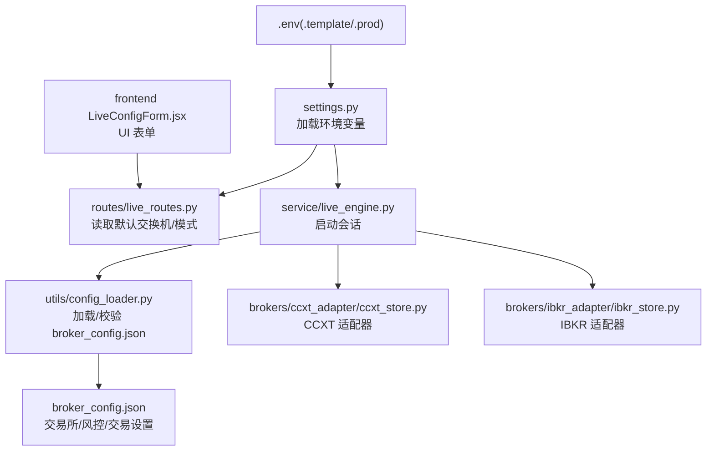
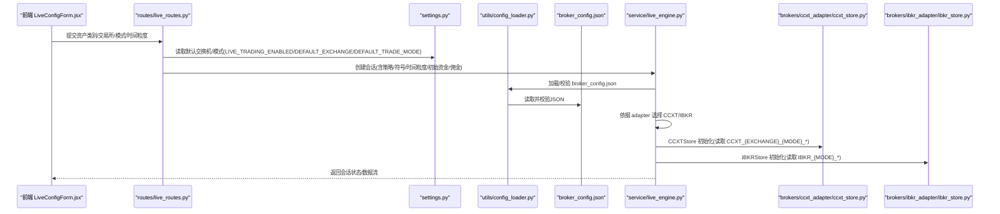
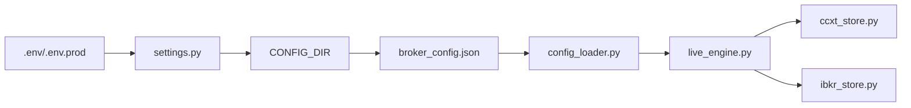

# 环境配置

<cite>
**本文引用的文件**
- [backend/.env.template](file://backend/.env.template)
- [backend/.env.prod](file://backend/.env.prod)
- [backend/src/config/settings.py](file://backend/src/config/settings.py)
- [backend/resources/config/broker_config.json](file://backend/resources/config/broker_config.json)
- [backend/resources/config/broker_config.template.json](file://backend/resources/config/broker_config.template.json)
- [backend/src/utils/config_loader.py](file://backend/src/utils/config_loader.py)
- [backend/src/brokers/ccxt_adapter/ccxt_store.py](file://backend/src/brokers/ccxt_adapter/ccxt_store.py)
- [backend/src/brokers/ibkr_adapter/ibkr_store.py](file://backend/src/brokers/ibkr_adapter/ibkr_store.py)
- [backend/src/service/live_engine.py](file://backend/src/service/live_engine.py)
- [backend/src/routes/live_routes.py](file://backend/src/routes/live_routes.py)
- [frontend/src/components/LiveTrading/LiveConfigForm.jsx](file://frontend/src/components/LiveTrading/LiveConfigForm.jsx)
- [CLAUDE.md](file://CLAUDE.md)
- [operations-log.md](file://operations-log.md)
</cite>

## 目录
1. [简介](#简介)
2. [项目结构](#项目结构)
3. [核心组件](#核心组件)
4. [架构总览](#架构总览)
5. [详细组件分析](#详细组件分析)
6. [依赖关系分析](#依赖关系分析)
7. [性能考量](#性能考量)
8. [故障排查指南](#故障排查指南)
9. [结论](#结论)
10. [附录](#附录)

## 简介
本文件围绕系统环境配置的最佳实践展开，基于 backend/.env.template、broker_config.json 与 settings.py 的实现，系统性说明：
- 所有环境变量的用途与配置方法（认证、数据库、AI服务、代理、实盘/纸面交易开关）
- 不同交易所（CCXT 与 IBKR）的连接参数设置与切换方式
- settings.py 中配置的优先级与加载机制
- 生产环境与开发环境的配置差异
- 配置验证步骤与常见错误排查

## 项目结构
后端通过 settings.py 加载 .env 文件，再由 config_loader.py 读取 broker_config.json 并进行类型化校验；前端通过 LiveConfigForm.jsx 提供用户界面以选择资产类别、交易所、模式（纸面/实盘）、时间粒度等参数，最终由 live_engine.py 启动会话并按配置选择 CCXT 或 IBKR 适配器。

图表来源
- [backend/src/config/settings.py](file://backend/src/config/settings.py#L1-L81)
- [backend/src/utils/config_loader.py](file://backend/src/utils/config_loader.py#L113-L177)
- [backend/resources/config/broker_config.json](file://backend/resources/config/broker_config.json#L1-L131)
- [backend/src/brokers/ccxt_adapter/ccxt_store.py](file://backend/src/brokers/ccxt_adapter/ccxt_store.py#L169-L213)
- [backend/src/brokers/ibkr_adapter/ibkr_store.py](file://backend/src/brokers/ibkr_adapter/ibkr_store.py#L45-L156)
- [backend/src/service/live_engine.py](file://backend/src/service/live_engine.py#L122-L165)
- [frontend/src/components/LiveTrading/LiveConfigForm.jsx](file://frontend/src/components/LiveTrading/LiveConfigForm.jsx#L1-L161)

章节来源
- [backend/src/config/settings.py](file://backend/src/config/settings.py#L1-L81)
- [backend/src/utils/config_loader.py](file://backend/src/utils/config_loader.py#L113-L177)
- [backend/resources/config/broker_config.json](file://backend/resources/config/broker_config.json#L1-L131)
- [backend/src/brokers/ccxt_adapter/ccxt_store.py](file://backend/src/brokers/ccxt_adapter/ccxt_store.py#L169-L213)
- [backend/src/brokers/ibkr_adapter/ibkr_store.py](file://backend/src/brokers/ibkr_adapter/ibkr_store.py#L45-L156)
- [frontend/src/components/LiveTrading/LiveConfigForm.jsx](file://frontend/src/components/LiveTrading/LiveConfigForm.jsx#L1-L161)

## 核心组件
- 环境变量加载与优先级：settings.py 使用 dotenv 在项目根目录查找 .env 文件，且默认不覆盖已存在的环境变量（override=False）。生产环境建议使用 .env.prod 覆盖关键值。
- broker_config.json 类型化加载与校验：config_loader.py 使用 Pydantic 对配置进行结构校验，缓存于内存，避免重复 I/O。
- 适配器选择与参数解析：live_engine.py 根据 broker_config.json 的 adapter 字段自动选择 CCXT 或 IBKR；CCXTStore 从环境变量读取 API 密钥；IBKRStore 从环境变量读取 HOST/PORT/CLIENT_ID/ACCOUNT。

章节来源
- [backend/src/config/settings.py](file://backend/src/config/settings.py#L16-L46)
- [backend/src/utils/config_loader.py](file://backend/src/utils/config_loader.py#L113-L177)
- [backend/src/service/live_engine.py](file://backend/src/service/live_engine.py#L122-L165)

## 架构总览
下图展示从环境变量到 broker 配置再到适配器选择的整体流程。

图表来源
- [frontend/src/components/LiveTrading/LiveConfigForm.jsx](file://frontend/src/components/LiveTrading/LiveConfigForm.jsx#L1-L161)
- [backend/src/routes/live_routes.py](file://backend/src/routes/live_routes.py#L1-L200)
- [backend/src/config/settings.py](file://backend/src/config/settings.py#L16-L46)
- [backend/src/utils/config_loader.py](file://backend/src/utils/config_loader.py#L113-L177)
- [backend/resources/config/broker_config.json](file://backend/resources/config/broker_config.json#L1-L131)
- [backend/src/service/live_engine.py](file://backend/src/service/live_engine.py#L122-L165)
- [backend/src/brokers/ccxt_adapter/ccxt_store.py](file://backend/src/brokers/ccxt_adapter/ccxt_store.py#L169-L213)
- [backend/src/brokers/ibkr_adapter/ibkr_store.py](file://backend/src/brokers/ibkr_adapter/ibkr_store.py#L45-L156)

## 详细组件分析

### 环境变量与配置模板
- 认证与平台配置：LOGTO_ISSUER、LOGTO_JWKS_URI、LOGTO_AUDIENCE、ENABLE_LOGIN、LOGTO_REQUIRED_SCOPES。生产环境建议在 .env.prod 中配置。
- 外部服务：DATABASE_URL、OPENAI_API_KEY、OPENAI_BASE_URL、HTTP_PROXY、HTTPS_PROXY。
- 实盘交易配置：LIVE_TRADING_ENABLED、DEFAULT_EXCHANGE、DEFAULT_TRADE_MODE。
- CCXT 交易所 API 密钥：CCXT_{EXCHANGE}_{MODE}_API_KEY、CCXT_{EXCHANGE}_{MODE}_SECRET、CCXT_{EXCHANGE}_{MODE}_PASSPHRASE（部分交易所如 OKX 需要）。
- 安全提示：禁止提交 .env；为纸面/实盘分别创建密钥；实盘密钥仅授权交易权限并启用 2FA。

章节来源
- [backend/.env.template](file://backend/.env.template#L1-L86)
- [backend/.env.prod](file://backend/.env.prod#L1-L15)
- [backend/src/config/settings.py](file://backend/src/config/settings.py#L16-L46)

### broker_config.json 结构与参数
- exchanges：定义各交易所的启用状态、名称、适配器、ccxt_id、市场类型、默认市场、纸面模式配置（是否启用、沙盒地址、初始资金）、费率限制。
- risk_management：最大持仓金额、最大持仓数量、杠杆上限、日最大亏损金额/百分比、最大回撤百分比、订单最小/最大金额、最大滑点。
- trading_settings：默认时间粒度、支持的时间粒度列表、断线重连策略、心跳间隔。
- notifications：通知通道与事件类型。

章节来源
- [backend/resources/config/broker_config.json](file://backend/resources/config/broker_config.json#L1-L131)
- [backend/resources/config/broker_config.template.json](file://backend/resources/config/broker_config.template.json#L1-L114)

### settings.py 的加载机制与优先级
- 路径解析：BASE_DIR、PROJECT_ROOT、RESOURCES_DIR、CONFIG_DIR 等。
- 环境变量加载：load_dotenv(PROJECT_ROOT / ".env", override=False)，即 .env 中的值不会覆盖已存在的环境变量，确保容器/系统环境变量优先。
- 关键配置项：LOGTO_*、ENABLE_LOGIN、DATABASE_URL、OPENAI_*、HTTP(S)_PROXY、LIVE_TRADING_ENABLED、DEFAULT_EXCHANGE、DEFAULT_TRADE_MODE。
- CCXT 凭据：由 CCXTStore 直接从环境变量读取，无需在 settings.py 中显式赋值。

章节来源
- [backend/src/config/settings.py](file://backend/src/config/settings.py#L1-L81)

### 配置加载与校验（config_loader.py）
- 缓存策略：同一路径下首次加载后缓存，reload=True 可强制刷新。
- 错误处理：文件不存在、JSON 解析失败、Pydantic 校验失败均抛出明确异常。
- 适配器校验：仅允许 ccxt、ibkr 两种适配器，避免不支持集成。
- 辅助函数：列出启用交易所、获取风险配置、校验 symbol/timeframe 格式。

章节来源
- [backend/src/utils/config_loader.py](file://backend/src/utils/config_loader.py#L113-L177)
- [backend/src/utils/config_loader.py](file://backend/src/utils/config_loader.py#L179-L218)
- [backend/src/utils/config_loader.py](file://backend/src/utils/config_loader.py#L248-L343)

### CCXT 适配器参数与切换
- 环境变量格式：CCXT_{EXCHANGE}_{MODE}_API_KEY、CCXT_{EXCHANGE}_{MODE}_SECRET、CCXT_{EXCHANGE}_{MODE}_PASSPHRASE（如 OKX）。
- 模式切换：纸面模式（PAPER）通常走测试网；实盘模式（LIVE）需要真实密钥。
- 特殊处理：Binance 测试网 URL 覆盖；OKX 等交易所可选密码字段；默认 market 类型来自 broker_config.json 的 default_market。
- 事件循环：CCXTStore 在后台线程启动 asyncio 事件循环，超时则报错。

章节来源
- [backend/.env.template](file://backend/.env.template#L33-L66)
- [backend/src/brokers/ccxt_adapter/ccxt_store.py](file://backend/src/brokers/ccxt_adapter/ccxt_store.py#L169-L213)
- [backend/src/brokers/ccxt_adapter/ccxt_store.py](file://backend/src/brokers/ccxt_adapter/ccxt_store.py#L252-L293)

### IBKR 适配器参数与切换
- 环境变量前缀：IBKR_{MODE}_HOST、IBKR_{MODE}_PORT、IBKR_{MODE}_CLIENT_ID、IBKR_{MODE}_ACCOUNT。
- 默认端口：纸面 7497，实盘 7496。
- 连接：通过 Backtrader 的 IBStore 建立连接，支持断线重连与超时控制。
- 符号格式：需符合 IBKR 合约字符串规范（例如股票/外汇/期货/期权的合约标识）。

章节来源
- [backend/resources/config/broker_config.json](file://backend/resources/config/broker_config.json#L64-L83)
- [backend/src/brokers/ibkr_adapter/ibkr_store.py](file://backend/src/brokers/ibkr_adapter/ibkr_store.py#L45-L156)
- [operations-log.md](file://operations-log.md#L14-L19)

### 前端交互与会话启动（LiveConfigForm.jsx 与 live_engine.py）
- 前端表单：资产类别（crypto/stock）、策略、符号、交易所、模式（paper/live）、时间粒度、初始资金、佣金。
- 会话启动：live_engine.py 接收上述参数，创建会话并根据 broker_config.json 的 adapter 自动选择 CCXT/IBKR。
- 适配器绑定：CCXTStore 从环境变量读取密钥；IBKRStore 从环境变量读取 HOST/PORT/CLIENT_ID/ACCOUNT。

章节来源
- [frontend/src/components/LiveTrading/LiveConfigForm.jsx](file://frontend/src/components/LiveTrading/LiveConfigForm.jsx#L1-L161)
- [backend/src/service/live_engine.py](file://backend/src/service/live_engine.py#L122-L165)

## 依赖关系分析
- settings.py 依赖 dotenv 加载 .env；若存在 .env.prod，其值不会覆盖已存在的环境变量（override=False）。
- config_loader.py 依赖 settings.CONFIG_DIR 与 broker_config.json；对 JSON 进行结构校验并缓存。
- live_engine.py 依赖 config_loader 获取 broker 配置，并据此选择 CCXT/IBKR 适配器。
- CCXTStore/IBKRStore 依赖各自环境变量前缀（CCXT_{EXCHANGE}_{MODE}_* / IBKR_{MODE}_*）。

图表来源
- [backend/src/config/settings.py](file://backend/src/config/settings.py#L16-L46)
- [backend/src/utils/config_loader.py](file://backend/src/utils/config_loader.py#L113-L177)
- [backend/src/service/live_engine.py](file://backend/src/service/live_engine.py#L122-L165)
- [backend/src/brokers/ccxt_adapter/ccxt_store.py](file://backend/src/brokers/ccxt_adapter/ccxt_store.py#L169-L213)
- [backend/src/brokers/ibkr_adapter/ibkr_store.py](file://backend/src/brokers/ibkr_adapter/ibkr_store.py#L45-L156)

章节来源
- [backend/src/config/settings.py](file://backend/src/config/settings.py#L16-L46)
- [backend/src/utils/config_loader.py](file://backend/src/utils/config_loader.py#L113-L177)
- [backend/src/service/live_engine.py](file://backend/src/service/live_engine.py#L122-L165)

## 性能考量
- 配置缓存：config_loader.py 对 broker_config.json 进行内存缓存，减少重复 I/O。
- 事件循环：CCXTStore 在后台线程运行 asyncio 事件循环，避免阻塞主线程。
- 重试与退避：CCXTStore 对网络错误进行指数退避重试，提升稳定性。
- 断线重连：broker_config.json 支持断线重连与心跳间隔配置，降低网络抖动影响。

章节来源
- [backend/src/utils/config_loader.py](file://backend/src/utils/config_loader.py#L113-L177)
- [backend/src/brokers/ccxt_adapter/ccxt_store.py](file://backend/src/brokers/ccxt_adapter/ccxt_store.py#L293-L324)
- [backend/resources/config/broker_config.json](file://backend/resources/config/broker_config.json#L102-L116)

## 故障排查指南
- “缺少 API 凭据（实盘）”
  - 检查 .env 是否包含正确的 CCXT_{EXCHANGE}_{MODE}_API_KEY/SECRET，MODE 为 LIVE。
  - 确认 broker_config.json 中对应交易所已启用。
  - 若为 OKX，还需设置 CCXT_OKX_LIVE_PASSPHRASE。
- “无法启动事件循环（CCXT）”
  - 检查是否已有运行中的事件循环；确保 CCXTStore.start() 先于任何异步操作调用。
- “IBKR 连接失败”
  - 确认 IBKR_{MODE}_HOST/PORT/CLIENT_ID/ACCOUNT 已正确设置；纸面默认端口 7497，实盘 7496。
  - 确保已安装 ibapi；检查 IB Gateway/TWS 是否正常运行。
- “broker_config.json 无效”
  - 确认 JSON 语法正确；字段名与类型符合 Pydantic 校验要求；必要时参考 broker_config.template.json。
- “符号/时间粒度不合法”
  - 符号必须为“BASE/QUOTE”格式；时间粒度需在 supported_timeframes 列表内。

章节来源
- [CLAUDE.md](file://CLAUDE.md#L329-L339)
- [backend/src/brokers/ccxt_adapter/ccxt_store.py](file://backend/src/brokers/ccxt_adapter/ccxt_store.py#L169-L213)
- [backend/src/brokers/ibkr_adapter/ibkr_store.py](file://backend/src/brokers/ibkr_adapter/ibkr_store.py#L45-L156)
- [backend/src/utils/config_loader.py](file://backend/src/utils/config_loader.py#L264-L343)

## 结论
- 环境变量加载遵循“系统/容器 > .env > 默认值”的优先级，生产环境建议通过 .env.prod 与系统环境变量统一管理。
- broker_config.json 采用强类型校验，确保配置结构正确与运行稳定。
- CCXT/IBKR 适配器通过环境变量参数化，实现纸面/实盘无缝切换；前端表单简化了用户配置入口。
- 建议在生产部署前完成充分的纸面测试与配置验证，严格区分纸面/实盘密钥与权限范围。

## 附录

### 开发环境与生产环境配置差异对比
- 开发环境
  - 使用 .env.template 填写测试密钥（如 CCXT_BINANCE_PAPER_*），开启 ENABLE_LOGIN（可选）。
  - DATABASE_URL 指向本地或测试数据库。
  - OPENAI_* 可指向测试服务端点或禁用。
- 生产环境
  - 使用 .env.prod 设置生产密钥与服务端点；通过系统环境变量覆盖 .env 中的敏感值。
  - LOGTO_* 指向已部署域名；OPENAI_BASE_URL 指向生产服务。
  - LIVE_TRADING_ENABLED 默认关闭，上线前逐步开启并监控。

章节来源
- [backend/.env.template](file://backend/.env.template#L1-L86)
- [backend/.env.prod](file://backend/.env.prod#L1-L15)
- [backend/src/config/settings.py](file://backend/src/config/settings.py#L16-L46)

### 配置验证步骤
- 环境变量
  - 确认 .env/.env.prod 存在且未被 .gitignore 忽略。
  - 使用 python -c "import os; print(os.getenv('YOUR_VAR'))" 检查变量是否生效。
- broker_config.json
  - 复制 broker_config.template.json 为 broker_config.json 并按需启用交易所。
  - 运行配置加载函数（如 load_broker_config）观察日志输出与异常信息。
- 适配器参数
  - CCXT：确认 CCXT_{EXCHANGE}_{MODE}_API_KEY/SECRET/（如 OKX）PASSPHRASE 设置正确。
  - IBKR：确认 IBKR_{MODE}_HOST/PORT/CLIENT_ID/ACCOUNT 设置正确。
- 前端表单
  - 在 LiveConfigForm.jsx 中选择资产类别、交易所、模式、时间粒度并提交，观察会话启动日志。

章节来源
- [backend/resources/config/broker_config.template.json](file://backend/resources/config/broker_config.template.json#L1-L114)
- [backend/src/utils/config_loader.py](file://backend/src/utils/config_loader.py#L113-L177)
- [frontend/src/components/LiveTrading/LiveConfigForm.jsx](file://frontend/src/components/LiveTrading/LiveConfigForm.jsx#L1-L161)