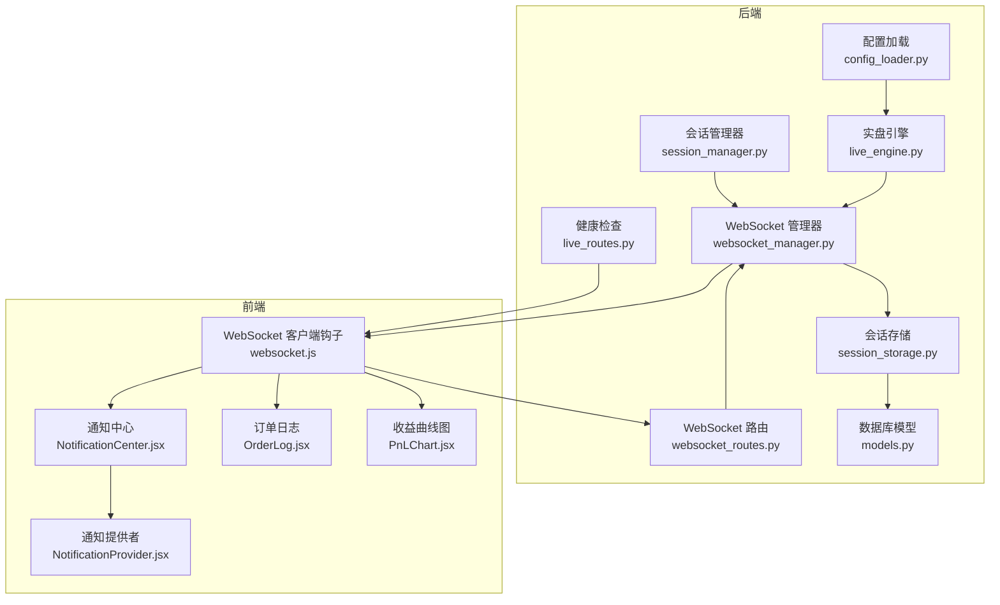
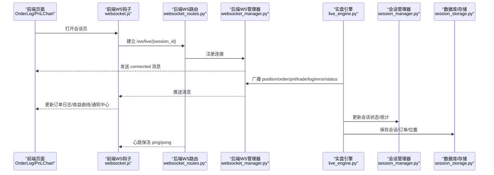
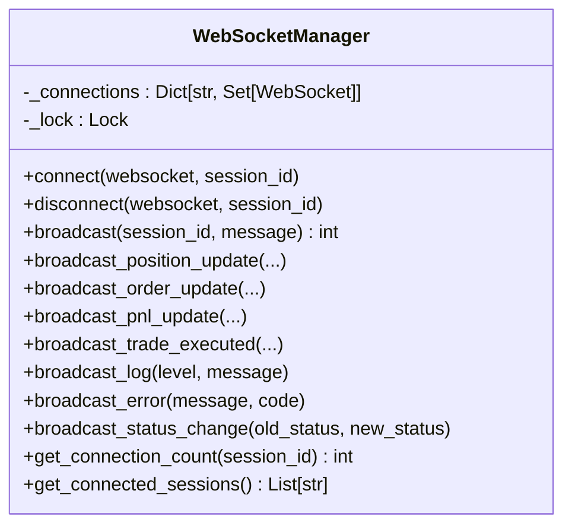
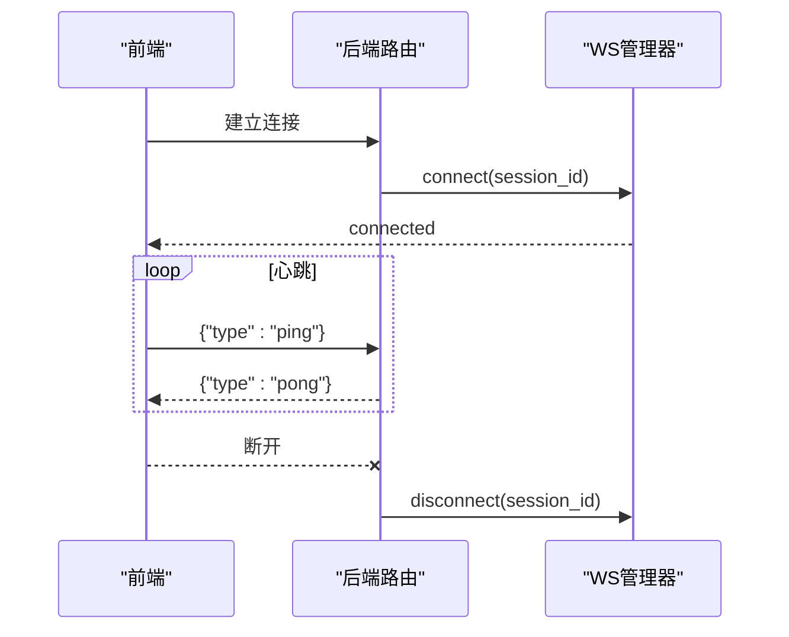
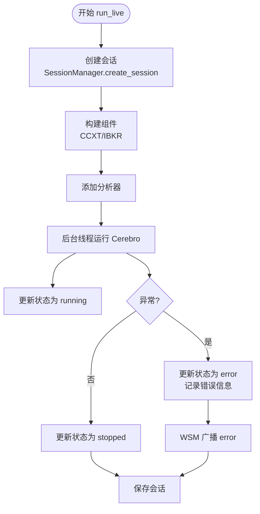
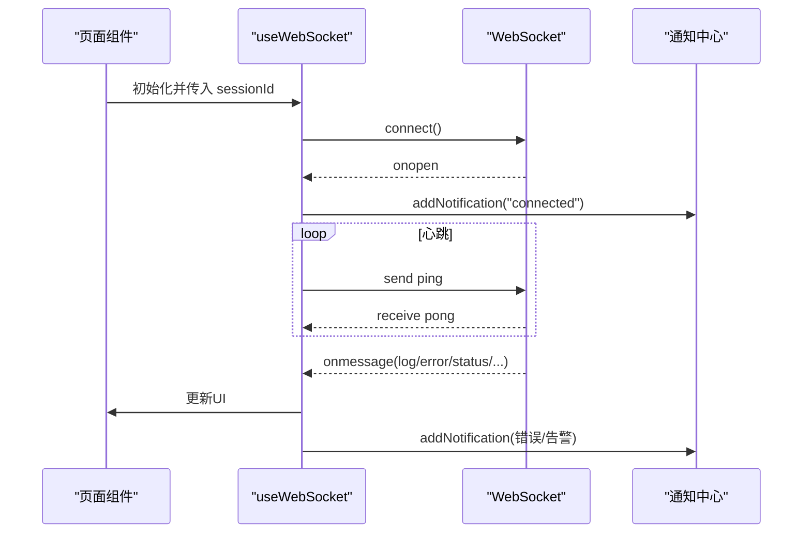
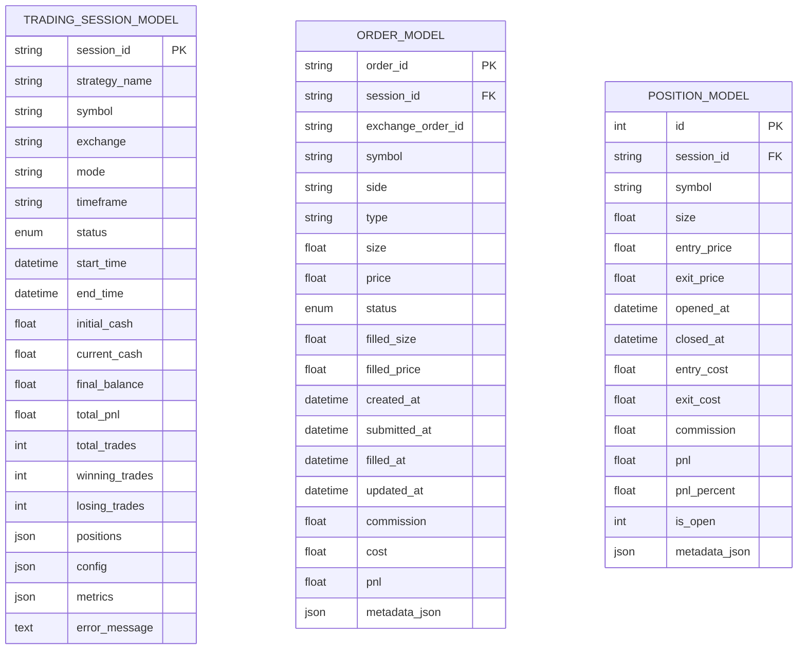
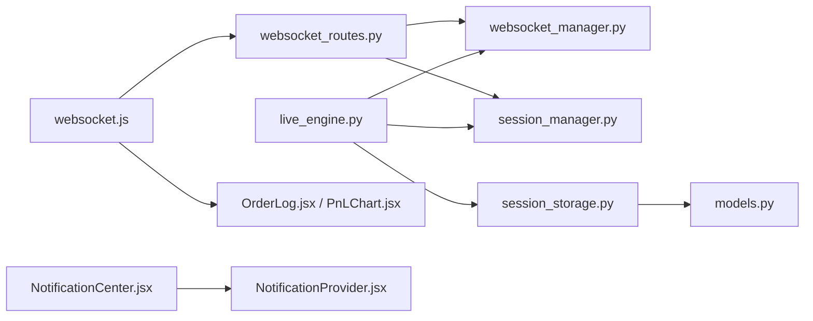

# 监控告警

<cite>
**本文引用的文件**
- [operations-log.md](file://operations-log.md)
- [websocket_manager.py](file://backend/src/service/websocket_manager.py)
- [websocket_routes.py](file://backend/src/routes/websocket_routes.py)
- [websocket.js](file://frontend/src/services/websocket.js)
- [live_engine.py](file://backend/src/service/live_engine.py)
- [session_manager.py](file://backend/src/service/session_manager.py)
- [session_storage.py](file://backend/src/db/session_storage.py)
- [models.py](file://backend/src/db/models.py)
- [live_routes.py](file://backend/src/routes/live_routes.py)
- [config_loader.py](file://backend/src/utils/config_loader.py)
- [NotificationProvider.jsx](file://frontend/src/providers/NotificationProvider.jsx)
- [NotificationCenter.jsx](file://frontend/src/components/Layout/NotificationCenter.jsx)
- [OrderLog.jsx](file://frontend/src/components/LiveTrading/OrderLog.jsx)
- [PnLChart.jsx](file://frontend/src/components/LiveTrading/PnLChart.jsx)
</cite>

## 目录
1. [引言](#引言)
2. [项目结构](#项目结构)
3. [核心组件](#核心组件)
4. [架构总览](#架构总览)
5. [详细组件分析](#详细组件分析)
6. [依赖关系分析](#依赖关系分析)
7. [性能考量](#性能考量)
8. [故障排查指南](#故障排查指南)
9. [结论](#结论)
10. [附录](#附录)

## 引言
本文件面向“建立系统的监控与告警体系”的目标，结合仓库中现有的运维记录与实时通信能力，设计一套覆盖交易执行状态、策略运行健康度与系统资源使用率的关键指标体系，并说明如何通过后端 WebSocket 管理器与前端 WebSocket 客户端实现前后端的实时状态推送与告警通知。同时给出常见故障的监控模式识别方法（如连接中断、数据延迟等）以及告警分级策略与通知渠道配置建议，确保关键问题能被及时发现与处理。

## 项目结构
围绕监控与告警，系统的关键位置如下：
- 后端服务层：WebSocket 管理器负责会话连接池与消息广播；路由层提供 WebSocket 端点与健康检查；引擎与会话管理器负责策略生命周期与状态变更；数据库层持久化会话、订单与位置信息。
- 前端展示层：WebSocket 客户端钩子负责连接、心跳与重连；通知中心提供弹窗式通知；订单日志与 P&L 图表用于可视化交易与收益变化。

图表来源
- [websocket_manager.py](file://backend/src/service/websocket_manager.py#L1-L401)
- [websocket_routes.py](file://backend/src/routes/websocket_routes.py#L1-L239)
- [live_engine.py](file://backend/src/service/live_engine.py#L1-L329)
- [session_manager.py](file://backend/src/service/session_manager.py#L1-L410)
- [session_storage.py](file://backend/src/db/session_storage.py#L1-L392)
- [models.py](file://backend/src/db/models.py#L1-L395)
- [live_routes.py](file://backend/src/routes/live_routes.py#L390-L422)
- [config_loader.py](file://backend/src/utils/config_loader.py#L1-L343)
- [websocket.js](file://frontend/src/services/websocket.js#L1-L282)
- [NotificationProvider.jsx](file://frontend/src/providers/NotificationProvider.jsx#L1-L59)
- [NotificationCenter.jsx](file://frontend/src/components/Layout/NotificationCenter.jsx#L1-L125)
- [OrderLog.jsx](file://frontend/src/components/LiveTrading/OrderLog.jsx#L1-L139)
- [PnLChart.jsx](file://frontend/src/components/LiveTrading/PnLChart.jsx#L1-L113)

章节来源
- [websocket_manager.py](file://backend/src/service/websocket_manager.py#L1-L401)
- [websocket_routes.py](file://backend/src/routes/websocket_routes.py#L1-L239)
- [websocket.js](file://frontend/src/services/websocket.js#L1-L282)
- [live_engine.py](file://backend/src/service/live_engine.py#L1-L329)
- [session_manager.py](file://backend/src/service/session_manager.py#L1-L410)
- [session_storage.py](file://backend/src/db/session_storage.py#L1-L392)
- [models.py](file://backend/src/db/models.py#L1-L395)
- [live_routes.py](file://backend/src/routes/live_routes.py#L390-L422)
- [config_loader.py](file://backend/src/utils/config_loader.py#L1-L343)
- [NotificationProvider.jsx](file://frontend/src/providers/NotificationProvider.jsx#L1-L59)
- [NotificationCenter.jsx](file://frontend/src/components/Layout/NotificationCenter.jsx#L1-L125)
- [OrderLog.jsx](file://frontend/src/components/LiveTrading/OrderLog.jsx#L1-L139)
- [PnLChart.jsx](file://frontend/src/components/LiveTrading/PnLChart.jsx#L1-L113)

## 核心组件
- WebSocket 管理器：维护按会话分组的连接池，统一广播交易执行、P&L、日志、错误与状态变更等消息类型。
- WebSocket 路由：提供 /ws/live/{session_id} 端点，处理连接校验、心跳保活与客户端消息转发。
- 实盘引擎：启动/停止策略会话，更新状态并在异常时广播错误。
- 会话管理器：集中管理会话生命周期、状态与统计，提供查询接口。
- 数据库与存储：持久化会话、订单与位置，支持崩溃恢复与历史回溯。
- 前端 WebSocket 客户端：自动连接、心跳保活、断线重连、消息解析与事件回调。
- 通知中心：聚合与展示告警通知，支持标记已读、清空等操作。

章节来源
- [websocket_manager.py](file://backend/src/service/websocket_manager.py#L1-L401)
- [websocket_routes.py](file://backend/src/routes/websocket_routes.py#L1-L239)
- [live_engine.py](file://backend/src/service/live_engine.py#L1-L329)
- [session_manager.py](file://backend/src/service/session_manager.py#L1-L410)
- [session_storage.py](file://backend/src/db/session_storage.py#L1-L392)
- [websocket.js](file://frontend/src/services/websocket.js#L1-L282)
- [NotificationProvider.jsx](file://frontend/src/providers/NotificationProvider.jsx#L1-L59)
- [NotificationCenter.jsx](file://frontend/src/components/Layout/NotificationCenter.jsx#L1-L125)

## 架构总览
下图展示了从策略运行到前端可视化的完整链路，以及错误与状态变更的广播路径。

图表来源
- [websocket_routes.py](file://backend/src/routes/websocket_routes.py#L1-L239)
- [websocket_manager.py](file://backend/src/service/websocket_manager.py#L1-L401)
- [live_engine.py](file://backend/src/service/live_engine.py#L1-L329)
- [session_manager.py](file://backend/src/service/session_manager.py#L1-L410)
- [session_storage.py](file://backend/src/db/session_storage.py#L1-L392)
- [websocket.js](file://frontend/src/services/websocket.js#L1-L282)
- [OrderLog.jsx](file://frontend/src/components/LiveTrading/OrderLog.jsx#L1-L139)
- [PnLChart.jsx](file://frontend/src/components/LiveTrading/PnLChart.jsx#L1-L113)

## 详细组件分析

### WebSocket 管理器与消息类型
- 连接管理：按 session_id 维护连接集合，支持并发多会话；连接/断开时清理死连接。
- 广播机制：对指定会话内的所有客户端广播消息；失败连接自动清理。
- 消息类型：position、order、pnl、trade、log、error、status；前端定义了常量与解析函数。
- 统计接口：提供当前连接数与活跃会话列表，便于健康检查。

图表来源
- [websocket_manager.py](file://backend/src/service/websocket_manager.py#L1-L401)

章节来源
- [websocket_manager.py](file://backend/src/service/websocket_manager.py#L1-L401)
- [websocket.js](file://frontend/src/services/websocket.js#L248-L282)

### WebSocket 路由与心跳保活
- 端点：/ws/live/{session_id}，接收客户端 ping 并返回 pong，维持长连接。
- 会话校验：连接前检查会话是否存在，不存在则关闭连接。
- 可扩展：预留 subscribe/unsubscribe 等客户端消息处理入口。

图表来源
- [websocket_routes.py](file://backend/src/routes/websocket_routes.py#L1-L239)
- [websocket_manager.py](file://backend/src/service/websocket_manager.py#L1-L401)

章节来源
- [websocket_routes.py](file://backend/src/routes/websocket_routes.py#L1-L239)

### 实盘引擎与会话生命周期
- 启动：创建会话、加载策略、初始化适配器（CCXT/IBKR）、添加分析器、后台线程运行 Cerebro。
- 停止：优雅关闭、更新状态、保存最终结果。
- 错误：捕获异常并更新状态为 ERROR，随后通过 WS 管理器广播 error 消息。

图表来源
- [live_engine.py](file://backend/src/service/live_engine.py#L1-L329)
- [websocket_manager.py](file://backend/src/service/websocket_manager.py#L1-L401)
- [session_manager.py](file://backend/src/service/session_manager.py#L1-L410)
- [session_storage.py](file://backend/src/db/session_storage.py#L1-L392)

章节来源
- [live_engine.py](file://backend/src/service/live_engine.py#L1-L329)
- [session_manager.py](file://backend/src/service/session_manager.py#L1-L410)
- [session_storage.py](file://backend/src/db/session_storage.py#L1-L392)

### 前端 WebSocket 客户端与通知中心
- 自动连接：根据环境选择 ws/wss 与主机地址，支持自动重连与心跳。
- 心跳保活：周期发送 ping，收到 pong 则视为连接正常。
- 通知中心：提供通知列表、未读计数、标记已读/清空等能力；与 NotificationProvider 配合使用。

图表来源
- [websocket.js](file://frontend/src/services/websocket.js#L1-L282)
- [NotificationProvider.jsx](file://frontend/src/providers/NotificationProvider.jsx#L1-L59)
- [NotificationCenter.jsx](file://frontend/src/components/Layout/NotificationCenter.jsx#L1-L125)

章节来源
- [websocket.js](file://frontend/src/services/websocket.js#L1-L282)
- [NotificationProvider.jsx](file://frontend/src/providers/NotificationProvider.jsx#L1-L59)
- [NotificationCenter.jsx](file://frontend/src/components/Layout/NotificationCenter.jsx#L1-L125)

### 数据模型与持久化
- TradingSessionModel：会话状态、时间戳、资金与指标、错误信息等。
- OrderModel/PositionModel：订单与持仓的全量追踪，支持回放与审计。
- SessionStorage：提供保存/加载/列表/删除等操作，支持崩溃恢复与历史查询。

图表来源
- [models.py](file://backend/src/db/models.py#L1-L395)
- [session_storage.py](file://backend/src/db/session_storage.py#L1-L392)

章节来源
- [models.py](file://backend/src/db/models.py#L1-L395)
- [session_storage.py](file://backend/src/db/session_storage.py#L1-L392)

## 依赖关系分析
- 后端耦合：WebSocket 路由依赖 WebSocket 管理器与会话管理器；实盘引擎依赖会话管理器与存储；健康检查依赖会话管理器。
- 前端耦合：页面组件依赖 WebSocket 钩子；通知中心依赖通知提供者。
- 外部依赖：前端 WebSocket 与后端 FastAPI WebSocket；数据库使用 SQLAlchemy。

图表来源
- [websocket_routes.py](file://backend/src/routes/websocket_routes.py#L1-L239)
- [websocket_manager.py](file://backend/src/service/websocket_manager.py#L1-L401)
- [live_engine.py](file://backend/src/service/live_engine.py#L1-L329)
- [session_manager.py](file://backend/src/service/session_manager.py#L1-L410)
- [session_storage.py](file://backend/src/db/session_storage.py#L1-L392)
- [models.py](file://backend/src/db/models.py#L1-L395)
- [websocket.js](file://frontend/src/services/websocket.js#L1-L282)
- [OrderLog.jsx](file://frontend/src/components/LiveTrading/OrderLog.jsx#L1-L139)
- [PnLChart.jsx](file://frontend/src/components/LiveTrading/PnLChart.jsx#L1-L113)
- [NotificationProvider.jsx](file://frontend/src/providers/NotificationProvider.jsx#L1-L59)
- [NotificationCenter.jsx](file://frontend/src/components/Layout/NotificationCenter.jsx#L1-L125)

章节来源
- [websocket_routes.py](file://backend/src/routes/websocket_routes.py#L1-L239)
- [websocket_manager.py](file://backend/src/service/websocket_manager.py#L1-L401)
- [live_engine.py](file://backend/src/service/live_engine.py#L1-L329)
- [session_manager.py](file://backend/src/service/session_manager.py#L1-L410)
- [session_storage.py](file://backend/src/db/session_storage.py#L1-L392)
- [websocket.js](file://frontend/src/services/websocket.js#L1-L282)
- [OrderLog.jsx](file://frontend/src/components/LiveTrading/OrderLog.jsx#L1-L139)
- [PnLChart.jsx](file://frontend/src/components/LiveTrading/PnLChart.jsx#L1-L113)
- [NotificationProvider.jsx](file://frontend/src/providers/NotificationProvider.jsx#L1-L59)
- [NotificationCenter.jsx](file://frontend/src/components/Layout/NotificationCenter.jsx#L1-L125)

## 性能考量
- 广播开销：广播给每个会话的所有连接，需注意消息大小与频率；建议对高频消息进行节流或合并。
- 心跳频率：心跳间隔过短会增加网络与 CPU 压力，过长可能导致误判断线；应结合业务延迟容忍度调整。
- 存储压力：订单与持仓写入频繁，建议批量提交与索引优化；对大字段采用 JSON 存储时注意查询性能。
- 并发安全：连接池与状态更新使用锁保护，避免竞态；后台线程运行 Cerebro 时注意异常捕获与资源释放。

[本节为通用指导，无需列出具体文件来源]

## 故障排查指南
- 连接中断
  - 现象：readyState 变为 CLOSED，onclose 触发，通知中心显示断线。
  - 排查：检查后端路由是否正确校验会话；确认前端重连次数与间隔配置；查看后端日志中连接/断开记录。
  - 处置：启用自动重连；若达到最大重试次数仍未恢复，提示用户手动重试或检查网络。
- 数据延迟
  - 现象：P&L 曲线与订单日志更新滞后。
  - 排查：检查心跳是否持续；确认后端是否频繁抛出异常导致广播阻塞；评估消息频率与前端渲染开销。
  - 处置：适当降低消息频率；优化前端渲染；必要时引入消息队列或缓冲。
- 订单/成交异常
  - 现象：订单状态长时间停留在 submitted/accepted 或出现 rejected。
  - 排查：查看后端错误广播与会话错误信息；核对 broker 配置与风控限制；检查交易所限流与网络波动。
  - 处置：根据错误码分类处理；必要时暂停下单或调整参数；通过通知中心提醒用户。
- 系统健康度下降
  - 现象：健康检查返回 unhealthy，活跃会话数异常。
  - 排查：查看会话状态分布与错误计数；检查数据库连接与磁盘空间；核对配置文件是否生效。
  - 处置：重启异常会话；清理无效会话；修复配置后重载。

章节来源
- [websocket.js](file://frontend/src/services/websocket.js#L1-L282)
- [websocket_routes.py](file://backend/src/routes/websocket_routes.py#L1-L239)
- [live_engine.py](file://backend/src/service/live_engine.py#L1-L329)
- [session_manager.py](file://backend/src/service/session_manager.py#L1-L410)
- [session_storage.py](file://backend/src/db/session_storage.py#L1-L392)
- [live_routes.py](file://backend/src/routes/live_routes.py#L390-L422)

## 结论
本系统已具备完善的实时通信与会话管理基础，可在此基础上快速构建监控与告警体系。通过统一的消息类型与广播机制，前端可实时感知交易执行、收益变化与系统状态；通过健康检查与错误广播，可实现对策略运行健康度的可视化监控。建议进一步完善指标采集与阈值告警，结合通知中心实现分级告警与多渠道通知。

[本节为总结性内容，无需列出具体文件来源]

## 附录

### 实时监控指标体系建议
- 交易执行状态
  - 订单状态分布（created/submitted/accepted/partial/filled/canceled/rejected）
  - 成交笔数与平均成交耗时
  - 委托拒绝率与拒绝原因分布
- 策略运行健康度
  - 会话总数、活跃会话数、错误会话数
  - 策略运行时长、平均回报率、最大回撤
  - 分析器指标（夏普比率、最大回撤等）
- 系统资源使用率
  - WebSocket 连接数与会话数
  - 数据库写入 QPS 与慢查询
  - 后台线程存活状态与异常计数
- 前端体验指标
  - 心跳间隔与丢包率
  - 页面渲染帧率与首屏时间
  - 通知延迟与未读数

[本节为概念性建议，无需列出具体文件来源]

### 告警分级策略与通知渠道
- 告警分级
  - 严重：订单拒绝、策略异常终止、数据库写入失败
  - 高：连接断开、心跳超时、风控触发
  - 中：订单长时间未成交、收益异常波动
  - 低：策略参数变更、日志警告
- 通知渠道
  - 前端通知中心：即时弹窗与未读计数
  - 邮件/短信：严重级别告警
  - IM/企业微信：高/中级别告警
  - 日志平台：全量日志归档与检索

[本节为概念性建议，无需列出具体文件来源]

### 常见故障的监控模式识别
- 连接中断
  - 模式：readyState 长时间处于 CLOSED；onclose 触发且无重连成功。
  - 检测：心跳超时计数、重连尝试次数、连接池空闲数。
- 数据延迟
  - 模式：P&L 时间序列出现断层；订单状态长时间不变。
  - 检测：消息到达时间戳差值、广播耗时、渲染帧率。
- 订单异常
  - 模式：rejected 订单占比上升；部分订单长时间 pending。
  - 检测：订单状态分布、拒绝原因统计、交易所限流指标。
- 系统健康度
  - 模式：活跃会话数下降、错误会话数上升、数据库写入缓慢。
  - 检测：健康检查返回值、会话状态分布、数据库慢查询。

[本节为概念性建议，无需列出具体文件来源]